# 一、OpenCV安装 

## 1. OpenCV介绍

## 2. 安装 

执行以下命令安装opencv-python库（核心库）和opencv-contrib-python库（贡献 库）。注意：命令拷贝后要合成一行执行，中间不要换行。

```shell
# 安装opencv核心库
sudo pip3 install opencv-python -i https://pypi.tuna.tsinghua.edu.cn/simple
# 安装opencv贡献库 两个版本需要一致
sudo pip3 install opencv-contrib-python -i https://pypi.tuna.tsinghua.edu.cn/simple

```

# 二、OpenCV基本操作 

## 1. 图像读取与保存 

### 1）读取、图像、保存图像

```python
# 读取图像
import cv2
im = cv2.imread("../data/Linus.png", 1) # 1表示3通道彩色，0
表示单通道灰度
cv2.imshow("test", im) # 在test窗口中显示图像
print(type(im))  # 打印数据类型 print(im.shape)  # 打印图像尺寸
cv2.imwrite("../data/Linus_2.png", im)  # 将图像保存到指定路
径
cv2.waitKey()  # 等待用户按键反馈 cv2.destroyAllWindows()  # 销毁所有创建的窗口

```

执行结果


## 2. 图像色彩操作

### 1）彩色图像转换为灰度图像

```python
# 彩色图像转换为灰度图像示例
import cv2


im = cv2.imread("../data/Linus.png", 1)
cv2.imshow("RGB", im) # 在test窗口中显示图像


# 使用cvtColor进行颜色空间变化，COLOR_BGR2GRAY表示BGR to GRAY
img_gray = cv2.cvtColor(im, cv2.COLOR_BGR2GRAY) # 彩色图像
灰度化
cv2.imshow("Gray", img_gray)


cv2.waitKey()  # 等待用户按键反馈
cv2.destroyAllWindows()  # 销毁所有创建的窗口

```

执行结果


### 2）色彩通道操作

```python
# 色彩通道操作：通道表示为BGR
import numpy as np
import cv2


im = cv2.imread("../data/opencv2.png")
print(im.shape)
cv2.imshow("im", im)


# 取出蓝色通道，当做单通道图像显示
b = im[:, :, 0]
cv2.imshow("b", b)

# 去掉蓝色通道(索引为0的通道)
im[:, :, 0] = 0
cv2.imshow("im-b0", im)


# 去掉绿色通道(索引为1的通道)
im[:, :, 1] = 0
cv2.imshow("im-b0g0", im)


cv2.waitKey()
cv2.destroyAllWindows()

```

执行结果


### 3）灰度直方图均衡化

```python
# 直方图均衡化示例
import numpy as np
import cv2
from matplotlib import pyplot as plt


im = cv2.imread("../data/sunrise.jpg", 0)
cv2.imshow("orig", im)


# 直方图均衡化
im_equ = cv2.equalizeHist(im)
cv2.imshow("equ1", im_equ)


# 绘制灰度直方图
## 原始直方图
print(im.ravel())
plt.subplot(2, 1, 1)
plt.hist(im.ravel(), #ravel返回一个连续的扁平数组
        256, [0, 256], label="orig")
plt.legend()


## 均衡化处理后的直方图
plt.subplot(2, 1, 2)
plt.hist(im_equ.ravel(), 256, [0, 256], label="equalize")
plt.legend()


plt.show()


cv2.waitKey()
cv2.destroyAllWindows()

```

执行结果

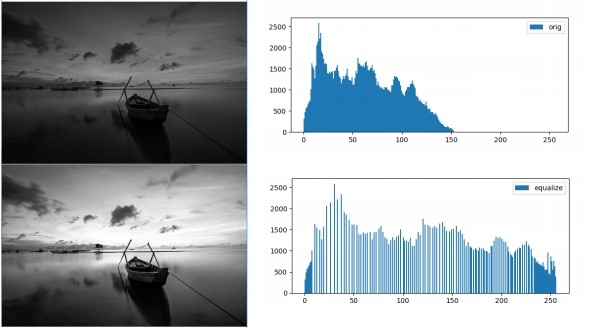

### 4）彩色亮度直方图均衡化

```python
# 彩色图像亮度直方图均衡化
import cv2


# 读取原始图片
original = cv2.imread('../data/sunrise.jpg')
cv2.imshow('Original', original)
# BRG空间转换为YUV空间
# YUV：亮度，色度，饱和度，其中Y通道为亮度通道
yuv = cv2.cvtColor(original, cv2.COLOR_BGR2YUV)
print("yuv.shape:", yuv.shape)


yuv[..., 0] = cv2.equalizeHist(yuv[..., 0])  # 取出亮度通
道，均衡化并赋回原图像
equalized_color = cv2.cvtColor(yuv, cv2.COLOR_YUV2BGR)
cv2.imshow('Equalized Color', equalized_color)


cv2.waitKey()
cv2.destroyAllWindows()

```

执行结果


### 5）色彩提取

从图片中提取特定颜色

```python
import cv2
import numpy as np


im = cv2.imread("../data/opencv2.png")
hsv = cv2.cvtColor(im, cv2.COLOR_BGR2HSV)
cv2.imshow('opencv', im)


# =============指定蓝色值的范围=============
# 蓝色H通道值为120，通常取120上下10的范围
# S通道和V通道通常取50~255间，饱和度太低、色调太暗计算出来的颜色不
准确
minBlue = np.array([110, 50, 50])
maxBlue = np.array([130, 255, 255])
# 确定蓝色区域
mask = cv2.inRange(hsv, minBlue, maxBlue)  # 选取出掩模
# cv2.imshow("mask", mask)
# 通过掩码控制的按位与运算，锁定蓝色区域
blue = cv2.bitwise_and(im, im, mask=mask)  # 执行掩模运算
cv2.imshow('blue', blue)


# =============指定绿色值的范围=============
minGreen = np.array([50, 50, 50])
maxGreen = np.array([70, 255, 255])
# 确定绿色区域
mask = cv2.inRange(hsv, minGreen, maxGreen)
# cv2.imshow("mask", mask)
# 通过掩码控制的按位与运算，锁定绿色区域
green = cv2.bitwise_and(im, im, mask=mask)  # 执行掩模运算
cv2.imshow('green', green)


# =============指定红色值的范围=============
minRed = np.array([0, 50, 50])
maxRed = np.array([30, 255, 255])
# 确定红色区域
mask = cv2.inRange(hsv, minRed, maxRed)
# cv2.imshow("mask", mask)
# 通过掩码控制的按位与运算，锁定红色区域
red = cv2.bitwise_and(im, im, mask=mask)  # 执行掩模运算
cv2.imshow('red', red)


cv2.waitKey()
cv2.destroyAllWindows()

```

执行结果


### 6）二值化与反二值化

```python
# 二值化处理
import cv2 as cv


# 读取图像
img = cv.imread("../data/lena.jpg", 0)
cv.imshow("img", img)  # 显示原始图像


# 二值化
t, rst = cv.threshold(img, 127, 255, cv.THRESH_BINARY)
cv.imshow("rst", rst)  # 显示二值化图像


# 反二值化
t, rst2 = cv.threshold(img, 127, 255,
cv.THRESH_BINARY_INV)
cv.imshow("rst2", rst2)  # 显示反二值化图像


cv.waitKey()
cv.destroyAllWindows()

```

执行结果

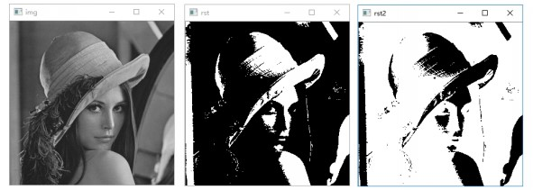

## 3. 图像形态操作

### 1）图像翻转

```python
# 图像翻转示例
import numpy as np
import cv2


im = cv2.imread("../data/Linus.png")
cv2.imshow("src", im)


# 0-垂直镜像
im_flip0 = cv2.flip(im, 0)
cv2.imshow("im_flip0", im_flip0)


# 1-水平镜像
im_flip1 = cv2.flip(im, 1)
cv2.imshow("im_flip1", im_flip1)


cv2.waitKey()
cv2.destroyAllWindows()

```


### 2）图像位置变换

```python
# 图像坐标位置变换
import numpy as np
import cv2


def translate(img, x, y):
	"""
	坐标平移变换
	:param img: 原始图像数据
	:param x:平移的x坐标
	:param y:平移的y坐标
	:return:返回平移后的图像
	"""
    h, w = img.shape[:2]  # 获取图像高、宽
    # 定义平移矩阵
    M = np.float32([[1, 0, x],[0, 1, y]])
    # 使用openCV仿射操作实现平移变换
    shifted = cv2.warpAffine(img, M, (w, h))  # 第三个参数为输出图像尺寸
    return shifted  # 返回平移后的图像

def rotate(img, angle, center=None, scale=1.0):
    """
    图像旋转变换
    :param img: 原始图像数据
    :param angle: 旋转角度
    :param center: 旋转中心，如果为None则以原图中心为旋转中心
    :param scale: 缩放比例，默认为1
    :return: 返回旋转后的图像
    """
    h, w = img.shape[:2]  # 获取图像高、宽
    # 旋转中心默认为图像中心
    if center is None:
        center = (w / 2, h / 2)
        # 计算旋转矩阵
        M = cv2.getRotationMatrix2D(center, angle, scale)
        # 使用openCV仿射变换实现函数旋转
        rotated = cv2.warpAffine(img, M, (w, h))

   return rotated  # 返回旋转后的矩阵


if __name__ == "__main__":
   # 读取并显示原始图像
   im = cv2.imread("../data/Linus.png")
   cv2.imshow("SrcImg", im)

   # 图像向下移动50像素
   shifted = translate(im, 0, 50)
   cv2.imshow("Shifted1", shifted)

   # 图像向左移动40, 下移动40像素
   shifted = translate(im, -40, 40)
   cv2.imshow("Shifted2", shifted)

   # 逆时针旋转45度
   rotated = rotate(im, 45)
   cv2.imshow("rotated1", rotated)

   # 顺时针旋转180度
   rotated = rotate(im, -90)
   cv2.imshow("rorated2", rotated)

   cv2.waitKey()
   cv2.destroyAllWindows()

```


### 3）图像缩放

```python
# 图像缩放示例
import numpy as np
import cv2


im = cv2.imread("../data/Linus.png")
cv2.imshow("src", im)

h, w = im.shape[:2]  # 获取图像尺寸

dst_size = (int(w/2), int(h/2))  # 缩放目标尺寸，宽高均为原来
1/2
resized = cv2.resize(im, dst_size)  # 执行缩放
cv2.imshow("reduce", resized)


dst_size = (200, 300)  # 缩放目标尺寸，宽200，高300
method = cv2.INTER_NEAREST  # 最邻近插值
resized = cv2.resize(im, dst_size, interpolation=method)
 # 执行缩放
cv2.imshow("NEAREST", resized)


dst_size = (200, 300)  # 缩放目标尺寸，宽200，高300
method = cv2.INTER_LINEAR  # 双线性插值
resized = cv2.resize(im, dst_size, interpolation=method)
 # 执行缩放
cv2.imshow("LINEAR", resized)

cv2.waitKey()
cv2.destroyAllWindows()

```

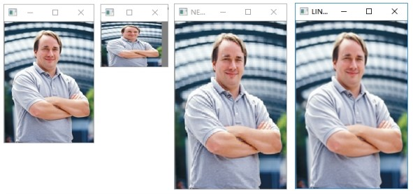

### 4）图像裁剪

```python
import numpy as np
import cv2


# 图像随机裁剪
def random_crop(im, w, h):
   start_x = np.random.randint(0, im.shape[1])  # 裁剪起始x像素
   start_y = np.random.randint(0, im.shape[0])  # 裁剪起始y像素

   new_img = im[start_y:start_y + h, start_x: start_x + w]  # 执行裁剪

   return new_img

# 图像中心裁剪
def center_crop(im, w, h):
   start_x = int(im.shape[1] / 2) - int(w / 2)  # 裁剪起始x像素
   start_y = int(im.shape[0] / 2) - int(h / 2)  # 裁剪起始y像素
   new_img = im[start_y:start_y + h, start_x: start_x + w]  # 执行裁剪

   return new_img

im = cv2.imread("../data/banana_1.png", 1)

new_img = random_crop(im, 200, 200)  # 随机裁剪
new_img2 = center_crop(im, 200, 200)  # 中心裁剪

cv2.imshow("orig", im)
cv2.imshow("random_crop", new_img)
cv2.imshow("center_crop", new_img2)

cv2.waitKey()
cv2.destroyAllWindows()

```

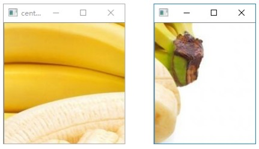

### 5）图像相加

```python
# 图像相加示例
import cv2


a = cv2.imread("../data/lena.jpg", 0)
b = cv2.imread("../data/lily_square.png", 0)
dst1 = cv2.add(a, b)  # 图像直接相加，会导致图像过亮、过白


# 加权求和：addWeighted
# 图像进行加权和计算时，要求src1和src2必须大小、类型相同
dst2 = cv2.addWeighted(a, 0.6, b, 0.4, 0)  # 最后一个参数为亮度调节量

cv2.imshow("a", a)
cv2.imshow("b", b)
cv2.imshow("dst1", dst1)
cv2.imshow("dst2", dst2)

cv2.waitKey()
cv2.destroyAllWindows()

```


### 6）图像相减

```python
# 图像相减运算示例
import cv2


a = cv2.imread("../data/3.png", 0)
b = cv2.imread("../data/4.png", 0)

dst = cv2.subtract(a, b)  # 两幅图像相减，是求出图像的差异

cv2.imshow("a", a)
cv2.imshow("b", b)
cv2.imshow("dst1", dst)

cv2.waitKey()
cv2.destroyAllWindows()

```


### 7）透视变换

```python
# 透视变换
import cv2
import numpy as np


img = cv2.imread('../data/pers.png')
rows, cols = img.shape[:2]
print(rows, cols)


pts1 = np.float32([[58, 2], [167, 9], [8, 196], [126,
196]])# 输入图像四个顶点坐标
pts2 = np.float32([[16, 2], [167, 8], [8, 196], [169,
196]])# 输出图像四个顶点坐标


# 生成透视变换矩阵
M = cv2.getPerspectiveTransform(pts1, # 输入图像四个顶点坐标
                               pts2) # 输出图像四个顶点坐标
print(M.shape)
# 执行透视变换，返回变换后的图像
dst = cv2.warpPerspective(img, # 原始图像
							M, # 3*3的变换矩阵
							(cols, rows)) # 输出图像大小
# 生成透视变换矩阵
M = cv2.getPerspectiveTransform(pts2, # 输入图像四个顶点坐标
pts1) # 输出图像四个顶点坐标
# 执行透视变换，返回变换后的图像
dst2 = cv2.warpPerspective(dst, # 原始图像
                         M, # 3*3的变换矩阵
						(cols, rows)) # 输出图像大小
             
cv2.imshow("img", img)
cv2.imshow("dst", dst)
cv2.imshow("dst2", dst2)


cv2.waitKey()
cv2.destroyAllWindows()

```

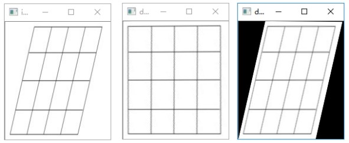

### 8）图像腐蚀

```python
# 图像腐蚀
import cv2
import numpy as np


# 读取原始图像
im = cv2.imread("../data/5.png")
cv2.imshow("im", im)


# 腐蚀
kernel = np.ones((3, 3), np.uint8) # 用于腐蚀计算的核
erosion = cv2.erode(im, # 原始图像
                   kernel,  # 腐蚀核
                   iterations=3) # 迭代次数
cv2.imshow("erosion", erosion)


cv2.waitKey()
cv2.destroyAllWindows()

```

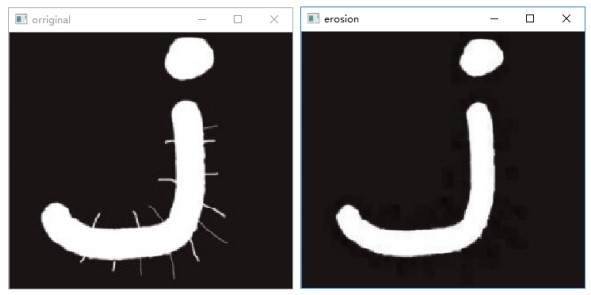

### 9）图像膨胀

```python
# 图像膨胀
import cv2
import numpy as np


# 读取原始图像
im = cv2.imread("../data/6.png")
cv2.imshow("im", im)


# 膨胀
kernel = np.ones((3, 3), np.uint8)  # 用于膨胀计算的核
dilation = cv2.dilate(im,  # 原始图像
                     kernel,  # 膨胀核
                     iterations=5)  # 迭代次数
cv2.imshow("dilation", dilation)
cv2.waitKey()

```

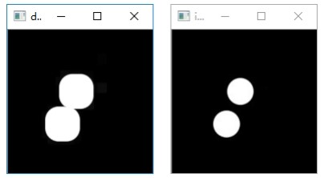

### 10）图像开运算

```python
# 开运算示例
import cv2
import numpy as np


# 读取原始图像
im1 = cv2.imread("../data/7.png")
im2 = cv2.imread("../data/8.png")

# 执行开运算
k = np.ones((10, 10), np.uint8)
r1 = cv2.morphologyEx(im1, cv2.MORPH_OPEN, k)
r2 = cv2.morphologyEx(im2, cv2.MORPH_OPEN, k)

cv2.imshow("im1", im1)
cv2.imshow("result1", r1)

cv2.imshow("im2", im2)
cv2.imshow("result2", r2)

cv2.waitKey()
cv2.destroyAllWindows()

```


### 11）图像闭运算

```python
# 闭运算示例
import cv2
import numpy as np


# 读取图像
im1 = cv2.imread("../data/9.png")
im2 = cv2.imread("../data/10.png")

# 闭运算
k = np.ones((8, 8), np.uint8)
r1 = cv2.morphologyEx(im1, cv2.MORPH_CLOSE, k,
iterations=2)
r2 = cv2.morphologyEx(im2, cv2.MORPH_CLOSE, k,
iterations=2)

cv2.imshow("im1", im1)
cv2.imshow("result1", r1)
cv2.imshow("im2", im2)
cv2.imshow("result2", r2)


cv2.waitKey()
cv2.destroyAllWindows()

```


### 12）形态学梯度

```python
# 形态学梯度示例
import cv2
import numpy as np


o = cv2.imread("../data/6.png")

k = np.ones((3, 3), np.uint8)
r = cv2.morphologyEx(o, cv2.MORPH_GRADIENT, k)

cv2.imshow("original", o)
cv2.imshow("result", r)

cv2.waitKey()
cv2.destroyAllWindows()

```

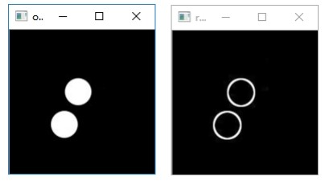

## 4. 图像梯度处理

### 1）模糊处理

```python
# 图像模糊处理示例
import cv2
import numpy as np


## 中值滤波
im = cv2.imread("../data/lena.jpg", 0)
cv2.imshow("orig", im)
# 调用medianBlur中值模糊
# 第二个参数为滤波模板的尺寸大小，必须是大于1的奇数，如3、5、7
im_median_blur = cv2.medianBlur(im, 5)
cv2.imshow('median_blur', im_median_blur)


# 均值滤波
# 第二个参数为滤波模板的尺寸大小
im_mean_blur = cv2.blur(im, (3, 3))
cv2.imshow("mean_blur", im_mean_blur)


# 高斯滤波
# 第三个参数为高斯核在X方向的标准差
im_gaussian_blur = cv2.GaussianBlur(im, (5, 5), 3)
cv2.imshow("gaussian_blur", im_gaussian_blur)


# 使用高斯算子和filter2D自定义滤波操作
gaussan_blur = np.array([
                    [1, 4, 7, 4, 1],
                    [4, 16, 26, 16, 4],
                    [7, 26, 41, 26, 7],
                    [4, 16, 26, 16, 4],
                    [1, 4, 7, 4, 1]], np.float32) / 273

 
# 使用filter2D, 第二个参数为目标图像的所需深度, -1表示和原图像相同
im_gaussian_blur2 = cv2.filter2D(im, -1, gaussan_blur)  
cv2.imshow("gaussian_blur2", im_gaussian_blur2)


cv2.waitKey()
cv2.destroyAllWindows()

```


### 2）图像锐化处理

```python
# 图像锐化示例
import cv2
import numpy as np


im = cv2.imread("../data/lena.jpg", 0)
cv2.imshow("orig", im)


# 锐化算子1
sharpen_1 = np.array([[-1, -1, -1],
                    [-1, 9, -1],
                    [-1, -1, -1]])

# 使用filter2D进行滤波操作
im_sharpen1 = cv2.filter2D(im, -1, sharpen_1)
cv2.imshow("sharpen_1", im_sharpen1)


# 锐化算子2
sharpen_2 = np.array([[0, -1, 0],
                    [-1, 8, -1],
                    [0, 1, 0]]) / 4.0

 
# 使用filter2D进行滤波操作
im_sharpen2 = cv2.filter2D(im, -1, sharpen_2)
cv2.imshow("sharpen_2", im_sharpen2)


cv2.waitKey()
cv2.destroyAllWindows()

```


### 3）边沿检测

```python
# 边沿检测示例
import cv2 as cv


im = cv.imread('../data/lily.png', 0)
cv.imshow('Original', im)


# # 水平方向滤波
# hsobel = cv.Sobel(im, cv.CV_64F, 1, 0, ksize=5)
# cv.imshow('H-Sobel', hsobel)
# # 垂直方向滤波
# vsobel = cv.Sobel(im, cv.CV_64F, 0, 1, ksize=5)
# cv.imshow('V-Sobel', vsobel)
# 两个方向滤波
sobel = cv.Sobel(im, cv.CV_64F, 1, 1, ksize=5)
cv.imshow('Sobel', sobel)


# Laplacian滤波：对细节反映更明显
laplacian = cv.Laplacian(im, cv.CV_64F)
cv.imshow('Laplacian', laplacian)


# Canny边沿提取
canny = cv.Canny(im,
                50, # 滞后阈值
                240) # 模糊度
cv.imshow('Canny', canny)
cv.waitKey()
cv.destroyAllWindows()

```


## 5. 轮廓处理

边缘检测虽然能够检测出边缘，但边缘是不连续的，检测到的边缘并不是一个整体。图像轮廓是指将边缘连接起来形成的一个整体，用于后续的计算。

OpenCV提供了查找图像轮廓的函数cv2.findContours（），该函数能够查找图像内的轮廓信息，而函数cv2.drawContours（）能够将轮廓绘制出来。图像轮廓是图像中非常重要的一个特征信息，通过对图像轮廓的操作，我们能够获取目标图像的大小、位置、方向等信息。一个轮廓对应着一系列的点，这些点以某种方式表示图像中的一条曲线。

### 1）查找并绘制轮廓

查找轮廓函数：cv2.findContours

语法格式： 

image,contours,hierarchy=cv2.findContours（image,mode,method）

**返回值**

image：与函数参数中的原始图像image一致

contours：返回的轮廓。该返回值返回的是一组轮廓信息，每个轮廓都是由若干个点所构成的（每个轮廓为一个list表示）。例如，

contours[i]是第i个轮廓（下标从0开始）,contours[i][j]是第i个轮廓内的第j个点

hierarchy：图像的拓扑信息（反映轮廓层次）。图像内的轮廓可能位于不同的位置。比如，一个轮廓在另一个轮廓的内部。在这种情况					下，我们将外部的轮廓称为父轮廓，内部的轮廓称为子轮廓。按照上述关系分类，一幅图像中所有轮廓之间就建立了父子关					系。每个轮廓contours[i]对应4个元素来说明当前轮廓的层次关系。其形式为：[Next,Previous,First_Child,Parent]，分别表					示后一个轮廓的索引编号、前一个轮廓的索引编号、第1个子轮廓的索引编号、父轮廓的索引编号

**参数**

image：原始图像。灰度图像会被自动处理为二值图像。在实际操作时，可以根据需要，预先使用阈值处理等函数将待查找轮廓的图像处			理为二值图像。

mode：轮廓检索模式，有以下取值和含义：


| **取值**          | **含义**                                                     |
| ----------------- | ------------------------------------------------------------ |
| cv2.RETR_EXTERNAL | 只检测外轮廓                                                 |
| cv2.RETR_LIST     | 对检测到的轮廓不建立等级关系                                 |
| cv2.RETR_CCOMP    | 检索所有轮廓并将它们组织成两级层次结构，  上面的一层为外边界，下面的一层为内孔的边  界 |
| cv2.RETR_TREE     | 建立一个等级树结构的轮廓                                     |


method：轮廓的近似方法，主要有如下取值：


| **取值**                   | **含义**                                                     |
| -------------------------- | ------------------------------------------------------------ |
| cv2.CHAIN_APPROX_NONE      | 存储所有的轮廓点，相邻两个点  的像素位置差不超过1，即  max（abs（x1-x2）,abs（y2-  y1））=1 |
| cv2.CHAIN_APPROX_SIMPLE    | 压缩水平方向、垂直方向、对角  线方向的元素，只保留该方向的  终点坐标 |
| cv2.CHAIN_APPROX_TC89_L1   | 使用teh-Chinl chain近似算法的  一种风格                      |
| cv2.CHAIN_APPROX_TC89_KCOS | 使用teh-Chinl chain近似算法的  一种风格                      |

 

 

 注意事项
			待处理的源图像必须是灰度二值图 

​			都是从黑色背景中查找白色对象。因此，对象必须是白色的，背景必须 是黑色的 

​			在OpenCV 4.x中，函数cv2.findContours（）仅有两个返回值
  绘制轮廓：

​			drawContours函数 

​			语法格式：image=cv2.drawContours(image, contours,contourIdx, color) 

​			参数 image：待绘制轮廓的图像 			

​					contours：需要绘制的轮廓，该参数的类型与函数 cv2.findContours（）的输出 contours 相同，都是list类型 

​					contourIdx：需要			绘制的边缘索引，告诉函数cv2.drawContours（） 要绘制某一条轮廓还是全部轮廓。如果该参数是											一个整数或者为零，则 表示绘			制对应索引号的轮廓；如果该值为负数（通常为“-1”），则表示 绘制全部											轮廓。 

​					color：绘制的颜色，用BGR格式表示

```python
# 查找图像轮廓
import cv2
import numpy as np
im = cv2.imread("../data/3.png")
cv2.imshow("orig", im)
gray = cv2.cvtColor(im, cv2.COLOR_BGR2GRAY)
# 图像二值化处理，将大于阈值的设置为最大值，其它设置为0
ret, binary = cv2.threshold(gray, 127, 255, 
cv2.THRESH_BINARY)
# 查找图像边沿：cv2.findContours img, contours, hierarchy = cv2.findContours(binary,  # 二值化处理后的图像
                                            cv2.RETR_EXTERNAL,  # 只检测外轮廓
                                            cv2.CHAIN_APPROX_NONE)  # 存储所有的轮廓点 
# 打印所有轮廓值
arr_cnt = np.array(contours)
print(arr_cnt[0].shape)
print(arr_cnt[1].shape)
print(arr_cnt[2].shape)
print(arr_cnt[3].shape)
# print(arr_cnt[0])
# 绘制边沿 
im_cnt = cv2.drawContours(im,  # 绘制图像                          
						contours,  # 轮廓点列表                          
						-1,  # 绘制全部轮廓                          
						(0, 0, 255),  # 轮廓颜色：红色                          
						2)  # 轮廓粗细
cv2.imshow("im_cnt", im_cnt)
cv2.waitKey()
cv2.destroyAllWindows()

```


### 2）绘制矩形包围框

函数cv2.boundingRect（）能够绘制轮廓的矩形边界。该函数的语法格式为：

```python
retval = cv2.boundingRect(array)  # 格式一
x,y,w,h = cv2.boundingRect(array) # 格式二
"""
    参数：
    array：是灰度图像或轮廓
    返回值：
    retval：表示返回的矩形边界的左上角顶点的坐标值及矩形边界的宽度和
    高度
    x, y, w, h: 矩形边界左上角顶点的x坐标、y坐标、宽度、高度
"""

```

```python
# 绘制图像矩形轮廓
import cv2
import numpy as np


im = cv2.imread("../data/cloud.png", 0)
cv2.imshow("orig", im)


# 提取图像轮廓
ret, binary = cv2.threshold(im, 127, 255,
cv2.THRESH_BINARY)
img, contours, hierarchy = cv2.findContours(binary,
                                           cv2.RETR_LIST,
 # 不建立等级关系
                                         
 cv2.CHAIN_APPROX_NONE)  # 存储所有的轮廓点
print("contours[0].shape:", contours[0].shape)


# 返回轮廓定点及边长
x, y, w, h = cv2.boundingRect(contours[0])  # 计算矩形包围框
的x,y,w,h
print("x:", x, "y:", y, "w:", w, "h:", h)


# 绘制矩形包围框
brcnt = np.array([[[x, y]], [[x + w, y]], [[x + w, y + h]], [[x, y + h]]])
cv2.drawContours(im,  # 绘制图像
                [brcnt],  # 轮廓点列表
                -1,  # 绘制全部轮廓
                (255, 255, 255),  # 轮廓颜色：白色
                2)  # 轮廓粗细


cv2.imshow("result", im)  # 显示绘制后的图像


cv2.waitKey()
cv2.destroyAllWindows()

```


### 3）绘制圆形包围圈

函数 cv2.minEnclosingCircle（）通过迭代算法构造一个对象的面积最小包围圆形。该函数的语法格式为：

```python
center,radius=cv2.minEnclosingCircle(points)
"""
    参数：
    points: 轮廓数组
    返回值：
    center: 最小包围圆形的中心
    radius: 最小包围圆形的半径
"""

```

```python
# 绘制最小圆形
import cv2
import numpy as np


im = cv2.imread("../data/cloud.png", 0)
cv2.imshow("orig", im)


# 提取图像轮廓
ret, binary = cv2.threshold(im, 127, 255,
cv2.THRESH_BINARY)
img, contours, hierarchy = cv2.findContours(binary,
cv2.RETR_LIST, cv2.CHAIN_APPROX_NONE)


(x, y), radius = cv2.minEnclosingCircle(contours[0])
center = (int(x), int(y))
radius = int(radius)
cv2.circle(im, center, radius, (255, 255, 255), 2)  # 绘制圆


cv2.imshow("result", im)  # 显示绘制后的图像


cv2.waitKey()
cv2.destroyAllWindows()

```


### 4）绘制最佳拟合椭圆

函数cv2.fitEllipse（）可以用来构造最优拟合椭圆。该函数的语法格式是：

```python
retval=cv2.fitEllipse(points)
"""
    参数：
    points: 轮廓
    返回值：
    retval: 为RotatedRect类型的值，包含外接矩形的质心、宽、高、旋
    转角度等参数信息，这些信息正好与椭圆的中心点、轴长度、旋转角度等信息吻
    合
"""

```

```python
# 绘制最优拟合椭圆
import cv2
import numpy as np


im = cv2.imread("../data/cloud.png")
gray = cv2.cvtColor(im, cv2.COLOR_BGR2GRAY)
cv2.imshow("orig", gray)


# 提取图像轮廓
ret, binary = cv2.threshold(gray, 127, 255,
cv2.THRESH_BINARY)
img, contours, hierarchy = cv2.findContours(binary, cv2.RETR_LIST, cv2.CHAIN_APPROX_NONE)
ellipse = cv2.fitEllipse(contours[0])  # 拟合最优椭圆
print("ellipse:", ellipse)
cv2.ellipse(im, ellipse, (0, 0, 255), 2)  # 绘制椭圆


cv2.imshow("result", im)  # 显示绘制后的图像


cv2.waitKey()
cv2.destroyAllWindows()


```


### 5）逼近多边形

函数cv2.approxPolyDP（）用来构造指定精度的逼近多边形曲线。该函数的语法格式为：

```python
approxCurve = cv2.approxPolyDP(curve,epsilon,closed)
"""
    参数：
    curve: 轮廓
    epsilon: 精度，原始轮廓的边界点与逼近多边形边界之间的最大距离
    closed: 布尔类型，该值为True时，逼近多边形是封闭的；否则，逼近
    多边形是不封闭的
    返回值：
    approxCurve: 逼近多边形的点集
"""

```

```python
# 构建多边形，逼近轮廓
import cv2
import numpy as np
im = cv2.imread("../data/cloud.png")
cv2.imshow("im", im)
gray = cv2.cvtColor(im, cv2.COLOR_BGR2GRAY)


# 提取图像轮廓
ret, binary = cv2.threshold(gray, 127, 255,
cv2.THRESH_BINARY)
img, contours, hierarchy = cv2.findContours(binary, cv2.RETR_LIST, cv2.CHAIN_APPROX_NONE)
# 精度一
adp = im.copy()
epsilon = 0.005 * cv2.arcLength(contours[0], True)  # 精度，根据周长计算
approx = cv2.approxPolyDP(contours[0], epsilon, True)  #构造多边形
adp = cv2.drawContours(adp, [approx], 0, (0, 0, 255), 2)
 # 绘制多边形
cv2.imshow("result_0.005", adp)
# 精度二
adp2 = im.copy()
epsilon = 0.01 * cv2.arcLength(contours[0], True)  # 精度，根据周长计算
approx = cv2.approxPolyDP(contours[0], epsilon, True)  #构造多边形
adp = cv2.drawContours(adp2, [approx], 0, (0, 0, 255), 2)
 # 绘制多边形
cv2.imshow("result_0.01", adp2)


cv2.waitKey()
cv2.destroyAllWindows()

```


## 6.视频基本处理 

### 1）读取摄像头 

```python
import numpy as np
import cv2
cap = cv2.VideoCapture(0)  # 实例化VideoCapture对象, 0表示第一个摄像头
while cap.isOpened():    ret, frame = cap.read()  # 捕获帧
    cv2.imshow("frame", frame)    
    c = cv2.waitKey(1)  # 等待1毫秒，等待用户输入    
    if c == 27:  # ESC键
        break
cap.release()  # 释放摄像头
cv2.destroyAllWindows()
```

### 2）播放视频文件

```python
import numpy as np
import cv2


cap = cv2.VideoCapture("D:\\tmp\\min_nong.mp4")  # 打开视频文件
while cap.isOpened():
   ret, frame = cap.read()  # 读取帧
   cv2.imshow("frame", frame)  # 显示
   c = cv2.waitKey(25)
   if c == 27:  # ESC键
       break


cap.release()  # 释放视频设备
cv2.destroyAllWindows()

```

### 3）捕获并保存视频

```python
import numpy as np
import cv2


""" 
    编解码4字标记值说明
    cv2.VideoWriter_fourcc（'I','4','2','0'）表示未压缩的YUV颜色
    编码格式，色度子采样为4:2:0。
    该编码格式具有较好的兼容性，但产生的文件较大，文件扩展名为.avi。
    cv2.VideoWriter_fourcc（'P','I','M','I'）表示 MPEG-1编码类
    型，生成的文件的扩展名为.avi。
    cv2.VideoWriter_fourcc（'X','V','I','D'）表示MPEG-4编码类型。
    如果希望得到的视频大小为平均值，可以选用这个参数组合。
    该组合生成的文件的扩展名为.avi。
    cv2.VideoWriter_fourcc（'T','H','E','O'）表示Ogg Vorbis编码
    类型，文件的扩展名为.ogv。
    cv2.VideoWriter_fourcc（'F','L','V','I'）表示Flash视频，生成
    的文件的扩展名为.flv。
"""
cap = cv2.VideoCapture(0)
fourcc = cv2.VideoWriter_fourcc("I", "4", "2", "0")  # 编解码4字标记值
out = cv2.VideoWriter("output.avi",  # 文件名
                     fourcc,  # 编解码类型
                     20,  # fps(帧速度)
					(640, 480))  # 视频分辨率

while cap.isOpened():
   ret, frame = cap.read()  # 读取帧
   if ret == True:
       out.write(frame)  # 写入帧
       cv2.imshow("frame", frame)
       if cv2.waitKey(1) == 27:  # ESC键
           break
   else:
       break


cap.release()
out.release()
cv2.destroyAllWindows()

```

# 三、综合案例

## 1. 利用OpenCV实现图像校正

### 1）任务描述

我们对图像中的目标进行分析和检测时，目标往往具有一定的倾斜角度，自然条件下拍摄的图像，完全平正是很少的。因此，需要将倾斜的目标“扶正”的过程就就叫做图像矫正。该案例中使用的原始图像如下：

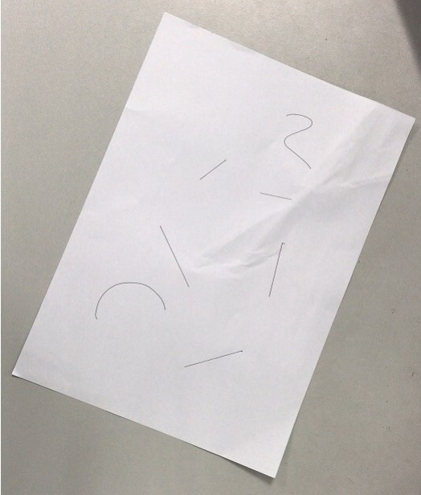

### 2）代码

```
# 图像校正示例
import cv2
import numpy as np


im = cv2.imread("../data/paper.jpg")
gray = cv2.cvtColor(im, cv2.COLOR_BGR2GRAY)
cv2.imshow('im', im)


# 模糊
blurred = cv2.GaussianBlur(gray, (5, 5), 0)
# 膨胀
dilate = cv2.dilate(blurred,
                 
 cv2.getStructuringElement(cv2.MORPH_RECT, (3, 3))) # 根据函数返回kernel
# 检测边沿
edged = cv2.Canny(dilate,  # 原始图像
                 30, 120,  # 滞后阈值、模糊度
                 3)  # 孔径大小
# cv2.imshow("edged", edged)


# 轮廓检测
cnts = cv2.findContours(edged.copy(),
                       cv2.RETR_EXTERNAL,  # 只检测外轮廓
                       cv2.CHAIN_APPROX_SIMPLE)  # 只保留
该方向的终点坐标
cnts = cnts[1]
docCnt = None


# 绘制轮廓
im_cnt = cv2.drawContours(im,  # 绘制图像
                         cnts,  # 轮廓点列表
                         -1,  # 绘制全部轮廓
						(0, 0, 255),  # 轮廓颜色：红色
                         2)  # 轮廓粗细
cv2.imshow("im_cnt", im_cnt)


# 计算轮廓面积，并排序
if len(cnts) > 0:
   cnts = sorted(cnts,  # 数据
                 key=cv2.contourArea,  # 排序依据，根据contourArea函数结果排序
                 reverse=True)
   for c in cnts:
       peri = cv2.arcLength(c, True)  # 计算轮廓周长
       approx = cv2.approxPolyDP(c, 0.02 * peri, True)  #轮廓多边形拟合
       # 轮廓为4个点表示找到纸张
       if len(approx) == 4:
           docCnt = approx
           break

print(docCnt)


# 用圆圈标记处角点
points = []
for peak in docCnt:
   peak = peak[0]
   # 绘制圆
   cv2.circle(im,  # 绘制图像
              tuple(peak), 10,  # 圆心、半径
              (0, 0, 255), 2)  # 颜色、粗细
   points.append(peak)  # 添加到列表
print(points)
cv2.imshow("im_point", im)


# 校正
src = np.float32([points[0], points[1], points[2], points[3]])  # 原来逆时针方向四个点
dst = np.float32([[0, 0], [0, 488], [337, 488], [337, 0]])
 # 对应变换后逆时针方向四个点
m = cv2.getPerspectiveTransform(src, dst)  # 生成透视变换矩阵
result = cv2.warpPerspective(gray.copy(), m, (337, 488))
 # 透视变换
cv2.imshow("result", result)  # 显示透视变换结果


cv2.waitKey()
cv2.destroyAllWindows()

```

### 3）执行结果

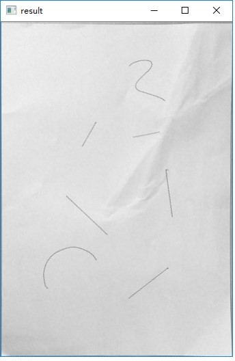

## **2.** 利用OpenCV检测芯片瑕疵

### 1）任务描述

利用图像技术，检测出芯片镀盘区域瑕疵。样本图像中，粉红色区域为镀盘区域，镀盘内部空洞为瑕疵区域，利用图像技术检测镀盘是否存在瑕疵，如果存在则将瑕疵区域标记出来。

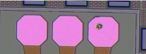

### 2）代码

```python
import cv2
import numpy as np
import math


# 第一步：图像预处理
## 1. 转换成灰度图像，进行二值化处理
im_cpu = cv2.imread("../../data/CPU3.png")
im_gray = cv2.cvtColor(im_cpu, cv2.COLOR_BGR2GRAY)  # 转换成灰度图像


# 提取出度盘轮廓
ret, im_bin = cv2.threshold(im_gray, 162, 255,
cv2.THRESH_BINARY)  # 图像二值化
cv2.imshow("im_cpu", im_cpu)
cv2.imshow("im_gray", im_gray)
cv2.imshow("im_bin", im_bin)


# 提取轮廓、绘制边沿
img, contours, hierarchy = cv2.findContours(im_bin,
cv2.RETR_EXTERNAL, cv2.CHAIN_APPROX_NONE)


# 绘制前景对象轮廓
mask = np.zeros(im_bin.shape, np.uint8)
mask = cv2.drawContours(mask, contours, -1, (255, 0, 0), -1)  # 绘制实心轮廓
cv2.imshow("mask", mask)


# 前景实心轮廓图和二值化图相减
im_sub = cv2.subtract(mask, im_bin)
cv2.imshow("im_sub", im_sub)


# 图像闭运算，先膨胀后腐蚀，去除内部毛刺
k = np.ones((10, 10), np.uint8)
im_close = cv2.morphologyEx(im_sub, cv2.MORPH_CLOSE, k, iterations=3)
cv2.imshow("im_close", im_close)


# 提取、绘制轮廓、计算面积
img, contours, hierarchy = cv2.findContours(im_close, cv2.RETR_EXTERNAL, cv2.CHAIN_APPROX_NONE)


(x, y), radius = cv2.minEnclosingCircle(contours[1])
center = (int(x), int(y))
radius = int(radius)
print("center:", center, " radius:", radius)
cv2.circle(im_close, center, radius, (255, 0, 0), 2)  # 绘制圆
cv2.imshow("im_gaussian_blur2", im_close)


# 在原始图片上绘制瑕疵
cv2.circle(im_cpu, center, radius, (0, 0, 255), 2)  # 绘制圆
cv2.imshow("im_cpu2", im_cpu)


#计算面积
area = math.pi * radius * radius
print("area:", area)
if area > 12:
   print("度盘表面有缺陷")


cv2.waitKey()
cv2.destroyAllWindows()

```

### 3）执行结果

