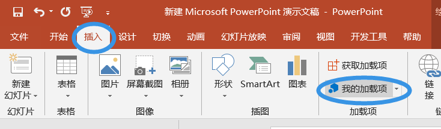
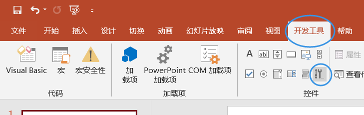
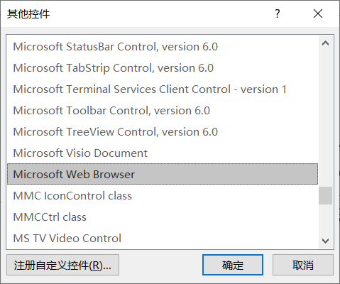
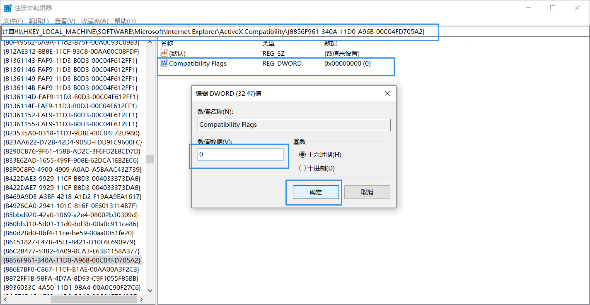
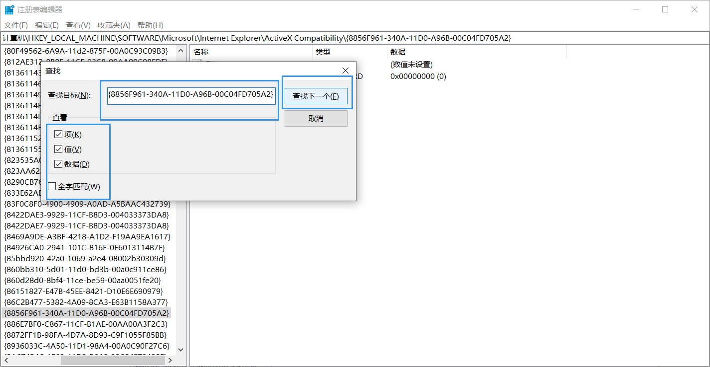
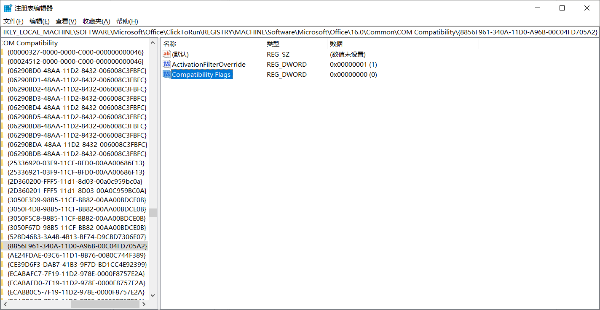
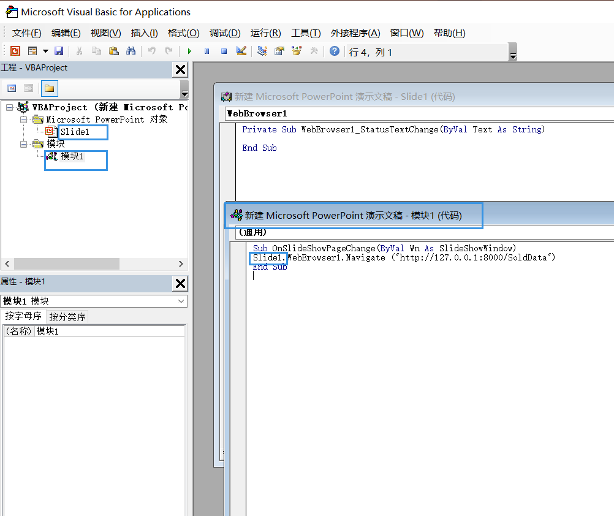
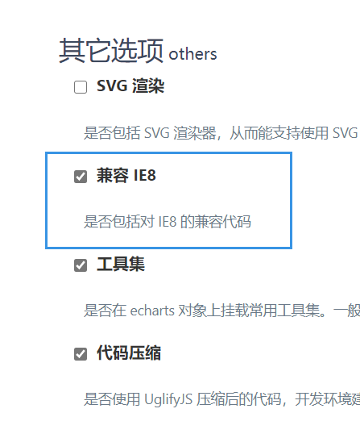
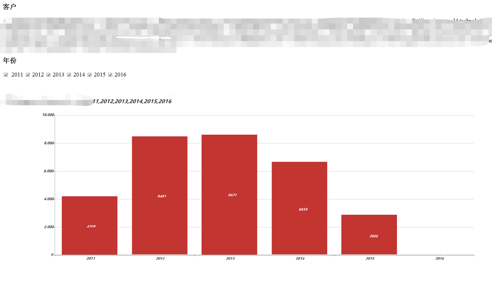

# PPT 中打开HTTP动态网页

## 方式一

​	加载项中有一个Web Viewer，但是该方式只支持https，而且ssl证书必须被信任，所以自建的网站服务很难成功使用该功能。如果是打开别人的大型网站，该方式是首选方式，注：添加该加载项时，可能会需要搭梯子。



## 方式二

### 1.ppt选项，自定义的功能区  显示开发工具选项

### 2.打开ppt  开发工具  控件  其他控件  选择Microsoft web browser





2.0大概率添加失败，点击确定发现无法插入activex插件，下述修改两处注册表键值

2.1 打开注册表编辑器 win+r  regedit

2.2 定位到：计算机\HKEY_LOCAL_MACHINE\SOFTWARE\Microsoft\Internet Explorer\ActiveX Compatibility\{8856F961-340A-11D0-A96B-00C04FD705A2}

将值修改为0



2.3 右键查找，\{8856F961-340A-11D0-A96B-00C04FD705A2}

将值改为0

查找结果路径类似于（不同版本的office该路径会略有不同，所以采用搜索方式定位）：计算机\HKEY_LOCAL_MACHINE\SOFTWARE\Microsoft\Office\ClickToRun\REGISTRY\MACHINE\Software\Microsoft\Office\16.0\Common\COM Compatibility\{8856F961-340A-11D0-A96B-00C04FD705A2}





完成后重新打开ppt，添加控件

如果第二份注册表始终找不到的，可以下载我的网盘分享的office，我就是原装的找不到第二份注册表，重装了下面的之后才能找到。

链接: https://pan.baidu.com/s/1lIPiUcR4WwVDjYJW_mElTQ 提取码: 9nu2 复制这段内容后打开百度网盘手机App，操作更方便哦

### 3.对控件进行编辑

插入控件后可以拖动调整位置大小

双击控件进入编辑界面，选择导航栏    插入  模块 

在新建的模块中添加代码：

```vb
Sub OnSlideShowPageChange(ByVal Wn As SlideShowWindow)
    Slide166.WebBrowser1.Navigate ("http://127.0.0.1:8000")
End Sub

# Slide166，中的166是根据上一个页面的名称来命名的，如果你上一个页面是Slide1，那么模块的页面就需要改成Slide1
```



然后关闭代码窗口，回到ppt界面即可

### 4.自己的搭建的http服务，展示Echarts需要的环境

 web browser控件采用的时IE8的引擎，很多JS语法不支持，而且会报错

#### jquery

所以在自己的页面中，尽量采用低版本的jquery（我采用的是1.10.2）

#### Echarts

百度的Echarts支持自定义版本

进入官方下载地址：[下载 - Apache ECharts (incubating)](https://echarts.apache.org/zh/download.html)

往下拉，点击在线定制，放心点，免费的

其它选项  兼容IE８　　　一定要选，其它的看自己的需求



完成后会给一个Echarts的JS文件

#### 对Json的支持,json2.js

web browser控件并不支持json,

如果你在js中写ajax诸如:JSON.stringify({})之类的代码会报错,此时需要另一个JS文件来支持这种写法

json2.js是一个json插件，下载地址：https://github.com/douglascrockford/JSON-js

它包含两个方法，JSON.stringify(value, replacer, space)和JSON.parse(text, reviver)

#### 对console的支持

调用Echarts时难免触发console.wan之类的函数,在web browser中也会报错,提示console未定义

此时我们需要在JS中自己定义一个空的console,以防止报错

```js
var console = {
    assert: function () {
    },
    clear: function () {
    },
    count: function () {
    },
    debug: function () {
    },
    dir: function () {
    },
    dirxml: function () {
    },
    error: function () {
    },
    exception: function () {
    },
    group: function (name) {
    },
    groupCollapsed: function () {
    },
    groupEnd: function () {
    },
    info: function () {
    },
    log: function () {
    },
    memoryProfile: function () {
    },
    memoryProfileEnd: function () {
    },
    profile: function () {
    },
    profileEnd: function () {
    },
    table: function () {
    },
    time: function () {
    },
    timeEnd: function () {
    },
    timeStamp: function () {
    },
    trace: function () {
    },
    warn: function () {
    }
};
```

最后效果图:




