[TOC]

# **程序结构**

## **模块 Module**

### **定义**

包含一系列数据、函数、类的文件，通常以.py结尾。

### **作用**

让一些相关的数据，函数，类有逻辑的组织在一起，使逻辑结构更加清晰。

有利于多人合作开发。

### **导入**

#### **import** 

1. 语法： 

    import 模块名

    import 模块名 as 别名

    ```python
    #导入方式一：import 模块名称
    #使用：模块名称.成员
    #适用性：面向过程(全局变量、函数)
    import module01
    
    module01.func01()
    
    c01 = module01.MyCalss()
    c01.func03()
    
    import module01 as m
    m.func01()
    ```

2. 作用：将某模块整体导入到当前模块中

3. 使用：模块名.成员

#### **from import** 

1. 语法：

    from 模块名 import 成员名[ as 别名1]

2. 作用：将模块内的一个或多个成员导入到当前模块的作用域中。

3. 使用：直接使用成员名

    ```python
    # 导入方式二：from 模块 import 成员
    # 使用：直接使用成员名称
    # 适用性：面向对象(类)
    
    from module01 import func01
    from module02 import func02
    
    func01()
    func02()
    ```

    

 

#### **from import **

1. 语法：from 模块名 import *

2.   作用：将某模块的所有成员导入到当前模块。

3. <font color='red'>模块中以下划线(_)开头的属性，不会被导入，通常称这些成员为隐藏成员。</font>

    ```python
    # 导入方式三：from 模块 import  *
    # 使用： 直接使用成员名称
    # 适用性：面向对象(类)/导入多个更方便
    # 注意：导入的多个模块成员容易发生冲突
    
    from module01 import *
    from module02 import *
    
    func01()
    func02()
    c01 = MyCalss()
    c01.func03()
    ```

### **模块变量**

\__all__变量：定义可导出成员，仅对from xx import *语句有效。

\__name__变量：模块自身名字，可以判断是否为主模块。

当此模块作为主模块(第一个运行的模块)运行时，\_\_name\_\_   绑定  '\__main__'，不是主模块，而是被其它模块导入时,存储模块名。

### **加载过程**

在模块导入时，模块的所有语句会执行。

如果一个模块已经导入，则再次导入时不会重新执行模块内的语句。

### **分类**

1. 内置模块(builtins)，在解析器的内部可以直接使用。

2.   标准库模块，安装Python时已安装且可直接使用。

3. 第三方模块（通常为开源），需要自己安装。

4.   用户自己编写的模块（可以作为其他人的第三方模块）


## **包package**

### **定义**

将模块以文件夹的形式进行分组管理。

### **作用**

让一些相关的模块组织在一起，使逻辑结构更加清晰。

### **导入**

import 包名.模块名 [as 模块新名]

import 包名.子包名.模块名 [as 模块新名]

 

from 包名 import 模块名 [as 模块新名]

from 包名.子包名 import 模块名 [as 模块新名]

from 包名.子包名.模块名 import 成员名 [as 属性新名]

 

\# 导入包内的所有子包和模块

from 包名 import *

from 包名.模块名 import *

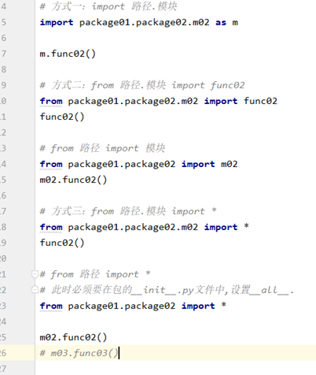

## **\__init__.py** **文件**

是包内必须存在的文件

会在包加载时被自动调用

## **\__all__**

记录from 包 import * 语句需要导入的模块

案例：

1. 根据下列结构，创建包与模块。

    my_ project /

    ​		main.py

    ​		common/

    ​				\__init__.py

    ​				list_helper.py

    ​		skill_system/

    ​				\__init__.py

    ​				skill_deployer.py

     				skill_manager.py

2. 在main.py中调用skill_manager.py中实例方法。

3.   在skill_manager.py中调用skill_deployer.py中实例方法。

4.   在skill_deployer.py中调用list_helper.py中类方法。


## **搜索顺序**

​	内置模块

​	sys.path 提供的路径

# 异常处理Error

## **异常**

1. 定义：运行时检测到的错误。

2.   现象：当异常发生时，程序不会再向下执行，而转到函数的调用语句。

3. 常见异常类型：

    -- 名称异常(NameError)：变量未定义。

    -- 类型异常(TypeError)：不同类型数据进行运算。

    -- 索引异常(IndexError)：超出索引范围。

    -- 属性异常(AttributeError)：对象没有对应名称的属性。

    -- 键异常(KeyError)：没有对应名称的键。

    -- 为实现异常(NotImplementedError)：尚未实现的方法。

    -- 异常基类Exception。

**处理**   

就近处理，考虑的是已经走过了的正确逻辑，不要再走一遍

1. 语法：

    try:

      	可能触发异常的语句

    except 错误类型1 [as 变量1]：

    ​		处理语句1

    except 错误类型2 [as 变量2]：

    ​		处理语句2

    except Exception [as 变量3]：  推荐使用方式

    ​		处理语句3【不是以上错误类型的处理语句】

    else:   【极少使用】

      		未发生异常的语句

    finally:  【负责处理收尾工作】

    ​		无论是否发生异常的语句

```python
# 示例：
try:
    # 可能触发异常的语句
except NameError as e:
    print(e)
except TypeError as e:
    print(e)
except IndexError as e:
    print(e)
except Exception as e:	# 推荐使用方式,在无法明确错误类型时使用
    print(e)
else：	# 极少使用，未发生异常才执行的语句
	pass
finally:	# 负责处理收尾工作,无论是否发生异常都会执行的语句
    print('over')
```

2. 作用：将程序由异常状态转为正常流程。

3. 说明：

    as 子句是用于绑定错误对象的变量，可以省略  通过as获取异常对象的信息

    except子句可以有一个或多个，用来捕获某种类型的错误。

    else子句最多只能有一个。

    finally子句最多只能有一个，如果没有except子句，必须存在。

    <font color='red'>如果异常没有被捕获到，会向上层(调用处)继续传递，直到程序终止运行。</font>

    

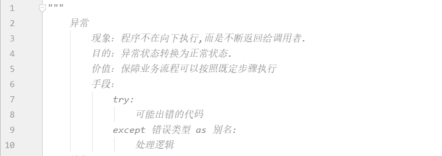

## **raise** **语句**

1. 作用：抛出一个错误，让程序进入异常状态。

2.   目的：在程序调用层数较深时，向主调函数传递错误信息要层层return 比较麻烦，所以人为抛出异常，可以直接传递错误信息。。

3. <font color='red'>有抛出就有接收，否则毫无意义</font>

    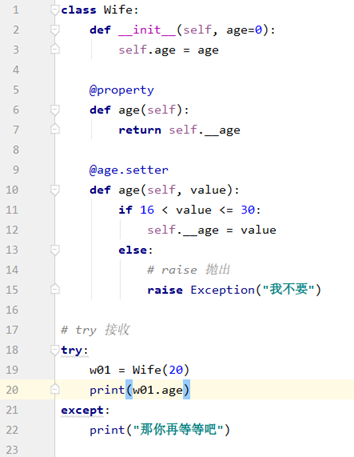

# **迭代**

​    每一次对过程的重复称为一次“迭代”，而每一次迭代得到的结果会作为下一次迭代的初始值。例如：循环获取容器中的元素。

函数char()  可以强行将数字转换成编码表所对应的字符，可以用来创建连续字母列表。

## **可迭代对象iterable** 

1. 定义：具有__iter__函数的对象，可以返回迭代器对象。

2. 语法

    ```python
    # 创建：
    class IterableName:
     	def __iter__(self):
            return 迭代器
    
    # 使用：
    for 变量名 in 可迭代对象:
        语句
    ```

    <font color='red'>3.原理：</font>

    ```python
    迭代器 = 可迭代对象.__iter__()
    while True:
        try:
            print(迭代器.__next__())
    except StopIteration:
        break
    ```

    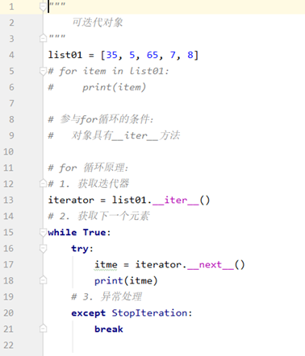

    

    <font color='red'>自定义对象参与for循环代码如下</font>

    ​     根据需求写代码

    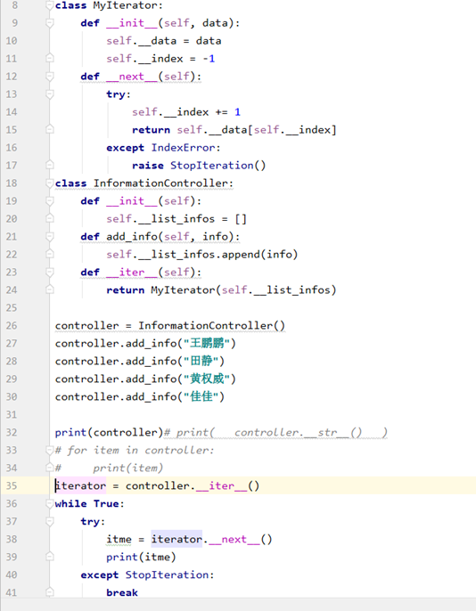

## **迭代器对象iterator**

1. 定义：可以被next()函数调用并返回下一个值的对象。

2. 语法

    class 迭代器类名:

      	def __init__(self, 聚合对象):

    ​    		self.聚合对象= 聚合对象 

      	def \__next__(self): 

    ​    		if 没有元素:

    ​      			raise StopIteration

    ​      return 聚合对象元素

3. 说明：

    -- 聚合对象通常是容器对象。

4. 作用：使用者只需通过一种方式，便可简洁明了的获取聚合对象中各个元素，而又无需了解其内部结构。


<font color='red'>for 循环的本质</font> ：

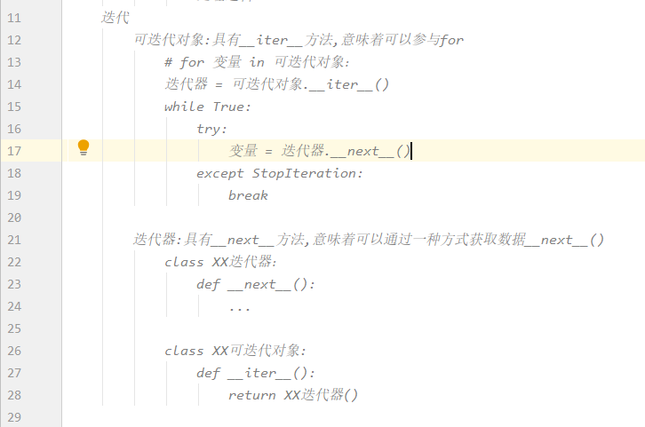

# 生成器generator

1. 定义：能够动态(<font color='red'>循环一次，计算一次，返回一次</font>)提供数据的可迭代对象。

2.   作用：在循环过程中，按照某种算法推算数据，不必创建容器存储完整的结果，从而节省内存空间。数据量越大，优势越明显。

3. 以上作用也称之为延迟操作或惰性操作，通俗的讲就是在需要的时候才计算结果，而不是一次构建出所有结果。

4. 一个生成器只能使用一次

5. 获取数据不灵活，不能使用索引，切片

    <font color='red'>yield 重写了\_\_next\_\_方法，通过yield返回的是一个推算数据的对象，要使用它，必须使用for，让for去调用\__next__方法。</font>

结论：

  要返回多个数据或者大数据时用yield

  要返回一个数据时用return

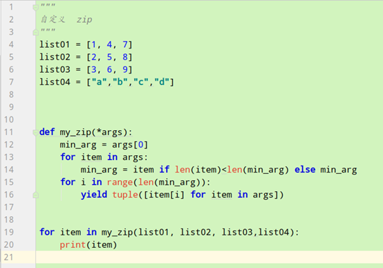

## **生成器函数**

1. 定义：含有yield语句的函数，返回值为生成器对象。 

2. 语法

    ```python
    # -- 创建：
    def func01():
    	pass
    yield 数据
    
    # -- 调用：
    for item in func01():
        语句
    
    ```

3. 说明：

    -- <font color='red'>调用生成器函数将返回一个生成器对象，不执行函数体。</font>

    -- yield翻译为”产生”或”生成”

4. 执行过程：

    (1)  调用生成器函数会自动创建迭代器对象。

    (2)  调用迭代器对象的\__next__()方法时才执行生成器函数。

    (3)  每次执行到yield语句时返回数据，暂时离开。

    (4)  待下次调用\__next__()方法时继续从离开处继续执行。

5. 原理：生成迭代器对象的大致规则如下

    -- 将yield关键字以前的代码放在next方法中。

    -- 将yield关键字后面的数据作为next方法的返回值。

## **生成器表达式**

<font color='red'>生成器与迭代器有什么区别？</font>

答：生成器是可以在大量数据中根据逻辑  推算  结果的技术;
				迭代器是以一种方式( \__next__ 方法)获取数据的手段;
				两项技术相结合是以一种方式获取不同逻辑的推算结果,
				生成器通过 yield 关键字将推算过程分布在迭代器中,然后使用惰性操作获取大量数据.


1. 定义：用推导式形式创建生成器对象。

2.   语法：变量 = ( 表达式 for 变量 in 可迭代对象 [if 真值表达式] )

​          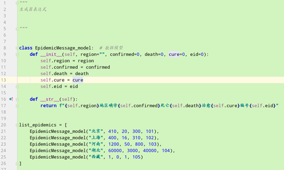                     

 

​		 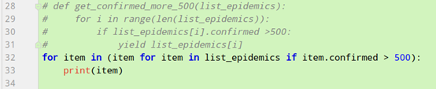

​		 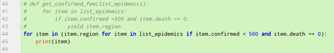	

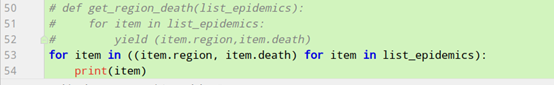

# **函数式编程**

 定义：用一系列函数解决问题。

​		-- 函数可以赋值给变量，赋值后变量绑定函数。

​    	-- 允许将函数作为参数传入另一个函数。传递核心逻辑

​		-- 允许函数返回一个函数。保证逻辑连续

 高阶函数：将函数作为参数或返回值的函数。

## 函数作为参数

​	将核心逻辑传入方法体，使该方法的适用性更广，体现了面向对象的开闭原则。

### **lambda** **表达式**

**lambda** **是天然的实参**

 

1. 定义：是一种匿名方法。

2. 作用：作为参数传递时语法简洁，优雅，代码可读性强。

    随时创建和销毁，减少程序耦合度。

3. 语法

    -- 定义：

    变量 = lambda 形参: 方法体

    <font color='red'>方法体的结果就是返回值</font>

    ​      -- 调用：

    ​           变量(实参)

4. 说明：

    -- 形参没有可以不填

    -- 方法体只能有一条语句，且不支持赋值语句。

 

### 内置高阶函数

1. map（函数，可迭代对象）：使用可迭代对象中的每个元素调用函数，将返回值作为新可迭代对象元素；返回值为新可迭代对象。

2.   filter(函数，可迭代对象)：根据条件筛选可迭代对象中的元素，返回值为新可迭代对象。

3.   sorted(可迭代对象，key = 函数,reverse = bool值)：排序，返回值为排序结果。

4.   max(可迭代对象，key = 函数)：根据函数获取可迭代对象的最大值。

5.   min(可迭代对象，key = 函数)：根据函数获取可迭代对象的最小值。

## 函数作为返回值

逻辑连续，当内部函数被调用时，不脱离当前的逻辑。


### **闭包**

1. 三要素：

    -- 必须有一个内嵌函数。

    -- 内嵌函数必须引用外部函数中变量。

    -- 外部函数返回值必须是内嵌函数。

2. 语法

    -- 定义：

    def 外部函数名(参数):

    ​    外部变量

    ​    def 内部函数名(参数):

    ​        使用外部变量

    ​    return 内部函数名

    

    -- 调用：

       变量 = 外部函数名(参数)

       变量(参数)

3. 定义：在一个函数内部的函数,同时内部函数又引用了外部函数的变量。

4.   本质：闭包是将内部函数和外部函数的执行环境绑定在一起的对象。

5. 优点：内部函数可以使用外部变量。 

6.   缺点：外部变量一直存在于内存中，不会在调用结束后释放，占用内存。

7.   作用：实现python装饰器。


### 函数装饰器decorator

1. 定义：在不改变原函数的调用以及内部代码情况下，为其添加新功能的函数。

2. 语法

    ```python
    def 函数装饰器名称(func):
       	def 内嵌函数(*args, **kwargs):
            pass
    		## 需要添加的新功能
    	return func(*args, **kwargs)
    
    return内嵌函数
    # ---------------------------------------------------
    def 函数装饰器名称(func):
       	def 内嵌函数(*args, **kwargs):
            pass	# 需要添加的新功能
            result = func(*args, **kwargs)
            pass	# 需要添加的新功能
    	return result
    
    return内嵌函数
    ```


3. 本质：

    <font color='red'>使用“@函数装饰器名称”修饰原函数，等同于创建与原函数名称相同的变量，关联内嵌函数；故调用原函数时执行内嵌函数。</font>

    原函数名称 = 函数装饰器名称（原函数名称）

    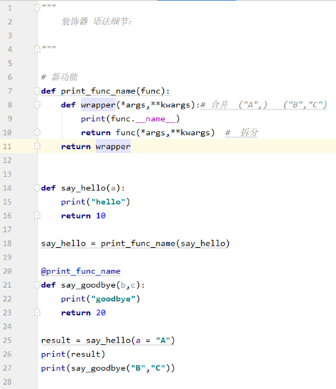

    

    

4. 装饰器链：

    一个函数可以被多个装饰器修饰

    1. <font color='red'>构建函数时的逻辑  由内向外  执行</font>
    2. <font color='red'>添加在主函数之前的逻辑  由外向内  执行</font>
    3. <font color='red'>添加在主函数之后的逻辑  由内向外执行</font>

    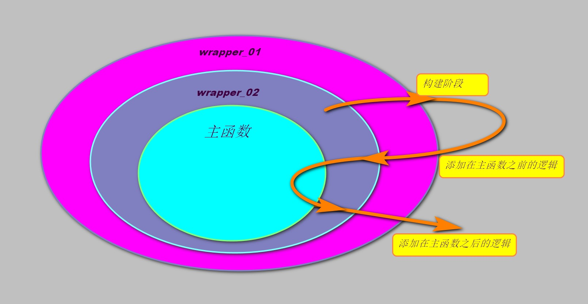


```python
def wrapper01(func):
    print('set_01')

    def wrapper(*args, **kwargs):
        print('run_01')
        result = func(*args, **kwargs)
        print('end_01')
        return result

    return wrapper


def wrapper02(func):
    print('set_02')

    def wrapper(*args, **kwargs):
        print('run_02')
        result = func(*args, **kwargs)
        print('end_02')
        return result

    return wrapper


@wrapper01
@wrapper02
def say_hi():
    print('HI !')


if __name__ == '__main__':
    say_hi()
# ----------------------------------------------------------------------
>>>
set_02
set_01
run_01
run_02
HI !
end_02
end_01

# set_02,set_01是在构建 say_hi 函数的时候就执行了，与最后运行say_hi()函数没有任何关系
```

## 实际应用 按值分派函数

使用装饰器，模拟 `python3.10` 中`case` 的语句用法


```python
import functools


def value_dispatch(func):
    """
    按参数值进行分派
    Like singledispatch() but dispatches by value of the first arg.
         singledispatch() 是按参数类型进行分派
    Example:
      @value_dispatch
      def eat(fruit):
          return f"I don't want a {fruit}..."
      @eat.register('apple')
      def _eat_apple(fruit):
          return "I love apples!"
      @eat.register('eggplant')
      @eat.register('squash')
      def _eat_what(fruit):
          return f"I didn't know {fruit} is a fruit!"
    An alternative to applying multuple `register` decorators is to
    use the `register_for_all` helper:
      @eat.register_for_all({'eggplant', 'squash'})
      def _eat_what(fruit):
          return f"I didn't know {fruit} is a fruit!"
    """

    registry = {}

    @functools.wraps(func)
    def wrapper(arg0, *args, **kwargs):
        try:
            delegate = registry[arg0]
        except KeyError:
            pass
        else:
            return delegate(arg0, *args, **kwargs)

        return func(arg0, *args, **kwargs)

    def register(value):
        def wrap(func):
            if value in registry:
                raise ValueError(
                    f'@value_dispatch: there is already a handler '
                    f'registered for {value!r}'
                )
            registry[value] = func
            return func

        return wrap

    def register_for_all(values):
        def wrap(func):
            for value in values:
                if value in registry:
                    raise ValueError(
                        f'@value_dispatch: there is already a handler '
                        f'registered for {value!r}'
                    )
                registry[value] = func
            return func

        return wrap

    wrapper.register = register
    wrapper.register_for_all = register_for_all
    return wrapper


if __name__ == '__main__':
    @value_dispatch
    def eat(fruit):
        return f"I don't want a {fruit}..."


    @eat.register('apple')
    def _eat_apple(fruit):
        return fruit


    @eat.register('squash')
    def _eat_what(fruit):
        return fruit


    @eat.register('eggplant')
    def _eat_what(fruit):
        return fruit

    print(eat('eggplant'))
----------------------------------------------------
>>>	eggplant
```

