Redis 原理讲解

原著: 古明地觉的编程教室


# 十一、面对千万级别的 key 应该如何节省内存

## 楔子

在我们实际开发的过程中，可能会遇到这样一个问题，当我们需要统计不重复的元素个数时，应该用什么类型。举个简单的场景，统计大型网站每一天的 UV，注意是 UV（一个用户即使访问多次，也只能算作一次）。

面对这个问题，你可能首先会想到使用集合，将用户的 IP 保存到集合中。由于集合内的元素是不重复的，只需要统计出集合内的 IP 个数，不就能计算出 UV 了吗？

这显然是一个方法，但如果每天都有数千万级别的访问，那么内存能不能吃得消呢。以 IPV4 为例，一个 IPV4 最多需要 15 个字节存储，那么存储一千万个独立 IP 就需要大概 143MB 的内存。但这只是一个页面的统计信息，如果我们有 1 万个这样的页面，那就需要 1T 以上的空间来存储这些数据。

所以使用集合虽然简单方便，但它的内存成本很高，于是我们需要专门开发一种新的类型来做这件事，而该类型就是 HyperLogLog。

并且除了 HyperLogLog 之外，还有一种数据类型叫做 Bitmap（位图），也可以用来存储海量数据，我们分别来看一看。

## HyperLogLog 的使用

HyperLogLog（以下简称为 HLL）是 Redis 2.8.9 版本添加的数据结构，它用于高性能的基数（去重）统计功能，它的缺点就是存在极低的误差率。

HLL 具有以下几个特点：

- 能够使用极少的内存来统计巨量的数据，它只需要 12K 空间就能统计 2^64 的数据；

- 统计存在一定的误差，误差率整体较低，标准误差为 0.81%；

- 误差可以被设置辅助计算因子进行降低；

  

HLL 的命令只有 3 个，但都非常的实用，下面分别来看。

**添加元素**

pfadd key element1 element2 ···，可以同时添加多个

```shell
127.0.0.1:6379> pfadd HLL_1 satori koishi
(integer) 1
127.0.0.1:6379> pfadd HLL_1 satori 
(integer) 0
127.0.0.1:6379> pfadd HLL_1 marisa
(integer) 1
127.0.0.1:6379> 
```

**统计不重复的元素个数**

pfcount key1 key2 ···，可以同时统计多个 HHL 结构

```shell
127.0.0.1:6379> pfcount HLL_1
(integer) 3 # 不重复元素有 3 个
127.0.0.1:6379> 
```

**将多个HLL结构中的元素移动到新的HLL结构中**

pfmerge key key1 key2 ···，将 key1、key2 ··· 里面的元素移动到 key 中

```shell
127.0.0.1:6379> del HLL_1
(integer) 1
127.0.0.1:6379> pfadd HLL_1 satori marisa koishi
(integer) 1
127.0.0.1:6379> pfadd HLL_2 satori scarlet sakuya
(integer) 1
# 注意 pfcount 统计多个 key 并不是独立统计
# 而是将这些 HLL 合在一起统计
127.0.0.1:6379> pfcount HLL_1 HLL_2
(integer) 5
# 将 HLL_1 和 HLL_2 合并到 HLL 中
# 并且 HLL_1 和 HLL_2 不受影响
127.0.0.1:6379> pfmerge HLL HLL_1 HLL_2
OK
# 总共元素个数为 5，结果符合预期
127.0.0.1:6379> pfcount HLL
(integer) 5
127.0.0.1:6379> 
```

当我们需要合并两个或多个同类页面的访问数据时，我们可以使用 pfmerge 来操作，或者对这些数据整体使用 pfcount。

### Python 实现 HLL 相关操作

```py
import redis

client = redis.Redis(
    host="...", 
    decode_responses="utf-8")
client.delele("HLL_1", "HLL_2", "HLL")

# 1. pfadd key1 key2···
client.pfadd("HLL_1", "a", "b", "c")
client.pfadd("HLL_2", "b", "c", "d")

# 2. pfcount key1 key2···
print(client.pfcount("HLL_1", "HLL_2"))  # 4

# 3. pfmerge key key1 key2···
client.pfmerge("HLL", "HLL_1", "HLL_2")
print(client.pfcount("HLL"))  # 4
```


## HyperLogLog 的实现原理

HyperLogLog 用起来没有任何难度，就几个命令而已，但它内部的原理是什么呢？该算法实际来源于一篇论文，想要了解它的原理，我们要先从伯努利实验说起。

伯努利实验指的是在同一条件下，重复地、相互独立地进行的一种随机试验，其特点是该随机试验只有两种可能结果：发生或者不发生。我们假设该项试验独立重复地进行了 N 次，那么就称这一系列重复独立的 N 次随机试验为 N 重伯努利试验，或称伯努利概型。

比如最经典、也是最好理解的场景：抛硬币，每一次抛出的硬币都是各自独立的，当前抛出的硬币在落地后，会是哪一面朝上，不受之前的影响。无论你上一次抛出的硬币是正面朝上、还是反面朝上，和本次抛出的硬币没有任何关系。

> 注意：单个伯努利试验是没有多大意义的，然而当我们反复进行试验，去观察这些试验有多少是成功的，多少是失败的，事情就变得有意义了，这些累计记录包含了很多潜在的非常有用的信息。

并且根据大数定理我们知道，如果一个事件发生的概率是恒定的，那么随着试验次数的增加，该事件发生的频率越接近概率。还拿抛硬币举例，假设抛硬币抛了四次，全是正面（这种情况是可能出现的），难道我们就说抛出一枚硬币，正面朝上的概率是百分之百吗？显然不能，而大数定理会告诉我们，只要你抛出硬币的次数足够多，你会发现正面出现的次数除以抛出的总次数（频率）会无限接近二分之一（概率）。

之所以说这些，是因为 Redis 采用的算法不是按照类似我们上面说的方式，因为大数定理对于数据量小的时候，会有很大的误差。而为了解决这个问题，HLL 引入了分桶算法和调和平均数来使这个算法更接近真实情况。

`分桶算法`：是指把原来的数据平均分为 m 份，在每段中求平均数再乘以 m，以此来消减因偶然性带来的误差，提高预估的准确性，简单来说就是把一份数据分为多份，将一轮计算变成多轮计算；

`调和平均数`：使用平均数的优化算法，而非直接使用平均数。例如小明的月工资是 1000 元，而小王的月工资是 100000 元，如果直接取平均数，那小明的平均工资就变成了 (1000 + 100000) / 2 = 50500‬ 元，这显然是不准确的，而使用调和平均数算法计算的结果是 2 / (1 / 1000 + 1 / 100000) ≈ 1998 元，显然此算法更符合实际平均数。


所以综合以上情况，在 Redis 中使用 HLL 插入数据，相当于把存储的值经过 hash 之后，再将 hash 值转换为二进制，存入到不同的桶中。这样就可以用很小的空间存储很多的数据，统计时再去相应的位置进行对比很快就能得出结论，这就是 HLL 算法的基本原理。想要更深入的了解算法及其推理过程，可以去看原版的论文，链接地址：

> http://algo.inria.fr/flajolet/Publications/FlFuGaMe07.pdf


## Bitmap 的实现原理

在工作中我们偶尔也会遇到类似下面这些场景：

- 查看某个用户当前是否在线；

- 查看某个员工当天是否打卡；

- ......

  

这些场景有一个类似的地方，就是它的取值只有两种。比如查看用户当前是否在线，要么在线，要么不在线，而统计这样的数据，我们称之为`二值统计`。

还是以用户是否在线为例，每个用户都有一个唯一的自增 ID，如果让你实现基于 ID 判断用户是否在线这个需求，你会怎么做呢？相信绝大部分人都会选择集合，将在线用户的 ID 都保存在集合中，这是最简单方便的做法，并且查询的时间复杂度是 O(1)。

或者使用一个数组，以用户的自增 ID 作为索引，如果对应的元素是 1，则代表在线；对应的元素是 0，则代表不在线。

但如果在面试的时候这么回答，那么不出意外，面试官一定会问你采用集合、数组有没有什么隐患，或者说还有没有其它的做法。

对于当前这个场景而言，如果用户量不大，那么是没问题的。但如果 DAU 达到了上千万级别，使用集合和数组就会非常的耗费内存。而面对这种情况，我们推荐使用位图。因为现代计算机操作数据默认都是以字节为单位，最小的类型也需要 1 字节，但表达 0 和 1 事实上只需要一个比特位就够了。举个例子：

```c
// 数组 users 只有 8 个元素
// 理论上它最多只能判断 8 个用户是否在线
// 但如果是以 bit 为单位，那么能判断 64 个
static char users[8];
```

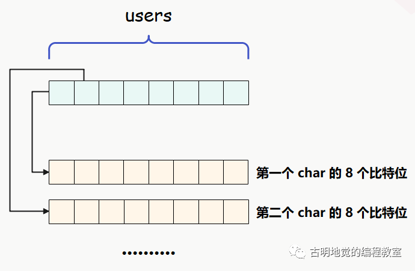

虽然 users 的长度为 8，但是它里面的 1 个元素我们可以当成 8 个元素来用，因此可以判断 64 个用户是否在线。比如当 ID 为 5 的用户上线了，只需要将第一个 char 的第 5 个比特位设置为 1 即可；当 ID 为 12 的用户上线了，只需要将第二个 char 的第 4 个字节设置为 1 即可。

如果下线了，那么将对应的比特位设置为 0 即可；而检测是否在线，只需要判断对应的比特位是否为 1 即可。

所以对于这种二值数据，非常适合用位图来统计。而 Redis 的位图就是基于 String 类型实现的统计二值状态的类型，它会把每个 char 的所有比特位都利用起来。

```shell
# 将 users 偏移量为 10 的位设置为 1
# 并返回该位设置之前的值
# 注意只能设置 0 或 1
# 并且偏移量从 0 开始
127.0.0.1:6379> SETBIT users 10 1
(integer) 0
127.0.0.1:6379> GETBIT users 10
(integer) 1
127.0.0.1:6379> 
```

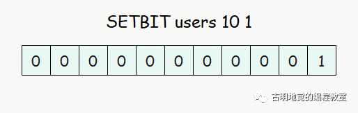

其中操作的每一个 bit 位叫做 offset，offset 可以非常大。

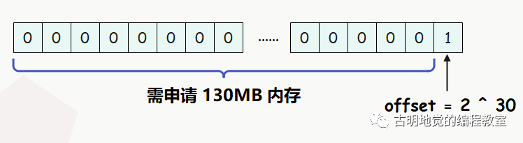

保存 2 的 30 次方个元素的状态，也只需要 130MB 的内存。所以如果要统计数据的二值状态，例如商品有没有、用户在不在等，就可以使用 Bitmap，因为它只用一个 bit 位就能表示 0 或 1。在记录海量数据时，Bitmap 能够有效地节省内存空间。

除了使用 Redis 之外，你也可以自己实现一个位图，这个非常简单，可以试一下。


## 小结

当需要做大量数据统计时，普通的集合类型已经不能满足我们的需求了，这个时候我们可以借助 Redis 2.8.9 中提供的 HyperLogLog 来统计。支持三个操作命令：pfadd 添加元素、pfcount 统计元素和 pfmerge 合并元素。

它的优点是只需要使用 12k 的空间就能统计 2^64 的数据，但它的缺点是存在 0.81% 的误差，因为它是基于概率实现的。这也意味着，如果你使用 HyperLogLog 统计的 UV 是 100 万，但实际的 UV 可能是 101 万。

如果能容忍这一点误差率，那么 HyperLogLog 非常适合；但如果你是需要精确统计结果的话，最好还是继续用 Set 或 Hash 类型。

而对于那些状态只有两种的数据，我们更推荐使用位图，特别是当数据量非常大的时候。


# 十二、Redis 的游标迭代器（scan）

我们知道，如果想查询数据库中都有哪些 key 的话，可以使用 keys 命令。keys 后面接一个模式，即可返回所有匹配指定模式的 key。并且指定模式的时候，可以使用通配符，比如：

- *：匹配任意多个任意字符；

- ?：匹配单个任意字符；

- [...]：匹配[]中的任意一个字符；

  

keys 这个命令很简单，用起来也很方便，但是该命令存在两个缺点：

1）此命令没有分页功能，我们只能一次性查询出所有符合条件的 key，如果查询结果非常巨大，那么得到的输出信息也会非常多；

2）keys 命令是遍历查询，等于将数据库中的 key 和指定的模式逐一对比，看是否匹配，因此它的查询时间复杂度是 O(N)，所以数据量越大查询时间就越长；

并且由于每个 Redis 实例是使用单线程处理所有请求的，故 keys 命令和其它命令都是在同一个队列中排队等待执行的。如果 keys 命令执行时间过长，则会阻塞其它命令的执行，导致性能问题。而且当 keys 命令匹配了非常多的 key 时，不仅输出信息多，还可能造成长期停顿。

因此为了解决这一点，Redis 在 2.8 版本的时候引入了一个 scan 命令，主要用于解决 keys 命令可能导致整个 Redis 实例停顿的问题。

scan 是一种迭代命令，主要是对 keys 命令进行了分解，也就是将原本使用一个 keys 请求一次即可获取所有符合模式的 key 的操作，分解成了多次 scan 操作。

每次 scan 操作返回匹配的 key 的一个子集，这样每个 scan 请求的操作时间很短，多次 scan 请求之间可以执行其他命令，故减少对其他命令执行的阻塞。当最后一个 scan 请求发现没有数据可返回了，则操作完成，汇总所有 scan 请求的数据，从而达到与 keys 命令一次获取的数据相同的效果。

> 由于 scan 命令需要执行多次，即相当于执行了多个命令，存在多次命令请求和响应周期，故整体执行时间要比 keys 命令长。但它的特点是将整个步骤进行了分解，在这个过程中可以执行其它命令。

我们使用 Python 往 Redis 里面添加一些 key。

```py
import redis

client = redis.Redis(host="...",
                     decode_responses="utf-8")

# 生成 24 个key
keys = [f"satori{i}" for i in range(1, 25)]
values= list(range(1, 25))

# 添加
client.mset(dict(zip(keys, values)))
```

然后看一下 scan 怎么使用，命令：scan 游标 match 模式 count 数量，其中 match 和 count 是可选的，我们先来讲一下游标。

```shell
# 我们这里没有指定 match，会匹配所有的 key
# 没有指定 count，默认每次遍历 10 条
127.0.0.1:6379> scan 0  
# 然后游标从 0 开始，返回数据之后
# 会得到一个新的游标，然后下次从这个新的游标开始迭代
1) "14"  
2)  1) "satori1"
    2) "satori14"
    3) "satori12"
    4) "satori22"
    5) "satori20"
    6) "satori11"
    7) "satori15"
    8) "satori5"
    9) "satori21"
   10) "satori8"
   
# 上一个游标返回了14，所以第二次从 14 开始迭代
# 然后遍历 10 条   
127.0.0.1:6379> scan 14  
1) "23"  # 返回游标23
2)  1) "satori18"
    2) "satori24"
    3) "satori23"
    4) "satori9"
    5) "satori3"
    6) "satori13"
    7) "satori17"
    8) "satori4"
    9) "satori10"
   10) "satori6"

# 所以这里从第二次返回的游标 23 开始迭代
# 如果游标返回了 0，代表所有的 key 都迭代完毕了
127.0.0.1:6379> scan 23  
1) "0"  
2) 1) "satori19"
   2) "satori16"
   3) "satori7"
   4) "satori2"
127.0.0.1:6379> 
```

所以游标还是很好理解的，至于剩下的 match 和 count 就更不用说了。

- match 模式：匹配指定模式的 key，类似于 keys pattern 中的 pattern。如果不指定则等价于全部匹配；

- count 数量：指定遍历的数量，如果不指定，那么每次遍历 10 条；

  

实际操作一下，不过这里的 key 有点多，我们就删除一部分只保留 14 个 key 吧。

```shell
# 返回 11 个
127.0.0.1:6379> scan 0 count 11  
1) "7"
2)  1) "satori1"
    2) "satori14"
    3) "satori12"
    4) "satori11"
    5) "satori5"
    6) "satori8"
    7) "satori13"
    8) "satori3"
    9) "satori9"
   10) "satori4"
   11) "satori10"
   
# 还剩 4 个   
127.0.0.1:6379> scan 7  
1) "0"
2) 1) "satori6"
   2) "satori2"
   3) "satori7"

# 直接返回 15 个
127.0.0.1:6379> scan 0 count 15  
# 光标直接变为 0，因为遍历一次就结束了
1) "0"  
2)  1) "satori1"
    2) "satori14"
    3) "satori12"
    4) "satori11"
    5) "satori5"
    6) "satori8"
    7) "satori13"
    8) "satori3"
    9) "satori9"
   10) "satori4"
   11) "satori10"
   12) "satori6"
   13) "satori2"
   14) "satori7"
```

匹配模式，这里选择以 satori1 开头的。

```shell
# 返回值不是 0，说明没有遍历完毕
127.0.0.1:6379> scan 0 match satori1*  
1) "11"
2) 1) "satori1"
   2) "satori14"
   3) "satori12"
   4) "satori11"
   5) "satori13"

# 判断遍历是否结束，我们只看它返回的游标是不是 0
# 这里返回了 0，说明遍历结束了
127.0.0.1:6379> scan 11 match satori1*  
1) "0"
2) 1) "satori10"
```

以上就是 scan 命令的用法，再来看看如何用 Python 操作 scan。

```py
import redis

client = redis.Redis(host="...", 
                     decode_responses="utf-8")

# 里面三个参数：分别是 cursor、match、count
# 后面两个默认为 None
print(client.scan(0, count=3))
"""
(2, ['satori1', 'satori14', 'satori12', 'satori11'])
"""
# 调用 scan 会返回一个元组
# 里面是游标和遍历得到的 key（一个列表）

# 然后我们从头遍历试试, 一次遍历 6 个吧
cursor = 0
while res := client.scan(cursor, count=6):
    print(res[1])
    if not (cursor := res[0]):
        break
"""
['satori1', 'satori14', 'satori12', 'satori11', 'satori5', 'satori8']
['satori13', 'satori3', 'satori9', 'satori4', 'satori10', 'satori6']
['satori2', 'satori7']
"""
```

scan 命令还是比较简单的，除了 scan，还有 hscan：检索字典中的键值对、sscan：检索集合中的元素、zscan：检索有序集合中的元素(包括成员和分数值)，有兴趣可以自己尝试一下。

并且这些命令的使用方式都是一样的，只不过命令的名字不一样罢了。


# 十三、使用 Redis 查询附近的人或商家(GEO)

## 楔子

查询附近的人或者商家是一个非常常用并且实用的功能，比如：我们经常使用高德地图、百度地图或者其它地图，去查询想去的目的地在什么位置，并且还会显示距离。

如果去的地方有多个，比如我们想去招商银行，但是附近有多个招商银行，那么地图会显示附近的所有银行，并默认按照距离进行排序，然后我们可以选择距离最近的一个。

我们以在美团上搜索自助餐为例：


我们看到美团把商店和离我们当前位置的距离都显示在了上面，当然它没有纯粹地按照距离排序，而是按照距离以及其它指标（比如价格、人气、评分等等）进行的综合排序。当然它怎么排序的我们不关心，我们想要知道的是如何查询附近的人、或者商店呢？

而想实现这些功能，离不开基于位置信息服务（Location-Based Service，LBS）的应用。LBS 应用访问的数据是和人或物关联的一组经纬度信息，而且要能查询相邻的经纬度范围。为此 Redis 在 3.2 版本中，提供了一个新的类型：GEO，用于存储和查询地理位置信息（也就是经纬度），它非常适合应用在 LBS 服务的场景中。


## GEO 类型以及相关操作

所以我们只需要查询出附近几个点和自己的距离，再进行排序就可以实现查询附近商家的功能了。然而使用 Redis 让这一切更简单了，Redis 为我们提供了专门用来存储地理位置（经纬度）的类型 GEO，我们使用它以及它内置的方法就可以轻松地实现查询附近的人或商家的功能。

GEO类型是专门用来存储地理位置信息的，不过关于 GEO 的命令不多，主要包含以下 6 个：

- geoadd：添加地理位置；

- geopos：查询地理位置；

- geodist：距离统计；

- georadius：查询某位置内的其它成员；

- geohash：查询地理位置的编码值；

- zrem：删除地理位置；

  

我们来测试一下。

### 添加地理位置

命令：`geoadd key 经度1 纬度1 地点1 经度2 纬度2 地点2 ···`，一次性可以添加任意多个。

我们先用百度地图提供的经纬度查询工具，随便找4个点吧。

- 天安门：116.404269,39.913164

- 月坛公园：116.36,39.922461

- 北京欢乐谷：116.499705,39.874635

- 香山公园：116.193275,39.996348

  

然后进行添加，代码如下：

```shell
> geoadd position 116.404269 39.913164 T_A_M
(integer) 1
> geoadd position 116.36 39.922461 Y_T_G_Y
(integer) 1
> geoadd position 116.499705 39.874635 B_J_H_L_G
(integer) 1
> geoadd position 116.193275 39.996348 X_S_G_Y
(integer) 1
```

以上就添加完毕了，当然为了看起来清晰，我们这里是写了 4 条命令。其实一条就可以了，因为 geoadd 支持一次添加多个地理位置信息。

### 查询地理位置

添加的时候使用命令：`geoadd key 经度 维度 地点`；查询的时候使用命令：`geopos key 地点`，即可返回经纬度。并且正如添加的时候，可以一次性添加多个，查询的时候，也可以一次性查询多个。

```
> geopos position T_A_M X_S_G_Y
1) 1) "116.40426903963088989"
   2) "39.91316289865137179"
2) 1) "116.19327574968338013"
   2) "39.99634737765855874"
```

基于 `key 和 地点`即可查询对应的经纬度，如果地点没有设置，那么会返回 nil，表示没有该地点的经纬度信息。


### 距离统计

如何计算两个位置之间的距离呢？使用命令：`geodist key 位置1 位置2 km` 即可算出两个位置之间距离多少千米，结尾的 km 表示单位，这里选择千米。除了 km 之外，还有 m 表示米、mi 表示英里、ft 表示英尺，一般我们使用 km 和 m 就可以了。

```shell
> geodist position T_A_M X_S_G_Y km
"20.2293"
```

这里 Redis 告诉我们天安门和香山公园之间的距离为 20.2293 千米，有兴趣的话可以自己用地图测试一下看看准不准，当然最好使用经纬度进行定位。

> 注意：此命令统计的距离为两个位置的直线距离。


### 查询某位置内的其它成员信息

重点来了，我们还可以查询某个地点附近的成员。

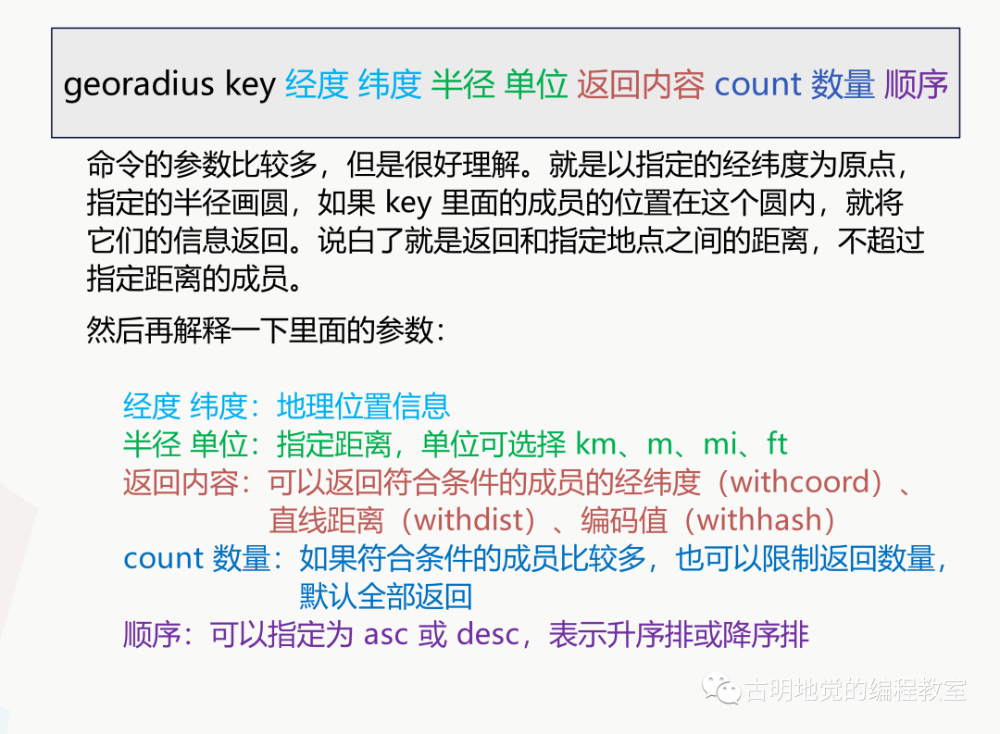

我们实际演示一下：

```shell
# 返回 position 中距离 (116.405419 39.913164) 
# 不超过 5km 的成员，当然成员都是 position 中的已有成员
> georadius position 116.405419 39.913164 5 km withcoord
1) 1) "T_A_M"
   2) 1) "116.40426903963088989"
      2) "39.91316289865137179"
2) 1) "Y_T_G_Y"
   2) 1) "116.36000186204910278"
      2) "39.92246025586381819"
```

这里的返回内容我们指定的是 withcoord，表示返回的是符合条件的成员的经纬度。

```shell
> georadius position 116.405419 39.913164 5 km withdist
1) 1) "T_A_M"
   2) "0.0981"
2) 1) "Y_T_G_Y"
   2) "4.0100"
```

返回内容指定为 withdist，表示返回的是符合条件的成员和指定位置之间的直线距离。

```shell
> georadius position 116.405419 39.913164 5 km withhash
1) 1) "T_A_M"
   2) (integer) 4069885552230465
2) 1) "Y_T_G_Y"
   2) (integer) 4069879797297521
```

返回内容我们指定的是 withhash，表示返回的是符合条件的成员的编码值。

**然后我们再看看限制返回数量。**

```shell
# 设置半径为 50km，显然全部返回了
> georadius position 116.405419 39.913164 50 km withdist
1) 1) "Y_T_G_Y"
   2) "4.0100"
2) 1) "X_S_G_Y"
   2) "20.3165"
3) 1) "T_A_M"
   2) "0.0981"
4) 1) "B_J_H_L_G"
   2) "9.1163"

# 指定返回的数量
> georadius position 116.405419 39.913164 50 km withdist count 1
1) 1) "T_A_M"
   2) "0.0981"
```

**最后是排序**

```shell
> georadius position 116.405419 39.913164 50 km withdist 
1) 1) "Y_T_G_Y"
   2) "4.0100"
2) 1) "X_S_G_Y"
   2) "20.3165"
3) 1) "T_A_M"
   2) "0.0981"
4) 1) "B_J_H_L_G"
   2) "9.1163"
# 升序排   
> georadius position 116.405419 39.913164 50 km withdist asc
1) 1) "T_A_M"
   2) "0.0981"
2) 1) "Y_T_G_Y"
   2) "4.0100"
3) 1) "B_J_H_L_G"
   2) "9.1163"
4) 1) "X_S_G_Y"
   2) "20.3165"
# 降序排   
> georadius position 116.405419 39.913164 50 km withdist desc
1) 1) "X_S_G_Y"
   2) "20.3165"
2) 1) "B_J_H_L_G"
   2) "9.1163"
3) 1) "Y_T_G_Y"
   2) "4.0100"
4) 1) "T_A_M"
   2) "0.0981"
```


### 查询地理位置的编码值

```shell
> geohash position T_A_M X_S_G_Y
1) "wx4g0cgp000"
2) "wx4es117ee0"
```

可以同时查询多个地理位置（会额外做一个 Base32 编码）。

### 删除地理位置

命令：`zrem key 地点1 地点2 ···`

```shell
> geohash position Y_T_G_Y
1) "wx4epgdv0t0"
> geopos position Y_T_G_Y
1) 1) "116.36000186204910278"
   2) "39.92246025586381819"
# 删除 position 里的 Y_T_G_Y 成员
> zrem position Y_T_G_Y
(integer) 1
# 再次查询，返回 nil
> geohash position Y_T_G_Y
1) (nil)
> geopos position Y_T_G_Y
1) (nil)
```

以上就是 GEO 的一些操作命令，不管什么类型，至少在使用层面是不难的。


## GEO 的底层结构

每个数据类型的底层结构，一定是基于存储的数据的特点设计的。我们以滴滴打车为例，分析一下 LBS 服务中经纬度的存取特点。

- 每一辆网约车都有自己的唯一编号，网约车需要将自己所在地的经纬度信息上报给叫车应用。

- 用户在叫车的时候，叫车应用会根据用户所在地的经纬度，查找附近的车辆并进行匹配。

- 一旦匹配成功，叫车应用就会根据车辆的编号，获取车辆的信息并返回给用户。

  

可以看到，一辆车（或一个用户）一定处在地球上的某个位置，所以会对应一组经纬度，并且随着车（用户）的移动，相应的经纬度也在不断变化。因此服务要能根据车 ID（用户 ID）快速定位到车（用户）此刻所处的位置，也就是经纬度，并且当位置发生改变后，也要能快速地对经纬度信息进行更新。

比如我们平时使用的导航也是如此，像高德地图 APP。当我们输入目的地的时候，APP 怎么知道我们距离目的地有多远，并且移动的过程中 APP 上显示的距离也在不断变化，当我们走反了它还能提醒我们。

其实原因很简单，APP 会不断地通过手机的 GPS 定位系统，将我们所处位置的经纬度信息上报给高德的后台服务，服务计算出我们和目的地之间的距离，然后返回给 APP，APP 再进行更新。如果通过距离等信息判断出我们走的方向，和已有的方向不一样，那么它还会重新规划路线。

因此 GEO 这种类型至少要满足能够快速地对经纬度进行查找和更新，那么你会想到哪些结构呢？毫无疑问，Hash 和 ZSet。

我们先来看看如果是 Hash 类型会是什么样子：

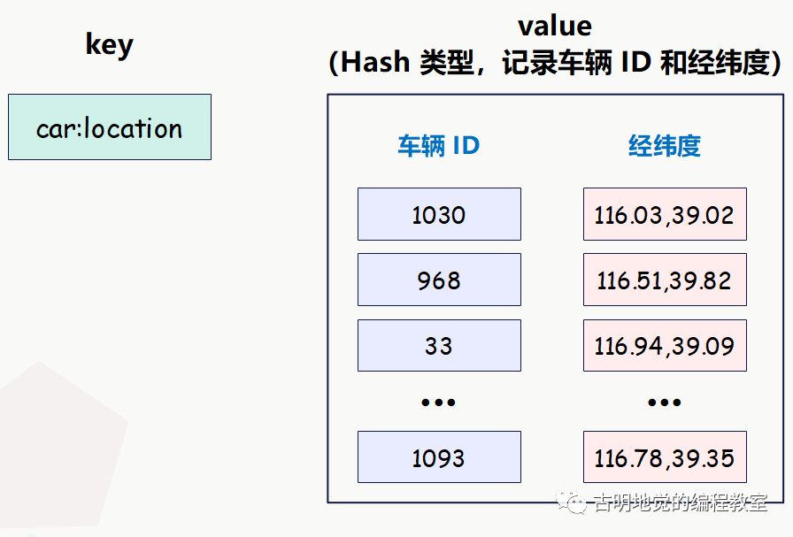

对于 Hash 来说，快速地对于 value 进行查找和更新是可以实现的，到这里，Hash 类型看起来是一个不错的选择。但问题是，对于一个 LBS 应用来说，除了记录经纬度信息之外，还需要根据用户的经纬度信息在车辆的 Hash 集合中进行范围查询。

然而一旦涉及到范围查询，就意味着集合中的元素需要有序，但 Hash 类型的元素是无序的，显然不能满足我们的要求。

再来看看 ZSet，ZSet 类型也支持一个 key 对应一个 value 的记录模式，其中 key 是 ZSet 中的元素，而 value 则是元素的权重分数。更重要的是，ZSet 可以根据元素的权重分数排序，支持范围查询，这样就能满足 LBS 服务中查找相邻位置的需求了。

实际上，GEO 类型的底层数据结构就是用 ZSet 来实现的，我们还是借着叫车应用的例子来加深下理解。

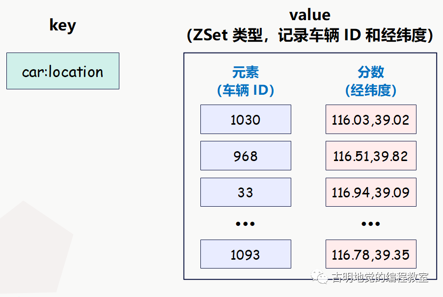


但这样就产生了一个问题，ZSet 的 score 应该是浮点数才对，这样才能够进行排序，而保存一个经纬度显然是不行的。那该怎么做呢？还记得 geohash 这个命令吗，负责对经纬度进行编码，ZSet 的 score 存放的其实是编码后的结果。


## GEOHash 的编码方法

为了能高效地对经纬度进行比较，Redis 采用了业界广泛使用的 GEOHash 编码方法，这个方法的基本原理就是`二分区间`，`区间编码`。当我们要对一组经纬度编码，会先对经度和维度分别编码，然后再将这两个编码合并为一个最终编码。

先来看看如何对经度编码，经度位于 -180 到 180，我们可以划分出两个子区间，分别是 -180 到 0 和 0 到 180，这里称它为左区间和右区间。然后就看要编码的经度值是落在左区间还是右区间，落在左区间就用 0 表示，落在右区间就用 1 表示。这样一来，每做完一次二分区，我们就能得到一个编码值。

然后我们对经度值所属的区间按照相同的规则再做一次二分区，看它是落在左区间还是右区间，这样又能得到一个编码值。当做完 N 次的二分区之后，经度值就可以用一个 N bit 的数表示了。

举个例子，假设我们要编码的经度值为 116.37，我们生成 5 位编码值，也就是做 5 次分区，看看是什么样子的。

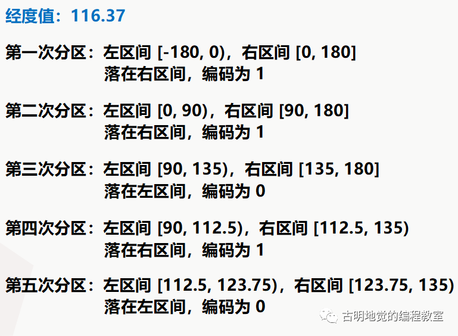

5 次分区过后，我们就得到经度的编码值 11010。而对纬度的编码方式与之同理，只不过初始范围变成了 -90 到 90，比如对纬度值 39.86 编码会得到 10111。

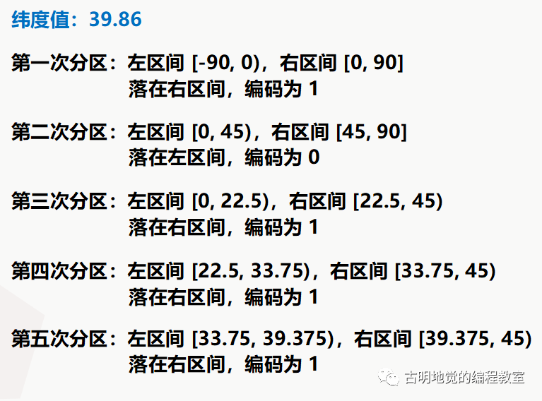

当经纬度值都编码完成后，我们再将它们组合在一起，组合规则是：最终编码值的偶数位依次是经度的编码值，奇数位依次是纬度的编码值。

比如上面计算出的经度值和纬度值的编码分别是11010和10111，那么合起来就是 1110011101。

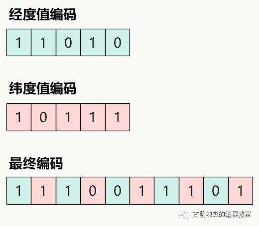

使用 GEOHash 编码后，就可以将经纬度转成一个数值来保存，这样就可以作为 ZSet 的 score 了。

然后这里需要说明一下，我们上面做的是 5 次分区，但很明显这是不够精确的，因为经纬度即使变化一点点，距离也会有很大差别。

> 在纬度相等的情况下，经度每隔 0.00001 度，距离相差约 1 米；在经度相等的情况下，纬度每隔 0.00001 度，距离相差约 1.1 米。

因此在实际应用中，5 次分区是肯定不够的，当然不管多少次，整个过程是没有变化的，这里我们就以 5 次为例。

还有一个问题，我们在使用 geohash 命令查看编码值的时候，发现它打印的是一个字符串啊。不要奇怪，这是因为 Redis 又对编码值做了一个 Base32 编码，准确来说，Base32 编码之后的结果才是真正的编码值。

那么问题来了，这个编码值该怎么用呢？假设我们做了 4 次分区，那么就可以划分出一个 4 * 4 的网格区域。

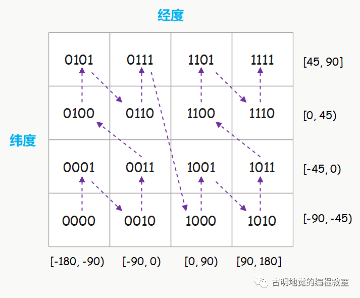

网格的南北（上下）方向体现的是纬度的变化，往北（上）则纬度的二进制位加 1，往南则减 1；网格的东西（左右）方向体现的是经度的变化，往东（右）则经度的二进制位加 1，往西则减 1。

总之分区次数越多，Base32 编码之后的 GEOHash 编码值越长，网格数量越多，每个网格的宽度和高度越小，位置越精确。

- 编码长度为 1，每个网格宽度为 5000km，每个网格高度为 5000km；
- 编码长度为 2，每个网格宽度为 1250km，每个网格高度为 625km；
- 编码长度为 3，每个网格宽度为 156km，每个网格高度为 156km；
- 编码长度为 4，每个网格宽度为 39.1km，每个网格高度为 19.5km；
- 编码长度为 5，每个网格宽度为 4.89km，每个网格高度为 4.89km；
- 编码长度为 6，每个网格宽度为 1.22km，每个网格高度为 0.61km；
- 编码长度为 7，每个网格宽度为 153m，每个网格高度为 153m；
- 编码长度为 8，每个网格宽度为 38.2m，每个网格高度为 19.1m；
- 编码长度为 9，每个网格宽度为 4.77m，每个网格高度为 4.77m；
- 编码长度为 10，每个网格宽度为 1.19m，每个网格高度为 0.596m；


在计算的时候将二维网格按照二进制从小到大的顺序映射到一维，但由于存在误差（比如 0111 和 1000 相邻、但网格不相邻），所以为了避免查询不准确问题，我们可以同时查询给定经纬度所在的方格周围的 4 个或 8 个方格。

## 小结

GEO 是 Redis 3.2 版本中新增的功能，只有升级到 3.2+ 才能使用，它可以记录经纬度形式的地理位置信息，被广泛的应用在 LBS 服务中。并且 GEO 没有设计新的底层数据结构，而是直接使用的 ZSet。

GEO 之所以能使用 ZSet 作为底层结构，是因为通过 GEOHash 实现了经纬度到 score 的转变，而实现的关键就在于二维区间的划分以及对区间进行编码。当经纬度落在某个区间后，就用区间的二进制编码值来表示，并将其作为 ZSet 元素的权重分数。

这样一来，我们就可以把经纬度保存到 ZSet 中，利用ZSet 提供的`按权重进行有序范围查找`的特性，实现 LBS 服务中频繁使用的`搜索附近`的需求。


# 十五、如何保证缓存和数据库之间的数据一致性

## 楔子

在使用 Redis 做缓存时，我们经常会遇到一些问题，比如：

- 缓存中的数据和数据库中的数据不一致；

而且这些问题在面试的时候也几乎是必问，本文我们来探讨第一个问题，当缓存和数据库中的数据不一致的时候，该怎么办？因为数据不一致，那么从缓存当中就会获取到旧数据，从而可能导致严重的错误，所以这个问题是一定要解决的。

但是在探讨这个问题之前，我们需要了解一些前置的知识。

## 缓存处理请求的两种情况

Redis 用作缓存时，我们会把 Redis 部署在数据库的前端，业务应用在访问数据时，会先查询 Redis 中是否保存了相应的数据。此时根据数据是否存在缓存中，会有两种情况。

- 缓存命中：Redis 中有相应数据，直接读取 Redis，性能非常高；

- 缓存缺失：Redis 中没有相应数据，此时会从数据库中读取，性能会变慢。而一旦缓存缺失，为了后续请求能够从缓存中读取，我们会把从数据库中读到的数据写入缓存中，这个过程就叫做缓存更新。而缓存更新这一步，就会涉及到数据不一致的问题，后续分析；

  

所以在使用 Redis 的时候，有以下三个操作：1）应用读数据时，先读 Redis；2）当发生缓存缺失时，读取数据库；3）发生缓存缺失时，还要更新缓存。

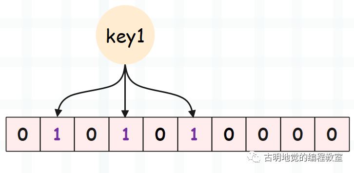


这三步都由业务方来完成。


## 缓存的类型

按照 Redis 是否接受写请求，我们可以把它分为`只读缓存`和`读写缓存`。

### 只读缓存

当 Redis 用作只读缓存时，应用要读取数据的话，会先调用 Redis GET 接口，查询数据是否存在。而所有数据的写请求，会直接发往后端的数据库，在数据库中执行。对于修改的数据来说，如果 Redis 也缓存了相应的数据，应用需要把这些缓存的数据删除。

当应用再次读取这些数据时，会发生缓存缺失，应用会把这些数据从数据库中读出来，并写到缓存中。这样一来，这些数据后续再被读取时，就可以直接从缓存中获取了，能起到加速访问的效果。

假设业务应用要修改数据 A，那么应用会先直接在数据库里修改，但如果该数据在 Redis 里面也存在，那么还要将它从 Redis 里面删除。等到应用需要读取数据 A 时，会发生缓存缺失，此时应用就会从数据库中读取 A，并写入 Redis，以便后续请求能从缓存中获取。

只读缓存直接在数据库中更新数据的好处是，所有最新的数据都在数据库中，而数据库是提供数据可靠性保障的，这些数据不会有丢失的风险。当我们需要缓存图片、短视频这些用户只读的数据时，就可以使用只读缓存这个类型了。


### 只写缓存

对于读写缓存来说，除了读请求会发送到缓存中进行处理（在缓存中查询数据是否存在)，所有的写请求也会发送到缓存，在缓存中直接对数据执行增删改操作。此时得益于 Redis 的高性能访问特性，数据的增删改操作可以在缓存中快速完成，处理结果也会快速返回给业务应用，这就可以提升业务应用的响应速度。

但和只读缓存不一样，使用读写缓存时，最新的数据在 Redis 中，一旦宕机或断电，就会造成数据丢失，给业务带来风险。所以数据在 Redis 中更新完毕之后，还要写到数据库里面，而根据业务对数据可靠性和缓存性能的不同要求，我们有两种写回方式，分别是`同步直写`和`异步写回`。

**同步直写**

写请求发给缓存的同时，也会发给后端数据库进行处理，等到缓存和数据库都写完数据，才给客户端返回。这样即使缓存宕机或发生故障，最新的数据仍然保存在数据库中，这就提供了数据可靠性保证。

> 但我们如何保证这两步同时成功呢？要是 Redis 写入成功，数据库写入失败怎么办？这个问题我们后续探讨。

但同步直写会降低缓存的访问性能，这是因为缓存中处理写请求的速度是很快的，而数据库处理写请求的速度较慢。但缓存必须等待数据库处理完之后，才能给应用返回结果，这就增加了缓存的响应延迟。

**异步写回**

该方式优先考虑了响应延迟，此时所有写请求都先在缓存中处理，等到这些增改的数据要被从缓存中淘汰出来时，缓存将它们写回后端数据库。这样一来，处理这些数据的操作是在缓存中进行的，很快就能完成。只不过当发生掉电时，由于数据还没有被写回数据库，就会有丢失的风险。

### 选择哪一种

那么问题来了，只读缓存和读写缓存选择哪一种呢？其实主要判断依据还是看我们是否对写请求有加速的需求。

- 如果需要加速写请求，我们选择读写缓存；

- 如果写请求很少，或者只需要对读请求加速的话，我们选择只读缓存；

  

举个例子，在商品大促销的场景中，商品的库存信息会一直被修改。如果每次修改都需到数据库中处理，就会拖慢整个应用，此时我们通常会选择读写缓存的模式。而在短视频 App 的场景中，虽然视频的属性有很多，但是确定之后，修改并不频繁，此时在数据库中进行修改对缓存影响不大，所以只读缓存模式是一个合适的选择。


## 数据一致性问题是如何产生的

了解完缓存的请求处理模式、以及缓存的种类之后，我们就可以探讨数据的一致性问题了，首先来看看数据一致性是如何定义的。

- 缓存中如果有数据，那么必须和数据库中的数据保持一致；

- 缓存中如果没有数据，那么数据库中的数据必须是最新的；

  

如果不符合以上两种情况，那么缓存和数据库之间就出现了数据不一致的问题。而缓存类型的不同，解决方式也不同，我们分别看一下。


## 读写缓存解决数据一致性

当数据发生更新时，不仅更新数据库，还要连带缓存一起更新（此时写入方式只能是同步直写）。但这里面存在一个严重的问题，我们无法保证这两者都能成功执行。如果这两者有一个更新失败了，会有什么影响呢？我们来看一下。

### 先更新缓存成功、后更新数据库失败

如果缓存更新成功了，但数据库更新失败，那么此时缓存中是新值，数据库中是旧值。虽然此时读请求可以命中缓存，拿到正确的值，然一旦缓存失效，就会从数据库中读取到旧值，重建缓存也是这个旧值。

于是用户会发现自己之前修改的数据又变回去了，会对业务造成影响。

### 更新数据库成功、后更新缓存失败

如果数据库更新成功了，但缓存更新失败，那么此时数据库中是新值，缓存中是旧值。而之后的读请求读到的都是旧数据，只有当缓存失效后，才能从数据库中得到正确的值。这时用户会发现，自己刚刚修改了数据，但却看不到变更，一段时间过后，数据才变更过来，对业务也会有影响。

可以看到，只要有一方更新失败，都会对业务造成影响。

所以这种办法的难点就在于，我们如何才能保证这两者作为一个事务同时成功和失败呢？可能有人想到使用分布式事务，让两者同时成功才算成功，只要有一方失败就回滚。这是一个解决办法，但却会带来几个问题：

- Redis 和数据库是两个不同的存储介质，两者的写操作不应该被绑定在一起。

- 分布式事务比较复杂，性能较差，还要考虑各种容错问题。

- 分布式事务是以牺牲系统的可用性为代价，即 CAP 中的 A，它和我们引入 Redis 的目的相违背了。

  

所以性能和一致性就像天平的两端，无法做到都满足要求。如果非要追求强一致，那必须要求在所有的更新操作完成之前，不能有任何请求进来。虽然我们可以通过加分布锁的方式来实现，但要付出的代价，很可能会超过引入缓存带来的性能提升。

而且除了一方更新失败时，会产生数据不一致的问题之外，多个线程并发执行时，即使全部更新成功，也可能会产生数据不一致。

### 并发更新引起的数据不一致

假设我们采用先更新数据库，再更新缓存的方案，并且两步都可以成功执行的前提下，如果存在并发，情况会是怎样的呢？假设有线程 A 和线程 B 两个线程，需要更新同一条数据，那么可能会发生这样的场景：

1.  线程 A 更新数据库（value = 1）

2.  线程 B 更新数据库（value = 2）

3.  线程 B 更新缓存（value = 2）

4.  线程 A 更新缓存（value = 1）

   

最终 value 的值在数据库中是 2，但在缓存中是 1。也就是说，虽然 A 先于 B 发生，但操作数据库加缓存的整个过程，B 却比 A 先完成。

可能有人觉得，这是不是不太可能啊，事实上这完全是有可能的，我们无法保证 happens before。有可能 A 在更新完数据库，碰巧来了一次 GC，STW 导致在更新缓存之前，线程 B 将两步都完成了。虽然概率比较低，但绝对是有可能发生的。

> 同样地，采用 "先更新缓存，再更新数据库" 的方案，也会有类似问题。

除此之外，我们从缓存利用率的角度来评估这个方案，也是不太推荐的。这是因为每次数据发生变更，都无脑更新缓存，但是缓存中的数据不一定会被马上读取，这就会导致缓存中可能存放了很多不常访问的数据，浪费缓存资源。

更重要的是，很多情况下写到缓存中的值，并不是与数据库中的值一一对应的。很有可能是先查询数据库，再经过一系列计算得出一个值，最后把计算好的值写到缓存中。

所以对于读写缓存来说，可以通过分布式事务保证一致性，但我们不推荐这种做法。而如果不使用分布式事务，那么无论先更新哪个，都会造成数据不一致的问题，进而对业务产生影响。


## 只读缓存解决数据一致性

经过分析我们知道，同时更新数据库和缓存会有两种可能导致数据不一致：一种是因为异常原因导致其中一方更新失败；另一种是由于并发带来的资源竞争，引起的数据错误更新。

并且这种做法还会带来资源上的浪费，所以我们不建议同时更新数据库和缓存，而是只更新数据库。因为一旦对数据进行修改，那么这个操作就已经发生了，一定要落盘，这样就至少能保证在任何时刻都能从数据库中读取到正确的数据。

但问题是如果缓存中有旧数据该怎么办？缓存如果不更新，就会读出旧数据。因此我们可以考虑从缓存中删除该数据，也就是将缓存用作只读缓存（当数据发生变更，只修改数据库，缓存里的数据不会修改，而是直接删掉，等到下一次读数据的时候再进行缓存更新）。

那么可能有人问，难道将更新缓存换成删除缓存就能保证一致性了吗。首先我们说同时更新数据库和缓存会有两种原因导致数据不一致，而将更新缓存换成删除缓存，至少可以解决并发导致的数据不一致。

那么问题来了，更新数据库和删除缓存到底先执行哪一步才能解决并发带来的数据不一致问题呢？下面分析一下。注意：这里我们先假设两步都成功，因为目前只考虑并发。

### 先删除缓存、后更新数据库

如果有两个线程要并发读写数据，可能会发生以下场景：

1. 线程 A 要将 value 更新为 2（之前 value = 1），但是更新之前先删除缓存；

2. 线程 B 读缓存，发现不存在，因为 A 已经删掉了，所以会从数据库中读取到旧值（value = 1）；

3.  线程 A 将新值写入数据库（value = 2）；

4.  线程 B 在读缓存的时候发现缓存缺失，于是将从数据库中读取的值写入缓存（value = 1）；

   

最终 value 的值在缓存中是 1（旧值），在数据库中是 2（新值），发生不一致。可见先删除缓存，后更新数据库，当发生读写并发时，还是存在数据不一致的情况。

### 先更新数据库、后删除缓存

依旧是两个线程并发「读写」数据：

1. 线程 A 读缓存，发现不存在；

2. 线程 A 读取数据库，得到值（value = 1）；

3.  线程 B 更新数据库（value = 2）；

4. 线程 B 删除缓存；

5. 线程 A 将旧值写入缓存（value = 1）；

   

最终 value 的值在缓存中是 1（旧值），在数据库中是 2（新值），也发生不一致。咦，不是说可以解决并发带来的不一致吗？为啥两种方式都会导致数据不一致呢？

我们不妨再仔细看一下这种方式，它所造成的数据不一致真的有可能发生吗？首先它如果想发生，必须满足 3 个条件：

- 缓存刚好已失效；

- 读请求 + 写请求并发；

- 更新数据库 + 删除缓存的时间（步骤 3、4），要比读数据库 + 写缓存时间短（步骤 2、5）；

  

首先条件 1 和 2 的概率虽然低，但也有可能发生，但条件 3 发生的概率可以说是微乎其微的。因为写数据库一般会先加锁，所以它通常是要比读数据库的时间更长的。所以「步骤5」不可能发生在「步骤3+步骤4」之后。

因此先更新数据库，后删除缓存在并发层面是可以保证数据一致性的，那么接下来的问题就是当第二个操作（也就是删除缓存）执行失败时，该怎么办？


## 如何保证两步都成功？

前面我们分析到，无论是更新缓存（对应读写缓存）还是删除缓存（对应只读缓存），只要第二步发生失败，那么就会导致数据库和缓存不一致。只不过更新缓存这种做法即使在两步都成功的前提下也会出现数据不一致，而删除缓存不会，所以我们最终决定采用更新数据库+删除缓存这一策略。所以剩下的问题就是如何保证第二步的成功，这是问题的关键。

而根据操作的不同，应对策略也不同。

### 新增数据

如果是新增数据，那么会直接写到数据库中，不对缓存做任何操作。此时缓存中没有新数据，而数据库中是最新值，符合我们说的一致性的第二种情况。

等到该数据被访问时，由于出现缓存缺失（cache miss），那么会读取数据库，然后进行缓存更新。所以使用只读缓存，在新增数据之后，从第二次被访问的时候才可以使用缓存。

### 删改数据

如果发生删改操作，应用既要更新数据库，也要在缓存中删除数据。这两个操作如果无法保证原子性，就会出现数据不一致问题了。

我们假设应用先删除缓存，再更新数据库（实际不会采用这种做法），如果缓存删除成功，但是数据库更新失败。那么应用再访问数据时，缓存中没有数据，就会发生缓存缺失。然后应用会访问数据库，但数据库中的值为旧值，所以应用就访问到旧值了。

由于上面这种做法解决不了并发的问题，所以我们不会这么做，而是采用先更新数据库后删除缓存。但这么做就完美了吗？如果更新数据库成功，但是删除缓存失败，后续请求的时候如果命中缓存，就会读到旧数据。

所以无论是只读缓存还是读写缓存，无论操作数据库和操作缓存谁先谁后，在并发请求或者第二步执行失败时，都会产生数据不一致的问题。但至少先更新数据库后删除缓存能保证在并发时不出问题，正所谓「矬子里面拔将军」，我们就选它了，下面的问题就是如何借助于其它手段来解决第二步（删除缓存）执行失败的问题。

想一下程序在执行过程中发生异常，最简单的解决办法是什么？没错，就是重试。这里我们也是同样的做法，如果后者执行失败了，就发起重试，尽可能地去做补偿。但这仍然会带来几个问题：

- 立即重试很大概率还会失败；

- 重试次数设置多少才合理；

- 重试会一直占用这个线程资源，无法服务其它客户端请求；

  

虽然可以通过重试的方式解决问题，但同步重试的方案不够严谨，因此最正确的做法是采用异步重试。

其实就是把重试请求写到消息队列中，然后由专门的消费者来重试，直到成功。或者更直接的做法，为了避免第二步执行失败，我们可以把删除缓存这一步，直接放到消息队列中，由消费者来删除缓存。

到这里你可能会问，写消息队列也有可能会失败啊？而且引入消息队列，这又增加了更多的维护成本，这样做值得吗？这个问题很好，但我们思考这样一个问题：如果在执行失败的线程中一直重试，还没等执行成功，此时如果项目重启了，那这次重试请求也就丢失了，那这条数据就一直不一致了。

所以这里我们可以把重试或第二步操作放到另一个服务中，这个服务用消息队列最为合适，因为消息队列的特性，正好符合我们的需求：

- 消息队列保证可靠性：写到队列中的消息，成功消费之前不会丢失（重启项目也不担心）；

- 消息队列保证消息成功投递：下游从队列拉取消息，成功消费后才会删除消息，否则还会继续投递消息给消费者（符合我们重试的场景）；

  

至于写队列失败和消息队列的维护成本问题：

- 写队列失败：操作缓存和写消息队列，同时失败的概率其实是很小的；

- 维护成本：我们项目中一般都会用到消息队列，维护成本并没有新增很多；

  

因此引入消息队列来解决这个问题，是比较合适的。此时架构模型就变成了这样：

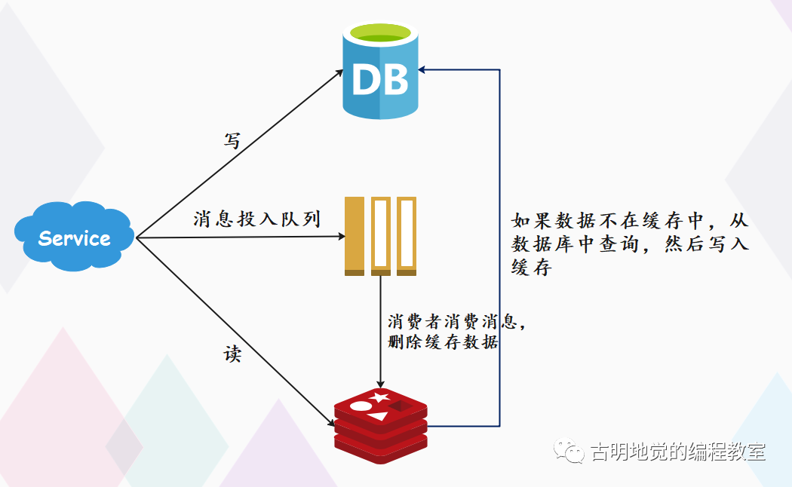

如果你实在不想引入消息队列，还可以有另一种方式：订阅变更日志。以 MySQL 为例，当一条数据发生修改时，MySQL 就会产生一条变更日志（Binlog），我们可以订阅这个日志，拿到具体操作的数据，然后再根据这条数据，去删除对应的缓存。

订阅变更日志，目前也有了比较成熟的开源中间件，比如 maxwell, canal，当然与此同时，我们需要投入精力去维护该中间件的高可用和稳定性。

因此想要保证数据库和缓存的一致性，推荐采用先更新数据库，再删除缓存方案，并配合消息队列或订阅变更日志来实现。所以对于业务调用方而言，如果数据库更新成功，那么直接返回成功即可，删除缓存这一步异步实现；如果数据库更新失败，那么直接返回失败，删除缓存也无需再进行了。


## 主从库延迟和延迟删除

目前还没有万事大吉，这里还有一个问题，我们说更新数据库 + 删除缓存可以解决数据不一致，但如果遇到了读写分离 + 主从复制延迟，那么还是会导致数据不一致的。举个例子：

1. 线程 A 更新主库 value = 2（旧值value = 1）；

2. 线程 A 删除缓存；

3. 线程 B 查询缓存没有命中，于是查询从库得到旧值（从库 value = 1）；

4. 从库同步完成（主从库 value = 2）；

5. 线程 B 将旧值写入缓存（value = 1）；

   

最终 value 的值在缓存中是 1（旧值），在主从库中是 2（新值），也发生不一致。所以我们在删除缓存的时候不能立即删，而是需要延迟删。

具体做法就是：线程 A 可以生成一条延时消息，写到消息队列中，消费者延时删除缓存。但问题来了，这个延迟删除缓存，延迟时间到底设置要多久呢？

1. 延迟时间要大于主从复制的延迟时间；

2. 延迟时间要大于线程 B 读取数据库 + 写入缓存的时间；

   

而一旦涉及到时间，就意味着不精确，因为谁也说不清这个时间到底应该设置多长，尤其是在分布式和高并发场景下就变得更加难评估。很多时候，我们都是凭借经验大致估算这个延迟时间，例如延迟 1 到 5 秒，只能尽可能地降低不一致的概率，这个过程当中如果有请求过来，还是可能会读到旧数据的。

但通过消息队列或订阅变更日志，我们是可以实现最终一致性的。所以实际使用中，建议采用先更新数据库，再删除缓存的方案，同时要尽可能地保证主从复制不要有太大延迟，降低出问题的概率。

以上就是删除缓存所采用的策略，但其实这背后还有一个问题，那就是如果删除的数据是一个热点数据，是有可能造成缓存击穿的。针对这个问题，国外的 Facebook 给出了一个解决方案，就是在删除的时候，如果判定这是一个热门数据，那么不直接删，而是给它设置一个很短的生命周期，比如 10 到 30 秒。然后业务方在调用的时候会表明这是一个脏数据，至于你要不要用，则交给业务方进行判断。


## 总结

为了提交服务的响应速度，我们一般会引入缓存。然而一旦缓存引入了，就必然涉及到数据不一致的问题，而解决问题的方式我们推荐使用先更新数据库、再删除缓存的方式。

但删除缓存有可能会失败，于是我们建议这一步配置消息队列或订阅变更日志来做，也就是不断地重试，来保证数据一致性。并且考虑到读写分离+主从复制也会有延迟，所以在往队列里面发消息时，会带有一个延时。而这个时间不好把握，需要参考当前整个系统的执行状态进行判断。

如果删除的是热门数据，可能造成缓存击穿，于是建议不直接删除，而是设置一个较短的生命周期。并且在业务方获取数据的时候，提示这是一个旧数据，是否使用由业务方来决定。

由此可见，当一致性和性能遇见冲突时，我们一般都会选择性能，并实现最终一致性。


# 十六、缓存雪崩、缓存击穿、缓存穿透


## 楔子

在使用 Redis 时，会面临`缓存雪崩`、`缓存穿透`、`缓存击穿`等问题，无论哪一个发生，都会导致大量请求打到数据库。如果数据库宕机，那就是很严重的事故了。

下面我们就来分析一下，这几个问题产生的原因以及解决办法。


## 缓存雪崩

缓存雪崩是指在短时间内，有大量缓存同时过期，导致大量请求直接查询数据库，从而对数据库造成了巨大的压力，严重情况下可能会导致数据库宕机。这种情况就叫做缓存雪崩。

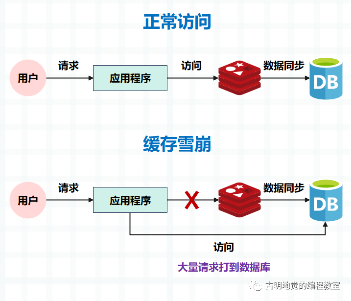

以上对比图可以看出缓存雪崩对系统造成的影响，那么问题来了，缓存雪崩是如何产生的呢？

- 缓存中有大量 key 同时过期，导致相应的请求会打到数据库；

- Redis 实例宕机了；

  

而问题的解决方式也很简单，首先来看第一种情况。

### 1）当大量 key 同时过期时。

为了避免缓存同时过期，可在设置缓存时额外添加一个随机时间，这样一来数据的过期时间会有所差别，但差别又不会太大。即避免了大量的缓存同时失效，又能满足业务功能。

除了微调过期时间之外，还可以通过服务降级。而所谓的服务降级就是指，在服务器资源不够、或者说压力过大时，将一些非核心服务暂停，优先保证核心服务的运行。比如：

- 当业务应用访问的是非核心数据（例如电商商品属性）时，暂时停止从缓存中查询这些数据，而是直接返回预定义信息、空值或是错误信息；

- 当业务应用访问的是核心数据（例如电商商品库存）时，仍然允许查询缓存，如果缓存缺失，也可以继续通过数据库读取；

  

这样一来，只有部分过期数据的请求会发送到数据库，数据库的压力就没有那么大了。

另外还设计二级缓存，也就是除了 Redis 之外，再设置一层缓存，当缓存失效之后，先去查询二级缓存。

### 2）Redis 实例宕机。

实例宕机相比缓存雪崩要更加严重，一般来说一个 Redis 实例可以支持数万级别的请求处理吞吐量，而单个数据库可能只支持数千级别的请求处理吞吐量，它们两个的处理能力至少相差了近十倍。由于 Redis 缓存失效，所以数据库就可能要承受近十倍的请求压力，从而因为压力过大而崩溃。

这个时候，可以进行服务熔断。服务熔断指的是在发生缓存雪崩时，为了防止引发数据库雪崩，甚至是整个系统的崩溃，我们暂停业务应用对缓存系统的接口访问。再具体点说，就是业务应用调用缓存接口时，缓存客户端并不把请求发给 Redis 缓存实例，而是直接返回，等到 Redis 缓存实例重新恢复服务后，再允许应用请求发送到缓存系统。

这样一来，我们就避免了大量请求因缓存缺失，而积压到数据库系统，保证了数据库系统的正常运行。

在业务系统运行时，我们可以监测 Redis 缓存所在机器和数据库所在机器的负载指标，例如每秒请求数、CPU 利用率、内存利用率等。如果我们发现 Redis 缓存实例宕机了，而数据库所在机器的负载压力突然增加（例如每秒请求数激增），说明就发生缓存雪崩了，大量请求被发送到数据库进行处理。我们可以启动服务熔断机制，暂停业务应用对缓存服务的访问，从而降低对数据库的访问压力。

因此服务熔断虽然可以保证数据库的正常运行，但是暂停了整个缓存系统的访问，对业务应用的影响范围大。为了尽可能减少这种影响，我们也可以进行请求限流。也就是在业务系统的请求入口前端，通过加锁排队的方式控制每秒进入系统的请求数，避免过多的请求被发送到数据库。

假设业务系统正常运行时，请求入口前端允许每秒进入系统的请求是 1 万个，其中 9000 个请求都能在缓存系统中进行处理，只有 1000 个请求会被应用发送到数据库进行处理。

然而一旦 Redis 宕机，数据库的每秒请求数会突然增加到每秒 1 万个，此时我们就可以启动请求限流机制，在请求入口前端只允许每秒进入系统的请求数为 1000 个，再多的请求就会在入口前端被直接拒绝服务。所以使用了请求限流，就可以避免大量并发请求压力传递到数据库层。

所以使用服务熔断或是请求限流机制，来应对 Redis 实例宕机导致的缓存雪崩问题，是属于事后诸葛亮。也就是已经发生非常严重的缓存雪崩了（实例宕机了），我们使用这两个机制，来降低雪崩对数据库和整个业务系统的影响。而我们也可以提前预防，也就是通过主从复制的方式，搭建 Redis 高可用集群，主节点挂了就切换到从节点。

所以当发生缓存雪崩时，解决方案如下：

- 随机化过期时间；
- 服务降级；
- 设置二级缓存；
- 服务熔断（Redis 实例宕机，问题很严重了）；
- 请求限流（相比服务熔断，限流的影响要小一些，它还允许一部分请求过来，交给数据库来处理）；
- 搭建 Redis 集群；


## 缓存击穿

缓存击穿指的是热点数据在某一时刻失效了，然后有大量的并发请求要访问热点数据，但由于数据已失效，于是这些请求就会全部打到数据库，从而给数据库造成巨大的压力，这种情况就叫做缓存击穿。

缓存击穿的执行流程如下图所示：

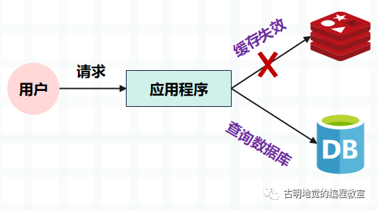

它的解决方案有以下两个：

### 1）加锁排队

此处理方式和缓存雪崩加锁排队的方法类似，都是在查询数据库时加锁排队，以此来减少服务器的运行压力。

但缓存击穿只是热点数据失效，所以我们有更加优雅的方式解决。

### 2）永不过期

对于某些热点缓存，我们可以设置永不过期，这样就能保证缓存的稳定性。但需要注意：在数据更改之后，要及时更新此热点缓存，不然就会造成查询结果的误差。


## 缓存穿透

缓存穿透是指查询数据库和缓存都无数据，因为数据库查询无数据，出于容错考虑，不会将结果保存到缓存中。因此每次请求都会去查询数据库，这种情况就叫做缓存穿透。

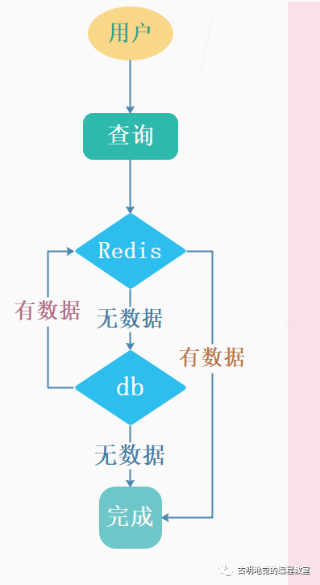

那么缓存穿透会在什么时候发生呢？

- 业务层误操作：缓存中的数据和数据库中的数据被误删除了，所以缓存和数据库中都没有数据；

- 恶意攻击：专门访问数据库中没有的数据；

  

缓存穿透会给数据库造成很大的压力，而缓存穿透的解决方案有以下几个。

### 1）缓存空值或缺省值

一旦发生缓存穿透，我们就可以针对查询的数据，在 Redis 中缓存一个空值或是和业务层协商确定的缺省值（例如，库存的缺省值可以设为 0）。后续应用发送请求进行查询时，就可以直接从 Redis 中读取空值或缺省值，然后返回。从而避免把大量请求发送给数据库处理，保证了数据库的正常运行。

但为了提高前台用户的使用体验 (解决长时间内查询不到任何信息的情况)，但是我们可以将空结果的缓存时间设置得短一些，例如 3~5 分钟，以防止无用数据过多。

### 2）使用布隆过滤器

关于布隆过滤器我们后面会说，总之它的特点就是：如果布隆过滤器检测数据存在，那么数据有可能不存在；但如果布隆过滤器检测数据不存在，那么数据一定不存在。

如果数据不存在，那么就不会查询数据库了，这样一来即使发生缓存穿透，也不会影响数据库。布隆过滤器可使用 Redis 实现，本身就能承担较大的并发访问压力。

### 3）在请求入口的前端进行检测

缓存穿透的一个原因是有大量的恶意请求访问不存在的数据，所以一个有效的应对方案是在请求入口前端，对业务系统接收到的请求进行合法性检测，把恶意的请求（例如请求参数不合理、请求参数是非法值、请求字段不存在）直接过滤掉，不让它们访问后端缓存和数据库。这样一来，也就不会出现缓存穿透问题了。

跟缓存雪崩、缓存击穿这两类问题相比，缓存穿透的影响更大一些。从预防的角度来说，我们需要避免误删除数据库和缓存中的数据；从应对角度来说，我们可以在业务系统中使用缓存空值或缺省值、使用布隆过滤器，以及进行恶意请求检测等方法。


## 缓存预热


再补充一下缓存预热，首先缓存预热并不是一个问题，而是使用缓存时的一个优化方案，它可以提高前台用户的使用体验。

缓存预热指的是在系统启动的时候，先把查询结果预存到缓存中，以便用户后面查询时可以直接从缓存中读取，节约用户的等待时间。

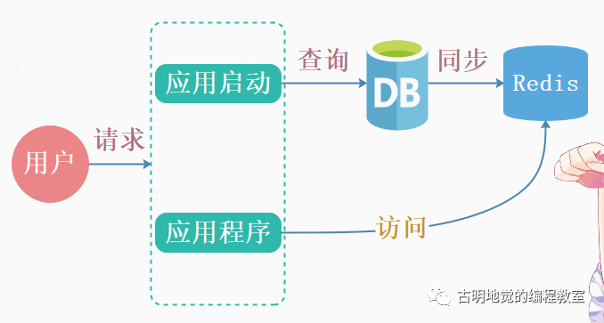

缓存预热的实现思路有以下三种：

- 把需要缓存的方法写在系统初始化的方法中，这样系统在启动的时候就会自动的加载数据并缓存数据；
- 把需要缓存的方法挂载到某个页面或后端接口上，手动触发缓存预热；
- 设置定时任务，定时自动进行缓存预热；


## 小结

缓存雪崩、缓存击穿、缓存穿透三者都比较类似，缓存雪崩是大量的 key 同时失效，导致请求全部访问数据库；而缓存击穿是某个 key、只不过是热点 key 失效了，同样导致大量请求访问数据库；缓存穿透是大量请求访问不存在的 key，导致数据库压力增大。

因此这三者是比较相似的，它们的解决方案如下：

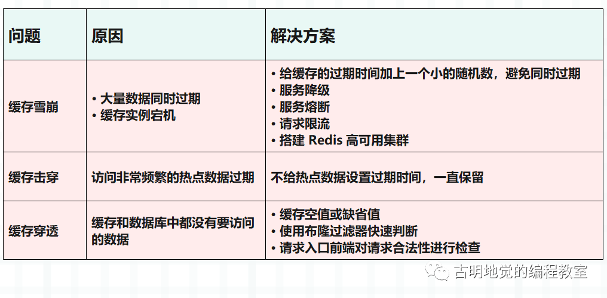

最后再说一下，服务熔断、服务降级、请求限流这些方法都是属于有损方案，在保证数据库和整体系统稳定的同时，会对业务应用带来负面影响。

例如使用服务降级时，数据的部分请求就只能得到错误返回信息，无法正常处理。如果使用了服务熔断，那么整个缓存系统的服务都被暂停了，影响的业务范围更大。而使用了请求限流机制后，整个业务系统的吞吐率会降低，能并发处理的用户请求会减少，会影响到用户体验。

所以尽量还是提前做好准备，防患于未然。


# 十七、使用布隆过滤器从海量数据中查询一个值是否存在

## 楔子

我们前面介绍过 HyperLogLog 可以用来做基数统计，但它统计的是总数量，而无法判断某个指定的值是否存在。那我们如果想在海量数据之中检索某个值存在与否，该怎么做呢？

因为是海量数据，所以我们不可能将每个键值都存起来，然后再从结果中检索数据。我们只能依靠专门处理此问题的特殊方法来实现数据的查找，而它就是我们今天的主角：布隆过滤器。


## 布隆过滤器实现原理

布隆过滤器（Bloom Filter）是 1970 年由布隆提出的，它实际上是一个很长的二进制向量和一系列随机映射函数，可以用于检索一个元素是否在一个集合中。它的优点是空间效率和查询时间都比一般的算法要好的多，缺点是有一定的误识别率和删除困难。也就是说布隆过滤器的优点就是计算和查询速度很快，但是缺点也很明显，会存在一定的误差。

假设现在要存储一个键值对，但是布隆过滤器不会真的存储具体的数据，那样就太占空间了。它是利用几个不同的无偏哈希函数，把此元素的 hash 值均匀地映射在位数组中。


通过哈希函数对 key 进行运算，然后再对数组的长度取模，即可得到一个索引，然后将数组中该索引对应的元素设置为 1 即可。并且由于存在冲突，比如 key1 和 key2 映射到同一个槽，所以我们会选择多个哈希函数，毕竟多个哈希函数同时冲突的概率还是很低的。

也就是说，每次添加时会通过几个无偏哈希函数算出它的一些位置，把这些位置设置成 1 就完成了添加操作。

当判断元素存在与否时，查询此元素的几个哈希位置上的值是否为 1，如果全部为 1，则表示此值存在，只要有一个不为 1，则表示不存在。

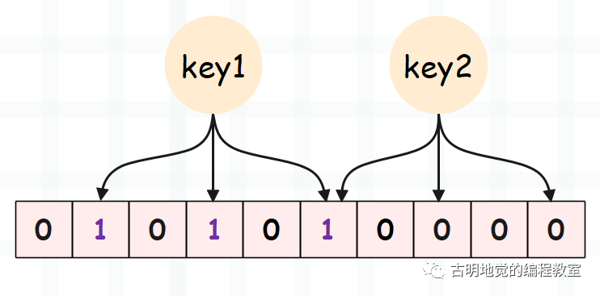

比如 key2 在映射的时候，发现第一个哈希槽的元素是 1，而后两个哈希槽的元素是 0。说明 key2 是不存在的，第一个槽之所以为 1，是因为其它的 key 碰巧也映射到了这个槽。所以我们才选择多个哈希函数（无偏），为的就是减少哈希的随机性带来的误差，只有全部为 1，key 才存在，而有一个不是 1，那么 key 就不存在。

但很明显，当位数组存储的值比较稀疏的时候，查询的准确率会很高；而当位数组存储的值越来越多时，误差也会增大。比如某个 key 不存在，但它映射出的多个哈希槽里面的元素都是 1，这种情况是有可能发生的，而此时也说明布隆过滤器已经存储了非常多的数据。

因此可以得出结论：布隆过滤器判断某个 key 存在时，此 key 不一定存在；但判断某个 key 不存在时，此 key 一定不存在。

所以布隆过滤器和 Redis Hash 类型的实现原理是一样的，只不过 Redis Hash 的每个哈希槽存的是 *dictEntry，而布隆过滤器的每个哈希槽存的是 1 或 0。以及布隆过滤器在映射的时候会使用多个哈希函数（以减少冲突），而 Hash 类型只用一个哈希函数。

最后还有一个重点，布隆过滤器使用的数组是位数组，也就是说数组里面的每个元素存的是 bit 位，因为 1 和 0 只用一个 bit 位就能保存。但现代计算机操作的最小单位是字节，所以在实际使用数组的时候，我们会基于位运算，将里面的一个元素当成多个元素来用。

比如 int64 类型的数组，里面有 10 个元素，每个元素 8 字节、也就是 64 个 bit 位，那么我们会把它看成是一个长度为 64 * 10 的位数组。如果类型是 int16，那么就看成是长度为 16 * 10 的位数组。

假设类型是 int64，哈希映射之后的槽是 60，那么就将数组中第一个元素的第 61 个位设置为 1；如果映射之后的槽是 80，就将数组中第二个元素的第 17 个位设置为 1。

所以布隆过滤器除了用到了哈希表，还用到了位图。因为是海量数据，因此数组会很长，并且为了避免哈希冲突，我们会将数组申请的更长一些。因此为了减少内存使用，布隆过滤器还使用了位图的思想。


## 安装布隆过滤器

在 Redis 中不能直接使用布隆过滤器，但我们可以通过 Redis 4.0 版本之后提供的 modules（扩展模块）方式引入。

1）下载并安装布隆过滤器；

```shell
git clone https://github.com/RedisLabsModules/redisbloom.git
cd redisbloom
make # 编译redisbloom
```

编译完毕之后，会在主目录生成一个 redisbloom.so 文件。

2）启动 Redis 服务器；

```shell
./redis-server redis.conf --loadmodule redisbloom.so
```

其中 --loadmodule 为加载扩展模块的意思，后面跟的是 redisbloom.so 文件的路径。

或者更简便的做法，还可以使用 Docker。

```shell
# 拉取镜像
docker pull redislabs/rebloom  
# 运行容器
docker run -p 6379:6379 redislabs/rebloom  
```

## 布隆过滤器的使用

布隆过滤器的命令不是很多，主要包含以下几个：

- bf.add：添加元素；

- bf.exists：判断某个元素是否存在；

- bf.madd：添加多个元素；

- bf.mexists：判断多个元素是否存在；

- bf.reserve：设置布隆过滤器的准确率；

  

下面举例说明。

**1）添加元素**

```shell
127.0.0.1:6379> bf.add user satori
(integer) 1
127.0.0.1:6379> bf.add user koishi
(integer) 1
127.0.0.1:6379> bf.add user marisa
(integer) 1
```

**2）判断元素是否存在**

```shell
127.0.0.1:6379> bf.exists user satori
(integer) 1
127.0.0.1:6379> bf.exists user satori1
(integer) 0
```

**3）添加多个元素**

```shell
127.0.0.1:6379> bf.madd user n1 n2 n3
1) (integer) 1
2) (integer) 1
3) (integer) 1
```

**4）判断多个元素是否存在**

```shell
127.0.0.1:6379> bf.mexists user n1 n2 n33
1) (integer) 1
2) (integer) 1
3) (integer) 0
```

可以看出以上结果没有任何误差，然后还有一个布隆过滤器的准确率，不过在介绍它之前，我们先使用 Python 操作一下 Redis 的布隆过滤器。

我们之前使用Python操作Redis使用第三方模块也叫redis，但是对于布隆过滤器来说，这个模块是不支持的。我们需要使用另一个第三方模块：redisbloom，直接 pip install redisbloom 安装即可。

> 其实 redisbloom 底层还是使用了我们之前的 redis 模块。

```py
# 我们之前创建连接使用的是 redis.Redis
# 而这个 Client 继承自 Redis
from redisbloom.client import Client

# 所以我们之前的一些操作，这里都可以用
client = Client(host="...", 
                decode_responses="utf-8")

# 添加单个元素
client.bfAdd("girl", "satori")

# 添加多个元素
client.bfMAdd("girl", "koishi", "marisa")

# 判断单个元素是否存在
print(client.bfExists("girl", "satori"))  # 1

# 判断多个元素是否存在
print(
    client.bfMExists("girl", "satori", "koishi", 
                     "marisa", "xxx")
)  # [1, 1, 1, 0]
```

**最后是设置布隆过滤器的准确率：**

```shell
# 对于一个已经存在的key，不可以使用bf.reserve
127.0.0.1:6379> bf.reserve user 0.01 200
(error) ERR item exists  
127.0.0.1:6379> bf.reserve user1 0.01 200  
OK
```

key 后面的两个值分别表示：error_rate、initial_size。

- error_rate：允许布隆过滤器的错误率，这个值越低，过滤器占用的空间也就越大，因为此值决定了位数组的大小。位数组是用来存储结果的，它的空间占用的越大（能存储的信息越多），错误率就越低，它的默认值是 0.01；
- initial_size：布隆过滤器能容纳的元素个数，实际存储的值大于此值，准确率就会降低，它的默认值是 100；


## 使用场景

- `垃圾邮件过滤；`

- `爬虫里的 URL 去重；`

- `判断一个值在亿级数据中是否存在；`

  

布隆过滤器在数据库领域的使用也比较广泛，例如：HBase, Cassandra, LevelDB, RocksDB 内部都有使用布隆过滤器。对于布隆过滤器而言，数据量增大到一定程度之后误差也会随之增大。


## 小结

通过本文我们知道可以使用 Redis 4.0 之后提供的 modules 方式来开启布隆过滤器，并学习了布隆过滤器的几个重要操作方法。其中比较关键的是 bf.reserve，它有 2 个重要的参数：错误率和数组大小，错误率设置的越低，数组设置的越大，需要存储的空间就越大，相对来说查询的错误率也越低。具体需要如何设置，需要使用者根据实际情况进行调整。

另外布隆过滤器有一个最大的特点：当它查询有数据时，此数据不一定真的存在，当它查询没有此数据时，此数据一定不存在。


# 十九、消息队列的终极解决方案 Stream

## 楔子

前面我们介绍了如何通过 List 和 Pub/Sub 来实现一个消息队列，但很明显它们都有很严重的缺陷，作为消息队列是不合格的。

而 Redis 作者也注意到了这一点，于是开发了 disque，目的是成为一个基于内存的分布式消息中间件。但该项目没什么人关注，于是在 5.0 的时候将 disque 的功能移植到了 Redis 中，并给它定义了一个新的数据类型：Stream。

而前面我们说过，一个专业的消息队列应该支持以下功能：

- 支持阻塞等待拉取消息；

- 支持发布 / 订阅模式；

- 消费者下线之后重新上线，仍能消费下线期间生产者发送的消息；

- 消费者消费失败，可重新消费，也就是支持消息被同一个消费者消费多次；

- 实例宕机，消息不丢失，数据可持久化；

- 即使消息大量堆积，也不会丢数据；

  

那么这些功能 Stream 是不是都支持呢？以及 Stream 类型采用的底层数据结构又是什么呢？带着这些问题，我们来开始 Stream 的学习，首先是它的使用。


## Stream 的使用

首先，Stream 作为消息队列，它保存的消息通常具有以下两个特征：

- 一条消息由一个或多个键值对组成；
- 每插入一条消息，这条消息都会对应一个消息 ID；

关于消息 ID，我们一般会让 Redis 自动生成，并且 ID 是递增的。消息 ID 由时间戳和序号组成，时间戳是消息插入时，以毫秒为单位的服务器当前时间；但光有时间戳还不够，因为同一毫秒内，可能会插入多条数据，所以还要有序号。

而 Stream 支持的 API 如下：

- xadd：添加消息；

- xread：读取消息；

- xlen：查询消息的长度；

- xdel：根据消息 ID 删除消息；

- xrange：读取某个区间的消息；

- del：删除整个 Stream，当然 del 可以删除任意 key；

  

我们实际操作一波。

### 添加消息

命令：`xadd key ID field1 string1 field2 string2···`

```shell
> xadd girl * name satori age 17
"1663918086746-0"
```

添加消息之后会返回消息的 ID，由时间戳+序号组成，并且 ID 我们指定的是 *，表示让 Redis 自动生成 ID，当然我们也可以手动指定。

再插入两条消息，此时 girl 这个 Stream 里面就有了三条消息。

```shell
> xadd girl * name koishi age 16
"1663918266484-0"
> xadd girl * name marisa age 16
"1663918276271-0"
```

所以一条消息会包含一组键值对，并且从插入数据和返回结果能够看出，对于 Stream 类型来说，它要保存的数据有以下两个特征。

- 连续插入的消息 ID，其前缀有较多部分是相同的，因为它们的插入时间非常接近；

- 连续插入的消息，它们对应的键值对中的键通常是相同的（也可以不同），比如这里都是 name 和 age，因为理论上发往同一个 Stream 里面的消息应该具备相同的特征；

  

那么针对 Stream 的这两个数据特征，应该使用什么样的数据结构来保存这些消息数据呢？

毫无疑问，我们首先想到的就是哈希表，一个消息 ID 对应哈希表中的一个 key，消息内容对应这个 key 的 value。

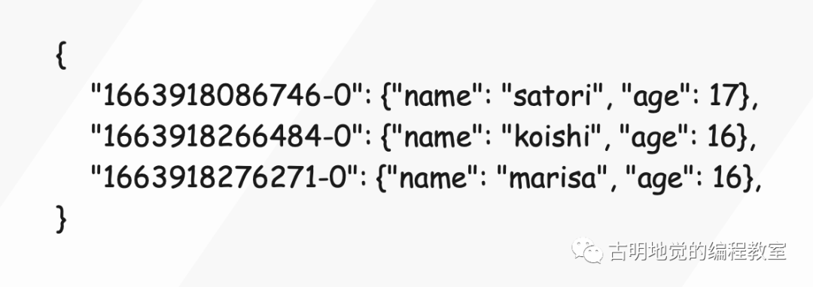

但是就像刚才说的一样，消息 ID 和消息中的键经常会有重复的部分。如果使用哈希表，就会导致有不少冗余数据，这会浪费 Redis 宝贵的内存空间。

因此，为了充分节省内存空间，Stream 使用了两种内存友好的数据结构：listpack 和 Radix Tree。其中消息 ID 使用 String 保存，作为 Radix Tree 中的 key，而消息具体数据是使用 listpack 保存，作为 Radix Tree 的 value。

关于 Radix Tree 我们一会再说，先回到 Stream 的 API 上面来。

### 查询消息长度

命令：`xlen key`

```shell
# 显然当前有 3 条消息
> xlen girl
(integer) 3
# 再插入一条
> xadd girl * name scarlet age 400
"1663919561887-0"
# 长度变为 4
127.0.0.1:6379> xlen girl
(integer) 4
# 如果 key 不存在，则长度为 0
> xlen not_exists
(integer) 0
```

### 删除消息

命令：`xdel key 消息ID·····`，可以同时删除多个

```shell
> xlen girl
(integer) 4
# 根据消息 ID 删除消息，可同时删除多个
# 并返回删除的消息数量
> xdel girl 1663918276271-0
(integer) 1
# 还剩下 3 个
> xlen girl
(integer) 3
```

### 删除 Stream

直接使用 del，它可以删除任意多个任意的 key。

```shell
> del girl
(integer) 1
```

### 查询区间消息

命令：`xrange key start end count n`，这里的 start 和 end 指的是消息ID。

```shell
# 添加消息
> xadd girl * name satori age 17
"1663921038755-0"
> xadd girl * name koishi age 16
"1663921047878-0"
> xadd girl * name marisa age 16
"1663921054277-0"
> xadd girl * name scarlet age 400
"1663921064383-0"
# 查询
> xrange girl 1663921038755-0 1663921064383-0
1) 1) "1663921038755-0"
   2) 1) "name"
      2) "satori"
      3) "age"
      4) "17"
2) 1) "1663921047878-0"
   2) 1) "name"
      2) "koishi"
      3) "age"
      4) "16"
3) 1) "1663921054277-0"
   2) 1) "name"
      2) "marisa"
      3) "age"
      4) "16"
4) 1) "1663921064383-0"
   2) 1) "name"
      2) "scarlet"
      3) "age"
      4) "400"
```

还是比较简单的，把整个过程想象成数组的截取即可，只不过数组用的是索引，Stream 用的是消息 ID。另外这里我们指定的是第一条和最后一条的消息 ID，所以全部返回了，而返回全量消息还有一种做法：xrange girl - +。

- \- 代表第一条消息；

- \+ 代表最后一条消息；

  

并且在返回的时候，还可以`指定 count 来限制数量`。

```shell
# 总共 4 条，但只查询 2 条
> xrange girl - + count 2
1) 1) "1663921038755-0"
   2) 1) "name"
      2) "satori"
      3) "age"
      4) "17"
2) 1) "1663921047878-0"
   2) 1) "name"
      2) "koishi"
      3) "age"
      4) "16"
```

注意：这个过程并不是先全量查询，然后只返回前 count 条；而是当查询的条数达到 count 时，直接返回。另外即使数量达不到 count 也是可以的，有多少返回多少，比如这里的消息总量是 4，但 count 指定为 10，那么就只会返回 4 条。

最后，虽然这里查询用的是消息ID，但是也要像索引一样注意先后关系。start 对应的消息要在 end 对应的消息之前，类似于索引。

### 读取某条消息之后的 n 条消息

命令：`xread count n streams xxx MESSAGE_ID`

从名为 xxx 的 Stream 中，读取消息 ID 为 MESSAGE_ID 之后的 n 条消息。

```shell
# 读取 '1663921047878-0' 之后的两条消息
> xread count 2 streams girl 1663921047878-0
1) 1) "girl"
   2) 1) 1) "1663921054277-0"
         2) 1) "name"
            2) "marisa"
            3) "age"
            4) "16"
      2) 1) "1663921064383-0"
         2) 1) "name"
            2) "scarlet"
            3) "age"
            4) "400"
            
# 1663921054277-0 后面只剩下一条消息了
# 所以即便 count 为 2，也只返回了一条
> xread count 2 streams girl 1663921054277-0
1) 1) "girl"
   2) 1) 1) "1663921064383-0"
         2) 1) "name"
            2) "scarlet"
            3) "age"
            4) "400"
```

并且该命令还提供了一个可以阻塞读取的参数 block，我们可以使用它读取某条数据之后的新增数据。

xread count 1 block 0 streams girl MESSAGE_ID

不使用 block 的话，如果该消息 ID 后面没有消息了，那么会直接返回空。但通过 block 超时时间 可以在没有消息的时候让程序处于阻塞状态，如果超时时间为 0，那么会一直等待，直到队列里面有数据再返回。

一般来说，如果使用 block，那么 MESSAGE_ID 一定是最后一条消息的 ID。如果不是最后一条消息的 ID，那么有没有 block 没什么区别。所以 Redis 为了使用方便，还支持我们使用 $，它代表的就是最后一条消息的 ID。

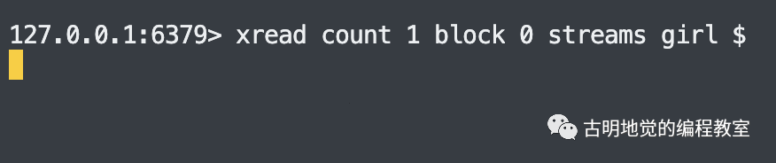

我们看到程序阻塞在这里了，因为 $ 代表最后一条消息，它后面已经没有消息了。所以该命令会阻塞，直到别的客户端往 girl 这个 Stream 里插入一条消息之后才会返回。

```shell
> xadd girl * name sakura age 20
"1663923328212-0"
```

新开一个终端，往里面写入一条消息，然后查看第一个终端。

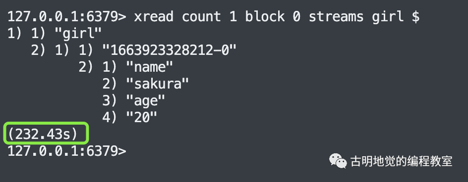

发现第一个终端读取到消息，并解除阻塞，而且输出也告诉我们整个过程阻塞了 232.43 秒。当超时时间为 0 时，代表没有上限，如果大于 0，代表阻塞指定的毫秒数。

最后，我们这里的 count 指定的是 1，但不管指定的是多少，只要有消息过来，都会解除阻塞。

**所以从这里我们看到，消息队列的第一个特性：支持阻塞式拉取消息，Stream 是满足的。**


## 消费者组

Stream 也支持消费者组，我们来看一下。

### 创建消费者组

命令：`xgroup create <stream_key> <group_key> <ID>`

```shell
> xgroup create girl group1 0-0
OK
```

- girl：stream key 的名称；

- group1：group key 的名称

- 0-0：消息 ID，0-0 表示从第一条开始向后读取；

  

如果要从最后一条消息开始向后读取的话，那么使用 $ 即可。

```shell
> xgroup create girl group2 $
OK
```

以上两个消费者组就创建完毕了。

### 读取消息

命令：`xreadgroup group group_key consumer_key [count n] streams stream_key`

- group_key：创建的分组名；
- consumer_key：消费者名，随便指定即可；
- count n：每次读取的数量，可选，不指定全部返回；
- stream_key：消息队列；

```shell
# 从组 'group1' 里面指定一个消费者 'c1'
# 然后消费队列 girl 里面的消息，并且消费 1 条
# 注意结尾有一个 >，表示后续从下一条消息开始消费
6379> xreadgroup group group1 c1 count 1 streams girl >
1) 1) "girl"
   2) 1) 1) "1663921038755-0"
         2) 1) "name"
            2) "satori"
            3) "age"
            4) "17"
```

然后还可以再启动一个消费者：

```shell
# 从组 'group' 里面指定一个消费者 c2，继续消费
# 消费者名字可以随便起
6379> xreadgroup group group1 c2 count 2 streams girl >
1) 1) "girl"
   2) 1) 1) "1663921047878-0"
         2) 1) "name"
            2) "koishi"
            3) "age"
            4) "16"
      2) 1) "1663921054277-0"
         2) 1) "name"
            2) "marisa"
            3) "age"
            4) "16"
```

这里消费了两条，如果不指定 count，那么默认全部消费。当消息消费完毕之后，会返回空。

```shell
# 此时已全部消费完毕了，如果再消费就会返回空
6379> xreadgroup group group1 c3 streams girl >
1) 1) "girl"
   2) 1) 1) "1663921064383-0"
         2) 1) "name"
            2) "scarlet"
            3) "age"
            4) "400"
      2) 1) "1663923328212-0"
         2) 1) "name"
            2) "sakura"
            3) "age"
            4) "20"
```

注意：消费者的数量是不受限制的。这个有点类似 kafka，一个组里面可以有任意个消费者，它们共同消费一个队列里的数据，实现并行消费。但一条消息最多只能被组里面的一个消费者消费，如果一条消息同时被两个消费者消费，那么这两个消费者应该隶属于不同的消费者组。

此外，xreadgroup 也支持阻塞式拉取消息。

```shell
6379> xreadgroup group group1 c4 block 0 streams girl >
# 客户端陷入阻塞
```

如果我们此时另一个客户端往 girl 里面写入一条消息，那么此处就会解除阻塞，并返回新写入的消息。这里我们不写了，直接停掉，然后创建一个新的消费者组，看看能不能从头开始消费。

```shell
# 已经消费到头了，再消费的话，则返回空
> xreadgroup group group1 c4 streams girl >
(nil)
# 新建一个消费者组
> xgroup create girl group1_1 0-0
OK
# 从头开始消费
> xreadgroup group group1_1 c4 count 1 streams girl >
1) 1) "girl"
   2) 1) 1) "1663921038755-0"
         2) 1) "name"
            2) "satori"
            3) "age"
            4) "17"
```

**所以这里我们又可以得出一个结论：Stream 满足消息队列的第二个特点，支持发布 / 订阅模式，就是让多组消费者消费同一批数组。**

**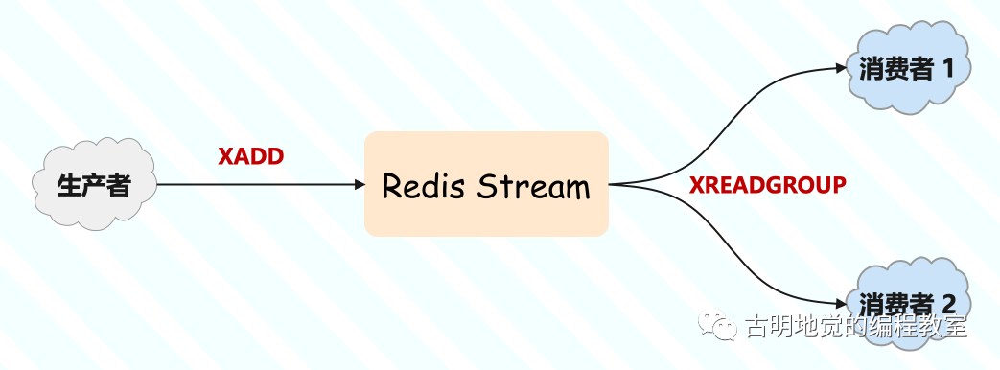**

从图中可以看到，两组消费者获取同一批数据，这样一来就达到了多组消费者「订阅」消费的目的。

### 消息消费确认

一般消息接收完了，我们会回复一个确认信息，告知已经消费完毕，命令：`xack stream-key group-key ID···`

```shell
> xack girl group1_1 1663921038755-0
(integer) 1
```

消费确认增加了消息的可靠性，一般在业务处理完成之后，需要执行 ack 确认消息已经被消费完成。

所以除了上面拉取消息时用到了消息 ID，这里为了保证重新消费，也要用到了消息 ID。当一组消费者处理完消息后，需要执行 XACK 命令告知 Redis，这时 Redis 就会把这条消息标记为「处理完成」。

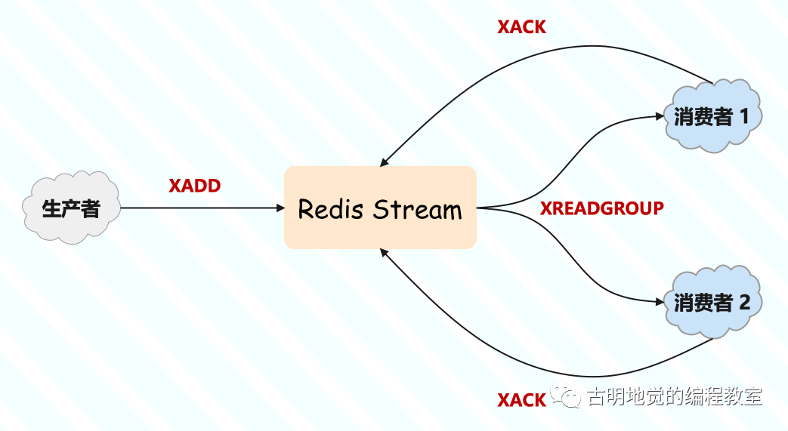

如果消费者异常宕机，肯定不会发送 XACK，那么 Redis 就会依旧保留这条消息，待这组消费者重新上线后，Redis 就会把之前没有处理成功的数据，重新发给这个消费者。这样一来，即使消费者异常，也不会丢失数据了。

并且即使是生成者在消费者下线期间生产的消息，消费者上线之后也是可以收到的。因此消息队列的第三和第四个特性，Stream 也是支持的。

### 查询未确认的消息

```shell
# 未确认的消息有 6 条
> xpending girl group1
1) (integer) 6
2) "1663921038755-0"
3) "1663923499682-0"
4) 1) 1) "c1"
      2) "1"
   2) 1) "c2"
      2) "2"
   3) 1) "c3"
      2) "3"
# 确认两条      
> xack girl group1 1663921038755-0 1663921047878-0
(integer) 2
# 还剩四条
> xpending girl group1
1) (integer) 4
2) "1663921054277-0"
3) "1663923499682-0"
4) 1) 1) "c2"
      2) "1"
   2) 1) "c3"
      2) "3"
```


### xinfo 信息查询

**`xinfo stream stream_key`：查询 Stream 的相关信息；**

```shell
> xinfo stream girl
 1) "length"
 2) (integer) 6 # 队列中有6个消息
 3) "radix-tree-keys"
 4) (integer) 1
 5) "radix-tree-nodes"
 6) (integer) 2
 7) "last-generated-id"
 8) "1663923499682-0"
 9) "groups" # 5 个消费分组，我中间又创建了几个
10) (integer) 5
11) "first-entry"  # 第一条消息
12) 1) "1663921038755-0"
    2) 1) "name"
       2) "satori"
       3) "age"
       4) "17"
13) "last-entry"  # 最后一条消息
14) 1) "1663923499682-0"
    2) 1) "name"
       2) "sakura"
       3) "age"
       4) "20"
```

**`xinfo groups stream_key`：查询 Stream 消费者组信息；**

```shell
> xinfo groups girl
1) 1) "name"
   2) "group1" # 消费者组名称
   3) "consumers"
   4) (integer) 4  # 组里面有 3 个消费者
   5) "pending"
   6) (integer) 3  # 3 个未确认的消息
   7) "last-delivered-id"
   8) "1663923499682-0"
2) 1) "name"
   2) "group1_1"
   3) "consumers"
   4) (integer) 1
   5) "pending"
   6) (integer) 0
   7) "last-delivered-id"
   8) "1663921038755-0"
3) ...
   ...
```

**`xinfo consumers stream_key group_key`：查询某个消费组的成员信息**

```shell
> xinfo consumers girl group1
1) 1) "name"
   2) "c1"
   3) "pending"
   4) (integer) 0
   5) "idle"
   6) (integer) 4667346
2) 1) "name"
   2) "c2"
   3) "pending"
   4) (integer) 1
   5) "idle"
   6) (integer) 4405245
3) 1) "name"
   2) "c3"
   3) "pending"
   4) (integer) 2
   5) "idle"
   6) (integer) 4259811
4) 1) "name"
   2) "c4"
   3) "pending"
   4) (integer) 0
   5) "idle"
   6) (integer) 1879248
```

**`xgroup delconsumer stream-key group-key consumer-key`：删除组里面的某个消费者**

```shell
> xgroup delconsumer girl group1 c2
(integer) 1
```

**`xgroup destroy stream-key group-key`：删除消费者组**

```shell
> xgroup destroy girl group1
(integer) 1
```

关于 Stream 的命令我们就介绍完了，并且在过程中，我们知道消息队列的前 4 个特性，Stream 都是满足的。那么问题来了，后两个特性是否也满足呢？

首先倒数第二个特性：实例宕机，消息不丢失，数据可持久化，显然 Stream 是满足的。因为 Stream 是新增的数据类型，与其它数据类型一样，每个写操作，也都会写入到 RDB 和 AOF 中。我们只需要配置好持久化策略，这样就算 Redis 宕机重启，Stream 中的数据也可以从 RDB 或 AOF 中恢复回来。

最后一个特性：即使消息大量堆积，也不会丢数据，这个 Stream 是否支持呢？一般来说，当消息队列发生消息堆积时，一般只有 2 个解决方案：

- 生产者限流：避免消费者处理不及时，导致持续积压；

- 丢弃消息：中间件丢弃旧消息，只保留固定长度的新消息；

  

而 Redis 在实现 Stream 时，采用了第 2 个方案，在发布消息时，你可以指定队列的最大长度，防止队列积压导致内存爆炸。

```shell
# 指定队列长度最大 10000
> XADD queue MAXLEN 10000 * name satori
"1638518032447-0"
```

当队列长度超过上限后，旧消息会被删除，只保留固定长度的新消息。这么来看，Stream 在消息积压时，如果指定了最大长度，还是有可能丢失消息的。

经过以上分析，我们发现 Redis 的 Stream 几乎覆盖了消息队列的各种场景，那这是不是意味着，Stream 可以作为专业的消息队列中间件来使用呢？其实还不够，就算 Redis 能做到以上这些，也只是「趋近于」专业的消息队列。原因在于 Redis 本身的一些问题，如果把其定位成消息队列，还是有些欠缺的。

下面就来将 Redis 与专业的队列中间件做个对比，看看 Redis 作队列时，还有哪些欠缺？


## Redis 和专业消息队列的差异

首先使用消息队列，会涉及三个部分：生产者、中间件本身、消费者。

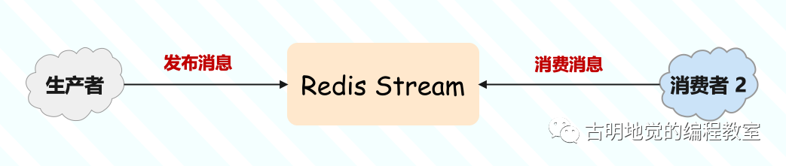

因此消息是否会丢失，需要考虑以下三种情况：

- 生产者会不会丢消息；
- 消费者会不会丢消息；
- 队列中间件会不会丢消息；

### 生产者会不会丢消息

当生产者在发布消息时，可能发生以下异常情况：

- 消息没发出去：网络故障或其它问题导致发布失败，中间件直接返回失败；

- 不确定是否发布成功：网络问题导致发布超时，可能数据已发送成功，但读取响应结果超时了；

  

如果是第一种，消息根本没发出去，那么重新发一次就好了。如果是第二种，生产者没办法知道消息到底有没有发成功？所以，为了避免消息丢失，它也只能继续重试，直到发布成功为止。

> 生产者一般会设定一个最大重试次数，超过上限依旧失败，需要记录日志报警处理。

也就是说，生产者为了避免消息丢失，只能采用失败重试的方式来处理。但这也意味着消息可能会重复发送，因为消息可能发送成功了，但消费者不知道而已。所以消费者这边，就需要多做一些逻辑了，对于敏感业务，当消费者收到重复数据数据时，要设计幂等逻辑，保证业务的正确性。

从这个角度来看，生产者会不会丢消息，取决于生产者对于异常情况的处理是否合理。所以无论是 Redis 还是专业的队列中间件，生产者在这一点上都是可以保证消息不丢的。

### 消费者会不会丢消息

这种情况就是我们前面提到的，消费者拿到消息后，还没处理完成，就异常宕机了，那消费者还能否重新消费失败的消息？

要解决这个问题，就必须要有一个机制，只要当消费者在处理完消息、并告知中间件之后，中间件才能把消息标记已处理，否则仍会把这些数据发给消费者。

这种方案需要消费者和中间件互相配合，才能保证消费者这一侧的消息不丢。无论是 Redis 的 Stream，还是专业的队列中间件，例如 RabbitMQ, Kafka，其实都是这么做的。所以从这个角度来看，Redis 也是合格的。

### 中间件本身会不会丢消息

前面两个问题都比较好处理，只要客户端和服务端配合好，就能保证不丢消息。但如果队列中间件本身就不可靠呢？毕竟生产者和消费者都依赖它，如果它不可靠，那么无论生产者和消费者怎么做，都无法保证数据不丢。

在这个方面，Redis 其实没有达到要求，Redis 在以下两个场景下，都会导致数据丢失。

- AOF 持久化配置为每秒写盘，但这个写盘过程是异步的，Redis 宕机时会存在数据丢失的可能；

- 主从复制也是异步的，主从切换时，也存在丢失数据的可能（从库还未同步完成主库发来的数据，就被提成主库）；

  

基于以上原因我们可以看到，Redis 本身无法保证严格的数据完整性，所以如果把 Redis 当做消息队列，在这方面是有可能导致数据丢失的。

而像 RabbitMQ 或 Kafka 这类专业的队列中间件，在使用时一般都是部署一个集群，生产者在发布消息时，队列中间件通常会写「多个节点」，以此保证消息的完整性。这样一来，即便其中一个节点挂了，也能保证集群的数据不丢失。也正因为如此，它们在设计时也更复杂，毕竟是专门用作消息队列的。

但 Redis 的定位则不同，它的定位更多是当作缓存来用，它们两者在这个方面肯定是存在差异的。最后，我们来看消息积压怎么办？

### 消息积压怎么办

因为 Redis 的数据都存储在内存中，这意味着一旦发生消息积压，就会导致 Redis 的内存持续增长，如果超过机器内存上限，则面临被 OOM 的风险。所以，Redis 的 Stream 提供了可以指定队列最大长度的功能，就是为了避免这种情况发生。

但 Kafka、RabbitMQ 这类消息队列就不一样了，它们的数据都会存储在磁盘上，磁盘的成本要比内存小得多。当消息积压时，无非就是多占用一些磁盘空间，相比于内存，在面对积压时也会更加「坦然」。综上我们可以看到，把 Redis 当作队列来使用时，始终面临的两个问题：

- Redis 本身可能会丢数据；

- 面对消息积压，Redis 内存资源紧张；

  

到这里，关于 Redis 是否可以用作队列，结论已经很清晰了。如果你的业务场景不复杂，对于数据丢失不敏感，而且消息积压概率比较小的情况下，把 Redis 当作队列是完全可以的。而且 Redis 相比于 Kafka 和 RabbitMQ，部署和运维也更加轻量。

关于 Redis 用作消息队列，我们再总结一下：

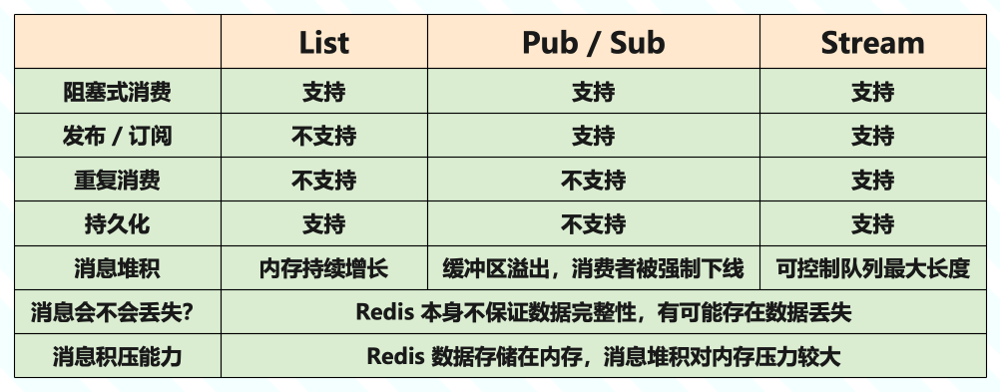

> 该部分内容引用自：水滴与银弹《把Redis当作队列来用，真的合适吗？》

Stream 类型相关的内容我们就介绍完了，再来看看 Stream 是怎么实现的？


## Stream 底层结构

Stream 结构如下：

```
typedef struct stream {
    //保存消息的Radix Tree
    rax *rax;               
    //消息流中的消息个数
    uint64_t length;        
    //当前消息流中最后插入的消息的ID
    streamID last_id;       
    //当前消息流的消费组信息，也是用Radix Tree保存
    rax *cgroups;           
} stream;
```

所以重点是 Radix Tree，它是前缀树的一种，前缀树也被称为字典树，英文是 Trie。刷 LeetCode 的话，应该会遇到相关的问题。

前缀树的特点是，每个 key 会被拆分成单字符，然后逐一保存在树上的节点中。前缀树的根节点不保存任何字符，而除了根节点以外的其他节点，每个节点只保存一个字符。当我们把从根节点到当前节点的路径上的字符拼接在一起时，就可以得到相应 key 的值了。

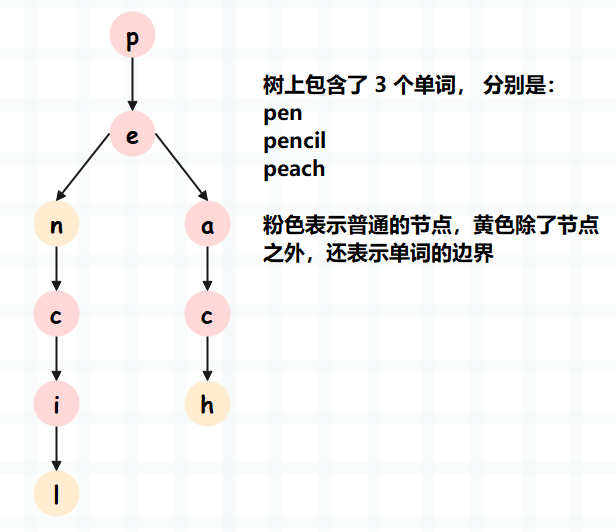

前缀树在查找指定字符串的时候，时间复杂度是 O(K)，换句话说它只和要查找的字符串的长度有关。并且 pen 和 pencil 都具有相同的前缀，如果采用哈希表，那么 pen 三个字符会被保存两遍。

但话虽如此，前缀树不可能保证每个相同的字符，都能被共享，举个例子：

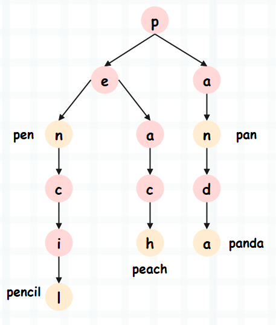

对于当前这个例子，我们就无法保证每个字符都能被共享。

`未完待续`


# 二十、用 Redis 实现分布式锁

## 什么是分布式锁

锁是多线程编程中的一个重要概念，它是保证多线程并发时顺利执行的关键。我们通常所说的锁是指程序中的锁，也就是`单机锁`，比如 Python threading 模块里面的 Lock 等等。

因此锁主要用于并发控制，保证一项资源在任何时候只能被一个线程使用，如果其它线程也要使用同样的资源，必须排队等待上一个线程使用完。

但很明显，单机锁要求使用范围必须局限在一个进程当中，如果换做是多个进程，需要同时操作一个共享资源，如何互斥呢？例如，现在的业务应用通常都是微服务架构，这也意味着一个应用会部署多个进程，那这多个进程如果需要修改 MySQL 中的同一行记录时，该怎么做呢？

显然为了避免操作乱序导致数据错误，我们需要引入「分布式锁」来解决这个问题。

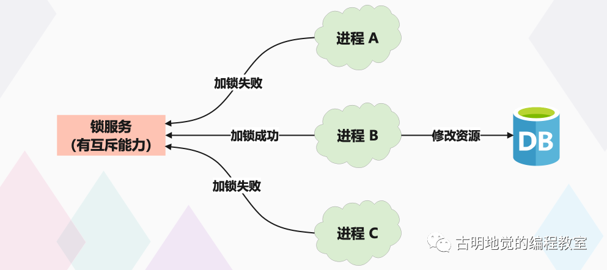

想要实现分布式锁，必须借助一个外部系统，所有进程都去这个系统上申请「加锁」。而这个外部系统，必须要实现「互斥」的能力，即两个请求同时进来，只会给一个进程返回成功，另一个返回失败（或等待）。

而这个外部系统，可以是关系型数据库, Redis, ZooKeeper, etcd 等等，本次我们就来介绍如何基于 Redis 实现分布式锁。


## 如何实现分布式锁

Redis 如果想实现分布式锁，那么它必须要有互斥的能力，显然单线程的 Redis 是可以满足的。

它的实现思路是使用 setnx（set if not exists），该命令的特点是只有 key 不存在时才会设置成功，如果 key 存在则会设置失败。所以当一个应用调用 setnx 成功时，则表明此锁创建成功，否则代表这个锁已经被占用、创建失败。

我们举个例子，假设有两个客户端，首先客户端 1 申请加锁，加锁成功：

```shell
127.0.0.1:6379> SETNX lock 1
(integer) 1 # 客户端 1，加锁成功
```

然后客户端 2 也申请加锁，但因为后到达，所以加锁失败：

```shell
127.0.0.1:6379> SETNX lock 1
(integer) 0 # 客户端 2，加锁失败
```

此时加锁成功的客户端，就可以去操作「共享资源」了，例如修改 MySQL 的某一行数据，或者调用一个 API 请求。但需要注意的是，操作完成后还要及时释放锁，给后来者让出操作共享资源的机会。如果锁不释放，那么其它进程就永远都没有机会操作共享资源了。

而释放锁也很简单，直接使用 DEL 命令将 key 删除即可：

```shell
127.0.0.1:6379> DEL lock # 释放锁
(integer) 1
```

这样其它客户端就可以继续创建锁了。

所以分布式锁只是一个抽象的概念，并不是什么具体的数据结构。因为操作共享资源的多个进程之间是没有任何关系的，为了能让它们彼此互斥，就需要借助一个第三方系统，比如 Redis。多个进程同时连接 Redis，然后创建一个名称相同的 key，谁创建成功了，那么我们就认为谁拿到了分布式锁。

但这个过程要求 Redis 能够实现互斥，多个进程只能有一个创建成功，因此 setnx 命令就是一个绝佳的选择。设置成功时返回 True，那么进程就知道自己拿到了锁，于是会去操作共享资源；如果返回 False，就知道这个 key 已经被其它进程设置了，换言之就是分布式锁已经被别人取走了。

从逻辑上来讲，单机锁和分布式锁是类似的：


但是从实现上来讲，两者是不同的，分布式锁需要借助一个具有互斥功能的第三方组件。

但是目前这个设计还是存在问题的，首先获得锁的进程在资源操作完毕之后，必须通过 DEL 命令把锁释放掉，否则其它进程就永远没有机会操作共享资源了。那么问题来了，如果在执行 DEL 释放锁之前，程序挂掉了怎么办，比如出现异常、节点宕机，都可以导致程序挂掉。

显然如果是这种情况，那么就出现了死锁，因为锁永远不会被释放。要如何解决呢？


## 如何解决死锁

一个容易想到的方案就是，在设置 key 的时候，同时绑定一个过期时间，比如 30 秒。

```shell
# 加锁
127.0.0.1:6379> SETNX lock 1    
(integer) 1
# 10s后自动过期
127.0.0.1:6379> EXPIRE lock 30  
(integer) 1
```

这样即使程序出现崩溃，也不用担心，因为 30 秒超时时间一过，这个锁会自动解除，因此不会出现死锁的情况了。

但真的就是万事大吉了吗？可以看到 setnx 和 expire 是两条独立的命令，故存在原子性的问题，比如 setnx 成功之后，因为网络原因导致 expire 执行失败、或者因为客户端异常崩溃导致 expire 压根没有执行。

因此这两条命令如果不能保证是原子操作（全部成功），仍有潜在的风险导致过期时间设置失败，进而发生「死锁」问题。那么我们如何能保证这两条命令同时成功呢？

在早期要解决此问题，需要引入额外的类库，但这样就增加了使用的成本。因此在 Redis 2.6.12 时将 set 命令进行了扩展，从而解决了此问题。

- set key value ex 30：设置 key 的同时指定 30s 的过期时间；

- set key value nx：key 不存在进行设置，存在则设置失败，等价于 setnx；

- set key value xx：key 存在进行设置，不存在则设置失败，没有 setxx；

- set key value nx|xx ex 30：相当于将 setnx/setxx 和 expire 组合在一起；

  

```shell
# 设置成功，ex 30 和 nx 谁先谁后都可以
127.0.0.1:6379> set lock 1 ex 30 nx  
OK
# 在锁被占用的情况下，设置失败
127.0.0.1:6379> set lock 1 ex 30 nx  
(nil)
# 30s 过后，锁失效，设置成功
127.0.0.1:6379> set lock 1 ex 30 nx  
OK
```

这样我们就可以使用 set 命令来设置分布式锁，并同时设置超时时间了，因为整体就是一条 set 命令，可以保证原子性。


## 分布式锁的超时问题

使用 set 命令之后好像所有问题都解决了，然而真相却没那么简单。使用 set 命令只解决创建锁的问题，但释放锁还存在一些问题。

例如我们设置锁的最大超时时间是 30s，但业务处理使用了 35s，这就会导致原有的业务还未执行完成，锁就被释放了。这时候第二个客户端进程就会拿到锁，于是就会出现两个客户端同时操作共享资源，从而造成一系列问题。

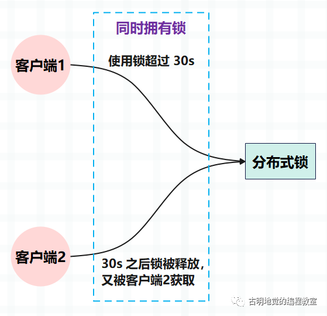

所以不管是什么组件，只要是和设置超时时间相关的，基本都是很难评估的。谁也说不准，操作一个共享资源究竟要花费多长时间。即使把超时时间设置长一些，也只能缓解，却无法彻底根治。而且如果超时时间设置长了的话，比如 60s，但如果客户端 10s 就执行完了，那么就会额外多出 50s 的等待时间，这对服务的执行效率也不友好。

因此即便设置了过期时间，也会导致问题（业务的执行时间超过了分布式锁的过期时间）。但除此之外，该问题还会导致另一个问题：锁被误删。

假设锁的时间是 30s，进程 1 执行了 35s，因此进程 2 会在过了30s、锁被自动释放之后，重新获取锁。于是从 30s 到 35s 这个过程期间，两个进程会同时操作共享资源。然后在 35s 时，进程 1 执行完毕，而执行完毕后要释放锁，但此时进程1 释放的是进程 2 创建的锁（被误删）。

> 注意：不同的进程在执行 SET 和 DEL 命令的时候，key 一定是相同的，因为锁只能有一把。

所以接下来的重点就是如何把过期时间不好评估和锁被误删这两个问题给解决掉？

### 如何设置过期时间

过期时间不好评估的话，我们可以换一种方式，首先大致估算一个时间，然后开启一个守护线程，定时去检测这个锁的失效时间。如果锁快要过期了，操作共享资源还未完成，那么就自动对锁进行「续租」，重新设置过期时间。

这样就避免了两个进程同时获得锁的问题。

### 锁被误删

锁被误删的解决方案也很简单，在使用 set 命令创建锁时，将 value 设置为只有当前进程才知道的值，比如设置一个 UUID。每次在删除之前先判断 value 是不是自己设置的 UUID，如果是的话，再删除，这样就避免了锁被误删的问题。

```shell
# 锁的 VALUE 设置为只有自己知道的 UUID
127.0.0.1:6379> SET lock $uuid EX 30 NX
OK
```

同时启动一个守护线程自动检测过期时间，如果时间快到了但操作还没有完成，则自动续租。之后，在释放锁时，要先判断这把锁是否是自己持有，伪代码可以这么写：

```shell
# 锁是自己的，才释放
if client.get("lock") == $uuid:
    client.delete("lock")
```

但这里释放锁使用的是 GET + DEL 两条命令，这又遇到前面说的原子性问题了。

- 1）客户端 1 执行 GET，判断锁是自己的；

- 2）客户端 2 执行了 SET 命令，强制获取到锁；

- 3）客户端 1 执行 DEL，却释放了客户端 2 的锁；

  

由此可见，这两个命令还是必须要原子执行才行。怎样才能原子执行呢？答案是通过 Lua 脚本。我们可以把 GET + DEL 这两个操作组合起来，放在一个 Lua 脚本里，让 Redis 来执行。

因为 Redis 处理每一个请求都是「单线程」执行的，在执行一个 Lua 脚本时，其它请求必须等待，直到这个 Lua 脚本处理完成。这样一来，GET + DEL 之间就不会插入其它命令了。

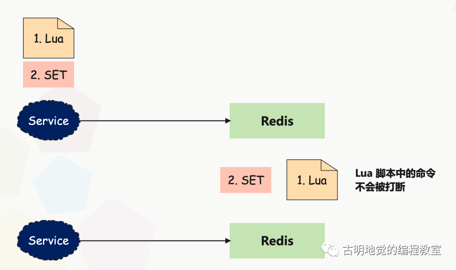

安全释放锁的 Lua 脚本如下：

```py
# -- 判断锁是自己的，才释放
if redis.call("GET", KEYS[1]) == ARGV[1]
then
    return redis.call("DEL", KEYS[1])
else
    return 0
end
```

关于 Redis 中如何嵌入 lua 脚本，我们以后会说。


## 主从复制带来的锁重复问题

如果我们能够保证 Redis 所在节点不宕掉，那么采用 Redis 实现分布式锁就是完美的，但显然我们无法保证这一点。所以实际在使用 Redis 时，一般会采用主从复制模式，当主库异常宕机时，哨兵可以实现「故障自动切换」，把从库提升为主库，继续提供服务，以此保证可用性。

那么问题来了，当「主从发生切换」时，这个分布锁还安全吗？显然是不安全的，我们不妨想一下这样的场景：

- 1）客户端 1 在主库上执行 SET 命令，加锁成功；

- 2）此时，主库异常宕机，SET 设置的锁还未同步到从库上，因为主从复制是异步的；

- 3）从库被哨兵提升为新主库，这个锁在新的主库上就丢失了。换句话说，锁对应的 key 没有同步过来，这就意味着客户端 2 会 SET 成功，也会获得分布式锁，那么此时就有了两把分布式锁；

  

所以当 Redis 采用主从复制时，分布式锁还是会受到影响的，或者说用 Redis 实现的分布式锁在当前这种极端场景下是不 ok 的。如果从 CAP 的角度来理解的话，因为分布式锁要求组件是 CP 模型，但 Redis 是一个 AP 模型，所以极端条件下 Redis 是不适合的。

`不过很多公司还是会拿 Redis 实现分布式锁，因为 Redis 组件在项目中太常用了，并且用它来实现分布式锁也很简单。虽然在极端场景下（Redis 主库挂掉，数据同步之前从库提升为主库）可能会有问题，但毕竟发生的概率还是很低，很多公司可以接受这一点。`

`这里值得一提的是，阿里也是用 Redis 实现的分布式锁，但它没有使用主从集群，而是只用单个节点的 Redis 实现分布式锁。这个节点什么也不做，只用于实现分布式锁的 Redis，这样的话 Redis 服务就不会因为内存不足、CPU 负载过高等原因挂掉。`

`然后是网络、断电问题，阿里会给该节点配置多块网卡、多块电源，只要有一块能够工作，那么该节点就能正常工作，除非所有的网卡和电源同时宕掉，但很明显这概率是非常低的。所以阿里是通过这种手段来保证分布式锁服务可用，可以说简单粗暴，虽然是解决办法，但很明显需要钱来维持，因为它要求你首先要有一个自己的机房。`

因此一般公司不会采用阿里这种做法，为了保证 Redis 服务的高可用，还是采用主从复制的模式。那么问题来了，如果真的遇到上面这种极端条件，要如何解决它呢？为此，Redis 的作者提出了一种解决方案，就是我们经常听到的 Redlock（红锁）。

但说句话，红锁这个方案个人觉得太笨重了，生产上用的非常少，感兴趣可以自己去了解一下。并且分布式神书《数据密集型应用系统设计，简称 DDIA》的作者 Martin Kleppmann 还对红锁提出了质疑，在网上和 Redis 作者来了一场辩论，可以去了解一下。


## 小结

本文介绍了锁和分布式锁的概念，锁其实就是用来保证同一时刻只有一个程序可以去操作某一个资源，以此来保证数据在并发时不出问题。

使用 Redis 实现分布式锁不能用 setnx 命令，因为它可能会带来死锁的问题，因此我们可以使用 Redis 2.6.12 中支持多参数的 set 命令来申请锁。但它会涉及业务执行时间超过锁的超时时间，带来线程安全和锁误删的问题。而这两个问题，可以通过守护线程定时续租、以及设置唯一标识来解决。

最后就是主从复制带来的问题，因为 Redis 是 AP 模型，而分布式锁要求的是 CP 模型，所以在极端场景下 Redis 会出问题。换句话说，使用 Redis 做分布式锁，99% 的情况下都是 ok 的。

因此 Martin 更推荐使用 zookeeper 实现分布式锁，它是 CP 模型，当然啦，出于性能考虑，更推荐 etcd。
