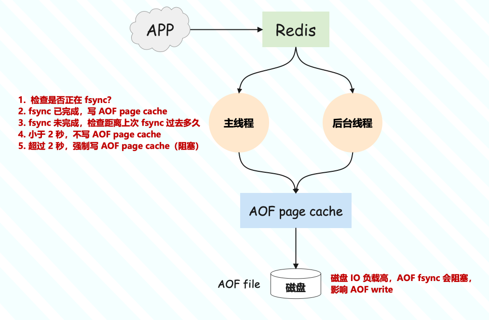
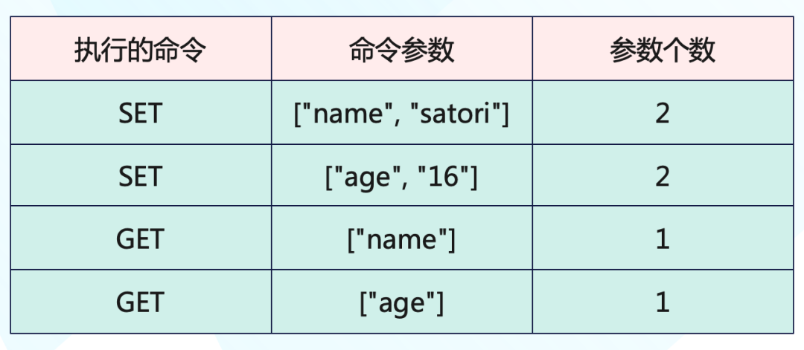

Redis 原理讲解

原著: 古明地觉的编程教室


# 八、详解 Redis 的配置文件以及数据持久化

## 配置文件

不过提到了配置文件，这里再提一个命令，叫做 config，是专门获取当前 Redis 配置项的。

```shell
127.0.0.1:6379> config get requirepass
1) "requirepass"
2) ""
127.0.0.1:6379> config get dir
1) "dir"
2) "/root"
127.0.0.1:6379> 
```

config get requirepass查看密码，如果没有设置的话会返回空字符串。config get dir 查看 redis-server 的启动路径，我是在 /root 下启动的。

既然有 get，那就有 set。

```shell
127.0.0.1:6379> config set requirepass 123456
OK  # 设置密码，一旦设置立即生效
127.0.0.1:6379> auth 12345  # 验证
(error) WRONGPASS invalid username-password pair 
127.0.0.1:6379> auth 123456
OK
127.0.0.1:6379> config set requirepass ""
OK  # 这里我们再改回来
127.0.0.1:6379> 
```

所以修改配置有两种方式，一种是直接在命令行中通过 config set 进行修改，该方式修改之后会立即生效，但只会影响当前这一个客户端，其它客户端不受影响。并且客户端重连之后，所做的修改会消失。

第二种就是修改配置文件，该方式修改之后必须重启 Redis 服务端才可以生效，并且对所有客户端都永久生效。

下面来介绍配置文件，首先根据功能的不同，可以将 Redis 的配置文件分为以下几个部分，我们分别来介绍，当然 Redis 内部就是这么分的。

**units**

```py
# 1k => 1000 bytes
# 1kb => 1024 bytes
# 1m => 1000000 bytes
# 1mb => 1024*1024 bytes
# 1g => 1000000000 bytes
# 1gb => 1024*1024*1024 bytes
```

里面定义了一些基本单位，而且大小写不敏感。

**includes**

```py
# include /path/to/local.conf
# include /path/to/other.conf
```

可以将配置写在其他地方，然后 include 进来，就跟 C 的头文件一样。

**network**

```py
# 默认本地连接，如果想支持其他机器连接的话
# 那么把 127.0.0.1 改成 0.0.0.0
bind 127.0.0.1

# 保护模式，如果改成 no
# 那么任意机器都可以连接，并且不需要认证
# 因此我们都会设置成 yes，开启保护模式
# 通过 bind 和 requirepass 来实现认证登录
protected-mode yes

# 监听的端口
port 6379

# 设置 tcp 的 backlog，backlog 是一个连接队列
# 在高并发环境下你需要提高 backlog 值
# 从而避免慢客户端连接问题
tcp-backlog 511

# 当客户端 N 秒没有活动，那么关闭连接
# 0 表示禁用该功能，一直保持连接
timeout 0

# 如果是 redis 集群，那么每隔 300 秒发送一个信息
# 告诉主节点自己还活着
tcp-keepalive 300
```

因此可以看到 network 是和网络连接相关的。

**general**

```py
# 是否是以守护进程方式启动，默认是 no
# 但是一般我们会改成 yes，也就是让 redis 后台启动
daemonize no

# 指定 redis 的 pid 管道文件
pidfile /var/run/redis_6379.pid

# 日志级别：debug、verbose、notice、warning
# 级别越高，打印的信息越少。
# 刚开发会选择 debug，会打印详细日志
# 上线之后选择 notice 或者 warning
loglevel notice

# 日志名字
logfile ""

# 是否把日志输出到系统日志里面，默认是不输出
# syslog-enabled no

# 指定日志文件标识
# 这里是 redis，所以就是 redis.log
# syslog-ident redis

# 指定 syslog 设备
# 值可以是 user 或者 local0 到 local7
# syslog-facility local0

# redis 数据库的数量，默认是 16 个，0-15
databases 16

# 总是显示 logo
always-show-logo yes
```

这部分对应的是一些通用的配置。

**SECURITY**

```py
# 设置密码，一旦设置，客户端连接的时候就需要指定密码了
# 否则进去之后无法执行命令，会提示认证失败
# 可以使用 redis-cli -a password，但是这样密码就暴露在终端中
# 尽管能连接，但 redis 会提示你不安全
# 因此我们还可以进去之后通过 auth password 来设置
# requirepass foobared
```

**CLIENT**

```py
# 设置客户端的最大连接数量，默认是 10000
# maxclients 10000
```

**MEMORY MANAGEMENT**

```py
# 最大内存
# maxmemory <bytes>

# 当你的内存达到极限的时候，肯定要淘汰一部分 key
# 而清除策略有以下几种
# ------
# volatile-lru：使用 LRU(最近最少使用) 策略移除 keys
#               只针对过期的 keys
# allkeys-lru：使用 LRU(最近最少使用) 策略移除 keys
# volatile-lfu：使用 LFU(最近最不常使用) 策略移除 keys，
#              只针对过期的 keys
# allkeys-lru：使用 LFU(最近最不常使用) 策略移除 keys
# volatile-random：随机移除一个过期的 key
# allkeys-random：随机移除一个任意 key
# volatile-ttl：移除 ttl值(过期时间) 最少的 key
#              即最快要过期的 key
# noeviction：不移除任意key，仅仅在写操作的时候返回一个error

# 默认的清除策略是noeviction
# maxmemory-policy noeviction

# LRU 和 LFU 都并非精确的算法，而是估算值
# 因此你可以设置样本的大小，默认是 5 个
# maxmemory-samples 5

# 从节点是否忽略 maxmemory 配置，针对 redis 集群
# 并且是从 redis 5 开始才有这个配置
# replica-ignore-maxmemory yes
```

以上就是一些我们经常使用的配置，当然还有一部分与持久化有关的配置，我们在介绍持久化的时候单独说。


## 什么是 Redis 的持久化

Redis 的一大特点就是可以将数据持久化，说白了就是将内存中的数据写入到磁盘保证不丢失，并且还能将数据从磁盘加载到内存。

我们之前的操作都是基于内存，因此性能很高，然而一旦关闭程序，那么数据就丢失了。因此我们需要在指定的时间间隔内将内存的数据写入到磁盘，也就是行话讲的 Snapshot 快照，它恢复时会再将快照文件写入到内存里面。

这也是 Redis 和 Memcached 的主要区别之一，因为 Memcached 不具备持久化功能。而数据持久化，Redis 为我们提供了以下几种方式：

- 快照方式（RDB，Redis DataBase）：将某一个时刻的内存数据，以二进制的方式写入磁盘；

- 文件追加方式（AOF，Append Only File），记录所有的操作命令，并以文本的形式追加到文件中；

- 混合持久化方式，Redis 4.0 之后新增的方式，混合持久化是结合了 RDB 和 AOF 的优点，在写入的时候，先把当前的数据以 RDB 的形式写入文件的开头，再将后续的操作命令以 AOF 的格式存入文件，这样既能保证 Redis 重启时的速度，又能降低数据丢失的风险；

  

由于每种持久化方案，都有特定的使用场景，我们分别介绍。


## RDB 持久化


RDB（Redis DataBase）是将某一个时刻的内存快照（Snapshot），以二进制的方式写入磁盘的过程。内存快照就是我们上面说的，它指内存中的数据在某一个时刻的状态记录，类似于拍照片，当你给朋友拍照时，一张照片就能把朋友一瞬间的形象全部记录下来。

而触发 RDB 的方式也分为两种：一类是手动触发，另一类是自动触发。

**1）手动触发**

手动触发持久化的操作有两个：save 和 bgsave ，它们主要区别体现在：是否阻塞 Redis 主线程的执行。

在客户端中执行 save 命令，就会触发 Redis 的持久化，但同时也会使 Redis 处于阻塞状态，直到 RDB 持久化完成，才会响应其他客户端发来的命令，所以在生产环境一定要慎用。

```shell
127.0.0.1:6379> save
OK
127.0.0.1:6379>
```

save 执行命令的流程如图所示：


而执行 bgsave（background save）则会后台保存， 它和 save 命令最大的区别就是 bgsave 会 fork 一个子进程来执行持久化（和父进程共享内存数据）。整个过程中只有在 fork 子进程时有短暂的阻塞，当子进程被创建之后，Redis 的主进程就可以响应其他客户端的请求了，相对于整个流程都阻塞的 save 命令来说，显然 bgsave 命令更适合我们使用。

```shell
# 开始后台保存
127.0.0.1:6379> bgsave
Background saving started  
127.0.0.1:6379> 
```

bgsave 执行命令的流程如图所示：


**2）自动触发**

说完手动触发之后，再来看看自动触发，关于自动触发的条件我们是可以在配置文件中进行配置的。

save m n 是指在 m 秒内，如果有 n 个键发生改变，则自动触发持久化。参数 m 和 n 可以在 Redis 的配置文件中找到，例如 save 60 1 则表明在 60 秒内，只要有一个键发生改变，就会触发 RDB 持久化。

自动触发持久化，本质是 Redis 通过判断，如果满足设置的触发条件，自动执行一次 bgsave 命令。注意：当设置多个 save m n 命令时，满足任意一个条件都会触发持久化。例如，我们设置了以下两个 save m n 命令：

```shell
save 60 10
save 600 20
```

当 60s 内如果有 10 次 Redis 键值发生改变，就会触发持久化；如果 60s 内 Redis 的键值改变次数少于 10 次，那么 Redis 就会判断 600s 内，Redis 的键值是否至少被修改了 20 次，如果满足则会触发持久化。

flushall 命令也可以触发 RDB 持久化，但会把 rdb 文件清空，在生产环境中一定慎用。

还有就是在 Redis 主从复制中，当从节点执行全量复制操作时，主节点会执行 bgsave 命令，并将 rbd 文件发送给从节点，该过程也会自动触发 Redis 持久化。

### RDB 配置说明

合理的设置 RDB 的配置，可以保障 Redis 高效且稳定的运行，下面一起来看看 RDB 的配置项都有哪些？


Redis 中可以使用命令查询当前配置参数，查询命令的格式为：config get xxx ，例如，想要获取 rdb 文件的存储名称，可以使用 config get dbfilename ，执行效果如下：

```shell
127.0.0.1:6379> config get dbfilename
1) "dbfilename"
2) "dump.rdb"
```

设置 RDB 的配置，可以通过以下两种方式：

- 手动修改 Redis 配置文件；
- 使用命令行设置，config set dir "/usr/data" 就是修改 rdb 文件的存储位置


### rdb 文件恢复

当 Redis 服务器启动时，如果启动目录中存在文件 dump.rdb，就会自动加载 rdb 文件恢复持久化数据。如果没有 dump.rdb 文件，请先将 dump.rdb 文件移动到 Redis 的启动目录。当然 Redis 在启动时有日志信息，会显示是否加载了 rdb 文件。

> Redis 服务器在载入 RDB 文件期间，会一直处于阻塞状态，直到载入工作完成为止。

到现在为止，我们已经知道 RDB 持久化分为手动触发和自动触发两种方式。并且 rdb 文件的恢复也很简单，只需要把 rdb 文件放到 Redis 的启动目录，在 Redis 启动时就会自动加载并恢复数据。


### RDB 优缺点

**优点：**

- rdb 文件的内容为二进制数据，占用内存更小，更紧凑，更适合做为备份文件；

- rdb 文件对灾难恢复非常有用，它是一个紧凑的文件，可以更快地传输到远程服务器进行 Redis 数据恢复；

- rdb 文件可以更大程度的提高 Redis 的运行速度，因为每次持久化时 Redis 主进程都会 fork 一个子进程，进行数据持久化到磁盘，Redis 主进程并不会执行磁盘 I/O 等操作；

- 与后面介绍的 aof 格式的文件相比，rdb 文件可以实现更快的重启；

  

**缺点：**

- rdb 文件只能保存某个时间间隔的数据，如果中途 Redis 服务意外终止了，则会丢失一段时间内的 Redis 数据；
- rdb 文件需要经常 fork 子进程之后才能持久化在磁盘上。如果数据集很大，fork 可能很耗时，并且要是 CPU 性能还不佳，则可能导致在几毫秒甚至一秒钟内 Redis 无法为客户端服务；


当然我们也可以禁用持久化，从而提高 Redis 的执行效率。如果对数据丢失不敏感的情况下，可以在 redis.conf 里面把 save 开头的那几个配置全给注释掉，禁止 rdb 文件持久化，但一般不会这么做。


### 快照时数据能修改吗

RDB 持久化是将当前内存中的数据保存到 rdb 文件中，相当于做了一个快照。但在快照期间，能修改数据吗？

在给别人拍照时，一旦对方动了，那么这张照片就拍糊了，所以我们希望对方保持不动。对于内存快照而言，我们也不希望数据 "乱动"。

举个例子，我们在时刻 t 给内存做快照，假设内存数据量是 4GB，磁盘的写入带宽是 0.2GB/s，简单来说至少需要 20s 才能做完。如果在时刻 t+5s 时，一个还没有被写入磁盘的内存数据 "A"，被修改成了 "A1"，那么就会破坏快照的完整性，因为 A1 不是时刻 t 时的状态。因此和拍照类似，我们在做快照时也不希望数据 "乱动"，也就是不能被修改。

但如果快照执行期间数据不能被修改，是会有潜在问题的。对于当前例子来说，在做快照的 20s 时间里，如果这 4GB 的数据都不能被修改，Redis 就不能处理对这些数据的写操作，那无疑就会给业务服务造成巨大的影响。

你可能会想到，可以用 bgsave 避免阻塞啊，这里就要说到一个常见的误区了：避免阻塞和正常处理写操作并不是一回事。虽然主线程的确没有阻塞，可以正常接收请求，但是为了保证快照的完整性，它只能处理读操作，不能像正常情况那样处理写操作（修改正在执行快照的数据）。

但为了快照而暂停写操作，肯定是不能接受的。所以这个时候，Redis 就会借助操作系统提供的写时复制技术（Copy-On-Write, COW），在执行快照的同时，正常处理写操作。简单来说，bgsave 子进程是由主进程 fork 生成的，可以共享主进程的所有内存数据。bgsave 子进程运行后，开始读取主进程的内存数据，并把它们写入 rdb 文件。

此时，如果主线程对这些数据也都是读操作，那么主线程和 bgsave 子进程相互不影响。但如果主线程要修改一块数据，那么会先把这块数据复制一份，生成该数据的副本。然后 bgsave 子进程会把这个副本数据写入 rdb 文件，而在这个过程中，主线程仍然可以直接修改原来的数据。

假设在时刻 t 发生了 RDB 持久化，即使在 t + 5 时将数据修改了也不影响。因为修改之前会先将数据复制一份，然后才会修改，而写入 rdb 文件的仍是时刻 t 的数据。这个技术就叫做`写时复制`。


这既保证了快照的完整性，同时也允许主线程对数据进行修改，避免了对正常业务的影响。但如果此时碰巧要修改大量的 key，那么也要将这些 key 拷贝一份出来，因此可能会造成 OOM。所以有经验的人都会建议，给 Redis 机器预留一部分内存，其目的就是为了避免大量的写时复制造成的 OOM。


### 快照应该多久生成一次

根据 Redis 配置文件我们得知，默认情况下如果 900 秒内有 1 次修改、300 秒内有 10 次修改、60 秒内有 10000 次修改，那么会进行快照生成。

```shell
save 900 1
save 300 10
save 60 10000
```

但是问题来了，Redis 的配置是通用的，但对于当前的业务来说却未必是最适合的，那么我们应该多久做一次快照呢？

首先我们说 RDB 会有数据丢失的可能，因为它是每隔一段时间判断一次，如果条件满足，那么触发一次写快照。但问题是如果在数据修改之后、但还没有触发写快照时机器宕机了，那么数据就会丢失。举个例子：


如果想数据尽可能少的丢失，那么快照的时间间隔就设置的短一些，就类似于相机的连拍。这样一来，快照的间隔时间变得很短，丢失的数据的可能性也会大大降低。那么问题来了，我们可不可以每秒做一次快照呢？毕竟，每次快照都是由 bgsave 子进程在后台执行，也不会阻塞主线程。

这种想法其实是错误的，虽然 bgsave 执行时不阻塞主线程，但如果频繁地执行全量快照，也会带来两方面的开销。

- 频繁将全量数据写入磁盘，会给磁盘带来很大压力，多个快照竞争有限的磁盘带宽，前一个快照还没有做完，后一个又开始做了，容易造成恶性循环；

- bgsave 子进程需要通过 fork 操作从主进程创建出来，虽然子进程在创建后不会再阻塞主进程，但是 fork 这个创建过程本身是会阻塞的，而且内存越大，阻塞时间越长。如果频繁 fork 出 bgsave 子进程，这就会频繁阻塞主进程了；

  

那么，有什么其他好方法吗？显然我们可以做增量快照，所谓增量快照就是指做了一次全量快照后，后续的快照只对修改的数据进行快照记录，这样可以避免每次全量快照的开销。

假设第一次做完了全量快照，之后如果再做快照，我们只需要将被修改的数据写入快照文件就行。但这么做的前提是，Redis 需要记录哪些数据被修改了，而这个 "记住" 功能又需要 Redis 使用额外的元数据信息去实现，这又会带来额外的空间开销问题。

如果我们对每一个键值对的修改都做个记录，那么假设有 1 万个被修改的键值对，我们就需要有 1 万条额外的记录。而且有的时候键值对非常小，比如只有 10 字节，而记录它被修改的元数据信息，可能就需要 8 字节。此时为了 "记住" 修改而引入的额外空间开销就比较大，这对于内存资源宝贵的 Redis 来说，有些得不偿失。

到这里我们可以发现，虽然快照的恢复速度快，但快照的频率不好把握，如果频率太低，两次快照间一旦宕机，就可能有比较多的数据丢失。如果频率太高，又会产生额外开销，那么有什么方法解决呢？那么接下来就引入 Redis 的另一种持久化方式 AOF，将 RDB 和 AOF 结合起来才是最佳的解决方案。


## AOF 持久化

Redis 的持久化除了 RDB 还有 AOF，我们知道 RDB 每次会保存某个时间间隔的数据，而且要达到触发条件才会进行持久化。但是这样有一个风险，那就是在持久化之前机器突然宕机了，那么这个时间间隔内的最新数据就会丢失。比如 600s 秒内变化 10 个 key 才会持久化，但是当变化 9 个 key 的时候宕机了，那么这 9 个 key 的数据就丢失了。

可能会导致 Redis 服务意外终止的条件：

- 安装 Redis 的机器停止运行，蓝屏或者系统崩溃；

- 安装 Redis 的机器出现电源故障，例如突然断电；

- 使用 kill -9 Redis_PID 等；

  

那么如何解决以上的这些问题呢？Redis 为我们提供了另一种持久化的方案 AOF。

AOF（Append Only File）指的是追加到文件，所以 AOF 我们可以猜测它应该类似于日志文件一样，事实上也确实如此。但它和我们熟悉的数据库的预写式日志（Write Ahead Log，WAL）不同，WAL 是先把修改的数据记到日志文件中，然后执行相关操作；而 AOF 正好相反，Redis 是先执行命令、将数据写入内存，然后才记录日志。

那为什么要先执行命令再记日志呢？要回答这个问题，我们要先知道 AOF 日志文件里面记录了什么内容。我们以 "set name satori" 这条命令为例，看看 Redis 收到之后会在 AOF 文件中记录什么东西吧？


其中 *3 表示当前命令中有 3 个部分，每个部分上面都会有一个 $数字，表示该部分占了多少字节，比如 $4 表示 name 这个 key 占了 4 个字节。

但为了避免额外的检查开销，Redis 在向 AOF 里面记录日志的时候，并不会对这些命令进行语法检查，因此要是先记日志再执行命令的话，日志中就有可能记录了错误的命令，Redis 在使用日志恢复数据时，就可能会出错。

而 AOF 这种方式，就是先让系统执行命令，只有命令能执行成功，才会被记录到 aof 日志文件中，否则系统就会直接向客户端报错，所以 Redis 使用 AOF 这一方式的一大好处就是可以避免出现记录错误命令的情况。

除此之外，AOF 还有一个好处：它是在命令执行后才记录日志，所以不会阻塞当前的写操作。


### 持久化的查询和设置


**查询 AOF 启动状态**

使用 config get appendonly 命令，如下图所示：

```shell
127.0.0.1:6379> config get appendonly
1) "appendonly"
2) "no"
127.0.0.1:6379> 
```

yes 表示启动、no 表示为启动。


**开启 AOF 持久化**

Redis 默认是关闭 AOF 持久化的，想要开启 AOF 持久化，有两种方式，分别是使用命令行和修改配置文件。

如果是命令行启动 AOF，直接通过 config set appendonly yes 命令即可，如下所示：

```shell
127.0.0.1:6379> config set appendonly yes
OK
127.0.0.1:6379> config get appendonly
1) "appendonly"
2) "yes"
127.0.0.1:6379> 
```

这种方式的优点是无需重启 Redis 服务，缺点是如果 Redis 服务重启，则之前使用命令行设置的配置就会失效。

如果是配置文件开启 AOF，只需要将appendonly no 改成 appendonly yes，然后重启服务即可生效。


### 如何触发 AOF 持久化

**1）自动触发**

有两种情况可以自动触发 AOF 持久化，分为是："满足 AOF 设置的持久化策略触发" 和 "满足 AOF 重写触发"。其中，AOF 重写触发一会详细介绍，这里重点来说 AOF 持久化策略都有哪些。AOF 持久化策略，分为以下三种：

- always：每条 Redis 操作命令都会直接写入磁盘，最多丢失一条数据；

- everysec：每秒钟写入一次磁盘，最多丢失一秒的数据；

- no：不设置写入磁盘的规则，根据当前操作系统来决定何时写入磁盘，Linux 默认 30s 写入一次数据至磁盘；

  

这三种配置可以在 Redis 的配置文件（redis.conf）中设置：

```shell
# 开启每秒写入一次的持久化策略
appendfsync everysec
# 或者通过命令行进行设置：
# config set appendfsync everysec
```

因为每次写入磁盘都会对 Redis 的性能造成一定的影响，所以要根据用户的实际情况设置相应的策略，一般设置每秒写入一次磁盘的频率就可以满足大部分的使用场景了。


**2）手动触发**

在客户端执行 bgrewriteaof 命令就可以手动触发 AOF 持久化，和 RDB 持久化类似，RDB 持久化会生成 dump.rdb 文件，AOF 持久化会生成 appendonly.aof 文件。

但是注意：在往 aof 文件中记录日志的时候，是由主线程来完成的，如果把日志文件写入磁盘时，磁盘写压力大，就会导致写盘很慢，进而导致后续的操作也无法执行了。


### AOF 重写

AOF 是通过记录 Redis 的执行命令来持久化（保存）数据的，所以 aof 文件会随着时间变得越来越大，这样不仅增加了服务器的存储压力，也会造成 Redis 重启速度变慢，为了解决这个问题 Redis 提供了 AOF 重写的功能。

**1）什么是AOF重写？**

举个例子，我们设置了一个 String 类型的 key，并对它做了 99 次修改。如果不做 AOF 重写的话，那么持久化文件中就会有 100 条记录执行命令的信息。而 AOF 重写之后，只保留最后一条，这样就去除了所有的无效信息。

**2）AOF重写的触发时机**

触发 AOF 文件重写，要满足两个条件，这两个条件也是配置在 redis.conf 中的，它们分别是：

- auto-aof-rewrite-min-size：允许 AOF 重写的最小文件容量，默认是 64mb；

- auto-aof-rewrite-percentage：AOF 文件重写的大小比例，默认值是 100，表示 100%。也就是只有当前 aof 文件，比最后一次（上次）的 aof 文件大一倍时，才会触发 aof 文件重写；

  

这两个值可以使用 config get xxx 命令查看：

```shell
127.0.0.1:6379> config get auto-aof-rewrite-min-size
1) "auto-aof-rewrite-min-size"
2) "67108864"
127.0.0.1:6379> config get auto-aof-rewrite-percentage
1) "auto-aof-rewrite-percentage"
2) "100"
127.0.0.1:6379> 
```

只有同时满足这两个参数设置的条件，才会触发 AOF 文件重写。

**3）AOF重写流程**

首先 Redis 写入 AOF 是由主线程完成的，但重写则不一样，重写时会 fork 一个 bgrewriteaof 子进程，这也是为了避免阻塞主线程，导致 Redis 性能下降。

AOF 文件重写是生成一个全新的文件，并把当前数据的最少操作命令保存到新文件上，当这一切完成之后，Redis 再交换两个文件即可。由于主线程不阻塞，所以在重写的时候依旧可以处理命令，并且这些最新的操作也会被记录到新的 AOF 文件中。


### AOF everysec 真的不会阻塞主线程吗？

当 Redis 开启 AOF 时，需要配置 AOF 的刷盘策略，基于性能和数据安全的平衡，一般会采用 appendfsync everysec 这种方案。Redis 主线程会将命令数据写入 AOF page cache，然后 Redis 的后台线程以 1 秒为间隔，将 AOF page cache 的数据刷到（fsync）磁盘上的 aof 文件里。这种方案的优势在于，把 AOF 刷盘的耗时操作，放到了后台线程中去执行，避免了对主线程的影响。

但事实上真的不会影响主线程吗？答案是否定的。其实存在这样一种场景：Redis 后台线程在执行 AOF page cache 刷盘（fysnc）时，如果此时磁盘 IO 负载过高，那么调用 fsync 就会被阻塞住。此时主线程仍然接收写请求进来，然后仍然会写入 AOF page cache，但是主线程会先判断，后台线程是否已刷盘成功（fsync），如果 fsync 没有执行完，那么主线程会一直阻塞。

那么主线程是如何判断的呢？很简单，后台线程在刷盘成功后，都会记录刷盘的时间，主线程会根据这个时间来判断，距离上一次刷盘已经过去多久了。整个流程是这样的：

- 主线程在写 AOF page cache（write系统调用）前，先检查后台 fsync 是否已完成？

- fsync 已完成，主线程直接写 AOF page cache；

- fsync 未完成，则检查距离上次 fsync 过去多久？

- 如果距离上次 fysnc 成功在 2 秒内，那么主线程会直接返回，不写 AOF page cache，等待下一次再写；

- 如果距离上次 fysnc 成功超过了 2 秒，那主线程会强制写 AOF page cache（write系统调用）；

- 由于磁盘 IO 负载过高，此时后台线程 fynsc 会发生阻塞，那主线程在写 AOF page cache 时，也会发生阻塞等待（操作同一个 fd，fsync 和 write 是互斥的，一方必须等另一方成功之后才可以继续执行，否则阻塞等待）

  



通过分析我们可以发现，即使配置的 AOF 刷盘策略是 appendfsync everysec，也依旧会有阻塞主线程的风险。其实产生这个问题的重点在于，磁盘 IO 负载过高导致 fynsc 阻塞，进而导致主线程写 AOF page cache 也发生阻塞。所以，一定要保证磁盘有充足的 IO 资源，从而避免这个问题。


### AOF everysec 真的只会丢失 1 秒的数据吗？

接着上面的问题继续分析，然后重点关注上面的步骤 4。也就是：主线程在写 AOF page cache 时，会先判断上一次 fsync 成功的时间，如果距离上次 fysnc 成功在 2 秒内，那么主线程会直接返回，不再写 AOF page cache。

这就意味着，后台线程在执行 fsync 刷盘时，主线程最多等待 2 秒不会写 AOF page cache。如果此时 Redis 发生了宕机，那么 aof 文件中丢失的是 2 秒的数据，而不是 1 秒。那么问题来了，Redis 主线程为什么要等待 2 秒不写 AOF page cache 呢？

其实，Redis AOF 配置为 appendfsync everysec 时，正常来讲，后台线程每隔 1 秒执行一次 fsync 刷盘，如果磁盘资源充足，是不会被阻塞住的。也就是说，Redis 主线程其实根本不用关心后台线程是否刷盘成功，只要无脑写 AOF page cache 即可。但是 Redis 作者考虑到，如果此时的磁盘 IO 资源比较紧张，那么后台线程 fsync 就有概率发生阻塞风险。

所以 Redis 主线程写 AOF page cache 之前，先检查一下距离上一次 fsync 成功的时间，如果大于 1 秒没有成功，那么主线程此时就知道 fsync 可能阻塞了。因此主线程会总共等待 2 秒不写 AOF page cache，其目的在于：

- 降低主线程阻塞的风险（如果无脑写 AOF page cache，主线程则会立即阻塞住）；

- 如果 fsync 阻塞，主线程就会给后台线程多留出 1 秒的时间，等待 fsync 成功；

  

但代价就是，如果此时发生宕机，AOF 丢失的就是 2 秒的数据，而不是 1 秒。因此这个方案应该是 Redis 作者对性能和数据安全性所做的进一步权衡，但无论如何，这里我们只需要知道，即使 AOF 配置为每秒刷盘，在发生上述极端情况时，AOF 丢失的数据其实是 2 秒。

### AOF 配置说明

AOF 的配置参数也都在 Redis 的配置文件中，配置参数和说明如下：


其中最重要的是 appendfsync 参数，用它来设置 AOF 的持久化策略，可以选择按时间间隔或者操作次数来存储 AOF 文件。

### 数据恢复

**1）正常数据恢复**

正常情况下，只要开启了 AOF 持久化，并且提供了正常的 appendonly.aof 文件，在 Redis 启动时就会自动加载 aof 文件并启动。

默认情况下 appendonly.aof 文件在 Redis 的启动目录下，当然我们也可以设置。

持久化文件加载规则：

- 如果只开启了 AOF 持久化，Redis 启动时只会加载 aof 文件（appendonly.aof），进行数据恢复；

- 如果只开启了 RDB 持久化，Redis 启动时只会加载 rdb 文件（dump.rdb），进行数据恢复；

- 如果同时开启了 RDB 和 AOF 持久化，Redis 启动时一样只会加载 aof 文件，进行数据恢复；

  

在 AOF 开启的情况下，即使 aof 文件不存在，只有 rdb 文件，也不会加载 rdb 文件。

**2）异常数据恢复**

在 aof 文件写入时如果服务器崩溃，或者是 aof 存储已满的情况下，最后一条命令可能被截断，这就是异常的 aof 文件。在文件异常的情况下，如果修改配置文件，也就是将 aof-load-truncated 设置为 yes，Redis 在启动时会忽略最后一条命令，并顺利启动 Redis。

**3）复杂异常数据恢复**

aof 文件可能出现更糟糕的情况，aof 文件不仅被截断，而且中间的命令也被破坏，这个时候再启动 Redis 会提示错误信息并中止运行，错误信息如下：

```py
* Reading the remaining AOF tail...
# Bad file format reading the append only file: 
# make a backup of your AOF file, 
# then use ./redis-check-aof --fix <filename>
```

出现此类问题的解决方案如下：

- 首先使用 AOF 修复工具，检测出现的问题。做法是在命令行中输入 redis-check-aof 命令，它会跳转到出现问题的命令行，这个时候可以尝试手动修复此文件；
- 如果无法手动修复，我们可以使用 redis-check-aof --fix 自动修复 aof 异常文件，不过执行此命令，可能会导致异常部分至文件末尾的数据全部被丢弃；


### AOF 优缺点

**AOF 优点：**

- AOF 持久化保存的数据更加完整，提供了三种保存策略：每次操作保存、每秒钟保存一次、跟随系统的持久化策略保存。其中每秒保存一次，从数据的安全性和性能两方面考虑是一个不错的选择，也是 AOF 默认的策略，即使发生了意外情况，最多只会丢失 1s 的数据（其实是 2s）；

- AOF 采用的是命令追加的写入方式，所以不会出现文件损坏的问题，即使由于某些意外原因，导致了最后操作的持久化数据写入了一半，也可以通过 redis-check-aof 工具轻松的修复；

- AOF 持久化文件，非常容易理解和解析，它是把所有 Redis 键值操作命令，以文件的方式存入了磁盘。即使不小心使用 flushall 命令删除了所有键值信息，只要使用 aof 文件，重启 Redis 即可恢复之前误删的数据。但前提是把 aof 文件中最后的 flushall 命令删除之后再恢复，否则恢复完之后就又 flushall 了；

  

**AOF 缺点：**

- 对于相同的数据集来说，aof 文件要大于 rdb 文件；
- 在 Redis 负载比较高的情况下，RDB 比 AOF 性能更好；
- RDB 使用快照的形式来持久化整个 Redis 数据，而 AOF 只是将每次执行的命令追加到 aof 文件中，因此从理论上说，RDB 比 AOF 更健壮；


### AOF 小结

AOF 保存数据更加完整，它可以记录每次 Redis 的键值变化，也就是通过逐一记录操作命令，在恢复时再逐一执行命令的方式，保证了数据的可靠性。但考虑到性能，也可以选择每秒保存一次数据。

AOF 的持久化文件更加易读，但相比二进制的 rdb 文件来说，所占的存储空间也越大。为了解决这个问题，AOF 提供自动化重写机制，直接根据数据库里数据的最新状态，生成这些数据的插入命令，作为新日志，最大程度的减少了 AOF 占用空间大的问题。

这个过程通过后台线程完成，避免了对主线程的阻塞。同时 AOF 也提供了很方便的异常文件恢复命令： redis-check-aof --fix ，为使用 AOF 提供了很好的保障。


## 混合持久化

我们说 Redis 的持久化有 RDB 和 AOF，这两者的特点以及优缺点我们再来简单复习一下。

**同步策略：**

- RDB：可以指定某个时间内发生多少个命令进行同步。比如一分钟内发生了两次命令，就进行一次同步；

- AOF：每秒同步或者每次发生命令后同步；

  

**存储内容：**

- RDB：存储的是 redis 里面具体的值；

- AOF：存储的是执行的写操作命令；

  

**优点：**

- RDB：1. 存储数据到文件中会进行压缩，文件体积比 aof 文件小。2. 因为存储的是 Redis 具体的值，并且会经过压缩，因此在恢复的时候比 aof 文件快，并且适合远距离传输。3. 非常适用于备份；

- AOF：1. AOF 的策略是每秒钟或者每次发生写操作的时候同步，因此即使服务器发生故障，也只会丢失一秒的数据。2. AOF 存储的是 redis 命令并且直接追加到 aof 文件后面，因此每次备份的时候只要添加新的数据进去就可以了。3. 如果 aof 文件比较大，那么 redis 会进行重写，只保留最小的命令集合；

  

**缺点：**

- RDB：1）RDB 是在多少时间内发生了多少写操作的时候就会发出同步机制，虽然会进行数据压缩，但 RDB 在同步的时候都重新保存整个 redis 中的数据，因此该操作不宜频繁执行，一般会设置在最少 5 分钟内才保存一次数据。在这种情况下，一旦服务器故障，就会造成 5 分钟的数据丢失。2）在数据保存进 rdb 文件的时候，redis 会 fork 出一个子进程用来同步，在数据流比较大的时候可能会非常耗时；
- AOF：1）aof 文件因为没有压缩，因此体积比 rdb 文件大。2）AOF 是在每秒或者每次写操作都进行备份，因此如果并发量比较大，效率会有点低。3）因为存储的是命令，因此在灾难恢复的时候 redis 会重新运行 aof 文件里的命令，速度不及 RDB；


所以为了能同时使用 RDB 和 AOF 各种的优点，Redis 4.0 之后新增了混合持久化的方式。在开启混合持久化的情况下，AOF 重写时会把 Redis 的持久化数据，以 RDB 的格式写入到 aof 文件的开头（写入值），之后的数据再以 AOF 的格式追加到文件的末尾（写入命令）。


这个方法既能享受到 RDB 文件快速恢复的好处，又能享受到 AOF 只记录操作命令的简单优势，颇有 "鱼和熊掌可以兼得" 的感觉，建议在实践中用起来。


## 开启混合持久化

查询是否开启混合持久化可以使用 config get aof-use-rdb-preamble 命令：

```shell
127.0.0.1:6379> config get aof-use-rdb-preamble
1) "aof-use-rdb-preamble"
2) "yes"
127.0.0.1:6379> 
```

其中 yes 表示已经开启混合持久化，no 表示关闭，Redis 5.0 默认值为 yes。如果是其它版本的 Redis 首先需要检查一下，是否已经开启了混合持久化，如果没有开启，可以通过以下两种方式开启：

- 通过命令行开启：config set aof-use-rdb-preamble yes；

- 通过修改 Redis 配置文件开启，将配置文件中的 aof-use-rdb-preamble no 改成 yes；

  

另外关于 AOF 和 RDB 的选择问题，有三点建议：

- 数据不能丢失时，内存快照和 AOF 的混合使用是一个很好的选择；

- 如果允许分钟级别的数据丢失，可以只使用 RDB；

- 如果只用 AOF，优先使用 everysec 的配置选项，因为它在可靠性和性能之间取了一个平衡；

  

另外混合持久化的数据恢复和 AOF 持久化过程是一样的，只需要把 appendonly.aof 放到 Redis 的启动目录，在 Redis 启动时，只要开启了 AOF 持久化，Redis 就会自动加载并恢复数据。整个过程如下：

- 1）判断是否开启 AOF 持久化，未开启则加载 RDB 文件，开启则执行后续流程；
- 2）判断 appendonly.aof 文件是否存在，文件存在则执行后续流程；
- 3）判断 AOF 文件开头是 RDB 的格式，先加载 RDB 内容再加载剩余的 AOF 内容；
- 4）判断 AOF 文件开头不是 RDB 的格式，直接以 AOF 格式加载整个文件；

> aof 文件的开头是 *，而 rdb 文件的开头是字符串 REDIS。


### 混合持久化的优缺点

**混合持久化的优点：**

- 混合持久化结合了 RDB 和 AOF 持久化的优点，开头为 RDB 的格式，使得 Redis 可以更快的启动，同时结合 AOF 的优点，降低了大量数据丢失的风险；

  

**混合持久化的缺点：**

- AOF 文件中添加了 RDB 格式的内容，使得 AOF 文件的可读性变得很差；
- 兼容性差，如果开启混合持久化，那么此混合持久化 AOF 文件，就不能用于 Redis 4.0 之前版本了；


### 持久化最佳实践

持久化虽然保证了数据不丢失，但同时拖慢了 Redis 的运行速度，那怎么更合理的使用 Redis 的持久化功能呢？Redis 持久化的最佳实践可从以下几个方面考虑。

**1）控制持久化开关**

使用者可根据实际的业务情况考虑，如果对数据的丢失不敏感的情况下，可考虑关闭 Redis 的持久化，这样所以的键值操作都在内存中，就可以保证最高效率的运行 Redis 了。持久化关闭操作：

- 关闭 RDB 持久化，使用命令：config set save ""；

- 关闭 AOF 和 混合持久化，使用命令：config set appendonly no；

  

**2）主从部署**

使用主从部署，一台用于响应主业务，一台用于数据持久化，这样就可能让 Redis 更加高效的运行。

**3）使用混合持久化**

混合持久化结合了 RDB 和 AOF 的优点，Redis 5.0 默认是开启的。

**4）使用配置更高的机器**

Redis 对 CPU 的要求并不高，反而是对内存和磁盘的要求很高（也正因为如此 Redis 在 4.0 之前才是单线程的，当然现在也默认是单线程）。因为 Redis 大部分时候都在做读写操作，使用更多的内存和更快的磁盘，对 Redis 性能的提高非常有帮助。


# 九、Redis 事务

Redis 也是有事务功能的，尽管它不像关系型数据库那样常用，但在面试的时候经常会被问到，下面我们就来总结一下 Redis 的事务。

通过 Redis 事务的原理以及实际操作，来彻底攻略 Redis 中的事务。

## 事务介绍

Redis 事务是一组命令的集合，将多个命令进行打包，然后这些命令会被顺序地添加到队列中，并按照添加的顺序依次执行。

但 Redis 不像 MySQL 那样有事务隔离级别的概念，不能保证原子性操作，也没有像 MySQL 那样执行事务失败时可以进行回滚的操作。 

这个与 Redis 的特点：「 快速、高效 」有着紧密的联系，因为回滚操作、以及像事务隔离级别那样的加锁解锁，是非常消耗性能的。所以 Redis 中执行事务的流程只需要以下简单的三个步骤：

1）MULTI：表示开启一个事务，此命令之后的所有对 Redis key 的操作命令「都会被顺序地放入队列中」。当执行 EXEC 命令后，队列中的命令会被依次执行。

2）DISCARD：放弃执行队列中的命令，可以类比为 MySQL 的回滚操作，并且将当前的状态从事务状态改为非事务状态。

3）EXEC：表示要「顺序执行队列中的命令」，执行完之后并将结果显示在客户端，「同时将当前状态从事务状态改为非事务状态」。

除了以上三个命令之外，还有 WATCH 和 UNWATCH，我们先来介绍上面三个。


### 开启事务

MULTI 命令表示开启一个事务，当返回 OK 的时候表示已经进入事务状态。

```shell
127.0.0.1:6379> multi
OK
127.0.0.1:6379(TX)> 
```

该命令执行之后客户端会将当前的状态从非事务状态修改为事务状态 ，这一状态的切换是通过打开客户端 flags 属性中的 REDIS_MULTI 来完成的，该命令可以理解为 MySQL 中的 BEGIN 语句。


注意：multi 命令不能嵌套使用，如果在已经开启了事务的情况下，再执行 multi 命令，会提示如下错误：(error) ERR MULTI calls can not be nested，因为事务是不可重复的。

```shell
127.0.0.1:6379> multi
OK
127.0.0.1:6379(TX)> multi
(error) ERR MULTI calls can not be nested
127.0.0.1:6379(TX)> 
```

当客户端是非事务状态时，使用 multi 命令，客户端会返回结果 OK，如果客户端已经是事务状态，再执行 multi 命令则会报出 multi 命令不能嵌套的错误，但不会终止客户端当前的事务状态，如下图所示：


不管是哪种情况，最终都是处于事务开启的一个状态，因为在 MULTI 中执行 MULTI 虽然会报错，但是不会结束事务。

### 命令入队

客户端进入事务状态之后，执行的所有常规 Redis 操作命令（非触发事务执行或放弃、以及导致入队异常的命令）会依次入列，命令入列成功后会返回 QUEUED，这也是真正的业务逻辑的部分，代码如下所示：

```shell
127.0.0.1:6379> multi
OK
# 不会终止事务，完全可以将第二个 MULTI 忽略掉
127.0.0.1:6379(TX)> multi
(error) ERR MULTI calls can not be nested
127.0.0.1:6379(TX)> 
127.0.0.1:6379(TX)> set name satori
QUEUED
127.0.0.1:6379(TX)> set age 16
QUEUED
127.0.0.1:6379(TX)> get name
QUEUED
127.0.0.1:6379(TX)> get age
QUEUED
127.0.0.1:6379(TX)> 
```

若是当前处于事务状态，那么 Redis 客户端的命令执行后就会进入到队列（FIFO）中，并且返回 QUEUED 字符串；否则的话，则会立即执行命令，并将结果返回给客户端。流程图如下：


我们说事务开启之后，命令会进入到队列中，而命令队列里面有如下内容:「要执行的命令」、「命令的参数」、「参数的个数」。以我们上面的事务为例，那么队列中的内容如下：




### 执行、放弃事务

当客户端执行 EXEC 命令的时候，队列里面的命令就会按照先进先出的顺序被执行；如果是 DISCARD，那么会放弃事务。

**先来看看提交事务：**

```shell
127.0.0.1:6379(TX)> exec
1) OK
2) OK
3) "satori"
4) "16"
127.0.0.1:6379> 
```

当执行 EXEC 的时候，会先执行两个 SET 命令、再执行两个 GET 命令，并且执行后的结果也会进入一个队列中保存，最后返回给客户端：


至此一个事务就完整地执行完毕了，并且此时客户端也从事务状态更改为非事务状态。


另外命令在提交事务之后，如果成功执行，那么影响是全局的，我们再举个例子：

```shell
# 设置 name 为 satori
127.0.0.1:6379> set name satori
OK
# 获取 name，显然没问题
127.0.0.1:6379> get name
"satori"
# 开启事务
127.0.0.1:6379> multi
OK
# 在事务中设置 name 为 koishi
127.0.0.1:6379(TX)> set name koishi
QUEUED
127.0.0.1:6379(TX)> get name
QUEUED
# 执行事务，get name 的结果为 koishi
# 显然结果正常
127.0.0.1:6379(TX)> exec
1) OK
2) "koishi"
# 但我们说事务中的命令的影响是全局的
# 即便事务结束，里面执行的命令在外部也是生效的
127.0.0.1:6379> get name
"koishi"
127.0.0.1:6379> 
```

**再来看看放弃事务：**

```shell
127.0.0.1:6379> set name satori
OK
127.0.0.1:6379> multi
OK
127.0.0.1:6379(TX)> set name koishi
QUEUED
127.0.0.1:6379(TX)> get name
QUEUED
# 取消事务，里面的命令根本没有执行
127.0.0.1:6379(TX)> discard
OK
# 所以外部的 name 还是 satori
127.0.0.1:6379> get name
"satori"
127.0.0.1:6379> 
```

DISCARD 命令取消事务的时候，会将命令队列清空，并且将客户端的状态从事务状态修改为非事务状态。


### 事务错误 & 回滚

再来探讨一个问题，要是事务在执行过程中出错了怎么办？首先事务执行中出现的错误分为三种：

- 执行时才会出现的错误（简称：执行时错误）；

- 入队时错误，不会终止整个事务；

- 入队时错误，会终止整个事务；

  

我们分别演示一下这几种错误。

**1）执行时错误**

```shell
# 设置 name 为 satori
127.0.0.1:6379> set name satori
OK
# 获取 name，结果正常
127.0.0.1:6379> get name
"satori"
# 开启事务
127.0.0.1:6379> multi
OK
# 因为 name 不是数值，所以执行时会出错
# 但这条命令本身是合法的
127.0.0.1:6379(TX)> incr name
QUEUED
# 设置 name 为 koishi
127.0.0.1:6379(TX)> set name koishi
QUEUED
# 我们看到事务里面第一条命令执行失败
# 但是第二条执行成功了
127.0.0.1:6379(TX)> exec
1) (error) ERR value is not an integer or out of range
2) OK
# 事务结束后，获取 name 发现被修改了
127.0.0.1:6379> get name
"koishi"
127.0.0.1:6379>
```

从以上结果来看，即使事务队列中某个命令在执行期间出现了错误，事务也会继续执行，直到事务队列中所有命令都执行完成。

所以这样就会导致正确的命令被执行，而错误的命令不会被执行。而这也反映了 Redis 的事务不能保证数据的一致性，因为执行的途中出现了错误，但有些语句还是被执行了。因此最终的结果只能是程序猿根据之前的命令自己一步一步地回滚，所以自己的烂摊子自己收拾。

**2）不会导致事务结束的入队时错误：**

```shell
127.0.0.1:6379> set name satori
OK
127.0.0.1:6379> multi
OK
# 在入队时就已经出现了错误
# 但是事务依旧没有结束
127.0.0.1:6379(TX)> multi
(error) ERR MULTI calls can not be nested
# 修改 name
127.0.0.1:6379(TX)> set name koishi
QUEUED
127.0.0.1:6379(TX)> exec
1) OK
# 事务结束后，name 也被修改
127.0.0.1:6379> get name
"koishi"
127.0.0.1:6379> 
```

可以看出，重复执行 multi 会导致入列错误，但不会终止事务，最终查询的结果表示事务执行成功了。除了重复执行 multi 命令，还有在事务状态下执行 watch 也是同样的效果，下文会详细讲解关于 watch 的内容。

**3）会导致事务结束的入队时错误：**

```shell
127.0.0.1:6379> set name satori
OK
127.0.0.1:6379> multi
OK
# 输入一个正确的命令
127.0.0.1:6379(TX)> set name koishi
QUEUED
# 输入一个不存在的错误命令
127.0.0.1:6379(TX)> 古明地觉
(error) ERR unknown command `古明地觉`
# 再输入一个正确的命令
127.0.0.1:6379(TX)> set length 156
QUEUED
# 执行事务，提示我们报错了
# 整个事务被取消
127.0.0.1:6379(TX)> exec
(error) EXECABORT Transaction discarded 
because of previous errors.

# 但是对 name 和 length 做的修改全丢失了
# 所以对于当前这种错误而言，不管错误在事务的哪个地方
# 只要出现了，整个事务就完蛋了
127.0.0.1:6379> get name
"satori"
127.0.0.1:6379> get length
(nil)
127.0.0.1:6379> 
```

所以我们看到错误可以分为两种：一种是事务执行时才会发现的错误；另一种是在入队的时候就能发现的错误。

- 执行时出现的错误，不会影响事务队列中的其它命令；即使某条命令失败，其它命令依旧可以正常执行；

- 入队时发现的错误，如果是 multi、watch 这种错误也不会终止事务，只是不会让它入队；但如果是命令不符合 Redis 的规则，那么这种错误就类似于编程语言的语法错误，直接编译时就报错，没必要等到执行了。所以在 Redis 中的表现就是整个事务都废弃掉，里面的命令一条也不会执行；

  

并且从执行时错误的例子中我们可以看到，Redis 是不支持事务回滚的。而不支持事务回滚的原因，Redis 作者给出了两个理由：

- 作者认为 Redis 事务在执行时，错误通常是编程错误造成的，这种错误通常只会出现在开发环境中，而很少在生产环境中出现，所以作者认为没有必要为 Redis 开发事务回滚功能；
- 不支持事务回滚是因为这种复杂的功能和 Redis 追求的简单高效的设计宗旨不符合；


## 监控 机制(锁 watch )

Redis 的监控会使用到锁机制，而锁分为悲观锁和乐观锁。

- 悲观锁（pessimistic lock），每次拿数据的时候都认为别人会修改，所以会上锁，这样别人想拿到这个数据就会 block 住，直到拿到锁。

- 乐观锁（optimistic lock），每次拿数据的时候都认为别人不会修改，所以不会上锁。但是在更新数据的时候会通过版本号机制，判断一下在此期间别人有没有更新这条数据，策略就是：提交版本必须大于记录的当前版本才能更新。乐观锁适用于多读的应用类型，这样可以提高吞吐量。

  

而 watch 命令则用于客户端并发情况下，为事务提供一个乐观锁（CAS，Check And Set），也就是可以用 watch 命令来监控一个或多个 key。如果在事务的过程中，某个监控项被修改了，那么整个事务就会终止执行。

watch key：表示监视指定的 key，该命令只能在 MULTI 命令之前执行，如果监视的 key 被其它客户端修改，那么 EXEC 将会放弃执行队列中的所有命令。下面来演示一下：

```shell
127.0.0.1:6379> set money 100
OK
# 监控 money 这个 key
127.0.0.1:6379> watch money
OK
# 开启事务
127.0.0.1:6379> multi
OK
# 减去 20
127.0.0.1:6379(TX)> decrby money 20
QUEUED
# 执行
127.0.0.1:6379(TX)> exec
1) (integer) 80
# 查看 money 的值
127.0.0.1:6379> get money
"80"
127.0.0.1:6379> 
```

上面执行的结果显然没有问题，但是往下看。

```shell
127.0.0.1:6379> flushdb
OK
127.0.0.1:6379> set money 100
OK
127.0.0.1:6379> watch money
OK
# 开启事务之前将 money 修改了
127.0.0.1:6379> set money 200
OK
127.0.0.1:6379> multi
OK
127.0.0.1:6379(TX)> incr money
QUEUED
# 此时执行会返回一个 nil
127.0.0.1:6379(TX)> exec
(nil)
# money 是我们开启事务之前修改的 200
127.0.0.1:6379> get money
"200"
127.0.0.1:6379> 
127.0.0.1:6379> get name
(nil)
# 监控一个不存在的 key 也是可以的
127.0.0.1:6379> watch name
OK
# 开启事务之前设置 name
127.0.0.1:6379> set name satori
OK
127.0.0.1:6379> multi
OK
127.0.0.1:6379(TX)> set name koishi
QUEUED
# 执行不会成功
127.0.0.1:6379(TX)> exec
(nil)
# name 依旧是之前设置的 satori
127.0.0.1:6379> get name
"satori"
127.0.0.1:6379> 
```

因此我们可以得出一个结论，一旦监视了 key，那么这个 key 如果想改变，则需要开启一个事务，在事务中修改，然后 exec 提交事务。如果先将 watch 监视的 key 修改了，那么不好意思，后续开启的事务所做的任何修改都将失效，因为整个事务就失效了。

另外注意：一个 watch 对应一个事务，如果 watch 之后，执行了事务，那么对这个 key 的监视就算结束了。如果想继续监视，那么必须再次 watch key。

```shell
# 设置两个 key
127.0.0.1:6379> set name satori
OK
127.0.0.1:6379> set money 100
OK
# 监视 money
127.0.0.1:6379> watch money
OK
# 开启事务之间修改 money
127.0.0.1:6379> incr money
(integer) 101
# 开启事务之前修改了监视的 key
# 那么再开启事务就没有意义了
# 里面做的任何修改都会无效化
127.0.0.1:6379> multi
OK
127.0.0.1:6379(TX)> set name koishi
QUEUED
127.0.0.1:6379(TX)> exec
(nil)
# 事务里面对 name 做的修改没有生效
127.0.0.1:6379> get name
"satori"
127.0.0.1:6379> 
# 但一个 watch 对应一个事务
# 事务结束之后，watch 也结束了
127.0.0.1:6379> multi
OK
127.0.0.1:6379(TX)> set name koishi
QUEUED
127.0.0.1:6379(TX)> exec
1) OK
# name 被修改
127.0.0.1:6379> get name
"koishi"
127.0.0.1:6379> 
```

所以一个 watch 对应一个事务，watch 之后只要执行了事务，不管里面的命令是成功还是失败，这个 watch 就算是结束了。再次开启事务，设置的 key 就是不被监视的 key 了。

但如果在事务中使用了 watch，那么会报错：(error) ERR WATCH inside MULTI is not allowed，所以 watch 只可以在开启事务之前使用。但在事务中使用 watch 和使用 multi 一样，虽然会报错，然而事务不会终止。


想要取消对 key 的监视，只需要开启一个事务并执行即可，也就是调用 exec 或 discard 命令，不管事务执行是成功还是失败。但除此之外，我们还可以通过 unwatch，也能取消对 key 的监视。并且 unwatch 后面不需要指定具体的 key，因为它会解除对所有 key 的监视（也说明了我们可以同时监视多个 key）。

```shell
127.0.0.1:6379> set name satori
OK
127.0.0.1:6379> watch name
OK
# 监视 name 之后修改 name
# 显然是可以修改成功的，这没问题
# 但接下来的事务就会失效
127.0.0.1:6379> set name koishi
OK
127.0.0.1:6379> get name
"koishi"
# 先取消对 name 的监视
127.0.0.1:6379> unwatch
OK
# 重新监视
127.0.0.1:6379> watch name
OK
# 在不修改 name 的情况下开启事务
# 此时事务是有效的
127.0.0.1:6379> multi
OK
127.0.0.1:6379(TX)> set name marisa
QUEUED
127.0.0.1:6379(TX)> exec
1) OK
# 成功修改，但伴随着事务的结束
# name 这个 key 也会再度被取消监视
127.0.0.1:6379> get name
"marisa"
127.0.0.1:6379> 
```

再来探讨一个问题，如果监视之后先开启的事务，但在另一个终端中将 key 修改了会是什么后果呢？

```shell
127.0.0.1:6379> set money 100
OK
127.0.0.1:6379> watch money
OK
127.0.0.1:6379> multi
OK
127.0.0.1:6379(TX)> set money 120
QUEUED
# 事务开启后、提交前
# 在另一个终端将 money 设置成了 250
127.0.0.1:6379(TX)> exec
(nil)
# 事务执行结果依旧是 nil
# money 是另一个终端中设置的结果
127.0.0.1:6379> get money
"250"
127.0.0.1:6379> 
```

因为不开启事务，直接修改的话，那么修改立即生效。而当前终端在提交的时候，发现 key 被修改了，值和监视的时候不一样，于是就会中止事务。

正如 MySQL 的行锁一样，两个人都可以对同一条记录做修改，但是一个事务先改好之后，另一个事务就会提交失败。


## 小结

最后总结一下 Redis 中关于事务的特性：

1）单独的隔离操作：事务中所有的命令都会被序列化，按照顺序执行。事务在执行的过程中，不会被其他客户端发送来的命令请求所打断；

2）没有隔离级别的状态：队列中的命令在没有提交之前(exec)，都不会被实际地执行。因为开启事务之后、事务提交之前，任何指令都不会被实际地执行，也就不存在"事务内的查询要看到更新，事务外查询无法看到"这个让人头疼的问题；

3）不保证原子性：我们之前演示过，如果是在运行时出错，那么后面的命令会继续执行，不会回滚；

正常情况下 Redis 事务分为三个阶段：开启事务、命令入队、执行事务。Redis 事务并不支持运行时错误的事务回滚，但在某些入队错误，如命令本身错误或者是 watch 监控项被修改时，提供整个事务回滚的功能（准确的说是直接把事务给取消了）。


# 十、Redis 管道技术


管道技术（Pipeline）是客户端提供的一种批处理技术，用于一次处理多个命令，从而提高整个交互的性能。

Redis 是单线程执行的，客户端先向服务端发送请求，服务端接收并处理请求、然后把结果返回给客户端，这种处理模式在非频繁请求时不会出现任何问题。

但如果出现集中的大批量请求时，因为每个请求都要经历先请求再响应的过程，这就会造成网络资源浪费。此时就需要管道技术来把所有的命令整合起来，一次性发送给服务端，服务端处理完毕之后一次性响应给客户端，这样就大大地提高了Redis的响应速度。

**普通命令模式和管道模式的区别，如下图所示：**


管道中命令越多，管道技术的作用就越大，相比于普通模式来说执行效率就越高。

**管道技术解决了什么问题？**

管道技术解决了多个命令集中请求时造成网络资源浪费的问题，加快了 Redis 的响应速度，让 Redis 拥有更高的运行速度。但要注意的一点是，管道技术本质上是客户端提供的功能，而非 Redis 服务端的功能。

**管道技术使用**

我们使用 Python 提供的 redis 模块来实现管道操作。

```py
import time
import redis

client = redis.Redis(host="localhost")

# 生成一千个键值对，以列表的形式存储
# [(0, 0), (1, 1), ..., (1000, 1000)]
k_v = list(zip(range(1000), range(1000)))

start = time.perf_counter()
for _ in k_v:
    client.set(_[0], _[1])
end = time.perf_counter()     
print(f"不通过管道，耗时：{end - start}")

# 删除设置的 key
client.delete(*range(1000))

# 通过管道
start = time.perf_counter()
pipeline = client.pipeline()
for _ in k_v:
    pipeline.set(_[0], _[1])
pipeline.execute()  # 提交
end = time.perf_counter()
print(f"通过管道，耗时：{end - start}")
"""
不通过管道，耗时：0.11546838283538818
通过管道，耗时：0.021398565731942654
"""
```

从上面的结果可以看出，管道技术要比普通的执行快了 5 倍，当然这里的命令比较单一，不同的命令得到的速度上的差异会有不同。但是很明显，管道技术确实要比普通的命令执行快上很多很多。

**管道技术需要注意的事项**

管道技术虽然有它的优势，但在使用时还需注意以下几个细节：

- 发送的命令数量不会被限制，但输入缓冲区也就是命令的最大存储体积为 1GB，当发送的命令超过此限制时，命令不会被执行，并且会被 Redis 服务器端断开链接；

- 如果管道的数据过多可能会导致客户端的等待时间过长，导致网络阻塞；

- 部分客户端自己本身也有缓冲区大小，如果管道命令没有执行或者是执行不完整，可以排查管道内的命令并尝试重新执行；

  

**总结**

使用管道技术可以解决多个命令执行时的网络等待，它是把多个命令整合到一起发送给服务端处理之后，统一返回给客户端。这样就免去了每条命令执行后都要等待的情况，从而有效地提高了程序的执行效率，但使用管道技术也要注意避免发送的命令过大，或管道内的数据太多而导致的网络阻塞。


# 十四、Redis 在内存用完时会怎么办？如何处理已过期的数据？


## 楔子

通过在后端服务和 MySQL 之间引入一层 Redis，可以极大地提升服务的响应速度。具体做法就是将数据放入 Redis 中，后续请求到来时，直接访问缓存，而不是数据库。

那么问题来了，我们应该往缓存里放多少数据，如果 MySQL 存了 1T 的数据，难道这 1T 的数据都要放到缓存中吗？显然不是的，原因有两个：

- 1）内存价格昂贵：1T 内存需要 3.5万元，而 1T硬盘只需要 1千元；
- 2）性价比不高：数据是有局部性的，1T 数据不可能时刻被访问，根据二八原则，百分之八十的请求只会访问百分之二十的数据（根据实际情况，这个百分比可能更大、也可能更小）；

所以缓存的大小肯定要有上限，随着时间的推移，内存总有被写满的时候。那么问题来了，Redis 把内存用完了怎么办？


## 内存用完了怎么办？

内存用完指的是 Redis 使用的运行内存超过了 Redis 设置的最大内存，该值可以通过参数 maxmemory 进行设置。

```shell
> config get maxmemory
1) "maxmemory"
2) "0"
```

返回的结果为 0，表示没有内存大小限制，直到耗尽机器中所有的内存为止，这是 Redis 服务端在 64 位操作系统下的默认值（32 位操作系统默认可使用最大内存为 3GB）。

如果你不想给 Redis 整个节点的内存，那么可以通过 maxmemory 进行设置，比如设置为 4GB。这样 Redis 可使用的最大内存就是 4GB，具体设置多少视情况而定，一般是总数据量的百分之15~30。


如果 Redis 所用内存达到了 maxmemory，接下来要怎么办呢？没错，显然要淘汰一部分 key，把空间腾出来，此时就会触发 Redis 的内存淘汰策略：


最大内存的检测源码位于 server.c 中，核心代码如下：

```c
int processCommand(client *c) {
    // 最大内存检测
    if (server.maxmemory && !server.lua_timedout) {
        int out_of_memory = freeMemoryIfNeededAndSafe() == C_ERR;
        if (server.current_client == NULL) return C_ERR;
        if (out_of_memory &&
            (c->cmd->flags & CMD_DENYOOM ||
             (c->flags & CLIENT_MULTI && c->cmd->proc != execCommand))) {
            flagTransaction(c);
            addReply(c, shared.oomerr);
            return C_OK;
        }
    }
    // 忽略其他代码
}
```

如果发现内存不够了，那么就要淘汰一部分数据，而淘汰策略有 8 种，可以使用 config get maxmemory-policy 命令来查看，如下所示：

```shell
> config get maxmemory-policy
1) "maxmemory-policy"
2) "noeviction"
```

结果显示 Redis 服务端默认采用的是 noeviction 策略，此策略表示当使用的内存超过最大限制时，不淘汰任何数据，但新增操作会报错。此策略为 Redis 默认的内存淘汰策略，此值可通过修改 redis.conf 文件进行修改。

关于淘汰策略，在前面介绍 Redis 配置文件的时候说过，总共有以下 8 种：


Redis 的内存最大值和内存淘汰策略都可以通过配置文件，或者命令行工具进行修改。

内存淘汰策略决定了内存淘汰算法，从以上八种内存淘汰策略可以看出，虽然它们的具体实现细节不同，但主要的淘汰算法有两种：LRU 算法和 LFU 算法，我们分别介绍一下。


### LRU 算法

LRU 全称是 Least Recently Used，翻译为最近最少使用，是一种常用的页面置换算法，选择最近最少使用的页面予以淘汰。它的实现需要基于链表结构，链表中的元素按照操作顺序从前往后排列，最新操作的键会被移动到表头，当需要内存淘汰时，只需要删除链表尾部的元素即可。


当 LRU 链表的数据被访问时，它要移动到链表的头部，因为被访问了。然后在写入新数据 15 时，发现链表已经没有空间了，那么这时候 LRU 算法要做两件事：

- 1）15 是新数据，要写入 LRU 链表的头部；

- 2）为了维护 LRU 链表的长度，将尾部的数据 5 删除；

  

所以 LRU 算法的思想非常朴素，谁被访问了谁就跑到链表的头部，而刚刚写入的数据很有可能再次访问，于是也会把它写到链表的头部。随着时间的推移，链表尾部的数据就是最近最少访问的数据，在缓存满了的时候就优先删除它。

当前这个 LRU 算法是最基本、也是最简单的，而 MySQL 的 Buffer Pool 里面也有 LRU 链表，但它的实现要复杂一些。因为 MySQL 将 LRU 链表划分成两个区域，分别是热数据区域和冷数据区域。我们说新写入的数据一定是要被访问的，所以会放到 LRU 链表的头部，但如果该数据只有在写入的时候才会访问、之后就再也不访问了，该怎么办？

所以 MySQL 在加载数据的时候，会先放到 LRU 链表的冷数据区域中，如果 1s 后又被访问了，再移动 LRU 链表（热数据区域）的头部。然后在淘汰数据的时候，只需要从冷数据区域的尾部开始淘汰即可。

因为 MySQL 存在着预读机制，所以考虑的情况稍微多一些。总之这种冷热数据隔离的思想，也值得我们在工作中借鉴，尽可能将冷数据和热数据隔离开，避免冷数据影响热数据访问。

有兴趣的话，可以自己手动实现一个简单版的 LRU 链表，或者能将热数据和冷数据隔离开的高级版的 LRU 链表。

但对于 Redis 而言，它使用的其实是近似 LRU 算法。因为 LRU 算法在实现时需要使用链表管理所有的缓存数据，这会带来额外的空间开销；而且当数据被大量访问时，它们要频繁地在链表上移动，这会影响 Redis 的性能。所以在 Redis 中，LRU 算法被进行了简化，以减轻数据淘汰对性能的影响。

具体做法如下，首先 Redis 会记录每个数据最近一次访问的时间戳，而 Redis 所有的数据都是一个 redisObject，这个时间戳由内部的 lru 字段负责保存。

```c
#define LRU_BITS 24
typedef struct redisObject {
    unsigned type:4;
    unsigned encoding:4;
    unsigned lru:LRU_BITS; 
    int refcount;
    void *ptr;
} robj;
```

我们前面在介绍 RedisObject 的时候，少说了两个字段，分别是 lru 和 refcount。refcount 保存的是引用计数，而 lru 则保存最近一次访问的时间戳。

然后 Redis 在淘汰数据时，第一次会随机选出 N 个数据，把它们作为一个候选集合。接着会比较这 N 个数据的 lru 字段，把字段值最小的数据从缓存中淘汰出去（每次淘汰一个）。

> N 由配置参数 maxmemory-samples 决定，默认是 5 个

当需要再次淘汰时，Redis 会继续挑选数据进入第一次淘汰时创建的候选集合，如果候选集合的个数达到了 maxmemory-samples，那么继续将 lru 最小数据淘汰掉。这样一来，Redis 就不用为所有的数据维护一个大链表，也不用每次访问数据时都移动链表项，从而提升缓存的性能。

- 如果你的数据有明显的冷热区分，那么优先使用 allkeys-lru，这样可以充分利用 LRU 算法的优势，最近最常访问的数据留在缓存中，提升程序的访问性能；
- 但如果业务数据的访问频率差异不大，没有明显的冷热区分，那么建议选择 allkeys-random，随机选择淘汰的数据即可。
- 如果你的业务中有置顶需求，比如置顶一个回复、置顶一篇文章等等，那么可以使用 volatile-lru 策略，同时不给这些置顶数据设置过期时间。这样一来需要置顶的数据就永远不会被删除，而其它数据则会在过期时根据 LRU 规则进行筛选；

以上就是 LRU 算法，但它存在一个问题。首先它表示最近最少使用，假设有一个很久都没有使用的数据，突然被访问了一次，那么它就要被移动到链表的头部。但很明显，它是访问次数最少的数据，只不过最近突然被访问了一次，所以不会被淘汰。

所以 LRU 算法没有考虑到访问频率的影响，不管数据被访问的频率如何，哪怕它很久都没被访问了。但只要它被访问，就会被移动到链表的头部。所以这对那些访问频率高的数据是不公平的，为此 Redis 在 4.0 的时候引入了 LFU 算法。


### LFU 算法

LFU 全称是 Least Frequently Used，翻译为最不常用的，该算法是根据总访问次数来淘汰数据的，它的核心思想是"如果数据过去被访问多次，那么将来被访问的频率也更高"。LFU 解决了偶尔被访问一次之后，数据就不会被淘汰的问题，相比于 LRU 算法也更合理一些。

redisObject 内部有一个 lru 字段（24 个位），但也可以用于 LFU 算法，其中前 16 位存储最近一次的访问时间，后 8 位用来存储访问次数，值越小代表访问频率越低，越容易被淘汰。

所以 LRU 和 LFU 都是一种页面置换算法：

- LRU 看的是数据最后一次访问到发生替换时的时间长短，时间越长，越优先被替换（或者说淘汰）；

- LFU 看的是数据在一段时间内的访问频率（次数），访问频率越低，越优先被淘汰；

  

至于 Redis 到底采用的是近 LRU 算法还是 LFU 算法，完全取决于内存淘汰策略的类型配置。


## 如何处理已过期的数据？

介绍完 Redis 内存用完之后的内存淘汰策略，我们再来看看 Redis 在键值过期之后的数据处理。这两者是不同的，前者是在内存满了的时候，对数据进行清理，算是异常情况；而后者是对键值过期之后的数据处理，算是正常情况下的数据清理。

我们知道 Redis 维护了一个全局的哈希表，用来存储所有的键值对；但对于那些设置了过期时间的数据，Redis 会存在另一个哈希表中。


源码中的 expires 就是 Redis 为设置了过期时间的键值对所维护的字典，设置了过期时间的键值对，会存到该字典中。我们使用设置过期时间的命令来举个例子，命令如下：

```shell
> set name hanser ex 30
OK
```

过期时间除了上面那种方式之外，还可以使用 expire 命令：

```shell
# 先设置，此时默认永不过期
> set age 28  
OK
# 添加一个过期时间
> expire age 20  
(integer) 1
```

当我们获取键值对时，Redis 会先判断这个键是否存在于过期字典（expires）中，如果没有的话，表示没有设置过期时间（永不过期），于是会从全局字典（dict）直接返回数据。

如果键值在过期字典中，那么会判断当前时间是否小于过期时间，如果是，则说明没有过期，会正常返回；反之则表示数据已过期，于是会删除该键值对并返回 nil。执行流程如下：


这是键值数据的获取流程，同时也是过期键值的判断和删除流程，而删除也是有策略的。


### 删除策略

Redis 在删除一个 key 的时候有三种策略：定时删除、惰性删除、定期删除。

**1）定时删除**

在设置键值对的过期时间时，创建一个定时事件，当过期时间到达时，由事件处理器自动执行删除操作。

- 优点：保证内存可以被尽快地释放；
- 缺点：在 Redis 高负载的情况下、或者有大量过期键需要同时处理时，会造成 Redis 服务端卡顿，影响主业务执行；


**2）惰性删除**

从上面 Redis 访问键值对的流程图也能看出，Redis 不主动删除已经过期的键，每次从数据库获取键值对的时候会判断是否过期，如果过期才删除，并返回 nil。

- 优点：因为每次访问时，才会判断键是否过期，所以此策略只会使用很少的系统资源；

- 缺点：系统占用空间删除不及时，导致空间利用率降低，造成了一定的空间浪费；

  

Redis 中惰性删除的源码位于 src/db.c 文件的 expireIfNeeded 方法中，源码如下：

```c
int expireIfNeeded(redisDb *db, robj *key) {
    // 判断键是否过期
    if (!keyIsExpired(db,key)) return 0;
    if (server.masterhost != NULL) return 1;
    /* 删除过期键 */
    // 增加过期键个数
    server.stat_expiredkeys++;
    // 传播键过期的消息
    propagateExpire(db,key,server.lazyfree_lazy_expire);
    notifyKeyspaceEvent(NOTIFY_EXPIRED,
        "expired",key,db->id);
    // server.lazyfree_lazy_expire 
    // 为 1 表示异步删除（懒空间释放），反之同步删除
    return server.lazyfree_lazy_expire ? dbAsyncDelete(db,key) :
                                         dbSyncDelete(db,key);
}
// 判断键是否过期
int keyIsExpired(redisDb *db, robj *key) {
    mstime_t when = getExpire(db,key);
    if (when < 0) return 0;
    if (server.loading) return 0;
    mstime_t now = server.lua_caller ? 
                   server.lua_time_start : mstime();
    return now > when;
}
// 获取键的过期时间
long long getExpire(redisDb *db, robj *key) {
    dictEntry *de;
    /* No expire? return ASAP */
    if (dictSize(db->expires) == 0 ||
       (de = dictFind(db->expires,key->ptr)) == NULL) 
       return -1;

    serverAssertWithInfo(NULL,key,
        dictFind(db->dict,key->ptr) != NULL);
    return dictGetSignedIntegerVal(de);
}
```

所有对数据库的读写命令在执行之前，都会调用 expireIfNeeded 方法判断键值是否过期，过期则会从数据库中删除，反之则不做任何处理。

以上就是惰性删除。

**3）定期删除**

每隔一段时间检查一次数据库的过期哈希表（expires），随机删除一些过期键。Redis 默认每秒进行 10 次过期扫描，此配置可通过 redis.conf 中的 hz 参数进行配置，默认值是 hz 10。但需要注意的是：Redis 每次扫描并不是遍历过期字典中的所有键，而是采用随机抽取判断并删除过期键的方式。

定期删除流程如下：

- 1）从过期字典中随机取出 20 个 key；

- 2）删除这 20 个 key 里面过期的 key；

- 3）如果过期 key 的比例超过 25% ，重复步骤 1，否则结束；

  

同时为了保证过期扫描不会出现循环过度，导致线程卡死现象，算法还增加了扫描时间的上限，默认不会超过 25ms。定期删除执行流程，如下图所示：


- 优点：通过限制删除操作的时长和频率，来减少删除操作对 Redis 主业务的影响，同时因删除一部分过期的数据也能减少过期键值对造成的无效空间占用；

- 缺点：系统占用空间删除不及时，导致空间利用率降低，造成了一定的空间浪费；

  

Redis 中定期删除的核心源码在 src/expire.c 文件下的 activeExpireCycle 方法中。该方法在规定的时间内，分多次遍历各个数据库，从过期字典中随机检查一部分键的过期时间，删除其中的过期键。

如果只使用惰性删除会导致删除数据不及时，造成一定的空间浪费，又因为 Redis 本身是单线程执行的，如果因为删除操作而影响主业务的执行就得不偿失了。为此 Redis 需要制定多个过期删除策略：惰性删除加定期删除，来保证 Redis 能够及时并高效地删除 Redis 中的过期键。


## 小结

本次我们就介绍了，当内存满了 Redis 会采用的几种淘汰策略，总共是 8 种，需要根据实际情况灵活配置。

还有就是在删除过期 key 时，所使用的几种删除策略。定时删除比较消耗系统性能，惰性删除不能及时地清理过期数据从而导致了一定的空间浪费，为了兼顾存储空间和性能，Redis 采用了惰性删除加定期删除的组合删除策略。

