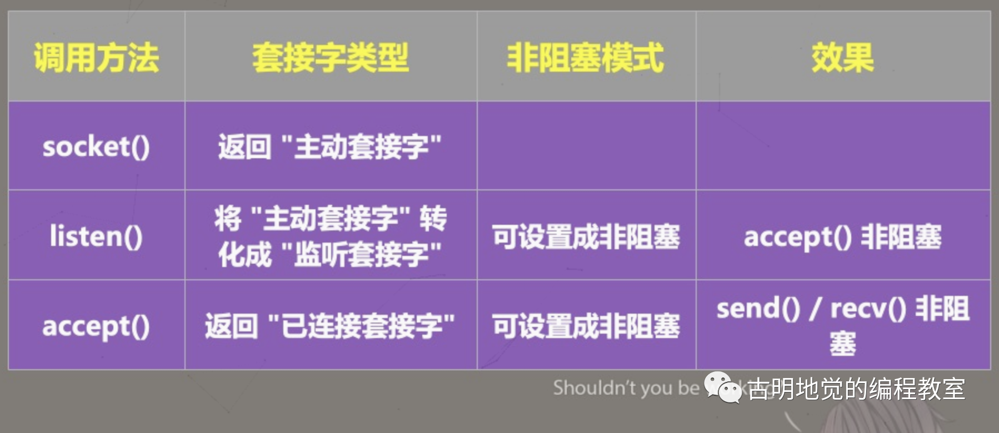

Redis 原理讲解

原著: 古明地觉的编程教室


本篇部分内容由小玉学习时手抄录入，可能有抄错、抄串行、抄漏等现象


# 一、Redis 属于单线程还是多线程? 不同版本之间有什么区别?


## Redis 是单线程还是多线程

Redis 应该是使用频率最高的组件之一了, 不仅会在工作中大量使用, 面试的时候也经常会作为考点出现, 下面就来深入的了解一下 Redis.

**先来探讨一个问题，Redis 使用的到底是多线程还是单线程？**

不同版本的 Redis 是不同的, 在 4.0 之前 Redis 是单线程运行的, 但是单线程并不代表效率低. 像 Nginx, Nodejs 也是单线程程序, 但他们的效率并不低, 因为底层采用了基于 epoll 的 [IO多路复用](#非阻塞 I/O 和 I/O 多路复用是什么).

此外 Redis 是基于内存操作的, 他的瓶颈在于机器的内存, 网络带宽, 而不是 CPU, 因为在你 CPU 还没达到瓶颈时你的内存可能就先满了,或者带宽达到瓶颈了. 因此 CPU 不是主要原因, 那么自然就采用单线程了. 更何况使用多线程还会面临一些额外的问题, 比如共享资源的保护等等, 对于一个 CPU 不是主要瓶颈的键值对数据库而言, 采用单线程时非常合适的.

简单来说, Redis 在 4.0 之前使用单线程的模式是因为以下三个原因:

- 使用单线程模式的 Redis, 其开发和维护会更简单, 因为单线程模型方便开发和调试;
- 即使使用单线程模型也能够并发的处理多客户端请求, 因为 Redis 内部使用了基于 epoll 的多路复用;
- 对于 Redis 而言, 主要的性能瓶颈是内存或者网络带宽, 而并非 CPU;

但 Redis 在 4.0 以及以后的版本中引入了惰性删除(也叫异步删除), 这是由额外的线程执行的. 意思就是我们可以使用异步的方式对 Redis 中的数据执行删除操作了, 例如: unlink key, flushdb async, flushall async, 举个例子:

```shell
127.0.0.1:6379> set name satori
ok
127.0.0.1:6379> get name
"satori"

# 这里是异步删除一个 key
# 同步的话则是 del name
127.0.0.1:6379> unlink name
(integer)1
127.0.0.1:6379> flushdb async
ok
127.0.0.1:6379> flushall async
OK
```

这样处理的好处就是不会使 Redis 的主线程卡顿, 会把这些删除操作交给后台来执行.

通常情况下使用 del 指令可以很快的删除数据, 但是当被删除的 key 是一个非常大的对象时, 例如: 删除的是包含了成千上万个元素的 hash 集合, 那么 del 指令就会造成 Redis 主线程卡顿. 而是用惰性删除, 可以有效避免 Redis 卡顿的问题.

除了惰性删除, 像持久化, 集群数据同步等, 都是由额外的子线程执行的, 而 Redis 主线程则专注于网络IO 和键值对的读写.

## 单线程的 Redis 为什么这么快

正如上面所说，Redis4.0 之前是单线程的，那既然是单线程为什么速度还能那么快？吞吐量还能那么高？

**原因有以下几点：**

1. `基于内存操作`: Redis 所有数据都在内存中, 因此所有运算都是内存级别的, 所以他的性能比较高;
2. `数据结构简单`: Redis 的数据结构是为自身专门量身打造的, 而操作这些数据结构的时间复杂度是 O(1);
3. `多路复用和非阻塞I/O`: Redis 使用 I/O多路复用 功能来监听多个 socket 连接客户端, 这样就可以用一个线程来处理多个连接, 从而减少线程切换带来的开销, 同时也避免了 I/O阻塞操作,从而大大提高 Redis 性能;
4. `避免上下文切换`: 因为是单线程模型, 因此就避免了不必要的上下文切换和多线程竞争, 这就省去了多线程切换带来的时间和性能上的开销, 而且单线程不会导致死锁问题发生;

##   非阻塞 I/O 和 I/O 多路复用是什么

首先我们可以使用 get 命令，获取一个 key 对应的 value，比如:

```shell
127.0.0.1:6379> get name
"satori"
```

那么问题来了，以上对于 Redis 服务端而言，都发生了哪些事情呢？

服务端必须要先监听客户端连接（bind/listen），然后当客户端到来时与其建立连接（accept），从 socket 中读取客户端的请求（recv），对请求进行解析（parse）。这里解析出请求类型是 get、key 是 "name"，再根据 key 获取对应 value，最后返回给客户端，也就是向 socket 写入数据（send）。


以上所有操作都是由 Redis 主线程依次执行的，但里面会有潜在的阻塞点，分别是 accept 和 recv。

当 Redis 监听到一个客户端有连接请求、但却一直未能成功建立连接，那么主线程会一直阻塞在 accept 函数这里，导致其它客户端无法和 Redis 建立连接。

类似的，当 Redis 通过 recv 函数从客户端读取数据时，如果数据一直没有到达，那么 Redis 主线程也会一直阻塞在 recv 这一步，因此就导致了 Redis 的效率会变得低下。

### 非阻塞I/O

但很明显，Redis 不会允许这种情况发生，因为以上都是阻塞 I/O 会面临的情况，而 Redis 采用的是非阻塞 I/O，也就是将 socket 设置成了非阻塞模式。

首先在 socket 模型中，调用 socket() 方法会返回`主动套接字`，调用 bind() 方法绑定 IP 和端口，再调用 listen() 方法将主动套接字转化为`监听套接字`，最后监听套接字调用 accept() 方法等待客户端连接的到来， 当和客户端建立连接时再返回`已连接套接字`，而后续就通过已连接套接字来和哭护短进行数据的接收与发送。

但是注意：我们说在 listen() 这一步，会将主动套接字转化为监听套接字，而此时的监听套接字类型是阻塞的，阻塞类型的监听套接字在调用 listen() 方法时，如果没有客户端来连接的话，就会一直处于阻塞状态，那么此时主线程就没法干其它的事情了。

所以在 listen() 的时候可以将其设置为非阻塞，而非阻塞的监听套接字在调用 accept() 时，如果没有客户端连接达到时，那么主线程就不会傻傻的等待了，而是会直接返回，然后去做其他的事情。

类似的，我们在创建已连接套接字的时候也可以将其类型设置为非阻塞，因为阻塞类型的已连接套接字在调用 send()/recv() 的时候也会处于阻塞状态。不如当客户端一直不发数据的时候，已连接套接字就会一直阻塞在 recv() 这一步。如果是非阻塞类型的已连接套接字，那么当调用 recv() 但却也收不到数据时，也不用处于阻塞状态，同样可以直接返回去做其他事情。




**但是有两点需要注意：**

1. 虽然 accept() 不阻塞了，在没有客户端连接时 Redis 主线程可以去做其它事情，但如果后续有客户端连接，Redis 要如何得知呢？因此必须要有一种机制，能够继续在`监听套接字`上等待后续连接请求，并在请求到来时通知 Redis。
2. send()/recv() 不阻塞了，相当于 I/O读写流程不再是阻塞的，读写方法都会瞬间完成并返回，也就是说它会采用能读多少就读多少、能写多少就写多少的策略来执行 I/O操作，这显然更符合我们对性能的追求。

但这样会面临一个问题，那就是当我们执行读写操作时，有可能只读取了一部分数据，剩余的数据客户端还没发过来，那么这些数据何时可读呢？同理写数据也是这种情况，当缓冲区满了，而我们的数据还没写完，那么剩下的数据又何时写呢？因此同样要有一种机制，能够在 Redis 主线程做别的事情的时候继续监听`已连接套接字`，并且在有数据可读写时通知 Redis。

**这样才能保证 Redis 线程既不会像基本 IO 模型一样，一直在阻塞点等待，也不会无法处理实际到达的客户端连接请求和可读写的数据，而上面所提到的机制便是 I/O 多路复用。**

### I/O 多路复用

I/O多路复用机制是指一个线程处理多个 I/O流，也就是我们经常听到的 select/poll/epoll，而 Linux 默认采用 epoll。

简单来说，在 Redis 只运行单线程的情况下，该机制允许内核中同时存在多个`监听套接字`和`已连接套接字`。内核会一直监听这些套接字上的连接请求或数据请求，一旦有请求到达就会交给 Redis 线程处理，这样就实现了一个 Redis 线程处理多个 IO流的效果。


上图就是基于多路复用的 Redis IO 模型，图中的 FD 就是套接字，可以是监听套接字、也可以是已连接套接字，Redis 会通过 epoll 机制来让内核帮忙监听这些套接字。而此时 Redis 线程或者说主线程，不会阻塞在某一个特定的套接字上，也就是说不会阻塞在某一个特定的客户端请求处理上。因此 Redis 可以同时和多个客户端连接并处理请求，从而提升并发性。

但为了在请求到达时能够通知 Redis 线程，epoll 提供了基于事件的回调机制，即针对不同事件的发生，调用相应的处理函数。

那么回调机制是怎么工作的呢？以上图为例，首先 epoll 一旦监测到 FD 上有请求到达，就会触发相应的事件。这些事件会被放进一个队列中，Redis 的主线程会对该事件队列不断进行处理，这样一来 Redis 就无需一直轮询是否有请求发生，从而避免资源的浪费。

同时，Redis 在对事件队列中的事件进行处理时，会调用相应的处理函数，这就实现了基于事件的回调。因为 Redis 一直在对事件进行处理，所以能及时响应客户端请求，提升 Redis 的响应性能。

比如连接请求和数据读取请求分别对应 Accept 事件和 Read 事件，Redis 分别对这两个事件注册 accept 和 get 回调函数。当 Linux 内核监听到有连接请求或数据读取请求时，就会触发 Accept 事件或 Read 事件，然后内核就会回调 Redis 注册的 accept 函数或 get 函数。

需要注意的是，不同的操作系统有着不同的多路复用实现，除了 Linux 的 epoll，还有 FreeBSD 的 kqueue、以及 Solaris 的 evport。

## 嗦一下 Redis 6.0 的多线程

Redis 6.0 引入了一些新特性，其中非常受关注的一个特性就是多线程。在 4.0 之前 Redis 是单线程的，因为单线程的优点很明显，不但降低了 Redis 内部实现的复杂性，也让所有操作都可以在无锁的情况下进行，并且不存在死锁和线程切换带来的性能以及时间上的消耗。

但是其缺点也很明显，单线程机制导致 Redis 的 QPS（Query Per Second，每秒查询数）很难得到有效的提高（虽然已经够快了，但人毕竟还是要有更高的追求的）。

然后 Redis 在 4.0 版本引入了多线程，但是此版本的多线程主要用于大数据量的异步删除，对于非删除操作的意义并不是很大。

而 Redis 6.0 中的多线程则是真正为了提高 I/O 的读写性能而引入的，它的主要实现思路是将主线程的 I/O 读写任务拆分给一组独立的子线程去执行。也就是说，从 socket 读数据和写数据不再由主线程负责，而是交给了多个子线程，这样就可以使多个 socket 的读写并行化了。这么做的原因就在于，虽然在 Redis 中使用了 I/O 多路复用和非阻塞 I/O，但数据在内核态空间和用户态空间之间的拷贝是无法避免的，而数据的拷贝这一步是阻塞的，并且当数据量越大时拷贝所需要的时间就越多。

所以 Redis 在 6.0 引入了多线程，用于分摊同步读写 I/O 压力，从而提升 Redis 的 QPS。

但是注意：Redis 的命令本身依旧是由 Redis 主线程串行执行的，只不过具体的读写操作交给独立的子线程去执行了（一会儿详细说明 Redis 的主线程和子线程之间是如何协同的）。而这么做的好处就是不需要为 Lua 脚本、事务的原子性而额外开发多线程互斥机制，这样一来 Redis 的线程模型实现起来就简单多了。因为和之前一样，所有的命令依旧是由主线程串行执行，只不过具体的读写任务交给了子线程。

> 除了引入多线程，还可以将内核网络协议栈换成用户态网络协议栈（DPDK），让网络请求不在内核里进行，直接在用户态完成。但 Redis 并没有采用这种做法，虽然替换协议栈可以避免频繁地让内核参与网络请求处理，提升请求处理效率。原因是该做法要求 Redis 添加对用户态网络协议栈的支持，需要修改 Redis 源码中和网络相关的部分，这会带来很多额外的开发工作量；而且新增代码还可能引入 bug，导致 Redis 程序不稳定，因此 Redis 6.0 没有采用这种做法。

### 请再具体嗦一下 Redis 6.0 的主线程和子线程之间是如何协同的？

整体可以分为四个阶段。

`阶段一：服务端和客户端建立 socket 连接，并分配子线程（处理线程）`

首先，主线程负责建立连接请求，当有客户端请求到达时，主线程会创建和客户端的 scoket 连接，该 socket 连接就是用来和客户端进行数据传输的。只不过这一步不由主线程来做，主线程要做的事情是将该 socket 放入到全局等待队列中，然后通过轮询的方式选择子线程，并将队列中的 socket 连接分配给它。

所以无论是从客户端读数据还是向客户端写数据，都由子线程来做。因为我们说 Redis 6.0 引入的多线程就是为了缓解主线程的 I/O 读写压力，而 I/O 读写这一步是阻塞的，所以应该交给子线程并行操作。

`阶段二：子线程读取并解析请求`

主线程一旦把 socket 连接分配给子线程，那么会进入阻塞状态，等待子线程完成客户端请求的读取和解析，得到具体的命令操作。由于可以有多个子线程，所以这个操作很快就能完成。

`阶段三：主线程执行命令操作`

等到子线程读取到客户端请求并解析完毕之后，再由主线程以单线程的方式执行命令操作，所以 I/O 读写虽然交给了子线程，但命令本身还是由 Redis 主线程执行的。

`阶段四：子线程回写 socket、主线程清空全局队列`

当主线程执行完命令操作时，还需要将结果写入缓冲区，而这一步显然要由子线程来做，因为是 I/O 读写。此时主线程会再次陷入阻塞，直到子线程将这些结果写回 socket 并返回给客户端。

和读取一样，子线程将数据写回 socket 时，也是多个线程在并行执行，所以写回 socket 的速度也很快。之后主线程会清空全局队列，等待客户端的后续请求。


### 在 Redis 6.0 中如何开启多线程？

在了解了 Redis 6.0 的多线程机制之后，我们要如何开启多线程呢？在 Redis 6.0 中，多线程机制默认是关闭的，如果想启动的话，需要修改 redis.conf 里的两个配置。

```shell
# 设置 io-thread-do-reads 配置项为 yes
# 表示启用多线程
io-thread-do-reads yes
# 通过 io-threads 设置子线程的数量
io-threads 3
```

上述配置表示开启 3 个子线程，需要注意的是，线程数并不是越大越好，应该小于机器的 CPU 核数。关于线程数的设置，官方的建议是：如果 4 核的 CPU，那么设置子线程数为 2 或 3；如果 8 核的 CPU，那么设置子线程数为 6。

如果你在实际应用中，发现 Redis 实例的 CPU 开销不大，吞吐量却没有提升。那么可以考虑使用 Redis 6.0 的多线程机制，加速 IO 读写处理，进而提升实例的吞吐量。

最后关于 Redis 的性能，Redis 的作者在 2019 的 RedisConf 大会上提到，Redis6.0 引入的多线程 I/O 特性对性能的提升至少是一倍以上。国内也有人在阿里云使用 4 个线程的 Redis 版本和单线程的 Redis 版本进行比较测试，发现测试的结果和 Redis 作者说的一致，性能基本可以提高一倍。


# 二、Redis 的键值对长什么样子，又是怎么存储的？


Redis 的数据类型可谓是 Redis 的精华所在，作为一款 QPS 能达到 10w 级别的内存数据库，具有如此高性能的原因有很多。除了所有的操作都在内存中进行之外，其数据类型的底层设计也起到了很大的作用。

我们知道 Redis 中有 5 种基础数据类型，分别是：String（字符串）、List（列表）、Hash（哈希）、Set（集合）和 ZSet（有序集合）。而为了支持这些数据类型，Redis 使用了多种数据结构来作为这些类型的底层结构。


这些数据结构是我们后续的重点，当然啦 Redis 的数据类型还不止这五种，还有几个更高级的类型，我们后续也会说，但最常用的还是上面五种。

不过这里我主要是想介绍一下 Redis 是怎么存储键值对的。

```shell
127.0.0.1:6379> SET name satori
OK
127.0.0.1:6379> LPUSH scores 90 95 93
(integer) 3
127.0.0.1:6379> HSET students satori 99
(integer) 1
127.0.0.1:6379> 
```

这里的 name、scores、students 都属于 key，它们的 value 是不同的类型，那么问题来了，这些 key、value 存在什么地方呢？其实不难得出，既然 Redis 是键值对数据库，查询的效率又这么高，那么肯定是存在哈希表当中的，事实上也确实如此。


以上代码位于 Redis 源码的 src/server.c 文件中，代码里面的 server 就相当于 Redis 的服务端。

另外我们知道 Redis 默认有 16 个库，而 server.db[j] 就是获取 j 号库，所以此时相信你应该知道上面的代码所做的事情是什么了，就是为每一个库创建多个哈希表。而我们使用命令创建的 key、value 都会存储在 server.db[j].dict 里面，就是绿色框框里面创建的哈希表。

所以结论很清晰了，每一个库都有一个全局的哈希表 server.db[j].dict，专门负责存储设置的 key、value。其中 key 永远为 String 类型，value 可以是任意类型。这也侧面说明了我们设置的 key 不会重复，因为哈希表里面的 key 是不重复的。


一开始 hello 这个 key 不存在，那么会自动往全局的哈希表中加入一个键值对，key 为 hello，值的类型为 String。然后执行 lpush 的时候，由于 hello 这个 key 已存在，那么再执行就报错了。

现在我们知道 key、value 是存在哈希表里面了，但具体是怎么存储的呢？我们来看一张图：


一个哈希表可以是一个数组，数组里面的每一个存储单元都叫做哈希桶（Bucket），比如数组第一个位置（索引为 0）被编为哈希桶 0，第二个位置（索引为 1）被编为哈希桶 1，以此类推。

当我们写入一个键值对的时候，会根据 key 和 value 的指针构建一个 dictEntry 结构体实例。然后通过对 key 进行哈希运算来计算出桶的位置，最后将 dictEntry 结构体实例的指针写入哈希表中。

关于 Redis 哈希表的具体细节后续再聊，目前只需要知道 Redis 的 key、value 是存在哈希表中的即可。当然啦，更准确地说应该是 key、value 的指针所构建的 dictEntry 结构体实例的指针是存在哈希表当中的。

当我们通过 key 进行查找的时候，会先对 key 进行哈希运算，找到对应的哈希桶中存储的 dictEntry *，然后再根据 value 获取对应的值。

最后还需要特别补充一下，Redis 中所有的对象其实都是一个 redisObject 结构体实例，其结构如下：


不管是 String 对象、还是 List 对象、Hash 对象等等，它们其实都是一个 redisObject 对象，里面有一个 type 字段来标识这个对象的所属类型。

```shell
127.0.0.1:6379> type name
string
127.0.0.1:6379> type students
hash
127.0.0.1:6379> type scores
list
```

我们可以用 type 命令查看对象的类型，虽然显示的类型不同，但本质上它们都是 redisObject 这个结构体的实例对象。内部的 encoding 表示该类型的对象所使用的底层数据结构，ptr 表示指向底层数据结构的指针，而根据 encoding 和 ptr 的不同，type 可以是 string, list, hash 等等。

比如我们执行 sadd box 1 2 3 1，我们会说 box 的值是一个 Set 对象，这种说法是正确的。但是我们应该知道它其实是一个 redisObject，里面的 type 字段等于 "set"，这背后的细节要搞清楚。不过后续我们还是会按照 String、List、Hash 之类的来称呼，就不用 redisObject 了，只要明白背后的关系就行。

> 如果你看过 Python 源代码的话，你会发现 redisObject 和 PyObject 在设计上有着异曲同工之妙。


# 三、深度解密 Redis 的字符串

下面来解密 Redis 的字符串，整篇文章分为三个部分。

- Redis 字符串的相关命令；
- Redis 字符串的应用场景；
- Redis 字符串的实现原理；

## Redis 字符串的相关命令

先来看看字符串的相关命令，我们首先要学会如何使用它。

**set key value：给指定的 key 设置 value**

```shell
127.0.0.1:6379> set name satori
OK

# 如果字符串之间有空格，可以使用双引号包起来
127.0.0.1:6379> set name "kemeiji satori"
OK
```

对同一个 key 多次设置 value 相当于更新，会保留最后一次设置的 value。设置成功之后会返回一个 OK，表示设置成功。除此之外，set 还可以指定一些可选参数。

- set key value ex 60：设置的时候指定过期时间为 60 秒，等价于 setex key 60 value
- set key value px 60：设置的时候指定过期时间为 60 毫秒，等价于 psetex key 60 value
- set key value nx：只有 key 不存在的时候才会设置，存在的话会设置失败，而如果不加 nx 则会覆盖，等价于 setnx key value
- set key value xx：只有 key 存在的时候才会设置，不存在的话会设置失败。注意：没有 setxx key value


我们发现使用 set 已经足够了，因此未来可能会移除 setex、psetex、setnx。另外我们可以对同一个 key 多次 set，相当于对原来的值进行了覆盖。

**get key：获取指定 key 对应的 value**

```shell
127.0.0.1:6379> get name
"kemeiji satori"
127.0.0.1:6379> get age
(nil)
```

如果 key 不存在，则返回 nil，也就是空。存在的话，则返回 key 对应的 value。

**del key1 key2 ···：删除指定 key，可以同时删除多个**

```shell
127.0.0.1:6379> set age 16
OK

# 虽然设置的是一个数值
# 但在 Redis 中都是字符串格式
127.0.0.1:6379> get age
"16"
127.0.0.1:6379> get name
"kemeiji satori"

# 会返回删除的 key 的个数，表示有效删除了两个
# 而 gender 不存在，所以无法删除一个不存在的 key
127.0.0.1:6379> del name age gender
(integer) 2
127.0.0.1:6379> get name
(nil)
127.0.0.1:6379> get age
(nil)
```

**append key value：追加**

如果 key 存在，那么会将 value 追加到 key 对应的值的末尾；如果不存在，那么会重新设置，等价于 set key value。

```shell
127.0.0.1:6379> set name komeiji
OK
127.0.0.1:6379> get name
"komeiji"

# 追加一个字符串
# 并返回追加之后的字符串长度
127.0.0.1:6379> append name " satori"
(integer) 14
127.0.0.1:6379> get name
"komeiji satori"

127.0.0.1:6379> set age 1
OK
127.0.0.1:6379> get age
"1"
127.0.0.1:6379> append age 6
(integer) 2
127.0.0.1:6379> get age
"16"
```

**strlen key：查看 key 对应的 value 的长度**

```shell
127.0.0.1:6379> strlen name
(integer) 14
127.0.0.1:6379> strlen age
(integer) 2
127.0.0.1:6379> strlen not_exists
(integer) 0
```

**incr key：为 key 存储的值自增 1，必须可以转成整型，否则报错。如果不存在 key，默认先将该 key 的值设置为 0，然后自增 1**

```shell
127.0.0.1:6379> get age
"16"

# 返回自增后的结果
127.0.0.1:6379> incr age
(integer) 17
127.0.0.1:6379> get age
"17"

# 值不存在的话，会先设置为 0
# 然后再自增 1
127.0.0.1:6379> get length
(nil)
127.0.0.1:6379> incr length
(integer) 1
127.0.0.1:6379> get length
"1"

# name 无法转成整型
127.0.0.1:6379> incr name
(error) ERR value is not an integer or out of range
```

**decr key：为 key 存储的值自减 1，必须可以转成整型，否则报错。如果不存在 key，默认先设置该 key 值为 0，然后自减 1**

```shell
127.0.0.1:6379> get age
"17"
127.0.0.1:6379> decr age
(integer) 16
127.0.0.1:6379> get age
"16"
127.0.0.1:6379> 
127.0.0.1:6379> get age2
(nil)
127.0.0.1:6379> decr age2
(integer) -1
127.0.0.1:6379> get age2
"-1"
```

**incrby key number：为 key 存储的值自增 number，必须可以转成整型，否则报错，如果不存在的话，默认先将该值设置为 0，然后自增 number**

```shell
127.0.0.1:6379> get age
"16"
127.0.0.1:6379> incrby age 5
(integer) 21
127.0.0.1:6379> get age
"21"
127.0.0.1:6379> incrby age -5
(integer) 16
127.0.0.1:6379> get age
"16"
```

相信你已经猜到了，除了 incrby 之外还有 decrby，两者用法是一样的。如果number 为负数，那么 incrby 的效果等价于 decrby。


**getrange key start end：获取指定范围的 value**

注意：redis 的索引都是包含结尾的，不管是这里的 getrange，还是后续的列表操作，索引都是包含两端的。

```shell
127.0.0.1:6379> set name satori
OK
127.0.0.1:6379> getrange name 0 -1
"satori"
127.0.0.1:6379> getrange name 0 4
"sator"
127.0.0.1:6379> getrange name -3 -1
"ori"
127.0.0.1:6379> getrange name -3 10086
"ori"
127.0.0.1:6379> getrange name -3 -4
""
127.0.0.1:6379> 
```

索引既可以从前往后数，也可以从后往前数。


**setrange key start value：从索引为 start 的地方开始，将 key 对应的值替换为 value，替换的长度等于 value 的长度**

```shell
127.0.0.1:6379> get name
"satori"

# 从索引为 0 的地方开始替换三个字符
# 并返回替换之后字符串的长度
127.0.0.1:6379> setrange name 0 SAT
(integer) 6
127.0.0.1:6379> get name
"SATori"

# 从索引为 10 的地方开始替换
# 但是字符串索引最大为 6，因此会使用 \x00填充
127.0.0.1:6379> setrange name 10 ORI
(integer) 13
127.0.0.1:6379> get name
"SATori\x00\x00\x00\x00ORI"

# 对于不存在的 key 也是如此
127.0.0.1:6379> setrange myself 3 gagaga
(integer) 9
127.0.0.1:6379> get myself
"\x00\x00\x00gagaga"

127.0.0.1:6379> set name satori
OK
# 替换的字符串长度没有限制，会自动扩充
127.0.0.1:6379> setrange name 0 'komeiji koishi'
(integer) 14
127.0.0.1:6379> get name
"komeiji koishi"
```


**mset key1 value1 key2 value2：同时设置多个 key value**

这是一个原子性操作，要么都设置成功，要么都设置不成功。注意：这些都是会覆盖原来的值的，如果不想这样的话，可以使用 msetnx，这个命令只会在所有的 key 都不存在的时候才会设置。

**mget key1 key2：同时返回多个 key 对应的 value**

如果有的 key 不存在，那么返回 nil。

```shell
127.0.0.1:6379> mset name koishi age 15
OK
127.0.0.1:6379> mget name age gender
1) "koishi"
2) "15"
3) (nil)
127.0.0.1:6379> 
```


**getset key value：先返回 key 的旧值，然后设置新值**

```shell
127.0.0.1:6379> getset name satori
"koishi"
127.0.0.1:6379> get name
"satori"
127.0.0.1:6379> 
127.0.0.1:6379> getset ping pong
(nil)
127.0.0.1:6379> get ping
"pong"
127.0.0.1:6379> 
```

返回旧值的同时设置新值，如果 key 不存在，那么会返回 nil，然后设置。

另外，Redis 里面还有一些关于 key 的操作，这些操作不是专门针对 String 类型的，但是有必要提前说一下。

**keys pattern：查看所有名称满足 pattern 的 key，至于 key 对应的 value 则可以是 Redis 的任意类型**

```shell
# 查看所有的 key
127.0.0.1:6379> keys *
1) "hello"
2) "length"
3) "age2"
4) "ping"
5) "age"
6) "name"
7) "myself"

# 查看包含 a 的 key
127.0.0.1:6379> keys *a*
1) "age2"
2) "age"
3) "name"

# 查看以age开头、总共 4 个字符的key
127.0.0.1:6379> keys age?
1) "age2"
127.0.0.1:6379> 
```

**exists key：判断某个 key 是否存在**

```shell
# 查看 key 是否存在
# 存在返回 1，不存在返回 0
127.0.0.1:6379> exists name
(integer) 1
127.0.0.1:6379> exists names
(integer) 0

# 也可以指定多个 key，返回存在的 key 的个数
# 但是此时无法判断到底是哪个 key 存在
127.0.0.1:6379> exists name name1
(integer) 1
127.0.0.1:6379> 
```

**ttl key：查看还有多少秒过期，-1 表示永不过期，-2 表示已过期**

```shell
127.0.0.1:6379> ttl name
(integer) -1
127.0.0.1:6379> ttl name2
(integer) -2
127.0.0.1:6379> 
```

key 是可以设置过期时间的，如果过期了就不能再用了。但我们看到 name2 这个 key 压根就不存在，返回的也是 -2，因为过期了就相当于不存在了。而 name 是 -1，表示永不过期。


**expire key 秒钟：为给定的 key 设置过期时间**

```shell
# 设置 60s，设置成功返回 1
127.0.0.1:6379> expire name 60
(integer) 1
# 查看时间，还剩下 55 秒
127.0.0.1:6379> ttl name 
(integer) 55
# NAME 不存在，设置失败，返回 0
127.0.0.1:6379> expire NAME 60
(integer) 0
127.0.0.1:6379> 
```

这里设置 60s 的过期时间，另外设置完之后，在过期时间结束之前是可以再次设置的。比如我先设置了 60s，然后快结束的时候我再次设置 60s，那么还会再持续 60s。


**type key：查看你的 key 是什么类型**

```shell
# name过期了，相当于不存在了
# 因此为 none
127.0.0.1:6379> type name
none  
# 类型为 string
127.0.0.1:6379> type age
string 
127.0.0.1:6379>
```

**move key db：将 key 移动到指定的 db 中**

```shell
# 清空当前库，将所有 key 都删除
# 如果是清空所有库，可以使用 flushall
# 当然后面都可以加上 async，表示异步删除
127.0.0.1:6379> flushdb
OK
127.0.0.1:6379> set name satori
OK
127.0.0.1:6379> keys *
1) "name"
# 将 name 移动到索引为3的库中
127.0.0.1:6379> move name 3
(integer) 1
# 当前库已经没有 name 这个 key 了 
127.0.0.1:6379> keys *
(empty array)
# 切换到索引为 3 的库中
127.0.0.1:6379> select 3
OK
# keys * 查看，发现 name 已经有了
127.0.0.1:6379[3]> keys *
1) "name"
# 切换回来
127.0.0.1:6379[3]> select 0
OK
127.0.0.1:6379> 
```

## **Redis 字符串的应用场景**

### 1、页面数据缓存

我们知道，一个系统最宝贵的资源就是数据库资源，随着公司业务的发展壮大，数据库的存储量也会越来越大，并且要处理的请求也越来越多。然而当数据量和并发量到达一定级别之后，数据库就变成了拖慢系统运行的 “罪魁祸首”。

为了避免这种情况发生，我们可以把查询结果放入缓存（Redis）中，让下次同样的查询直接去缓存系统取结果，而非查询数据库，这样既减少了数据库的压力，同时也提高了程序的运行速度。


这也是 Redis 用途最广泛的地方。

### 2、数据计算与统计

Redis 可以用来存储整数和浮点数类型的数据，并且可以通过命令直接累加并存储整数信息，这样就省去了每次先要取数据、转换数据、运算、再存入数据的麻烦，只需要使用一个命令就可以完成此流程。比如：微博、哔哩哔哩等社交平台，我们经常会点赞，然后还有点赞数。每点一个赞，点赞数就加 1，这个功能就完全可以交给 Redis 实现。

### 3、共享 Session 信息

通常我们在开发后台管理系统时，会使用 Session 来保存用户的会话（登录）状态，这些 Session 信息会被保存在服务器端，但这只适用于单系统应用，如果是分布式系统此模式将不再适用。

例如用户 A 的 Session 信息存储在第一台服务器，但第二次访问时用户 A 的请求被分配到第二台服务器，这个时候该服务器并没有用户 A 的 Session 信息，就会出现需要重复登录的问题。

由于分布式系统每次会把请求随机分配到不同的服务器，因此我们需要借助缓存系统对这些 Session 信息进行统一的存储和管理。这样无论请求发送到哪台服务器，服务器都会去统一的缓存系统获取相关的 Session 信息，这样就解决了分布式系统下 Session 存储的问题。


虽然这也是 Redis 使用场景之一，只不过在现在的 web 开发中已经很少会使用共享 Session 的方式了。

## 3、Redis 字符串的实现原理

下面我们就来分析字符串的底层数据结构了，我们说键值对中的键是字符串类型，值有时也是字符串类型。

Redis 是用 C 语言实现的，但它没有直接使用 C 的字符串，而是自己封装了一个名为简单动态字符串（simple dynamic string，SDS） 的数据结构来表示字符串，也就是说 Redis 的 String 数据类型的底层数据结构是 SDS。

既然 Redis 设计了 SDS 结构来表示字符串，肯定是 C 语言的字符串存在一些缺陷。

### C 字符串的缺陷

C 的字符串其实就是一个字符数组，即数组中每个元素都是字符串的一个字符，比如下图就是字符串 "koishi" 的字符数组结构：


s 只是一个指针，它指向了字符数组的起始位置，那么问题来了，C 要如何得知一个字符数组的长度呢？于是 C 会默认在每一个字符数组后面加上一个 \0，来表示字符串的结束。

因此 C 语言标准库中的字符串函数就是通过判断字符是不是 \0 来决定要不要停止操作，如果当前字符不是 \0 ，说明字符串还没结束，可以继续操作；如果当前字符是 \0，则说明字符串结束了，就要停止操作。

举个例子，C 语言获取字符串长度的函数 strlen，就是通过遍历字符数组中的每一个字符，并进行计数。当遇到字符 \0 时停止遍历，然后返回已经统计到的字符个数，即为字符串长度。下图显示了 strlen 函数的执行流程：


如果用代码实现的话：

```c
#include <stdio.h>

size_t strlen(const char *s) {
    size_t count = 0;
    while (*s++ != '\0') count++;
    return count;
}

int main() {
    printf("%lu\n", strlen("koishi"));  // 6
}
```

很明显，C 语言获取字符串长度的时间复杂度是 O(N)，并且使用 \0 作为字符串结尾标记有一个缺陷。如果某个字符串中间恰好有一个 \0，那么这个字符串就会提前结束，举个例子：

```c
#include <stdio.h>
#include <string.h>

int main() {
    // 字符串相关操作函数位于标准库 string.h 中
    printf("%lu\n", strlen("abcdefg"));  // 7
    printf("%lu\n", strlen("abc\0efg"));  // 3
}
```

所以在 C 中 \0 为字符串是否结束的标准，因此如果使用 C 的字符数组，只能让 C 在字符串结尾自动帮你加上 \0，我们创建的字符串内部是不可以包含 \0 的，否则就会出问题，因为字符串会提前结束。这个限制使得 C 语言的字符串只能保存文本数据，不能保存像图片、音频、视频之类的二进制数据。

另外 C 语言标准库中字符串的操作函数是很不安全的，对程序员很不友好，稍微一不注意，就会导致缓冲区溢出。举个例子，strcat 函数可以将两个字符串拼接在一起。

```c
#include <stdio.h>
#include <string.h>

//将 src 字符串拼接到 dest 字符串后面
//char *strcat(char *dest, const char* src);

int main() {
    char buf[12] = "hello ";
    printf("%s\n", buf);  // hello
    strcat(buf, "world");
    printf("%s\n", buf);  // hello world
}
```

"hello world" 占 11 个字符，加上 \0 一共 12 个，buf 的长度也为 12，刚好能容纳的下。但如果我们将 buf 的长度改成 11，就会发生缓冲区溢出，可能造成程序终止。因此 C 语言的字符串不会记录自身的缓冲区大小，它假定我们在执行这个函数时，已经为 dest 分配了足够多的内存。

而且 strcat 函数和 strlen 函数类似，时间复杂度也是 O(N) 级别，也是需要先通过遍历字符串才能得到目标字符串的末尾。然后对于 strcat 函数来说，还要再遍历源字符串才能完成追加，所以整个字符串的操作效率是不高的。

我们还是手动实现一下 strcat，看一看整个过程：

```c
#include <stdio.h>

char *strcat(char *dest, const char *src) {
    char *head = dest;
    // 遍历字符串，直到结尾
    while (*head != '\0') head++;
    // 循环结束之后，head 停在了 \0 的位置
    // 然后将 src 对应的字符数组中的字符逐个拷贝过去
    while ((*head++ = *src++) != '\0');
    // 最后返回 dest
    return dest;
}

int main() {
    char buf[12] = "hello ";
    printf("%s\n", buf);  // hello
    strcat(buf, "world");
    printf("%s\n", buf);  // hello world
}
```

好了， 通过以上的分析，我们可以得知 C 字符串的不足之处以及可以改进的地方。

- 获取字符串长度的时间复杂度为 O(N)；
- 字符串的结尾是以 \0 作为字符标识，使得字符串里面不能含有 \0 字符，因此不能保存二进制数据；
- 字符串操作函数不高效且不安全，比如有缓冲区溢出的风险，有可能会造成程序运行终止；

而 Redis 实现的 SDS 结构体就把上面这些问题解决了，接下来我们一起看看 Redis 是如何解决的。


### SDS 的定义

先来看一看 SDS 长什么样子？


解释一下里面的每个成员变量代表什么含义：

- len：记录了字符串的长度，这样后续在获取的时候只需返回这个成员变量的值即可，时间复杂度为 O(1)。
- alloc：分配给字符数组的空间长度，这样后续对字符串进行修改时（比如追加一个字符串），可以通过 alloc 减去 len 计算出剩余空间大小，来判断空间是否满足修改需求。如果不满足，就会自动将 SDS 内的 buf 进行扩容（所谓扩容就是申请一个更大的 buf，然后将原来 buf 的内容拷贝到新的 buf 中，最后将原来的 buf 给释放掉），再执行修改操作。通过这种方式就避免了缓冲区溢出的问题，而且事先可以申请一个较大的 buf，避免每次追加的时候都进行扩容。
- flags：用来表示不同类型的 SDS，SDS总共有 5 种，分别是 sdshdr5, sdshdr8, sdshdr16, sdshdr32 和 sdshdr64，后面说明它们之间的区别。所以 SDS 只是一个概念，它并不是真实存在的结构体，而 sdshdr5, sdshdr8, sdshdr16, sdshdr32 和 sdshdr64 才是底层定义好的结构体，相当于 SDS 的具体实现，当然它们都可以叫做 SDS。
- buf[]：字符数组，用来保存实际数据，不仅可以保存字符串，也可以保存二进制数据。之所以可以保存二进制数据是因为在计算字符串长度的时候不再以 \0 为依据，因为 SDS 中的 len 字段在时刻维护字符串的长度。


总的来说，Redis 的 SDS 在原本的字符数组之上，增加了三个元数据：len, alloc, flags，用来解决 C 语言字符串的缺陷。

### SDS 是怎么解决 C 字符串缺陷的

#### 1、O(1) 时间复杂度获取字符串长度

因为 C 字符串并不记录自身的长度信息，所以为了获取一个 C 字符串的长度，程序必须遍历整个字符串，对遇到的每个字符进行计数，直到遇到代表字符串结尾的 \0 为止，这个操作的复杂度为 O(N)。

而 Redis 的 SDS 因为加入了 len 成员变量，会时刻维护字符串的长度，所以获取字符串长度的时候，直接返回该成员变量的值就行，因此复杂度只有 O(1)。

#### 2、避免缓冲区溢出

C 字符串不记录自身的长度，所以在使用 strcat 函数追加的时候，会假定已经为 dest 分配了足够多的内存，可以容纳 src 字符串中的所有内容。然而一旦这个假定不成立时，就会产生缓冲区溢出。

与 C 字符串不同，SDS 的空间分配策略完全避免了发生缓冲区溢出的可能性。当 SDS API 需要对 SDS 进行修改时，会先检查 SDS 的空间是否满足修改所需的要求。如果不满足的话，API 会自动将 SDS 的空间扩展至执行修改所需的大小，然后才执行实际的修改操作。所以使用 SDS 既不需要手动修改SDS的空间大小，也不会出现缓冲区溢出问题。

#### 3、减少修改字符串时带来的内存重分配次数

Redis 在修改 SDS 时，会面临「申请、释放」内存的开销，所以 Redis 做了如下优化。

优化一：当判断出缓冲区剩余大小（alloc - len）不够用时，Redis 会自动扩大 SDS 的空间大小，以满足修改所需的大小。当然准确的说，扩容的是 SDS 内部的 buf 数组，扩容规则是：当小于 1MB 翻倍扩容，大于 1MB 按 1MB 扩容。

并且在扩展 SDS 空间的时候，API 不仅会为 SDS 分配修改所需要的空间，还会给 SDS 分配额外的「未使用空间」。这样的好处是，下次在操作 SDS 时，如果 SDS 空间够的话，API 就会直接使用「未使用空间」，而无须执行内存分配，从而有效地减少内存分配次数。

优化二：多余内存不释放，SDS 缩容的时候不释放多余的内存，下次可直接复用这些内存。

#### 4、二进制安全

C 字符串中的字符必须符合某种编码，并且除了字符串的末尾之外，字符串里面不能包含 \0。否则最先被程序读入的 \0 将被误认为是字符串结尾，这些限制使得 C 字符串只能保存文本数据，而不能保存像图片、音频、视频、压缩文件这样的二进制数据。

但 SDS 不需要用 \0 字符来标识字符串结尾，而是有个专门的 len 成员变量来记录长度，所以可存储包含 \0 的数据。但是 SDS 为了兼容部分 C 语言标准库的函数，还是会在结尾加上 \0 字符。注意：我们说 alloc 成员维护的是 buf[] 数组的长度，但是这个长度不包括结尾的 \0，比如 alloc 为 10，但 buf[] 的长度其实是 11。

因此 SDS 的 API 都是以处理二进制的方式来处理 SDS 存放在 buf[] 里的数据，程序不会对其中的数据做任何限制，数据写入的时候是什么样的，它被读取时就是什么样的。通过使用二进制安全的 SDS，而不是 C 字符串，使得 Redis 不仅可以保存文本数据，也可以保存任意格式的二进制数据。

#### 5、节省内存空间

SDS 结构中有个 flags 成员变量，表示的是 SDS 类型，Redis 一共设计了 5 种 SDS。而这 5 种的主要区别就在于，它们的 len 和 alloc 成员变量的数据类型不同。以 sdshdr16 和 sdshdr32 为例：


可以看到 sdshdr16 的 len 和 alloc 的数据类型都是 uint16_t，表示字符数组长度和分配空间大小不能超过 2 的 16 次方；sdshdr32 则都是 uint32_t，表示字符数组长度和分配空间大小不能超过 2 的 32 次方。

之所以 SDS 设计不同类型的结构体，是为了能灵活保存不同大小的字符串，从而有效节省内存空间。比如在保存小字符串时，len、alloc 这些元数据的占用空间也会比较少。像我们保存一个 5 字节的字符串，完全没有必要使用 uint64_t，否则 len 和 alloc 加起来就 16 字节了，这显然是得不偿失的。

除了设计不同类型的结构体，Redis 在编程上还使用了专门的编译优化来节省内存空间，即在定义 struct 时声明了 __attribute__ ((packed))，它的作用是：告诉编译器取消结构体在编译过程中的优化对齐，按照实际占用字节数进行对齐。

内存对齐是为了减少数据存储和读取的工作量，现在的 64 位处理器默认按照 8 字节进行对齐。所以相同的结构体，如果字段顺序不同，那么占用的大小也不一样，我们举个例子：

```c
#include <stdio.h>

typedef struct {
    int a;
    long b;
    char c;
} S1;

typedef struct {
    long a;
    int b;
    char c;
} S2;


int main() {
    printf("%u %u\n",
           sizeof(S1), sizeof(S2));  // 24 16
}
```

两个结构体的内部都是 3 个成员，类型为 int, long, char，但因为顺序不同导致整个结构体的大小不同，这就是内存对齐导致的。


关于内存对齐的具体细节这里不再赘述，总之它的核心就是：虽然现代计算机的内存空间都是按照 byte 划分的，从理论上讲似乎对任何类型的变量的访问都可以从任意地址开始，但是实际的计算机系统对基本类型数据在内存中存放的位置有限制，它们默认会要求这些数据的首地址的值是 8 的倍数（64 位机器），这就是所谓的内存对齐。

我们在 C 中可以指定对齐的字节数，比如 #pragma pack(4) 表示按照 4 字节对齐。当然啦，还可以像 Redis 那样在声明结构体的时候指定  __attribute__ ((packed)) 来禁止内存对齐，此时结构体中的字段都是紧密排列的，不会出现空洞。

```c
#include <stdio.h>

typedef struct {
    int a;
    long b;
    char c;
} S1;

typedef struct {
    long a;
    int b;
    char c;
} S2;

typedef struct __attribute__ ((packed)) {
    long a;
    int b;
    char c;
} S3;


int main() {
    printf("%u %u %u\n",
           sizeof(S1), sizeof(S2), sizeof(S3)
    );  // 24 16 13
}
```

我们看到在禁止内存对齐之后，结构体占 13 个字节，就是每个成员的大小相加。

## 本章小结

以上我们就从命令操作、应用场景、实现原理三个角度介绍了 Redis 字符串，命令操作比较简单，网上资料一大堆，应用场景也很简单，重点是它的实现原理。

我们要清楚为什么 Redis 自己定义 SDS 来表示字符串，而不使用 C 的字符数组，原因是 C 的字符数组有很大的不足。关于 SDS 和 C 字符数组之间的差别，再总结一下：


以上就是 Redis 字符串的内容，因为介绍了相关命令操作（加上代码演示），所以内容稍微有点多。如果你对 Redis 的命令操作已经很熟悉了，那么这部分也可以不用看。

最后，SDS 字符串在 Redis 内部也被大量使用，比如 ：

- Redis 的所有 key 都是字符串，可以查看 src/db.c 的 dbAdd 函数；
- Redis 服务端在读取 Client 发来的请求时，会先读到一个缓冲区中，这个缓冲区也是字符串，可以查看 src/server.h 中 struct client 的 querybuf 字段；
- 写操作追加到 AOF 时，会先写到 AOF 缓冲区，这个缓冲区也是字符串，可以查看 src/server.h 中 struct client 的 aof_buf 字段；


# 四、深度解密 Redis 的列表（List）

## Redis 列表的相关命令

**lpush key value1 value2 ...：将多个值设置到列表里面，从左边 push**

**rpush key value1 value2 ...：将多个值设置到列表里面，从右边 push**

```shell
# 返回插入成功之后，列表的元素个数
# 因为是从左往右 push
# 所以此时列表内的元素是 koishi mashiro
127.0.0.1:6379> lpush girls mashiro koishi
(integer) 2  
# 从右往左 push
127.0.0.1:6379> rpush girls satori
(integer) 3
127.0.0.1:6379> 
```

**lrange key start end：遍历列表，索引从 0 开始，最后一个为 -1，且包含两端**

```shell
127.0.0.1:6379> lrange girls 0 -1
1) "koishi"
2) "mashiro"
3) "satori"
127.0.0.1:6379> lrange girls 0 2
1) "koishi"
2) "mashiro"
3) "satori"
127.0.0.1:6379> lrange girls 0 1
1) "koishi"
2) "mashiro"
# 对不存在的列表使用 lrange，会得到空数组
127.0.0.1:6379> lrange lst 0 -1
(empty array)  
```

**lpop key：从列表的左端弹出一个值，列表长度改变**

**rpop key：从列表的右端弹出一个值，列表长度改变**

```shell
127.0.0.1:6379> lpop girls
"koishi"
127.0.0.1:6379> rpop girls
"satori"
127.0.0.1:6379> lrange girls 0 -1
1) "mashiro"
127.0.0.1:6379>  
```

**lindex key index：获取指定索引位置的元素，列表长度不变**

```shell
127.0.0.1:6379> lindex girls 0
"mashiro"

# 对不存在的列表使用 lindex，会得到 nil
127.0.0.1:6379> lindex lst 0 
(nil)  
127.0.0.1:6379>  
```

**llen key：获取指定列表的长度**

```shell
127.0.0.1:6379> llen girls
(integer) 1
# 对不存在的列表使用 llen，会得到 0
127.0.0.1:6379> llen lst
(integer) 0  
127.0.0.1:6379> 
```

**lrem key count value：删除 count 个 value，如果 count 为 0，那么将全部删除**

```shell
127.0.0.1:6379> lpush lst 1 1 1 1
(integer) 4
# 删除 3 个 1
127.0.0.1:6379> lrem lst 3 1
(integer) 3  
127.0.0.1:6379> lrange lst 0 -1
1) "1"
127.0.0.1:6379> 
```

**ltrim key start end：从 start 截取到 end，再重新赋值给 key**

```shell
127.0.0.1:6379> rpush lst 2 3 4 5
(integer) 5
127.0.0.1:6379> lrange lst 0 -1
1) "1"
2) "2"
3) "3"
4) "4"
5) "5"
# 将 5 重新赋值给 lst
127.0.0.1:6379> ltrim lst 4 -1
OK  
127.0.0.1:6379> lrange lst 0 -1
1) "5"
127.0.0.1:6379> 
```

**rpoplpush key1 key2：移除 key1 的最后一个元素，并添加到 key2 的开头**

```shell
127.0.0.1:6379> rpush lst1 1 2 3
(integer) 3
127.0.0.1:6379> rpush lst2 11 22 33
(integer) 3
127.0.0.1:6379> rpoplpush lst1 lst2
"3"
127.0.0.1:6379> lrange lst2 0 -1
1) "3"
2) "11"
3) "22"
4) "33"
127.0.0.1:6379> 
```

**lset key index value：将 key 中索引为 index 的元素设置为 value**

```shell
127.0.0.1:6379> lrange lst2 0 -1
1) "3"
2) "11"
3) "22"
4) "33"
127.0.0.1:6379> lset lst2 1 2333
OK
127.0.0.1:6379> lrange lst2 0 -1
1) "3"
2) "2333"
3) "22"
4) "33"
# 索引越界则报错，显然索引为 10 越界了
127.0.0.1:6379> lset lst2 10 2333
(error) ERR index out of range  
127.0.0.1:6379> 
```

**linsert key before/after value1 value2：在首次出现的 value1 的前面或者后面插入一个 value2。如果 value1 不存在，则该语句无效**

```shell
127.0.0.1:6379> rpush lst3 1 2 2 3
(integer) 4
127.0.0.1:6379> linsert lst3 before 2 666
(integer) 5
127.0.0.1:6379> lrange lst3 0 -1
1) "1"
2) "666"
3) "2"
4) "2"
5) "3"
127.0.0.1:6379> linsert lst3 after 2 2333
(integer) 6
127.0.0.1:6379> lrange lst3 0 -1
1) "1"
2) "666"
3) "2"
4) "2333"
5) "2"
6) "3"
127.0.0.1:6379> 
```

以上就是 Redis 列表的一些基础操作，其实还有两个 API 我们没有说，先卖个关子。


## Redis 列表的应用场景


列表的典型使用场景主要有两个。

### 1）文章列表

对于博客站点来说，当用户和文章都越来越多时，为了加快程序的响应速度，我们可以把用户自己的文章存入到 List 中。因为 List 是有序的结构，所以这样还可以完美地实现分页功能，从而加速程序的响应速度。

当然这里以博客站点为例，还有很多其它与之类似的场景。

### 2）消息队列

在消息队列方面，虽然 Redis 的专业程度不如 RabbitMQ，网络或者系统出故障时可能会丢数据。但由于它轻量、使用方便，所以如果你的业务场景比较简单，那么完全可以考虑使用 Redis 作为消息队列。

而把 Redis 当作队列来使用，肯定最先想到的就是使用 List 这个数据类型。因为 List 底层的实现是一个链表（一会说），在头部和尾部操作元素，时间复杂度都是 O(1)，这意味着它非常符合消息队列的模型。

生产者使用 LPUSH 发布消息：

```shell
# 从左往右 push，所以是 n3 n2 n1
127.0.0.1:6379> LPUSH items n1 n2 n3
(integer) 3
127.0.0.1:6379> 
```

消费者使用 RPOP 拉取消息：

```shell
127.0.0.1:6379> RPOP items
"n1"
127.0.0.1:6379> RPOP items
"n2"
127.0.0.1:6379> RPOP items
"n3"
```

这个模型非常简单，也很容易理解。


但这里有个小问题，当队列中已经没有消息了，消费者在执行 RPOP 时，会返回 NULL。而我们在编写消费者逻辑时，一般是一个「死循环」，这个逻辑需要不断地从队列中拉取消息进行处理，伪代码一般会这么写：

```py
while True:
    msg = client.rpop("items")
    if msg is None:
        continue
    handle(msg)
```

如果此时队列为空，那消费者依旧会频繁拉取消息，这会造成「CPU 空转」，不仅浪费 CPU 资源，还会对 Redis 造成压力。怎么解决这个问题呢？最容易想到的一个解决办法是，当队列为空时，我们可以「休眠」一会，再去尝试拉取消息。

这就解决了 CPU 空转问题，但又带来另外一个问题：当消费者在休眠等待时，有新消息来了，那消费者处理新消息就会存在「延迟」。如果缩短这个延迟，只能减小休眠的时间，但休眠时间变小，又有可能引发 CPU 空转问题。那如何做，既能及时处理新消息，还能避免 CPU 空转呢？

Redis 是否存在这样一种机制：如果队列为空，消费者在拉取消息时就「阻塞等待」，一旦有新消息过来，就通知消费者立即处理新消息呢？幸运的是，Redis 确实提供了「阻塞式」拉取消息的命令：BRPOP / BLPOP，这里的 B 指的是阻塞（Block）。


现在可以这样来拉取消息了：

```py
while True:
    msg = client.brpop("items")
    if msg is None:
        continue
    handle(msg)
```

使用 BRPOP 这种阻塞式方式拉取消息时，还支持传入一个「超时时间」，如果设置为 0，则表示不设置超时，直到有新消息才返回，否则会在指定的超时时间后返回 NULL。所以这个方案不错，既兼顾了效率，还避免了 CPU 空转问题，一举两得。

> 注意：如果设置的超时时间太长，这个连接太久没有活跃过，可能会被 Redis Server 判定为无效连接，之后 Redis Server 会强制把这个客户端踢下线。所以采用这种方案，客户端要有重连机制。

解决了消息处理不及时的问题，我们可以再思考一下，这种队列模型有什么缺点呢？显然缺点非常明显且致命：

- 不支持重复消费：消费者拉取消息后，这条消息就从 List 中删除了，无法被其它消费者再次消费，即不支持多个消费者消费同一批数据；

- 消息丢失：消费者拉取到消息后，如果发生异常宕机，那这条消息就丢失了；

    

第一个问题是功能上的，使用 List 做消息队列，它仅仅支持最简单的，一组生产者对应一组消费者，不能满足多组生产者和消费者的业务场景。

第二个问题就比较棘手了，因为从 List 中 POP 一条消息出来后，这条消息就会立即从链表中删除。也就是说，无论消费者是否处理成功，这条消息都没办法再次消费了，这也意味着，如果消费者在处理消息时异常宕机，那这条消息就相当于丢失了。

所以 List 可以用在消息队列上面，但它只能适用于简单的业务场景，或者对数据丢失不那么敏感的业务场景。

比如我前一段时间写了一个客户投诉的后台，运营和客户之间基于 WebSocket + XMPP 通信。客户使用的是 APP，发送的消息需要先通过 XMPP 协议发送给后台的一个组件，组件将消息推送到队列。我编写的后台服务再从队列里面取消息，通过 WebSocket 发送给前端，最终展示在页面上，让运营查看。

而这个队列就是使用 Redis 的 List 实现的，当初我想引入 RabbitMQ，后来经过商量之后其他人觉得没必要，认为投诉消息丢了就丢了，这玩意也不太重要，丢了就让客户重发一遍😂。不过到目前为止，还没有遇见过丢失消息的情况，服务运行的还是很稳定的。

## Redis 列表的实现原理

Redis 提供了一个命令，可以让我们查看某个类型使用的底层数据结构。

```shell
127.0.0.1:6379> lpush scores 97 98
(integer) 2
# 类型是 List
127.0.0.1:6379> type scores
list
# 使用的底层结构是 quicklist
127.0.0.1:6379> object encoding scores
"quicklist"
127.0.0.1:6379> 
```

我们看到 List 类型的底层数据结构是 quicklist，这是 Redis 在 3.2 版本时引入的数据结构。早期的 List 类型是使用 ziplist（压缩列表）和双向链表实现的，Redis3.2 的时候改为 quicklist，下面就来看一下这几个结构的具体实现。

### 双向链表

```c
// src/adlist.h
typedef struct listNode {
    // 前继节点
    struct listNode *prev;
    // 后继节点
    struct listNode *next;
    // 节点的值
    void *value;
} listNode;
```

有了前继节点和后继节点，可以看出节点之间会形成一个双向链表。


有了 ListNode 之后，Redis 在其基础之上又封装了一层，这样操作起来会更加方便。

```c
// src/adlist.h
typedef struct list {
    // 链表头节点
    listNode *head;
    // 链表尾节点
    listNode *tail;
    // 节点值复制函数
    void *(*dup)(void *ptr);
    // 节点值释放函数
    void (*free)(void *ptr);
    // 节点值比较函数
    int (*match)(void *ptr, void *key);
    // 链表中节点的数量
    unsigned long len;
} list;
```

Redis 封装了一个数据结构叫 list ，该结构提供了链表头节点 head、链表尾节点 tail、链表节点数量 len、以及可以自定义实现的 dup、free、match 函数。

- dup 函数用于复制链表节点所保存的值；

- free 函数用于释放链表节点所保存的值；

- match 函数用于对比链表节点所保存的值和另一个输入值是否相等；

    

举个例子，下图是由 list 和 3 个 ListNode 组成的双向链表。


结构还是比较简单和清晰的，毕竟链表算是最常见的数据结构之一了。那么问题来了，双向链表它的优缺点是什么呢？

**`优点：`**

1. listNode 链表节点的结构里带有 prev 和 next 指针，获取某个节点的前置节点或后置节点的时间复杂度只需 O(1)；而且这两个指针都可以指向 NULL，所以对链表的访问以 NULL 为终点，是无环链表。
2. 由于 list 内部包含了头节点 head 和尾节点 tail，所以获取链表的头节点和尾节点的时间复杂度只需 O(1)。
3. list 内部的成员变量 len 会维护持有的链表节点个数，所以获取链表中节点数量的时间复杂度为 O(1)。
4. 链表节点使用 void* 指针来保存节点值，并且可以通过 list 结构的 dup, free, match 三个属性为节点值设置类型特定函数，所以链表可以用于保存各种不同类型的值（的指针）。

**`缺点：`**

1. 链表和数组不同，链表的每个节点之间的内存都是不连续的，这意味着链表无法像数组那样很好地利用 CPU 缓存。
2. 每一个链表节点除了保存值之外，还包含了 prev 和 next 两个指针，因此会有额外的内存开销。

在 Redis 3.2 之前，List 会使用双向链表作为底层数据结构的实现，但如果 List 对象的数据量比较少，那么会采用压缩列表（ziplist）来实现，它的优势是节省内存空间，并且是内存紧凑型的数据结构。

下面来看一下压缩列表。

### 压缩列表（ziplist）

压缩列表的特点是节省内存，它是由连续内存块组成的顺序型数据结构，有点类似于数组。


- zlbytes：记录整个压缩列表占用的内存字节数，该字段占 4 个字节；

- zltail：记录压缩列表「尾部」节点距离起始地址有多少字节，也就是列表尾部的偏移量；

- zllen：记录压缩列表包含的节点数量；

- zlend：标记压缩列表的结束点，固定值 0xFF；

    

在压缩列表中，如果我们要查找第一个元素和最后一个元素，可以通过表头三个字段的长度直接定位，复杂度是 O(1)。而查找其它元素时，就没有这么高效了，只能逐个查找，此时的复杂度就是 O(N) 级别，因此压缩列表不适合保存过多的元素。

然后压缩列表的每一个节点叫做一个 entry，是一个结构体，其内部字段如下：


压缩列表节点包含三部分内容：

- prevlen：记录了前一个节点的长度。如果前一个节点的长度小于 254 字节，那么 prevlen 字段需要用 1 字节的空间来保存这个长度值；如果前一个节点的长度大于等于 254 字节，那么 prevlen 字段需要用 5 字节（第一字节固定为0xFE，即254，后四字节用来记录实际长度）的空间来保存这个长度值。

- encoding：记录了当前节点实际数据的类型以及长度。如果当前节点的数据是整数，encoding 会使用 1 字节的空间进行编码；如果当前节点的数据是字符串，根据字符串的长度大小，encoding 会使用 1 / 2 / 5 字节的空间进行编码。

- data：记录了当前节点的实际数据；

    

当我们往压缩列表中插入数据时，压缩列表就会根据数据是字符串还是整数，以及数据的大小，选择不同空间大小的 prevlen 和 encoding。我们看到这种做法类似于 SDS，目的就是将元数据所占的内存降到最低。

然后我们再来仔细观察一下压缩列表的结构，它除了查询元素没那么高效之外，还有没有别的问题呢？

假设一个压缩列表中有多个连续的、长度在 250～253 之间的节点，如下图：


因为这些节点长度值小于 254 字节，所以 prevlen 字段需要用 1 字节的空间来保存这个长度值。这时如果将一个长度大于等于 254 字节的新节点加入到压缩列表的头部，即新节点将成为 entry1 的前继节点，如下图所示：


因为 entry1 节点的 prevlen 字段只有 1 个字节大小，无法保存新节点的长度，此时就需要对压缩列表的空间进行重分配操作。将 entry1 节点的 prevlen 字段从原来的 1 字节大小扩展为 5 字节大小，因此 entry1 节点的大小相比之前会增加 4 字节。

而 entry1 一旦增加，那么 entry1 也会大于等于 254 字节，所以此时就要扩展 entry2 的 prevlen 字段。而一旦扩展 entry2 的 prevlen 字段，那么会有什么结果相信你已经猜到了，就像多米诺骨牌一样，连锁效应一发不可收拾。


空间扩展就意味着重新分配内存，所以一旦出现「连锁更新」，就会导致压缩列表占用的内存空间被多次重新分配，这会直接影响到压缩列表的访问性能。

因此虽然压缩列表紧凑型的内存布局能节省内存开销，但如果保存的元素数量增加了，或是元素变大了，会导致内存重新分配，最糟糕的是会有「连锁更新」的问题。因此压缩列表只用于保存节点数量不多的场景，如果节点数量足够少，即使发生连锁更新也是能接受的。

### quicklist

总之从效果上看，压缩列表和双向链表都不尽人意，所以 Redis 在 3.2 版本设计了新的数据结构 quicklist，并将 List 对象的底层数据结构改由 quicklist 实现。而 quicklist 就相当于将双向链表和压缩列表结合起来了。

另外多提一句，压缩列表不仅可以作为 List 的底层结构，还可以作为 Hash 和 ZSet 的底层结构。但我们说压缩列表性能不行，于是在 Redis5.0 又设计出了新的数据结构 listpack，它不仅沿用了压缩列表紧凑型的内存布局，还提升了性能。在 Redis6.? 版本，将 Hash 和 Zset 的底层数据结构实现之一的压缩列表，替换成了 listpack。

- 3.2 版本之前，压缩列表同时作为 List、Hash、ZSet 的底层结构实现之一；
- 3.2 版本开始，List 类型引入了 quicklist，替换掉了压缩列表，但压缩列表仍是 Hash、ZSet 的底层结构；
- 5.0 版本开始，引入了新的数据结构 listpack；
- 6.? 版本开始，将 Hash、ZSet 的底层实现之一的压缩列表替换为 listpack；

总之 quicklist 和 listpack 的设计目标，就是尽可能地保持压缩列表节省内存的优势，同时解决连锁更新的问题。

下面看一下 quicklist，而 listpack 我们后续再说。

```c
// src/quicklist.h
typedef struct quicklist {
    // quicklist 的链表头
    quicklistNode *head;      
    // quicklist 的链表尾
    quicklistNode *tail; 
    // 所有压缩列表中的总元素个数
    unsigned long count;
    // quicklistNodes 的个数
    unsigned long len;
    // LZF 压缩算法深度
    unsigned long compress : 16;       
    // ...
} quicklist;
```

接下来看看，quicklistNode 的结构定义：

```c
// src/quicklist.h
typedef struct quicklistNode {
    // 前一个 quicklistNode
    struct quicklistNode *prev;     
    // 后一个 quicklistNode
    struct quicklistNode *next;     
    // quicklistNode 指向的压缩列表
    unsigned char *zl;              
    // 压缩列表的的字节大小
    unsigned int sz;                
    // 压缩列表的元素个数
    unsigned int count : 16;      
    // ...
} quicklistNode;
```

可以看到，quicklistNode 结构体里包含了前一个节点和后一个节点的指针，这样每个quicklistNode 形成了一个双向链表。但是链表节点的元素不再是单纯保存元素值，而是保存了一个压缩列表，所以 quicklistNode 结构体里有个指向压缩列表的指针 *zl。


在向 quicklist 添加一个元素的时候，不会像普通的链表那样，直接新建一个链表节点。而是会检查插入位置的压缩列表是否能容纳该元素，如果能容纳就直接保存；如果不能容纳，则新建一个quicklistNode 结构。

### listpack

quicklist 虽然通过控制 quicklistNode 结构里的压缩列表的大小或者元素个数，来减少连锁更新带来的性能影响，但是并没有完全解决连锁更新的问题。因为 quicklistNode 还是使用了压缩列表来保存元素，压缩列表连锁更新的问题，来源于它的结构设计，所以想要彻底解决这个问题，需要设计一个新的数据结构。

于是 Redis 在 5.0 的时候新设计了一个数据结构叫 listpack，目的是为了代替压缩列表，它最大的特点是 listpack 中每个节点不再包含前一个节点的长度了，压缩列表每个节点正因为需要保存前一个节点的长度字段，才会有连锁更新的隐患。

> 虽然 listpack 是在 5.0 的时候设计的，但在 6.2 之后才将 quicklist 内部的 ziplist 换成 listpack。

listpack 采用了压缩列表的很多优秀设计，比如还是用一块连续的内存空间来紧凑的保存数据，并且为了节省内存开销，listpack 节点采用不同的编码方式保存不同大小的数据。


listpack 头包含两个属性，分别记录了 listpack 总字节数盒元素数量，大小分别是 4 字节和 2 字节；然后 listpack 末尾也有标识，和压缩列表一样，值也为固定的 0xFF。而 listpack entry 就是listpack 的节点了，每个 listpack 节点结构如下：


- encoding：定义该元素的编码类型，会对不同长度的整数和字符串进行编码；
- data：实际存放的数据；
- len：encoding + data 的总长度；

可以看到 listpack 的结构和压缩列表（ziplist）还是很相似的，只是没有记录前一个节点长度的字段了，listpack 只记录当前节点的长度。当我们向 listpack 加入一个新元素的时候，不会影响其它节点的长度字段的变化，从而避免了压缩列表的连锁更新问题。

## 小结

虽然 Redis 的 List 采用了 quicklist，但我们要理解这其中的变迁。首先是 ziplist，它的设计初衷就是「节省内存」，在存储数据时，把内存利用率发挥到了极致：

- 数字按「整型」编码存储，相比当成字符串存储，内存占用更少；

- 如果是字符串，会根据长度的大小，选择不同的编码；

- 对于极小的数据，干脆把内容直接放到了「长度」字段中（前几个位表示长度，后几个位存数据）；

    

但是缺点也很明显：

- 寻找元素只能挨个遍历，存储的数据过多，查询性能会变低；

- 每个元素保存了「上一个」元素的长度（为了方便反向遍历），这会导致当上一个元素内容发生修改，长度超过了原来的编码长度时，下一个元素的内容也要跟着变。而这个过程可能会恶性循环，发生连锁更新，导致不断地重新分配内存；

    

想要解决 ziplist 的问题，比较简单直接的方案就是，多个数据项不再用一个 ziplist 来存，而是分散到多个 ziplist 中，每个 ziplist 用指针串起来。这样修改其中一个数据项，即便发生连锁更新，也只会影响这一个 ziplist，其它 ziplist 不受影响，这种方案就是 quicklist。

所以 quicklist 相当于将 ziplist 和双向链表结合在了一起，它的 LPUSH, LPOP, RPUSH, RPOP 的时间复杂度都是 O(1)。

另外还可以设置 List 中每个 ziplist 节点可保存的元素个数 / 总大小，通过 list-max-ziplist-size 配置：

- 参数为正数：表示 ziplist 最多包含几个数据项；

- 参数为负数（-1 ~ -5）：表示每个 ziplist 存储最大的字节数，默认 -2，表示 8KB；

    

ziplist 超过上述任意一个配置，添加新元素就会新建 ziplist 插入到链表中。另外 List 因为更多是两头操作，那么为了节省内存，还可以把中间的 ziplist「压缩」，具体可看 list-compress-depth 配置项，默认配置不压缩。

虽然引入了 quicklist，但连锁更新的问题并没有得到解决，只是相应的范围变小了而已。要想彻底解决 ziplist 连锁更新的问题，本质上必须要修改 ziplist 的存储结构，也就是不要让每个元素保存「上一个」元素的长度即可。于是 Redis 又设计出了 listpack，对于那些使用了 ziplist 的数据数据结构，将其内部的 ziplist 换成 listpack。

ziplist 和 listpack 的结构非常相似，ziplist 之所以要保存上一个元素的长度（导致连锁更新的原因），主要是为了能够从后往前遍历。但 listpack 每个元素项不再保存上一个元素的长度，而是通过优化元素内字段的顺序，来保证既可以从前往后、也可以从后往前遍历，同时避免了连锁更新的问题。


# 五、深度解密 Redis 的哈希（Hash）

## Redis 哈希的相关命令

**hset key field1 value1 field2 value2···：设置键值对，可同时设置多个**

这里的键值对指的是 field、value，而命令中的 key 指的是哈希表的名称。

```shell
# 返回 3 表示成功设置 3 个键值对
127.0.0.1:6379> hset girl name satori age 16 gender female
(integer) 3
127.0.0.1:6379> 
```

**hget key field：获取 hash 中 field 对应的 value**

```shell
127.0.0.1:6379> hget girl name
"satori"
127.0.0.1:6379> hget girl age
"16"
127.0.0.1:6379> 
```

**hgetall key：获取 hash 中所有的键值对**

```shell
127.0.0.1:6379> hgetall girl
1) "name"
2) "satori"
3) "age"
4) "16"
5) "gender"
6) "female"
127.0.0.1:6379>
```

**hlen key：获取 hash 中键值对的个数**

```shell
127.0.0.1:6379> hlen girl
(integer) 3
127.0.0.1:6379> 
```

**hexists key field：判断 hash 中是否存在指定的 field**

```shell
127.0.0.1:6379> hexists girl name
(integer) 1  # 存在返回 1
127.0.0.1:6379> hexists girl where
(integer) 0  # 不存在返回 0
127.0.0.1:6379> 
```

**hkeys/hvals key：获取 hash 中所有的 field 和所有的 value**

```shell
127.0.0.1:6379> hkeys girl
1) "name"
2) "age"
3) "gender"
127.0.0.1:6379> hvals girl
1) "satori"
2) "16"
3) "female"
127.0.0.1:6379> 
```

**hincrby key field number：将 hash 中字段 field 对应的值自增 number，number 必须指定，显然 field 对应的值要能解析成整型**

```shell
127.0.0.1:6379> hincrby girl age 3
(integer) 19  # 返回增加之后的值
127.0.0.1:6379> hincrby girl age -3
(integer) 16  # 可以为正、可以为负
127.0.0.1:6379> 
```

**`hsetnx key field1 value1：每次只能设置一个键值对，不存在则设置，存在则无效`**

```shell
127.0.0.1:6379> hsetnx girl name koishi
(integer) 0  # name 存在，所以设置失败
127.0.0.1:6379> hget girl name
"satori"  # 还是原来的结果
127.0.0.1:6379> hsetnx girl length 156
(integer) 1  # 设置成功
127.0.0.1:6379> hget girl length
"156"
127.0.0.1:6379> 
```

**hdel key field1 field2 ···：删除 hash 中的键，当然键没了，整个键值对就没了**

```shell
# 返回有效删除的键值对的个数
127.0.0.1:6379> hdel girl name age xxx
(integer) 2
127.0.0.1:6379> hget girl name
(nil)
127.0.0.1:6379> hget girl age
(nil)
127.0.0.1:6379> 
```

以上就是 Redis 哈希的一些基础操作。


## Redis 哈希的应用场景

哈希表的应用场景就很广泛了，比如：

1）商品购物车，购物车非常适合用哈希表示，使用人员唯一编号作为 key（哈希表的名称），哈希表本身则负责存储商品的 id 和数量等信息，比如：

```shell
hset uid_124 product_id p_305 count 20
```

注意：我们说 Redis 所有的 key 都存在一个哈希表中，而这里的 value 也是一个哈希表。假设当前还有一个 key，名为 name，值为字符串 satori，那么转成 JSON 之后，整体结构就类似下面这样：

```json
{
    "uid_124": {"product_id": "p_305", 
                "count": 20},
    "name": "satori"                
}
```

uid_124 和 name 都位于全局的哈希表中，因为 Redis 的键值对都是采用哈希表存储的。而 name 对应的 value 是一个普通的字符串，uid_124 对应的 value 又是一个哈希表，因此这背后的结构要理清楚。

2）存储用户的属性信息，使用人员唯一编号作为 key，哈希表存储属性字段和对应的值，比如姓名、年龄、薪资、工作年限等等；

3）存储文章详情页，文章的唯一编号作为 key，哈希表存储点赞数、阅读量、收藏数等等。

对于这种映射型的结构，使用哈希表再合适不过了。

## Redis 哈希的实现原理

前面在说压缩列表的时候，提到过 Redis 的 Hash 对象的底层实现之一是压缩列表（现在已将压缩列表替换成 listpack），而另一个底层实现则是哈希表。

哈希表是一种保存键值对（key-value）的数据结构，当中的每一个 key 都是独一无二的，程序可以根据 key 查找到与之关联的 value，或者通过 key 来更新 value，又或者根据 key 来删除整个 key-value 等等。

哈希表优点在于，它能以 O(1) 的复杂度快速查询数据。至于原因我们在前面已经解释过了，哈希表可以理解为一个数组，在存储的时候会通过 Hash 函数对 key 进行运算，计算出桶的编号（也可以理解为索引），然后将元素存进去。至于在根据 key 获取元素的时候，也是同样的道理，会先对 key 进行哈希运算找到桶的位置，然后将里面的元素取出来。

当然上面说的是理想情况，因为哈希运算是随机的，有可能不同的 key 被映射到同一个桶，此时我们就说出现了哈希冲突。而常见的解决哈希冲突的方式有两种，分别是「分离链接法（separate chaining）」和「开放寻址法（open addressing）」。

- 「分离链接法」是为每一个哈希桶维护一个链表，出现冲突时，所有哈希到同一个桶的元素通过一个链表连接起来；

- 「开放寻址法」是当哈希到某一个桶的时候，发现这个桶里面已经有其它元素了（出现冲突），那么会执行探测函数进行二次探查，重新找一个桶。而探测函数也有多种，比如线性探测、平方探测、迭代探测等等；

    


那么 Redis 采用的是哪一种做法呢？答案是「分离链接法」，在不扩容哈希表的前提下，将具有相同哈希值的数据串起来，形成链表，以便这些数据在表中仍然可以被查询到。好了，那么接下来就看看 Redis 哈希表的结构设计。

Redis 的哈希表结构如下：

```c
typedef struct dictht {
    // 数组的首地址，哈希表是通过数组实现的
    // 而数组中的每个元素都是一个 dictEntry *
    // 所以这里 table 的类型是 dictEntry **
    dictEntry **table;
    // 哈希表大小
    unsigned long size;  
    // 哈希表大小掩码，用于计算索引值
    unsigned long sizemask;
    // 该哈希表已有的节点数量
    unsigned long used;
} dictht;
```

哈希函数在映射的时候是随机的，因此元素越多月可能出现哈希碰撞，虽然映射到同一个桶的元素可以通过链表组织起来，但这个链表不可能无限长，否则就是去了哈希表的意义。

因此为避免这一点，当元素过多的时候，就需要对哈希表进行扩容，申请一个新的哈希表，并将老哈希表中的元素拷贝过去。

所以上面的 size 成员指的就是哈希表的空间大小，或者说整个数组的长度，而 used 成员指的是哈希表中已存储的节点数量，当 used 快超过 size 时就意味着哈希表要扩容了。

> Python 的字典在底层也是通过哈希表实现的，不过 Python 的哈希表在出现冲突时使用的是「开放寻址法」，并且当 used 数量达到哈希表空间大小的三分之二的时候，就会发生扩容。

我们再用一张图来描述一下 Redis Hash 的结构：


整个结构还是很好理解的，这里需要注意 dictEntry，里面还有一个 next 字段，用于指向下一个 dictEntry。因为 Redis 要通过 【分离链接法】解决哈希冲突问题，所以需要维护一个链表，也就是所谓的【链式哈希】

然后再来看一下 dictEntry，我们知道它是一个结构体，但是 value 字段和我们想象的有些不一样。

```c
typedef struct dictEntry {
    // 指向键值对中的键
    void *key;

    // 指向键值对中的值
    union {
        void *val;
        uint64_t u64;
        int64_t s64;
        double d;
    } v;
    // 指向下一个哈希表节点，形成链表
    struct dictEntry *next;
} dictEntry;
```

我们看到 value 不单纯是一个指针， 而是一个共同体，因此 value 可以是一个指向对象的指针，也可以是一个无/有符号64位整数，或者 double 类型的浮点数。

这么做的好处是节省内存，当值是整数或浮点数时，就可以将值的数据内嵌在 dictEntry 结构体里，无需再用一个指针指向实际对象，从而节省了内存。

## 哈希冲突与链式哈希

这里再来聊一聊哈希冲突，最开始的时候说过，哈希表实际上就是一个数组，数组中的每一个存储单元是一个哈希桶（也可以称之为哈希槽），桶的编号和索引保持一致。写入一个键值对时，会对 key 进行哈希映射得到桶的编号，然后将键值对（dictEntry *）写入对应的桶中。

哈希映射，可以简单理解为先对 key 进行哈希运算，得到一个很大的数，然后再对数组的长度进行取模运算（一般会优化成按位与），即可得到一个合法的索引，整个过程就称为哈希映射。因此在实现哈希表的时候，如何设计一个好的哈希函数是非常关键的，它能直接影响哈希表的效率。

而哈希冲突则是两个不同的 key 最终被映射到同一个桶中，举个例子，有一个可以存放 5 个桶的哈希表，key1 和 key3 都被映射到了 2 号哈希桶。


此时 key1 和 key3 被映射到了相同的哈希桶中，而当有两个及以上的 key 被分配到了同一个哈希桶时，这些 key 就发生了冲突。而解决哈希冲突，我们说有两种做法，Redis 采用了「链式哈希」，即「分离链接法」。


不过链式哈希局限性也很明显，随着链表长度的增加，查询这一位置上的数据的耗时就会增加，毕竟链表查询的时间复杂度是 O(n)。而要想解决这一问题，就需要进行 rehash，也就是对哈希表的大小进行扩展，接下来就看看 Redis 是如何实现 rehash 的。


## rehash

我们说 Redis 使用 dictht 结构体表示哈希表，不过在实际使用时，Redis 会用两个哈希表。

```c
// 在 dictht 的基础上又定义了一个结构体
typedef struct dict {
    //...
    //两个哈希表，交替使用
    //用于 rehash 操作
    dictht ht[2]; 
    //哈希表是否在进行 rehash 的标识
    //-1 表示没有进行 rehash
    long rehashidx; 
    //...
} dict;
```

之所以定义 2 个哈希表，是因为进行 rehash 的时候，需要用上 2 个哈希表。

在正常服务请求阶段，插入的数据都会写入到「哈希表 1」，此时的「哈希表 2」 并没有被分配空间。但随着数据逐步增多，触发了 rehash 操作，「哈希表 2」就闪亮登场了，整个过程分为三步：

- 给「哈希表 2」 分配空间，一般会比「哈希表 1」 大 2 倍；
- 将「哈希表 1」的数据迁移到「哈希表 2」 中；
- 迁移完成后，「哈希表 1」的空间会被释放，并把「哈希表 2」 设置为「哈希表 1」，然后在「哈希表 2」 新创建一个空白的哈希表，为下次 rehash 做准备；

我们用一张图展示一下整个过程：


过程不难理解，就是哈希表 1 满了之后，为哈希表 2 申请更大的空间，然后将哈希表 1 的元素拷贝过去，再释放哈希表 1，最后将哈希表 2 和哈希表 1 交换位置。之后容量再满了的话，则继续重复此过程，周而复始。

我们查看一下源代码：

```c
int dictExpand(dict *d, unsigned long size)
{
    /* 需要的容量小于当前容量，则不需要扩容 */
    if (dictIsRehashing(d) || d->ht[0].used > size)
        return DICT_ERR;
    dictht n; 
    // 重新计算扩容后的值
    unsigned long realsize = _dictNextPower(size); 
    /* 如果新的扩容大小等于当前容量，不需要扩容 */
    if (realsize == d->ht[0].size) return DICT_ERR;
    /* 分配一个新的哈希表，并将所有指针初始化为 NULL */
    n.size = realsize;
    n.sizemask = realsize-1;
    n.table = zcalloc(realsize*sizeof(dictEntry*));
    n.used = 0;
    if (d->ht[0].table == NULL) {
        // 第一次初始化
        d->ht[0] = n;
        return DICT_OK;
    }
    // 把增量输入放入新 ht[1] 中
    d->ht[1] = n; 
    // 设置为 0（默认值 -1），表示需要进行 rehash
    d->rehashidx = 0; 
    return DICT_OK;
}
```

从以上源码可以看出，如果需要扩容则会申请一个新的内存地址赋值给 ht[1]，并把 dict 对象的 rehashidx 设置为 0，表示之后需要进行 rehash 操作。

另外当哈希表的使用容量不足总空间的 10% 时就会触发缩容，Redis 在缩容时也会把 rehashidx 设置为 0，表示之后需要进行 rehash 操作。

不过这个过程看起来简单，但其实存在性能隐患。如果「哈希表 1」的数据量非常大，那么在迁移至「哈希表 2」的时候，因为会涉及大量的数据拷贝，此时可能会对 Redis 造成阻塞，无法服务其他请求。

那么要怎么解决呢？于是 Redis 采用了渐进式 rehash。


## 渐进式 rehash

为了避免 rehash 在数据迁移过程中，因拷贝数据而影响 Redis 性能，所以 Redis 采用了渐进式 rehash。核心思想就是数据迁移工作不再是一次性完成，而是分多次迁移。整个过程如下：

- 给「哈希表 2」 分配空间；
- 在 rehash 期间，每次哈希表进行新增、删除、或者更新操作时，Redis 除了会执行对应的操作之外，还会顺序将「哈希表 1」中索引位置上的 key-value 迁移到「哈希表 2」。当然这是分批次完成的，客户端对哈希表每发起一次请求，就迁移一部分；
- 随着处理客户端发起的哈希表操作请求数量越多，最终在某个时间点，会把「哈希表 1」的所有 key-value 都迁移到「哈希表 2」，从而完成 rehash 操作；

这样就巧妙地把一次性大量数据迁移工作的开销，分摊到了多次处理请求的过程中，避免了一次性 rehash 的耗时操作。但是在进行渐进式 rehash 的过程中，会有两个哈希表，所以在此期间，哈希表元素的删除、查找、更新等操作都会在这两个哈希表进行。

一旦 rehash 完成，就会将 rehashidx 设置为 -1，表示 rehash 结束。

### 什么时候进行 rehash？

再来看看最后一个问题，什么时候进行 rehash 呢？看一下源代码，位于 dict.c 中。

```c
//如果哈希表为空，将哈希表扩容为初始大小
if (d->ht[0].size == 0) 
   return dictExpand(d, DICT_HT_INITIAL_SIZE);
 
//如果哈希表承载的元素个数超过其当前大小，并且可以进行扩容
//或者哈希表承载的元素个数是当前大小的5倍
if (d->ht[0].used >= d->ht[0].size &&(dict_can_resize ||
              d->ht[0].used/d->ht[0].size > dict_force_resize_ratio))
{
    return dictExpand(d, d->ht[0].used*2);
}
```

所以扩容有三个条件，满足任何一个即可扩容：

- ht[0] 的大小为 0；
- ht[0].used > ht[0].size，即哈希表内的元素数量已经超过哈希表的大小，并且可以扩容；
- ht[0].used 大于等于 ht[0].size 的 5 倍；

对于条件一来说，此时哈希表是空的，所以 Redis 就需要将表空间设置为初始大小，而这是初始化的工作，并不属于 rehash 操作。

而条件二和条件三就对应了 rehash 的场景，因为在这两个条件中，都比较了哈希表当前承载的元素个数（d->ht[0].used）和哈希表当前设定的大小（d->ht[0].size），这两个值的比值一般称为负载因子（load factor）。

> 像 Java 的 HashMap，Go 的 map，都有负载因子这一概念。

也就是说，Redis 判断是否进行 rehash 的条件，就是看 load factor 是否大于等于 1、或者是否大于 5。

当 load factor 大于 5 时，就表明哈希表已经过载很严重了，需要立刻扩容。而当 load factor 大于等于 1 时，Redis 还会再判断 dict_can_resize 这个变量值，查看当前是否可以进行扩容。

而 dict_can_resize 在源码中是通过以下两个函数设置的，它们的作用分别是启用和禁止哈希表执行 rehash 功能，如下所示：

```c
void dictEnableResize(void) {
    dict_can_resize = 1;
}
 
void dictDisableResize(void) {
    dict_can_resize = 0;
}
```

然后这两个函数的调用又被封装在了 updateDictResizePolicy 函数中。

updateDictResizePolicy 函数用来启用或禁用 rehash 扩容功能，这个函数调用 dictEnableResize 函数启用扩容功能的条件是：当前没有 RDB 子进程，并且也没有 AOF 子进程，这就对应了 Redis 没有执行 RDB 快照和没有进行 AOF 重写的场景。

```c
void updateDictResizePolicy(void) {
    if (server.rdb_child_pid == -1 && 
        server.aof_child_pid == -1)
        dictEnableResize();
    else
        dictDisableResize();
}
```

所以每次新增键值对的时候，都会判断是否能够进行 rehash 操作：

- 当负载因子大于等于 1 ，并且 Redis 没有在执行 bgsave 命令或者 bgrewiteaof 命令，也就是没有执行 RDB 快照和没有进行 AOF 重写的时候，就会进行 rehash 操作；
- 当负载因子大于等于 5 时，此时说明哈希冲突非常严重了，不管有没有在执行 RDB 快照或 AOF 重写，都会强制进行 rehash 操作；


「全局哈希表」在触发渐进式 rehash 的情况有 2 个：

- 增删改查哈希表时：每次迁移 1 个哈希桶；

- 定时 rehash：如果哈希表一直没有操作，无法渐进式迁移数据，那主线程会默认每间隔 100ms 执行一次迁移操作。这里一次会以 100 个桶为基本单位迁移数据，并限制如果一次操作耗时超时 1ms 就结束本次任务，待下次再触发迁移；

    

注意：定时 rehash 只会迁移全局哈希表中的数据，不会定时迁移 Hash/Set 下的哈希表的数据，这些哈希表只会在操作数据时做实时的渐进式 rehash。

## 小结

Redis 中的 Hash 类型底层使用了哈希表，并且当元素冲突时采用「链式哈希」。如果哈希冲突严重、需要扩容时，会开辟一个新的哈希表，翻倍扩容，并采用「渐进式 rehash」的方式迁移数据。

而所谓所谓「渐进式 rehash」就是指，把大块数据迁移的开销，平摊到多次小的操作中，目的是降低主线程的性能影响。

Redis 里面凡是需要 O(1) 时间获取 k-v 数据的场景，都使用了哈希表这个数据结构，也就是说哈希表是 Redis 重中之重的「底层数据结构」。

Redis 也为哈希表封装好了友好的「增删改查」API，并在适当时机「自动扩容、缩容」，这给上层数据类型（Hash/Set）、全局哈希表的实现提供了非常大的便利。

哈希表在 rehash 期间，会在两个哈希表里面查询，如果旧哈希表找不到结果，还需要在新哈希表里面查询一次。

最后，一个好的哈希函数对哈希表的性能起着至关重要的作用，好的哈希函数应该尽可能地避免哈希冲突，将多个 key 均匀地映射到整个哈希空间。那么 Redis 使用的是哪种哈希函数呢？更准确地说，Redis 的哈希函数内部使用了哪种算法呢？

- Redis 3.0 之前使用 DJBX33A 算法；
- Redis 3.0-4.0 使用 MurmurHash2 算法；
- Redis 4.0 开始使用 SipHash 算法；


# 六、深度解密 Redis 的集合（Set）

## Redis 集合的相关命令

先来看看集合的相关命令，我们首先要学会如何使用它。


**sadd key value1 value2 ···：向集合插入多个元素，如果重复会自动去重**

Redis的集合和列表是类似的，都是用来存储多个标量，但是它和列表又有不同：

- 列表中的元素是可以重复的，而集合中的元素不会重复；
- 列表在插入元素的时候可以保持顺序，而集合不保证顺序；

```
# 返回成功插入的元素的个数，这里是 3 个
# 因为元素有重复，两个 1，只会插入一个
127.0.0.1:6379> sadd set1 1 1 2 3
(integer) 3  
127.0.0.1:6379> 
```

**smembers key：查看集合的所有元素**

```
127.0.0.1:6379> smembers set1
1) "1"
2) "2"
3) "3"
127.0.0.1:6379> 
```

**sismember key value：查看 value 是否在集合中**

```
127.0.0.1:6379> sismember set1 1
(integer) 1  # 在的话返回 1
127.0.0.1:6379> sismember set1 5
(integer) 0  # 不在返回 0
127.0.0.1:6379> 
```

**scard key：查看集合的元素个数**

```
127.0.0.1:6379> scard set1
(integer) 3
127.0.0.1:6379> 
```

**srem key value1 value2 ···：删除集合中的元素**

```
127.0.0.1:6379> srem set1 1 2
(integer) 2  # 返回删除成功的元素个数
127.0.0.1:6379> srem set1 1 2
(integer) 0
127.0.0.1:6379>
```

**spop key count：随机弹出集合中 count 个元素**

注意：count 是可以省略的，如果省略则弹出 1 个。另外一旦弹出，原来的集合里面也就没有了。

```
127.0.0.1:6379> smembers set1
1) "3"  # 还有一个元素
127.0.0.1:6379> sadd set1 1 2
(integer) 2  # 添加两个进去
127.0.0.1:6379> 
127.0.0.1:6379> smembers set1
1) "1"
2) "2"
3) "3"
127.0.0.1:6379> spop set1 1
1) "2"  # 弹出 1 个元素，返回弹出的元素
127.0.0.1:6379> smembers set1
1) "1"
2) "3"
127.0.0.1:6379> 
```

**srandmember key count：随机获取集合中 count 个元素**

注意：count 是可以省略的，如果省略则获取 1 个。可以看到类似 spop，但是 srandmember 不会删除集合中的元素。

```
127.0.0.1:6379> smembers set1
1) "1"
2) "3"
127.0.0.1:6379> srandmember set1 1
1) "1"
127.0.0.1:6379> smembers set1
1) "1"
2) "3"
```

**smove key1 key2 value：将 key1 当中的 value 移动到 key2 当中**

因此 key1 当中的元素会少一个，key2 会多一个（前提是 value 在 key2 中不重复，否则 key2 还和原来保持一致）。

```
127.0.0.1:6379> smembers set1
1) "1"
2) "3"
127.0.0.1:6379> smembers set2
1) "1"
127.0.0.1:6379> smove set1 set2 3
(integer) 1
127.0.0.1:6379> smembers set1
1) "1"
127.0.0.1:6379> smembers set2
1) "1"
2) "3"
127.0.0.1:6379> 
```

**sinter/\**sunion/\*\*sdiff\*\**\* key1 key2：对 key1 和 key2 分别求交集、并集、差集**

```
127.0.0.1:6379> sinter set1 set2
1) "2"
2) "3"
127.0.0.1:6379> sunion set1 set2
1) "1"
2) "2"
3) "3"
4) "4"
127.0.0.1:6379> sdiff set1 set2
1) "1"
127.0.0.1:6379> sdiff set2 set1
1) "4"
127.0.0.1:6379> 
```

以上就是 Redis 的集合，用法还是很简单的，和 Python 的集合有着相似之处。


## Redis 集合的使用场景

集合类型的经典使用场景如下：

1）保存社交软件上关注我的人和我关注的人，因为他们是不重复的；

2）中奖人信息也适合用集合类型存储，这样可以保证一个人不会重复中奖；

总之对于那些需要保证唯一性的场景，都适合使用集合。


## Redis 集合的实现原理

集合的底层实现有两种，分别是整数集合 intset 和哈希表，当集合类型用哈希表存储时，哈希表的 key 为要插入的元素值，而哈希表的 value 则为 Null，如下图所示：


当集合中所有的值都为整数时，Redis 会使用 intset 结构（Redis 为整数专门设计的一种集合结构）来存储，如下代码所示：

```shell
127.0.0.1:6379> sadd s 1 2 3
(integer) 3
127.0.0.1:6379> object encoding s
"intset"
127.0.0.1:6379>  
```

从上面代码可以看出，当所有元素都为整数时，集合会以 intset 结构进行数据存储。但当发生以下两种情况时，会导致集合类型使用 hashtable 而非 intset：

- 当元素个数超过 512 个时，该值可通过参数 set-max-intset-entries 来配置；
- 当元素为非整数时；

```py
import redis

client = redis.Redis(host="...", 
                     decode_responses="utf-8")

client.sadd("s1", *range(513))
# 超过 512 个，使用哈希表存储
print(
    client.object("encoding", "s1")
)  # hashtable

client.sadd("s2", *range(512))
# 没超过 512 个，使用 intset
print(
    client.object("encoding", "s2")
)  # intset

client.sadd("s3", "satori")
# 不是整数，使用哈希表存储
print(
    client.object("encoding", "s3")
)  # hashtable 
```

由于哈希表我们在介绍 Hash 的时候已经说过了，下面就来看看整数集合（intset）是怎么实现的。相关源码位于 intset.h 和 intset.c 中，前者是定义，后者是实现。

```c
typedef struct intset {
    // 编码方式
    uint32_t encoding;
    // 集合包含的元素数量
    uint32_t length;
    // 保存元素的数组
    int8_t contents[];
} intset;
```

整数集合时一块连续的内存空间，从定义上也能看出。而且保存元素的容器是一个 contents 数组，从内存使用角度看，由于整数集合是一块连续的内存空间，所以这样就避免了内存碎片，并提升了内存使用效率。

另外虽然 contents 被声明为 int8_t 类型的数组，但实际上 contents 数组并不保存 int8_t 类型的元素，contents 数组的真正类型取决于 intset 结构体里的 encoding 字段的值。比如：

- 如果 encoding 字段为 INTSET_ENC_INT16，那么 contents 就是一个 int16_t 类型的数组，数组中每一个元素的类型都是 int16_t；
- 如果 encoding 字段为 INTSET_ENC_INT32，那么 contents 就是一个 int32_t 类型的数组，数组中每一个元素的类型都是 int32_t；
- 如果 encoding 字段为 INTSET_ENC_INT64，那么 contents 就是一个 int64_t 类型的数组，数组中每一个元素的类型都是 int64_t；


不同类型的 contents 数组，意味着数组的大小也会不同。

于是这就产生了一个问题，假设 contents 数组的类型是 int16_t，但现在插入一个 int32_t 类型的元素，这个时候要怎么办？

由于 C 数组只能保存相同类型的元素，所以为了能够存储 int32_t，整个集合中已存在的所有元素都要先变成 int32_t 类型。也就是按新元素的类型（int32_t）扩展 contents 数组的空间大小，然后才能将新元素加入到整数集合里。

上述这个过程叫做升级，当然升级的过程中，也要维持整数集合的有序性。

注意：整数集合升级的过程不会重新分配一个新类型的数组，而是在原本的数组上扩展空间，然后再将每个元素转成指定类型。举个例子，假设有一个整数集合，里面存了 3 个元素，并且类型为 int16_t。


现在需要往这个整数集合中加入一个新元素 65535，这个新元素需要用 int32_t 类型来保存，所以整数集合要进行升级操作。

首先会为 contents 数组扩容，在原本空间的大小之上再扩容多 80 个位（10 字节）。因为新来的元素占 4 字节，之前的 3 个元素本来是 int16_t（2 字节），变成 int32_t 之后每个元素大小要增加 2 字节，所以总共要扩容 10（ 4 + 3 * 2 ）字节，这样才能保存 4 个 int32_t 类型的数据。


扩容完 contents 数组空间大小后，需要将之前的三个元素转换为 int32_t 类型，并将转换后的元素放置到正确的位上面，并且需要维持底层数组的有序性不变，整个转换过程如下：


逻辑不难理解，重点是整数集合升级的具体实现，也是非常考验编程功底的地方。正如使用数组实现大整数一样，思路都很简单，但具体实现非常考验技巧，有兴趣可以自己尝试一下。那么问题来了，整数集合升级有什么好处呢？不用想绝对是省内存。

如果要让一个数组同时保存 int16_t, int32_t, int64_t 类型的元素，最简单的做法就是直接使用 int64_t 类型的数组。不过这样的话，当元素都是 int16_t 类型时，就会造成内存浪费的情况，每个元素都要浪费 6 字节。

而整数集合升级就能避免这种情况，如果一直向整数集合添加 int16_t 类型的元素，那么整数集合的底层就会一直使用 int16_t 类型的数组。只有在我们要将 int32_t 或 int64_t 类型的元素添加到集合时，才会对数组进行升级操作。

**`因此整数集合升级的好处就是节省内存资源。`**

另外，整数集合不支持降级操作，一旦对数组进行了升级，就会一直保持升级后的状态。比如前面升级操作的例子，如果删除了 65535 元素，整数集合的数组还是 int32_t 类型的，并不会因此降级为 int16_t 类型。

所以 Redis 在数据结构的设计上可谓是下足了功夫，作为一款内存数据库，对内存的使用做足了优化。特别是在数据结构上面，Redis 给我们提供了两个思路：

- 1）使用连续的内存空间，避免内存碎片；
- 2）针对不同长度的实体数据，采用不同大小的元信息，以避免使用统一大小的元数据，造成内存浪费。因为如果统一大小，必然要选择最大的；


此外 Redis 在数据访问上也进行了优化，有一些数据是经常需要被访问的，比如常见的整数，Redis 协议中常见的回复信息，以及常见的报错信息等等。

而为了避免在内存中反复创建这些经常被访问的数据，Redis 就采用了共享对象的设计思想。这个设计思想很简单，就是把这些常用数据创建为共享对象，当上层应用需要访问它们时，直接读取就行。

```c
// server.c
void createSharedObjects(void) {
    // …
    //常见回复信息
    shared.ok = createObject(OBJ_STRING,
                             sdsnew("+OK\r\n"));
    shared.err = createObject(OBJ_STRING,
                              sdsnew("-ERR\r\n"));
    //…
    //常见报错信息
    shared.nokeyerr = createObject(
        OBJ_STRING,sdsnew("-ERR no such key\r\n"));
    shared.syntaxerr = createObject(
        OBJ_STRING,sdsnew("-ERR syntax error\r\n"));
    //0 到 9999 的整数
    for (j = 0; j < OBJ_SHARED_INTEGERS; j++) {
        shared.integers[j] =
        makeObjectShared(
            createObject(OBJ_STRING,(void*)(long)j));
        //…
    }
   //…
}
```

里面创建了非常多的共享对象，可以进入源码中查看。


# 七、深度解密 Redis 的有序集合（ZSet）

## Redis 有序集合的相关命令


Redis 的有序集合相比集合多了一个排序属性：score（分值），对于有序集合 ZSet 来说，每个存储元素相当于有两个值，一个是有序集合的元素值（element），一个是分值（score）、也可以理解为权重。有序集合存储的元素值也是不重复的，但分数可以重复。

当我们把学生的成绩存储在有序集合中，它的存储结构如下图所示：


下面我们来看看它所支持的 API 操作。

**zadd key score1 ele1 score2 ele2：设置 score 和 element**

```
127.0.0.1:6379> zadd zset1 1 n1 2 n2 3 n2
(integer) 2
127.0.0.1:6379> 
```

一个 score 对应一个 element，element 不会重复。因此即便我们这里添加了 3 个，但是后面两个的 element 都是 n2，所以实际上只有两个元素，并且 n2 以最后一个 score 为准，因为相当于覆盖了。

**zscore key ele：获取 element 对应的 score**

```
127.0.0.1:6379> zscore zset1 n2
"3"
127.0.0.1:6379>
```

**zrange key start end：获取指定范围的 \**element\**，递增排列，这里是基于索引获取**

```
127.0.0.1:6379> zadd zset2 1 n1 3 n3 2 n2 4 n4
(integer) 4
127.0.0.1:6379> zrange zset2 0 -1
1) "n1"
2) "n2"
3) "n3"
4) "n4"
127.0.0.1:6379> zrange zset2 0 2
1) "n1"
2) "n2"
3) "n3"
127.0.0.1:6379> 
```

如果结尾加上 with scores 参数，那么会和 score 一同返回，注意：score 是在下面。我们看到这个 zset 有点像 hash 啊，element 是 hash 的 k，score 是 hash 的 v。

```
127.0.0.1:6379> zrange zset2 0 2 withscores
1) "n1"
2) "1"
3) "n2"
4) "2"
5) "n3"
6) "3"
127.0.0.1:6379> 
```

**zrevrange key start end：获取所有的 \**element\**，递减排列，同理也有 withscores 参数**

```
127.0.0.1:6379> zrevrange zset2 0 -1
1) "n4"
2) "n3"
3) "n2"
4) "n1"
127.0.0.1:6379> 
```

**zrangebyscore key 开始score 结束score：获取大于等于开始score、小于等于结束score 的 \**element\**，递增排列，同理也有 withscores 参数**

***\*zrevrangebyscore key \*\*结束score\*\* 开始score：功能和上面相同，但是递减排列，另外注意这里的开始score 和结束score 是相反的\****

```
127.0.0.1:6379> zadd zset3 1 n1 2 n2 3 n3 4 n4 5 n5 6 n6 7 n7
(integer) 7
127.0.0.1:6379> zrangebyscore zset3 3 6
1) "n3"
2) "n4"
3) "n5"
4) "n6"
127.0.0.1:6379> zrevrangebyscore zset3 6 3
1) "n6"
2) "n5"
3) "n4"
4) "n3"
# 如果在分数前面加上了 (, 那么会不匹配边界
# 同理也支持 withscores
127.0.0.1:6379> zrangebyscore zset3 (3 (6
1) "n4"  
2) "n5"
127.0.0.1:6379> zrevrangebyscore zset3 (6 (3
1) "n5"
2) "n4"
127.0.0.1:6379> 
```

**zrem key ele1 ele2···：移除对应的 \**element\****

```
127.0.0.1:6379> zrem zset3 n1 n2 n3 n4
(integer) 4
127.0.0.1:6379> zrange zset3 0 -1
1) "n5"
2) "n6"
3) "n7"
127.0.0.1:6379> 
```

**zcard key：获取有序集合的元素个数**

```
127.0.0.1:6379> zcard zset3
(integer) 3
127.0.0.1:6379> 
```

**zcount key 开始分数区间 结束分数区间：获取集合指定分数区间内的元素个数**

```
127.0.0.1:6379> zcount zset3 6 8
(integer) 2
127.0.0.1:6379> zcount zset3 5 7
(integer) 3
127.0.0.1:6379>
```


## Redis 有序集合的使用场景

有序集合的经典使用场景如下：

- 学生成绩排名；
- 粉丝列表，根据关注的先后时间排序；

## Redis 有序集合的实现原理

根据元素个数的不同，ZSet 采用了两种不同的结构实现。

- 压缩列表（ziplist）；

- 哈希表 + 跳表；

    

当有序集合保存的元素个数小于等于 128 个，并且每个元素都不超过 64 字节时，会采用 ziplist 存储；否则使用哈希表 + 跳表存储；

```shell
>>> import redis
>>> client = redis.Redis(host="...", 
...                      decode_responses="utf-8")
>>> # 写入一个元素
>>> client.zadd("my_zset1", {"a" * 64: 1})
1
>>> # 底层数据结构使用 ziplist
>>> client.object("encoding", "my_zset1")
'ziplist'
>>> # 还是写入一个元素，但是元素长度大于 64
>>> client.zadd("my_zset2", {"a" * 65: 1})
1
>>> # 底层数据结构变成了跳表
>>> client.object("encoding", "my_zset2")
'skiplist'
>>> # 元素个数超过 128 个，也会使用跳表
>>> client.zadd("my_zset3", dict(zip(range(129), range(129))))
129
>>> client.object("encoding", "my_zset3")
'skiplist'
>>> 
```

所以当有序集合保存的元素的长度大于 64 字节、或者元素个数超过128个时，有序集合的底层结构就会从 ziplist 转换成 skiplist。另外在高版本的 Redis 中，ziplist 被替换成了 listpack，但当前的 6.2 版本使用的还是 ziplist。

> 可以通过配置文件中的 zset-max-ziplist-entries（默认 128）和 zset-max-ziplist-value（默认 64）来设置有序集合使用 ziplist 存储的临界值。

注意：虽然查看结构时显示的是 skiplist，但它除了使用跳表之外，还使用了哈希表。所以有序集合比较特殊，它是唯一同时使用两种数据结构的类型。这样的好处是既能进行高效的范围查询，也能进行高效的单点查询。

- zrangebyscore key 开始score 结束score：按照元素的分值（或者说权重）返回一个范围内的元素，时间复杂度为 O(logN)+M；

- zscore key ele：基于元素获取对应的分值，时间复杂度为 O(1)；

    

我们看一下它的底层结构：

```c
typedef struct zset {
    dict *dict;
    zskiplist *zsl;
} zset;
```

通过这个结构体可以看出，ZSet 之所以能支持范围查询，是因为它的底层数据结构采用了跳表；而它又能以常数复杂度获取元素的分值，是因为底层数据结构同时采用了哈希表。

由于压缩列表和哈希表前面已经说过了，所以接下来重点看一下跳表的实现原理。

## 跳表的结构设计

我们知道链表在查找元素的时候，因为需要逐一查找，所以查询效率很低，时间复杂度是 O(N)，于是就出现了跳表。跳表是在链表基础上改进过来的，实现了一种「多层级」的有序链表，这样的好处是能快速定位数据。

我们用一张图，展示一下跳表的结构。


当我们在跳表中查询 62 这个值的时候，执行流程如下：

- 从最上层开始找，由于 1 比 62 小，那么在当前层移动到下一个节点进行比较；

- 比较时发现 27 仍比 62 小，那么在当前层继续向后移动一个节点，也就是 100，继续比较；

- 比较时发现 100 大于 62，所以要以 27 为目标，移动到下一层（图中的第二层）继续向后比较；

- 50 小于 62，继续向后移动查找，对比 100 大于 62，因此以 50 为目标，移动到下一层（图中的最后一层）继续向后比较；

- 对比 62 等于 62，值被顺利找到；

    

从上面的流程可以看出，跳表会先从最上层开始找起，依次向后查找。如果本层的节点大于要找的值，或者本层的节点为 NULL 时，则以该节点的上一个节点为目标，往下移一层继续向后查找并循环此流程，直到找到满足条件的节点并返回。如果对比到最后一层仍未找到，则返回 NULL。

所以如果回顾整个过程，我们会发现跳表有点类似于二分查找，而跳表在查找元素时的时间复杂度也是 O(logN)。实际上 ZSet 还可以使用 AVL 树或红黑树实现，但由于性能相近，并且跳表更加的好实现，于是 Redis 选择了跳表。

跳表是多层级的有序链表，比如上面图中的跳表总共有 3 层，但其实图中画的还不够完全。因为当前层找不到的时候，会跳到下一层去找，但问题是怎么跳到下一层呢？所以每一层的有序链表之间应该还需要一个指针建立连接，但连接是单向的，我们只需要从上一层指向下一层即可。我们将上面的图补充完整：


接下来我们就来看看 Redis 的跳表在底层是怎么定义的，先来看跳表节点，因为跳表也是由一个个的节点组成的，只不过这些节点分散在多层级的链表上，并且部分节点之间可以在不同层级之间跳跃，因此叫跳表。

> 补充一点：我们上图画的跳表结构和 Redis 实际实现的跳表还是有点区别的，后面会说明，但总之跳表的核心思想就是图中展示的那样。

```c
typedef struct zskiplistNode {
    // ZSet 对象的元素值，是一个 SDS 字符串
    sds ele;
    // 元素的分值，
    double score;
    // 比如我们执行如下命令，就会产生 3 个节点
    // zadd test_zset 1 satori 2 koishi 3 sakuya
    // 第一个节点的 ele 就是 "satori"，score 就是 1
    // 第二个节点的 ele 就是 "koishi"，score 就是 2
    // 第三个节点的 ele 就是 "sakuya"，score 就是 3   
    
    // 指针，指向前一个节点
    struct zskiplistNode *backward;
    // 节点的 level 数组，保存每一层的指针和跨度
    struct zskiplistLevel {
        // 指针，指向后一个节点
        struct zskiplistNode *forward;
        // 跨度
        unsigned long span;
    } level[];
} zskiplistNode;
```

ZSet 对象要同时保存元素和元素的分值，对应到跳表节点结构里就是 SDS 类型的 ele 成员和 double 类型的 score 成员。每个跳表节点都有一个指针，指向前一个节点，目的是为了方便从跳表的尾节点开始反向访问，这样倒序查找时很方便。

另外跳表是一个带有层级关系的链表，而且每一层级可以包含多个节点，每一个节点通过指针连接起来，实现这一特性就是靠跳表节点结构体中的 zskiplistLevel 类型的数组 level。

level 数组中的每一个元素代表跳表的一层，也就是由 zskiplistLevel 结构体表示，比如 leve[0] 就表示第一层，leve[1] 就表示第二层。所以查找的时候虽然是从上往下，但是计算层数的时候其实是从下往上计算的，也就是最下层才是第一层。

可以想象一下走楼梯，越往上层数越高。然后 zskiplistLevel 结构体里定义了「指向下一个跳表节点的指针」和「跨度」，跨度是用来记录两个节点之间的距离。

光说的话可能不好理解，我们画一张图就清晰了，并且接下来画的才是 Redis 中的跳表节点对应的结构。


这里我们再单独解释一下跨度，它存在的意义就是计算节点在跳表中的排位，那么具体是怎么计算的呢？首先跳表中的节点都是按照顺序排列的，那么计算某个节点排位的时候，把从头结点到该节点的查询路径中沿途访问过的所有层的跨度加起来，得到的结果就是该节点在跳表中的排位。

比如查找 score 为 27 的节点在跳表中的排位，我们会从 1 开始查找，经过一个层即可找到 27，并且层的跨度是 3，所以节点 27 在跳表中的排位就是 3。

上面显示的就是跳表中的每一个节点，下面再来看看跳表在底层的定义：

```c
typedef struct zskiplist {
    struct zskiplistNode *header, *tail;
    unsigned long length;
    int level;
} zskiplist;
```

跳表结构体里包含了：

- `跳表的头尾节点，便于在 O(1) 时间复杂度内访问跳表的头节点和尾节点；`
- `跳表的长度，便于在 O(1) 时间复杂度获取跳表的节点数量；`
- `跳表的最大层数，也就是所有节点的 span 的最大值，便于以 O(1) 时间复杂度获取跳表中层数最高的节点的层数量；`


## 跳表的节点查询

查找一个跳表节点时，跳表会从头节点的最高层开始，逐一遍历每一层。在遍历某一层的跳表节点时，会用跳表节点中的 SDS 类型的元素和元素的分值来进行判断，共有两个判断条件：

- 如果当前节点的分值「小于」要查找的分值时，跳表就会访问该层的下一个节点；

- 如果当前节点的分值「等于」要查找的分值时，并且当前节点的 SDS 类型数据「小于」要查找的数据时，跳表会继续访问该层的下一个节点；

    

如果上面两个条件都不满足，或者下一个节点为空时，跳表就会使用目前遍历到的节点的 level 数组里的下一层指针，相当于跳到了下一层接着查找。这里第一个条件很好理解，但第二个条件估计会有人困惑，我们解释一下。

首先对于 ZSet 而言，它节点内部的元素是不可以重复的，比如有一个内部元素（ele）叫 "xxx" 的节点，那么跳表中就不可能有第二个也叫 "xxx" 的节点。不过虽然元素不可以重复，但是分值（权重）可以重复，也就是不同的元素可以具有相同的 score 值。在跳表中的节点会按照内部 score 值从小到大的顺序进行组织，如果 score 相同，那么会按照内部元素（ele）的字典序进行组织。

我们举个例子：

```shell
ZADD zset_test 1 n1 5 n2 11 n3 20 n4 27 n5 33 n6 50 n7 62 n8 100 n9
(integer) 9
```

我们按照 n1、n2、n3 ··· 的顺序和每个权重进行了组合，接下来我们进行查找：

```shell
# ZSCORE key ele：获取元素对应的 score
# 这个和跳表没多大关系，单值查询是通过哈希表实现的
127.0.0.1:6379> ZSCORE zset_test n2
"5"
# ZRANGE key start end [WITHSCORES]：获取指定范围的元素
# 并且递增排列，这个就相当于遍历跳表的第一层
# 加上 WITHSCORES 会同时返回 score
# 同理还有 ZREVRANGE，输出结果递减排列
127.0.0.1:6379> ZRANGE zset_test 0 2
1) "n1"
2) "n2"
3) "n3"
# ZRANGEBYSCORE key 开始score 结束score
# 获取 >=开始score 并 <=结束score 的元素，递增排列
# 也可以加上 WITHSCORES 同时返回 score
# 也有 ZREVRANGEBYSCORE，输出结果递减排列
127.0.0.1:6379> ZRANGEBYSCORE zset_test 5 60
1) "n2"
2) "n3"
3) "n4"
4) "n5"
5) "n6"
6) "n7"
127.0.0.1:6379> 
```

显然 ZRANGEBYSCORE 用到了跳表的结构，那么它是怎么做的呢？首先从最高层的 1 开始查找，发现 1 小于 5 ，于是移动到下一个节点，但发现 27 大于 5，于是回到 score 为 1 的节点中的下一层，也就是第 2 层。

然而第 2 层的下一个节点为 11，也大于 5，于是回到 score 为 1 的节点中再下一层，也就是第 1 层。此时发现下一个节点的 score 为 5，正好匹配，所以左边界对应的节点就找到了。如果没有 score 等于 5 的节点，那么就去找第一个 score 大于 5 的节点作为边界。

左边界找到了之后是不是该去找右边界了呢？答案是不需要，只需要从左边界对应的节点的第一层开始不断向后遍历，当出现第一个 score 大于右边界的节点时停止遍历即可。因为跳表不像数组，即使你找到了右边界，也依旧需要从左边界开始遍历一遍。


## 跳表的节点层数

实际使用跳表的时候需要维护相邻两层的节点数量，让它们保持一个合理的比例关系，因为跳表相邻两层的节点数量的比例会影响跳表的查询性能。

> 注意：这里我们说相邻两层的节点其实不太严谨，因为给人一种感觉，好像是不同层的节点之间彼此独立一样。但我们知道，在 Redis 的跳表中多层共用一个节点，每个节点内部通过数组维护多个指针来实现多层级。当然了，这里我们为了方便描述，就使用这种不严谨的说法了，心中理解就好。

比如第二层的节点只有 1 个，但第一层有 100 个，这显然不太合理，因为此时就类似于链表了。最终需要在第一层的节点中依次顺序查找，复杂度就变成了 O(N)。因此为了避免跳表退化成链表，我们需要维持相邻层之间的节点数量关系。

跳表的相邻两层的节点数量最理想的比例是 2: 1，这样查找复杂度可以降低到 O(logN)。不过话虽如此，即使将相邻两层的节点数量维持在了 2：1，但还是有一点需要注意，我们举个栗子：


这里相邻两层的节点数量大概也在 2：1，但很明显它起不到任何加速查询的效果，或者说这种结构不具备任何跳表的性质，查询速度甚至还不如链表。

因此跳表的层数越高，节点不仅越少，节点之间还要越稀疏，应该像二分查找一样，每次都能过滤掉一部分元素。如果相邻两层的节点数量控制在 2：1，并且跳表的最高层只有 3 个节点（首、尾、中间），那么此时就可以认为其等价于二分查找。

**那怎样才能维持相邻两层的节点数量的比例为 2: 1 呢？**

如果采用新增节点或者删除节点的方式，来调整不同层级比例的话，会带来额外的开销。所以 Redis 采用了一种巧妙的方法，跳表在创建节点的时候，随机生成每个节点的层数，并没有严格维持相邻两层的节点数量比例为 2: 1 的情况。

具体的做法是，跳表在创建节点时候，会生成一个范围在 0~1 的随机数，如果这个随机数小于 0.25（相当于概率 25%），那么层数就增加 1 层；然后继续生成下一个随机数，直到随机数的结果大于 0.25 结束，最终确定该节点的层数。这样的做法，相当于每增加一层的概率不超过 25%，层数越高，概率越低，层高最大限制是 64。

## 小结

1）ZSet 在数据不超过 128、并且元素长度不超过 64 时，采用 ziplist 存储，每个元素紧凑排列，节省内存；否则转为 hashtable + skiplist 存储，降低查询的时间复杂度；

2）hashtable 存储 element -> score 的映射关系，所以 ZSCORE 的时间复杂度为 O(1)；

3）skiplist 是一个「有序链表 + 多层索引」的结构，把查询元素的复杂度降到了 O(logN)，服务于 ZRANGE, ZREVRANGE 这类命令；

4）skiplist 的多层索引，采用「随机」的方式来构建，也就是说每次添加一个元素进来，要不要对这个元素建立「多层索引」、建立「几层索引」，都要通过「随机数」的方式来决定；

具体做法是每次随机一个 0~1 之间的数，如果这个数小于 0.25（25% 概率），那就给这个元素加一层指针，持续随机直到大于 0.25 结束，最终确定这个元素的层数（层数越高，概率越低，且限制最多 64 层，详见 t_zset.c 的 zslRandomLevel 函数）；

这个预设「概率」决定了一个跳表的内存占用和查询复杂度：概率设置越低，层数越少，元素指针越少，内存占用也就越少，但查询复杂会变高，反之亦然。这也是 skiplist 的一大特点，可通过控制概率，进而控制内存和查询效率；

5）skiplist 新插入一个节点，只需修改这一层前后节点的指针，不影响其它节点的层数，降低了操作复杂度（相比平衡二叉树的再平衡，skiplist 插入性能更优）；

6）关于 Redis 的 ZSet 为什么用 skiplist 而不用平衡二叉树实现，原因如下：

- skiplist 更省内存：25% 概率的随机层数，可通过公式计算出 skiplist 平均每个节点的指针数是 1.33 个，平衡二叉树每个节点指针是 2 个（左右子树）；

- skiplist 遍历更友好：skiplist 找到大于目标元素后，向后遍历链表即可，平衡树需要通过中序遍历方式来完成，实现也略复杂；

- skiplist 更易实现和维护：扩展 skiplist 只需要改少量代码即可完成，平衡树维护起来较复杂；

    

其实最大的原因还是跳表实现简单，在性能差不多的情况下肯定选择跳表。
