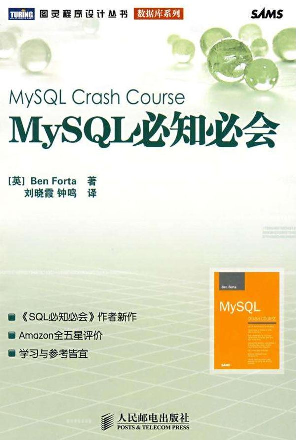

# 将<<Mysql必知必会>> 里面的sql 语句转为各种类型语句

目前已有 Django-ORM, Pandas

## SQL_To_Everything



- 以下全部 sql 语句基于 mysql 的一个命令行插件`mycli` 编写 ,所以,关键字都是小写,结尾也没有分号
- 以下所有 Django-ORM均在django 第三方库 `django-extensions` 的`shell_plus` 环境下编写
- 以下所有Pandas 语句都在`jupyter notebook`界面中编写测试

文件说明:

- ./img/SQL_To_Everything/creat_table_sql.sql		创建数据库文件
- ./img/SQL_To_Everything/data.sql                           插入具体数据文件
- ./img/SQL_To_Everything/models.py                       django 的模型文件
- ./img/SQL_To_Everything/dataframe_data.xlsx     pandas读取数据文件

Mysql 数据准备:

- 创建数据库
- `mysql -u root -p 目标库名 < XXX.sql`         将两个数据库文件写入

Django 数据准备

- 新建django项目,新建app应用,拷贝 models.py  文件

    - 也可以根据数据库生成新的models.py文件,使用指令`python3 manage.py inspectdb > models.py`

        这时,在manage.py 同级目录下会看见一个models.py 文件,使用其`覆盖` 应用目录下的models.py文件

- 将`settings.py`中的DATABASES  指向已存在的MySQL数据库

- 最后迁移数据库`python3 manage.py migrate`

Pandas 数据准备:

```python
import pandas as pd
import numpy as np
import pymysql
from sqlalchemy import create_engine

conn = create_engine(f'mysql+pymysql://root:密码@localhost:3306/库名', echo=True)

customers = pd.read_sql('select * from customers',conn)
orderitems = pd.read_sql('select * from orderitems', conn)
orders = pd.read_sql('select * from orders', conn)
productnotes = pd.read_sql('select * from productnotes', conn)
products = pd.read_sql('select * from products', conn)
vendors = pd.read_sql('select * from vendors', conn)

```

## 数据说明: 各表,各字段解释

| 表名           | 列名         | 说明                                                    |
| -------------- | ------------ | ------------------------------------------------------- |
| `vendors`      | vend_id      | 唯一的供应商ID (主键)                                   |
| 存储销售产品   | vend_name    | 供应商名                                                |
| 的供应商的信息 | vend_address | 供应商地址                                              |
|                | vend_city    | 供应商城市                                              |
|                | vend_state   | 供应商州                                                |
|                | vend_zip     | 供应商邮编                                              |
|                | vend_country | 供应商国家                                              |
|                |              |                                                         |
| `products`     | prod_id      | 唯一产品ID  (主键)                                      |
| 存储产品信息   | vend_id      | 供应商ID  (关联到`vendors`中的vend_id)                  |
|                | prod_name    | 产品名称                                                |
|                | prod_price   | 产品价格                                                |
|                | prod_desc    | 产品描述                                                |
|                |              |                                                         |
| `customers`    | cust_id      | 唯一的顾客ID  (主键)                                    |
| 存储所有顾客   | cust_name    | 顾客名                                                  |
| 的信息         | cust_address | 顾客的地址                                              |
|                | cust_city    | 顾客的城市                                              |
|                | cust_state   | 顾客的州                                                |
|                | cust_zip     | 顾客的邮编                                              |
|                | cust_country | 顾客的国家                                              |
|                | cust_contact | 顾客的联系名                                            |
|                | cust_email   | 顾客的邮件地址                                          |
|                |              |                                                         |
| `orders`       | order_num    | 唯一订单号  (主键)                                      |
| 存储客户订单   | order_date   | 订单日期                                                |
|                | cust_id      | 订单顾客  (关联到`customers`中的cust_id)                |
|                |              |                                                         |
| `orderitems`   | order_num    | 订单号  (关联到`orders`中的order_num)                   |
| 存储每个订单中 | order_item   | 订单物品号  (在某个订单中的顺序)(与order_num作复合主键) |
| 的实际物品     | prod_id      | 产品ID  (关联到`products`中的prod_id)                   |
|                | quantity     | 物品数量                                                |
|                | item_price   | 物品价格                                                |
|                |              |                                                         |
| `productnotes` | note_id      | 唯一注释ID  (主键)                                      |
| 存储与特定产品 | prod_id      | 产品ID  (关联到`products`中的prod_id)                   |
| 相关的注释     | note_date    | 增加注释的日期                                          |
|                | note_text    | 注释文本                                                |


## 4.检索数据

### 4.2 检索单列

```sql
# sql
select prod_name from products ijlIL
```

```python
# Django-ORM
Products.objects.values('prod_name')
```

```python
# pandas
products['prod_name']
```


### 4.3 检索多列

```sql
# sql
select prod_id,prod_price,prod_name from products
```

```python
# Django-ORM
Products.objects.values('prod_id','prod_price','prod_name')
```

```python
# pandas
products[['prod_id','prod_price','prod_name']]
```


### 4.4 检索所有列

```sql
# sql
select * from products
```

```python
# Django-ORM
Products.objects.values()
```

```python
# pandas
products
```


### 4.5 检索不同的行(去重)

```sql
# sql
select distinct vend_id from products
```

```python
# Django-ORM
Products.objects.values('vend_id').distinct()
```

```python
# pandas
products['vend_id'].drop_duplicates(keep='last')	# 对Series 去重

products.drop_duplicates(subset=['vend_id'], keep='last')['vend_id']	# 对DataFrame 去重
"""
参数解释:
    subset: 需要去重的列
    keep： 可选参数有三个：first、 last、 False， 默认值 first
        （1）first 表示： 保留第一次出现的重复行，删除后面的重复行。
        （2）last 表示： 删除重复项，保留最后一次出现。
        （3）False 表示： 删除所有重复项。
    inplace：默认为 False ，删除重复项后返回副本。True，直接在原数据上删除重复项。
    ignore_index: 默认为 False ,保留原有的index, True 则生成新的index
"""

```


### 4.6 限制结果

```sql
# sql
# 原生sql 是 limit
select prod_name from products limit 5
```

```python
# Django-ORM
# Django-ORM是 切片
Products.objects.values('prod_name')[:5]
```

```python
# pandas
products['prod_name'][:5]
```


## 5.排序数据

### 5.1 排序数据

```sql
# sql
select prod_name from products order by prod_name
```

```python
# Django-ORM
Products.objects.values('prod_name').order_by('prod_name')
```

```python
# pandas
products['prod_name'].sort_values()	# 对Series 按值排序

products.sort_values(['prod_name'])['prod_name']	# 对 DataFram 按值排序
```


### 5.2 按多个列排序

```sql
# sql
select prod_id,prod_price,prod_name from products order by prod_price,prod_name
```

```python
# Django-ORM
Products.objects.values('prod_id','prod_price','prod_name').order_by('prod_price','prod_name')
```

```python
# pandas
products.sort_values(['prod_price','prod_name'], ignore_index=True)[['prod_id','prod_price','prod_name']]
# ignore_index=True 重设索引 默认是不重设
```


### 5.3 指定排序方向

```sql
# sql
select prod_id,prod_price,prod_name from products order by prod_price desc
# 原生sql 是 默认是升序 `desc` 是降序 
```

```python
# Django-ORM
Products.objects.values('prod_id','prod_price','prod_name').order_by('-prod_price')
# Django-ORM是 列名前加 `-` 负号代表降序
```

```python
# pandas
products.sort_values(['prod_price'], ascending=False, ignore_index=True)[['prod_id','prod_price','prod_name']]
# ascending: 默认为True 升序
```


## 6.过滤数据

### 6.1 使用where子句

```sql
# sql
select prod_name,prod_price from products where prod_price=2.50
```

```python
# Django-ORM
Products.objects.filter(prod_price=2.50).values('prod_price','prod_name')
```

```python
# pandas
products.loc[products['prod_price']==2.50,['prod_name','prod_price']]
```


### 6.2.2 不匹配查询

```sql
# sql
# 原生sql 是 not
select vend_id,prod_name from products where vend_id != 1003
```

```python
# Django-ORM
# Django-ORM是 exclude
Products.objects.exclude(vend_id=1003).values('vend_id','prod_name')
```

```python
# pandas
products.loc[products['vend_id']!=1003,['vend_id','prod_name']]
```


### 6.2.3 范围值查询

```sql
# sql
# 原生sql 是 between
select prod_name,prod_price from products where prod_price between 5 and 10
```

```python
# Django-ORM
# Django-ORM是 __range
Products.objects.filter(prod_price__range=(5,10)).values('prod_price','prod_name')
```

```python
# pandas
# Series.between()
products.loc[products['prod_price'].between(5,10),['prod_name','prod_price']]
"""
left : scalar or list-like
            Left boundary.
right : scalar or list-like
            Right boundary.
inclusive : {"both", "neither", "left", "right"}	默认为 "both" 左闭右闭
            Include boundaries. Whether to set each bound as closed or open.
            .. versionchanged:: 1.3.0
"""
```


## 7.数据过滤

### 7.1.1 AND 操作符

```sql
# sql
select prod_id,prod_price,prod_name from products where vend_id=1003 and prod_price<=10
```

```python
# Django-ORM
Products.objects.filter(vend_id=1003,prod_price__lte=10).values('prod_id','prod_price','prod_name')
```

```python
# pandas
products.loc[(products['vend_id']==1003) & (products['prod_price']<=10),['prod_id','prod_price','prod_name']]
```


### 7.1.2 OR操作符

```sql
# sql
select prod_name,prod_price from products where vend_id=1002 or vend_id=1003
```

```python
# Django-ORM
Products.objects.filter(Q(vend_id=1002)|Q(vend_id=1003)).values('prod_price','prod_name')
```

```python
# pandas
products.loc[(products['vend_id']==1002) | (products['vend_id']==1003),['prod_price','prod_name']]
```


### 7.2 IN操作符

```sql
# sql
select prod_name,prod_price from products where vend_id in (1002,1003) order by prod_name
```

```python
# Django-ORM
Products.objects.filter(vend_id__in=(1002,1003)).values('prod_price','prod_name').order_by('prod_name')
```

```python
# pandas
products.loc[products['vend_id'].isin([1002,1003]),['prod_price','prod_name']].sort_values(['prod_name'])
```


### 7.3 NOT 操作符

```sql
# sql
# not in
select prod_name,prod_price from products where vend_id not in (1002,1003) order by prod_name
```

```sql
# Django-ORM
# Products.objects.exclude
Products.objects.exclude(vend_id__in=(1002,1003)).values('prod_price','prod_name').order_by('prod_name')
```

```python
# pandas
# pandas 没有not in 的语法糖, 但是将 isin 取反之后就是not in
products.loc[products['vend_id'].isin([1002,1003])==False,['prod_price','prod_name']].sort_values(['prod_name'])

# 或者在条件前加上 ~ ,代表取反
products.loc[~products['vend_id'].isin([1002, 1003]), ['prod_price', 'prod_name']].sort_values(['prod_name'])
```


## 8.用通配符进行过滤

### 8.1 LIKE 操作符

```sql
# sql
select prod_id,prod_name from products where prod_name like 'jet%'
```

```python
# Django-ORM
Products.objects.filter(prod_name__icontains='jet').values('prod_id','prod_name')

# 并不是完全等同
select prod_id,prod_name from products where prod_name like '%jet%'
```

```python
# pandas
# 可以使用正则表达式
products.loc[products['prod_name'].str.contains('(?i)jet')][['prod_id','prod_name']]
```


## 9.使用正则表达式进行搜索

### 9.2.1 基本字符匹配

```sql
# sql
select prod_name from products where prod_name regexp '1000'
```

```python
# Django-ORM
# Django-ORM 建议使用 `iregex` 不区分大小写
Products.objects.filter(prod_name__iregex=r'1000').values('prod_name')
```

```python
# pandas
products.loc[products['prod_name'].str.extract('(1000)',expand=False).notnull(),['prod_name']]
# 只有一个捕获组的情况下,expand 取 False
```


### 9.2.2 进行OR匹配

```sql
# sql
select prod_name from products where prod_name regexp '1000|2000' order by prod_name
```

```python
# Django-ORM
Products.objects.filter(prod_name__iregex=r'1000|2000').values('prod_name').order_by('prod_name')
```

```python
# pandas
products.loc[products['prod_name'].str.extract('(1000|2000)',expand=False).notnull(),['prod_name']].sort_values('prod_name')
```


9.X.X 略


## 10.创建计算字段

### 10.2 拼接字段

```sql
# sql
select concat(vend_name,' (',vend_country,')') as vend_title from vendors order by vend_name
```

```python
# Django-ORM

from django.db.models.functions import Concat
from django.db.models import Value

Vendors.objects.values(vend_title=Concat('vend_name',Value(' ('),'vend_country',Value(')'))).order_by('vend_name')
```

```python
# pandas
vendors['vend_name'].sort_values().str.cat(' (' + vendors['vend_country'] + ')')

# 因为要排序,所以写成这样,全部使用 + 拼接的话无法排序,就算先排好序再使用 + 拼接,顺序也会被还原,所以,只能再排好序的Series上使用 .str.cat(),如此才能保证排序
```


### 10.3 执行算数运算

检索订单号为20005中所有的物品,并汇总物品价格

```sql
# sql
select prod_id,quantity,item_price,quantity*item_price as expanded_price from orderitems where order_num=20005
```

```python
# Django-ORM
Orderitems.objects.filter(order_num=20005).values('prod_id','quantity','item_price',expanded_price=F('quantity')*F('item_price'))
```

```python
# pandas
df = orderitems.loc[orderitems['order_num']==20005,['prod_id','quantity','item_price']]
df['expanded_price'] = df['quantity'] * df['item_price']
df
```


## 11.使用数据处理函数

Django-ORM的数据处理都在 `from django.db.models.functions import XXX` 

### 11.2.1 将文本转换为大写

```sql
# sql
select vend_name,upper(vend_name) as vend_name_upcase from vendors order by vend_name
```

```python
# Django-ORM
Vendors.objects.values('vend_name',vend_name_upcase=Upper('vend_name')).order_by('vend_name')
```

```python
# pandas
df = vendors.loc[:, ['vend_name']]
df['vend_name_upcase'] = df['vend_name'].str.upper()
df
```


### 11.2.2 时间函数

检索出2005年9月下的所有订单

```sql
# sql
select cust_id,order_num from orders where year(order_date)=2005 and month(order_date)=9
```

```python
# Django-ORM
Orders.objects.filter(order_date__year=2005,order_date__month=9).values('cust_id','order_num')
```

```python
# pandas
# 网上的攻略都是将日期列转换为dataframe的index再操作,不知为何
s = pd.to_datetime(orders['order_date'])
orders.loc[(s.dt.year==2005)&(s.dt.month==9),['cust_id','order_num']]
```


## 12.聚集函数

### 12.1.1 AVG()函数

查询prodcts表中所有产品的平均价格

```sql
# sql
select AVG(prod_price) from products
```

```python
# Django-ORM
Products.objects.aggregate(Avg('prod_price'))
```

```python
# pandas
products['prod_price'].mean()

# 或者
products['prod_price'].agg({'prod_price':'mean'})
```


### 12.1.2 COUNT()函数

查询customers中客户的总数

```sql
# sql
select count(*) as num_cust from customers
```

```python
# Django-ORM
Customers.objects.aggregate(num_cust=Count('cust_id'))
```

```python
# pandas
customers.shape[0]

# 或者
customers['cust_id'].count()
```


12.1.3 MAX()函数	(略)

12.1.4 MIN()函数	 (略)

12.1.5 SUM()函数	 (略)

### 12.2 聚集不同的值

查询特定供应商提供的产品的平均价格,只考虑各个不同的价格

```sql
# sql
select avg(distinct prod_price) as avg_price from products where vend_id=1003
```

```python
# Django-ORM
# 给聚集函数指定 distinct=True 的参数
Products.objects.filter(vend_id=1003).aggregate(avg_price=Avg('prod_price',distinct=True))
```

```python
# pandas
products.loc[products['vend_id']==1003,['prod_price']].drop_duplicates(subset=['prod_price'], keep='last').mean()
```


### 12.3 组合聚集函数

```sql
# sql
select count(*) as num_items,min(prod_price) as price_min,max(prod_price) as price_max,avg(prod_price) as price_avg from products

```

```python
# Django-ORM
Products.objects.aggregate(num_items=Count('prod_id'),price_min=Min('prod_price'),price_max=Max('prod_price'),price_avg=Avg('prod_price'))

```

```python
# pandas
products.agg(num_items=('prod_id', 'count'), price_min=('prod_price', 'min'), price_max=('prod_price', 'max'), price_mean=('prod_price', 'mean')).T.fillna(method='bfill')[:1]

# 或者
pd.DataFrame([[products.shape[0],products['prod_price'].min(),products['prod_price'].max(),products['prod_price'].mean()]],columns=['num_items','price_min','price_max','price_avg'])
```


## 13.分组数据

### 13.2创建分组

查询每个供应商的产品数量

```sql
# sql
select vend_id,count(*) as num_prods from products group by vend_id
```

```python
# Django-ORM
Products.objects.values('vend_id').annotate(num_prods=Count('vend_id'))
```

```python
# pandas
products.groupby(['vend_id'])['prod_id'].count()
```


### 13.3 过滤分组

```sql
# sql
select cust_id,count(*) as orders from orders group by cust_id having count(*) >=2
```

```python
# Django-ORM
Orders.objects.values('cust_id').annotate(orders=Count('cust_id')).filter(orders__gte=2)
```

```python
# pandas
s = orders.groupby(['cust_id'])['order_num'].count()
s.loc[s>=2]
```


### 13.3  同时使用 where 和 having

查询具有2(含)个以上,价格为10(含)以上的产品的供应商

```sql
# sql
select vend_id,count(*) as num_prods from products where prod_price>=10 group by vend_id having count(*)>=2
```

```python
# Django-ORM
Products.objects.filter(prod_price__gte=10).values('vend_id').annotate(orders=Count('vend_id')).filter(orders__gte=2)
```

```python
# pandas
s = products.loc[products['prod_price']>=10].groupby(['vend_id']).count()['prod_id']
s.loc[s>=2]
```


### 13.4 分组和排序

检索总计订单价格>=50的订单,的订单号和总价,并按总计价格排序

```sql
# sql
select order_num,sum(quantity*item_price) as ordertotal from orderitems group by order_num having sum(quantity*item_price)>=50 order by ordertotal
```

```python
# Django-ORM
Orderitems.objects.values('order_num').annotate(ordertotal=Sum(F('quantity')*F('item_price'))).filter(ordertotal__gte=50).order_by('ordertotal')
```

```python
# pandas
df = orderitems.loc[:,['order_num']]
df['ordertotal'] = orderitems['quantity'] * orderitems['item_price']
df2 = df.groupby(['order_num']).sum()
df2.loc[df2['ordertotal']>=50].sort_values(['ordertotal'])

# 还有一种对分组后,聚合前的数据进行过滤的方式
# 问题关键在于使用这种过滤方式后(df.groupby().filter()) 返回的是一个df,而不是分组数据...不能直接对其聚合,就很迷,所以暂时采用上面那种方式来实现
# 错误示例如下:
df.groupby(['order_num']).filter(lambda x: x['ordertotal'].sum() >= 50)

```


## 14.使用子查询

### 14.2 利用子查询进行过滤

查询订购物品 TNT2 的所有客户

```sql
# sql
select cust_name,cust_contact from customers where cust_id in (select cust_id from orders where order_num in (select order_num from orderitems where prod_id = 'tnt2'))
```

```python
# Django-ORM
Customers.objects.filter(cust_id__in=Orders.objects.filter(order_num__in=Orderitems.objects.filter(prod_id='tnt2').values('order_num')).values('cust_id')).values('cust_name','cust_contact')
```

```python
# pandas
customers.loc[customers['cust_id'].isin(orders.loc[orders['order_num'].isin(orderitems.loc[orderitems['prod_id'] == 'TNT2', ['order_num']]['order_num']), ['cust_id']]['cust_id']), ['cust_name', 'cust_contact']]
```


### 14.3 作为计算字段使用子查询

对每个客户的订单进行计数

```sql
# sql
select cust_name,cust_state,(select count(*) from orders where orders.cust_id=customers.cust_id) as orders from customers order by cust_name
```

```python
# Django-ORM
# 写不出来...
```

```python
# pandas
# 实际也是使用连接来做的,并非子查询的思想

df2 = orders.groupby('cust_id')['order_num'].count().reset_index(name='count')
# 聚合后,cust_id 变成了索引,将它还原成一列
df3 = pd.merge(left=customers,right=df2,on=['cust_id'],how='left')[['cust_name','cust_state','count']].sort_values(['cust_name']).fillna(0)
# 合并数据,并将缺失值改为0
df3['count'] = df3['count'].astype('int')
# 因为缺失值的存在,合并数据时,该字段变成了float类型,将它改回来
df3
```


## 15.联结表

### 15.2 创建联结

所要查询的列不在一个表中

```sql
# sql 使用等值联结
select vend_name,prod_name,prod_price from vendors,products where vendors.vend_id=products.vend_id order by vend_name,prod_name
```

```python
# Django-ORM
Products.objects.all().values('prod_name','prod_price',vend_name=F('vend_id__vend_name')).order_by('vend_name','prod_name')

# 该语句只是结果达到与sql相同,但是使用 connection.queries[-1]['sql'] 查看原生sql 发现,使用的是 FROM `products` INNER JOIN `vendors` ON ... 它使用的是内联结 

# 内联结和等值联结在sql层面只是写法不同,内部是相同的

```

```python
# pandas
pd.merge(left=vendors,right=products,on='vend_id',how='inner')[['vend_name','prod_name','prod_price']].sort_values(['vend_name','prod_name'])
```


### 15.2.2 内部联结

```sql
# sql 内联结
select vend_name,prod_name,prod_price from vendors inner join products on vendors.vend_id=products.vend_id
```

```python
# Django-ORM
Products.objects.all().values('prod_name','prod_price',vend_name=F('vend_id__vend_name'))
```

```python
# pandas
pd.merge(left=vendors,right=products,on='vend_id',how='inner')[['vend_name','prod_name','prod_price']]
```


### 15.2.3 联结多个表

查询编号为20005的订单中的物品

```sql
# sql
select prod_name,vend_name,prod_price,quantity from orderitems,products,vendors where products.vend_id=vendors.vend_id and orderitems.prod_id=products.prod_id and order_num=20005
```

```python
# Django-ORM
Orderitems.objects.filter(order_num=20005).values('quantity',prod_name=F('prod_id__prod_name'),prod_price=F('prod_id__prod_price'),vend_name=F('prod_id__vend_id__vend_name'))

# 该语句只是结果达到与sql相同,但是使用 connection.queries[-1]['sql'] 查看原生sql 发现 
# 'SELECT `orderitems`.`quantity`, `products`.`prod_name` AS `prod_name`, `products`.`prod_price` AS `prod_price`, `vendors`.`vend_name` AS `vend_name` FROM `orderitems` INNER JOIN `products` ON (`orderitems`.`prod_id` = `products`.`prod_id`) INNER JOIN `vendors` ON (`products`.`vend_id` = `vendors`.`vend_id`) WHERE `orderitems`.`order_num` = 20005 LIMIT 21'

# 说明: 要想采用 INNER JOIN 的方式进行查询,Django-ORM必须是从子表向主表查询,也就是正向查询

```

```python
# pandas
df = pd.merge(left=pd.merge(left=vendors, right=products, on='vend_id', how='inner'), right=orderitems, on=['prod_id'], how='inner')
df.loc[df['order_num']==20005,['prod_name', 'vend_name', 'prod_price', 'quantity']]
```


### 15.2.3 第二示例

查询订购物品 TNT2 的所有客户

```sql
# sql 第14章的例子 将子查询变更为联结查询
select cust_name,cust_contact from customers,orders,orderitems where customers.cust_id=orders.cust_id and orderitems.order_num=orders.order_num and prod_id='tnt2'
```

```python
# Django-ORM
Orderitems.objects.filter(prod_id='tnt2').values(cust_name=F('order_num__cust_id__cust_name'),cust_contact=F('order_num__cust_id__cust_contact'))
```

```python
# pandas
df = pd.merge(left=pd.merge(left=customers, right=orders, on=['cust_id'], how='inner'), right=orderitems, on=['order_num'], how='inner')
df.loc[df['prod_id'] == 'TNT2', ['cust_name', 'cust_contact']]
```


## 16.创建高级联结

### 16.1 使用表别名

```sql
# sql
select cust_name,cust_contact from customers as c,orders as o,orderitems as oi where c.cust_id=o.cust_id and oi.order_num=o.order_num and prod_id='tnt2'
```

```python
# Django-ORM
# Django-Django-ORM 无需使用表别名
```

```python
# pandas
# pandas 无需使用表别名
```


### 16.2.1 自联结

假如你发现某物品(其ID为DTNTR)存在问题,因此想知道生产该物品的供应商旗下的其它物品是否也存在这些问题

- 子查询

```sql
# sql 子查询
select prod_id,prod_name from products where vend_id=(select vend_id from products where prod_id='dtntr')
```

```python
# Django-Django-ORM子查询
Products.objects.filter(vend_id=Products.objects.get(prod_id='dtntr').vend_id).values('prod_id','prod_name')

```

```python
# pandas
products.loc[products['vend_id'] == products.loc[products['prod_id'] == 'DTNTR']['vend_id'].values[0], ['prod_id', 'prod_name']]
```


- 自联结

```sql
# sql 自联结
select p1.prod_name,p1.prod_id from products as p1,products as p2 where p1.vend_id=p2.vend_id and p2.prod_id='DTNTR'
```

```python
# Django-ORM
# 写不出来...
```

```python
# pandas
pd.merge(left=products,right=products.loc[products['prod_id']=='DTNTR',['vend_id']],on=['vend_id'])[['prod_id', 'prod_name']]
```


### 16.2.3 外部联结

检索客户和他们的订单,包括没有订单的客户

```sql
# sql
select customers.cust_id,order_num from customers left outer join orders on customers.cust_id=orders.cust_id
```

```python
# Django-ORM
Customers.objects.all().values('cust_id',order_num=F('orders__order_num'))

# Django-Django-ORM的反向查询就是外部联结
```

```python
# pandas
# 作为合并条件的列,合并之后只会留下一列,取列时不必加后缀
pd.merge(left=customers, right=orders, on=['cust_id'], how='left')[['cust_id', 'order_num']]
```


### 16.3 使用带聚集函数的联结

检索所有客户及每个客户所下的订单数

```sql
# sql
select customers.cust_name,customers.cust_id,count(orders.order_num) as num_ord from customers inner join orders on customers.cust_id=orders.cust_id group by customers.cust_id
```

```python
# Django-ORM
Orders.objects.all().values('cust_id').annotate(num_ord=Count('order_num')).values('num_ord','cust_id',cust_name=F('cust_id__cust_name'))
```

```python
# pandas
pd.merge(left=customers, right=orders, on=['cust_id'], how='inner')[['cust_id', 'order_num', 'cust_name']].groupby(['cust_id', 'cust_name'], as_index=False).agg({'order_num': 'count'}).rename(columns={'order_num':'count'})
```


包含没有下订单的客户

```sql
# sql
select customers.cust_name,customers.cust_id,count(orders.order_num)as num_ord from customers left outer join orders on customers.cust_id=orders.cust_id group by customers.cust_id
```

```python
# Django-ORM
Customers.objects.values('cust_id').annotate(num_ord=Count('orders__order_num')).values('cust_id','cust_name','num_ord')
```

```python
# pandas
pd.merge(left=customers, right=orders, on=['cust_id'], how='left')[['cust_id', 'order_num', 'cust_name']].groupby(['cust_id', 'cust_name'], as_index=False).agg({'order_num': 'count'}).rename(columns={'order_num':'count'})
```


## 17.组合查询

### 17.2.1 使用 UNION

查询价格小于等于5的所有商品,并且包括供应商1001,1002的所有商品(不考虑价格)

```sql
# sql
select vend_id,prod_id,prod_price from products where prod_price<=5 union select vend_id,prod_id,prod_price from products where vend_id in (1001,1002)
```

```python
# Django-ORM
Products.objects.filter(prod_price__lte=5).values('vend_id','prod_id','prod_price').union(Products.objects.filter(vend_id__in=(1001,1002)).values('vend_id','prod_id','prod_price'))

# 也可以省略第二句的values()
Products.objects.filter(prod_price__lte=5).values('vend_id','prod_id','prod_price').union(Products.objects.filter(vend_id__in=(1001,1002)))
```

```python
# pandas
pd.concat((products.loc[products['prod_price'] <= 5, ['vend_id', 'prod_id', 'prod_price']], products.loc[products['vend_id'].isin((1001, 1002)), ['vend_id', 'prod_id', 'prod_price']]), join='inner').drop_duplicates(subset=['prod_id'], ignore_index=True)
```


### 17.2.3 包含重复的行

```sql
# sql
select vend_id,prod_id,prod_price from products where prod_price<=5 union all select vend_id,prod_id,prod_price from products where vend_id in (1001,1002)
```

```python
# Django-Django-ORM指定参数 union(..., all=True)
Products.objects.filter(prod_price__lte=5).values('vend_id','prod_id','prod_price').union(Products.objects.filter(vend_id__in=(1001,1002)),all=True)
```

```python
pd.concat((products.loc[products['prod_price'] <= 5, ['vend_id', 'prod_id', 'prod_price']], products.loc[products['vend_id'].isin((1001, 1002)), ['vend_id', 'prod_id', 'prod_price']]), join='inner', ignore_index=True)
```


### 17.2.4 对组合查询结果排序

在使用UNION组合查询时,只能使用一条ORDER BY 子句,它必须出现在最后一条SELECT语句之后,对于结果集,不存在用一种方式排序一部分,用另一种方式排序另一部分的情况

```sql
# sql
select vend_id,prod_id,prod_price from products where prod_price<=5 union select vend_id,prod_id,prod_price from products where vend_id in (1001,1002) order by vend_id,prod_price
```

```python
# Django-ORM
Products.objects.filter(prod_price__lte=5).values('vend_id','prod_id','prod_price').union(Products.objects.filter(vend_id__in=(1001,1002))).order_by('vend_id','prod_price')
```

```python
# pandas
pd.concat((products.loc[products['prod_price'] <= 5, ['vend_id', 'prod_id', 'prod_price']], products.loc[products['vend_id'].isin((1001, 1002)), ['vend_id', 'prod_id', 'prod_price']]), join='inner').drop_duplicates(subset=['prod_id']).sort_values(['vend_id', 'prod_price'], ignore_index=True)
```


18.全文本搜索

19.插入数据

20.更新和删除数据

21.创建和操纵表

22.使用视图

23.使用存储过程


