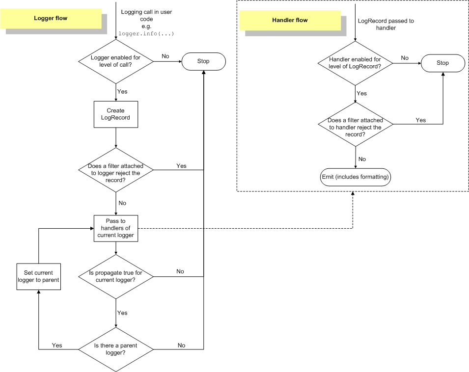

[TOC]


# 日志模块极简介绍

下面两篇官方文档一定要阅读，随时参考

[logging --- Python 的日志记录工具 — Python 3.10.0 文档](https://docs.python.org/zh-cn/3.10/library/logging.html#module-logging)

[logging | Django 日志 | Django 3.2 文档](https://docs.djangoproject.com/zh-hans/3.2/topics/logging/)

<font color='red'>记录器和处理器中的日志事件信息流程如下图所示：</font>

	

翻译如下：

1.	判断日志的等级是否大于Logger对象的等级，如果大于，则往下执行，否则，流程结束。
2.	产生日志。第一步，判断是否有异常，如果有，则添加异常信息。第二步，处理日志记录方法(如debug，info等)中的占位符，即一般的字符串格式化处理。
3.	使用注册到Logger对象中的Filters进行过滤。如果有多个过滤器，则依次过滤；只要有一个过滤器返回假，则过滤结束，且该日志信息将丢弃，不再处理，而处理流程也至此结束。否则，处理流程往下执行。
4.	在当前Logger对象中查找Handlers，如果找不到任何Handler，则往上到该Logger对象的父Logger中查找；如果找到一个或多个Handler，则依次用Handler来处理日志信息。但在每个Handler处理日志信息过程中，会首先判断日志信息的等级是否大于该Handler的等级，如果大于，则往下执行(由Logger对象进入Handler对象中)，否则，处理流程结束。
5.	执行Handler对象中的filter方法，该方法会依次执行注册到该Handler对象中的Filter。如果有一个Filter判断该日志信息为假，则此后的所有Filter都不再执行，而直接将该日志信息丢弃，处理流程结束。
6.	使用Formatter类格式化最终的输出结果。 注：Formatter同上述第2步的字符串格式化不同，它会添加额外的信息，比如日志产生的时间，产生日志的源代码所在的源文件的路径等等。
7.	真正地输出日志信息(到网络，文件，终端，邮件等)。至于输出到哪个目的地，由Handler的种类来决定。

参考：https://blog.csdn.net/lingdanfeng/article/details/89669987

# 通用参数传递方式

```python
# 在调用时将参数直接格式化成字符串当作日志信息
logger = logging.getLogger()

def ceshi(request):
    logger.info(f'{request.method} {request.path_info} {__name__}')	# 无敌是多么……
```

```python
# 在调用时传入 extra 参数，但是需要在settings.py中配置格式化器,并绑定到对应的处理器和记录器上

# settings.py
'formatters': {
    'ceshi': {
            'format': '{new_data} "msg": {message}',
            'style': '{',
        },
}
    
# views.py
logger = logging.getLogger('ceshi')

def ceshi(request):
    logger.error('123456', extra={'new_data': 654321})
```


# 基于线程的djagno日志参数传递

## 解决思路：

此方式为借用django的中间件，在路由前将requst里的一部分参数传入线程局部变量threading.local()，然后再借助日志的过滤器filters获取线程变量threading.local()里面的数据，并把这些数据传入LogRecord对象，最后供日志的格式器formatters解析。

## 注册中间件

在项目目录下新建 middleware 目录，在其中创建 my_middleware.py 文件

```python
# middleware/my_middleware.py
import threading
import logging
from django.utils.deprecation import MiddlewareMixin

# 创建local对象
local = threading.local()

# 编写中间件
class OpLogs(MiddlewareMixin):
    """
      将request的信息记录在当前的请求线程上,
    次方式只适用在 基于线程并发的模式上，不适用于协程 async
    """

    def process_request(self, request):
        # 请求url
        local.path = request.path_info

        # 请求类型
        local.method = request.method
        

        # 请求IP
        # x_forwarded_for = request.META.get('HTTP_X_FORWARDED_FOR')
        # if x_forwarded_for:
        #     # 如果有代理，获取真实IP
        #     re_ip = x_forwarded_for.split(",")[0]
        # else:
        #     re_ip = request.META.get('REMOTE_ADDR')
        
        # 请求IP python >= 3.8
        local.ip = x_forwarded_for.split(",")[0] if (x_forwarded_for := request.META.get('HTTP_X_FORWARDED_FOR')) else request.META.get('REMOTE_ADDR')
```

在 settings.py ,找到 MIDDLEWARE 注册该中间件

```python
MIDDLEWARE = [
    'django.middleware.security.SecurityMiddleware',
    'django.contrib.sessions.middleware.SessionMiddleware',
    'django.middleware.common.CommonMiddleware',
    'django.middleware.csrf.CsrfViewMiddleware',
    'django.contrib.auth.middleware.AuthenticationMiddleware',
    'django.contrib.messages.middleware.MessageMiddleware',
    'django.middleware.clickjacking.XFrameOptionsMiddleware',
    # 注册中间件 路径.类名
    'middleware.my_middleware.OpLogs',
]
```

## 编写过滤器 filters 的代码

还是在刚才的中间件的文件中，继续添加 filters 的代码

```python
# middleware/my_middleware.py

# class OpLogs(MiddlewareMixin):……


class RequestLogFilter(logging.Filter):
    """
        日志过滤器，将当前请求线程的request信息保存到日志的record上下文
        record带有formater需要的信息。
    """

    def filter(self, record):
        record.ip = getattr(local, 'ip', "None")
        record.path = getattr(local, 'path', "None")
        record.method = getattr(local, 'method', "None")
        return True
```

## 配置文件

最后需要在 setting.py 中写入配置：

```python
# setting.py

# 日志配置
LOGGING = {
    'version': 1,
    'disable_existing_loggers': False,

    # 记录器
    'loggers': {
        # 记录器名字，随意，在视图函数调用时需要用到，可以创建多个记录器
        'my_loger': {
            'handlers': ['console', 'file'],  # 指定处理器的名字，指定多个时，消息会被重复处理，就比如：一个错误消息，需要写入日志，并且发送一封邮件，并且打印输出，并且……
            'level': 'INFO',
        },
    },

    # 处理器
    'handlers': {
        # 处理器名字，随意，与上面【记录器】所指定的处理器名字对应，一个处理器负责一种处理消息的方式，比如：打印消息，发送邮件，写入文件，…… 其方式由属性 'class' 决定，本文附录带有【处理器class表】
        'console': {
            'level': 'DEBUG',
            'class': 'logging.StreamHandler',
            'formatter': 'standard',		# 指定一个格式器
            'filters': ['request_info'],  	# 指定一个 过滤器 没有就删除该行
        },
        'file': {
            'level': 'WARNING',
            'class': 'logging.FileHandler',
            'filename': f'{BASE_DIR}/logs/INFO.log',  # 配置文件路径，一定要有写入权限
            'formatter': 'custom',  		# 指定一个格式器
            'filters': ['request_info'],  	# 指定一个 过滤器
        },

    },

    # 格式器
    'formatters': {
        'standard': {
            'format': '{asctime}  {levelname}  {path}  "msg": {message}',
            'style': '{',	# 建议采用此种style的格式器，写法与python3.6之后的f-string语法完全一致
        },
        # 日志格式
        'custom': {
            # 该格式化中包含有过滤器record新增的字段
            'format': '[{asctime}] [{levelname}] "{method}: {path}" "msg": {message} {ip}',
            'style': '{',
        },
    },

    # 过滤器
    'filters': {
        # 注册之前的写好的过滤器，与注册中间件的写法类似， 没有编写过滤器就删除这行
        'request_info': {'()': 'middleware.my_middleware.RequestLogFilter'} 
    }
}
```

[参考： Django日志中要包括主机名、客户端IP_无痕的博客-CSDN博客](https://blog.csdn.net/leiwuhen92/article/details/118759096)


# 附录

## [处理器 class 表](https://docs.python.org/zh-cn/3.10/library/logging.handlers.html#module-logging.handlers)

| [StreamHandler](https://docs.python.org/zh-cn/3.10/library/logging.handlers.html#streamhandler) | 它可将日志记录输出发送到数据流例如 sys.stdout, sys.stderr 或任何文件类对象（或者更精确地说，任何支持 write()和 flush() 方法的对象）。 |
| ------------------------------------------------------------ | ------------------------------------------------------------ |
| [FileHandler](https://docs.python.org/zh-cn/3.10/library/logging.handlers.html#filehandler) | 它可将日志记录输出到磁盘文件中。                             |
| [NullHandler](https://docs.python.org/zh-cn/3.10/library/logging.handlers.html#nullhandler) | 它不执行任何格式化或输出。 它实际上是一个供库开发者使用的‘无操作’处理程序。 |
|                                                              |                                                              |
|                                                              |                                                              |
| [WatchedFileHandler](https://docs.python.org/zh-cn/3.10/library/logging.handlers.html#watchedfilehandler) | 用于监视它所写入日志记录的文件。 如果文件发生变化，它会被关闭并使用文件名重新打开。 |
| [BaseRotatingHandler](https://docs.python.org/zh-cn/3.10/library/logging.handlers.html#baserotatinghandler) | 它是轮换文件处理程序类 [`RotatingFileHandler`](https://docs.python.org/zh-cn/3.10/library/logging.handlers.html#logging.handlers.RotatingFileHandler) 和 [`TimedRotatingFileHandler`](https://docs.python.org/zh-cn/3.10/library/logging.handlers.html#logging.handlers.TimedRotatingFileHandler) 的基类。 你不需要实例化此类，但它具有你可能需要重载的属性和方法。 |
| [RotatingFileHandler](https://docs.python.org/zh-cn/3.10/library/logging.handlers.html#rotatingfilehandler) | 它支持磁盘日志文件的轮换。                                   |
| [TimedRotatingFileHandler](https://docs.python.org/zh-cn/3.10/library/logging.handlers.html#timedrotatingfilehandler) | 它支持基于特定时间间隔的磁盘日志文件轮换。                   |
|                                                              |                                                              |
|                                                              |                                                              |
| [SocketHandler](https://docs.python.org/zh-cn/3.10/library/logging.handlers.html#sockethandler) | 它会将日志记录输出发送到网络套接字。 基类所使用的是 TCP 套接字。 |
| [DatagramHandler](https://docs.python.org/zh-cn/3.10/library/logging.handlers.html#datagramhandler) | 支持通过 UDP 套接字发送日志记录消息。                        |
| [SysLogHandler](https://docs.python.org/zh-cn/3.10/library/logging.handlers.html#sysloghandler) | 它支持将日志记录消息发送到远程或本地 Unix syslog。           |
| [NTEventLogHandler](https://docs.python.org/zh-cn/3.10/library/logging.handlers.html#nteventloghandler) | 它支持将日志记录消息发送到本地 Windows NT, Windows 2000 或 Windows XP 事件日志。 在你使用它之前，你需要安装 Mark Hammond 的 Python Win32 扩展。 |
| [SMTPHandler](https://docs.python.org/zh-cn/3.10/library/logging.handlers.html#smtphandler) | 它支持将日志记录消息通过 SMTP 发送到一个电子邮件地址。       |
| [HTTPHandler](https://docs.python.org/zh-cn/3.10/library/logging.handlers.html#httphandler) | 它支持使用 `GET` 或 `POST` 语义将日志记录消息发送到 Web 服务器。 |
| [django.utils.log.AdminEmailHandler](https://docs.djangoproject.com/zh-hans/3.2/topics/logging/#id4) | Django 还提供的日志处理程序。该处理程序对收到的每条日志消息都会向站点 [`ADMINS`](https://docs.djangoproject.com/zh-hans/3.2/ref/settings/#std:setting-ADMINS) 发送一封邮件。 |
| [QueueHandler](https://docs.python.org/zh-cn/3.10/library/logging.handlers.html#queuehandler) | 它支持将日志记录消息发送到一个队列，例如在 [`queue`](https://docs.python.org/zh-cn/3.10/library/queue.html#module-queue) 或 [`multiprocessing`](https://docs.python.org/zh-cn/3.10/library/multiprocessing.html#module-multiprocessing) 模块中实现的队列。 |
| [QueueListener](https://docs.python.org/zh-cn/3.10/library/logging.handlers.html#queuelistener) | 它支持从一个队列接收日志记录消息                             |
|                                                              |                                                              |
| [MemoryHandler](https://docs.python.org/zh-cn/3.10/library/logging.handlers.html#memoryhandler) | 它支持在内存中缓冲日志记录，并定期将其刷新到 *target* 处理程序中。 刷新会在缓冲区满的时候，或是在遇到特定或更高严重程度事件的时候发生。 |


## [LogRecord 属性表](https://docs.python.org/zh-cn/3.10/library/logging.html#logrecord-attributes)

| 属性名称        | 格式                         | 描述                                                         |
| :-------------- | :--------------------------- | :----------------------------------------------------------- |
| args            | 此属性不需要用户进行格式化。 | 合并到 `msg` 以产生 `message` 的包含参数的元组，或是其中的值将被用于合并的字典（当只有一个参数且其类型为字典时）。 |
| asctime         | `%(asctime)s`                | 表示 [`LogRecord`](https://docs.python.org/zh-cn/3.10/library/logging.html#logging.LogRecord) 何时被创建的供人查看时间值。 默认形式为 '2003-07-08 16:49:45,896' （逗号之后的数字为时间的毫秒部分）。 |
| created         | `%(created)f`                | [`LogRecord`](https://docs.python.org/zh-cn/3.10/library/logging.html#logging.LogRecord) 被创建的时间（即 [`time.time()`](https://docs.python.org/zh-cn/3.10/library/time.html#time.time) 的返回值）。 |
| exc_info        | 此属性不需要用户进行格式化。 | 异常元组（例如 `sys.exc_info`）或者如未发生异常则为 `None`。 |
| filename        | `%(filename)s`               | `pathname` 的文件名部分。                                    |
| funcName        | `%(funcName)s`               | 函数名包括调用日志记录.                                      |
| levelname       | `%(levelname)s`              | 消息文本记录级别（`'DEBUG'`，`'INFO'`，`'WARNING'`，`'ERROR'`，`'CRITICAL'`）。 |
| levelno         | `%(levelno)s`                | 消息数字的记录级别 (`DEBUG`, `INFO`, `WARNING`, `ERROR`, `CRITICAL`). |
| lineno          | `%(lineno)d`                 | 发出日志记录调用所在的源行号（如果可用）。                   |
| message         | `%(message)s`                | 记入日志的消息，即 `msg % args` 的结果。 这是在发起调用 [`Formatter.format()`](https://docs.python.org/zh-cn/3.10/library/logging.html#logging.Formatter.format) 时设置的。 |
| module          | `%(module)s`                 | 模块 (`filename` 的名称部分)。                               |
| msecs           | `%(msecs)d`                  | [`LogRecord`](https://docs.python.org/zh-cn/3.10/library/logging.html#logging.LogRecord) 被创建的时间的毫秒部分。 |
| msg             | 此属性不需要用户进行格式化。 | 在原始日志记录调用中传入的格式字符串。 与 `args` 合并以产生 `message`，或是一个任意对象 (参见 [使用任意对象作为消息](https://docs.python.org/zh-cn/3.10/howto/logging.html#arbitrary-object-messages))。 |
| name            | `%(name)s`                   | 用于记录调用的日志记录器名称。                               |
| pathname        | `%(pathname)s`               | 发出日志记录调用的源文件的完整路径名（如果可用）。           |
| process         | `%(process)d`                | 进程ID（如果可用）                                           |
| processName     | `%(processName)s`            | 进程名（如果可用）                                           |
| relativeCreated | `%(relativeCreated)d`        | 以毫秒数表示的 LogRecord 被创建的时间，即相对于 logging 模块被加载时间的差值。 |
| stack_info      | 此属性不需要用户进行格式化。 | 当前线程中从堆栈底部起向上直到包括日志记录调用并引发创建当前记录堆栈帧创建的堆栈帧信息（如果可用）。 |
| thread          | `%(thread)d`                 | 线程ID（如果可用）                                           |
| threadName      | `%(threadName)s`             | 线程名（如果可用）                                           |

*在 3.1 版更改:* 添加了 *processName*

# 待更新 基于协程模式的参数传递

