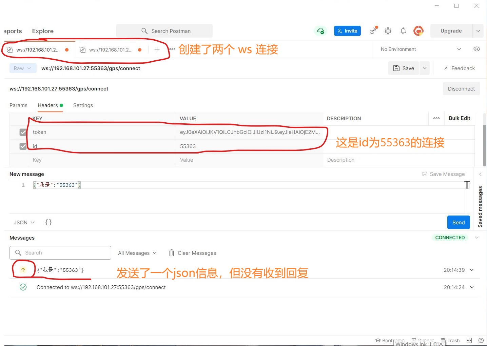
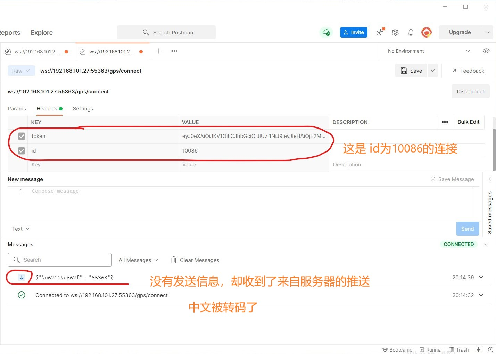

## 测试版本：

python	3.8

djnago     3.2

channels	3.0


## 需求

向channels的小组内某（些）个特定成员推送信息，而不是向组内所有人员群发

## 实现原理

websocket 三件套（scope, receive, send），其中`send`是一个**已经绑定客户端的信息发送函数**，我们只需要建立一个类似这样的字典>>> `send_dict = {'uid':send}`，就可以向任意一个特定的客户端推送信息，方式如同：`send_dict['uid']({'type': 'websocket.send', 'text': json.dumps(Object)})`

## 实现方式

在views中具体处理websocket的方法里

```python
# views.py
from channels.generic.websocket import AsyncWebsocketConsumer


send_dict = {}


class Connect(AsyncWebsocketConsumer):
    async def connect(self):
        # 想办法获取该客户端的唯一身份标识，比如 UID
        uid = XXXX
        self.uid = uid
        # 获取客户端将要加入的分组名称
        group_name = XXXX
        self.room_group_name = f'channel_{group_name}'
        # Join room group
        await self.channel_layer.group_add(self.room_group_name, self.channel_name)
        # 将该客户端的信息发送函数与客户端的唯一身份标识绑定，保存至自定义的字典中
        try:
            send_dict[self.room_group_name][self.uid] = self.send
        except KeyError:
            send_dict[self.room_group_name] = {}
            send_dict[self.room_group_name][self.uid] = self.send
        print('建立连接')
		# 建立连接
        await self.accept()
     
    async def disconnect(self, close_code):
        # 删除 send_dict 中对应的信息
        del send_dict[self.room_group_name][self.uid]
        # Leave room group
        await self.channel_layer.group_discard(self.room_group_name, self.channel_name)
        print("连接关闭")
        await self.close(close_code)
        
    async def receive(self, text_data=None, byte_text_data=None):
        try:
            text_data_json = json.loads(text_data)
        except Exception as e:
            print('数据无法被json格式化', e)
            await self.disconnect(400)
        else:
            # 获取将要推送信息的目标身份标识，调用保存在 send_dict中的信息发送函数
            target_uid = XXXX
            await send_dict[self.room_group_name][target_uid](text_data=json.dumps(text_data_json))
```

## 效果展示

发送：



接收：




## 后记

官方没有提供向小组内特定成员推送信息的功能，不是说明官方想的不周到。当我们感觉需要这样的功能时，反而应该想一想，是否还有其它更好的方式去实现业务上的需求，不必非要使用这样的功能。

我就是在完成了这个功能后，才发现原本的业务需求有更好的解决方式。
