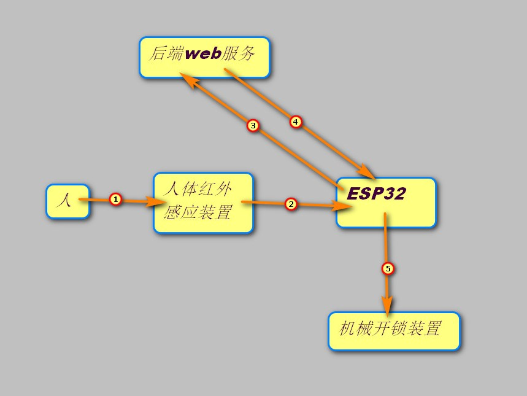

# esp32cam门禁系统简易教程

# 1.环境安装（最好有梯子）（arduino IDE）

1.[官网下载地址](ttps://www.arduino.cc/en/software) 选择相应版本下载Windows ZIP file 无脑安装

2.配置IDE，打开IDE，文件->首选项->附加开发板管理网址里填入 [https://dl.espressif.com/dl/package_esp32_index.json](https://links.jianshu.com/go?to=https%3A%2F%2Fdl.espressif.com%2Fdl%2Fpackage_esp32_index.json)

3.配置开发板，工具->开发板->管理开发板->搜索esp32->点击安装（这里需要梯子，没有的话需要去Github下载esp32的开发板软件直接安装），安装完成后关闭窗口，在开发板中选择　**AI Thinker ESP32-CAM**　这块板子

# 2.硬件（兼可从TB购买）

1.esp32-cam（带摄像头）（核心）

2.电源模块（usb转ttf，给ESP32供电）（我选择得是 cp2102 模块）

3.人体红外感应模块（用于信号输入）（我选择的是HC-SR501 RD-624 模块）

4.（可选）OV2640延长线（原生摄像头传输线太短）。注：esp32cam 有一部分商家直接就有配置10CM摄像头线的商品，买的时候询问一下，就可以省去延长线。

5.一个Linux系统的电脑（windows也可以，需要自行摸索）（我是旧电脑直接装了ubuntu桌面系统，这台电脑准备作为所有智能家居的核心，需要一直保持开机状态）

其余：杜邦线，开关，电阻，发光二极管，5V继电器模块……

注：照片传输速度完全取决于你将esp32的WIFI天线露出多少，如果你用面包板完全遮住了天线，就会非常卡……卡……卡，这也是我购买摄像头延长线的原因之一。

# 3.程序

## 功能描述

人靠近房门，红外感应装置向esp32发送指令，开始拍照，照片通过WIFI传送后端linux服务器（采用HTTP协议），由后端python程序进行人脸识别，并将开门指令返回esp32，收到开门指令后，接通5V中间继电器，由继电器控制的机械硬件打开门锁（房门），人进入后，红外感应装置失去目标，程序恢复等待状态。



## 代码

**esp32cam代码：**

```c++
#include <WiFi.h>
#include <HTTPClient.h>
#include <ArduinoJson.h>
#include "esp_camera.h"

//　下面四条要自行更改
const char *ssid = "6-18";                      //　wifi名
const char *password = "123456";              //　wifi密码
const char *host = "http://192.168.101.105:55363"; // 后端地址和端口
const char *query_addr = "/upload_picture";     // 后端接收图片的url
 
WiFiClient wifi_Client;
HTTPClient http_client;
String req;
String rsp;
int pushButton = 12;
int outputButton = 13;
// 烧录程序的时候这两个口不要通电，就是说先传代码，再接线，不然大概率传不进去

int state = 0;

//Wifi连接
void setupWifi()
{
  WiFi.begin(ssid, password);

  while (WiFi.status() != WL_CONNECTED) {
    delay(500);
    Serial.print(".");
  }
  Serial.print(WiFi.localIP());
}
 
void setUpHttpClient()
{
  req = (String)host + query_addr;
  Serial.println(req);
  if (http_client.begin(req))
  {
    Serial.println("HTTPclient setUp done!");
  }
}

// 拍照发送并解析响应
void send_data() {
  //拍照，获取图像
  camera_fb_t * fb = esp_camera_fb_get();
 
  // 添加http头
  http_client.addHeader("Content-Type","image/jpg");
  // 发送请求
  Serial.println("发送照片");
  int http_code = http_client.POST((uint8_t*)fb->buf, fb->len);
  Serial.println("完成");
  // 解析响应
  if(http_code == 200) {
    rsp = http_client.getString();
    DynamicJsonDocument doc(1024);
    // json序列化
    deserializeJson(doc, rsp);
    JsonObject obj = doc.as<JsonObject>();
    // 获取响应数据，我的后端是python，django服务：return JsonResponse({'code': 200, 'data': '1'})
    if(obj["data"]=="1") {
      digitalWrite(outputButton, HIGH);
      Serial.println("验证成功，解锁");
      delay(2000);
      // 每次解锁2秒钟，因为我外接的机械解锁装置是电磁铁，吸合时间过长会烧毁
      digitalWrite(outputButton, LOW);
      }
  }
  //清空数据，释放内存，我也不知道这行代码到底有没有用
  esp_camera_fb_return(fb);
  }

void setup()
{
  Serial.begin(115200); // 指定波特率
  delay(3000);
  // 指定信号输入口和输出口
  pinMode(outputButton,OUTPUT);
  pinMode(pushButton,INPUT);
  
  setupWifi();
  Serial.print("WIFI OK");
  setUpHttpClient();

  camera_config_t config1;
  //config1.ledc_channel = 4;
  config1.pin_d0 = 5;
  config1.pin_d1 = 18;
  config1.pin_d2 = 19;
  config1.pin_d3 = 21;
  config1.pin_d4 = 36;
  config1.pin_d5 = 39;
  config1.pin_d6 = 34;
  config1.pin_d7 = 35;
  config1.pin_xclk = 0;
  config1.pin_pclk = 22;
  config1.pin_vsync = 25;
  config1.pin_href = 23;
  config1.pin_sscb_sda = 26;
  config1.pin_sscb_scl = 27;
  config1.pin_pwdn = 32;
  config1.pin_reset = 15;
  config1.xclk_freq_hz = 20000000;
  config1.pixel_format = PIXFORMAT_JPEG;
  // if PSRAM IC present, init with UXGA resolution and higher JPEG quality
  //                      for larger pre-allocated frame buffer.
  if(psramFound()){
    config1.frame_size = FRAMESIZE_UXGA;
    config1.jpeg_quality = 10;
    config1.fb_count = 2;
  } else {
    config1.frame_size = FRAMESIZE_SVGA;
    config1.jpeg_quality = 12;
    config1.fb_count = 1;
  }


  // camera init
  esp_err_t err = esp_camera_init(&config1);//摄像头初始化
  if (err != ESP_OK) {//摄像头初始化失败，则打印消息并终止程序
    Serial.printf("Camera init failed with error 0x%x", err);
    return;
  }
  Serial.printf("camera is runing\n");
  // 摄像头配置 资料来源：https://github.com/espressif/esp32-camera/blob/master/driver/include/sensor.h
  sensor_t *s = esp_camera_sensor_get();//获取调整图像接口
  s->set_framesize(s, FRAMESIZE_VGA);//更改帧尺寸
  /*  set_framesize(s, )可选参数为：
    FRAMESIZE_96x96,    // 96x96
    FRAMESIZE_QQVGA,    // 160x120
    FRAMESIZE_QQVGA2,   // 128x160
    FRAMESIZE_QCIF,     // 176x144
    FRAMESIZE_HQVGA,    // 240x176
    FRAMESIZE_240x240,  // 240x240
    FRAMESIZE_QVGA,     // 320x240
    FRAMESIZE_CIF,      // 400x296
    FRAMESIZE_VGA,      // 640x480
    FRAMESIZE_SVGA,     // 800x600
    FRAMESIZE_XGA,      // 1024x768
    FRAMESIZE_SXGA,     // 1280x1024
    FRAMESIZE_UXGA,     // 1600x1200
    FRAMESIZE_QXGA,     // 2048*1536
    FRAMESIZE_INVALID
  */
  s->set_contrast(s, 2); // 对比度（-2，2），开高了效果好
  s->set_quality(s, 5); // 图像质量（0，63），数字越小质量越高，
  // 不要把质量设得太高，我实测每张照片超过60K就损坏了，官方示例最高只能到10
  s->set_ae_level(s, 1); // 曝光补偿（-2，2）
//  s->set_brightness(s, val); // 感光度（-2，2），可以减小光圈的大小，增加景深，但会增加噪点
//  s->set_saturation(s, val); // 饱和度（-2，2），默认的就挺好
//  s->set_hmirror(s, val); // 水平翻转
//  s->set_vflip(s, val); // 垂直翻转
//  s->set_awb_gain(s, val); // 自动白平衡，默认开启
//  s->set_whitebal(s, val); // 白平衡
//  s->set_aec_value(s, val); // 自动光圈，默认开启
//  s->set_aec2(s, val); // 包围曝光模式，轮流使用多种光圈进行曝光（欠曝，正常，过曝），自动光圈开启时，该选项无效
//  s->set_exposure_ctrl(s, val); 光圈大小（0，1200），自动光圈开启时，该选项无效
//  s->set_dcw(s, val); // 应该属于矫正
//  s->set_bpc(s, val); // 应该属于矫正
//  s->set_wpc(s, val); // 应该属于矫正
//  s->set_raw_gma(s, val); // 伽马矫正
//  s->set_lenc(s, val); // 镜头边缘矫正
//  s->set_special_effect(s, val); // 特殊效果？
//  s->set_agc_gain(s, val); // 增益（0，30），对暗环境有效，开着好？
//  s->set_gain_ctrl(s, val); // 增益开关？
//  s->set_gainceiling(s, (gainceiling_t)val); // 增益？
//  s->set_colorbar(s, val); // 色彩条，用来校准色彩

}
 
void loop() {
  // 不断获取信号输入口电平
  int buttonState = digitalRead(pushButton);
  if(buttonState == 1) {
    send_data();
    }
  delay(50);
}
```

如果编译时提示错误，缺少某个库，那么需要先安装：项目->加载库->管理库->搜索找到该库->安装

**后端django程序**：主要使用python3.6，face_recognition库

后端环境：

```shell
sudo apt-get install python3-pip
sudo apt-get install cmake
sudo pip3 install django -i https://pypi.tuna.tsinghua.edu.cn/simple/
sudo pip3 install opencv-python -i https://pypi.tuna.tsinghua.edu.cn/simple/
sudo pip3 install face_recognition -i https://pypi.tuna.tsinghua.edu.cn/simple/
sudo pip3 install uwsgi -i https://pypi.tuna.tsinghua.edu.cn/simple/
sudo apt-get install nginx
sudo apt-get install redis-server
```

~~~python
import time
import os

from django.http import JsonResponse
from django.conf import settings

import cv2
import numpy as np
import face_recognition

# 读取家庭成员面部信息
home_face_list = [face_recognition.face_encodings(
    cv2.imread(f'{settings.BASE_DIR}/esp32cam/home/{file_name}'), model='cnn')[0]
     for file_name in os.listdir(f'{settings.BASE_DIR}/esp32cam/home')]


def upload_picture(request):
    # 接收esp32发来的照片
    data = request.body
    # 将二进制照片，转化为numpy数组，这是非常快的一种转换方式
    img = cv2.imdecode(np.fromstring(data, np.uint8), 1)
    try:
    	 # 提取上传图片的人脸信息
        img_face = face_recognition.face_encodings(img, model='cnn')[0]
    except IndexError:
        print('未检测到人脸')
        return JsonResponse({'code': 200, 'data': '0'})
	# 将接收的人脸与家庭成员人脸数组对比，返回：[True/False,True/False,……]
    activr_list = face_recognition.compare_faces(home_face_list, img_face, tolerance=0.4)
    if True in active_list:
    	# 如果想要将对比成功的照片保存进磁盘，建议使用消息队列，使用该线程保存照片会消耗大量时间
    	# ，导致开门延时增加
        return JsonResponse({'code': 200, 'data': '1'})
    return JsonResponse({'code': 200, 'data': '0'})
~~~

esp32cam的拍照能力比较弱，照片大多比较模糊，特别是晚上的时候，为了对模糊照片进行较精准的识别，需要在后端调用 face_recognition.face_encodings(img, model=‘cnn’) 时加入 model=‘cnn’ 的参数，还需要手动设置 face_recognition.compare_faces( ，，tolerance=0.4) 识别精度这个参数，数值越小，进度越高,默认是0.6.
