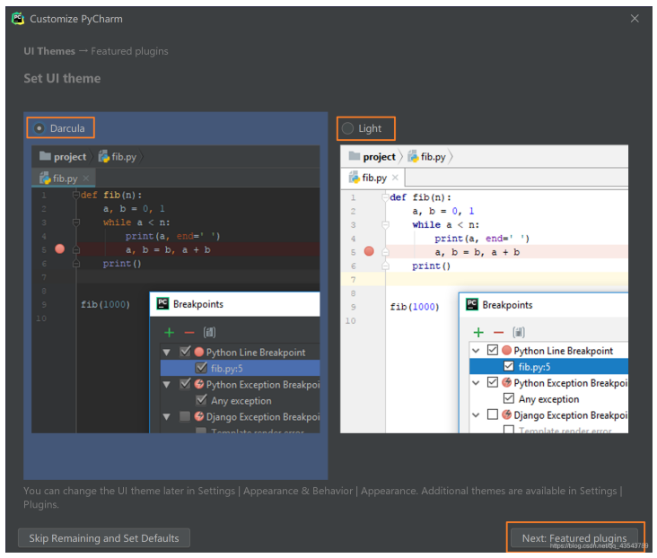
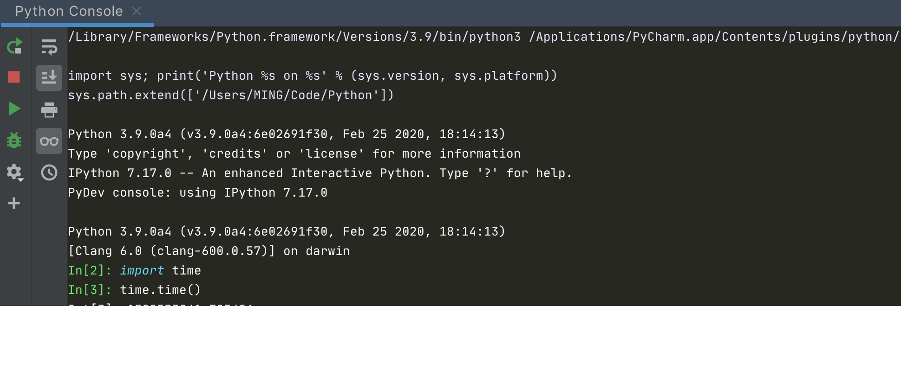

# pycharm 中文指南

原版地址：[pycharm 中文指南](https://pycharm.iswbm.com/)


我在此基础上做了部分删改，作为个人笔记使用

由于 Mac 和 Windows 的键盘布局不同，有些快捷键我只给出了 Mac 版本的，不过不要紧，你只要 掌握下面这个规律，就能轻松切换


# 第一章：下载与安装

## 1.1 【版本介绍】多个版本的介绍与选择

Jetbrain 公司是一家专业的 IDE 生产商，只要是市面上主流的编程语言，Jetbrain 都有相应的产 品。 比如：Python 对应 PyCharm ，Golang 对应 Goland，Java 对应 IntelliJ IDEA，C 语言对应 Clion 等 等

在这些众多的 IDE 中，有一些提供了多种版本：教育版，社区版和专业版

**教育版**：教育版是免费的，具备社区版的所有功能，除此之外，还提供有一个教学功能，因此它更 适合学生。老师可以用它创建教学，学生可以通过他完成教学任务。 

**社区版**：就是阉割版的专业版，它也是免费的，如果你并不需要使用专业版才有那些功能，可以选 择社区版。 

**专业版**：提供所有 PyCharm 的功能，虽然是收费的，但是可以试用一个月。 社区版和专业版在功能上有哪些区别呢？你可以看下面这个表格。

可以看出专业版比社区版多了 科学工具，web开发，python web 框架，python代码分析，远程开发调试，数据库支持。


## 1.2 【安装使用 01】下载使用专业版

### 1. 下载链接

[PyCharm: the Python IDE for Professional Developers by JetBrains](https://www.jetbrains.com/pycharm/)

### 2.安装步骤

选好路径后，点击 Next ，创建桌面快捷方式等一系列选项参照下图勾选


耐心的等待两分钟左右。 之后就会得到下面的安装完成的界面


点击Finish，Pycharm安装完成。 

接下来对Pycharm进行配置，双击运行桌面上的Pycharm图标，进入下图界面：


选择Do not import settings，之后选择OK，进入下一步。

下面是选择主题

 -> 这里默认选择黑色(左边黑色,右边白色) 

-> 点击Next:Featured plugins



建议选择Darcula主题，该主题更有利于保护眼睛。

至此，PyCharm 就安装完成。

### 1.3 【安装使用 02】使用专业版的五种方法

社区版的功能有限，有些非常好用的功能只有专业版才有，比如 远程调试。

如果你想使用到专业版，那有什么办法呢？

1. 有钱的就是大爷，付费购买。
2. 穷人自有穷活法，每次试用一个月，试用期到，卸载干净，再来一次。
3. 利用学生与教师的特权，可申请免费使用（下一节说到）
4. 若你有开源项目，也可以申请免费使用
5. 用一些 `非寻常手段` （也就是破解）来实现。

破解的方法，其实还分很多种：

1. 可以使用注册服务器的方式，优点是非常方便，缺点是过一段时间就有可能失效，不稳定。
2. 还可以使用破解补丁的方式，优点是永久破解（使用期限到 2099 或者 2100年，某种意义上算是永久了），缺点是对于最新版的 PyCharm 你可能找不到相应的破解补丁。如果要使用这种方法，就意味着你得使用旧版的 PyCharm 。
3. 使用绿色免安装的 PyCharm 安装包，其实原理和第二种一样，这一种只是别人帮你破解好，你直接用而已。只适用于 Windows 。
4. 使用无限试用方式

### 1.4 【免费使用 01】学生和老师可申请免费专业版

有一种邮箱，叫做教育邮箱，这东西在这个互联网的世界有很大的优惠及特权，在 Jetbrain 这里，如果你有教育邮箱(`.edu.cn` 后缀的邮箱)但很多学生、甚至老师都未必有。

没有教育邮箱怎么办？

你只要能提供能证明你的学生或者老师身份的证明，比如学生证、教师证等，Jetbrain 也可以让你免费一定期限（申请地址：https://www.jetbrains.com/student/），学生证有效期是一年，每年都要复审一次，老师的话就是长期的了。

### 1.5 【免费使用 02】利用开源项目申请免费专业版

Jetbrains 鼓励开源，只要你拥有一个符合条件的开源项目，你或者你的团队就可以免费使用 `JetBrains` 公司旗下所有的 `Ultimate` 版本的 `IDE` 开发工具，即全家桶的使用权 `1` 年，如果到期了还可以继续申请。

大致的开源项目要求是这个样子的：

- 你必须是项目的发起人或是活跃的 `commiter`
- 你的项目需要积极开发 `3` 个月以上
- 定期发布版本
- 符合开源的定义，不能包含有关商业性质的内容

## 如何申请

申请链接: [https://www.jetbrains.com/shop/eform/opensource](https://link.zhihu.com/?target=https%3A//www.jetbrains.com/shop/eform/opensource)

按表单要求填写即可。


等待个一天左右，你的邮箱估计就能收到激活码了。

# 第二章：调试与运行

## 2.1 【运行技巧 01】运行 Python 的四种方式

### 1. 设置 Python 解释器

PyCharm 只是提供一个集成开发环境，你在执行 Python 程序时，还是得依赖 Python 解释器。

在一台电脑上，可以存在多个版本的 Python 解释器，所以你在执行 Python 程序前，你首先得告诉 PyCharm 你想用哪个 Python 解释器去执行程序。

打开设置，搜索 Interpreter （如下图），就可以添加你的 Python 解释器了。


设置完成后，在主界面就可以看到这里多了这么块内容。你以后想读一些内置模块的代码，可以直接从这里点进去。


### 2. 运行 Python 程序

设置好解释器后，就可以直接运行Python 程序了。

方法有三种：

**第一种**

右键 - 点击 Run 就可以运行该程序

**第二种**

点击界面上的绿色小箭头

**第三种**

如果你在程序里有如下代码

```python
if __name__ == '__main__':
    main()
```

就会出现如下的运行按钮，点击第一个就是 Run 。


**第四种**

这一种方法，可以让你在任意地方编写小段的测试代码，而不用新开一个文件。

具体方法我在[8.8【绝佳工具 04】选择执行：Execute Selection in Console](http://pycharm.iswbm.com/c08/c08_08.html) 有详细的介绍使用方法，可以点击前往。

### 3. 运行相关的快捷键

- Shift + F10：运行当前运行配置中的文件，等同于 Ctrl + Shift + F10
- Shift + F9：调试当前运行配置中的文件
- Alt + Shift + F10：弹出菜单，让你选择运行哪一个文件（你得提前设置好运行配置）
- Alt + Shift + F9：弹出菜单，让你选择调试哪一个文件（你得提前设置好运行配置）
- Ctrl + Shift + F10：运行 main 函数


## 2.2 【运行技巧 02】通过指定参数，执行程序


你在 Pycharm 运行你的项目，通常是怎么执行的？我的做法是，右键，然后点击 `Run`，或者使用快捷键 `Shift + F10` 。

有时候，在运行/调试脚本的时候，我们需要指定一些参数，这在命令行中，直接指定即可。

假设在命令行中，运行脚本的命令是这样

```
python main.py init --local
```

对于刚使用 Pycharm 的同学，可能并不知道 Pycharm 也是可以指定参数的。点击下图位置


进入设置面板，在 `Script parameters` 中填入参数即可。


## 2.3 【调试技巧 01】超详细图文教你调试代码

### 1. 调试的过程

调试可以说是每个开发人员都必备一项技能，在日常开发和排查 bug 都非常有用。

调试的过程分为三步：

1. 第一步：在你想要调试的地方，打上断点
2. 第二步：使用调试模式来运行这个 python 程序
3. 第三步：使用各种手段开始代码调试

首先第一步和第二步，我用下面这张图表示


点击上图中的小蜘蛛，开启调试模式后，在 PyCharm 下方会弹出一个选项卡。

这个选项卡的按键非常多，包括

1. 变量查看窗口
2. 调试控制窗口
3. 线程控制窗口
4. 程序控制窗口


在变量查看窗口，你可以查看当前程序进行到该断点处，所有的普通变量和特殊变量，你每往下执行一行代码，这些变量都有可能跟着改变。

如果你的程序是多线程的，你可以通过线程控制窗口的下拉框来切换线程。

以上两个窗口，都相对比较简单，我一笔带过，下面主要重点讲下调试控制按钮和程序控制按钮。

在调试控制窗口，共有 8 个按钮，他们的作用分别是什么呢？

1. Show Execution Point：无论你的代码编辑 窗口的光标在何处，只要点下该按钮，都会自动跳转到程序运行的地方。
2. Step Over：在单步执行时，在函数内遇到子函数时不会进入子函数内单步执行，而是将子函数整个执行完再停止，也就是把子函数整个作为一步。在不存在子函数的情况下是和step into效果一样的。简单的说就是，程序代码越过子函数，但子函数会执行，且不进入。
3. Step Into：在单步执行时，遇到子函数就进入并且继续单步执行，有的会跳到源代码里面去执行。
4. Step Into My Code：在单步执行时，遇到子函数就进入并且继续单步执行，不会进入到源码中。
5. Step Out：假如进入了一个函数体中，你看了两行代码，不想看了，跳出当前函数体内，返回到调用此函数的地方，即使用此功能即可。
6. Run To Cursor：运行到光标处，省得每次都要打一个断点。
7. Evaluate Expression：计算表达式，在里面可以自己执行一些代码。

以上七个功能，就是最常用的功能，一般操作步骤就是，**设置好断点，debug运行，然后 F8 单步调试，遇到想进入的函数 F7 进去，想出来在 shift + F8，跳过不想看的地方，直接设置下一个断点，然后 F9 过去。**

看这张图就行了（下面第6点有误，应该是运行到光标处，而不是下一断点处）


在程序控制窗口，共有 6 个按钮，他们的作用分别又是什么呢？同时看下面这张图就行了。


### 2. 调试相关的快捷键

- Shift + F10：运行当前运行配置中的文件，等同于 Ctrl + Shift + F10
- Shift + F9：调试当前运行配置中的文件
- Ctrl + Shift + F10：运行 main 函数
- Alt + Shift + F10：弹出菜单，让你选择运行哪一个文件（你得提前设置好运行配置）
- Alt + Shift + F9：弹出菜单，让你选择调试哪一个文件（你得提前设置好运行配置）
- F8：单步执行，不进入函数
- F7：单步执行，进入函数
- Alt + Shift +F7：单步执行，只进入自己写的函数
- Shift + F8：跳出函数体
- Alt + F9：运行到光标所在行
- F9：运行到下一断点
- Ctrl + F2：终止调试程序
- Ctrl + F5：重新以调试模式运行
- Ctrl + Shift + F8：查看所有设置的断点
- Ctrl + F8：切换断点（有断点则取消断点，没有则加上断点）
- Alt + F8 计算表达式（可以更改变量值使其生效）

## 2.4 【调试技巧 02】程序结束了，照样可以调试

假如我们在一个爬虫的项目中，会使用到 正则表达式 来匹配我们想要抓取的内容。正则这种东西，有几个人能够一步到位的呢，通常都需要经过很多次的调试才能按预期匹配。在我们改了一次正则后，运行了下，需要重新向网站抓取请求，才能发现没有匹配上，然后又改了一版，再次运行同样需要发起请求，结果还是发现还是没有匹配上，往往复复，正则不好的同学可能要进行几十次的尝试。

（上面这个例子可能不太贴切，毕竟是有很多种方法实现不用重新发请求，只是列举了一种很笨拙且低效的调试过程，你看看就好了）

而我们在这几十次的调试中，向同一网站发起请求都是没有意义的重复工作。如果在 Pycharm 中可以像 IPython Shell 和 Jupyter Notebook 那样，可以记住运行后所有的变量信息，可以在不需要重新运行项目或脚本，就可以通过执行命令表达式，来调整我们的代码，进行我们的正则调试。

答案当然是有。

假如我在调试如下几行简单的代码。在第 3 行处打了个断点。然后点击图示位置 `Show Python Prompt` 按钮。


就进入了 `Python Shell` 的界面，这个Shell 环境和我们当前运行的程序环境是打通的，变量之间可以互相访问，这下你可以轻松地进行调试了。


上面我们打了个断点，是为了方便说明这个效果。并不是说一定要打断点。如果不打断点，在脚本执行完成后，也仍然可以在这个界面查看并操作所有变量。


现在我们已经可以满足我们的调试的需求，但是每次运行脚本，都要手动点击 `Show Python Prompt` ，有点麻烦。嗯？其实这个有地方可以设置默认打开的。这个开关还比较隐秘，一般人还真发现不了。

你需要点击图示位置 `Edit Configurations` 处。


然后在这里打勾选中。


设置上之后，之后你每次运行后脚本后，都会默认为你存储所有变量的值，并为你打开 console 命令行调试界面。

除了上面这种方法，其实还有一种方法可以在调试过程中，执行命令表达式，而这种大家可能比较熟悉了，这边也提一下，就当是汇总一下。但是从功能上来说，是没有上面这种方法来得方便易用的。因为这种方法，必须要求你使用 debug 模式运行项目，并打断点。

使用方法就是，在你打了断点后，在图示位置处，点击右键使用 `Evaluate Expression`


就弹出了一个 `Evaluate Expression` 窗口，这里 可以运行命令表达式，直接操作变量。


## 2.5 【调试技巧 03】7 步实现远程代码调试

一般情况下，我们开发调试都是在个人PC上完成，遇到问题，开一下 `Pycharm` 的调试器，很快就能找到问题所在。

可有些时候，项目代码的运行会对运行环境有依赖，必须在部署了相关依赖组件的服务器上才可以运行，这就直接导致了我们不能在本地进行调试。

对于这种特殊的场景，就我所知，有如下两种解决方案：

- pdb
- 远程调试

关于 pdb，之前也写过专门的文章介绍使用方法，你可以点此查看：[无图形界面的代码调试方法 - pdb](https://mp.weixin.qq.com/s/tDufSUBrBBNfMEr5_dxM0g)

而远程调试呢，是让我们可以在我们在 PC 上用 PyCharm 的图形化界面来进行调试远方服务器上代码，它和本地调试没有太大的区别，原来怎么调试的现在还是怎么调试。

区别就在于，本地调试不需要事前配置，只要你的代码准备好了，随时可以开始 Debug ，而远程调试呢，需要不少前置步骤，这也正是本篇文章的内容，教你如何配置远程调试环境。

### 1. 新建一个项目

首先，要在Pycharm中新建一个空的项目，后面我们拉服务器上的项目代码就会放置在这个项目目录下。我这边的名字是 NOVA，你可以自己定义。


### 2. 配置连接服务器

Tools -> Deployment -> configuration


添加一个`Server`

- Name：填你的服务器的IP
- Type：设定为SFTP


点击`OK`后，进入如下界面，你可以按我的备注，填写信息：

- SFTP host：公网ip
- Port：服务器开放的ssh端口
- Root path：你要调试的项目代码目录
- Username：你登陆服务器所用的用户
- Auth type：登陆类型，若用密码登陆的就是Password
- Password：选密码登陆后，这边输入你的登陆密码，可以选择保存密码。

这里请注意，要确保你的电脑可以ssh连接到你的服务器，不管是密钥登陆还是密码登陆，如果开启了白名单限制要先解除。


填写完成后，切换到`Mappings`选项卡，在箭头位置，填写`\`


以上服务器信息配置，全部正确填写完成后，点击`OK`

接下来，我们要连接远程服务器了。 Tools -> Deployment -> Browse Remote Host


### 3. 下载项目代码

如果之前填写的服务器登陆信息准确无误的话，现在就可以看到远程的项目代码。


选择下载远程代码要本地。


下载完成提示。


现在的IDE界面应该是这样子的。


### 4. 下载远程解释器

为什么需要这步呢？

远程调试是在远端的服务器上运行的，它除了依赖其他组件之外，还会有一些很多Python依赖包我们本地并没有。

进入 File -> Settings 按图示，添加远程解释器。


填写远程服务器信息，跟之前的一样，不再赘述。


点击`OK`后，会自动下载远程解释器。如果你的项目比较大，这个时间可能会比较久，请耐心等待。

### 5. 添加程序入口

因为我们要在本地DEBUG，所以你一定要知道你的项目的入口程序。如果这个入口程序已经包含在你的项目代码中，那么请略过这一步。

如果没有，就请自己生成入口程序。

比如，我这边的项目，在服务器上是以一个服务运行的。而我们都知道服务的入口是`Service文件`。 `cat /usr/lib/systemd/system/openstack-nova-compute.service`

```
[Unit]
Description=OpenStack Nova Compute Server
After=syslog.target network.target libvirtd.service

[Service]
Environment=LIBGUESTFS_ATTACH_METHOD=appliance
Type=notify
NotifyAccess=all
TimeoutStartSec=0
Restart=always
User=nova
ExecStart=/usr/bin/nova-compute

[Install]
WantedBy=multi-user.target
```

看到那个`ExecStart`没有？那个就是我们程序的入口。 我们只要将其拷贝至我们的Pycharm中，并向远程同步该文件。


### 6. 调试前设置

开启代码自动同步，这样，我们对代码的修改Pycharm都能识别，并且为我们提交到远程服务器。


开启 `Gevent compatible`，如果不开启，在调试过程中，很可能出现无法调试，或者无法追踪/查看变量等问题。


### 7. 开始调试代码

在你的程序入口文件处，点击右键，选择Debug即可。

如果你的程序入口，需要引入参数，这是经常有的事，可以的这里配置。


配置完点击保存即可。


### 8. 友情提醒

按照文章的试调试代码，会自动同步代码至远端，千万不要在生产环境使用，一定要在开发环境中使用，否则后果自负。

调试工具给了程序员提供了很大的便利，但还是希望你不要过度依赖。尽量在每次写代码的时候，都追求一次成型，提高自己的编码能力。

## 2.6 【开发环境 01】使用Vagrant 搭建一劳永逸开发环境

在开发过程中难免遇到开发半小时，环境整半天的尴尬。

有时候自己辛苦在自己电脑上搭建的环境，却只能自己使用，无法复用给同事，这就造成了团队劳动力的极度浪费。

在这里，明哥会给你介绍一种方法，可以让你辛辛苦苦在自己电脑上搭建的 Python 项目运行环境，打包给你的同事们，让他们享受你的劳动成果。

### 1. 下载安装 Vagrant

vagrant 下载地址：https://www.vagrantup.com/downloads

安装完成后，执行 `vagrant box add hashicorp/precise64` 命令，就会在你的电脑上下载一个镜像，这个镜像仅仅是做演示用，你如果有需要，可以用自己定制对应系统的镜像。

在下载的时候，会提示你选择虚拟化软件，在这里我们选择 virtualbox （注意：请提前安装 virtualbox），既免费又轻量。


### 2. 初始化项目

进入我新建的项目目录 `~/Code/Python/Vagrant-Project` ，执行 `vagrant init hashicorp/precise64` 初始化。

最后，直接用这条命令 `vagrant up` 启动虚拟机


虚拟机启动之后，就可以使用 `vagrant ssh` 直接 ssh 进入虚拟机（明哥注：Windows 只能使用远程登陆软件登陆 127.0.0.1:2222，比如 Xshell，或者使用 Tools -> Start SSH Session）。

在这个镜像中，内置了 Python 2.7.3 ，由于只做演示使用，所以这也够用了。

虚拟机里的 `/vagrant/` 目录就对应你宿主机上的 项目根目录


如果你想添加更多的文件夹映射，可以编辑 Vagrantfile 文件，在 end 前，添加下面这一行

```
config.vm.synced_folder "/Users/MING/src", "/srv/website"
```

然后再执行 vagrant reload

### 3. 配置 PyCharm

PyCharm 不愧是最专业的 Python IDE ，它对 Vagrant 也提供了非常好的支持。不过在使用前，需要配置一下。

首先，确保你的 vagrant 插件已经安装


然后，在 Tools -> Vagrant 中配置 vagrant 的信息


最后，再在 Project -> Python Interpreter 里添加 Vagrant 虚拟机里的 Python 解释器


配置完了后，无论在 Setting 里面


还是在项目界面里看到的 Python 解释器都是 Vagrant 里的 Python


在这样的一个环境下，你新建的所有 Python 项目文件，都会被同步到 Vagrant 虚拟机中的 `/vagrant/` 目录下，你在本地运行 Python 项目，其实都是在 Vagrant 虚拟机中运行。

如果你的 Python 项目运行需要依赖很多的组件 ，那完全可以将这些组件全部安装在这个 Vagrant 虚拟机中，打包成镜像，然后把这个镜像和项目（包括 `.vagrant` 文件夹 和 `Vagrantfile`）发给你的同事，他们就能很快的也拥有一套可以稳定运行的项目运行环境。

## 2.7【开发环境02】使用**pycharm** 创建python虚拟环境 even

### 1、新建项目目录

使用pycharm打开该目录

### 2、添加虚拟环境

file ---> setting ---> Project:demo ---> Project Interpreter ---> 设置按钮 ---> add


选择一个python的版本，点击ok，等待环境安装完毕


完毕后会看见项目目录下多出了一个venv的文件夹


### 3、进入虚拟环境

此时点击Terminal，进入命令行，会看见前面有一个 (venv) 的标识，代表已处于虚拟环境中，若没有这个标识，则需要手动进入， cd venv\Scripts  中，执行 activate，手动进入虚拟环境。


### 4、安装需要的库

在虚拟环境下直接pip3 install 即可


# 第三章：界面与排版

## 3.1 【界面改造 01】打造颜值超高的界面

### 1. 你的IDE

当你从官网上下载下来一个 PyCharm 后，若你不对其进行一些个性化设置，相信你一定无法容忍默认的丑陋界面，就像下面这样子。


上面这个界面，有很多可以吐槽的地方，我全部标了出来：

1. 菜单栏的英文太丑，字体太奇怪。和标题栏字体的大小这极不协调。
2. 中文字体太丑，字体和右边代码对比，真的没法看。
3. 背景全白，伤眼我就不说了，一点极客的感觉都没有。
4. 代码字体太丑，太小，代码高亮体验太差。

一个美观的 IDE 界面，能提高写代码的愉悦性，下面我会针对上面提出的问题，介绍下我是如何打造出一个适合我的、高颜值的 IDE 界面。

### 2. 如何打造

先来解决第一、二、三的问题。

点击 File - Setting 进入如下界面，按图中设置对应参数。


设置完成，点击 Apply 或者 OK，看下效果图，是不是舒服多了。


再来解决第四个问题。

点击 File - Setting 进入如下界面，按图中设置对应参数。


设置完这个后，你的代码就会有一种黑客即视感。


当然，你如果对这个高亮的颜色不是很满意，你还可以进行定制。修改完后，下面会有预览窗口。非常方便。


### 3. 主题下载

Pycharm 给我们提供的主题很有限，只有几个。但是提供定制功能，这个可以点赞。但是并不是人人都有那艺术细胞去花费大量精力弄一个非常好看的主题。

在这里，我给你介绍几个非常好用的主题下载网站。 1、*http://color-themes.com* 2、*http://www.themesmap.com*

支持 JetBrains全系列主题下载，包括:InteliJ IDEA, PhpStorm, PyCharm, RubyMine, WebStorm and AppCode.


下载下来后，是一个`jar`包。 你需要通过 File - Import Settings 导入。


最后，在 File - Setting - Editor - Colors & Fonts 里选择导入的主题。


## 3.4 【界面改造 04】开启多行标签页


PyCharm 打开一个文件，就占用一个标签面。

你有没有发现，不知不觉地，打开的文件越来越多，多到一行标签都装不下，装不下的标签页 PyCharm 会将其隐藏起来，并以数字的形式告诉你隐藏了几个文件。


点击数字5，你才可以查看隐藏了哪些文件。

这时你肯定会说，一行装不下 PyCharm 为什么不能多行显示呢？

答案是，不是不能，而是需要你设置。

如下图，将单行显示取消勾选即可。


设置完后，有哪些文件就非常清晰了。


## 3.6 【界面改造 06】小屏幕必看：开启大屏幕编码模式

### 第二个技巧

如果你的 PyCharm 开启了太多的工具栏，左边，右边，下边，大部分的空间都被工具栏占用了。

只需要双击已经打开的文件那一行即可隐藏所有侧边栏，再次双击还原

## 3.7 【界面改造 07】大屏幕必看：分屏查看代码

那怎么开启呢？右击标签页，会有如下两个选项，点击即可。


## 3.8 【界面改造 08】代码太长？试试自动换行

点击右键，勾选 `Soft-Wrap` 选项，就可以开启自动换行


# 第四章：代码的编辑

## 4.1 【高效编辑 01】继承父类方法的正确姿势

在 PyCharm 中正确复写父类方法的姿势 是使用快捷键：Ctrl + O （注意是字母 O，不是数字 0）。

效果如下：


## 4.3 【高效编辑 03】重写父类方法的正确姿势

在 PyCharm 中正确复写父类方法的姿势 是使用快捷键：Ctrl + I （注意是字母 I，不是数字 1）。

效果如下：


## 4.4 【高效编辑 04】快速开启新的一行

那就是：Shift + ↩，无论你的光标在哪里，都会另起一行

## 4.5 【高效编辑 05】变量名一键实现大小写的转换

常量通常都是以大写的形式存在的，若你不小心写成了小写，也可以用 Ctrl + Shift + U 这组快捷键进行转换。

## 4.6 【高效编辑 06】代码块实现随处折叠

阅读一个新项目的源码，应该先理解代码的整体逻辑，这时候对那些比较细节的通常我们会将其折叠。

但是 PyCharm 中，默认只有整体的代码块，比如一个类，一个函数，一个 if 代码块，一个 for 循环代码块，才会有折叠的按钮。

对于这种原本就有折叠/反折叠按钮的，可以使用下面两组快捷键：

- 折叠：Ctrl + `-`
- 反折叠：Ctrl + `+`

另外，还有一组快捷键也要说下

- Ctrl + Shift + `+`： 展开所以代码块
- Ctrl + Shift + `-`：折叠所有代码块

但有时候，我们并不希望整块代码进行折叠，而只想对其他一大段暂时对我们无用的代码进行折叠。那能做到吗？

答案是可以的。

只要你先选中你想折叠的代码，再按住 Ctrl 紧接着按住 `.` 就可以了。

效果如下：


## 4.7 【高效编辑 07】删除与剪切的技巧

删除单行	快捷键 ：Ctrl + X

复制当前行并粘贴	快捷键 ：Ctrl + D

## 4.8 【高效编辑 08】历史剪切板的使用：Paste from History

在 Windows 上有一个剪切板神器 - `Ditto` ，它可以将你间经复制粘贴过的内容都保存下来，以便你重复使用。

在 Mac 上有一个神器 ，叫 Alfred ，它也有类似的功能。

如果你没有使用过 Ditto 和 Alfred ，不要紧，其实 PyCharm 也有这样的功能。

只要你按住 `Ctrl + Shift + V` 就可以调出像下面这样的剪切板。


## 4.10 【高效编辑 10】自动纠正与自动补全

快捷键：Ctrl + Shift + ↩，自动结束代码，行末自动添加冒号


快捷键：Alt + ↩，也称万能键，显示意向动作和快速修复代码

## 4.11 【高效编辑 11】输出结果美化：Show as JSON

当你使用 PyCharm 运行程序后，如果打印了 JSON 字符串，对于人的肉眼来说是很不友好的。

比如这样一段代码

```python
member = '{"name":"xiaoming", "gender": "male", "age": 18}'
print(member)
```

这时候可以在输出窗口点击右键，选择 `Show as JSON`， PyCharm 就会新开一个临时文件显示被格式化过的 JSON 字符串


## 4.12 【高效编辑 12】显示上下文信息

如果一个类的定义写得非常的长，就像下面这样子。


你处在这样一个位置，对框架代码不熟悉的人，根本不知道自己目前处在哪个类中。

PyCharm 提供了一个快捷键： Alt + Q，用来显示上下文信息。


如果视野再往下来一点，你连在哪个函数都不知道呢？

按下这组快捷键：Windows 是 Alt + Q，就会显示当前处在哪个函数里。


## 4.13 【高效编辑 13】一键预览模块的文档

Ctrl + 鼠标左键 ，可以实现函数跳转查看源码， 这几乎是每一个 PyCharmer 都会的一个惯用技巧。

这里再另外介绍两个类似的小技巧，快速 `查看函数文档` 和 `预览源代码` 。

在函数的开头处，使用三个引号 `"` 包含的内容，叫做函数文档 （DocString）。

假如我们在使用这个类的时候，忘记了这个用法，可以按住 Ctrl + Q，在当前页面就可以快速预览 LocalStack 的接口文档。


同样的，如果你对这个类或者函数的代码逻辑感兴趣，也可以使用快速预览的方式在当前页面展示源代码。快捷键是：Ctrl + shift + i 。效果如下


# 第五章：快捷与效率

## 5.4 【提高效率 04】使用模板，快速捕获异常

当你想要对一个代码块进行异常捕获时，你是怎么做的呢？

先在上面写个 try，然后对代码块缩进，然后写 excep ..

这种方法，比较生硬，而且效率极差。

这里推荐一种方法，可以使用 `try...except...` 快速包围代码。

效果如下

1. 先选中代码块
2. 按住 Ctrl + Alt + T
3. 选择 `try/except` 模板


从下拉的选项来看，除了 try/except 和 try/finally 外，还有：

- if
- while
- Comments

## 5.5 【提高效率 05】快速输入自定义代码片段

在 PyCharm 中有一个功能叫 Live Template，它可以用来自定义一些常用的代码片段。

比如下面这段，几乎是写 Python 脚本必备的

```
if __name__ == '__main__':
```

当你在PyCharm 中编码 python 代码时，只要输入 main ，PyCharm 就会在 Live Template 里找到定义过的代码片段，然后只要直接键入回车，就可以生成这段代码。

再比如说，我通常会定义简单的装饰器代码


这样当我要定义一个最简单的装饰器时，只要输入 `deco` 再直接敲入回车就行啦。


## 5.6 【提高效率 06】代码模板，效率编码

Pycharm 提供的这个代码模板，可以说是相当实用的一个功能了。它可以在你新建一个文件时，按照你预设的模板给你生成一段内容，比如解释器路径，编码方法，作者详细信息等


按照上图模板，生成的效果如下。


除了新建文件时可以初始化文件，在开发编写代码时，也同样使用 Pycharm 中自带的实用的代码模板，提高你的编码效率。

当你在键盘中敲入 Ctrl + J 时，就可以调出一个面板，从下图可以看出里面有许多预设的模板。


## 5.7 【提高效率 07】代码封装，一步到位

选中你要封装的代码，然后按住 `Ctrl`+`Alt`+`M` 后，会跳出如下界面，根据自己的需要，修改函数名，选择参数和返回值

封装有时会提示失败，是因为选择的代码段不在一个完整的逻辑内

## 5.8 【提高效率 08】爬虫必备，一键加引号

写爬虫的时候，为了方便，经常会从浏览器 F12 里拷贝对应请求的 headers 到我们的代码中。

但是从浏览器中拷贝的 headers 是没有加引号的，但是我们 Python 中 Headers 是要以字典形式传参数的，因此在从浏览器拷贝 Headers 后，都要手动加引号，非常的麻烦。

目前对于这个问题，还没有相关的插件，通用的解决方法是：使用正则表达式进行替换。

1. 选中需要快速加引号的区域

2. 按住Ctrl + R （windows 是 ctrl + r）填写正则匹配表达式

    ```
    第一行【查找】：  (.*?):(.*)
    第二行【替换】：  '$1':'$2',
    ```

3. 勾选上`.*` 这个选项，开启正则匹配

4. 点击替换全部：`Replace all`

整体的操作过程，如下图


# 第六章：搜索与导航

## 6.1 【搜索技巧 01】精准搜索函数在哪些地方被调用

因为对于搜索函数在所有文件中的用法会更精准的方式。

快捷键是：Alt + F7

效果如下：

1. 函数名完全匹配才会显示
2. 只会搜索被调用的地方，定义的地方不会显示

### 在项目中搜索用该方法的地方(Show Usage)

搜索的内容与上面第一种并无区别，但是这种显示效果会更直观一点：

- 上一种：以目标树展示，强调了层级关系
- 这一种：以文件列表展示，更加清晰易读

快捷键是：Ctrl + Alt + F7

除了用快捷键外，还有更简便的方法，那就是直接按下 `鼠标中键`

### 在当前文件中搜索用该方法的地方(Find Usage in File)

双击该函数或该变量名称，当前文件种所有与之对应的地方都会高亮显示

## 6.2 【搜索技巧 02】在项目中使用书签，快速定位

我在看框架的源代码时，最常使用的是 Ctrl + B （也就是 Ctrl + 鼠标左键 ）一层一层地往里深入，但是当源代码比较多，可能一整个事件过程涉及十几文件，函数调用错综复杂，对于一个庞大的项目来说，有用的可能就几个关键函数，每次要找到这几个函数，都要重头从源函数再一层一层的找下去，这样实在太麻烦了，我常常因此把自己给看晕了。

直到后来我发现了 Pycharm 这个书签功能。

使用书签功能，我可以在在关键的位置打上书签，想看的时候，调用书签，快速定位即可。

使用它，你需要记住下面下两个快捷键

- F11：打上或清除普通书签
- Ctrl + F11：打上或清除书签（带数字，兼容普通标签）
- Shift + F11：展示所有书签

在你要打书签的位置，按下 Ctrl + F11 ，你可以给这个位置加个序号，可以是数字也可以是字母，假如在下面这个位置 加了 `1` 这个序号，下次你就可以使用 Ctrl + 1 直接跳转到这个位置。


当然你也可以不加，不加的话就是匿名书签了。你可以使用 `Shift` + `F11` 展示所有的书签，再进行跳转。

同时，你可以为书签加一段描述文字，表明这块代码是什么的


我写入如下信息


然后再使用快捷键：Shift + F11，就可以列出所有的书签了


## 6.3 【搜索技巧 03】无死角搜索：搜索的八种姿势

在源代码中搜索，是一个非常高频的操作。

根据搜索的范围，可以分为：

1. 当前文件中搜索
2. 全局项目中搜索

### 当前文件中搜索

当前文件中搜索，可以使用两组快捷键，它们的功能是等同的

- Ctrl + F
- Alt + F3

除此之外呢，根据搜索对象的不同，还可以划分为：

- 普通文本
- 方法/函数名
- 类名

方法名和类名都是符号，可以使用 快捷键 Ctrl + F12 ，调出结构树进行搜索。

### 全局项目中搜索

根据搜索的对象，可以分为：

1. 文件名
2. 类名
3. 方法名
4. Action 名

普通人都是使用 Double + Shift ，来搜索所有的东西(Search everywhere)

搜索的东西多了，就意味着搜索无法精准。

其实对于上面的几类，PyCharm 有提供专门的入口，下面开始介绍：

- 精准定位到文件：快捷键 Ctrl+Shift+N
- 精准定位到类：快捷键 Ctrl+N
- 精准定位到符号：类的所有成员（函数、变量等）都可以称之为符号，快捷键 Ctrl+Alt+Shift+N
- 精准搜索 Action ：快捷键 Shift + Ctrl + A，比如下面我搜索书签的所有 Action，可以看到把相应的快捷键都给出来了。
- 精准定位到文件结构：文件结构包括类、函数、变量，这说明上面定位到类和定位到符号的方法，你都可以用这个来代替。快捷键 Ctrl+F12
- 指定文件夹下搜索文件：直接在项目树中输入你要搜索的文件名，若要清空以往输入，可以按 esc 清空。
- 指定文件中搜索项目结构：直接在项目结构中输入你要搜索的结构名（可以是类、函数、变量等），若要清空以往输入，可以按 esc 清空。
- 精准定位到某行：快捷键 Ctrl+G，如下图定位到第510行第9个字符处。

### 禁用double shift 的方式

- 2021 之前的版本：

1. 双击shift，打开 search anywhere 窗口，输入Registry。

2. 打开搜索到的Registry，下拉找到 ide.suppress.duble.click.handler 选项，选中后边的复选框，点击 Close即可完成禁用双击shift的设置。

    

    

- 2021 之后的版本：


## 6.4 【搜索技巧 04】搜索时过滤测试文件

接下来，介绍一个，我看框架源码的时的一个小技巧，可能只适用一小部分人吧。

我平时会看的框架是 OpenStack ，我不知道其他框架是怎样的，但在 OpenStack 里面带有大量（真的很多）的单元测试文件。这给我在使用 `Find in Path` 时带来了不小的困扰，你可以从下图的搜索结果中感受一下，搜索一个函数，test 文件里的结果比 正常文件要多很多。


这些测试文件的搜索结果，对于我们看源代码不仅没有任何帮助的，更重要的是还干扰视线。于是我就研究了一下，从文件名入手，只要在 `File mask` 里填写 `!test*` 可以将这些test文件过滤掉。搜索结果一下子清晰很多。


## 6.5 【搜索技巧 05】当前文件替换与全局替换

替换主要分两种：

1. 在当前文件里替换，快捷键是：Ctrl + R
2. 在全局项目下替换，快捷键是：Ctrl + Shift + R

## 6.6 【搜索技巧 06】显示当前类的继承树：Type Hierarchy

使用快捷键 `Ctrl + H`

使用快捷键 Ctrl + O

## 6.7 【搜索技巧 07】显示当前方法的调用树：Method Hierarchy

按住快捷键 Ctrl + Alt + H

## 6.8 【导航技巧 01】跳转到最后编辑的地方

你只要按下快捷键：Ctrl + Shift + Backspace，不管你在哪里，是同文件下，还是不同文件下，都可以回到你最后编辑的位置	适用于查看源码后回去继续写，或者误操作了什么东西，误操作的话推荐适用Alt + Shift +C ，查看文件操作记录

## 6.9 【导航技巧 02】在子类方法中快速进入父类方法

1. 当前光标处于子类的 reset 方法
2. 按下快捷键 Ctrl + U ，就会进入父类的 reset 方法

## 6.10 【导航技巧 03】前进/后退 到上次“点击”的地方

本节写的前进/后退，是指光标点击的位置。

**后退**：回到上一次光标的位置，Alt + Ctrl + ←

**前进**：回到后一次光标的位置，Alt + Ctrl + →

## 6.11 【导航技巧 04】显示最近打开过的文件

如果你关掉了一个文件标签页，而后面还想打开。再去项目树中一个一个查找打开是比较麻烦的。

不防试试快捷键： Ctrl + E ，可以直接调出你曾经打开过的文件，甚至可以点击如下按钮选择有修改过的文件。


## 6.13 【导航技巧 06】快速跳转到有 ERROR 的行

前几天打开 PyCharm，发现在导航栏这里出现了很多波浪线，有过 PyCharm 使用经验的同学，就会知道，这是代码中出现了错误。

F2：跳转到下一个有错误的行

Shift + F2：跳转到上一个有错误的行

## 6.15 【导航技巧 08】向左/向右切换标签页

PyCharm 原生切换到左/右标签页的快捷键是

- Alt + ← ：切换到左边标签页
- Alt + → ：切换到右边标签页

## 6.17 【导航技巧 10】学会跨级别跳转代码块

根据代码块的在模块中的位置，可以将代码块分为：

1. 行代码块：
2. 流程控制代码块
3. 函数内函数代码块
4. 函数代码块
5. 类代码块

在 PyCharm 中如何实现跨级别代码块（从下一级跳到上一级，不可逆向）的跳转呢？

只要记住这一组快捷键就可以：

- Ctrl + [：跳到上一级代码块开始的地方
- Ctrl + ]：跳到上一级代码块结束的地方


## 6.18 【导航技巧 11】善用 TODO 记录待办事项

> “当看到一个程序员冥思苦想的时候，不要过去打扰，甚至在极端的情况下，一句友好的问候都是多余的。”

为了避免这个情况，我通常在别人打断我的时候，请对方给我一分钟的时间，使用PyCharn 的 TODO 功能快速记录下当前的思绪状态，以及下一步要做的事情。

使用方法跟注释差不多，只要固定要以 TODO 开头。然后，你要查看全局项目中的所有 TODO 事项的时候，可以使用快捷键调出 TODO 面板。快捷键： Alt+6。

# 第七章：版本与管理

## 开启版本控制

点击 `VCS` -> `Git` -> `Clone`


填写git仓库相关信息


点击 `Test`，会尝试连接 git 服务器，中间会让你输入登陆的帐号和密码。


点击`OK` 后，若一切正常会提示连接成功。


点击 `OK` 后，PyCharm 需要你选择如何打开这个 Git 仓库目录，是在当前窗口中打开，还是新建一个窗口？

由于我在一个 PyCharm 下会有多个 Git 仓库，为了方便，我选择在当前窗口中打开（注意勾选 `Add to currently opened projects`）。


至此，Git 配置完成。

此时你可以 `VCS` -> `Git` 查看，发现之前这些灰色不可用的按钮都可以使用了。


本篇重在讲解 PyCharm 的配置，关于Git 的操作，不属于本篇重点，就不再展开讲了。

若你想对已配置的Git仓库进行修改，可点击 `File` -> `Setting` -> `Version Control` 调出如下界面。


不得不说 PyCharm 的这 UI 做得可以，随便改了个东西提交一下


### 与 VSC 有关的快捷键

Ctrl + K： 提交代码到版本控制器

Ctrl + T： 从版本控制器更新代码

Alt + Shift + C：查看最近的变更记录

Alt + ` ：快速弹出版本控制器操作面板

Ctrl + Shift + ` ：操作分支

Ctrl + Shift + K ：Push 到远程

## 7.2 【版本管理 02】三种查看文件的修改

第三种，也是今天要介绍的，是最简便，也是直接的方法。

在有文本变动的位置，PyCharm 会有提示，如下红色箭头标识处，点击它就可以直接查看，还可以快速回滚。


## 7.3 【版本管理 03】媲美beyond compare 的差异对比功能

程序开发必备神器中，beyond compare 绝对可以排一号。

虽说好用，但这东西，是收费的。

如果是简单的单个文件的比对，其实可以使用PyCharm里自带的。

点击源文件，再点击`View` -> `Compare With …` -> 选择目标文件

对比示例，可以查看下面这张图，UI做的还是挺好看的。


## 7.4 【版本管理 04】查看文件修改记录：Annotate

当你的项目处于受控状态（开启了版本控制），你对项目里的文件的修改都会留下记录。

那怎么查看这些记录呢？在编辑框的左边右键，然后选择 `Annotate`


就会出来如下图所示的界面。


在这里界面里记录着，哪个人在哪一天修改了该文件的哪一行，commit 号是多少？

非常方便我们对代码进行追溯。

## 7.5 【版本管理 05】查看文件的所有操作记录

之前为了恢复因为手误造成的语法错误，我使用了快捷键来定位错误行，虽然解决了问题，但总感觉姿势不对，如果没有造成语法错误呢？如何追溯到是哪里的改动影响到了呢？

假如有种方法，可以项目查看最近的修改记录的话（没有git做版本控制的情况下），那就太好了。

太巧的是，今天我打开 PyCharm ，就给我推了这条 tip，使用 Alt + Shift +C 就可以快速查看最近修改的内容


# 第八章：插件与工具


## 8.2 【插件神器 02】JetBrains 官方推出了汉化插件

经常听到很多初学者抱怨说，PyCharm 怎么是全英文的？学起来好难啊。

在以前，我会跟他们说，学习编程语言，英文是一项非常重要的能力，千万不能惧怕它，逃避它，而要是去学习它，适应它，如果连个 IDE 都适应不了，那就别学编程了。

而现在，JetBrains 官方自己出了汉化插件，名字就叫： chinese，在插件市场里一搜，排名第一便是它，下载量已经 40 万，对比排名第二的民间汉化插件，简直不是量级的。


## 8.3 【插件神器 03】在 PyCharm 中写 Markdown

现在新版的默认已经安装了，没有的话搜索 markdown 安装即可

## 8.4 【插件神器 04】正则表达式测试：Regex Tester【爬虫必备】

【测试评价：写复杂的分组表达式时不好用】

Regex Tester是PyCharm的第三方插件，可以测试正则表达式。

安装 Regex Tester 插件：

安装完成后，无需重启 PyCharm ，点击 PyCharm 界面左下方的小矩形按钮，就能找到 Regex Tester 选项。


点击进入后，就出现了如下界面。我随手写了个匹配手机号码的正则（不一定准确），匹配到的字符串背景会被高亮。右上方还有一些选项如大小写敏感，多行模式等，可根据需要进行选择。Regex Tester 还提供了Split，Replace功能等。

使用效果如下：


## 8.5 【绝佳工具 01】在Windows上使用 Bash 命令 【无效】

我的win10 pycharm 暂时没有这个选项，也没有找到这个插件

在 Windows 上的 cmd 命令和 Linux 命令有不少的差异，比如要列出当前目录下的所有文件，Windows 上是用 `dir` ，而 Linux 上则是用 `ls -l` 。

对于像我这样熟悉 Linux 的开发者来说，Windows 的 那些 CMD 命令带来的糟糕体验是无法忍受的。


在弹出的 Bash 窗口，你可以敲入你想使用的 Linux 命令，是不是舒服多了。

## 8.6 【绝佳工具 02】代码不规范？试试自动化 PEP8

【实测好用，原版推荐是autopep8，但是那个效果非常差，这个 `black`效果非常好】

`pep8` 是Python 语言的一个代码编写规范。如若你是新手，目前只想快速掌握基础，而不想过多去注重代码的的编写风格（虽然这很重要），那你可以尝试一下这个工具 - `black`

首先在全局环境中（不要在虚拟环境中安装），安装一下这个工具。

```shell
pip3 install black
```

然后在 PyCharm 导入这个工具，具体设置如下图

```shell
Name: Black	# 随意起名
Description: Black is the uncompromising Python code formatter	# 描述随意写
Program: black	# 固定写法
Arguments: $FilePath$	# 参数，只需传入文件地址即可，根据需要加入其它参数，具体查看 black -h
Working directory: $ProjectFileDir$	# 固定写法，工作目录
```


然后将该操作绑定一个自定义的快捷键，注意尽量不要和已有的快捷键冲突


## 8.8 【绝佳工具 04】选择执行：Execute Selection in Console

当你想写一段简单的测试代码时，或许你会这样子

1. 使用 Python Shell 直接写。缺点是没有自动补全。
2. 在 PyCharm 中新开一个文件。缺点是要新创建一个文件，完了后还要删除。

今天再给大家介绍一种新的方法，可以完全避开上面两种方式的缺点。

那就是 `Execute Selection in Console`，可以说是 `Run in Anywhere`.

只要在当前文件中，写好代码，然后光标选择后，右键点击 `Execute Selection in Python Console` 或者 使用快捷键 option + shift + E (windows 上是 alt + shift + E)。


## 8.11 【绝佳工具 07】在 PyCharm 运行 Jupyter Notebook

使用 Jupyter 之前 ，先要安装它

```
$ pip install jupyter
```

然后按照下图指示新建一个 Notebook ，就可以开始运作了。


这个界面感觉和 Jupyter 的风格不太符


但是使用上是没有什么区别的，记住三个快捷键就好(下面指的是 Mac 上的，Windows 上的有所不同)

- Ctrl+Enter：运行该 cell
- Option + shift + ↩：调试该 cell
- Shift + ↩：插入一个新的 cell


只要你安装了 Jupyter 后，你使用 Python Console 也会自动变成 Jupyter 的模式



## 8.12 【插件神器 05】快捷键管理大师：Key Promoter X

如果让我给新手推荐一个 PyCharm 必装插件，那一定是 `Key Promoter X` 。

它就相当于一个快捷键管理大师，它时刻地在：

- 督促你，当下你的这个操作，应该使用哪个快捷操作来提高效率？
- 提醒你，当下你的这个操作，还没有设置快捷键，赶紧设置一个？

有了 `Key Promoter X`，你很快就能熟练地掌握快捷键，替代鼠标指日可待。

比如我使用鼠标点开 `Find in Path`，它就会在右下角弹窗提示你该用哪个快捷键。

## 8.13 【插件神器 06】代码滚动预览：CodeGlance

如果你曾使用过 Sublime Text，切换到其他代码编辑器，或多或少会有些不习惯，因为很少有编辑器会像 Sublime 那样自带一个预览功能的滚动条。

在 PyCharm 中，就没有解决不了的问题，如果有，那么就装个插件。

要想在 PyCharm 中使用这个预览滚动条，只要装上 `CodeGlance` 这个插件。使用效果如下


## 8.14 【插件神器 07】JSON美化插件：Json Parser

在开发过程中，经常会把校验一串 JSON 字符串是否合法，在以前我的做法都是打开 https://tool.lu/json/ 这个在线网站，直接美化来校验，只有 JSON 格式都正确无误合法的，才能够美化。


直到后来发现在 PyCharm 有一个插件专门来做这个事，那就是 `JSON Parser`，在插件市场安装后，重启 PyCharm ，就能在右侧边栏中看到它。


## 8.15 【绝佳工具 08】使用 PyCharm 进行SSH 远程登陆

开发者通常都会有自己专门用来 ssh 远程登陆的软件，比如 Xshell 等

对于经常需要 ssh 服务器提供支持的朋友来说，选择专业化的软件无疑是最好的选择，但是对于那些使用频率不高的小伙伴来说，其实只用 PyCharm 就足够了。

本篇文章明哥给你介绍下，如何使用 PyCharm 进行 SSH 远程登陆。

## 1. SSH 远程服务器

点击 `Tools` -> `Start SSH Session`，弹出如下选项，选择 `Edit Credentials...`


输入主机的信息，点击 OK


就连接成功啦


通过上面开启连接是无法保存的，下次你再运行还是要手动输入ip port password。

如果要保存 ssh 的连接信息，可以在如下位置添加


在这里添加后，你在 `Tools` -> `Start SSH Session` 就可以看到啦


## 2. SSH Vagrant 虚拟机

如果你当前的项目已经配置好了 Varant 环境，登陆会更加方便。

还不会配置的，请看本书 第二章：【开发环境 01】使用Vagrant 搭建一劳永逸开发环境


直接进入本项目的 Vagrant 虚拟机


# 第九章：常用的技巧

## 9.2 【必学技巧 02】误删项目？一秒找回

有一次由于自己的误操作，在没有任何备份的情况下，将一个自己写了两个星期的项目给删除了。待我回头神来的时候，我甚至都记不起是何时进行的删除操作。经过一番测试，在回收站还真的找不着，但是这次尝试也无意中发现了 Pycharm 的隐藏的一个功能 `Local History`，它会保存你对文件的所有操作记录。

此时你可以在你的项目目录里，点击右键，有个 `Local History` 的选项，再点击子选项 `Show History`，你可以看到这里有个记录板。如果你想恢复删除的文件，就在删除的记录项点击右键，选择 `Revert` 即可恢复。


## 9.3 【必学技巧 03】智能补全，忽略大小写

智能搜索补全，是IDE的最吸引人的功能之一。

当你的对象是以大写字母开头时，而你使用小写字母编写代码时，是不能查找到该函数的，你必须得先切换成大写再输入一遍。

如何避免这种尴尬的情况？

只要在配置中关闭大小写匹配即可。


## 9.4 【必学技巧 04】以列为单位的块编辑

如果你使用的是旧版本的 PyCharm ，当你按住 alt，然后使用鼠标进行选择，你会发现这样一件神奇的事情。


如若上面的快捷键不生效，说明你的 PyCharm 是新版本，在较新版本中，有两种方法开启列选择模式

1、使用快捷键 Alt + Shift + Insert

2、点击右键，选择 『Column Selection Mode』

在新版本中，列选择的功能变成了一种模式，开启才能使用，使用完后还需要关闭。相比旧版本，个人认为这个改变不好，不能即用即走。

## 9.7 【必学技巧 07】tab和空格混用自动转换

在团队协作中，你难免会动到别人编辑的文件，有的人喜欢做tab做缩进，有的人喜欢用四个空格做缩进。

但是在同一个Python文件模块里，tab 和 四个空格缩进两种风格是不能共存的。这就需要你按照该文件原来的缩进风格来进行编码，在 Pycharm 里，可以设置自动检测原文件的缩进风格来决定当你使用tab键缩进的时候，是TAB还是四个空格。

在图示位置打勾即可开启自动检测。（默认自动开启的）


上面是对一个旧的 Python 模块进行修改时，如何决定当前编辑的缩进方式。

而对于新建模块，默认的缩进方式，是如何确定的？

如下图，若在 `Use tab character` 打上勾，则你新建一个 Python 后，就会使用 TAB 进行缩进，反之，则使用四个空格进行缩进。


## 9.8 【必学技巧 08】脱离鼠标的代码区域选择：Extend Selection

根据选中的区域的大小，可以分为：

1. 选中单词
2. 选中表达式
3. 选中单行
4. 选中代码块
5. 选中函数
6. 选中类

对于代码区域，通常都要借助鼠标才能完成，这里给你推荐一组快捷键，可以让脱离鼠标进行区域的选择：

- Ctrl + W）：扩大选中的区域
- Ctrl + Shift + W：缩小选中的区域


## 9.9 【必学技巧 09】从可视化 Python 包管理器

PyCharm 在配置了解释器后，下方会列出你的该环境下所有已安装的包。

在右边有四个按钮

1. 安装
2. 卸载
3. 升级
4. 查看早期版

你可以通过他们对这些包进行管理。

下面以安装 parse 包为例：

点击 `+` 按钮


搜索 `parse` ，并点击右下角进行安装


退回包管理界面，已经安装成功了。


## 9.11 【必学技巧 11】显示类继承关系图：Show Diagrams

在阅读一些比较庞大的项目时，如果类的继承关系比较复杂，会给我们阅读源码带来不小的阻碍。

面对这种情况，本篇的这个技巧就能派上用场了。

在你想查看继承关系的 类 中，右键选择 `Diagrams` -> `Show Diagram`


就会新增一个窗口，使用 UML 为你展示该类的继承关系。


## 9.13 【必学技巧 13】把文件设置为只读：Read-Only

如果担心代码因为被自己不小心修改到（已写好的工具包），可以把该文件设置为只读。

方法很简单，只要点击右下角的 `小锁` 锁上该文件就可以。


# 第十章：操作数据库

## 10.1 【数据库操作 01】连接 MySQL

在 PyCharm 中，可以连接绝大多数市面上主流的数据库，比如 MySQL，MongoDB 等，对于大多数人来说，有了 PyCharm 后，再也不用去下载 Navicat 了。

本篇文章会以 MySQL 为例，讲解一下如何创建并保存一个数据库连接。

首先在你的 PyCharm 的右边边栏里点击 Database ，然后再点击左上角的 `+` 号 -> `Data Source` -> `MySQL`


弹出如下界面，输入 ip，port，password 等信息后，点击 `Test Connection` 测试一下是否能连接，如果可以凡点 `OK` 保存，以便下次复用。


如果左下角有提示下载驱动，点击安装就好啦~


连接成功后，会自动弹出一个 MySQL Console 的查询界面，你可以在这个界面里运行 SQL 命令


## 10.2 【数据库操作 02】切换数据库

在 Console 中写 sql 语句的时候，是不用使用 `use <db>` 来选择数据库的，默认选中的就是 mysql，如果你想切换数据库，可以点如下图的位置，进行切换。


## 10.3 【数据库操作 03】查询结果格式化

### 表格形式

查询结果默认显示以表格的形式打印，你可以很方便的复制到 Excel 上


### JSON格式

如果你需要将结果展示成 JSON 的格式，点击切换到 `Tree`


### CSV 格式

如果你需要将结果展示成 CSV 的格式，点击切换到 `Text`


## 10.4 【数据库操作 04】数据的导出

PyCharm 不仅提供了数据导出的功能，而且做得近乎极致，它支持各种格式的导出：csv, xlsx, json, html , xml , sql 等等


导出为 csv 或者 xlsx 格式，方便用于二次加工

导出为 SQL 语句，方便用于还原数据

导出 JSON 或者 xml，方便用于发送网络请求等其他用途

导出为 Markdown，方便用于 Markdown 的排版展示

导出为 HTML，方便使用浏览器展示数据

## 10.5 【数据库操作 05】数据的修改

你不仅 可以在 PyCharm 上进行数据的查询，对查询出来的数据可以进行可视化的修改，不用再使用 UPDATE 的 sql 语句去更新。


11