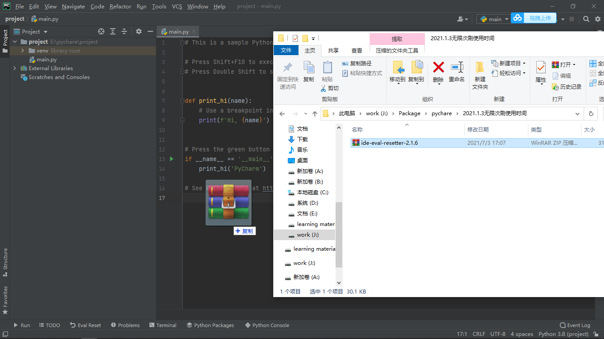
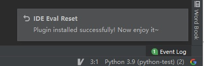
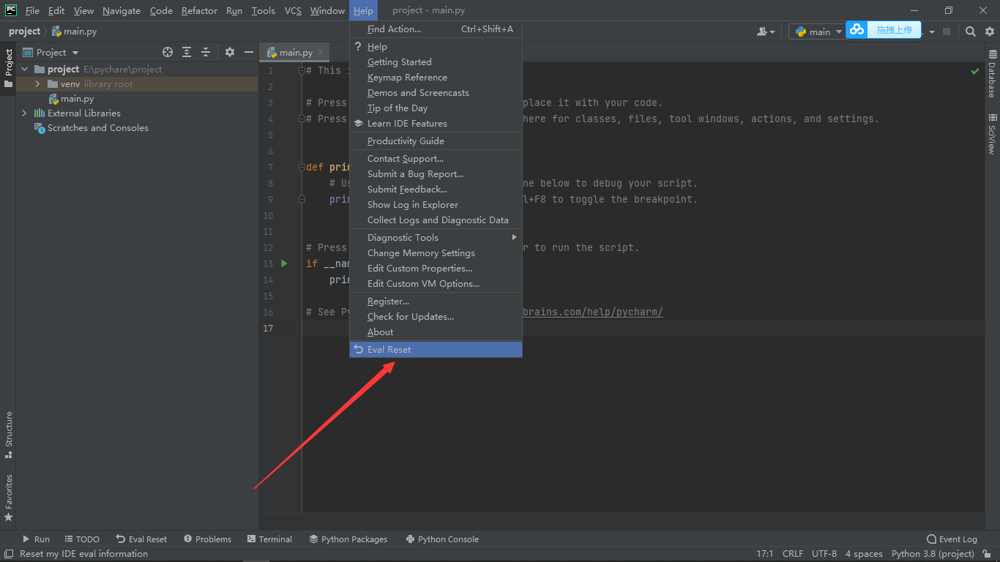
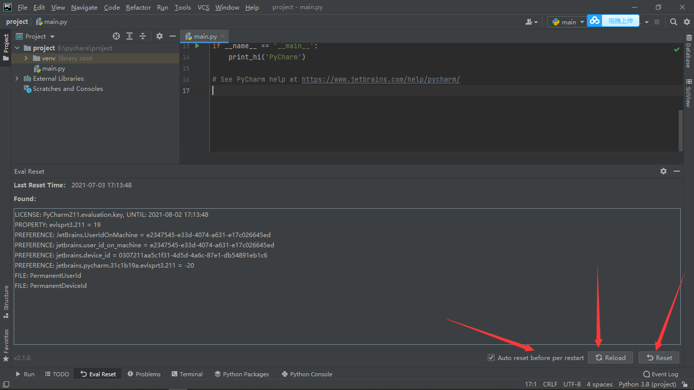

pycharm非常规操作

## 在ubuntu中设置pycharm的图标

```bash
# 创建一个文本
sudo gedit /usr/share/applications/pycharm.desktop

# 然后写入 Exec=sh：/bin/pycharm.sh的路径    Icon= /bin/pycharm.png的路径
[Desktop Entry]
Type=Application
Name=Pycharm
GenericName=Pycharm3
Comment=Pycharm3:The Python IDE
Exec=sh /home/oliver/下载/pycharm-community-2018.1.2/bin/pycharm.sh
Icon=/home/oliver/下载/pycharm-community-2018.1.2/bin/pycharm.png
Terminal=pycharm
Categories=Pycharm;

```

## win10 下安装官网新版pycharm 出现无法打开应用的情况

多半是之前使用过破解版的pycharm，需要将原版的pycharm彻底卸载干净才行，需要将 C:\Users\用户\AppData 下面每个子目录里面的 JetBrains 文件夹全部删除。


## pycharm专业版无限试用方法

### 安装

#### 直接安装

打开pycharm进入插件安装界面，搜索 `IDE Eval Reset` 直接安装

#### 手动安装

zip下载链接：https://pan.baidu.com/s/1j-uvqAfS8KYL_LkRZiYDBg
提取码：1870

下载完成后，将 zip 插件包拖入 IDE 界面中。

如果无法拖动安装，你可以在`Settings/Preferences... -> Plugins` 里手动安装插件  Ide Eval Reset：



### 使用

插件安装成功后，右下角会提示如下：




安装成功之后在菜单栏 `Help` 中会多一个 `Eval Reset` 按钮 




点击之后会出现如下界面




上图标注的三个按钮解释：

**勾选项： `Auto reset before per restart` 如果勾选了，则自勾选后每次重启/退出IDE时会自动重置试用信息，你无需做额外的事情。（此为自动重置方式）**

**按钮：Reload 用来刷新界面上的显示信息。**

**按钮：Reset 点击会询问是否重置试用30天并重启IDE。选择Yes则执行重置操作并重启IDE生效，选择No则什么也不做。（此为手动重置方式）**


勾选 `Auto reset before per restart` 之后点击 `Reload` 再点击 `Reset` 重启即可。

### 说明：

**目前来讲，这是一个最稳定的“激活”方式，没有之一。**

**重启PyCharm时 会自动重置**

**如果25天没有任何重置动作，则会通知是否进行重置**

**如果勾选Auto reset before per restart ，静默重置**

**理论上，勾选了Auto reset before per restart 之后无需再管，一劳永逸**

**a：**这个插件只是无限制的刷新试用时间， 今天打开试用期30天，明天打开还是试用期30天，后台还是30天，大后天... 大大后天...

**b:** 在使用的时候发现偶尔不会自动重置，只需要手动点击 Reload 然后 Reset 即可。
