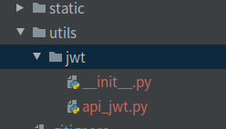

在pyjwt中，decode时如果token过期，则会报出jwt.ExpiredSignatureError的错误，但是当token快要过期时，却没有相应的提示

此方法会重写 PyJWT 的 _validate_exp 函数，以实现该功能

示例依托于 django

首先需要安装 pyjwt 模块

```shell
pip3 install pyjwt
```


## 1.在项目目录下创建 utils/jwt 子目录

## 

## 2.在jwt目录中分别创建 \__init__.py  和 api_jwt.py 文件

```python
# api_jwt.py
# 适用于 pyjwt = 1.7.1 其余版本未测试
from jwt.api_jwt import PyJWT
from jwt.exceptions import DecodeError, ExpiredSignatureError


class MyJWT(PyJWT):
    def _validate_exp(self, payload, now, leeway):
        try:
            exp = int(payload['exp'])
        except ValueError:
            raise DecodeError('Expiration Time claim (exp) must be an'
                              ' integer.')

        if exp < (now - leeway):
            raise ExpiredSignatureError('Signature has expired')
        # 在 payload 添加一个字段 retoken ，类型为布尔值，当为True时表示需要给前端发送新的token
        # token 有效期小于三天，则将 retoken 置为 True ，想要设置多长时间自己改
        payload['retoken'] = True if exp - now < 3600 * 24 * 3 else False


_jwt_global_obj = MyJWT()
encode = _jwt_global_obj.encode
decode = _jwt_global_obj.decode
register_algorithm = _jwt_global_obj.register_algorithm
unregister_algorithm = _jwt_global_obj.unregister_algorithm
get_unverified_header = _jwt_global_obj.get_unverified_header
```

```python
# __init__.py
# -*- coding: utf-8 -*-
# flake8: noqa

"""
使 jwt 能够在 token 即将过期时给出提示
重写 PyJWT 的 _validate_exp 函数，以实现该功能
"""


__title__ = 'myjwt'
__version__ = 'pyjwt = 1.7.1'
__author__ = 'MOYU'
__license__ = ''
__copyright__ = ''


from .api_jwt import (encode, decode, register_algorithm, unregister_algorithm, get_unverified_header, MyJWT)
```

## 使用方式

```python
# 使用方式和原来的 jwt 一摸一样
import time
from utils import jwt

token_str = jwt.encode({'code': '123456', 'exp': int(time.time()) + 3600}, key='123456')
payload = jwt.decode(token_str, key='123456')
print(payload)


>>> {'code': '123456', 'exp': 1635410344, 'retoken': True}
```


