# Python简介

## 计算机基础结构

### 硬件：

1944年，美籍匈牙利数学家冯·诺依曼提出计算机基本结构。

五大组成部分：运算器、控制器、存储器、输入设备、输出设备。

-- 运算器：按照程序中的指令，对数据进行加工处理。

-- 控制器：根据程序需求，指挥计算机的各个部件协调工作。

通常将运算器和控制器集成在中央处理器（CPU）中。


​	-- 存储器：保存各类程序的数据信息。

​     内存RAM -- 容量小，速度快，临时存储数据 

​     硬盘HDD -- 容量大，速度慢，永久存储数据


输入设备：外界向计算机传送信息的装置。

​       例如：鼠标、键盘、扫描仪…

输出设备：计算机向外界传送信息的装置。  

​       例如：显示器、音响、打印机…


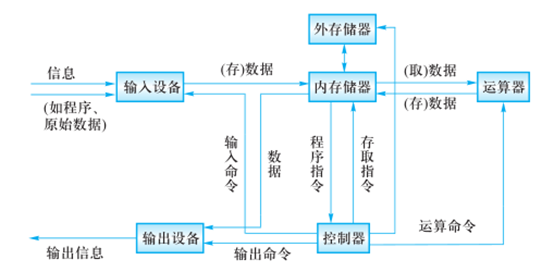


### 软件

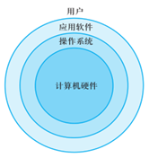

操作系统：

​       -- 管理和控制计算机软件与硬件资源的程序。

​       -- 隔离不同硬件的差异，使软件开发简单化。

​       -- Windows，Linux，Unix。

应用软件：为了某种特定的用途而被开发的软件。

软件：程序 + 文档。

​       -- 程序是一组计算机能识别和执行的指令集合。

​       -- 文档是为了便于了解程序所需的说明性资料。

## 基础知识

### Python 定义

是一个免费、开源、跨平台、动态、面向对象的编程语言。

#### 交互式

在命令行输入指令，回车即可得到结果。

1. 打开终端

2. 进入交互式：python3

3. 编写代码：print(“hello world”)

4. 离开交互式：exit()

#### 文件式

将指令编写到.py文件，可以重复运行程序。

1. 编写文件

2. 打开终端

3. 进入程序所在目录：cd 目录

4. 执行程序： python3 文件名

#### 执行过程

计算机只能识别机器码(1010)，不能识别源代码(python)。

1. 由源代码转变成机器码的过程分成两类：编译和解释。

2. 编译：在程序运行之前，通过编译器将源代码变成机器码，例如：C语言。

    -- 优点：运行速度快

    -- 缺点：开发效率低，不能跨平台。

3. 解释：在程序运行之时，通过解释器对程序逐行翻译，然后执行。例如Javascript

    -- 优点：开发效率高，可以跨平台；

    -- 缺点：运行速度慢。

4. python是解释型语言，但为了提高运行速度，使用了一种编译的方法。编译之后得到pyc文件，存储了字节码（特定于Python的表现形式，不是机器码）。

    源代码 -- 编译 --> 字节码 -- 解释 --> 机器码

    ​	|————1次———|

#### 解释器类型

1. CPython（C语言开发)

2. Jython (java开发)

3. IronPython (.net开发)

# 数据基本运算


## 基础知识

### 注释

给人看的，通常是对代码的描述信息。

1. 单行注释：以#号开头。

2. 多行注释：三引号开头，三引号结尾。

### 函数

表示一个功能，函数定义者是提供功能的人，函数调用者是使用功能的人。

例如：

1. print(数据) 作用：将括号中的内容显示在控制台中

2. 变量 = input(“需要显示的内容”) 作用：将用户输入的内容赋值给变量

### 变量

变量用来操作数据

1. 定义：关联一个对象的标识符。

2. 命名：必须是字母或下划线开头，后跟字母、数字、下划线。

    ​       不能使用关键字(蓝色)，否则发生语法错误：SyntaxError: invalid syntax。

3. 建议命名：字母小写，多个单词以下划线隔开。

    ​     class_name

4. 赋值：创建一个变量或改变一个变量关联的数据。

5. 语法：

    变量名 = 数据

    变量名1 = 变量名2 = 数据

    变量名1, 变量名2, = 数据1, 数据2

    ​	name01, name02 = name02, name01   =====>变量交换

    创建单个变量
    	person_name01 = "金海"
    用多个数据，创建多个变量
    	person_name02, person_name03 = "铁林"**, **"徐天"
    用单个数据，创建多个变量
    	 person_name04 = person_name05 = "柳如丝"

### del 语句

1. 语法: 

    del 变量名1, 变量名2

2. 作用：

    用于删除变量,同时解除与对象的关联.如果可能则释放对象。

3. 自动化内存管理的引用计数：

    每个对象记录被变量绑定(引用)的数量,当为0时被销毁。

## 核心数据类型

1. 在python中变量没有类型，但关联的对象有类型。

2. 通过type函数可查看，type 返回数据类型

### 空值对象 None

```python
# 4. 空类型None
# 占位
age = None

person_name = "金海"
# 解除与变量的绑定关系
person_name = None
```

1. 表示不存在的特殊对象。
2. 作用：占位和解除与对象的关联。
3. 赋予一个暂时不能确定的变量


### 整形int

1. 表示整数，包含正数、负数、0。

    如： -5, 100, 0

2. 字面值：

    `十进制`：每位用十种状态计数，逢十进一，写法是0~9。

    `二进制`：每位用二种状态计数，逢二进一，**<font color='red'>写法是0b开头</font>**，后跟0或者1。

    `八进制`：每位用八种状态计数，逢八进一，**<font color='red'>写法是0o开头</font>**，后跟0~7。

    `十六进制`：每位用十六种状态计数，逢十六进一，**<font color='red'>写法是0x开头</font>**，后跟0~9,A~F,a~f


### 浮点型float 

1. 表示小数，包含正数、负数，0.0)。

2. 字面值：

    小数：1.0  2.5

    科学计数法：e/E (正负号) 指数 

    ​     1.23e-2 (等同于0.0123)

    ​     1.23456e5(等同于123456.0)

### 字符串str

​    是用来记录文本信息(文字信息)。

​	字面值：双引号

​    **<font color='red'>字符串是特殊的元组，里面每一个单独的字都有内存地址</font>**

### 布尔bool

用来表示真和假的类型

True 表示真(条件满足或成立)，本质是1

False 表示假(条件不满足或不成立)，本质是0


## 数据类型转换

```python
# 注意：待转换数据必须"长得像"代转类型
# print(int("250+"))#   250+ 不像 整数,所以报错（第三门课程解决）
# print(int("1.23"))
```

 

1. 转换为整形: int(数据)
2. 小数转整数，只保留整数部分
3. 转换为浮点型:float(数据)
4. Round(1.29,1)=1.3
5. 转换为字符串:str(数据)
6. 转换为布尔:bool(数据)
    1. 结果为False：bool(0) bool(0.0) bool(None) 

7. 混合类型自动升级：

     1 + 2.14 返回的结果是 3.14

     1 + 3.0  返回结果是: 4.0


## 运算符

### 算术运算符

\+  加法

\-   减法

\*   乘法

/   除法：结果为浮点数

//  整除：除的结果去掉小数部分

%  求余

**  幂运算

<font color='red'>优先级从高到低： </font>

​		()

​         **

​         \* / % //

​         \+ -

### 增强运算符

y += x     相当于 y = y + x

y -= x      相当于 y = y - x

y *= x      相当于 y = y * x

y /= x      相当于 y = y / x

y //= x     相当于 y = y // x

y %= x     相当于 y = y % x

y \**= x     相当于 y = y ** x

### 比较运算符

 <     小于

 <=    小于等于

 \>     大于

 \>=    大于等于

 ==    等于

 !=    不等于

返回布尔类型的值

比较运算的数学表示方式:0 <= x <= 100

### 逻辑运算符

#### 与and

表示并且的关系，一假俱假。     

示例:

True and True   # True

True and False  # False

False and True  # False

False and False  # False

#### 或or

表示或者的关系，一真俱真   

 示例:

True or True    # True

True or False    # True

False or True    # True

False or False       # False 

#### 非 not 

表示取反

例如：

not True  # 返回False

not False # 返回True

#### 短路运算

<font color='red'>一但结果确定，后面的语句将不再执行。尽量把耗时的判断放到后面，因为很有可能不执</font>


### 身份运算符

  语法:

​         x is y

​         x is not y

作用：

​		is 用于判断两个对象是否是同一个对象,是时返回True,否则返回False。

​        is not 的作用与is相反

### 优先级

​    高到低：

算数运算符

比较运算符

增强运算符

身份运算符

逻辑运算符

# 语句

## 行

1. 物理行：程序员编写代码的行。

2. 逻辑行：python解释器需要执行的指令。

3. 建议一个逻辑行在一个物理行上。

4. 如果一个物理行中使用多个逻辑行，需要使用分号；隔开。

5. 如果逻辑行过长，可以使用隐式换行或显式换行。

    ​		隐式换行：所有括号的内容换行,称为隐式换行

    ​        括号包括: () []  {} 三种

    ​		显式换行：通过折行符 \ (反斜杠)换行，必须放在一行的末尾，目的是告诉解释器,下一行也是本行的语句。 

## pass 语句

通常用来填充语法空白。

有一部分暂时没想好怎么写，用来填充，以免程序报错


## 选择语句

### If elif else 语句

连着两个if就可以用and

1. 作用:

    ​      让程序根据条件选择性的执行语句。

2. 语法:

      if 条件1:

    ​    	语句块1

      elif 条件2:

    ​      	等同于：else:

    ​                  			If ………………

       	 语句块2

      else:

       	 语句块3

3. 说明:

      elif 子句可以有0个或多个。

      else 子句可以有0个或1个，且只能放在if语句的最后。


### if 语句的真值表达式

if 100:

​    print("真值")

等同于

if bool(100):

  print("真值")

```python
#假值为：为False的转换： 
bool(0)  bool(0.0)  bool("")   bool(None)    # 还包括所有 【空】 容器
#  整数     浮点数      字符串        空
```

### 条件表达式

 语法：变量 = 结果1 if 条件 else 结果2

<font color='red'>只适用于：满足条件给一个变量赋值，否则给这个变量赋另一个值</font>

 作用：根据条件(True/False) 来决定返回结果1还是结果2。

## 循环语句

### while语句

1. 作用: 

    可以让一段代码满足条件，重复执行。

2. 语法:

    循环计数
    		三大要素：开始值、结束值、增减量
    <font color='red'>开始值</font>
     <font color='red'>while 对结束值的处理:</font>
    			<font color='red'>循环体</font>
    			<font color='red'>增减量</font>

 

while  条件:

​    	满足条件执行的语句

 else:   判断while 循环的原因是循环体内部还是在循环条件

​           判断退出原因，比如有人作弊

​    不满足条件执行的语句

 

3. 说明:

      else子句可以省略。

      <font color='red'>在循环体内用break终止循环时,else子句不执行。</font>

### for 语句

1. 作用:

      用来遍历可迭代对象的数据元素。

      可迭代对象是指能依次获取数据元素的对象，例如：容器类型。

2. 语法:

      for 变量列表 in 可迭代对象:

    ​    	语句块1

      else:

    ​    	语句块2

3. 说明:

      else子句可以省略。

      <font color='red'>在循环体内用break终止循环时,else子句不执行。</font>

while**：根据条件重复**
经典案例：折纸到珠穆朗玛峰的高度

 for**：适合获取容器中的元素**
   for + range**：根据次数重复**
经典案例：累加**1**到**100**之间的整数

###  range 函数

1. 作用:

    ​      用来创建一个生成一系列整数的可迭代对象(也叫整数序列生成器)。

2. 语法:

    ​       range(开始点，结束点，间隔)

3. 说明:

    函数返回的可迭代对象可以用for取出其中的元素

    返回的数字不包含结束点

    开始点默认为0

    间隔默认值为1 

```python
             # 写法1：range(起点,终点,间隔)
for item in range(1, 10, 1):     #自己写的时候用第一种，把参数写全
    print(item)  # 1 2 .... 9
# 写法2：range(终点)
for item in range(6):
    print(item)  # 0 1 2 .. 5
# 写法3：range(起点,终点)
for item in range(3, 9):
    print(item)  # 3 4 ... 8
```

## 跳转语句

### break 语句

1. 跳出循环体，后面的代码不再执行。

2. 可以让while语句的else部分不执行。

### continue 语句

<font color='red'>中断本次循环，开始下次循环。</font>

# 容器类型

## 通用操作

### 数学运算符

1. +：用于拼接两个容器  

2. +=：用原容器与右侧容器拼接,并重新绑定变量

3. *：重复生成容器元素

4. *=：用原容器生成重复元素, 并重新绑定变量

5. <   <=   >   >=   ==   !=：依次比较两个容器中元素,一但不同则返回比较结果。 

### 成员运算符

1. 语法：

       数据 in 序列
        
       数据 not in 序列

2. 作用：

    ​    如果在指定的序列中找到值，返回bool类型。

### 索引index

1. 作用：定位单个容器元素

2. 语法：容器[整数]

3. 说明：

    正向索引从0开始，第二个索引为1，最后一个为len(s)-1。

    反向索引从-1开始,-1代表最后一个,-2代表倒数第二个,以此类推,第一个是-len(s)。

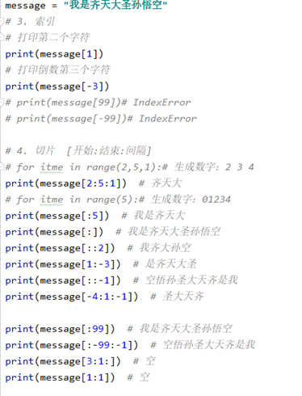

### 切片slice

1. 作用：

    定位多个容器元素。

2. 语法：

    <font color='red'>容器[左索引:右索引:步长] </font>

3. 返回值

    一般而言，切片操作的返回结果是一个新的独立的序列（PS：也有例外，参见《[Python是否支持复制字符串呢？](https://mp.weixin.qq.com/s?__biz=MzUyOTk2MTcwNg==&mid=2247483825&idx=1&sn=2a8076820433073050e1bddda2f3c874&scene=21#wechat_redirect)》）。以列表为例，列表切片后得到的还是一个列表，占用新的内存地址。

3. 说明：

    - 切片是浅拷贝
    - 步长是切片每次获取完当前元素后移动的偏移量
    - 步长为负数时,代表先将容器翻转,并将左右索引都加上`-`号
    - 步长省略时默认为 1
    - 索引值大于序列长度时,将其转换为该序列的长度(这就是切片索引越界,却不会报错的原因)
    - 右索引不包含该位置元素(左闭右开)
    - 右索引省略或者为 None 时,默认为该序列的长度值
    - 左索引省略或者为 None 时,默认为 0
    - 左索引大于右索引时,切片结果为空对象(先加上步长的正负号再判断大小)

### 内建函数

1. len(x)   返回序列的长度

2. max(x)  返回序列的最大值元素

3. min(x)  返回序列的最小值元素

4. sum(x)  返回序列中所有元素的和(元素必须是数值类型)

    sum的奇淫技巧：给列表降维：list01=【【1，2，3】，【4，5，6】】

    需要得到list02=【1，2，3，4，5，6】

    sum(list01,[])

    sum函数的第二个参数会指定求和的起点，不允许使用字符串，因为字符串不推荐使用 + 拼接，建议使用join

## 字符串 str

### 定义

由一系列字符组成的<font color='red'>不可变序列容器</font>，<font color='red'>存储的是字符的编码值</font>。

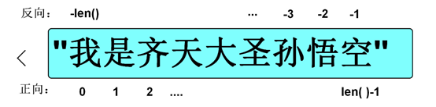


### 编码

1. 字节byte：计算机最小存储单位，等于8 位bit.

2. 字符：单个的数字，文字与符号。

3. 字符集(码表)：存储字符与二进制序列的对应关系。

4. 编码：将字符转换为对应的二进制序列的过程。

5. 解码：将二进制序列转换为对应的字符的过程。

6. 编码方式：

    --ASCII编码：包含英文、数字等字符，每个字符1个字节。

     --GBK编码：兼容ASCII编码，包含21003个中文；英文1个字节，汉字2个字节。

     --Unicode字符集：国际统一编码，旧字符集每个字符2字节，新字符集4字节。

     --UTF-8编码：Unicode的存储与传输方式，英文1字节，中文3字节。

#### 相关函数

1. <font color='red'>ord(字符串):返回该字符串的Unicode码。</font>

2. <font color='red'>chr(整数):返回该整数对应的字符串。</font>

### 字面值

#### 单引和双引号的区别

1. 单引号内的双引号不算结束符

2. 双引号内的单引号不算结束符

3. 单双引号不会相互干扰

#### 三引号作用

1. 换行会自动转换为换行符\n

2. 三引号内可以包含单引号和双引号

3. 作为文档字符串

4. 字符串各种写法

    ```python
    # 双引号     建议使用双引号
    message = "我叫qtx."
    # 单引号
    message = '我叫qtx.'
    #三引号：可见即所得
    message = '''我叫
     			qt
                x.'''
    print(message)
    ```


#### 转义字符

```python
# 1.	改变字符的原始含义。
	\’  
    \”  
    \”””  
    \n  # 换行符
    \\  
    \t  # 水平制表符
    \0
# 2.	原始字符串：取消转义。
			a = r"C:\newfile\test.py"
```


#### 字符串格式化

1. 定义：

    生成一定格式的字符串。

2. 语法：

    字符串%(变量)

    "我的名字是%s年龄是%s" % (name, age)

3. 类型码：

    %s 字符串   %d整数   %f 浮点数

    *#* *字符串拼接**
    \* subject = **"I"
    ** predicate = 1 + 1
     object = 8.382
     print(**"****主语：****%s,****谓语****:%d,****宾语****:%.2f"** % (subject, predicate, object))

 

 

f-string 格式话字符串以 f 开头，后面跟着字符串，字符串中的表达式用大括号 {} 包起来，它会将变量或表达式计算后的值替换进去，实例如下：

```python
name = 'Runoob'
f'Hello {name}'  # 替换变量

f'{1+2}'     # 使用表达式
>>> '3'

w = {'name': 'Runoob', 'url': 'www.runoob.com'}
f'{w["name"]}: {w["url"]}'
>>> 'Runoob: www.runoob.com'

 
first_number = random.randint(1, 10)
second_number = random.randint(1, 10)
sum= int(input(f'请输入{first_number}与{second_number}的和：'))


```


## 列表 list

### 定义

由一系列变量组成的<font color='red'>可变序列容器</font>。

### 基础操作


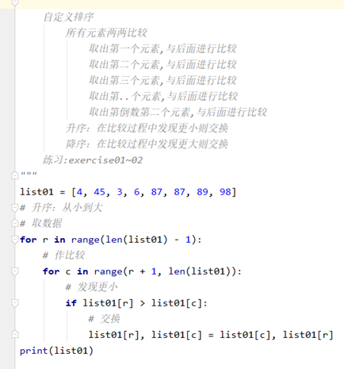

1. 创建列表： 

    列表名 = []  

    列表名 = list(可迭代对象)

    

```python
# 1. 创建
list01 = []
# -- 已知元素
list01 = ["悟空", "八戒", "唐僧"]
list02 = list()
# -- 已知其他容器
list02 = list("我是齐天大圣孙悟空.")

```

2. 添加元素：

    列表名.append(元素) 

    列表.insert(索引，元素)  插入

3. 定位元素：

    列表名[索引] = 元素

    变量 = 列表名[索引]

    变量 = 列表名[切片] # 赋值给变量的是切片所创建的新列表 

    列表名[切片] = 容器 # 右侧必须是可迭代对象，左侧切片没有创建新列表。

```python
# 定位
#    -- 获取
print(list01[1])  # 打印第二个元素
item01 = list01[-2]  # 将倒数第二个元素赋值给变量item01
print(list01[:4])  # 获取前四个元素 【通过切片获取列表元素,会创建新列表】

```

遍历列表：
					正向：
							for	变量名	in	列表名:
									变量名就是元素

​       	反向：
​							for	索引名	in	range(len(列表名)-1,-1,-1):
​									列表名[索引名]就是元素

<font color='red'>遍历删除列表的元素时，进行反向遍历</font>

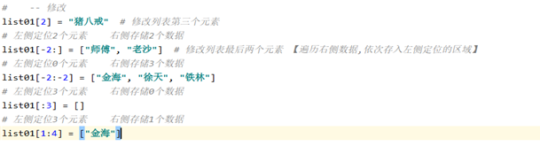

4. 删除元素：

    列表名.remove(元素)       <font color='red'>remove会遍历列表</font>

    del	列表名[索引或切片]

```python
# 4. 删除
# -- 根据元素
if "金海2" in list01:
    list01.remove("金海2")  # 【内部会从头到尾搜索第一个满足条件的元素,有则删除没则异常】
# -- 根据索引/切片
del list01[-1]
del list01[:]

```

### <font color='red'>列表各种操作的内存示意图</font>


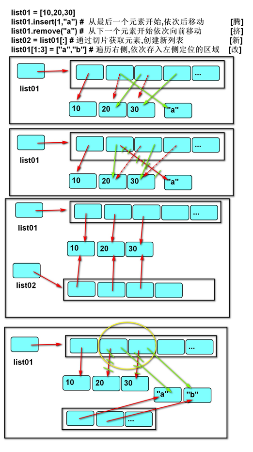

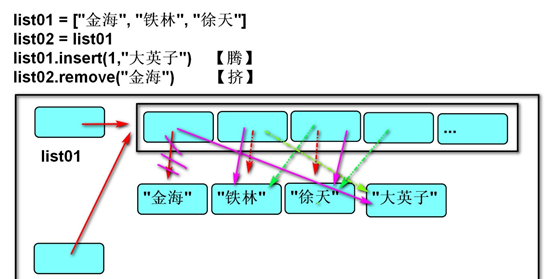

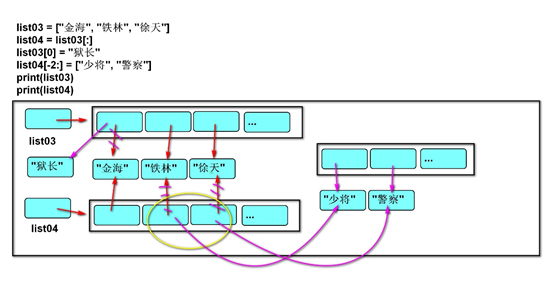


### 深拷贝和浅拷贝

浅拷贝：复制过程中,只复制一层变量,不会复制深层变量绑定的对象的复制过程。

深拷贝：复制整个依懒的变量。

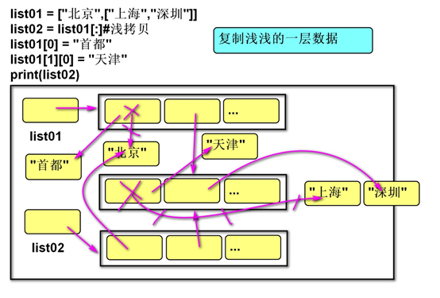


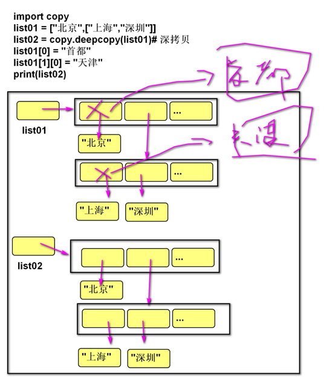

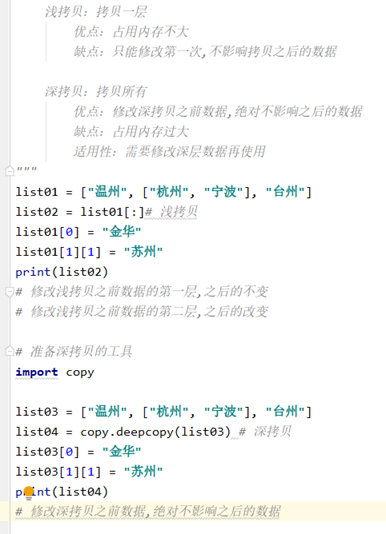


### 列表VS字符串

1. 列表和字符串都是序列,元素之间有先后顺序关系。

2. 字符串是不可变的序列,列表是可变的序列。

3. 字符串中每个元素只能存储字符,而列表可以存储任意类型。

4. 列表和字符串都是可迭代对象。

5. 函数：

    将多个字符串拼接为一个。

    result = "连接符".join(列表)

    需求：根据**xx**逻辑循环拼接一个字符串
    核心思想：不要使用不可变的字符串+=
    要可变的列表append
    启发：<font color='red'>再对不可变对象进行频繁修改,就先存储到可变对象中,最后再还原为不可变对象。</font>

     										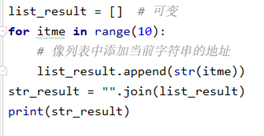
    
    将一个字符串拆分为多个。
    
    列表 = “a-b-c-d”.split(“分隔符”)

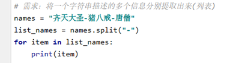


### 列表推导式

1. 定义：

    使用简易方法，将可迭代对象转换为列表。

2. 语法：

    变量	=	[表达式	for	变量	in	可迭代对象]

    变量	=	[表达式	for	变量	in	可迭代对象	if	条件]      <font color='red'>不带 else 的写法 if 在后面</font>

    变量	=	[表达式	if	条件	else	表达式	for	变量	in	可迭代对象]		<font color='red'>带 else 的写法 if 在前面</font>

3. 说明:

    如果if真值表达式的布尔值为False,则可迭代对象生成的数据将被丢弃。

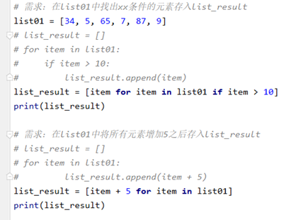

```python
# 带 else 的写法
#1-100中，不是3的倍数的数去相反数，其余的数保持不变

q = [x if x%3==0 else -x for x in range(1,101)]
```

### 列表推导式嵌套

不推介使用改语法，可读性差

1. 语法：

    变量 = [表达式 for 变量1 in 可迭代对象1 for 变量2 in可迭代对象2]

2. 传统写法：

    ```python
    result = []
    
    for r in ["a", "b", "c"]:
        for c in ["A", "B", "C"]:
            result.append(r + c)
    ```

3. 推导式写法：

    ```python
    result = [r + c for r in list01 for c in list02]
    ```

### 列表的扩容机制

每个版本扩容具体算法有所不同，但是主要机制相同：

只有在插入元素时才会触发扩容

（1）当前列表容量 > 已有数据项个数 + 1 and 已有数据项个数 >= 当前列表容量的一半

​			（没装满，且装了超过一半，直接插入数据，不触发扩容。不到一半会触发缩容？）

​			则直接添加数据项，不进行扩容

（2）当前列表容量 < 已有数据项个数 + 1

​		（装不下了，触发扩容，具体扩容数量每个解释器版本有所不同，下面给出一个demo 去计算）

​			则先进行扩容后再添加数据项

```python
import sys

now_size = None
now_count = 0

def print_list_size(nums=None):
    global now_size, now_count
    nums_size = sys.getsizeof(nums)
    if nums_size == now_size:
        return
    now_size = nums_size
    if nums:
        print(f"id({id(nums)}) v:{nums[-1]} len:{len(nums)} size:{nums_size} add_count:{nums[-1]-now_count}")
    else:
        print(f"id({id(nums)}) v:{nums} len:{len(nums)} size:{nums_size}")
        return
    now_count = nums[-1]


def test_0_4():
    data = []
    print_list_size(nums=data)
    for i in range(1, 50000):
        data.append(i)
        print_list_size(nums=data)


test_0_4()
```

```shell
# len:列表长度, size: 列表所占内存空间大小, add_count:此次扩容，列表所增加的容量，指增加的元素的空间，不是实际增加的内存的空间
# python = 3.10		以下结果是3.10版本测试所得，与其它版本会略有不同
id(1157656671104) v:[] len:0 size:56
id(1157656671104) v:1 len:1 size:88 add_count:1
id(1157656671104) v:5 len:5 size:120 add_count:4
id(1157656671104) v:9 len:9 size:184 add_count:4
id(1157656671104) v:17 len:17 size:248 add_count:8
id(1157656671104) v:25 len:25 size:312 add_count:8
id(1157656671104) v:33 len:33 size:376 add_count:8
id(1157656671104) v:41 len:41 size:472 add_count:8
id(1157656671104) v:53 len:53 size:568 add_count:12
id(1157656671104) v:65 len:65 size:664 add_count:12
id(1157656671104) v:77 len:77 size:792 add_count:12
id(1157656671104) v:93 len:93 size:920 add_count:16
id(1157656671104) v:109 len:109 size:1080 add_count:16
id(1157656671104) v:129 len:129 size:1240 add_count:20
id(1157656671104) v:149 len:149 size:1432 add_count:20
.
.
.
id(1157656671104) v:27377 len:27377 size:246488 add_count:3048
id(1157656671104) v:30805 len:30805 size:277336 add_count:3428
id(1157656671104) v:34661 len:34661 size:312024 add_count:3856
id(1157656671104) v:38997 len:38997 size:351064 add_count:4336
id(1157656671104) v:43877 len:43877 size:394968 add_count:4880
id(1157656671104) v:49365 len:49365 size:444376 add_count:5488
```

**列表和元组的区别就是：在元素数量固定的情况下，元组更加节省空间。**

## 元组 tuple

### 定义

1. 由一系列变量组成的不可变序列容器。

2. 不可变是指一但创建，不可以再添加/删除/修改元素。  

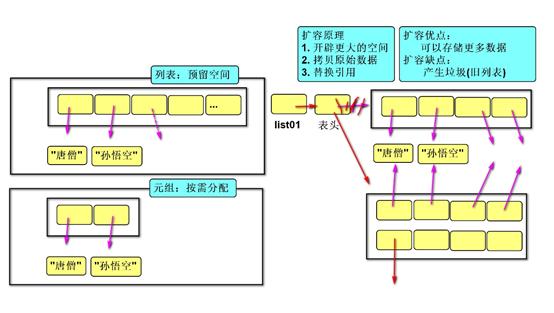


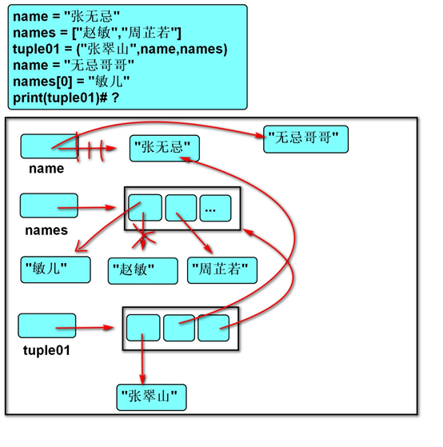

### 基础操作

1. 创建空元组：

    元组名 = ()

    元组名 = tuple()

2. 创建非空元组：

    元组名 = (20,)

      元组名 = (1, 2, 3)

    元组名 = 100,200,300

    元组名 = tuple(可迭代对象)

3. 获取元素： 

    变量 = 元组名[索引]

    变量 = 元组名[切片] # 赋值给变量的是切片所创建的新列表 

4. 遍历元组：

    ​    正向：

    ​    for 变量名 in 元组名:

    ​       	变量名就是元素

    ​     反向：

    ​    for 索引名 in range(len(列表名)-1,-1,-1):

    ​       	元组名[索引名]就是元素

### 作用

1. 元组与列表都可以存储一系列变量，由于列表会预留内存空间，所以可以增加元素。

2. <font color='red'>元组会按需分配内存，所以如果变量数量固定，建议使用元组，因为占用空间更小。</font>

3. 应用：

    变量交换的本质就是创建元组：x, y = （y, x ）

    格式化字符串的本质就是创建元祖："姓名:%s, 年龄:%d" % ("tarena", 15)


## 字典 dict

### 定义

1. 由一系列键值对组成的可变散列容器。

2. 散列：对键进行哈希运算，确定在内存中的存储位置，每条数据存储无先后顺序。

3. 键必须惟一且不可变(字符串/数字/元组)，值没有限制。

### 基础操作

1. 创建字典：

    字典名 = {键1：值1，键2：值2}

    字典名 = dict (可迭代对象) 

    字典名 = {}       # 创建空字典

    

```python
# 序列 --> 字典:一分为二
# dict02 = dict([(10001,"金海"), [10002, "铁林"], "徐天"])
list01 = [(10001, "金海"), (10002, "铁林"), (10003, "徐天")]
dict02 = dict(list01)

```

2. 添加/修改元素：

    语法:

      字典名[键] = 数据

    说明:

       键不存在，创建记录。

       键存在，修改值。

3. 获取元素：

    变量 = 字典名[键] # 没有键则错误

4. 遍历字典：

    for 键名 in 字典名:

       	 字典名[键名]

    如果定义了两个键名，程序会将一个键拆分成两份，若无法拆分则报错

    for 键名,值名 in 字典名.items():

    ​    	语句

 

5. 合并字典

    a = {"A":1,"B":2},b = {"C":3,"D":4}

    x = {**a,**b}


6. 删除元素：

    del 字典名[键]


### 字典推导式

1. 定义：

    使用简易方法，将可迭代对象转换为字典。

2. 语法:

    {键:值	for	变量	in	可迭代对象}

    {键:值	for	变量	in	可迭代对象	if	条件}

    {键:值	if	条件	else	键:值	for	变量	in	可迭代对象}

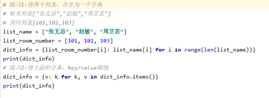

### 字典 VS 列表

1. 都是可变容器。

2. <font color='red'>获取元素方式不同,列表用索引,字典用键。</font>

3. <font color='red'>字典的插入,删除,修改的速度快于列表。</font>

4. <font color='red'>列表的存储是有序的,字典的存储是无序的。</font>


## 集合 set

需要用集合进行运算的时候将列表转化为集合就好了，无需专门使用集合来储存数据

### 定义

集合set
			相当于只有**key**没有**value**的字典
作用：
		去重复
		数学运算

1. 由一系列不重复的不可变类型变量(元组/数/字符串)组成的可变散列容器。

2. 相当于只有键没有值的字典(键则是集合的数据)。


### 基础操作

1. 创建空集合：

    集合名 = set() 

    集合名 = set(可迭代对象)

2. 创建具有默认值集合：

    集合名 = {1, 2, 3}

    <font color='red'>集合名 = set(可迭代对象)</font>

3. 添加元素：

    <font color='red'>集合名.add(元素)</font>

4. 删除元素：

    <font color='red'>集合名.discard(元素)</font>

### 运算

<font color='red'>大键盘上的  SHIFT  + 【7，6，反斜杠】三个键，分别代表  与、或、非</font>

1. 交集&：返回共同元素。

    s1 = {1, 2, 3}

    s2 = {2, 3, 4}

    s3 = s1 & s2 # {2, 3}

 

2. 并集：返回不重复元素

    s1 = {1, 2, 3}

    s2 = {2, 3, 4}

    s3 = s1 | s2 # {1, 2, 3, 4}

 

3. 补集-：返回只属于其中之一的元素

    s1 = {1, 2, 3}

    s2 = {2, 3, 4}

    s1 - s2 # {1} 属于s1但不属于s2

    补集^：返回不同的的元素

     s1 = {1, 2, 3}

     s2 = {2, 3, 4}

     s3 = s1 ^ s2 # {1, 4} 等同于(s1-s2 | s2-s1)

 

4. 子集<：判断一个集合的所有元素是否完全在另一个集合中

5. 超集>：判断一个集合是否具有另一个集合的所有元素

       s1 = {1, 2, 3}
       
       s2 = {2, 3}
       
       s2 < s1 # True
       
       s1 > s2 # True

 

6. 相同或不同== 	!=：判断集合中的所有元素是否和另一个集合相同。

       s1 = {1, 2, 3}
       
       s2 = {3, 2, 1}
       
       s1 == s2 # True
       
       s1 != s2 # False

    ​	子集或相同,超集或相同 <= >= 

### 集合推导式

1. 定义：

    使用简易方法，将可迭代对象转换为集合。

2. 语法:      字典推导式如果不写成键值对就变成了集合推导式

    {表达式 for 变量 in 可迭代对象}

    {表达式 for 变量 in 可迭代对象 if 条件}

# 函数 function

函数内存示意图：

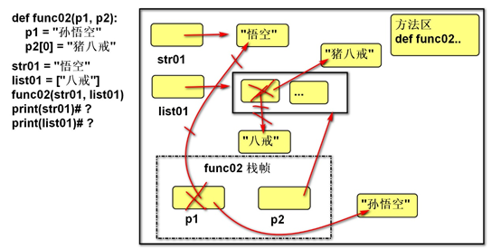

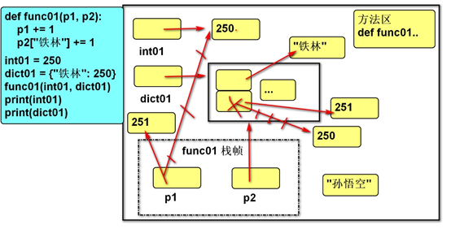


## 定义

1. 用于封装一个特定的功能，表示一个功能或者行为。

2. 函数是可以重复执行的语句块, 可以重复调用。

## 作用

提高代码的可重用性和可维护性（代码层次结构更清晰）。

## 定义函数

<font color='red'>函数设计思想小而精，一个函数只表达一个功能</font>

 

1. 语法：

    def	函数名(形式参数):

       	函数体

2. 说明：

    def	关键字：全称是define，意为”定义”。

    函数名：对函数体中语句的描述，规则与变量名相同。

    形式参数：方法定义者要求调用者提供的信息。

    函数体：完成该功能的语句。

3. 函数的第一行语句建议使用文档字符串描述函数的功能与参数。

4. 给函数写注释的时候，要写出变量类型

## 调用函数

1. 语法：函数名(实际参数) 

2. 说明：根据形参传递内容。

## 返回值

1. 定义：

    方法定义者告诉调用者的结果。

2. 语法：

    return 数据 

3. 说明：

    return后没有语句，相当于返回 None。

    函数体没有return，相当于返回None。

## 可变／不可变类型在传参时的区别

```python
# 2. 调用函数时会在内存中开辟一块空间(栈帧),存储函数内部创建的变量
# 3. 函数执行后,该空间(栈帧)立即释放
# 结论：
# 不可变类型的数据传参时，函数内部不会改变原数据的值。
# 可变类型的数据传参时，函数内部可以改变原数据。
def func02(p1, p2):
    p1 = "孙悟空" # 修改的是栈帧中变量p1存储的地址（没有修改传入的字符串）
    p2[0] = "猪八戒" # 修改传入容器存储的数据地址

str01 = "悟空" # 不可变
list01 = ["八戒"] # 可变
func02(str01, list01)
print(str01) # 悟空
print(list01) # ['猪八戒']

```

1. 不可变类型参数有:

    数值型(整数，浮点数,复数)

    布尔值bool

    None 空值

    字符串str

    元组tuple

2. 可变类型参数有:

    列表 list

    字典 dict

    集合 set

3. 传参说明：

    不可变类型的数据传参时，函数内部不会改变原数据的值。

    可变类型的数据传参时，函数内部可以改变原数据。

## 函数参数

### 实参传递方式argument

```python
函数参数
    实际参数：如何与形参对应
        位置实参：按照顺序
            序列实参：使用容器包装信息,[拆]分后按顺序对应
        关键字实参：按照名称
            字典实参：使用容器包装信息,[拆]分后按顺序名称

    形式参数：约束实参传递方式
        默认参数：可选
        位置形参: 必填
            星号元组形参：使用容器包装信息,[合]并为一个元组
                   作用：位置实参可以数量无限
        命名关键字形参：强制要求使用关键字实参
            双星号字典形参：使用容器包装信息,[合]并为一个字典
                  作用：关键字实参可以数量无限

```

#### 位置传参

1.传递可变对象（条件）

2.修改可变对象（条件）
			（结论）无需通过return返回结果
			定义：实参与形参的位置依次对应。

```python
def func01(p1, p2, p3):
	pass

func01(1, 2, 3)

```

#### 序列传参

定义：实参根据形参的名字进行对应。

```python
def func01(p1, p2, p3):
	pass

list01 = [1, 2, 3]
func01(*list01)

```

#### 字典关键字传参

1.	定义：实参用**将字典拆解后与形参的名字进行对应。
2.	作用：配合形参的缺省参数，可以使调用者随意传参。

```python
def func01(p1, p2, p3):
	pass

dict01 = {"p3": 3, "p1": 1, "p2": 2}
func01(**dict01)

```

### 形参定义方式parameter

#### 缺省参数

```python
# 1. 默认形参：可选
def func02(p1=0, p2="", p3=0.0):
	pass
```

1. 语法：

    def	函数名(形参名1=默认实参1, 形参名2=默认实参2, ...):

       	函数体

2. 说明：

    带默认值的参数为缺省参数

    缺省参数必须自右至左依次存在，<font color='red'>如果一个参数有缺省参数，则其右侧的所有参数都必须有缺省参数。</font>

    缺省参数可以有0个或多个，甚至全部都有缺省参数。

#### 位置形参

```python
#  2.位置形参：必填
def func01(p1, p2, p3):
    pass

```

#### 星号元组形参

```python
# 3. 星号元组形参
def func04(*args):
    print(args)


func04()  # 没有实参,形参得到的是空元组()
func04(1, 2, 3)  # 有3个实参,形参得到的是1个元组(1, 2, 3)
list01 = ["a", "b"]
func04(*list01)  # 相当于 func04("a","b")  有2个实参,形参得到的是1个元组('a', 'b')


# func04(p1 = 1,p2 =2) 星号元组形参只负责合并位置实参(不管关键字实参)

```

1. 作用：

    收集多余的位置传参。将多余位置的参数打包成一个元组传递

2. 说明：

    一般命名为'args'

    形参列表中最多只能有一个

#### 命名关键字形参

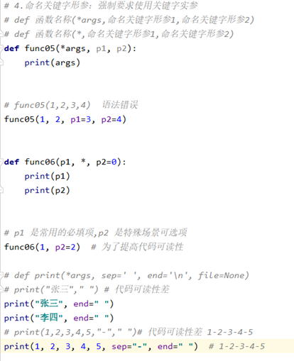

1. 作用：

    强制实参使用关键字传参


#### 双星号字典形参

```python
# 5. 双星号字典形参
def func07(**kwargs):
    print(kwargs)


func07(a=1, b=2, c=3)  # 传递三个关键字实参,形参接收的是一个字典{'a': 1, 'b': 2, 'c': 3}
func07()  # 没有,形参接收的是一个字典  {}

```

1. 作用：

    收集多余的关键字传参

2. 说明:

    一般命名为  kwargs

    形参列表中最多只能有一个


#### 参数自左至右的顺序

位置形参 --> 星号元组形参 --> 命名关键字形参 --> 双星号字典形参

# 作用域LEGB

1. 作用域：变量起作用的范围。

2. Local局部作用域：函数内部。

3.  Enclosing  外部嵌套作用域 ：函数嵌套。

4. Global全局作用域：模块(.py文件)内部。 

5. Builtin内置模块作用域：builtins.py文件。


## 变量名的查找规则

1. 由内到外：L -> E -> G -> B

2. 在访问变量时，先查找本地变量，然后是包裹此函数外部的函数内部的变量，之后是全局变量，最后是内置变量。


## 局部变量

1. 定义在函数内部的变量(形参也是局部变量)

2. 只能在函数内部使用

3. 调用函数时才被创建，函数结束后自动销毁

## 全局变量

1. 定义在函数外部,模块内部的变量。

2. 在整个模块(py文件)范围内访问（但函数内不能将其直接赋值）。

## global 语句

1. 作用：

    在函数内部修改全局变量。

    在函数内部定义全局变量(全局声明)。

2. 语法：

    global 变量1, 变量2, …

3. 说明

    <font color='red'>在函数内直接为全局变量赋值，视为创建新的局部变量。</font>

    ```python
    a = 1   # 全局变量
    def func01():
        a = 2   # 这个a是局部变量
    ```

    <font color='red'>不能先声明局部的变量，再用global声明为全局变量。</font>

    ```python
    In [1]: a = 1                                                                                                                                                       In [2]: def func01():                                                             	...:     a = 2                                                                	...:     global a                                                               	File "<ipython-input-2-1327af6e3792>", line 3                                 		global a                                                                   				^
    SyntaxError: name 'a' is assigned to before global declaration
        
    ```

## nonlocal 语句

1. 作用：

    在内层函数修改外层嵌套函数内的变量

2. 语法

    nonlocal 变量名1,变量名2, ...

3. 说明

    在被嵌套的内函数中进行使用


