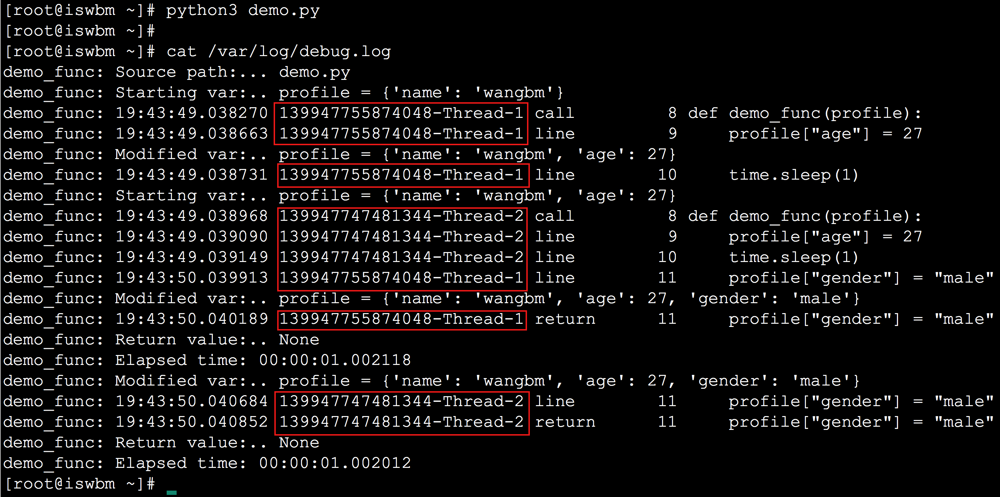

# 关于作者

- 姓名： 王炳明
- 微信： stromwbm
- 公众号： 《Python编程时光》&《Go编程时光》
- Email： [wongbingming@163.com](mailto:wongbingming@163.com)
- GitHub： https://github.com/iswbm

# 前言

## 关于博客

© Copyright 2020, Python编程时光

Built with [Sphinx](http://sphinx-doc.org/) using a [theme](https://github.com/rtfd/sphinx_rtd_theme) provided by [Read the Docs](https://readthedocs.org/).

## 作者的话

Python 是一门对编程新手非常友好的语言，通常花个两个月的时间，就能开始自己写代码，做项目。

但也因为过于高级，给予了开发者很高的自由度。这本身没有问题，但是想要写出优雅的 Python 代码，需要 Coder 有一定的代码审美能力，才能很好的驾驭。

这本电子教程，是我个人花了很多的时间，将自己这些年来写 Python 的一些心得整理所成。

内容包含各种你在教材上、培训视频中无法习得的冷门知识，魔法知识，以及开发技巧，不管对于新手还是老手，我想都会有一定的帮助。

# 小玉的玉转载于2021.12.04

转载这本手册，略作修改之后，仅作为自己的笔记使用

# 第一章：魔法冷知识

这个章节记录了一些大多数开发者并不知晓的冷知识，内容基本延续 v1.0 。

## 1.1 默默无闻的省略号很好用

在Python中，一切皆对象，省略号也不例外。

在 Python 3 中你可以直接写 `...` 来得到它

```
>>> ...
Ellipsis
>>> type(...)
<class 'ellipsis'>
```

而在 Python 2 中没有`...` 这个语法，只能直接写Ellipsis来获取。

```
>>> Ellipsis
Ellipsis
>>> type(Ellipsis)
<type 'ellipsis'>
>>>
```

它转为布尔值时为真

```
>>> bool(...)
True
```

最后，这东西是一个单例。

```
>>> id(...)
4362672336
>>> id(...)
4362672336
```

那这东西有啥用呢？

1. 它是 Numpy 的一个语法糖
2. 在 Python 3 中可以使用 … 代替 pass

```python
$ cat demo.py
def func01():
    ...

def func02():
    pass

func01()
func02()

print("ok")

$ python3 demo.py
ok
```

## 1.3 可直接运行的 zip 包

我们可以经常看到有 Python 包，居然可以以 zip 包进行发布，并且可以不用解压直接使用。

这与大多数人的认识的 Python 包格式不一样，正常人认为 Python 包的格式要嘛 是 egg，要嘛是whl 格式。

那么这个zip 是如何制作的呢，请看下面的示例。

```shell
[root@localhost ~]# ls -l demo
total 8
-rw-r--r-- 1 root root 30 May  8 19:27 calc.py
-rw-r--r-- 1 root root 35 May  8 19:33 __main__.py
[root@localhost ~]#
[root@localhost ~]# cat demo/__main__.py
import calc

print(calc.add(2, 3))
[root@localhost ~]#
[root@localhost ~]# cat demo/calc.py
def add(x, y):
    return x+y
[root@localhost ~]#
[root@localhost ~]# python -m zipfile -c demo.zip demo/*
[root@localhost ~]#
```

制作完成后，我们可以执行用 python 去执行它

```shell
[root@localhost ~]# python demo.zip
5
[root@localhost ~]#
```

## 1.4 反斜杠的倔强: 不写最后

`\` 在 Python 中的用法主要有两种

**1、在行尾时，用做续行符**

```
[root@localhost ~]$ cat demo.py
print("hello "\
   "world")
[root@localhost ~]$
[root@localhost ~]$ python demo.py
hello world
```

**2、在字符串中，用做转义字符，可以将普通字符转化为有特殊含义的字符。**

```
>>> str1='\nhello'　　＃换行
>>> print(str1)

hello
>>> str2='\thello'　　＃tab
>>> print(str2)
    hello
```

但是如果你用单`\`结尾是会报语法错误的

```
>>> str3="\"
  File "<stdin>", line 1
    str3="\"
           ^
SyntaxError: EOL while scanning string literal
```

就算你指定它是个 raw 字符串，也不行。

```shell
>>> str3=r"\"
  File "<stdin>", line 1
    str3=r"\"
            ^
SyntaxError: EOL while scanning string literal
```

## 1.6 简洁而优雅的链式比较

先给你看一个示例：

```
>>> False == False == True
False
```

你知道这个表达式为什么会会返回 False 吗？

它的运行原理与下面这个类似，是不是有点头绪了：

```
if 80 < score <= 90:
    print("成绩良好")
```

如果你还是不明白，那我再给你整个第一个例子的等价写法。

```
>>> False == False and False == True
False
```

这个用法叫做链式比较。

## 1.7 and 和 or 的短路效应

and 和 or 是我们再熟悉不过的两个逻辑运算符，在 Python 也有它的妙用。

- 当一个 **or 表达式**中所有值都为真，Python会选择第一个值
- 当一个 **and 表达式** 所有值都为真，Python 会选择最后一个值。

示例如下：

```python
>>>(2 or 3) * (5 and 6 and 7)
14  # 2*7
```

## 1.8 连接多个列表最极客的方式

```python
>>> a = [1,2]
>>> b = [3,4]
>>> c = [5,6]
>>>
>>> sum((a,b,c), [])
[1, 2, 3, 4, 5, 6]
```

## 1.9 字典居然是可以排序的？

在 Python 3.6 之前字典不可排序的思想，似乎已经根深蒂固。

```
# Python2.7.10
>>> mydict = {str(i):i for i in range(5)}
>>> mydict
{'1': 1, '0': 0, '3': 3, '2': 2, '4': 4}
```

假如哪一天，有人跟你说字典也可以是有序的，不要惊讶，那确实是真的

在 Python3.6 + 中字典已经是有序的，并且效率相较之前的还有所提升，具体信息你可以去查询相关资料。

```python
# Python3.6.7
>>> mydict = {str(i):i for i in range(5)}
>>> mydict
{'0': 0, '1': 1, '2': 2, '3': 3, '4': 4}
```

## 1.11 用户无感知的小整数池

为避免整数频繁申请和销毁内存空间，Python 定义了一个小整数池 [-5, 256] 这些整数对象是提前建立好的，不会被垃圾回收。

<font color='red'>以下代码请在 终端Python环境下测试，如果你是在IDE中测试，由于 IDE 的影响，效果会有所不同。</font>

```python
>>> a = -6
>>> b = -6
>>> a is b
False	

>>> a = 256
>>> b = 256
>>> a is b
True

>>> a = 257
>>> b = 257
>>> a is b
False

>>> a = 257; b = 257
>>> a is b
True
```

**问题又来了：最后一个示例，为啥是True？**

因为当你在同一行里，同时给两个变量赋同一值时，解释器知道这个对象已经生成，那么它就会引用到同一个对象。如果分成两行的话，解释器并不知道这个对象已经存在了，就会重新申请内存存放这个对象。

## 1.12 神奇的 intern 机制

[深入 Python 解释器源码，字符串驻留（intern）的原理！](https://mp.weixin.qq.com/s?__biz=MzUyOTk2MTcwNg==&mid=2247489580&idx=1&sn=65bf320762811fce27d7338b71869487&scene=21#wechat_redirect)

字符串类型作为Python中最常用的数据类型之一，Python解释器为了提高字符串使用的效率和使用性能，做了很多优化。

例如：Python解释器中使用了 intern（字符串驻留）的技术来提高字符串效率，什么是intern机制？就是同样的字符串对象仅仅会保存一份，放在一个字符串储蓄池中，是共用的，当然，肯定不能改变，这也决定了字符串必须是不可变对象。

<font color='red'>以下代码请在 终端Python环境下测试，如果你是在IDE中测试，由于 IDE 的影响，效果会有所不同。</font>

```python
>>> s1="hello"
>>> s2="hello"
>>> s1 is s2
True

# 如果有空格，默认不启用intern机制
>>> s1="hell o"
>>> s2="hell o"
>>> s1 is s2
False	

# 如果一个字符串长度超过20个字符，不启动intern机制
>>> s1 = "a" * 20
>>> s2 = "a" * 20
>>> s1 is s2
True

>>> s1 = "a" * 21
>>> s2 = "a" * 21
>>> s1 is s2
False	# python3.10 为 True,其它版本未测试
```

## 1.13 site-packages和 dist-packages

如果你足够细心，你会在你的机器上，有些包是安装在 **site-packages** 下，而有些包安装在 **dist-packages** 下。

**它们有什么区别呢？**

一般情况下，你只见过 site-packages 这个目录，而你所安装的包也将安装在 这个目录下。

而 dist-packages 其实是 debian 系的 Linux 系统（如 Ubuntu）才特有的目录，当你使用 apt 去安装的 Python 包会使用 dist-packages，而你使用 pip 或者 easy_install 安装的包还是照常安装在 site-packages 下。

Debian 这么设计的原因，是为了减少不同来源的 Python 之间产生的冲突。

如何查找 Python 安装目录

```python
>>> from distutils.sysconfig import get_python_lib
>>> print(get_python_lib())
/usr/lib/python2.7/site-packages
```

## 1.14 argument 和 parameter 的区别?

arguments 和 parameter 的翻译都是参数，在中文场景下，二者混用基本没有问题，毕竟都叫参数嘛。

但若要严格再进行区分，它们实际上还有各自的叫法

- parameter：形参（**formal parameter**），体现在函数内部，作用域是这个函数体。
- argument ：实参（**actual parameter**），调用函数实际传递的参数。

举个例子，如下这段代码，`"error"` 为 argument，而 msg 为 `parameter`。

```python
def output_msg(msg):
    print(msg)

output_msg("error")
```

## 1.15 /usr/bin/env python 有什么用？

我们经常会在别人的脚本或者项目的入口文件里看到第一行是下面这样

```
#!/usr/bin/python
```

或者这样

```
#!/usr/bin/env python
```

这两者有什么区别呢？

稍微接触过 linux 的人都知道 `/usr/bin/python` 就是我们执行 `python` 进入console 模式里的 `python`


而当你在可执行文件头里使用 `#!` + `/usr/bin/python` ，意思就是说你得用哪个软件 （python）来执行这个文件。

那么加和不加有什么区别呢？

不加的话，你每次执行这个脚本时，都得这样： `python xx.py` ，


有没有一种方式？可以省去每次都加 `python` 呢？

当然有，你可以文件头里加上`#!/usr/bin/python` ，那么当这个文件有可执行权限 时，只直接写这个脚本文件，就像下面这样。


明白了这个后，再来看看 `!/usr/bin/env python` 这个 又是什么意思 ？

当我执行 `env python` 时，自动进入了 python console 的模式。


这是为什么？和 直接执行 python 好像没什么区别呀

当你执行 `env python` 时，它其实会去 `env | grep PATH` 里（也就是 /usr/local/sbin:/usr/local/bin:/usr/sbin:/usr/bin:/root/bin ）这几个路径里去依次查找名为python的可执行文件。

找到一个就直接执行，上面我们的 python 路径是在 `/usr/bin/python` 里，在 `PATH` 列表里倒数第二个目录下，所以当我在 `/usr/local/sbin` 下创建一个名字也为 python 的可执行文件时，就会执行 `/usr/local/sbin/python` 了。

具体演示过程，你可以看下面。


那么对于这两者，我们应该使用哪个呢？

个人感觉应该优先使用 `#!/usr/bin/env python`，因为不是所有的机器的 python 解释器都是 `/usr/bin/python` 。

## 1.16 dict() 与 {} 生成空字典有什么区别？

[] 和 list() 也是一样的

在初始化一个空字典时，有的人会写 dict()，而有的人会写成 {}

很多人会想当然的认为二者是等同的，但实际情况却不是这样的。

在运行效率上，{} 会比 dict() 快三倍左右。

那为什么会这样呢？

探究这个过程，可以使用 dis 模块

当使用 {} 时

```
$ cat demo.py
{}
$
$ python -m dis demo.py
  1           0 BUILD_MAP                0
              2 POP_TOP
              4 LOAD_CONST               0 (None)
              6 RETURN_VALUE
```

当使用 dict() 时：

```
$ cat demo.py
dict()
$
$ python -m dis demo.py
  1           0 LOAD_NAME                0 (dict)
              2 CALL_FUNCTION            0
              4 POP_TOP
              6 LOAD_CONST               0 (None)
              8 RETURN_VALUE
```

可以发现使用 dict()，会多了个调用函数的过程，而这个过程会有进出栈的操作，相对更加耗时。

## 1.18 正负得负，负负得正

从初中开始，我们就开始接触了`负数` ，并且都知道了`负负得正` 的思想。

Python 作为一门高级语言，它的编写符合人类的思维逻辑，包括 `负负得正` 。

```python
>>> 5-3
2
>>> 5--3
8
>>> 5+-3
2
>>> 5++3
8
>>> 5---3
2
```

## 1.19 return不一定都是函数的终点


众所周知，try…finally… 的用法是：不管try里面是正常执行还是有报异常，最终都能保证finally能够执行。

同时我们又知道，一个函数里只要遇到 return 函数就会立马结束。

那问题就来了，以上这两种规则，如果同时存在，Python 解释器会如何选择？哪个优先级更高？

写个示例验证一下，就明白啦

```python
>>> def func():
...     try:
...         return 'try'
...     finally:
...         return 'finally'
...
>>> func()
'finally'
```

从输出中，我们可以发现：在try…finally…语句中，try中的 return 会被直接忽视（这里的 return 不是函数的终点），因为要保证 finally 能够执行。

**如果 try 里的 return 真的是直接被忽视吗？**

我们都知道如果一个函数没有 return，会隐式的返回 None，假设 try 里的 return 真的是直接被忽视，那当finally 下没有显式的 return 的时候，是不是会返回None呢？

还是写个 示例来验证一下：

```python
>>> def func():
...     try:
...         return 'try'
...     finally:
...         print('finally')
...
>>>
>>> func()
finally
'try'
>>>
```

从结果来看，当 finally 下没有 reutrn ，其实 try 里的 return 仍然还是有效的。

那结论就出来了，如果 finally 里有显式的 return，那么这个 return 会直接覆盖 try 里的 return，而如果 finally 里没有 显式的 return，那么 try 里的 return 仍然有效。

## 1.20 字符串里的缝隙是什么？

在Python中求一个字符串里，某子字符（串）出现的次数。

大家都懂得使用 count() 函数，比如下面几个常规例子：

```
>>> "aabb".count("a")
2
>>> "aabb".count("b")
2
>>> "aabb".count("ab")
1
```

但是如果我想计算空字符串的个数呢？

```
>>> "aabb".count("")
5
```

**奇怪了吧？**

不是应该返回 0 吗？怎么会返回 5？

实际上，在 Python 看来，两个字符之间都是一个空字符，通俗的说就是缝隙。

因此 对于 `aabb` 这个字符串在 Python 来看应该是这样的


理解了这个“**缝隙**” 的概念后，以下这些就好理解了。

```python
>>> (" " * 10).count("")
11
>>>
>>> "" in ""
True
>>>
>>> "" in "M"
True
```

## 1.24 时有时无的切片异常

这是个简单例子，alist 只有5 个元素，当你取第 6 个元素时，会抛出索引异常。这与我们的认知一致。

```python
>>> alist = [0, 1, 2, 3, 4]
>>> alist[5]
Traceback (most recent call last):
  File "<stdin>", line 1, in <module>
IndexError: list index out of range
```

但是当你使用 alist[5:] 取一个区间时，即使 alist 并没有 第 6个元素，也不抛出异常，而是会返回一个新的列表。

```python
>>> alist = [0, 1, 2, 3, 4]
>>> alist[5:]
[]
>>> alist[100:]
[]
```

## 1.30 break /continue 和 上下文管理器哪个优先级高？

众所周知，在循环体中（无论是 for 还是 while），continue 会用来跳入下一个循环，而 break 则用来跳出某个循环体。

同时我们又知道：在上下文管理器中，被包裹的程序主体代码结束会运行上下文管理器中的一段代码（通常是资源的释放）。

但如果把上下文管理器放在一个循环体中，而在这个上下文管理器中执行了 break ，是否会直接跳出循环呢？

换句话说，上下文管理器与 break/continue 这两个规则哪一个优先级会更高一些？

这个问题其实不难，只要做一下试验都能轻易地得出答案，难就难在很多对这个答案都是半猜半疑，无法肯定地回答。

试验代码如下：

```python
import time
import contextlib

@contextlib.contextmanager
def runtime(value):
    time.sleep(1)
    print("start: a = " + str(value))
    yield
    print("end: a = " + str(value))


a = 0
while True:
    a+=1
    with runtime(a):
        if a % 2 == 0:
            break
```

从输出的结果来看，当 a = 2 时执行了 break ，此时的并不会直接跳出循环，依然要运行上下文管理器里清理释放资源的代码（示例中，我使用 print 来替代）。

```
start: a = 1
end: a = 1
start: a = 2
end: a = 2
```

另外还有几个与此类似的问题，我这里也直接给出答案，不再细说了

1. continue 与 break 一样，如果先遇到上下文管理器会先进行资源的释放
2. 上面只举例了 while 循环体，而 for 循环也是同样的。

## 1.32 如何让大数变得更易于阅读？

当一个数非常大时，可能过百万，也可能上亿，太多位的数字 ，会给我们阅读带来很大的障碍。

比如下面这个数，你能一下子说出它是多少万呢，还是多少亿呢？

```
281028344
```

是不是没法很快的辩识出来？

这时候，你可以使用 `_` 来辅助标识，写成这样子就清晰多了

```
281_028_344
```

关键这种写法，在代码中并不会报错噢（Python2 不支持）

```python
>>> number=281_028_344
>>> number
281028344
```


# 第二章：魔法命令行

这个章节是全新的内容，主要介绍的是 Python Shell 的一些冷门玩法，这里面的内容，应该足够让你惊叹。

## 2.3 使用 json.tool 来格式化 JSON

假设现在你需要查看你机器上的json文件，而这个文件没有经过任何的美化，阅读起来是非常困难的。

```
$ cat demo.json
{"_id":"5f12d319624e57e27d1291fe","index":0,"guid":"4e482708-c6aa-4ef9-a45e-d5ce2c72c68d","isActive":false,"balance":"$2,954.93","picture":"http://placehold.it/32x32","age":36,"eyeColor":"green","name":"MasseySaunders","gender":"male","company":"TALAE","email":"masseysaunders@talae.com","phone":"+1(853)508-3237","address":"246IndianaPlace,Glenbrook,Iowa,3896","about":"Velitmagnanostrudexcepteurduisextemporirurefugiataliquasunt.Excepteurvelitquiseuinexinoccaecatoccaecatveliteuet.Commodonisialiquipirureminimconsequatminimconsecteturipsumsitex.\r\n","registered":"2017-02-06T06:42:20-08:00","latitude":-10.269827,"longitude":-103.12419,"tags":["laborum","excepteur","veniam","reprehenderit","voluptate","laborum","in"],"friends":[{"id":0,"name":"DorotheaShields"},{"id":1,"name":"AnnaRosales"},{"id":2,"name":"GravesBryant"}],"greeting":"Hello,MasseySaunders!Youhave8unreadmessages.","favoriteFruit":"apple"}
```

这时候你就可以使用 python 的命令行来直接美化。

```shell
$ python -m json.tool demo.json
{
    "_id": "5f12d319624e57e27d1291fe",
    "about": "Velitmagnanostrudexcepteurduisextemporirurefugiataliquasunt.Excepteurvelitquiseuinexinoccaecatoccaecatveliteuet.Commodonisialiquipirureminimconsequatminimconsecteturipsumsitex.\r\n",
    "address": "246IndianaPlace,Glenbrook,Iowa,3896",
    "age": 36,
    "balance": "$2,954.93",
    "company": "TALAE",
    "email": "masseysaunders@talae.com",
    "eyeColor": "green",
    "favoriteFruit": "apple",
    "friends": [
        {
            "id": 0,
            "name": "DorotheaShields"
        },
        {
            "id": 1,
            "name": "AnnaRosales"
        },
        {
            "id": 2,
            "name": "GravesBryant"
        }
    ],
    "gender": "male",
    "greeting": "Hello,MasseySaunders!Youhave8unreadmessages.",
    "guid": "4e482708-c6aa-4ef9-a45e-d5ce2c72c68d",
    "index": 0,
    "isActive": false,
    "latitude": -10.269827,
    "longitude": -103.12419,
    "name": "MasseySaunders",
    "phone": "+1(853)508-3237",
    "picture": "http://placehold.it/32x32",
    "registered": "2017-02-06T06:42:20-08:00",
    "tags": [
        "laborum",
        "excepteur",
        "veniam",
        "reprehenderit",
        "voluptate",
        "laborum",
        "in"
    ]
}
```

## 2.7 快速构建离线 HTML 帮助文档

当你不知道一个内置模块如何使用时，会怎么做呢？

百度？Google？

其实完全没必要，这里教你一个离线学习 Python 模块的方法。

是的，你没有听错。

就算没有外网网络也能学习 Python 模块.

你只要在命令行下输入 `python -m pydoc -p xxx` 命令即可开启一个 HTTP 服务，xxx 为端口，你可以自己指定。

```
$ python -m pydoc -p 5200
pydoc server ready at http://localhost:5200/
```

帮助文档的效果如下


## 2.8 最正确且优雅的装包方法

当你使用 pip 来安装第三方的模块时，通常会使用这样的命令

```
$ pip install requests
```

此时如果你的环境中有 Python2 也有 Python 3，那你使用这条命令安装的包是安装 Python2 呢？还是安装到 Python 3 呢？

就算你的环境上没有安装 Python2，那也有可能存在着多个版本的 Python 吧？比如安装了 Python3.8，也安装了 Python3.9，那你安装包时就会很困惑，我到底把包安装在了哪里？

但若你使用这样的命令去安装，就没有了这样的烦恼了

```python
# 在 python2 中安装
$ python -m pip install requests

# 在 python3 中安装
$ python3 -m pip install requests

# 在 python3.8 中安装
$ python3.8 -m pip install requests

# 在 python3.9 中安装
$ python3.9 -m pip install requests
```

## 2.9 往 Python Shell 中传入参数

往一个 Python 脚本传入参数，是一件非常简单的事情。

比如这样：

```
$ python demo.py arg1 arg2
```

我在验证一些简单的 Python 代码时，喜欢使用 Python Shell 。

那有没有办法在使用 Python Shell 时，向上面传递参数一样，传入参数呢？

经过我的摸索，终于找到了方法，具体方法如下：


## 2.14 把模块当做脚本来执行 7 种方法及原理

`python -m xxx.py` 的含义

### 1. 用法举例

前面的文章里其实分享过不少类似的用法。比如：

1、 快速搭建一个 HTTP 服务

```
# python2
$ python -m SimpleHTTPServer 8888

# python3
$ python3 -m http.server 8888
```

2、快速构建 HTML 帮助文档

```
$ python -m pydoc -p 5200
```

3、快速进入 pdb 调试模式

```
$ python -m pdb demo.py
```

4、最优雅且正确的包安装方法

```
$ python3 -m pip install requests
```

5、快速美化 JSON 字符串

```
$ echo '{"name": "MING"}' | python -m json.tool
```

6、快速打印包的搜索路径

```
$ python -m site
```

7、用于快速计算程序执行时长

```
$ python3 -m timeit '"-".join(map(str, range(100)))'
```

### 2. 原理剖析

上面的诸多命令，都有一个特点，在命令中都含有 `-m` 参数选项，而参数的值，SimpleHTTPServer， http.server， pydoc，pdb，pip， json.tool，site ，timeit这些都是模块或者包。

通常来说模块或者包，都是用做工具包由其他模块导入使用，而很少直接使用命令来执行（脚本除外）。

Python 给我们提供了一种方法，可以让我们将模块里的部分功能抽取出来，直接用于命令行式的调用。效果就是前面你所看到的。

想要使用 `-m` 的方式执行模块，有两种方式：

- 第一种：以 `-m <package>` 的方式执行，只要在 package 下写一个 `__main__.py` 的文件即可。
- 第二种：以 `-m <package.module>` 的方式执行，只要在 module 的代码中，定义一个 main 函数，然后在最外层写入下面这段固定的代码

```python
if __name__ == '__main__':
    main()
```

上面我将 `-m` 的使用情况分为两种，但是实际上，只有一种，对于第一种，你完全可以将 `-m <package>` 理解为 `-m <package.__main__>` 的简写形式。

## 2.16 快速计算字符串 base64编码

### 对字符串编码和解码

对一个字符串进行 base64 编码 和 解码（加上 `-d` 参数即可）

```python
$ echo "hello, world" | python3 -m base64
aGVsbG8sIHdvcmxkCg==

$ echo "aGVsbG8sIHdvcmxkCg==" | python3 -m base64 -d
hello, world
```

### 对文件进行编码和解码

在命令后面直接加文件的路径

```python
# 编码
$ python3 -m base64 demo.py
ZGVmIG1haW4oKToKICAgcHJpbnQoJ0hlbGxvIFdvcmxk8J+RjCcpCiAgIAppZiBfX25hbWVfXz09
J19fbWFpbl9fJzoKICAgbWFpbigpCg==

# 解码
$ echo "ZGVmIG1haW4oKToKICAgcHJpbnQoJ0hlbGxvIFdvcmxk8J+RjCcpCiAgIAppZiBfX25hbWVfXz09
J19fbWFpbl9fJzoKICAgbWFpbigpCg==" | python3 -m base64 -d
def main():
   print('Hello World👌')

if __name__=='__main__':
   main()
```

## 2.18 快速查看 Python 的环境信息

所有与 Python 相关的信息与配置，你都可以使用下面这条命令将其全部打印出来

```
$ python -m sysconfig
```

信息包括：

- 你当前的操作系统平台
- Python 的具体版本
- 包的搜索路径
- 以及各种环境变量


## 2.21 使用自带的 telnet 端口检测工具

若你想检测指定的机器上有没有开放某端口，但本机并没有安装 telnet 工具，不如尝试一下 python 自带的 telnetlib 库，亦可实现你的需求。

检查 192.168.56.200 上的 22 端口有没有开放。

```python
$ python3 -m telnetlib -d 192.168.56.200 22
Telnet(192.168.56.200,22): recv b'SSH-2.0-OpenSSH_7.4\r\n'
SSH-2.0-OpenSSH_7.4

Telnet(192.168.56.200,22): send b'\n'
Telnet(192.168.56.200,22): recv b'Protocol mismatch.\n'
Protocol mismatch.
Telnet(192.168.56.200,22): recv b''
*** Connection closed by remote host ***
```


# 第三章：炫技魔法操作

这个章节是取自我个人公众号原创专辑《Python炫技操作》里的文章，其中的多篇文章成为了爆款文章，不少大号均有转载。很多网友看完后直呼 “卧槽，居然还能这样？！”，如果你之前没有看过这几篇文章，那么你读这一章一定会大有收获。

## 3.1 八种合并列表的方式

### 1、最直观的相加

使用 `+` 对多个列表进行相加，你应该懂，不多说了。

```
>>> list01 = [1,2,3]
>>> list02 = [4,5,6]
>>> list03 = [7,8,9]
>>>
>>> list01 + list02 + list03
[1, 2, 3, 4, 5, 6, 7, 8, 9]
>>>
```

### 2、借助 itertools

itertools 在 Python 里有一个非常强大的内置模块，它专门用于操作可迭代对象。

在前面的文章中也介绍过，使用 `itertools.chain()` 函数先将可迭代对象（在这里指的是列表）串联起来，组成一个更大的可迭代对象。

最后你再利用 list 将其转化为 列表。

```
>>> from itertools import chain
>>> list01 = [1,2,3]
>>> list02 = [4,5,6]
>>> list03 = [7,8,9]
>>>
>>> list(chain(list01, list02, list03))
[1, 2, 3, 4, 5, 6, 7, 8, 9]
>>>
```

### 3、使用 * 解包

使用 `*` 可以解包列表，解包后再合并。

示例如下：

```
>>> list01 = [1,2,3]
>>> list02 = [4,5,6]
>>>
>>> [*list01, *list02]
[1, 2, 3, 4, 5, 6]
>>>
```

### 4、使用 extend

在字典中，使用 update 可实现原地更新，而在列表中，使用 extend 可实现列表的自我扩展。

```
>>> list01 = [1,2,3]
>>> list02 = [4,5,6]
>>>
>>> list01.extend(list02)
>>> list01
[1, 2, 3, 4, 5, 6]
```

### 5、使用列表推导式

Python 里对于生成列表、集合、字典，有一套非常 Pythonnic 的写法。

那就是列表解析式，集合解析式和字典解析式，通常是 Python 发烧友的最爱，那么今天的主题：列表合并，列表推导式还能否胜任呢？

当然可以，具体示例代码如下：

```
>>> list01 = [1,2,3]
>>> list02 = [4,5,6]
>>> list03 = [7,8,9]
>>>
>>> [x for l in (list01, list02, list03) for x in l]
[1, 2, 3, 4, 5, 6, 7, 8, 9]
>>>
```

### 6、使用 heapq

<font color='red'>heapq 是 Python 的一个标准模块，它提供了堆排序算法的实现。</font>

该模块里有一个 merge 方法，可以用于合并多个列表，如下所示

```
>>> list01 = [1,2,3]
>>> list02 = [4,5,6]
>>> list03 = [7,8,9]
>>>
>>> from heapq import merge
>>>
>>> list(merge(list01, list02, list03))
[1, 2, 3, 4, 5, 6, 7, 8, 9]
>>>
```

要注意的是，heapq.merge 除了合并多个列表外，它还会将合并后的最终的列表进行排序。

```
>>> list01 = [2,5,3]
>>> list02 = [1,4,6]
>>> list03 = [7,9,8]
>>>
>>> from heapq import merge
>>>
>>> list(merge(list01, list02, list03))
[1, 2, 4, 5, 3, 6, 7, 9, 8]
>>>
```

它的效果等价于下面这行代码：

```
sorted(itertools.chain(*iterables))
```

如果你希望得到一个始终有序的列表，那请第一时间想到 heapq.merge，因为它采用堆排序，效率非常高。但若你不希望得到一个排过序的列表，就不要使用它了。

### 7、借助魔法方法

有一个魔法方法叫 `__add__`，当我们使用第一种方法 list01 + list02 的时候，内部实际上是作用在 `__add__` 这个魔法方法上的。

所以以下两种方法其实是等价的

```
>>> list01 = [1,2,3]
>>> list02 = [4,5,6]
>>>
>>> list01 + list02
[1, 2, 3, 4, 5, 6]
>>>
>>>
>>> list01.__add__(list02)
[1, 2, 3, 4, 5, 6]
>>>
```

借用这个魔法特性，我们可以配合 reduce 这个方法来对多个列表进行合并，示例代码如下

```
>>> list01 = [1,2,3]
>>> list02 = [4,5,6]
>>> list03 = [7,8,9]
>>>
>>> from functools import reduce
>>> reduce(list.__add__, (list01, list02, list03))
[1, 2, 3, 4, 5, 6, 7, 8, 9]
>>>
```

### 8. 使用 yield from

在 yield from 后可接一个可迭代对象，用于迭代并返回其中的每一个元素。

因此，我们可以像下面这样自定义一个合并列表的工具函数。

```python
>>> list01 = [1,2,3]
>>> list02 = [4,5,6]
>>> list03 = [7,8,9]
>>>
>>> def merge(*lists):
...   for l in lists:
...     yield from l
...
>>> list(merge(list01, list02, list03))
[1, 2, 3, 4, 5, 6, 7, 8, 9]
>>
```

### 速度对比：

- 自身两两相加循环17次，最终列表长度393216，耗时对比：


0.0029914379119873047	  最直观的相加

0.012965679168701172        借助 itertools.chain()

0.004987001419067383        使用 * 解包 

<font color='red'>0.0019943714141845703      使用 extend</font>

0.020943641662597656        使用列表推导式

0.002991914749145508        借助魔法方法

0.027929067611694336        使用 yield from

- 每次加上一个[1,2] 的列表，循环10000次，最终列表长度20003，耗时对比：


0.15358781814575195	  最直观的相加

0.5086402893066406        借助 itertools.chain()

0.15761637687683105       使用 * 解包 

<font color='red'>0.00198841094970703      使用 extend</font>

1.6575322151184082        使用列表推导式

0.1585757732391357        借助魔法方法

2.55718994140625            使用 yield from

- 一次性对100000个列表相加，最终列表长度300000，耗时对比：


—————————————最直观的相加

<font color='red'>0.0080125331878662        借助 itertools.chain()</font>

—————————————使用 * 解包 

—————————————使用 extend

0.0129659175872802        使用列表推导式

—————————————借助魔法方法

0.017951965332031            使用 yield from

### 结论

- 多次对少量（单个）列表相加
    - 需要保留原列表：`+`
    - 直接在原列表上更改：`list.extend()`    比 `+` 要快，但是一次只能加一个
- 一次性将大量列表相加： `itertools.chain()`
- 需要有序的结果：`from heapq import merge`     `list(merge(list01, list02, list03))`

## 3.2 合并字典的 7 种方法

### 1、最简单的原地更新

字典对象内置了一个 update 方法，用于把另一个字典更新到自己身上。

```
>>> profile = {"name": "xiaoming", "age": 27}
>>> ext_info = {"gender": "male"}
>>>
>>> profile.update(ext_info)
>>> print(profile)
{'name': 'xiaoming', 'age': 27, 'gender': 'male'}
```

如果想使用 update 这种最简单、最地道原生的方法，但又不想更新到自己身上，而是生成一个新的对象，那请使用深拷贝。

```
>>> profile = {"name": "xiaoming", "age": 27}
>>> ext_info = {"gender": "male"}
>>>
>>> from copy import deepcopy
>>>
>>> full_profile = deepcopy(profile)
>>> full_profile.update(ext_info)
>>>
>>> print(full_profile)
{'name': 'xiaoming', 'age': 27, 'gender': 'male'}
>>> print(profile)
{"name": "xiaoming", "age": 27}
```

### 2、先解包再合并字典

使用 `**` 可以解包字典，解包完后再使用 dict 或者 `{}` 就可以合并。

```
>>> profile = {"name": "xiaoming", "age": 27}
>>> ext_info = {"gender": "male"}
>>>
>>> full_profile01 = {**profile, **ext_info}
>>> print(full_profile01)
{'name': 'xiaoming', 'age': 27, 'gender': 'male'}
>>>
>>> full_profile02 = dict(**profile, **ext_info)
>>> print(full_profile02)
{'name': 'xiaoming', 'age': 27, 'gender': 'male'}
```

若你不知道 `dict(**profile, **ext_info)` 做了啥，你可以将它等价于

```
>>> dict((("name", "xiaoming"), ("age", 27), ("gender", "male")))
{'name': 'xiaoming', 'age': 27, 'gender': 'male'}
```

### 3、借助 itertools

在 Python 里有一个非常强大的内置模块，它专门用于操作可迭代对象。

正好我们字典也是可迭代对象，自然就可以想到，可以使用 `itertools.chain()` 函数先将多个字典（可迭代对象）串联起来，组成一个更大的可迭代对象，然后再使用 dict 转成字典。

```
>>> import itertools
>>>
>>> profile = {"name": "xiaoming", "age": 27}
>>> ext_info = {"gender": "male"}
>>>
>>>
>>> dict(itertools.chain(profile.items(), ext_info.items()))
{'name': 'xiaoming', 'age': 27, 'gender': 'male'}
```

### 4、借助 ChainMap

如果可以引入一个辅助包，那我就再提一个， `ChainMap` 也可以达到和 `itertools` 同样的效果。

```
>>> from collections import ChainMap
>>>
>>> profile = {"name": "xiaoming", "age": 27}
>>> ext_info = {"gender": "male"}
>>>
>>> dict(ChainMap(profile, ext_info))
{'name': 'xiaoming', 'age': 27, 'gender': 'male'}
```

使用 ChainMap 有一点需要注意，当字典间有重复的键时，只会取第一个值，排在后面的键值并不会更新掉前面的（使用 itertools 就不会有这个问题）。

```
>>> from collections import ChainMap
>>>
>>> profile = {"name": "xiaoming", "age": 27}
>>> ext_info={"age": 30}
>>> dict(ChainMap(profile, ext_info))
{'name': 'xiaoming', 'age': 27}
```

### 5、使用dict.items() 合并

在 Python 3.9 之前，其实就已经有 `|` 操作符了，只不过它通常用于对集合（set）取并集。

利用这一点，也可以将它用于字典的合并，只不过得绕个弯子，有点不好理解。

你得先利用 `items` 方法将 dict 转成 dict_items，再对这两个 dict_items 取并集，最后利用 dict 函数，转成字典。

```
>>> profile = {"name": "xiaoming", "age": 27}
>>> ext_info = {"gender": "male"}
>>>
>>> full_profile = dict(profile.items() | ext_info.items())
>>> full_profile
{'gender': 'male', 'age': 27, 'name': 'xiaoming'}
```

当然了，你如果嫌这样太麻烦，也可以简单点，直接使用 list 函数再合并（示例为 Python 3.x ）

```
>>> profile = {"name": "xiaoming", "age": 27}
>>> ext_info = {"gender": "male"}
>>>
>>> dict(list(profile.items()) + list(ext_info.items()))
{'name': 'xiaoming', 'age': 27, 'gender': 'male'}
```

若你在 Python 2.x 下，可以直接省去 list 函数。

```
>>> profile = {"name": "xiaoming", "age": 27}
>>> ext_info = {"gender": "male"}
>>>
>>> dict(profile.items() + ext_info.items())
{'name': 'xiaoming', 'age': 27, 'gender': 'male'}
```

### 6、最酷炫的字典解析式

Python 里对于生成列表、集合、字典，有一套非常 Pythonnic 的写法。

那就是列表解析式，集合解析式和字典解析式，通常是 Python 发烧友的最爱，那么今天的主题：字典合并，字典解析式还能否胜任呢？

当然可以，具体示例代码如下：

```
>>> profile = {"name": "xiaoming", "age": 27}
>>> ext_info = {"gender": "male"}
>>>
>>> {k:v for d in [profile, ext_info] for k,v in d.items()}
{'name': 'xiaoming', 'age': 27, 'gender': 'male'}
```

### 7、Python 3.9 新特性

在 2 月份发布的 Python 3.9.04a 版本中，新增了一个抓眼球的新操作符： `|`， PEP584 将它称之为合并操作符（Union Operator），用它可以很直观地合并多个字典。

```
>>> profile = {"name": "xiaoming", "age": 27}
>>> ext_info = {"gender": "male"}
>>>
>>> profile | ext_info
{'name': 'xiaoming', 'age': 27, 'gender': 'male'}
>>>
>>> ext_info | profile
{'gender': 'male', 'name': 'xiaoming', 'age': 27}
>>>
>>>
```

除了 `|` 操作符之外，还有另外一个操作符 `|=`，类似于原地更新。

```
>>> ext_info |= profile
>>> ext_info
{'gender': 'male', 'name': 'xiaoming', 'age': 27}
>>>
>>>
>>> profile |= ext_info
>>> profile
{'name': 'xiaoming', 'age': 27, 'gender': 'male'}
```

看到这里，有没有涨姿势了，学了这么久的 Python ，没想到合并字典还有这么多的方法。本篇文章的主旨，并不在于让你全部掌握这 7 种合并字典的方法，实际在工作中，你只要选用一种最顺手的方式即可，但是在协同工作中，或者在阅读他人代码时，你不可避免地会碰到各式各样的写法，这时候你能下意识地知道这是在做合并字典的操作，那这篇文章就是有意义的。

## 3.3 花式导包的八种方法

### 1. 直接 import

人尽皆知的方法，直接导入即可

```
>>> import os
>>> os.getcwd()
'/home/wangbm'
```

与此类似的还有，不再细讲

```
import ...
import ... as ...
from ... import ...
from ... import ... as ...
```

一般情况下，使用 `import` 语句导入模块已经够用的。

但是在一些特殊场景中，可能还需要其他的导入方式。

下面我会一一地给你介绍。

### 2. 使用 __import__

`__import__` 函数可用于导入模块，import 语句也会调用函数。其定义为：

```
__import__(name[, globals[, locals[, fromlist[, level]]]])
```

参数介绍：

- name (required): 被加载 module 的名称
- globals (optional): 包含全局变量的字典，该选项很少使用，采用默认值 global()
- locals (optional): 包含局部变量的字典，内部标准实现未用到该变量，采用默认值 - local()
- fromlist (Optional): 被导入的 submodule 名称
- level (Optional): 导入路径选项，Python 2 中默认为 -1，表示同时支持 absolute import 和 relative import。Python 3 中默认为 0，表示仅支持 absolute import。如果大于 0，则表示相对导入的父目录的级数，即 1 类似于 ‘.’，2 类似于 ‘..’。

使用示例如下：

```
>>> os = __import__('os')
>>> os.getcwd()
'/home/wangbm'
```

如果要实现 `import xx as yy` 的效果，只要修改左值即可

如下示例，等价于 `import os as myos`：

```
>>> myos = __import__('os')
>>> myos.getcwd()
'/home/wangbm'
```

上面说过的 `__import__` 是一个内建函数，既然是内建函数的话，那么这个内建函数必将存在于 `__buildins__` 中，因此我们还可以这样导入 os 的模块：

```
>>> __builtins__.__dict__['__import__']('os').getcwd()
'/home/wangbm'
```

### 3. 使用 importlib 模块

importlib 是 Python 中的一个标准库，importlib 能提供的功能非常全面。

它的简单示例：

```
>>> import importlib
>>> os=importlib.import_module("os")
>>> os.getcwd()
'/home/wangbm'
```

如果要实现 `import xx as yy`效果，可以这样

```
>>> import importlib
>>>
>>> myos = importlib.import_module("os")
>>> myos.getcwd()
'/home/wangbm'
```

### 4. 使用 imp 模块

`imp` 模块提供了一些 import 语句内部实现的接口。例如模块查找（find_module）、模块加载（load_module）等等（模块的导入过程会包含模块查找、加载、缓存等步骤）。可以用该模块来简单实现内建的 `__import__` 函数功能：

```
>>> import imp
>>> file, pathname, desc = imp.find_module('os')
>>> myos = imp.load_module('sep', file, pathname, desc)
>>> myos
<module 'sep' from '/usr/lib64/python2.7/os.pyc'>
>>> myos.getcwd()
'/home/wangbm'
```

从 python 3 开始，内建的 reload 函数被移到了 imp 模块中。而从 Python 3.4 开始，imp 模块被否决，不再建议使用，其包含的功能被移到了 importlib 模块下。即从 Python 3.4 开始，importlib 模块是之前 imp 模块和 importlib 模块的合集。

### 5. 使用 execfile

在 Python 2 中有一个 execfile 函数，利用它可以用来执行一个文件。

语法如下：

```
execfile(filename[, globals[, locals]])
```

参数有这么几个：

- filename：文件名。
- globals：变量作用域，全局命名空间，如果被提供，则必须是一个字典对象。
- locals：变量作用域，局部命名空间，如果被提供，可以是任何映射对象。

```
>>> execfile("/usr/lib64/python2.7/os.py")
>>>
>>> getcwd()
'/home/wangbm'
```

### 6. 使用 exec 执行

`execfile` 只能在 Python2 中使用，Python 3.x 里已经删除了这个函数。

但是原理值得借鉴，你可以使用 open … read 读取文件内容，然后再用 exec 去执行模块。

示例如下：

```
>>> with open("/usr/lib64/python2.7/os.py", "r") as f:
...     exec(f.read())
...
>>> getcwd()
'/home/wangbm'
```

### 7. import_from_github_com

有一个包叫做 **import_from_github_com**，从名字上很容易得知，它是一个可以从 github 下载安装并导入的包。为了使用它，你需要做的就是按照如下命令使用pip 先安装它。

```
$ python3 -m pip install import_from_github_com
```

这个包使用了PEP 302中新的引入钩子，允许你可以从github上引入包。这个包实际做的就是安装这个包并将它添加到本地。你需要 Python 3.2 或者更高的版本，并且 git 和 pip 都已经安装才能使用这个包。

pip 要保证是较新版本，如果不是请执行如下命令进行升级。

```
$ python3 -m pip install --upgrade pip
```

确保环境 ok 后，你就可以在 Python shell 中使用 import_from_github_com

示例如下

```
>>> from github_com.zzzeek import sqlalchemy
Collecting git+https://github.com/zzzeek/sqlalchemy
Cloning https://github.com/zzzeek/sqlalchemy to /tmp/pip-acfv7t06-build
Installing collected packages: SQLAlchemy
Running setup.py install for SQLAlchemy ... done
Successfully installed SQLAlchemy-1.1.0b1.dev0
>>> locals()
{'__builtins__': <module 'builtins' (built-in)>, '__spec__': None,
'__package__': None, '__doc__': None, '__name__': '__main__',
'sqlalchemy': <module 'sqlalchemy' from '/usr/local/lib/python3.5/site-packages/\
sqlalchemy/__init__.py'>,
'__loader__': <class '_frozen_importlib.BuiltinImporter'>}
>>>
```

看了 import_from_github_com的源码后，你会注意到它并没有使用importlib。实际上，它的原理就是使用 pip 来安装那些没有安装的包，然后使用Python的`__import__()`函数来引入新安装的模块。

### 8、远程导入模块

我在这篇文章里（[深入探讨 Python 的 import 机制：实现远程导入模块](http://mp.weixin.qq.com/s?__biz=MzIzMzMzOTI3Nw==&mid=2247484838&idx=1&sn=1e6fbf5d7546902c6965c60383f7b639&chksm=e8866544dff1ec52e01b6c9a982dfa150b8e34ad472acca35201373dc51dadb5a8630870982a&scene=21#wechat_redirect)），深入剖析了导入模块的内部原理，并在最后手动实现了从远程服务器上读取模块内容，并在本地成功将模块导入的导入器。

具体内容非常的多，你可以点击这个[链接](http://mp.weixin.qq.com/s?__biz=MzIzMzMzOTI3Nw==&mid=2247484838&idx=1&sn=1e6fbf5d7546902c6965c60383f7b639&chksm=e8866544dff1ec52e01b6c9a982dfa150b8e34ad472acca35201373dc51dadb5a8630870982a&scene=21#wechat_redirect)进行深入学习。

示例代码如下：

```
# 新建一个 py 文件（my_importer.py），内容如下
import sys
import importlib
import urllib.request as urllib2

class UrlMetaFinder(importlib.abc.MetaPathFinder):
    def __init__(self, baseurl):
        self._baseurl = baseurl


    def find_module(self, fullname, path=None):
        if path is None:
            baseurl = self._baseurl
        else:
            # 不是原定义的url就直接返回不存在
            if not path.startswith(self._baseurl):
                return None
            baseurl = path

        try:
            loader = UrlMetaLoader(baseurl)
            return loader
        except Exception:
            return None

class UrlMetaLoader(importlib.abc.SourceLoader):
    def __init__(self, baseurl):
        self.baseurl = baseurl

    def get_code(self, fullname):
        f = urllib2.urlopen(self.get_filename(fullname))
        return f.read()

    def get_data(self):
        pass

    def get_filename(self, fullname):
        return self.baseurl + fullname + '.py'

def install_meta(address):
    finder = UrlMetaFinder(address)
    sys.meta_path.append(finder)
```

并且在远程服务器上开启 http 服务（为了方便，我仅在本地进行演示），并且手动编辑一个名为 my_info 的 python 文件，如果后面导入成功会打印 `ok`。

```
$ mkdir httpserver && cd httpserver
$ cat>my_info.py<EOF
name='wangbm'
print('ok')
EOF
$ cat my_info.py
name='wangbm'
print('ok')
$
$ python3 -m http.server 12800
Serving HTTP on 0.0.0.0 port 12800 (http://0.0.0.0:12800/) ...
...
```

一切准备好，验证开始。

```
>>> from my_importer import install_meta
>>> install_meta('http://localhost:12800/') # 往 sys.meta_path 注册 finder
>>> import my_info  # 打印ok，说明导入成功
ok
>>> my_info.name  # 验证可以取得到变量
'wangbm'
```

好了，8 种方法都给大家介绍完毕，对于普通开发者来说，其实只要掌握 import 这种方法足够了，而对于那些想要自己开发框架的人来说，深入学习`__import__`以及 importlib 是非常有必要的。

## 3.5 判断是否包含子串的七种方法

### 1、使用 in 和 not in

`in` 和 `not in` 在 Python 中是很常用的关键字，我们将它们归类为 `成员运算符`。

使用这两个成员运算符，可以让我们很直观清晰地判断一个对象是否在另一个对象中，示例如下：

```
>>> "llo" in "hello, python"
True
>>>
>>> "lol" in "hello, python"
False
```

### 2、使用 find 方法

使用 字符串 对象的 find 方法，如果有找到子串，就可以返回指定子串在字符串中的出现位置，如果没有找到，就返回 `-1`

```
>>> "hello, python".find("llo") != -1
True
>>> "hello, python".find("lol") != -1
False
>>
```

### 3、使用 index 方法

字符串对象有一个 index 方法，可以返回指定子串在该字符串中第一次出现的索引，如果没有找到会抛出异常，因此使用时需要注意捕获。

```
def is_in(full_str, sub_str):
    try:
        full_str.index(sub_str)
        return True
    except ValueError:
        return False

print(is_in("hello, python", "llo"))  # True
print(is_in("hello, python", "lol"))  # False
```

### 4、使用 count 方法

利用和 index 这种曲线救国的思路，同样我们可以使用 count 的方法来判断。

只要判断结果大于 0 就说明子串存在于字符串中。

```
def is_in(full_str, sub_str):
    return full_str.count(sub_str) > 0

print(is_in("hello, python", "llo"))  # True
print(is_in("hello, python", "lol"))  # False
```

### 5、通过魔法方法

在第一种方法中，我们使用 in 和 not in 判断一个子串是否存在于另一个字符中，实际上当你使用 in 和 not in 时，Python 解释器会先去检查该对象是否有 `__contains__` 魔法方法。

若有就执行它，若没有，Python 就自动会迭代整个序列，只要找到了需要的一项就返回 True 。

示例如下；

```
>>> "hello, python".__contains__("llo")
True
>>>
>>> "hello, python".__contains__("lol")
False
>>>
```

这个用法与使用 in 和 not in 没有区别，但不排除有人会特意写成这样来增加代码的理解难度。

### 6、借助 operator

operator模块是python中内置的操作符函数接口，它定义了一些算术和比较内置操作的函数。operator模块是用c实现的，所以执行速度比 python 代码快。

在 operator 中有一个方法 `contains` 可以很方便地判断子串是否在字符串中。

```
>>> import operator
>>>
>>> operator.contains("hello, python", "llo")
True
>>> operator.contains("hello, python", "lol")
False
>>>
```

### 7、使用正则匹配

说到查找功能，那正则绝对可以说是专业的工具，多复杂的查找规则，都能满足你。

对于判断字符串是否存在于另一个字符串中的这个需求，使用正则简直就是大材小用。

```
import re

def is_in(full_str, sub_str):
    if re.findall(sub_str, full_str):
        return True
    else:
        return False

print(is_in("hello, python", "llo"))  # True
print(is_in("hello, python", "lol"))  # False
```

## 3.7 模块重载的五种方法

### 重载的意义

- 除了可以在交互式提示符号下重载（以及重新执行）模块外，模块重载在较大系统中也有用处，在重新启动整个应用程序的代价太大时尤其如此。例如，必须在启动时通过网络连接服务器的系统，就是动态重载的一个非常重要的应用场景。
- 重载在 GUI 工作中也很有用（组件的回调行为可以在 GUI 保持活动的状态下进行修改）。此外，当 Python 作为 C 或 C++ 程序的嵌入式语言时，也有用处（C/C++ 程序可以请求重载其所执行的 Python 代码而无须停止）。
- 通常情况下，重载使程序能够提供高度动态的接口。例如，Python 通常作为较大的系统的定制语言：用户可以在系统动作时通过编写 Python 程序定制产品，而不用重新编译整个产品（或者甚至获取整个源代码）。这样，Python 程序代码本身就增加了一种动态本质了。
- 不过，为了更具动态性，这样的系统可以在执行期间定期自动重载 Python 定制的程序代码。这样一来，当系统正在执行时，就可采用用户的修改；每次 Python 代码修改时，都不需要停止并重启。并非所有系统都需要这种动态的实现，但对那些需要的系统而言，模块重载就提供了一种易于使用的动态定制工具。


### 环境准备

新建一个 foo 文件夹，其下包含一个 bar.py 文件

```
$ tree foo
foo
└── bar.py

0 directories, 1 file
```

bar.py 的内容非常简单，只写了个 print 语句

```
print("successful to be imported")
```

只要 bar.py 被导入一次，就被执行一次 print

### 禁止重复导入

由于有 sys.modules 的存在，当你导入一个已导入的模块时，实际上是没有效果的。

```
>>> from foo import bar
successful to be imported
>>> from foo import bar
>>>
```

### 重复导入方法一

如果你使用的 python2（记得前面在 foo 文件夹下加一个 `__init__.py`），有一个 reload 的方法可以直接使用

```
>>> from foo import bar
successful to be imported
>>> from foo import bar
>>>
>>> reload(bar)
successful to be imported
<module 'foo.bar' from 'foo/bar.pyc'>
```

如果你使用的 python3 那方法就多了，详细请看下面

### 重复导入方法二

如果你使用 Python3.0 -> 3.3，那么可以使用 imp.reload 方法

```
>>> from foo import bar
successful to be imported
>>> from foo import bar
>>>
>>> import imp
>>> imp.reload(bar)
successful to be imported
<module 'foo.bar' from '/Users/MING/Code/Python/foo/bar.py'>
```

但是这个方法在 Python 3.4+，就不推荐使用了

```
<stdin>:1: DeprecationWarning: the imp module is deprecated in favour of importlib; see the module's documentation for alternative uses
```

### 重复导入方法三

如果你使用的 Python 3.4+，请使用 importlib.reload 方法

```
>>> from foo import bar
successful to be imported
>>> from foo import bar
>>>
>>> import importlib
>>> importlib.reload(bar)
successful to be imported
<module 'foo.bar' from '/Users/MING/Code/Python/foo/bar.py'>
```

### 重复导入方法四

如果你对包的加载器有所了解（详细可以翻阅我以前写的文章：https://iswbm.com/84.html）

还可以使用下面的方法

```
>>> from foo import bar
successful to be imported
>>> from foo import bar
>>>
>>> bar.__spec__.loader.load_module()
successful to be imported
<module 'foo.bar' from '/Users/MING/Code/Python/foo/bar.py'>
```

### 重复导入方法五

既然影响我们重复导入的是 sys.modules，那我们只要将已导入的包从其中移除是不是就好了呢？

```
>>> import foo.bar
successful to be imported
>>>
>>> import foo.bar
>>>
>>> import sys
>>> sys.modules['foo.bar']
<module 'foo.bar' from '/Users/MING/Code/Python/foo/bar.py'>
>>> del sys.modules['foo.bar']
>>>
>>> import foo.bar
successful to be imported
```

有没有发现在前面的例子里我使用的都是 `from foo import bar`，在这个例子里，却使用 `import foo.bar`，这是为什么呢？

这是因为如果你使用 `from foo import bar` 这种方式，想使用移除 sys.modules 来重载模块这种方法是失效的。

这应该算是一个小坑，不知道的人，会掉入坑中爬不出来。

```
>>> import foo.bar
successful to be imported
>>>
>>> import foo.bar
>>>
>>> import sys
>>> del sys.modules['foo.bar']
>>> from foo import bar
>>>
```

## 3.10 Python装饰器的六种写法

装饰器本质上是一个Python函数，它可以让其他函数在不需要做任何代码变动的前提下增加额外功能，装饰器的返回值也是一个函数对象。

它经常用于有切面需求的场景，比如：插入日志、性能测试、事务处理、缓存、权限校验等场景。

装饰器是解决这类问题的绝佳设计，有了装饰器，我们就可以抽离出大量与函数功能本身无关的雷同代码并继续重用。

装饰器的使用方法很固定

- 先定义一个装饰器（帽子）
- 再定义你的业务函数或者类（人）
- 最后把这装饰器（帽子）扣在这个函数（人）头上

就像下面这样子

```
# 定义装饰器
def decorator(func):
    def wrapper(*args, **kw):
        return func()
    return wrapper

# 定义业务函数并进行装饰
@decorator
def function():
    print("hello, decorator")
```

实际上，装饰器并不是编码必须性，意思就是说，你不使用装饰器完全可以，它的出现，应该是使我们的代码

- 更加优雅，代码结构更加清晰
- 将实现特定的功能代码封装成装饰器，提高代码复用率，增强代码可读性

接下来，我将以实例讲解，如何编写出各种简单及复杂的装饰器。

### 1. 第一种：普通装饰器

首先咱来写一个最普通的装饰器，它实现的功能是：

- 在函数执行前，先记录一行日志
- 在函数执行完，再记录一行日志

```
# 这是装饰器函数，参数 func 是被装饰的函数
def logger(func):
    def wrapper(*args, **kw):
        print('我准备开始执行：{} 函数了:'.format(func.__name__))

        # 真正执行的是这行。
        func(*args, **kw)

        print('主人，我执行完啦。')
    return wrapper
```

假如，我的业务函数是，计算两个数之和。写好后，直接给它带上帽子。

```
@logger
def add(x, y):
    print('{} + {} = {}'.format(x, y, x+y))
```

然后执行一下 add 函数。

```
add(200, 50)
```

来看看输出了什么？

```
我准备开始执行：add 函数了:
200 + 50 = 250
我执行完啦。
```

### 2. 第二种：带参数的函数装饰器

通过上面两个简单的入门示例，你应该能体会到装饰器的工作原理了。

不过，装饰器的用法还远不止如此，深究下去，还大有文章。今天就一起来把这个知识点学透。

回过头去看看上面的例子，装饰器是不能接收参数的。其用法，只能适用于一些简单的场景。不传参的装饰器，只能对被装饰函数，执行固定逻辑。

装饰器本身是一个函数，做为一个函数，如果不能传参，那这个函数的功能就会很受限，只能执行固定的逻辑。这意味着，如果装饰器的逻辑代码的执行需要根据不同场景进行调整，若不能传参的话，我们就要写两个装饰器，这显然是不合理的。

比如我们要实现一个可以定时发送邮件的任务（一分钟发送一封），定时进行时间同步的任务（一天同步一次），就可以自己实现一个 periodic_task （定时任务）的装饰器，这个装饰器可以接收一个时间间隔的参数，间隔多长时间执行一次任务。

可以这样像下面这样写，由于这个功能代码比较复杂，不利于学习，这里就不贴了。

```
@periodic_task(spacing=60)
def send_mail():
     pass

@periodic_task(spacing=86400)
def ntp()
    pass
```

那我们来自己创造一个伪场景，可以在装饰器里传入一个参数，指明国籍，并在函数执行前，用自己国家的母语打一个招呼。

```
# 小明，中国人
@say_hello("China")
def xiaoming():
    pass

# jack，美国人
@say_hello("America")
def jack():
    pass
```

那我们如何实现这个装饰器，让其可以实现 `传参` 呢？

会比较复杂，需要两层嵌套。

```
def say_hello(country):
    def wrapper(func):
        def deco(*args, **kwargs):
            if country == "China":
                print("你好!")
            elif country == "America":
                print('hello.')
            else:
                return

            # 真正执行函数的地方
            func(*args, **kwargs)
        return deco
    return wrapper
```

来执行一下

```
xiaoming()
print("------------")
jack()
```

看看输出结果。

```
你好!
------------
hello.
```

### 3. 第三种：不带参数的类装饰器

以上都是基于函数实现的装饰器，在阅读别人代码时，还可以时常发现还有基于类实现的装饰器。

基于类装饰器的实现，必须实现 `__call__` 和 `__init__`两个内置函数。 `__init__` ：接收被装饰函数 `__call__` ：实现装饰逻辑。

还是以日志打印这个简单的例子为例

```
class logger(object):
    def __init__(self, func):
        self.func = func

    def __call__(self, *args, **kwargs):
        print("[INFO]: the function {func}() is running..."\
            .format(func=self.func.__name__))
        return self.func(*args, **kwargs)

@logger
def say(something):
    print("say {}!".format(something))

say("hello")
```

执行一下，看看输出

```
[INFO]: the function say() is running...
say hello!
```

### 4. 第四种：带参数的类装饰器

上面不带参数的例子，你发现没有，只能打印`INFO`级别的日志，正常情况下，我们还需要打印`DEBUG` `WARNING`等级别的日志。这就需要给类装饰器传入参数，给这个函数指定级别了。

带参数和不带参数的类装饰器有很大的不同。

`__init__` ：不再接收被装饰函数，而是接收传入参数。 `__call__` ：接收被装饰函数，实现装饰逻辑。

```
class logger(object):
    def __init__(self, level='INFO'):
        self.level = level

    def __call__(self, func): # 接受函数
        def wrapper(*args, **kwargs):
            print("[{level}]: the function {func}() is running..."\
                .format(level=self.level, func=func.__name__))
            func(*args, **kwargs)
        return wrapper  #返回函数

@logger(level='WARNING')
def say(something):
    print("say {}!".format(something))

say("hello")
```

我们指定`WARNING`级别，运行一下，来看看输出。

```
[WARNING]: the function say() is running...
say hello!
```

### 5. 第五种：使用偏函数与类实现装饰器

绝大多数装饰器都是基于函数和闭包实现的，但这并非制造装饰器的唯一方式。

事实上，Python 对某个对象是否能通过装饰器（ `@decorator`）形式使用只有一个要求：**decorator 必须是一个可被调用（callable）的对象**。

对于这个 callable 对象，我们最熟悉的就是函数了。

除函数之外，类也可以是 callable 对象，只要实现了`__call__` 函数（上面几个例子已经接触过了）。

还有容易被人忽略的偏函数其实也是 callable 对象。

接下来就来说说，如何使用 类和偏函数结合实现一个与众不同的装饰器。

如下所示，DelayFunc 是一个实现了 `__call__` 的类，delay 返回一个偏函数，在这里 delay 就可以作为一个装饰器。（以下代码摘自 Python工匠：使用装饰器的小技巧）

```
import time
import functools

class DelayFunc:
    def __init__(self,  duration, func):
        self.duration = duration
        self.func = func

    def __call__(self, *args, **kwargs):
        print(f'Wait for {self.duration} seconds...')
        time.sleep(self.duration)
        return self.func(*args, **kwargs)

    def eager_call(self, *args, **kwargs):
        print('Call without delay')
        return self.func(*args, **kwargs)

def delay(duration):
    """
    装饰器：推迟某个函数的执行。
    同时提供 .eager_call 方法立即执行
    """
    # 此处为了避免定义额外函数，
    # 直接使用 functools.partial 帮助构造 DelayFunc 实例
    return functools.partial(DelayFunc, duration)
```

我们的业务函数很简单，就是相加

```
@delay(duration=2)
def add(a, b):
    return a+b
```

来看一下执行过程

```
>>> add    # 可见 add 变成了 Delay 的实例
<__main__.DelayFunc object at 0x107bd0be0>
>>>
>>> add(3,5)  # 直接调用实例，进入 __call__
Wait for 2 seconds...
8
>>>
>>> add.func # 实现实例方法
<function add at 0x107bef1e0>
```

### 6. 第六种：能装饰类的装饰器

用 Python 写单例模式的时候，常用的有三种写法。其中一种，是用装饰器来实现的。

以下便是我自己写的装饰器版的单例写法。

```
instances = {}

def singleton(cls):
    def get_instance(*args, **kw):
        cls_name = cls.__name__
        print('===== 1 ====')
        if not cls_name in instances:
            print('===== 2 ====')
            instance = cls(*args, **kw)
            instances[cls_name] = instance
        return instances[cls_name]
    return get_instance

@singleton
class User:
    _instance = None

    def __init__(self, name):
        print('===== 3 ====')
        self.name = name
```

可以看到我们用singleton 这个装饰函数来装饰 User 这个类。装饰器用在类上，并不是很常见，但只要熟悉装饰器的实现过程，就不难以实现对类的装饰。在上面这个例子中，装饰器就只是实现对类实例的生成的控制而已。

其实例化的过程，你可以参考我这里的调试过程，加以理解。


## 3.11 Python 读取文件的六种方式

### 第一种：使用 open

常规操作

```
with open('data.txt') as fp:
  content = fp.readlines()
```

### 第三种：使用 filecache

使用内置库 filecache，你可以用它来指定读取具体某一行，或者某几行，不指定就读取全部行。

```
import linecache

content = linecache.getlines('werobot.toml')
```

### 第四种：使用 codecs

使用 `codecs.open` 来读取

```
import codecs
file=codecs.open("README.md", 'r')
file.read()
```

如果你还在使用 Python2，那么它可以帮你处理掉 Python 2 下写文件时一些编码错误，一般的建议是：

- 在 Python 3 下写文件，直接使用 open
- 在 Python 2 下写文件，推荐使用 codecs.open，特别是有中文的情况下
- 如果希望代码同时兼容Python2和Python3，那么也推荐用codecs.open

## 3.12 调用函数的九种方法

### 方法一：直接调用函数运行

这种是最简单且直观的方法

```
def task():
    print("running task")

task()
```

如果是在类中，也是如此

```
class Task:
    def task(self):
        print("running task")

Task().task()
```

### 方法二：使用偏函数来执行

在 functools 这个内置库中，有一个 partial 方法专门用来生成偏函数。

```
def power(x, n):
    s = 1
    while n > 0:
        n = n - 1
        s = s * x
    return s

from functools import partial

power_2=partial(power, n=2)
power_2(2)  # output: 4
power_2(3)  # output: 9
```

### 方法三：使用 eval 动态执行

如果你有需要动态执行函数的需要，可以使用 eval + 字符串 来执行函数。

```
import sys

def pre_task():
    print("running pre_task")

def task():
    print("running task")

def post_task():
    print("running post_task")

argvs = sys.argv[1:]

for action in argvs:
    eval(action)()
```

运行效果如下

```
$ python demo.py pre_task task post_task
running pre_task
running task
running post_task
```

### 方法四：使用 getattr 动态获取执行

若把所有的函数是放在类中，并定义成静态方法，那就不需要用 eval 了，接着使用 getattr 去获取并调用。

```
import sys

class Task:
    @staticmethod
    def pre_task():
        print("running pre_task")

    @staticmethod
    def task():
        print("running task")

    @staticmethod
    def post_task():
        print("running post_task")

argvs = sys.argv[1:]

task = Task()

for action in argvs:
    func = getattr(task, action)
    func()
```

### 方法五：使用类本身的字典

我们都知道对象都有一个 `__dict__()` 的魔法方法，存放所有对象的属性及方法。

到这里，大家可以思考一下， 如果还是上面的代码，我直接取实例的 `__dict__()` 能不能取到函数呢？

**我相信很多人都会答错。**

上面我们定义的是静态方法，静态方法并没有与实例进行绑定，因此静态方法是属于类的，但是不是属于实例的，实例虽然有使用权（可以调用），但是并没有拥有权。

因此要想通过 `__dict__` 获取函数，得通过类本身 `Task`，取出来的函数，调用方法和平时的也不一样，必须先用 `__func__` 获取才能调用。

```
import sys

class Task:
    @staticmethod
    def pre_task():
        print("running pre_task")

func = Task.__dict__.get("pre_task")
func.__func__()
```

### 方法六：使用 global() 获取执行

上面放入类中，只是为了方便使用 `getattr` 的方法，其实不放入类中，也是可以的。此时你需要借助 globals() 或者 locals() ，它们本质上就是一个字典，你可以直接 get 来获得函数。

```
import sys

def pre_task():
    print("running pre_task")

def task():
    print("running task")

def post_task():
    print("running post_task")

argvs = sys.argv[1:]

for action in argvs:
    globals().get(action)()
```

### 方法七：从文本中编译运行

先定义一个字符串，内容是你函数的内容，比如上面的 pre_task ，再通过 `compile` 函数编进 编译，转化为字节代码，最后再使用 `exec` 去执行它。

```
pre_task = """
print("running pre_task")
"""
exec(compile(pre_task, '<string>', 'exec'))
```

若你的代码是放在一个 txt 文本中，虽然无法直接导入运行，但仍然可以通过 open 来读取，最后使用 compile 函数编译运行。

```
with open('source.txt') as f:
    source = f.read()
    exec(compile(source, 'source.txt', 'exec'))
```

### 方法八：使用 attrgetter 获取执行

在 operator 这个内置库中，有一个获取属性的方法，叫 `attrgetter` ，获取到函数后再执行。

```
from operator import attrgetter

class People:
    def speak(self, dest):
        print("Hello, %s" %dest)

p = People()
caller = attrgetter("speak")
caller(p)("明哥")
```

### 方法九：使用 methodcaller 执行

同样还是 operator 这个内置库，有一个 methodcaller 方法，使用它，也可以做到动态调用实例方法的效果。

```python
from operator import methodcaller

class People:
    def speak(self, dest):
        print("Hello, %s" %dest)

caller = methodcaller("speak", "明哥")
p = People()
caller(p)
```

# 第四章：魔法进阶扫盲

## <font color='red'>4.1 精通上下文管理器</font>

`with` 这个关键字，对于每一学习Python的人，都不会陌生。

操作文本对象的时候，几乎所有的人都会让我们要用 `with open` ，这就是一个上下文管理的例子。你一定已经相当熟悉了，我就不再废话了。

```
with open('test.txt') as f:
    print(f.readlines())
```

### what context manager？

**基本语法**

```
with EXPR as VAR:
    BLOCK
```

先理清几个概念

```
1. 上下文表达式：with open('test.txt') as f:
2. 上下文管理器：open('test.txt')
3. f 不是上下文管理器，应该是资源对象。
```

### how context manager？

要自己实现这样一个上下文管理，要先知道上下文管理协议。

简单点说，就是在一个类里，实现了`__enter__`和`__exit__`的方法，这个类的实例就是一个上下文管理器。

例如这个示例：

```
class Resource():
    def __enter__(self):
        print('===connect to resource===')
        return self
    def __exit__(self, exc_type, exc_val, exc_tb):
        print('===close resource connection===')

    def operate(self):
        print('===in operation===')

with Resource() as res:
    res.operate()
```

我们执行一下，通过日志的打印顺序。可以知道其执行过程。

```
===connect to resource===
===in operation===
===close resource connection===
```

从这个示例可以很明显地看出，在编写代码时，可以将资源的连接或者获取放在`__enter__`中，而将资源的关闭写在`__exit__` 中。

### why context manager？

学习时多问自己几个为什么，养成对一些细节的思考，有助于加深对知识点的理解。

为什么要使用上下文管理器？

在我看来，这和 Python 崇尚的优雅风格有关。

1. 可以以一种更加优雅的方式，操作（创建/获取/释放）资源，如文件操作、数据库连接；
2. 可以以一种更加优雅的方式，处理异常；

第一种，我们上面已经以资源的连接为例讲过了。

而第二种，会被大多数人所忽略。这里会重点讲一下。

大家都知道，处理异常，通常都是使用 `try...execept..` 来捕获处理的。这样做一个不好的地方是，在代码的主逻辑里，会有大量的异常处理代理，这会很大的影响我们的可读性。

好一点的做法呢，可以使用 `with` 将异常的处理隐藏起来。

仍然是以上面的代码为例，我们将`1/0` 这个`一定会抛出异常的代码`写在 `operate` 里

```
class Resource():
    def __enter__(self):
        print('===connect to resource===')
        return self

    def __exit__(self, exc_type, exc_val, exc_tb):
        print('===close resource connection===')
        return True

    def operate(self):
        1/0

with Resource() as res:
    res.operate()
```

运行一下，惊奇地发现，居然不会报错。

这就是上下文管理协议的一个强大之处，异常可以在`__exit__` 进行捕获并由你自己决定如何处理，是抛出呢还是在这里就解决了。在`__exit__` 里返回 `True`（没有return 就默认为 return False），就相当于告诉 Python解释器，这个异常我们已经捕获了，不需要再往外抛了。

在 写`__exit__` 函数时，需要注意的事，它必须要有这三个参数：

- exc_type：异常类型
- exc_val：异常值
- exc_tb：异常的错误栈信息

当主逻辑代码没有报异常时，这三个参数将都为None。

### how contextlib?

在上面的例子中，我们只是为了构建一个上下文管理器，却写了一个类。如果只是要实现一个简单的功能，写一个类未免有点过于繁杂。这时候，我们就想，如果只写一个函数就可以实现上下文管理器就好了。

这个点Python早就想到了。它给我们提供了一个装饰器，你只要按照它的代码协议来实现函数内容，就可以将这个函数对象变成一个上下文管理器。

我们按照 contextlib 的协议来自己实现一个打开文件（with open）的上下文管理器。

```
import contextlib

@contextlib.contextmanager
def open_func(file_name):
    # __enter__方法
    print('open file:', file_name, 'in __enter__')
    file_handler = open(file_name, 'r')

    # 【重点】：yield
    yield file_handler

    # __exit__方法
    print('close file:', file_name, 'in __exit__')
    file_handler.close()
    return

with open_func('/Users/MING/mytest.txt') as file_in:
    for line in file_in:
        print(line)
```

在被装饰函数里，必须是一个生成器（带有yield），而yield之前的代码，就相当于`__enter__`里的内容。yield 之后的代码，就相当于`__exit__` 里的内容。

上面这段代码只能实现上下文管理器的第一个目的（管理资源），并不能实现第二个目的（处理异常）。

如果要处理异常，可以改成下面这个样子。

```
import contextlib

@contextlib.contextmanager
def open_func(file_name):
    # __enter__方法
    print('open file:', file_name, 'in __enter__')
    file_handler = open(file_name, 'r')

    try:
        yield file_handler
    except Exception as exc:
        # deal with exception
        print('the exception was thrown')
    finally:
        print('close file:', file_name, 'in __exit__')
        file_handler.close()

        return

with open_func('/Users/MING/mytest.txt') as file_in:
    for line in file_in:
        1/0
        print(line)
```

好像只要讲到上下文管理器，大多数人都会谈到打开文件这个经典的例子。

但是在实际开发中，可以使用到上下文管理器的例子也不少。我这边举个我自己的例子。

在OpenStack中，给一个虚拟机创建快照时，需要先创建一个临时文件夹，来存放这个本地快照镜像，等到本地快照镜像创建完成后，再将这个镜像上传到Glance。然后删除这个临时目录。

这段代码的主逻辑是`创建快照`，而`创建临时目录`，属于前置条件，`删除临时目录`，是收尾工作。

虽然代码量很少，逻辑也不复杂，但是“`创建临时目录，使用完后再删除临时目录`”这个功能，在一个项目中很多地方都需要用到，如果可以将这段逻辑处理写成一个工具函数作为一个上下文管理器，那代码的复用率也大大提高。

代码是这样的


总结起来，使用上下文管理器有三个好处：

1. 提高代码的复用率；
2. 提高代码的优雅度；
3. 提高代码的可读性；

## 4.2 深入理解描述符

学习 Python 这么久了，说起 Python 的优雅之处，能让我脱口而出的， Descriptor（描述符）特性可以排得上号。

描述符 是Python 语言独有的特性，它不仅在应用层使用，在语言语法糖的实现上也有使用到（在下面的文章会一一介绍）。

当你点进这篇文章时

- 你也许没学过描述符，甚至没听过描述符。
- 或者你对描述符只是一知半解

无论你是哪种，本篇都将带你全面地学习描述符，一起来感受 Python 语言的优雅。

### 1. 为什么要使用描述符？

假想你正在给学校写一个成绩管理系统，并没有太多编码经验的你，可能会这样子写。

```
class Student:
    def __init__(self, name, math, chinese, english):
        self.name = name
        self.math = math
        self.chinese = chinese
        self.english = english

    def __repr__(self):
        return "<Student: {}, math:{}, chinese: {}, english:{}>".format(
                self.name, self.math, self.chinese, self.english
            )
```

看起来一切都很合理

```
>>> std1 = Student('小明', 76, 87, 68)
>>> std1
<Student: 小明, math:76, chinese: 87, english:68>
```

但是程序并不像人那么智能，不会自动根据使用场景判断数据的合法性，如果老师在录入成绩的时候，不小心将成绩录成了负数，或者超过100，程序是无法感知的。

聪明的你，马上在代码中加入了判断逻辑。

```
class Student:
    def __init__(self, name, math, chinese, english):
        self.name = name
        if 0 <= math <= 100:
            self.math = math
        else:
            raise ValueError("Valid value must be in [0, 100]")

        if 0 <= chinese <= 100:
            self.chinese = chinese
        else:
            raise ValueError("Valid value must be in [0, 100]")

        if 0 <= english <= 100:
            self.english = english
        else:
            raise ValueError("Valid value must be in [0, 100]")


    def __repr__(self):
        return "<Student: {}, math:{}, chinese: {}, english:{}>".format(
                self.name, self.math, self.chinese, self.english
            )
```

这下程序稍微有点人工智能了，能够自己明辨是非了。


程序是智能了，但在`__init__`里有太多的判断逻辑，很影响代码的可读性。巧的是，你刚好学过 Property 特性，可以很好地应用在这里。于是你将代码修改成如下，代码的可读性瞬间提升了不少

```
class Student:
    def __init__(self, name, math, chinese, english):
        self.name = name
        self.math = math
        self.chinese = chinese
        self.english = english

    @property
    def math(self):
        return self._math

    @math.setter
    def math(self, value):
        if 0 <= value <= 100:
            self._math = value
        else:
            raise ValueError("Valid value must be in [0, 100]")

    @property
    def chinese(self):
        return self._chinese

    @chinese.setter
    def chinese(self, value):
        if 0 <= value <= 100:
            self._chinese = value
        else:
            raise ValueError("Valid value must be in [0, 100]")

    @property
    def english(self):
        return self._english

    @english.setter
    def english(self, value):
        if 0 <= value <= 100:
            self._english = value
        else:
            raise ValueError("Valid value must be in [0, 100]")

    def __repr__(self):
        return "<Student: {}, math:{}, chinese: {}, english:{}>".format(
                self.name, self.math, self.chinese, self.english
            )
```

程序还是一样的人工智能，非常好。


你以为你写的代码，已经非常优秀，无懈可击了。

没想到，人外有天，你的主管看了你的代码后，深深地叹了口气：类里的三个属性，math、chinese、english，都使用了 Property 对属性的合法性进行了有效控制。功能上，没有问题，但就是太啰嗦了，三个变量的合法性逻辑都是一样的，只要大于等于0，小于等于100 就可以，代码重复率太高了，这里三个成绩还好，但假设还有地理、生物、历史、化学等十几门的成绩呢，这代码简直没法忍。去了解一下 Python 的描述符吧。

经过主管的指点，你知道了「描述符」这个东西。怀着一颗敬畏之心，你去搜索了下关于 描述符的用法。

其实也很简单，一个实现了 `描述符协议` 的类就是一个描述符。

什么是描述符协议：在类里实现了 `__get__()`、`__set__()`、`__delete__()` 其中至少一个方法。

- `__get__`： 用于访问属性。它返回属性的值，若属性不存在、不合法等都可以抛出对应的异常。
- `__set__`：将在属性分配操作中调用。不会返回任何内容。
- `__delete__`：控制删除操作。不会返回内容。

对描述符有了大概的了解后，你开始重写上面的方法。

如前所述，Score 类是一个描述符，当从 Student 的实例访问 math、chinese、english这三个属性的时候，都会经过 Score 类里的三个特殊的方法。这里的 Score 避免了 使用Property 出现大量的代码无法复用的尴尬。

```
class Score:
    def __init__(self, default=0):
        self._score = default

    def __set__(self, instance, value):
        if not isinstance(value, int):
            raise TypeError('Score must be integer')
        if not 0 <= value <= 100:
            raise ValueError('Valid value must be in [0, 100]')

        self._score = value

    def __get__(self, instance, owner):
        return self._score

    def __delete__(self):
        del self._score

class Student:
    math = Score(0)
    chinese = Score(0)
    english = Score(0)

    def __init__(self, name, math, chinese, english):
        self.name = name
        self.math = math
        self.chinese = chinese
        self.english = english


    def __repr__(self):
        return "<Student: {}, math:{}, chinese: {}, english:{}>".format(
                self.name, self.math, self.chinese, self.english
            )
```

实现的效果和前面的一样，可以对数据的合法性进行有效控制（字段类型、数值区间等）


以上，我举了下具体的实例，从最原始的编码风格到 Property ，最后引出描述符。由浅入深，一步一步带你感受到描述符的优雅之处。

到这里，你需要记住的只有一点，就是描述符给我们带来的编码上的便利，它在实现 `保护属性不受修改`、`属性类型检查` 的基本功能，同时又大大提高代码的复用率。

### 2. 描述符的访问规则

描述符分两种：

- 数据描述符：实现了`__get__` 和 `__set__` 两种方法的描述符
- 非数据描述符：只实现了`__get__` 一种方法的描述符

你一定会问，他们有什么区别呢？网上的讲解，我看过几个，很多都把一个简单的东西讲得复杂了。

其实就一句话，**数据描述器和非数据描述器的区别在于：它们相对于实例的字典的优先级不同**。

如果实例字典中有与描述符同名的属性，那么：

- 描述符是数据描述符的话，优先使用数据描述符
- 描述符是非数据描述符的话，优先使用字典中的属性。

这边还是以上节的成绩管理的例子来说明，方便你理解。

```
# 数据描述符
class DataDes:
    def __init__(self, default=0):
        self._score = default

    def __set__(self, instance, value):
        self._score = value

    def __get__(self, instance, owner):
        print("访问数据描述符里的 __get__")
        return self._score

# 非数据描述符
class NoDataDes:
    def __init__(self, default=0):
        self._score = default

    def __get__(self, instance, owner):
        print("访问非数据描述符里的 __get__")
        return self._score


class Student:
    math = DataDes(0)
    chinese = NoDataDes(0)

    def __init__(self, name, math, chinese):
        self.name = name
        self.math = math
        self.chinese = chinese

    def __getattribute__(self, item):
        print("调用 __getattribute__")
        return super(Student, self).__getattribute__(item)

    def __repr__(self):
        return "<Student: {}, math:{}, chinese: {},>".format(
                self.name, self.math, self.chinese)
```

需要注意的是，math 是数据描述符，而 chinese 是非数据描述符。从下面的验证中，可以看出，当实例属性和数据描述符同名时，会优先访问数据描述符（如下面的math），而当实例属性和非数据描述符同名时，会优先访问实例属性（`__getattribute__`）

```
>>> std = Student('xm', 88, 99)
>>>
>>> std.math
调用 __getattribute__
访问数据描述符里的 __get__
88
>>> std.chinese
调用 __getattribute__
99
```

讲完了数据描述符和非数据描述符，我们还需要了解的对象属性的查找规律。

当我们对一个实例属性进行访问时，Python 会按 `obj.__dict__` → `type(obj).__dict__` → `type(obj)的父类.__dict__` 顺序进行查找，如果查找到目标属性并发现是一个描述符，Python 会调用描述符协议来改变默认的控制行为。

### 3. 基于描述符如何实现property

经过上面的讲解，我们已经知道如何定义描述符，且明白了描述符是如何工作的。

正常人所见过的描述符的用法就是上面提到的那些，我想说的是那只是描述符协议最常见的应用之一，或许你还不知道，其实有很多 Python 的特性的底层实现机制都是基于 `描述符协议` 的，比如我们熟悉的`@property` 、`@classmethod` 、`@staticmethod` 和 `super` 等。

先来说说 `property` 吧。

有了前面的基础，我们知道了 property 的基本用法。这里我直接切入主题，从第一篇的例子里精简了一下。

```
class Student:
    def __init__(self, name):
        self.name = name

    @property
    def math(self):
        return self._math

    @math.setter
    def math(self, value):
        if 0 <= value <= 100:
            self._math = value
        else:
            raise ValueError("Valid value must be in [0, 100]")
```

不妨再简单回顾一下它的用法，通过property装饰的函数，如例子中的 math 会变成 Student 实例的属性。而对 math 属性赋值会进入 使用 `math.setter` 装饰函数的逻辑代码块。

为什么说 property 底层是基于描述符协议的呢？通过 PyCharm 点击进入 property 的源码，很可惜，只是一份类似文档一样的伪源码，并没有其具体的实现逻辑。

不过，从这份伪源码的魔法函数结构组成，可以大体知道其实现逻辑。

这里我自己通过模仿其函数结构，结合「描述符协议」来自己实现类 `property` 特性。

代码如下：

```
class TestProperty(object):

    def __init__(self, fget=None, fset=None, fdel=None, doc=None):
        self.fget = fget
        self.fset = fset
        self.fdel = fdel
        self.__doc__ = doc

    def __get__(self, obj, objtype=None):
        print("in __get__")
        if obj is None:
            return self
        if self.fget is None:
            raise AttributeError
        return self.fget(obj)

    def __set__(self, obj, value):
        print("in __set__")
        if self.fset is None:
            raise AttributeError
        self.fset(obj, value)

    def __delete__(self, obj):
        print("in __delete__")
        if self.fdel is None:
            raise AttributeError
        self.fdel(obj)


    def getter(self, fget):
        print("in getter")
        return type(self)(fget, self.fset, self.fdel, self.__doc__)

    def setter(self, fset):
        print("in setter")
        return type(self)(self.fget, fset, self.fdel, self.__doc__)

    def deleter(self, fdel):
        print("in deleter")
        return type(self)(self.fget, self.fset, fdel, self.__doc__)
```

然后 Student 类，我们也相应改成如下

```
class Student:
    def __init__(self, name):
        self.name = name

    # 其实只有这里改变
    @TestProperty
    def math(self):
        return self._math

    @math.setter
    def math(self, value):
        if 0 <= value <= 100:
            self._math = value
        else:
            raise ValueError("Valid value must be in [0, 100]")
```

为了尽量让你少产生一点疑惑，我这里做两点说明：

1. 使用`TestProperty`装饰后，`math` 不再是一个函数，而是`TestProperty` 类的一个实例。所以第二个math函数可以使用 `math.setter` 来装饰，本质是调用`TestProperty.setter` 来产生一个新的 `TestProperty` 实例赋值给第二个`math`。
2. 第一个 `math` 和第二个 `math` 是两个不同 `TestProperty` 实例。但他们都属于同一个描述符类（TestProperty），当对 math 赋值时，就会进入 `TestProperty.__set__`，当对math 进行取值里，就会进入 `TestProperty.__get__`。仔细一看，其实最终访问的还是Student实例的 `_math` 属性。

说了这么多，还是运行一下，更加直观一点。

```
# 运行后，会直接打印这一行，这是在实例化 TestProperty 并赋值给第二个math
in setter
>>>
>>> s1.math = 90
in __set__
>>> s1.math
in __get__
90
```

对于以上理解 `property` 的运行原理有困难的同学，请务必参照我上面写的两点说明。如有其他疑问，可以加微信与我进行探讨。

### 4. 基于描述符如何实现staticmethod

说完了 `property` ，这里再来讲讲 `@classmethod` 和 `@staticmethod` 的实现原理。

我这里定义了一个类，用了两种方式来实现静态方法。

```
class Test:
    @staticmethod
    def myfunc():
        print("hello")

# 上下两种写法等价

class Test:
    def myfunc():
        print("hello")
    # 重点：这就是描述符的体现
    myfunc = staticmethod(myfunc)
```

这两种写法是等价的，就好像在 `property` 一样，其实以下两种写法也是等价的。

```
@TestProperty
def math(self):
    return self._math

math = TestProperty(fget=math)
```

话题还是转回到 `staticmethod` 这边来吧。

由上面的注释，可以看出 `staticmethod` 其实就相当于一个描述符类，而`myfunc` 在此刻变成了一个描述符。关于 `staticmethod` 的实现，你可以参照下面这段我自己写的代码，加以理解。


调用这个方法可以知道，每调用一次，它都会经过描述符类的 `__get__` 。

```
>>> Test.myfunc()
in staticmethod __get__
hello
>>> Test().myfunc()
in staticmethod __get__
hello
```

### 5. 基于描述符如何实现classmethod

同样的 `classmethod` 也是一样。

```
class classmethod(object):
    def __init__(self, f):
        self.f = f

    def __get__(self, instance, owner=None):
        print("in classmethod __get__")

        def newfunc(*args):
            return self.f(owner, *args)
        return newfunc

class Test:
    def myfunc(cls):
        print("hello")

    # 重点：这就是描述符的体现
    myfunc = classmethod(myfunc)
```

验证结果如下

```
>>> Test.myfunc()
in classmethod __get__
hello
>>> Test().myfunc()
in classmethod __get__
hello
```

讲完了 `property`、`staticmethod`和`classmethod` 与 描述符的关系。我想你应该对描述符在 Python 中的应用有了更深的理解。对于 super 的实现原理，就交由你来自己完成。

### 6. 所有实例共享描述符

通过以上内容的学习，你是不是觉得自己已经对描述符足够了解了呢？

可在这里，我想说以上的描述符代码都有问题。

问题在哪里呢？请看下面这个例子。

```
class Score:
    def __init__(self, default=0):
        self._value = default

    def __get__(self, instance, owner):
        return self._value

    def __set__(self, instance, value):
        if 0 <= value <= 100:
            self._value = value
        else:
            raise ValueError


class Student:
    math = Score(0)
    chinese = Score(0)
    english = Score(0)

    def __repr__(self):
        return "<Student math:{}, chinese:{}, english:{}>".format(self.math, self.chinese, self.english)
```

Student 里没有像前面那样写了构造函数，但是关键不在这儿，没写只是因为没必要写。

然后来看一下会出现什么样的问题呢

```
>>> std1 = Student()
>>> std1
<Student math:0, chinese:0, english:0>
>>> std1.math = 85
>>> std1
<Student math:85, chinese:0, english:0>
>>> std2 = Student()
>>> std2 # std2 居然共享了std1 的属性值
<Student math:85, chinese:0, english:0>
>>> std2.math = 100
>>> std1 # std2 也会改变std1 的属性值
<Student math:100, chinese:0, english:0>
```

从结果上来看，std2 居然共享了 std1 的属性值，只要其中一个实例的变量发生改变，另一个实例的变量也会跟着改变。

探其根因，是由于此时 math，chinese，english 三个全部是类变量，导致 std2 和 std1 在访问 math，chinese，english 这三个变量时，其实都是访问类变量。

问题是不是来了？小明和小强的分数怎么可能是绑定的呢？这很明显与实际业务不符。

使用描述符给我们制造了便利，却无形中给我们带来了麻烦，难道这也是描述符的特性吗？

描述符是个很好用的特性，会出现这个问题，是由于我们之前写的描述符代码都是错误的。

描述符的机制，在我看来，只是抢占了访问顺序，而具体的逻辑却要因地制宜，视情况而定。

如果要把 math，chinese，english 这三个变量变成实例之间相互隔离的属性，应该这么写。

```
class Score:
    def __init__(self, subject):
        self.name = subject

    def __get__(self, instance, owner):
        return instance.__dict__[self.name]

    def __set__(self, instance, value):
        if 0 <= value <= 100:
            instance.__dict__[self.name] = value
        else:
            raise ValueError


class Student:
    math = Score("math")
    chinese = Score("chinese")
    english = Score("english")

    def __init__(self, math, chinese, english):
        self.math = math
        self.chinese = chinese
        self.english = english

    def __repr__(self):
        return "<Student math:{}, chinese:{}, english:{}>".format(self.math, self.chinese, self.english)
```

引导程序逻辑进入描述符之后，不管你是获取属性，还是设置属性，都是直接作用于 instance 的。


这段代码，你可以仔细和前面的对比一下。

不难看出：

- 之前的错误代码，更像是把描述符当做了存储节点。
- 之后的正确代码，则是把描述符直接当做代理，本身不存储值。

以上便是我对描述符的全部分享，希望能对你有所帮助。

## 4.3 神奇的元类编程

### 1. 类是如何产生的

类是如何产生？这个问题也许你会觉得很傻。

实则不然，很多初学者只知道使用继承的表面形式来创建一个类，却不知道其内部真正的创建是由 `type` 来创建的。

type？这不是判断对象类型的函数吗？

是的，type通常用法就是用来判断对象的类型。但除此之外，他最大的用途是用来动态创建类。当Python扫描到class的语法的时候，就会调用type函数进行类的创建。

### 2. 如何使用type创建类

首先，`type()` 需要接收三个参数

1. 类的名称，若不指定，也要传入空字符串：`""`
2. 父类，注意以tuple的形式传入，若没有父类也要传入空tuple：`()`，默认继承object
3. 绑定的方法或属性，注意以dict的形式传入

来看个例子

```
# 准备一个基类（父类）
class BaseClass:
    def talk(self):
        print("i am people")

# 准备一个方法
def say(self):
    print("hello")

# 使用type来创建User类
User = type("User", (BaseClass, ), {"name":"user", "say":say})
```

### 3. 理解什么是元类

什么是类？可能谁都知道，类就是用来创建对象的「模板」。

那什么是元类呢？一句话通俗来说，元类就是创建类的「模板」。

为什么type能用来创建类？因为它本身是一个元类。使用元类创建类，那就合理了。

type是Python在背后用来创建所有类的元类，我们熟知的类的始祖 `object` 也是由type创建的。更有甚者，连type自己也是由type自己创建的，这就过份了。

```
>>> type(type)
<class 'type'>

>>> type(object)
<class 'type'>

>>> type(int)
<class 'type'>

>>> type(str)
<class 'type'>
```

如果要形象地来理解的话，就看下面这三行话。

- str：用来创建字符串对象的类。
- int：是用来创建整数对象的类。
- type：是用来创建类对象的类。

反过来看

- 一个实例的类型，是类
- 一个类的类型，是元类
- 一个元类的类型，是type

写个简单的小示例来验证下

```
>>> class MetaPerson(type):
...     pass
...
>>> class Person(metaclass=MetaPerson):
...     pass
...
>>> Tom = Person()
>>> print(type(Tom))
<class '__main__.Person'>
>>> print(type(Tom.__class__))
<class '__main__.MetaPerson'>
>>> print(type(Tom.__class__.__class__))
<class 'type'>
```

下面再来看一个稍微完整的

```
# 注意要从type继承
class BaseClass(type):
    def __new__(cls, *args, **kwargs):
        print("in BaseClass")
        return super().__new__(cls, *args, **kwargs)

class User(metaclass=BaseClass):
    def __init__(self, name):
        print("in User")
        self.name = name

# in BaseClass

user = User("wangbm")
# in User
```

综上，我们知道了类是元类的实例，所以在创建一个普通类时，其实会走元类的 `__new__`。

同时，我们又知道在类里实现了 `__call__` 就可以让这个类的实例变成可调用。

所以在我们对普通类进行实例化时，实际是对一个元类的实例（也就是普通类）进行直接调用，所以会走进元类的 `__call__`

在这里可以借助 「单例的实现」举一个例子，你就清楚了

```
class MetaSingleton(type):
    def __call__(cls, *args, **kwargs):
        print("cls:{}".format(cls.__name__))
        print("====1====")
        if not hasattr(cls, "_instance"):
            print("====2====")
            cls._instance = type.__call__(cls, *args, **kwargs)
        return cls._instance

class User(metaclass=MetaSingleton):
    def __init__(self, *args, **kw):
        print("====3====")
        for k,v in kw:
            setattr(self, k, v)
```

验证结果

```
>>> u1 = User('wangbm1')
cls:User
====1====
====2====
====3====
>>> u1.age = 20
>>> u2 = User('wangbm2')
cls:User
====1====
>>> u2.age
20
>>> u1 is u2
True
```

### 4. 使用元类的意义

正常情况下，我们都不会使用到元类。但是这并不意味着，它不重要。假如某一天，我们需要写一个框架，很有可能就需要你对元类要有进一步的研究。

元类有啥用，用我通俗的理解，元类的作用过程：

1. 拦截类的创建
2. 拦截下后，进行修改
3. 修改完后，返回修改后的类

所以，很明显，为什么要用它呢？不要它会怎样？

使用元类，是要对类进行定制修改。使用元类来动态生成元类的实例，而99%的开发人员是不需要动态修改类的，因为这应该是框架才需要考虑的事。

但是，这样说，你一定不会服气，到底元类用来干什么？其实元类的作用就是`创建API`，一个最典型的应用是 `Django ORM`。

### 5. 元类实战：ORM

使用过Django ORM的人都知道，有了ORM，使得我们操作数据库，变得异常简单。

ORM的一个类(User)，就对应数据库中的一张表。id,name,email,password 就是字段。

```
class User(BaseModel):
    id = IntField('id')
    name = StrField('username')
    email = StrField('email')
    password = StrField('password')

    class Meta:
        db_table = "user"
```

如果我们要插入一条数据，我们只需这样做

```
# 实例化成一条记录
u = User(id=20180424, name="xiaoming",
         email="xiaoming@163.com", password="abc123")

# 保存这条记录
u.save()
```

通常用户层面，只需要懂应用，就像上面这样操作就可以了。

但是今天我并不是来教大家如何使用ORM，我们是用来探究ORM内部究竟是如何实现的。我们也可以自己写一个简易的ORM。

从上面的`User`类中，我们看到`StrField`和`IntField`，从字段意思上看，我们很容易看出这代表两个字段类型。字段名分别是`id`,`username`,`email`,`password`。

`StrField`和`IntField`在这里的用法，叫做`属性描述符`。 简单来说呢，`属性描述符`可以实现对属性值的类型，范围等一切做约束，意思就是说变量id只能是int类型，变量name只能是str类型，否则将会抛出异常。

那如何实现这两个`属性描述符`呢？请看代码。

```
import numbers

class Field:
    pass

class IntField(Field):
    def __init__(self, name):
        self.name = name
        self._value = None

    def __get__(self, instance, owner):
        return self._value

    def __set__(self, instance, value):
        if not isinstance(value, numbers.Integral):
            raise ValueError("int value need")
        self._value = value

class StrField(Field):
    def __init__(self, name):
        self.name = name
        self._value = None

    def __get__(self, instance, owner):
        return self._value

    def __set__(self, instance, value):
        if not isinstance(value, str):
            raise ValueError("string value need")
        self._value = value
```

我们看到`User`类继承自`BaseModel`，这个`BaseModel`里，定义了数据库操作的各种方法，譬如我们使用的`save`函数，也可以放在这里面的。所以我们就可以来写一下这个`BaseModel`类

```
class BaseModel(metaclass=ModelMetaClass):
    def __init__(self, *args, **kw):
        for k,v in kw.items():
            # 这里执行赋值操作，会进行数据描述符的__set__逻辑
            setattr(self, k, v)
        return super().__init__()

    def save(self):
        db_columns=[]
        db_values=[]
        for column, value in self.fields.items():
            db_columns.append(str(column))
            db_values.append(str(getattr(self, column)))
        sql = "insert into {table} ({columns}) values({values})".format(
                table=self.db_table, columns=','.join(db_columns),
                values=','.join(db_values))
        pass
```

在`BaseModel`类中，save函数里面有几个新变量。

1. fields: 存放所有的字段属性
2. db_table：表名

我们思考一下这个`u`实例的创建过程：

```
type` -> `ModelMetaClass` -> `BaseModel` -> `User` -> `u
```

这里会有几个问题。

- init的参数是User实例时传入的，所以传入的id是int类型，name是str类型。看起来没啥问题，若是这样，我上面的数据描述符就失效了，不能起约束作用。所以我们希望init接收到的id是IntField类型，name是StrField类型。
- 同时，我们希望这些字段属性，能够自动归类到fields变量中。因为 BaseModel，它可不是专门为User类服务的，它还要兼容各种各样的表。不同的表，表里有不同数量，不同属性的字段，这些都要能自动分类并归类整理到一起。这是一个ORM框架最基本的。
- 我们希望对表名有两种选择，一个是User中若指定Meta信息，比如表名，就以此为表名，若未指定就以类名的小写 做为表名。虽然BaseModel可以直接取到User的db_table属性，但是如果在数据库业务逻辑中，加入这段复杂的逻辑，显然是很不优雅的。

上面这几个问题，其实都可以通过元类的`__new__`函数来完成。

下面就来看看，如何用元类来解决这些问题呢？请看代码。

```
class ModelMetaClass(type):
    def __new__(cls, name, bases, attrs):
        if name == "BaseModel":
            # 第一次进入__new__是创建BaseModel类，name="BaseModel"
            # 第二次进入__new__是创建User类及其实例，name="User"
            return super().__new__(cls, name, bases, attrs)

        # 根据属性类型，取出字段
        fields = {k:v for k,v in attrs.items() if isinstance(v, Field)}

        # 如果User中有指定Meta信息，比如表名，就以此为准
        # 如果没有指定，就默认以 类名的小写 做为表名，比如User类，表名就是user
        _meta = attrs.get("Meta", None)
        db_table = name.lower()
        if _meta is not None:
            table = getattr(_meta, "db_table", None)
            if table is not None:
                db_table = table

        # 注意原来由User传递过来的各项参数attrs，最好原模原样的返回，
        # 如果不返回，有可能下面的数据描述符不起作用
        # 除此之外，我们可以往里面添加我们自定义的参数
        attrs["db_table"] = db_table
        attrs["fields"] = fields
        return super().__new__(cls, name, bases, attrs)
```

### 6. __new__ 有什么用？

在没有元类的情况下，每次创建实例，在先进入 `__init__` 之前都会先进入 `__new__`。

```
class User:
    def __new__(cls, *args, **kwargs):
        print("in BaseClass")
        return super().__new__(cls)

    def __init__(self, name):
        print("in User")
        self.name = name
```

使用如下

```
>>> u = User('wangbm')
in BaseClass
in User
>>> u.name
'wangbm'
```

在有元类的情况下，每次创建类时，会都先进入 元类的 `__new__` 方法，如果你要对类进行定制，可以在这时做一些手脚。

综上，元类的`__new__`和普通类的不一样：

- 元类的`__new__` 在创建类时就会进入，它可以获取到上层类的一切属性和方法，包括类名，魔法方法。
- 而普通类的`__new__` 在实例化时就会进入，它仅能获取到实例化时外界传入的属性。

### 附录：参考文章

- [Python Cookbook - 元编程](http://python3-cookbook.readthedocs.io/zh_CN/latest/chapters/p09_meta_programming.html)
- [深刻理解Python中的元类](http://blog.jobbole.com/21351/)

# 第五章：魔法开发技巧

这个章节可能会是很多人感兴趣的，因为里面介绍的是所有开发者都有可能用到的开发技巧，掌握这些代码编写技巧，对提高你代码的可读性、优雅性会很有帮助。

## 5.1 嵌套上下文管理的另类写法

当我们要写一个嵌套的上下文管理器时，可能会这样写

```
import contextlib

@contextlib.contextmanager
def test_context(name):
    print('enter, my name is {}'.format(name))

    yield

    print('exit, my name is {}'.format(name))

with test_context('aaa'):
    with test_context('bbb'):
        print('========== in main ============')
```

输出结果如下

```
enter, my name is aaa
enter, my name is bbb
========== in main ============
exit, my name is bbb
exit, my name is aaa
```

除此之外，你可知道，还有另一种嵌套写法

```python
with test_context('aaa'), test_context('bbb'):
    print('========== in main ============')
```

## 5.2 将嵌套 for 循环写成单行

我们经常会写如下这种嵌套的 for 循环代码

```
list1 = range(1,3)
list2 = range(4,6)
list3 = range(7,9)
for item1 in list1:
    for item2 in list2:
        for item3 in list3:
              print(item1+item2+item3)
```

这里仅仅是三个 for 循环，在实际编码中，有可能会有更多层。

这样的代码，可读性非常的差，很多人不想这么写，可又没有更好的写法。

这里介绍一种我常用的写法，使用 itertools 这个库来实现更优雅易读的代码。

```python
from itertools import product
list1 = range(1,3)
list2 = range(4,6)
list3 = range(7,9)
for item1,item2,item3 in product(list1, list2, list3):
    print(item1+item2+item3)
```

输出如下

```shell
$ python demo.py
12
13
13
14
13
14
14
15
```

## 5.3 单行实现 for 死循环如何写？

如果让你在不借助 while ，只使用 for 来写一个死循环？

**你会写吗？**

**如果你还说简单，你可以自己试一下。**

…

如果你尝试后，仍然写不出来，那我给出自己的做法。

```
for i in iter(int, 1):pass
```

**是不是傻了？iter 还有这种用法？这为啥是个死循环？**

关于这个问题，你如果看中文网站，可能找不到相关资料。

还好你可以通过 IDE 看py源码里的注释内容，介绍了很详细的使用方法。

原来iter有两种使用方法。

- 通常我们的认知是第一种，将一个列表转化为一个迭代器。
- 而第二种方法，他接收一个 callable对象，和一个sentinel 参数。第一个对象会一直运行，直到它返回 sentinel 值才结束。

那`int` 呢？

这又是一个知识点，int 是一个内建方法。通过看注释，可以看出它是有默认值0的。你可以在console 模式下输入 `int()` 看看是不是返回0。

由于int() 永远返回0，永远返回不了1，所以这个 for 循环会没有终点。一直运行下去。

## 5.4 如何关闭异常自动关联上下文？

当你在处理异常时，由于处理不当或者其他问题，再次抛出另一个异常时，往外抛出的异常也会携带原始的异常信息。

就像这样子。

```
try:
    print(1 / 0)
except Exception as exc:
    raise RuntimeError("Something bad happened")
```

从输出可以看到两个异常信息

```
Traceback (most recent call last):
  File "demo.py", line 2, in <module>
    print(1 / 0)
ZeroDivisionError: division by zero

During handling of the above exception, another exception occurred:

Traceback (most recent call last):
  File "demo.py", line 4, in <module>
    raise RuntimeError("Something bad happened")
RuntimeError: Something bad happened
```

如果在异常处理程序或 finally 块中引发异常，默认情况下，异常机制会隐式工作会将先前的异常附加为新异常的 `__context__`属性。这就是 Python 默认开启的自动关联异常上下文。

如果你想自己控制这个上下文，可以加个 from 关键字（`from` 语法会有个限制，就是第二个表达式必须是另一个异常类或实例。），来表明你的新异常是直接由哪个异常引起的。

```
try:
    print(1 / 0)
except Exception as exc:
    raise RuntimeError("Something bad happened") from exc
```

输出如下

```
Traceback (most recent call last):
  File "demo.py", line 2, in <module>
    print(1 / 0)
ZeroDivisionError: division by zero

The above exception was the direct cause of the following exception:

Traceback (most recent call last):
  File "demo.py", line 4, in <module>
    raise RuntimeError("Something bad happened") from exc
RuntimeError: Something bad happened
```

当然，你也可以通过`with_traceback()`方法为异常设置上下文`__context__`属性，这也能在`traceback`更好地显示异常信息。

```
try:
    print(1 / 0)
except Exception as exc:
    raise RuntimeError("bad thing").with_traceback(exc)
```

最后，如果我想彻底关闭这个自动关联异常上下文的机制？有什么办法呢？

可以使用 `raise...from None`，从下面的例子上看，已经没有了原始异常

```python
$ cat demo.py
try:
    print(1 / 0)
except Exception as exc:
    raise RuntimeError("Something bad happened") from None
$
$ python demo.py
Traceback (most recent call last):
  File "demo.py", line 4, in <module>
    raise RuntimeError("Something bad happened") from None
RuntimeError: Something bad happened
(PythonCodingTime)
```

## 5.5 自带的缓存机制不用白不用

这个缓存的作用域是多大？线程？进程？

缓存是一种将定量数据加以保存，以备迎合后续获取需求的处理方式，旨在加快数据获取的速度。

数据的生成过程可能需要经过计算，规整，远程获取等操作，如果是同一份数据需要多次使用，每次都重新生成会大大浪费时间。所以，如果将计算或者远程请求等操作获得的数据缓存下来，会加快后续的数据获取需求。

为了实现这个需求，Python 3.2 + 中给我们提供了一个机制，可以很方便地实现，而不需要你去写这样的逻辑代码。

这个机制实现于 functool 模块中的 lru_cache 装饰器。

```python
@functools.lru_cache(maxsize=None, typed=False)
```

参数解读：

- maxsize：最多可以缓存多少个此函数的调用结果，如果为None，则无限制，设置为 2 的幂时，性能最佳
- typed：若为 True，则不同参数类型的调用将分别缓存。

举个例子

```python
from functools import lru_cache

@lru_cache(None)
def add(x, y):
    print("calculating: %s + %s" % (x, y))
    return x + y

print(add(1, 2))
print(add(1, 2))
print(add(2, 3))
```

输出如下，可以看到第二次调用并没有真正地执行函数体，而是直接返回缓存里的结果

```shell
calculating: 1 + 2
3
3
calculating: 2 + 3
5
```

## 5.6 如何流式读取数G超大文件

使用 with…open… 可以从一个文件中读取数据，这是所有 Python 开发者都非常熟悉的操作。

但是如果你使用不当，也会带来很大的麻烦。

比如当你使用了 read 函数，其实 Python 会将文件的内容一次性地全部载入内存中，如果文件有 10 个G甚至更多，那么你的电脑就要消耗的内存非常巨大。

```
# 一次性读取
with open("big_file.txt", "r") as fp:
    content = fp.read()
```

对于这个问题，你也许会想到使用 readline 去做一个生成器来逐行返回。

```
def read_from_file(filename):
    with open(filename, "r") as fp:
        yield fp.readline()
```

可如果这个文件内容就一行呢，一行就 10个G，其实你还是会一次性读取全部内容。

最优雅的解决方法是，在使用 read 方法时，指定每次只读取固定大小的内容，比如下面的代码中，每次只读取 8kb 返回。

```python
def read_from_file(filename, block_size = 1024 * 8):
    with open(filename, "r") as fp:
        while True:
            chunk = fp.read(block_size)
            if not chunk:
                break

            yield chunk
```

上面的代码，功能上已经没有问题了，但是代码看起来还是有些臃肿。

借助偏函数 和 iter 函数可以优化一下代码

```python
from functools import partial

def read_from_file(filename, block_size = 1024 * 8):
    with open(filename, "r") as fp:
        for chunk in iter(partial(fp.read, block_size), ""):
            yield chunk
```

如果你使用的是 Python 3.8 +，还有一种更直观、易于理解的写法，既不用使用偏函数，也不用掌握 iter 这种另类的用法。而只要用利用 海象运算符就可以，具体代码如下

```python
def read_from_file(filename, block_size = 1024 * 8):
    with open(filename, "r") as fp:
        while chunk := fp.read(block_size):
            yield chunk
```

## 5.7 实现类似 defer 的延迟调用

在 Golang 中有一种延迟调用的机制，关键字是 defer，例如下面的示例

```
import "fmt"

func myfunc() {
    fmt.Println("B")
}

func main() {
    defer myfunc()
    fmt.Println("A")
}
```

输出如下，myfunc 的调用会在函数返回前一步完成，即使你将 myfunc 的调用写在函数的第一行，这就是延迟调用。

```
A
B
```

那么在 Python 中否有这种机制呢？

当然也有，只不过并没有 Golang 这种简便。

在 Python 可以使用 **上下文管理器** 达到这种效果

```
import contextlib

def callback():
    print('B')

with contextlib.ExitStack() as stack:
    stack.callback(callback)
    print('A')
```

输出如下

```shell
A
B
```

## 5.8 如何快速计算函数运行时间

计算一个函数的运行时间，你可能会这样子做

```
import time

start = time.time()

# run the function

end = time.time()
print(end-start)
```

你看看你为了计算函数运行时间，写了几行代码了。 有没有一种方法可以更方便地计算这个运行时间呢？  有。  有一个内置模块叫 timeit  使用它，只用一行代码即可

```
import time
import timeit

def run_sleep(second):
    print(second)
    time.sleep(second)

# 只用这一行
print(timeit.timeit(lambda :run_sleep(2), number=5))
```

运行结果如下

```shell
2
2
2
2
2
10.020059824
```

## 5.9 重定向标准输出到日志

假设你有一个脚本，会执行一些任务，比如说集群健康情况的检查。

检查完成后，会把各服务的的健康状况以 JSON 字符串的形式打印到标准输出。

如果代码有问题，导致异常处理不足，最终检查失败，是很有可能将一些错误异常栈输出到标准错误或标准输出上。

由于最初约定的脚本返回方式是以 JSON 的格式输出，此时你的脚本却输出各种错误异常，异常调用方也无法解析。

如何避免这种情况的发生呢？

我们可以这样做，把你的标准错误输出到日志文件中。

```python
# 构建一个上下文管理器
import contextlib

log_file="/var/log/you.log"

def you_task():
    pass

@contextlib.contextmanager
def close_stdout():
    raw_stdout = sys.stdout
    file = open(log_file, 'a+')
    sys.stdout = file

    yield

    sys.stdout = raw_stdout
    file.close()

with close_stdout():
    you_task()
```

## 5.14 单分派泛函数如何写？

泛型，如果你尝过java，应该对他不陌生吧。但你可能不知道在 Python 中（3.4+ ），也可以实现 简单的泛型函数。

在Python中只能实现基于单个（第一个）参数的数据类型来选择具体的实现方式，官方名称 是 `single-dispatch`。你或许听不懂，说人话，就是可以实现第一个参数的数据类型不同，其调用的函数也就不同。

`singledispatch` 是 PEP443 中引入的，如果你对此有兴趣，PEP443 应该是最好的学习文档：https://www.python.org/dev/peps/pep-0443/

它使用方法极其简单，只要被`singledispatch` 装饰的函数，就是一个`single-dispatch` 的泛函数（`generic functions`）。

- **单分派**：根据一个参数的类型，以不同方式执行相同的操作的行为。
- **多分派**：可根据多个参数的类型选择专门的函数的行为。
- **泛函数**：多个函数绑在一起组合成一个泛函数。

[微软开源的一个按  参数【值】进行分派的方式](./Python高级语法#实际应用 按值分派函数)

这边举个简单的例子。

```python
from functools import singledispatch

@singledispatch
def age(obj):
    print('请传入合法类型的参数！')

@age.register(int)
def _(age):
    print('我已经{}岁了。'.format(age))

@age.register(str)
def _(age):
    print('I am {} years old.'.format(age))


age(23)  # int
age('twenty three')  # str
age(['23'])  # list
```

执行结果

```shell
我已经23岁了。
I am twenty three years old.
请传入合法类型的参数！
```

说起泛型，其实在 Python 本身的一些内建函数中并不少见，比如 `len()` ， `iter()`，`copy.copy()` ，`pprint()` 等

你可能会问，它有什么用呢？实际上真没什么用，你不用它或者不认识它也完全不影响你编码。

我这里举个例子，你可以感受一下。

大家都知道，Python 中有许许多的数据类型，比如 str，list， dict， tuple 等，不同数据类型的拼接方式各不相同，所以我这里我写了一个通用的函数，可以根据对应的数据类型对选择对应的拼接方式拼接，而且不同数据类型我还应该提示无法拼接。以下是简单的实现。

```python
def check_type(func):
    def wrapper(*args):
        arg1, arg2 = args[:2]
        if type(arg1) != type(arg2):
            return '【错误】：参数类型不同，无法拼接!!'
        return func(*args)
    return wrapper


@singledispatch
def add(obj, new_obj):
    raise TypeError

@add.register(str)
@check_type
def _(obj, new_obj):
    obj += new_obj
    return obj


@add.register(list)
@check_type
def _(obj, new_obj):
    obj.extend(new_obj)
    return obj

@add.register(dict)
@check_type
def _(obj, new_obj):
    obj.update(new_obj)
    return obj

@add.register(tuple)
@check_type
def _(obj, new_obj):
    return (*obj, *new_obj)

print(add('hello',', world'))
print(add([1,2,3], [4,5,6]))
print(add({'name': 'wangbm'}, {'age':25}))
print(add(('apple', 'huawei'), ('vivo', 'oppo')))

# list 和 字符串 无法拼接
print(add([1,2,3], '4,5,6'))
```

输出结果如下

```shell
hello, world
[1, 2, 3, 4, 5, 6]
{'name': 'wangbm', 'age': 25}
('apple', 'huawei', 'vivo', 'oppo')
【错误】：参数类型不同，无法拼接!!
```

## 5.19 改变默认递归次数限制

上面才提到递归，大家都知道使用递归是有风险的，递归深度过深容易导致堆栈的溢出。如果你这字符串太长啦，使用递归方式反转，就会出现问题。

那到底，默认递归次数限制是多少呢？

```
>>> import sys
>>> sys.getrecursionlimit()
1000
```

可以查，当然也可以自定义修改次数，退出即失效。

```python
>>> sys.setrecursionlimit(2000)
>>> sys.getrecursionlimit()
2000
```

## 5.22 如何实现函数的连续调用？

现在我想写一个函数可以实现把所有的数进行求和，并且可以达到反复调用的目的。

比如这样子。

```
>>> add(2)(3)(4)(5)(6)(7)
27
```

当只调用一次时，也必须适用。

```
>>> add(2)
2
```

每次调用的返回结果都是一个 int 类型的实例，要实现将一个实例看做一个函数一样调用，那就不得不使用到 `__call__` 这个魔法方法。

```
>>> class AddInt(int):
...     def __call__(self, x):
...         print("calling __call__ function")
...         return AddInt(self.numerator + x)
...
>>>
>>> age = AddInt(18)
>>> age
18
>>> age(1)
calling __call__ function
19
```

有了上面的铺垫，可以在 AddInt 外层再加一层封装即可。

```python
>>> def add(x):
...     class AddInt(int):
...         def __call__(self, x):
...             return AddInt(self.numerator + x)
...     return AddInt(x)
...
>>> add(2)
2
>>> add(2)(3)(4)(5)(6)(7)
27
>>>
```

## 5.23 如何实现字典的多级排序

在一个列表中，每个元素都是一个字典，里面的每个字典结构都是一样的。

规则定下了：先按成绩升序，如果成绩一致，再按年龄升序。

用字典本身的 sort 函数也能实现，方法如下：

```
>>> students = [{'name': 'Jack', 'age': 17, 'score': 89}, {'name': 'Julia', 'age': 17, 'score': 80}, {'name': 'Tom', 'age': 16, 'score': 80}]
>>> students.sort(key=lambda student: (student['score'], student['age']))
>>> students
[{'age': 16, 'score': 80, 'name': 'Tom'}, {'age': 17, 'score': 80, 'name': 'Julia'}, {'age': 17, 'score': 89, 'name': 'Jack'}]
```

那如果一个降序，而另一个是升序，那又该怎么写呢？

很简单，只要在对应的 key 上，前面加一个负号，就会把顺序给颠倒过来。

还是以上面为例，我现在要实现先按成绩降序，如果成绩一致，再按年龄升序。可以这样写

```python
>>> students = [{'name': 'Jack', 'age': 17, 'score': 89}, {'name': 'Julia', 'age': 17, 'score': 80}, {'name': 'Tom', 'age': 16, 'score': 80}]
>>> students.sort(key=lambda student: (-student['score'], student['age']))
>>> students
[{'age': 17, 'score': 80, 'name': 'Julia'}, {'age': 16, 'score': 80, 'name': 'Tom'}, {'age': 17, 'score': 
```

## 5.28 如何捕获警告?(注意不是捕获异常)

### 1. 警告不是异常

你是不是经常在使用一些系统库或者第三方模块的时候，会出现一些既不是异常也不是错误的警告信息？

这些警告信息，有时候非常多，对于新手容易造成一些误判，以为是程序出错了。

实则不然，异常和错误，都是程序出现了一些问题，但是警告不同，他的紧急程度非常之低，以致于大多数的警告都是可以直接忽略的。

如果不想显示这些告警信息，可以直接加上参数 `-W ignore` 参数，就不会再显示了。

### 2. 警告能捕获吗

能捕获的只有错误异常，但是通过一系列的操作后，你可以将这些警告转化为异常。

这样一来，你就可以像异常一样去捕获他们了。

在不进行任何设置的情况下，警告会直接打印在终端上。


### 3. 捕获警告方法一

在 warnings 中有一系列的过滤器。

| 值          | 处置                                                   |
| ----------- | ------------------------------------------------------ |
| `"default"` | 为发出警告的每个位置（模块+行号）打印第一个匹配警告    |
| `"error"`   | 将匹配警告转换为异常                                   |
| `"ignore"`  | 从不打印匹配的警告                                     |
| `"always"`  | 总是打印匹配的警告                                     |
| `"module"`  | 为发出警告的每个模块打印第一次匹配警告（无论行号如何） |
| `"once"`    | 无论位置如何，仅打印第一次出现的匹配警告               |

当你指定为 error 的时候，就会将匹配警告转换为异常。

之后你就可以通过异常的方式去捕获警告了。

```
import warnings
warnings.filterwarnings('error')

try:
    warnings.warn("deprecated", DeprecationWarning)
except Warning as e:
    print(e)
```

运行后，效果如下


### 4. 捕获警告方法二

如果你不想对在代码中去配置将警告转成异常。

```
import warnings

try:
    warnings.warn("deprecated", DeprecationWarning)
except Warning as e:
    print(e)
```

可以在执行的时候，只要加上一个参数 `-W error` ，就可以实现一样的效果

```
$ python3 -W error demo.py
deprecated
```

### 5. 捕获警告方法三

除了上面的方法之外 ，warnings 还自带了个捕获警告的上下文管理器。

当你加上 `record=True` 它会返回一个列表，列表里存放的是所有捕获到的警告，我将它赋值为 `w`，然后就可以将它打印出来了。

```
import warnings

def do_warning():
    warnings.warn("deprecated", DeprecationWarning)

with warnings.catch_warnings(record=True) as w:
    do_warning()
    if len(w) >0:
        print(w[0].message)
```

运行后，效果如下


## 5.29 如何禁止对象深拷贝?

当你使用 copy 模块的 deepcopy 拷贝一个对象后，会创建出来一个全新的的对象。

```
>>> from copy import deepcopy
>>>
>>> profile = {"name": "wangbm"}
>>> id(profile)
21203408
>>>
>>> new_profile = deepcopy(profile)
>>> id(new_profile)
21236144
```

但是有的时候，我们希望基于我们的类实例化后对象，禁止被深拷贝，这时候就要用到 Python 的魔法方法了。

在如下代码中，我们重写了 Sentinel 类的 `__deepcopy__` 和 `__copy__` 方法

```
class Sentinel(object):
    def __deepcopy__(self, memo):
        # Always return the same object because this is essentially a constant.
        return self

    def __copy__(self):
        # called via copy.copy(x)
        return self
```

此时你如果对它进行深度拷贝的话，会发现返回的永远都是原来的对象

```python
>>> obj = Sentinel()
>>> id(obj)
140151569169808
>>>
>>> new_obj = deepcopy(obj)
>>> id(new_obj)
140151569169808
```

## 5.30 如何将变量名和变量值转为字典？

千言万语，不如上示例演示下效果

```
>>> name="wangbm"
>>> age=28
>>> gender="male"
>>>
>>> convert_vars_to_dict(name, age, gender)
{'name': 'wangbm', 'age': 28, 'gender': 'male'}
```

`convert_vars_to_dict` 是我要自己定义的这么一个函数，功能如上，代码如下。

```python
import re
import inspect

def varname(*args):
    current_frame = inspect.currentframe()
    back_frame = current_frame.f_back
    back_frame_info = inspect.getframeinfo(back_frame)

    current_func_name = current_frame.f_code.co_name

    caller_file_path = back_frame_info[0]
    caller_line_no = back_frame_info[1]
    caller_type = back_frame_info[2]
    caller_expression = back_frame_info[3]

    keys = []

    for line in caller_expression:
        re_match = re.search(r'\b{}\((.*?)\)'.format(current_func_name), line)
        match_string = re_match.groups(1)[0]
        keys = [match.strip() for match in match_string.split(',') if match]

    return dict(zip(keys, args))
```

附上 ：[inspect 学习文档](https://docs.python.org/zh-cn/3.7/library/inspect.html)

## 5.31 替换实例方法的最佳实践

作用：可以在不重写类的情况下，改变一个类的实例方法

利用 types 绑定方法

在 types 中有一个 MethodType，可以将普通方法与实例进行绑定。

绑定后，就可以直接替换掉原实例的 speak 方法了，完整代码如下：

```
import types

class People:
    def speak(self):
        print("hello, world")


def speak(self):
    print("hello, python")

p = People()
p.speak = types.MethodType(speak, p)
p.speak()
```

这种方法，最为安全，不会影响其他实例。并且 Python 2 和 Python 3 都适用，是官方推荐的一种做法。

## 5.32 如何动态创建函数（或者变量）？

### 动态创建函数

在下面的代码中，每一次 for 循环都会创建一个返回特定字符串的函数。

```python
from types import FunctionType


for name in ("world", "python"):
    func = FunctionType(compile(
        ("def hello():\n"
        "    return '{}'".format(name)),
    "<string>",
    "exec").co_consts[0], globals())

    print(func())
```

输出如下

```shell
world
python
```

### 动态创建变量

使用 `exec`

`exec` 和`eval` 都是非常危险的函数，使用时多加注意，对传入参数进行合法性验证

比如要创建一个矩阵的变量

```python
# 循环定义变量
import random
from itertools import product

x = ['a', 'b', 'c']
y = [1, 2, 3]
for r, w in product(x, y):
    exec(f'{r}{w} = {random.randint(1,10)}')
    print(f"{r}{w} = {eval(f'{r}{w}')}")
```

结果

```shell
a1 = 4
a2 = 9
a3 = 7
b1 = 3
b2 = 5
b3 = 3
c1 = 10
c2 = 10
c3 = 10

```

## 5.33 如何规定函数的参数类型？

实现的方式就是依靠两个符号：

- `/`：在 `/` 之前的参数都是位置参数，不能以 key-value 传参，至于后面是什么参数它不管
- `*`：在 `*` 之后都是关键字参数，都应该以 key-value 传参，至于前面是什么参数它也不管

下边以标准的正确示例进行演示。

```python
def demo(a, b, /, c, d, *, e, f):
    print(f'{a}-{b}-{c}-{d}-{e}-{f}')


demo(1, 2, 3, d=4, e=5, f=6)
```

# 第六章：良好编码习惯

这个章节会写一些我自己日常开发总结的一些开发习惯，虽然内容还不是很多，但是我已经有了很多的思路，大家再给我点时间。

## 6.2 默认参数最好不为可变对象

函数的参数分三种

- 可变参数
- 默认参数
- 关键字参数

当你在传递默认参数时，有新手很容易踩雷的一个坑。

先来看一个示例

```python
def func(item, item_list=[]):
    item_list.append(item)
    print(item_list)

func('iphone')
func('xiaomi', item_list=['oppo','vivo'])
func('huawei')
```

在这里，你可以暂停一下，思考一下会输出什么？

思考过后，你的答案是否和下面的一致呢

```shell
['iphone']
['oppo', 'vivo', 'xiaomi']
['iphone', 'huawei']
```

如果是，那你可以跳过这部分内容，如果不是，请接着往下看，这里来分析一下。

Python 中的 def 语句在每次执行的时候都初始化一个函数对象，这个函数对象就是我们要调用的函数，可以把它当成一个一般的对象，只不过这个对象拥有一个可执行的方法和部分属性。

对于参数中提供了初始值的参数，由于 Python 中的函数参数传递的是对象，也可以认为是传地址，在第一次初始化 def 的时候，会先生成这个可变对象的内存地址，然后将这个默认参数 item_list 会与这个内存地址绑定。在后面的函数调用中，如果调用方指定了新的默认值，就会将原来的默认值覆盖。如果调用方没有指定新的默认值，那就会使用原来的默认值。


## 6.3 增量赋值的性能更好

诸如 `+=` 和 `*=` 这些运算符，叫做 增量赋值运算符。

这里使用用 += 举例，以下两种写法，在效果上是等价的。

```
# 第一种
a = 1 ; a += 1

# 第二种
a = 1; a = a + 1
```

`+=` 其背后使用的魔法方法是 `__iadd__`，如果没有实现这个方法则会退而求其次，使用 `__add__` 。

这两种写法有什么区别呢？

用列表举例 a += b，使用 `__add__` 的话就像是使用了a.extend(b),如果使用 `__add__` 的话，则是 a = a+b,前者是直接在原列表上进行扩展，而后者是先从原列表中取出值，在一个新的列表中进行扩展，然后再将新的列表对象返回给变量，显然后者的消耗要大些。

所以在能使用增量赋值的时候尽量使用它。

## 6.6 不想让子类继承的变量名该怎么写？

私有属性

可以在属性前面加两个下划线，两个类的定义如下

```python
class Parent:
    def __init__(self):
        self.name = "MING"
        self.__wife = "Julia"

class Son(Parent):
    def __init__(self):
        self.name = "Xiao MING"
        super().__init__()
```

从上面的代码中，可以看到 Son 类的实例并没有初始化 `__wife` 属性，虽然 Parent 类的实例有该属性，但由于这个属性是父类私有的，子类是无法访问的。因此当子类想要访问时，是会提示该变量不存在。

## 6.7 利用 any 代替 for 循环

在某些场景下，我们需要判断是否满足某一组集合中任意一个条件

这时候，很多同学自然会想到使用 for 循环。

```python
found = False
for thing in things:
    if thing == other_thing:
        found = True
        break
```

但其实更好的写法，是使用 `any()` 函数，能够使这段代码变得更加清晰、简洁

```python
found = any(thing == other_thing for thing in things)
```

使用 any 并不会减少 for 循环的次数，只要有一个条件为 True，any 就能得到结果。

同理，当你需要判断是否满足某一组集合中所有条件，也可以使用 `all()` 函数。

```python
found = all(thing == other_thing for thing in things)
```

只要有一个不满足条件，all 函数的结果就会立刻返回 False

## 6.11 给模块的私有属性上保险

### 保护对象

有的朋友，喜欢简单粗暴的使用 `from x import *` 来导入 x 模块中的所有对象，实际上有一些对象或者变量，是实现细节，不需要暴露给导入方的，因为导入了也用不上。

对于这些变量或者对象，就可以在前面其名字前加上下划线，只要在变量名前加上下划线，就属于 “保护对象”。

使用 `from x import *` 后，这些 “保护对象” 是会直接跳过导入。

比如下面这些代码中，只有 drive 函数才会被 `from x import *` 所导入

```python
_moto_type = 'L15b2'
_wheel_type = 'michelin'

def drive():
    _start_engine()
    _drive_wheel()

def _start_engine():
    print('start engine %s'%_moto_type)

def _drive_wheel():
    print('drive wheel %s'%_wheel_type)
```

### 突破保护

前面之所以说是“保护”并不是“私有”，是因为Python没有提供解释器机制来控制访问权限。我们依然可以访问这些属性：

```
import tools
tools._moto_type = 'EA211'
tools.drive()
```

以上代码，以越过“保护属性”。此外，还有两种方法能突破这个限制，一种是将“私有属性”添加到tool.py文件的`__all__`列表里，使`from tools import *`也导入这些本该隐藏的属性。

```
__all__ = ['drive','_moto_type','_wheel_type']
```

另一种是导入时指定“受保护属性”名。

```
from tools import drive,_start_engine
_start_engine()
```

甚至是，使用`import tools`也可以轻易突破保护限制。所以可见，“保护属性”是一种简单的隐藏机制，只有在`from tools import *`时，由解释器提供简单的保护，但是可以轻易突破。这种保护更多地依赖程序员的共识：不访问、修改“保护属性”。除此之外，有没有更安全的保护机制呢？有，就是下一部分讨论的私有变量。

# 第七章：神奇魔法模块

这个章节会收集一些被市场公认好用的模块，对于编码代码很有帮助，同样还是需要时间慢慢沉淀。

## 7.1 远程登陆服务器的最佳利器

### 3. 使用 paramiko

带着最后一丝希望，我尝试使用了 `paramiko` 这个库，终于在 `paramiko` 这里，找回了本应属于 Python 的那种优雅。

你可以通过如下命令去安装它

```
$ python3 -m pip install paramiko
```

然后接下来，就介绍几种常用的 ssh 登陆的方法

#### 方法1：基于用户名和密码的 sshclient 方式登录

然后你可以参考如下这段代码，在 Linux/OSX 系统下进行远程连接

```
import paramiko

ssh = paramiko.SSHClient()
# 允许连接不在know_hosts文件中的主机
ssh.set_missing_host_key_policy(paramiko.AutoAddPolicy())

# 建立连接
ssh.connect("xx.xx.xx.xx", username="root", port=22, password="you_password")

# 使用这个连接执行命令
ssh_stdin, ssh_stdout, ssh_stderr = ssh.exec_command("ls -l")

# 获取输出
print(ssh_stdout.read())

# 关闭连接
ssh.close()
```

#### 方法2：基于用户名和密码的 transport 方式登录

方法1 是传统的连接服务器、执行命令、关闭的一个操作，多个操作需要连接多次，无法复用连接[**痛点四**]。

有时候需要登录上服务器执行多个操作，比如执行命令、上传/下载文件，方法1 则无法实现，那就可以使用 transport 的方法。

```
import paramiko

# 建立连接
trans = paramiko.Transport(("xx.xx.xx.xx", 22))
trans.connect(username="root", password="you_passwd")

# 将sshclient的对象的transport指定为以上的trans
ssh = paramiko.SSHClient()
ssh._transport = trans

# 剩下的就和上面一样了
ssh.set_missing_host_key_policy(paramiko.AutoAddPolicy())
ssh_stdin, ssh_stdout, ssh_stderr = ssh.exec_command("ls -l")
print(ssh_stdout.read())

# 关闭连接
trans.close()
```

#### 方法3：基于公钥密钥的 SSHClient 方式登录

```
import paramiko

# 指定本地的RSA私钥文件
# 如果建立密钥对时设置的有密码，password为设定的密码，如无不用指定password参数
pkey = paramiko.RSAKey.from_private_key_file('/home/you_username/.ssh/id_rsa', password='12345')

# 建立连接
ssh = paramiko.SSHClient()
ssh.connect(hostname='xx.xx.xx.xx',
            port=22,
            username='you_username',
            pkey=pkey)

# 执行命令
stdin, stdout, stderr = ssh.exec_command('ls -l')

# 结果放到stdout中，如果有错误将放到stderr中
print(stdout.read())

# 关闭连接
ssh.close()
```

#### 方法4：基于密钥的 Transport 方式登录

```
import paramiko

# 指定本地的RSA私钥文件
# 如果建立密钥对时设置的有密码，password为设定的密码，如无不用指定password参数
pkey = paramiko.RSAKey.from_private_key_file('/home/you_username/.ssh/id_rsa', password='12345')

# 建立连接
trans = paramiko.Transport(('xx.xx.xx.xx', 22))
trans.connect(username='you_username', pkey=pkey)

# 将sshclient的对象的transport指定为以上的trans
ssh = paramiko.SSHClient()
ssh._transport = trans

# 执行命令，和传统方法一样
stdin, stdout, stderr = ssh.exec_command('df -hl')
print(stdout.read().decode())

# 关闭连接
trans.close()
```

以上四种方法，可以帮助你实现远程登陆服务器执行命令，如果需要复用连接：一次连接执行多次命令，可以使用 **方法二** 和 **方法四**

用完后，记得关闭连接。

#### 实现 sftp 文件传输

同时，paramiko 做为 ssh 的完美解决方案，它非常专业，利用它还可以实现 sftp 文件传输。

```
import paramiko

# 实例化一个trans对象# 实例化一个transport对象
trans = paramiko.Transport(('xx.xx.xx.xx', 22))

# 建立连接
trans.connect(username='you_username', password='you_passwd')

# 实例化一个 sftp对象,指定连接的通道
sftp = paramiko.SFTPClient.from_transport(trans)

# 发送文件
sftp.put(localpath='/tmp/11.txt', remotepath='/tmp/22.txt')

# 下载文件
sftp.get(remotepath='/tmp/22.txt', localpath='/tmp/33.txt')
trans.close()
```

到这里，Paramiko 已经完胜了，但是仍然有一个痛点我们没有提及，就是多平台，说的就是 Windows，这里就有一件好事，一件坏事了。

好事就是：paramiko 支持 windows

坏事就是：你需要做很多复杂的准备，你可 google 解决，但是我建议你直接放弃，坑太深了。


#### 注意事项

使用 paramiko 的时候，有一点需要注意一下，这个也是我自己 “踩坑” 后才发现的，其实我觉得这个设计挺好的，如果你不需要等待它返回数据，可以直接实现异步效果，只不过对于不知道这个设计的人，确实是个容易掉坑的点

就是在执行 `ssh.exec_command(cmd)` 时，这个命令并不是同步阻塞的。

比如下面这段代码，执行时，你会发现 脚本立马就结束退出了，并不会等待 5 s 后，再 执行 ssh.close()

```
import paramiko

trans = paramiko.Transport(("172.20.42.1", 57891))
trans.connect(username="root", password="youpassword")
ssh = paramiko.SSHClient()
ssh._transport = trans
stdin, stdout, stderr = ssh.exec_command("sleep 5;echo ok")
ssh.close()
```

但是如果改成这样，加上一行 stdout.read()， paramiko 就知道，你需要这个执行的结果，就会在 read() 进行阻塞。

```
import paramiko

trans = paramiko.Transport(("172.20.42.1", 57891))
trans.connect(username="root", password="youpassword")
ssh = paramiko.SSHClient()
ssh._transport = trans
stdin, stdout, stderr = ssh.exec_command("sleep 5;echo ok")

# 加上一行 read()
print(stdout.read())
ssh.close()
```

### 4. 写在最后

经过了一番对比，和一些实例的展示，可以看出 Paramiko 是一个专业、让人省心的 ssh 利器，个人认为 Paramiko 模块是运维人员必学模块之一，如果你恰好需要在 Python 代码中实现 ssh 到远程服务器去获取一些信息，那么我把 Paramiko 推荐给你。

## 7.2 代码 BUG 变得酷炫的利器

当我们写的一个脚本或程序发生各种不可预知的异常时，如果我们没有进行捕获处理的时候，通常都会致使程序崩溃退出，并且会在终端打印出一堆 **密密麻麻** 的 traceback 堆栈信息来告诉我们，是哪个地方出了问题。

就像这样子，天呐，密集恐惧症要犯了都


上面这段 traceback

- 只有黑白两个颜色，无法像代码高亮那样，对肉眼实在太不友好了
- 无法直接显示报错的代码，排查问题慢人一步，效率太低

那有没有一种办法，可以解决这些问题呢？

当然有了，在 Python 中，没有什么问题是一个库解决不了的，如果有，那就等你去开发这个库。

今天要介绍的这个库呢，叫做 `pretty-errors` ，从名字上就可以知道它的用途，是用来美化错误信息的。

通过这条命令你可以安装它

```
$ python3 -m pip install pretty-errors
```

### 1. 环境要求

由于使用了 `pretty-errors` 后，你的 traceback 信息输出，会有代码高亮那样的效果，因此当你在测试使用 `pretty-error` 时，请确保你使用的终端可以输出带有颜色的字体。

在 windows 上你可以使用 Powershell，cmder 等

在 Mac 上你可以使用自带的终端，或者安装一个更好用的 iTerm2

### 2. 效果对比

随便写一个没有使用 pretty-errors ，并且报错了的程序，是这样子的。


而使用了 pretty_errors 后，报错信息被美化成这样了。


是不是感觉清楚了不少，那种密密麻麻带来的焦虑感是不是都消失了呢？

当然这段代码少，你可能还没感受到，那就来看下 该项目在 Github上的一张效果对比图吧


### 3. 配置全局可用

可以看到使用了 pretty_errors 后，无非就是过滤掉了一些干扰我们视线的无用信息，然后把有用的关键信息给我们高亮显示。

既然这样，那 pretty_errors 应该也能支持我们如何自定义想选用什么样的颜色，怎么排版吧？

答案是显而易见的。

pretty_errors 和其他库不太一样，在一定程度上（如果你使用全局配置的话），它并不是开箱即用的，你在使用它之前可能需要做一下配置。

使用这一条命令，会让你进行配置，可以让你在该环境中运行其他脚本时的 traceback 输出都自动美化。

```
$ python3 -m pretty_errors
```


配置完成后，你再运行任何脚本，traceback 都会自动美化了。

不仅是在我的 iTerm 终端下


在 PyCharm 中也会


唯一的缺点就是，原先在 PyCharm 中的 traceback 可以直接点击 `文件路径` 直接跳转到对应错误文件代码行，而你如果是在 VSCode 可以使用 下面自定义配置的方案解决这个问题（下面会讲到，参数是：`display_link`）。


因此，有些情况下，你并不想设置 `pretty_errors` 全局可用。

那怎么取消之前的配置呢？

只需要再次输入 `python -m pretty_errors`，选择 `C` 即可清除。


### 4. 单文件中使用

取消全局可用后，你可以根据自己需要，在你需要使用 `pretty-errors` 的脚本文件中导入`pretty_errors`，即可使用

```
import pretty_errors
```

就像这样

```
import pretty_errors

def foo():
    1/0

if __name__ == "__main__":
    foo()
```

值得一提的是，使用这种方式，若是你的脚本中，出现语法错误，则输出的异常信息还是按照之前的方式展示，并不会被美化。

因此，为了让美化更彻底，官方推荐你使用 `python -m pretty_errors`

### 5. 自定义设置

上面的例子里，我们使用的都是 `pretty_errors` 的默认美化格式，展示的信息并没有那么全。

比如

- 它并没有展示报错文件的绝对路径，这将使我们很难定位到是哪个文件里的代码出现错误。
- 如果能把具体报错的代码，给我们展示在终端屏幕上，就不需要我们再到源码文件中排查原因了。

如果使用了 `pretty_errors` 导致异常信息有丢失，那还不如不使用 `pretty_errors` 呢。

不过，可以告诉你的是，`pretty_errors` 并没有你想象的那么简单。

它足够开放，支持自定义配置，可以由你选择你需要展示哪些信息，怎么展示？

这里举一个例子

```
import pretty_errors

# 【重点】进行配置
pretty_errors.configure(
    separator_character = '*',
    filename_display    = pretty_errors.FILENAME_EXTENDED,
    line_number_first   = True,
    display_link        = True,
    lines_before        = 5,
    lines_after         = 2,
    line_color          = pretty_errors.RED + '> ' + pretty_errors.default_config.line_color,
    code_color          = '  ' + pretty_errors.default_config.line_color,
)

# 原来的代码
def foo():
    1/0

if __name__ == "__main__":
    foo()
```

在你像上面这样使用 `pretty_errrs.configure` 进行配置时，抛出的异常信息就变成这样了。


当然了，`pretty_errors.configure()` 还可以接收很多的参数，你可以根据你自己的需要进行配置。

#### 5.1 设置颜色

- `header_color`：设置标题行的颜色。
- `timestamp_color`：设置时间戳颜色
- `default_color`：设置默认的颜色
- `filename_color`：设置文件名颜色
- `line_number_color`：设置行号颜色。
- `function_color`：设置函数颜色。
- `link_color`：设置链接的颜色。

在设置颜色的时候，`pretty_errors` 提供了一些常用的 颜色常量供你直接调取。

- `BLACK`：黑色
- `GREY`：灰色
- `RED`：红色
- `GREEN`：绿色
- `YELLOW`：黄色
- `BLUE`：蓝色
- `MAGENTA`：品红色
- `CYAN`：蓝绿色
- `WHITE`：白色

而每一种颜色，都有相应匹配的 `BRIGHT_` 变体 和 `_BACKGROUND` 变体，

其中，`_BACKGROUND` 用于设置背景色，举个例子如下。


#### 5.2 设置显示内容

- `line_number_first` 启用后，将首先显示行号，而不是文件名。
- `lines_before` ： 显示发生异常处的前几行代码
- `lines_after`： 显示发生异常处的后几行代码
- `display_link`：启用后，将在错误位置下方写入链接，VScode将允许您单击该链接。
- `separator_character`：用于创建标题行的字符。默认情况下使用连字符。如果设置为 `''` 或者 `None` ，标题将被禁用。
- `display_timestamp`：启用时，时间戳将写入回溯头中。
- `display_locals` 启用后，将显示在顶部堆栈框架代码中的局部变量及其值。
- `display_trace_locals` 启用后，其他堆栈框架代码中出现的局部变量将与它们的值一起显示。

#### 5.3 设置怎么显示

- `line_length`：设置每行的长度，默认为0，表示每行的输出将与控制台尺寸相匹配，如果你设置的长度刚好与控制台宽度匹配，则可能需要禁用`full_line_newline`，以防止出现明显的双换行符。

- `full_line_newline`：当输出的字符满行时，是否要插入换行符。

- `timestamp_function` 调用该函数以生成时间戳。默认值为`time.perf_counter`。

- `top_first` 启用后，堆栈跟踪将反转，首先显示堆栈顶部。

- `display_arrow` 启用后，将针对语法错误显示一个箭头，指向有问题的令牌。

- `truncate_code` 启用后，每行代码将被截断以适合行长。

- `stack_depth` 要显示的堆栈跟踪的最大条目数。`0`将显示整个堆栈，这是默认值。

- `exception_above` 启用后，异常将显示在堆栈跟踪上方。

- `exception_below`： 启用后，异常显示在堆栈跟踪下方。

- `reset_stdout` 启用后，重置转义序列将写入stdout和stderr；如果您的控制台留下错误的颜色，请启用此选项。

- `filename_display`

    设置文件名的展示方式，有三个选项： `pretty_errors.FILENAME_COMPACT` 、`pretty_errors.FILENAME_EXTENDED`，或者`pretty_errors.FILENAME_FULL`

以上，就是我对 `pretty_errors` 的使用体验，总的来说，这个库功能非常强大，使用效果也特别酷炫，它就跟 PEP8 规范一样，没有它是可以，但是有了它会更好一样。对于某些想自定义错误输出场景的人，`pretty_errors` 会是一个不错的解决方案，明哥把它推荐给你。


## 7.3 少有人知的 Python “重试机制”

为了避免由于一些网络或其他不可控因素，而引起的功能性问题。比如在发送请求时，会因为网络不稳定，往往会有请求超时的问题。

这种情况下，我们通常会在代码中加入重试的代码。重试的代码本身不难实现，但如何写得优雅、易用，是我们要考虑的问题。

这里要给大家介绍的是一个第三方库 - `Tenacity` ，它实现了几乎我们可以使用到的所有重试场景，比如：

1. 在什么情况下才进行重试？
2. 重试几次呢?
3. 重试多久后结束？
4. 每次重试的间隔多长呢？
5. 重试失败后的回调？

在使用它之前 ，先要安装它

```
$ pip install tenacity
```

### 最基本的重试

无条件重试，重试之间无间隔

```
from tenacity import retry

@retry
def test_retry():
    print("等待重试，重试无间隔执行...")
    raise Exception

test_retry()
```

无条件重试，但是在重试之前要等待 2 秒

```
from tenacity import retry, wait_fixed

@retry(wait=wait_fixed(2))
def test_retry():
    print("等待重试...")
    raise Exception

test_retry()
```

### 设置停止基本条件

只重试7 次

```
from tenacity import retry, stop_after_attempt

@retry(stop=stop_after_attempt(7))
def test_retry():
    print("等待重试...")
    raise Exception

test_retry()
```

重试 10 秒后不再重试

```
from tenacity import retry, stop_after_delay

@retry(stop=stop_after_delay(10))
def test_retry():
    print("等待重试...")
    raise Exception

test_retry()
```

或者上面两个条件满足一个就结束重试

```
from tenacity import retry, stop_after_delay, stop_after_attempt

@retry(stop=(stop_after_delay(10) | stop_after_attempt(7)))
def test_retry():
    print("等待重试...")
    raise Exception

test_retry()
```

### 设置何时进行重试

在出现特定错误/异常（比如请求超时）的情况下，再进行重试

```
from requests import exceptions
from tenacity import retry, retry_if_exception_type

@retry(retry=retry_if_exception_type(exceptions.Timeout))
def test_retry():
    print("等待重试...")
    raise exceptions.Timeout

test_retry()
```

在满足自定义条件时，再进行重试。

如下示例，当 `test_retry` 函数返回值为 False 时，再进行重试

```
from tenacity import retry, stop_after_attempt, retry_if_result

def is_false(value):
    return value is False

@retry(stop=stop_after_attempt(3),
       retry=retry_if_result(is_false))
def test_retry():
    return False

test_retry()
```

### 多个条件注意顺序

如果想对一个异常进行重试，但是最多重试3次。

下面这个代码是无效的，因为它会一直重试，重试三次的限制不会生效，因为它的条件是有顺序的，在前面的条件会先被走到，就永远走不到后面的条件。

```
import time
from requests import exceptions
from tenacity import retry, retry_if_exception_type, stop_after_attempt

@retry(retry=retry_if_exception_type(exceptions.Timeout), stop=stop_after_attempt(3))
def test_retry():
    time.sleep(1)
    print("retry")
    raise exceptions.Timeout

test_retry()
```

如果你把 stop_after_attempt 写到前边，就没有问题了。

```
import time
from requests import exceptions
from tenacity import retry, retry_if_exception_type, stop_after_attempt

@retry(stop=stop_after_attempt(5), retry=retry_if_exception_type(exceptions.Timeout))
def test_retry():
    time.sleep(1)
    print("retry")
    raise exceptions.Timeout

test_retry()
```

### 重试后错误重新抛出

当出现异常后，tenacity 会进行重试，若重试后还是失败，默认情况下，往上抛出的异常会变成 RetryError，而不是最根本的原因。

因此可以加一个参数（`reraise=True`），使得当重试失败后，往外抛出的异常还是原来的那个。

```
from tenacity import retry, stop_after_attempt

@retry(stop=stop_after_attempt(7), reraise=True)
def test_retry():
    print("等待重试...")
    raise Exception

test_retry()
```

### 设置回调函数

当最后一次重试失败后，可以执行一个回调函数

```
from tenacity import *

def return_last_value(retry_state):
    print("执行回调函数")
    return retry_state.outcome.result()  # 表示返回原函数的返回值

def is_false(value):
    return value is False

@retry(stop=stop_after_attempt(3),
       retry_error_callback=return_last_value,
       retry=retry_if_result(is_false))
def test_retry():
    print("等待重试中...")
    return False

print(test_retry())
```

输出如下

```
等待重试中...
等待重试中...
等待重试中...
执行回调函数
False
```

## 7.6 新一代的调试神器：PySnooper

对于每个程序开发者来说，调试几乎是必备技能。

代码写到一半卡住了，不知道这个函数执行完的返回结果是怎样的？调试一下看看

代码运行到一半报错了，什么情况？怎么跟预期的不一样？调试一下看看

调试的方法多种多样，不同的调试方法适合不同的场景和人群。

- 如果你是刚接触编程的小萌新，对很多工具的使用还不是很熟练，那么 print 和 log 大法好
- 如果你在本地（Win或者Mac）电脑上开发，那么 IDE 的图形化界面调试无疑是最适合的；
- 如果你在服务器上排查BUG，那么使用 PDB 进行无图形界面的调试应该是首选；
- 如果你要在本地进行开发，但是项目的进行需要依赖复杂的服务器环境，那么可以了解下 PyCharm 的远程调试

除了以上，今天明哥再给你介绍一款非常好用的调试工具，它能在一些场景下，大幅度提高调试的效率， 那就是 `PySnooper`，它在 Github 上已经收到了 13k 的 star，获得大家的一致好评。

**有了这个工具后，就算是小萌新也可以直接无门槛上手，从此与 print 说再见~**

### 1. 快速安装

执行下面这些命令安装 PySnooper

```
$ python3 -m pip install pysnooper

# 或者
$ conda install -c conda-forge pysnooper

# 或者
$ yay -S python-pysnooper
```

### 2. 简单案例

下面这段代码，定义了一个 demo_func 的函数，在里面生成一个 profile 的字典变量，然后去更新它，最后返回。

代码本身没有什么实际意义，但是用来演示 PySnooper 已经足够。

```
import pysnooper

@pysnooper.snoop()
def demo_func():
    profile = {}
    profile["name"] = "写代码的明哥"
    profile["age"] = 27
    profile["gender"] = "male"

    return profile

def main():
    profile = demo_func()

main()
```

现在我使用终端命令行的方式来运行它

```
[root@iswbm ~]# python3 demo.py
Source path:... demo.py
17:52:49.624943 call         4 def demo_func():
17:52:49.625124 line         5     profile = {}
New var:....... profile = {}
17:52:49.625156 line         6     profile["name"] = "写代码的明哥"
Modified var:.. profile = {'name': '写代码的明哥'}
17:52:49.625207 line         7     profile["age"] = 27
Modified var:.. profile = {'name': '写代码的明哥', 'age': 27}
17:52:49.625254 line         8     profile["gender"] = "male"
Modified var:.. profile = {'name': '写代码的明哥', 'age': 27, 'gender': 'male'}
17:52:49.625306 line        10     return profile
17:52:49.625344 return      10     return profile
Return value:.. {'name': '写代码的明哥', 'age': 27, 'gender': 'male'}
Elapsed time: 00:00:00.000486
```

可以看到 PySnooper 把函数运行的过程全部记录了下来，包括：

- 代码的片段、行号等信息，以及每一行代码是何时调用的？
- 函数内局部变量的值如何变化的？何时新增了变量，何时修改了变量。
- 函数的返回值是什么？
- 运行函数消耗了多少时间？

而作为开发者，要得到这些如此详细的调试信息，你需要做的非常简单，只要给你想要调试的函数上带上一顶帽子（装饰器） – `@pysnooper.snoop()` 即可。

### 3. 详细使用

#### 3.1 重定向到日志文件

`@pysnooper.snoop()` 不加任何参数时，会默认将调试的信息输出到标准输出。

对于单次调试就能解决的 BUG ，这样没有什么问题，但是有一些 BUG 只有在特定的场景下才会出现，需要你把程序放在后面跑个一段时间才能复现。

这种情况下，你可以将调试信息重定向输出到某一日志文件中，方便追溯排查。

```
@pysnooper.snoop(output='/var/log/debug.log')
def demo_func():
    ...
```

#### 3.2 跟踪非局部变量值

PySnooper 是以函数为单位进行调试的，它默认只会跟踪函数体内的局部变量，若想跟踪全局变量，可以给 `@pysnooper.snoop()` 加上 `watch` 参数

```
out = {"foo": "bar"}

@pysnooper.snoop(watch=('out["foo"]'))
def demo_func():
    ...
```

如此一来，PySnooper 会在 `out["foo"]` 值有变化时，也将其打印出来


watch 参数，接收一个可迭代对象（可以是list 或者 tuple），里面的元素为字符串表达式，什么意思呢？看下面例子就知道了

```
@pysnooper.snoop(watch=('out["foo"]', 'foo.bar', 'self.foo["bar"]'))
def demo_func():
        ...
```

和 `watch` 相对的，`pysnooper.snoop()` 还可以接收一个函数 `watch_explode`，表示除了这几个参数外的其他所有全局变量都监控。

```
@pysnooper.snoop(watch_explode=('foo', 'bar'))
def demo_func():
        ...
```

#### 3.3 设置跟踪函数的深度

当你使用 PySnooper 调试某个函数时，若该函数中还调用了其他函数，PySnooper 是不会傻傻的跟踪进去的。

如果你想继续跟踪该函数中调用的其他函数，可以通过指定 `depth` 参数来设置跟踪深度（不指定的话默认为 1）。

```
@pysnooper.snoop(depth=2)
def demo_func():
        ...
```

#### 3.4 设置调试日志的前缀

当你在使用 PySnooper 跟踪多个函数时，调试的日志会显得杂乱无章，不方便查看。

在这种情况下，PySnooper 提供了一个参数，方便你为不同的函数设置不同的标志，方便你在查看日志时进行区分。

```
@pysnooper.snoop(output="/var/log/debug.log", prefix="demo_func: ")
def demo_func():
    ...
```

效果如下


#### 3.5 设置最大的输出长度

默认情况下，PySnooper 输出的变量和异常信息，如果超过 100 个字符，被会截断为 100 个字符。

当然你也可以通过指定参数 进行修改

```
@pysnooper.snoop(max_variable_length=200）
def demo_func():
    ...
```

您也可以使用max_variable_length=None 使它从不截断它们。

```
@pysnooper.snoop(max_variable_length=None）
def demo_func():
    ...
```

#### 3.6 支持多线程调试模式

PySnooper 同样支持多线程的调试，通过设置参数 `thread_info=True`，它就会在日志中打印出是在哪个线程对变量进行的修改。

```
@pysnooper.snoop(thread_info=True)
def demo_func():
    ...
```

效果如下



#### 3.7 自定义对象的格式输出

`pysnooper.snoop()` 函数有一个参数是 `custom_repr`，它接收一个元组对象。

在这个元组里，你可以指定特定类型的对象以特定格式进行输出。

这边我举个例子。

假如我要跟踪 person 这个 Person 类型的对象，由于它不是常规的 Python 基础类型，PySnooper 是无法正常输出它的信息的。

因此我在 `pysnooper.snoop()` 函数中设置了 `custom_repr` 参数，该参数的第一个元素为 Person，第二个元素为 `print_persion_obj` 函数。

PySnooper 在打印对象的调试信息时，会逐个判断它是否是 Person 类型的对象，若是，就将该对象传入 `print_persion_obj` 函数中，由该函数来决定如何显示这个对象的信息。

```
class Person:pass

def print_person_obj(obj):
    return f"<Person {obj.name} {obj.age} {obj.gender}>"

@pysnooper.snoop(custom_repr=(Person, print_person_obj))
def demo_func():
    ...
```

完整的代码如下

```
import pysnooper

class Person:pass


def print_person_obj(obj):
    return f"<Person {obj.name} {obj.age} {obj.gender}>"

@pysnooper.snoop(custom_repr=(Person, print_person_obj))
def demo_func():
    person = Person()
    person.name = "写代码的明哥"
    person.age = 27
    person.gender = "male"

    return person

def main():
    profile = demo_func()

main()
```

运行一下，观察一下效果。


如果你要自定义格式输出的有很多个类型，那么 `custom_repr` 参数的值可以这么写

```
@pysnooper.snoop(custom_repr=((Person, print_person_obj), (numpy.ndarray, print_ndarray)))
def demo_func():
    ...
```

还有一点我提醒一下，元组的第一个元素可以是类型（如类名Person 或者其他基础类型 list等），也可以是一个判断对象类型的函数。

也就是说，下面三种写法是等价的。

```python
# 【第一种写法】
@pysnooper.snoop(custom_repr=(Person, print_persion_obj))
def demo_func():
    ...


# 【第二种写法】
def is_persion_obj(obj):
    return isinstance(obj, Person)

@pysnooper.snoop(custom_repr=(is_persion_obj, print_persion_obj))
def demo_func():
    ...


# 【第三种写法】
@pysnooper.snoop(custom_repr=(lambda obj: isinstance(obj, Person), print_persion_obj))
def demo_func():
    ...
```

以上就是明哥今天给大家介绍的一款调试神器（`PySnooper`） 的详细使用手册，是不是觉得还不错？

## 7.9 读取文件中任意行的数据

`linecache` 是 Python 中的一个内置模块。

它允许从任何文件中获取任意行，同时尝试使用缓存进行内部优化，这是一种常见的情况，即从单个文件读取多行。它被`traceback`模块用来检索包含在格式化回溯中的源代码行。

这是一个简单的例子。

```
>>> import linecache
>>> linecache.getline('/etc/passwd', 4)
'sys:x:3:3:sys:/dev:/bin/sh\n'
```

如果你指定的行数超过了文件原有的行数，该函数也不会抛出错误，而是返回空字符串。

```python
>>> import linecache
>>> linecache.getline('/etc/passwd', 10000)

>>>
```

## 7.13 实现字典的点式操作

字典是 Python 中基础的数据结构之一，字典的使用，可以说是非常的简单粗暴，但即便是这样一个与世无争的数据结构，仍然有很多人 “用不惯它” 。

也许你并不觉得，但我相信，你看了这篇文章后，一定会和我一样，对原生字典开始有了偏见。

我举个简单的例子吧

当你想访问字典中的某个 key 时，你需要使用字典特定的访问方式，而这种方式需要你键入 一对中括号 还有 一对引号

```
>>> profile = dict(name="iswbm")
>>> profile
{'name': 'iswbm'}
>>> profile["name"]
'iswbm'
```

是不是开始觉得忍无可忍了？

如果可以像调用对象属性一样使用 `.` 去访问 key 就好了，可以省去很多多余的键盘击入，就像这样子

```
>>> profile.name
'iswbm'
```

是的，今天这篇文章就是跟大家分享一种可以直接使用 `.` 访问和操作字典的一个黑魔法库 – `munch`。

### 1. 安装方法

使用如下命令进行安装

```shell
$ python -m pip install munch
```

### 2. 简单示例

munch 有一个 Munch 类，它继承自原生字典，使用 isinstance 可以验证

```python
>>> from munch import Munch
>>> profile = Munch()
>>> isinstance(profile, dict)
True
>>>
```

并实现了点式赋值与访问，`profile.name` 与 `profile['name']` 是等价的

```python
>>> profile.name = "iswbm"
>>> profile.age = 18
>>> profile
Munch({'name': 'iswbm', 'age': 18})
>>>
>>> profile.name
'iswbm'
>>> profile["name"]
'iswbm'
```

### 3. 兼容字典的所有操作

本身 Munch 继承自 dict，dict 的操作也同样适用于 Munch 对象，不妨再来验证下

首先是：增删改查

```python
# 新增元素
>>> profile["gender"] = "male"
>>> profile
Munch({'name': 'iswbm', 'age': 18, 'gender': 'male'})

# 修改元素
>>> profile["gender"] = "female"
>>> profile
Munch({'name': 'iswbm', 'age': 18, 'gender': 'female'})

# 删除元素
>>> profile.pop("gender")
'female'
>>> profile
Munch({'name': 'iswbm', 'age': 18})
>>>
>>> del profile["age"]
>>> profile
Munch({'name': 'iswbm'})
```

再者是：一些常用方法

```python
>>> profile.keys()
dict_keys(['name'])
>>>
>>> profile.values()
dict_values(['iswbm'])
>>>
>>> profile.get('name')
'iswbm'
>>> profile.setdefault('gender', 'male')
'male'
>>> profile
Munch({'name': 'iswbm', 'gender': 'male'})
```

### 4. 设置返回默认值

当访问一个字典中不存在的 key 时，会报 KeyError 的错误

```python
>>> profile = {}
>>> profile["name"]
Traceback (most recent call last):
  File "<stdin>", line 1, in <module>
KeyError: 'name'
```

对于这种情况，通常我们会使用 get 来规避

```python
>>> profile = {}
>>> profile.get("name", "undefined")
'undefined'
```

当然你在 munch 中仍然可以这么用，不过还有一种更好的方法：使用 DefaultMunch，它会在你访问不存在的 key 时，给你返回一个设定好的默认值

```python
>>> from munch import DefaultMunch
>>> profile = DefaultMunch("undefined", {"name": "iswbm"})
>>> profile
DefaultMunch('undefined', {'name': 'iswbm'})
>>> profile.age
'undefined'
>>> profile
DefaultMunch('undefined', {'name': 'iswbm'})
```

### 5. 工厂函数自动创建key

上面使用 `DefaultMunch` 仅当你访问不存在的 key 是返回一个默认值，但这个行为并不会修改原 munch 对象的任何内容。

若你想访问不存在的 key 时，自动触发给原 munch 中新增你想要访问的 key ，并为其设置一个默认值，可以试一下 `DefaultFactoryMunch` 传入一个工厂函数。

```python
>>> from munch import DefaultFactoryMunch
>>> profile = DefaultFactoryMunch(list, name='iswbm')
>>> profile
DefaultFactoryMunch(list, {'name': 'iswbm'})
>>>
>>> profile.brothers
[]
>>> profile
DefaultFactoryMunch(list, {'name': 'iswbm', 'brothers': []})
```

### 6. 序列化的支持

Munch 支持序列化为 JSON 或者 YAML 格式的字符串对象

**转换成 JSON**

```python
>>> from munch import Munch
>>> munch_obj = Munch(foo=Munch(lol=True), bar=100, msg='hello')
>>>
>>> import json
>>> json.dumps(munch_obj)
'{"foo": {"lol": true}, "bar": 100, "msg": "hello"}'
```

**转换成 YAML**

```python
>>> from munch import Munch
>>> munch_obj = Munch(foo=Munch(lol=True), bar=100, msg='hello')
>>> import yaml
>>> yaml.dump(munch_obj)
'!munch.Munch\nbar: 100\nfoo: !munch.Munch\n  lol: true\nmsg: hello\n'
>>>
>>> print(yaml.dump(munch_obj))
!munch.Munch
bar: 100
foo: !munch.Munch
  lol: true
msg: hello

>>>
```

建议使用 `safe_dump` 去掉 `!munch.Munch`

```python
>>> print(yaml.safe_dump(munch_obj))
bar: 100
foo:
  lol: true
msg: hello
```

### 7. 说说局限性

以上就是关于 munch 的使用全解，munch 的进一步封装使得数据的访问及操作更得更加 Pythonic ，替换原生字典在大部分场景下都不会有太大问题。

但同时也不得不承认，munch 在一些场景下无法达到原生字典的效果，比如我想字典里的 key 为 `"1.2"` 的时候，原生字典能很好的表示它。

```python
>>> dict_obj = {"1.2": "hello"}
>>> dict_obj["1.2"]
'hello'
```

切换到 munch ，你会发现无法在初始化 munch 对象的时候，传入 1.2 的 key

```python
>>> from munch import Munch
>>> dict_obj = Munch(1.2="hello")
  File "<stdin>", line 1
    dict_obj = Munch(1.2="hello")
                     ^
SyntaxError: expression cannot contain assignment, perhaps you meant "=="?
```

就算你用原生的字典的方式添加了这个 key-value，也根本无法使用 `.` 的方式取到 `1.2` 对应的 value。

```python
>>> from munch import Munch
>>> dict_obj = Munch()
>>> dict_obj["1.2"]="hello"
>>> dict_obj
Munch({'1.2': 'hello'})
>>> dict_obj.1.2
  File "<stdin>", line 1
    dict_obj.1.2
            ^
SyntaxError: invalid syntax
```

也正是因为这样，原生字典至今还是不可替代的存在。
