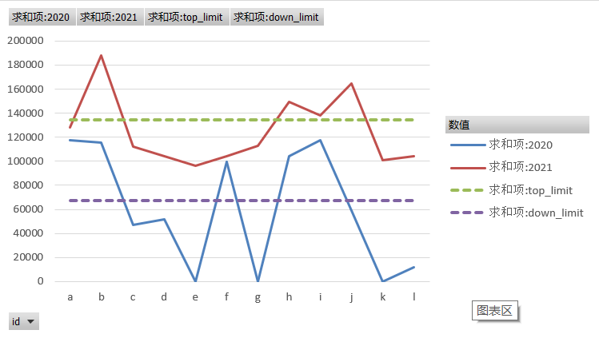
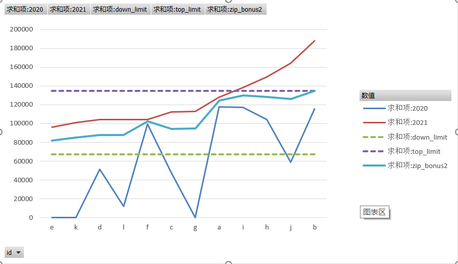
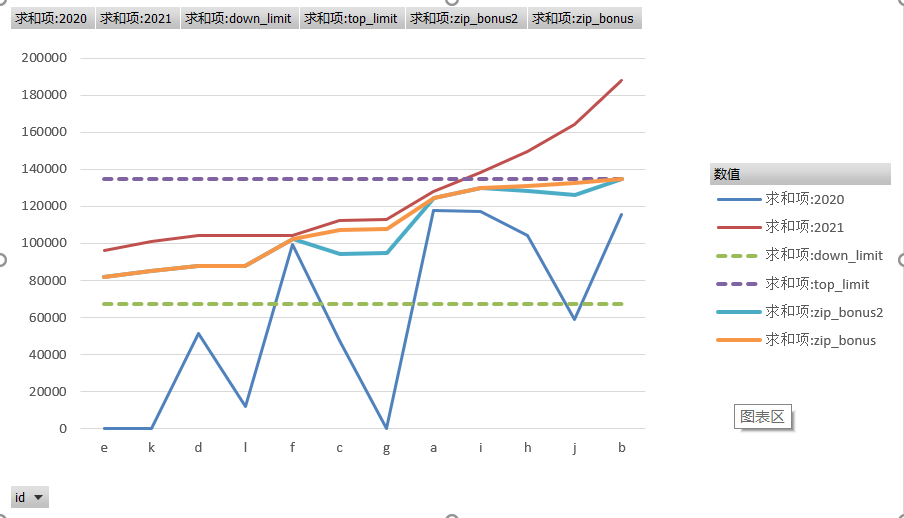

目的:出于外界不可抗力因素,某公司需要给部分奖金过高的员工进行奖金压缩

## 条件:

1.规定了一个压缩区间,压缩后的奖金必须在此区间内

2.压缩前a>b,则压缩后a>b

3.压缩后,同一个人今年的奖金尽量比去年的要高

## 原始数据

```python
bonus_2020_dict = {	# 2020年的奖金
    'a': 117800,
    'b': 115800,
    'c': 47360,
    'd': 51500,
    'e': 0,
    'f': 99348,
    'g': 0,
    'h': 104348,
    'i': 117466,
    'j': 58999,
    'k': 0,
    'l': 11754
}

bonus_2021_dict = {	# 2021的奖金
    'a': 127980,
    'b': 187955,
    'c': 112450,
    'd': 104048,
    'e': 96059,
    'f': 104473,
    'g': 113087,
    'h': 149459,
    'i': 138412,
    'j': 164352,
    'k': 100891,
    'l': 104219,
}

top_limit = 134540	# 压缩后的最大值
down_limit = 67270	# 压缩后的最小值

```

## 解决思路:

### 思路一

一开始想的是拟合一条直线来实现,也最简单,

假设斜率K,常数B,使得 max(bonus_2021) * K + B = top_limit,

得出所有人的压缩后奖金 = bonus_2021 * K + B

但是我以 1% 的精度遍历了(0~1)的斜率,发现没有任何一个 K 和 B 的组合能够同时满足三个条件

看来问题没那么简单...

### 重新定义区间

上一种方案的错误,是压缩后的值低于了2020年的值,就是压缩过多了,重新观察条件3`压缩后,同一个人今年的奖金尽量比去年的要高`,发现:

​		真实的区间并非是: down_limit ~ top_limit

​		应该是: max(down_limit , bonus_2020) ~ min(top_limit, bonus_2021)

通过一张图更加直观的展示:

a 点压缩后的取值区间其实很小,只在 117800 ~ 127980 之间, 也就是说,a点的压缩空间其实只有 127980 -117800 =10180 中的一部分

这一部分取多少呢? 可以设一个简单的公式:  

压缩值 = 可压缩空间 * 压缩比

压缩比 = 1 - bonus_2021 / max(bonus_2021)



于是编写代码:

```python

max_2021 = bonus_2021_dict[max(bonus_2021_dict,key=lambda x:bonus_2021_dict[x])]
zip_bonus_dict = {}
for k,bonus_21 in bonus_2021_dict.items():
    # 重新定义区间
    now_down_limit = max((down_limit, bonus_2020_dict[k]))
    now_top_limit = min((top_limit, bonus_21))
    limit = now_top_limit - now_down_limit
    # 获取压缩后的奖金
    zip_bonus = round(now_top_limit - limit * (1 - bonus_21 / max_2021))
    zip_bonus_dict[k] = zip_bonus

```

我按照bonus_2021的升序排列数据

通过图片可以明显观察到 zip_bonus2 这根中间蓝色的线不是单调递增的,这说明违背了条件二:`压缩前a>b,则压缩后a>b`




原因分析:

因为 f 点的2020年奖金过高,导致 f 点今年的下限很高

而 f 点旁边的 c,g 点 2020年的奖金都比较低,可压缩空间的下限就低,在压缩比与f 点差不多的情况下,就会出现压缩后,奖金反而比f点更低的情形.

那么怎么解决呢?

就是让 c,g 继承 f 的下限!

进而扩展到所有的点,将他们按照升序排列后,后一个点可以继承前一个点的下限

代码如下:

```python
bonus_2021_list = list(bonus_2021_dict.items())
bonus_2021_list.sort(key=lambda x: x[1])	# 将2021年奖金按照升序排列
max_2021 = bonus_2021_list[-1][1]
now_down_limit = down_limit	# 该值为每一个点的下限

zip_bonus_dict = {}
for bonus_21_tuple in bonus_2021_list:
    k = bonus_21_tuple[0]
    bonus_21 = bonus_21_tuple[1]
    # 将上一个点的下限加入选择
    now_down_limit = max((down_limit, now_down_limit, bonus_2020_dict[k]))
    # 上限的选择方式不变
    now_top_limit = min((top_limit, bonus_21))
    limit = now_top_limit - now_down_limit
    zip_bonus = round(now_top_limit - limit * (1 - bonus_21 / max_2021))
    zip_bonus_dict[k] = zip_bonus
    
```

结果如下图:

新增的黄色线条满足了所有条件.



## 最后

这种算法最后不会被真实的需求所采纳,因为其中关键一点在于当前人员的奖金数额与之前一个人的去年奖金有关系,这种关系在实际看来是非常离谱的事情

总的来说,这种算法解决了数学上的问题,或许某一天会应用在其它的实际问题上也说不定,所以还是在此记录一下

2022/3