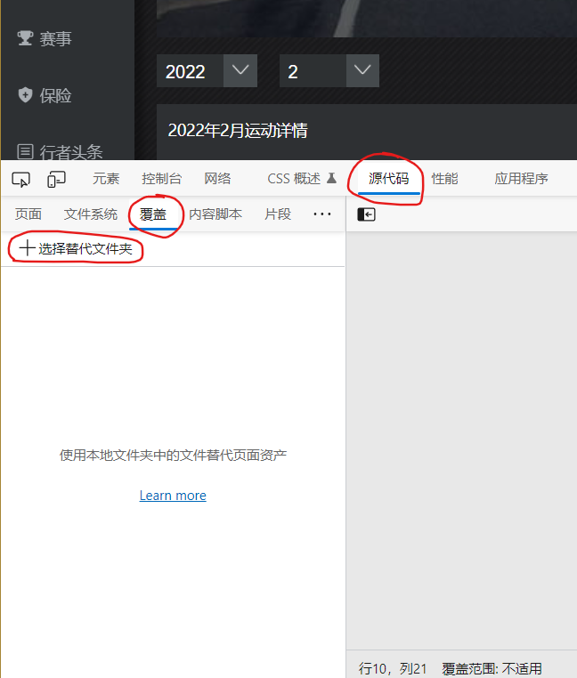
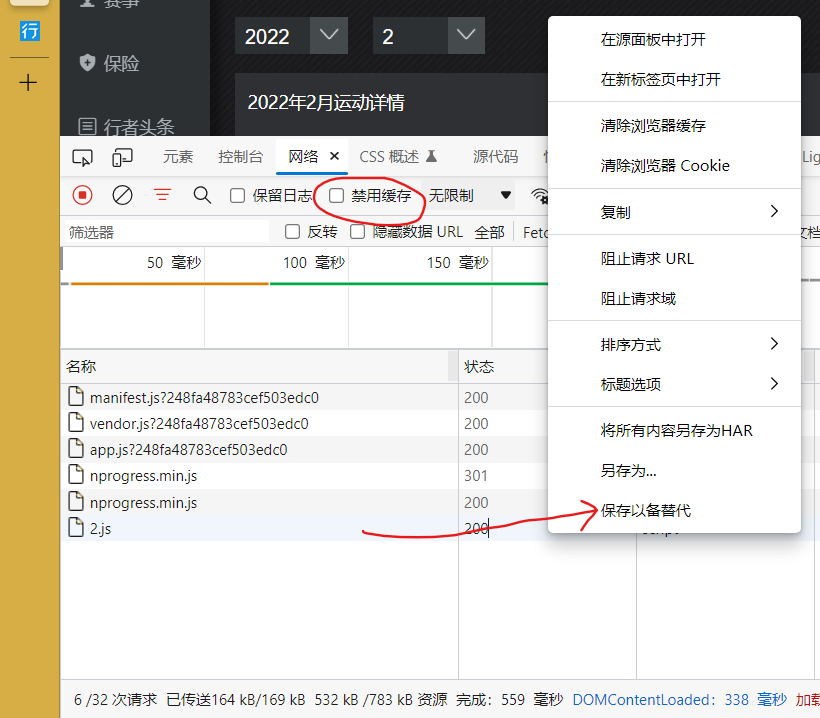
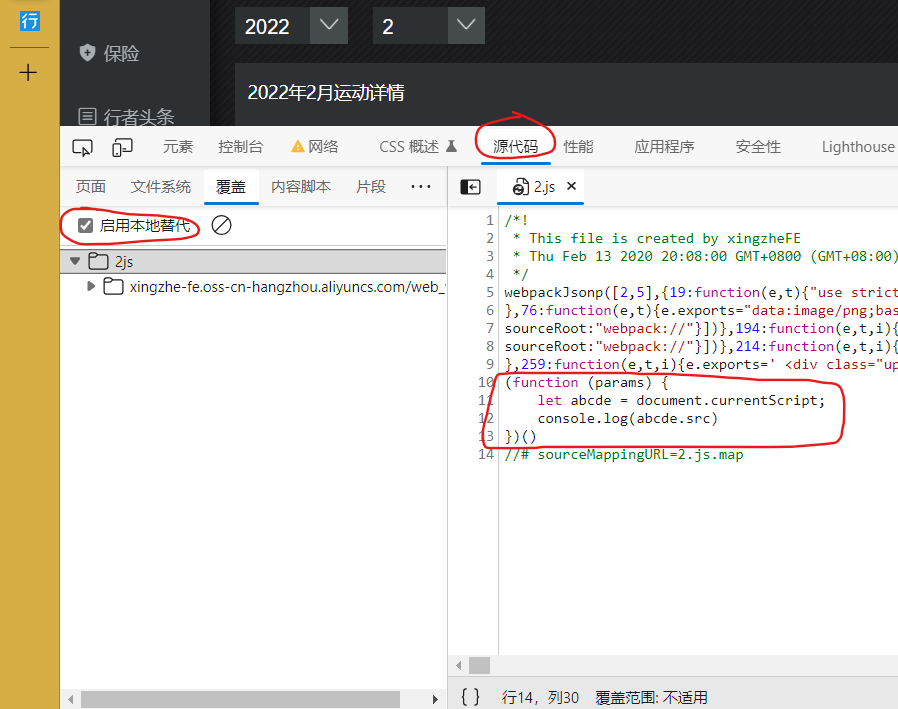

## 在网页的JS中注入Hook

[Chrome浏览器的overrides的使用 (itcoder.cn)](https://itcoder.cn/9/13/)

以下为Edge 的示例

### 1.本地新建一个目录

### 2.用浏览器关联该目录

选择目录后,浏览器`上方`会弹出一个横条提示确认

点击允许后即可关联

### 3.将原文件添加进关联目录

回到网络标签

右键点击JS 文件

选择保存以替代即可

### 4.修改源文件

此时即可在源文件中进行修改

修改完成后记得 CTRL + S 保存

### 5.刷新网页,查看效果

注: 是否禁用缓存,不影响本地替代效果