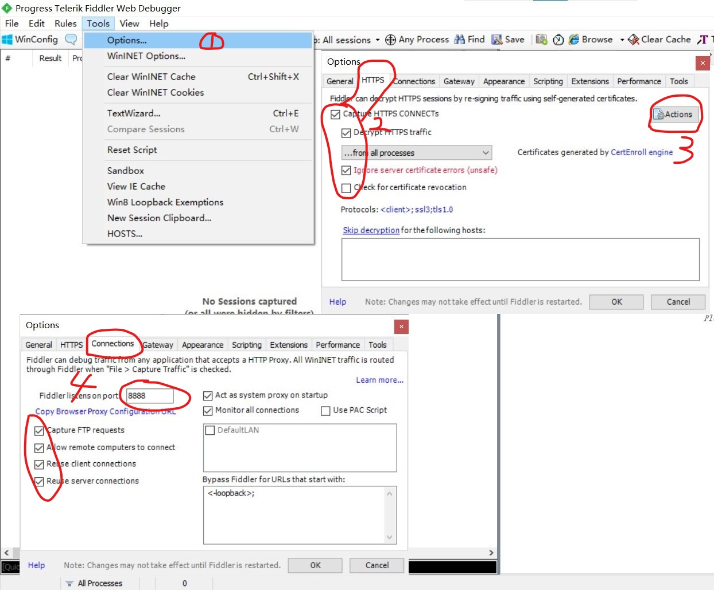
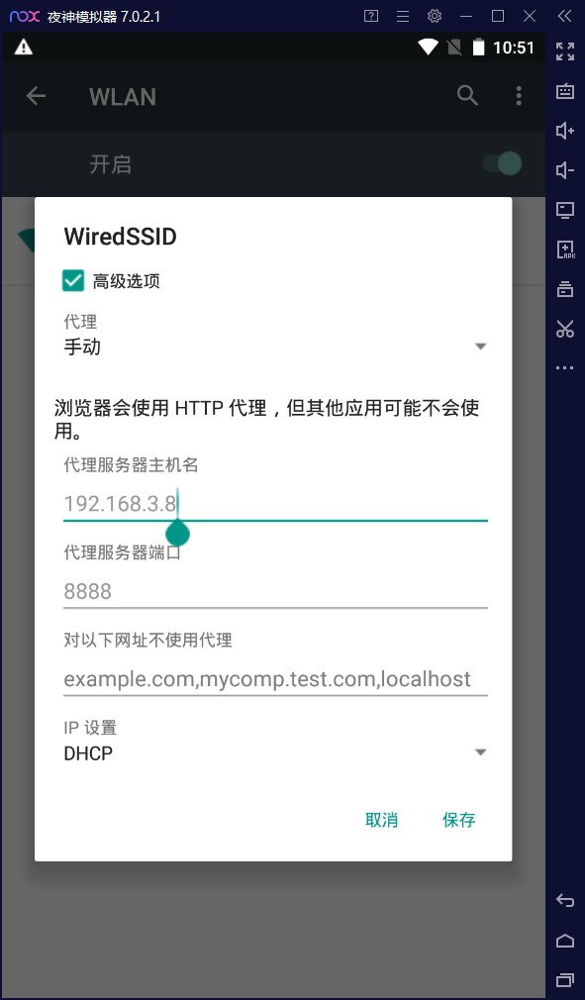
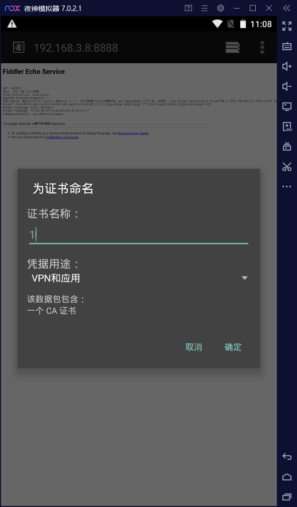
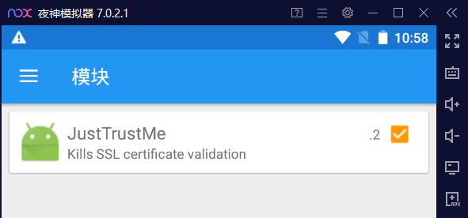
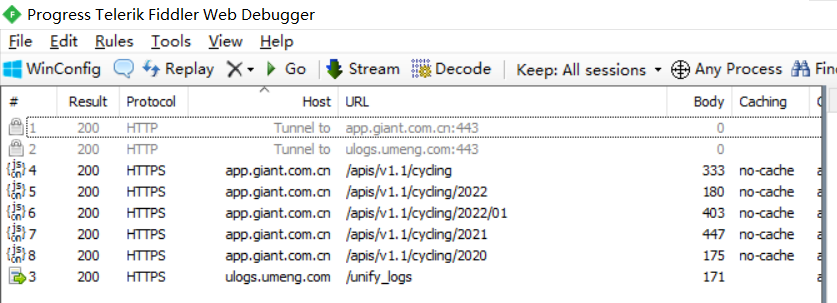
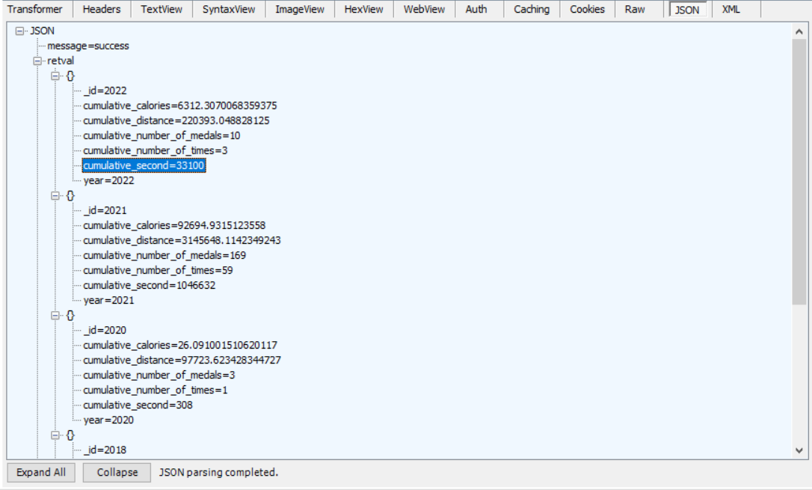
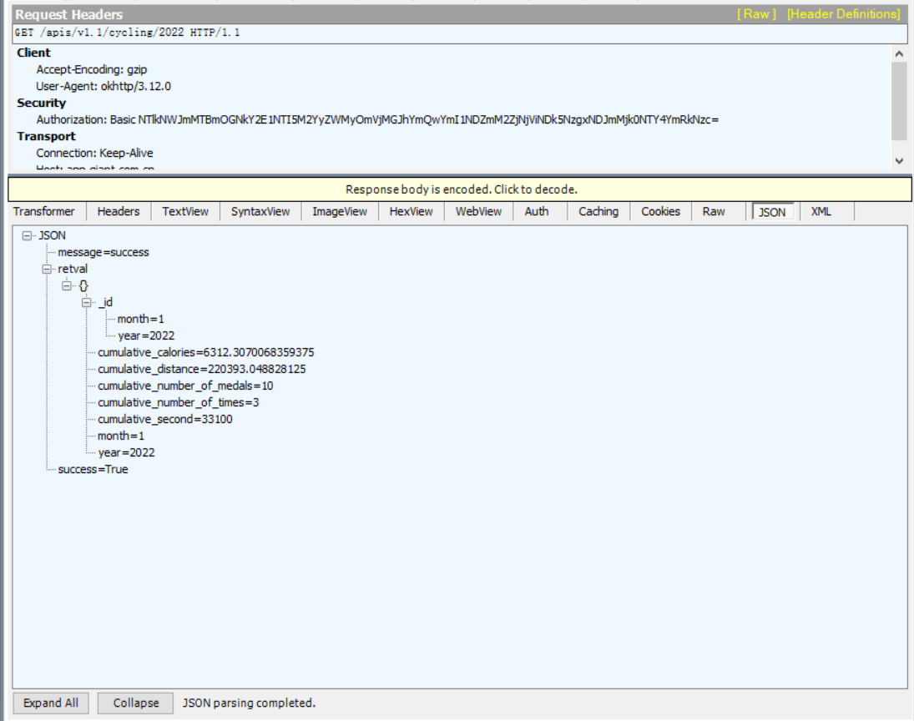
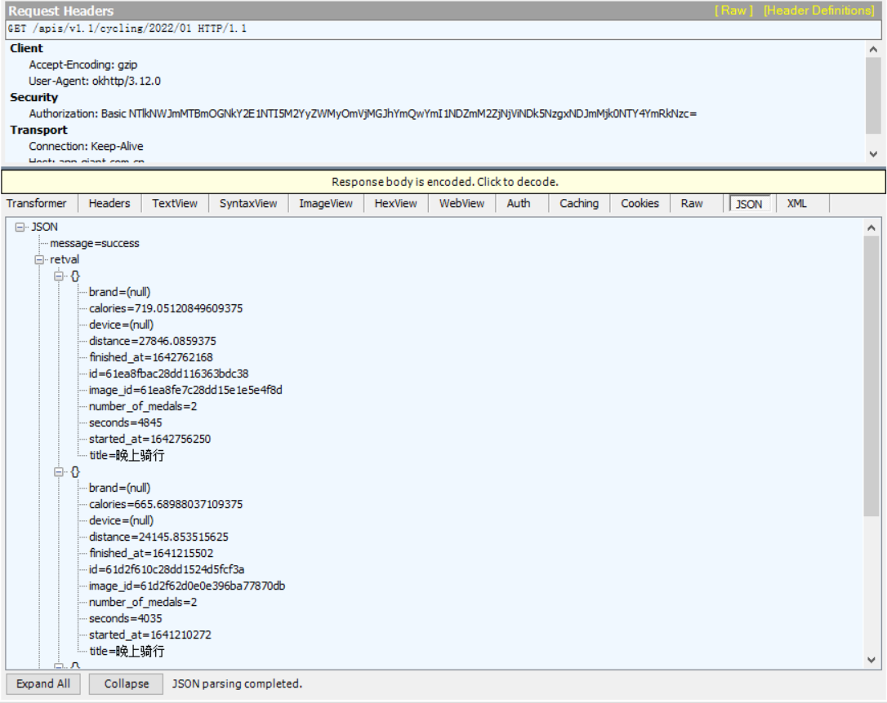
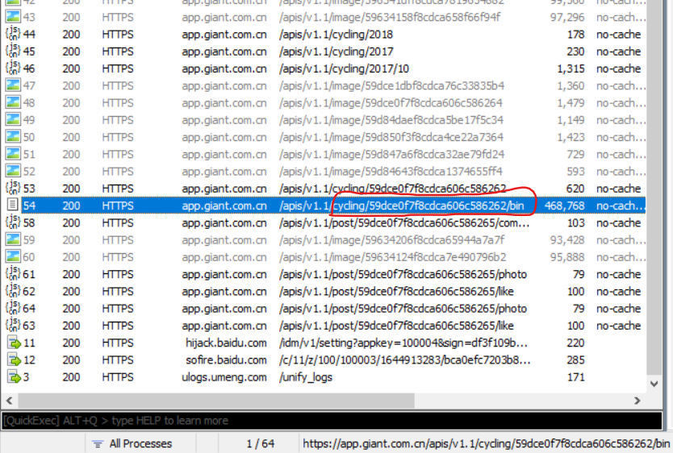
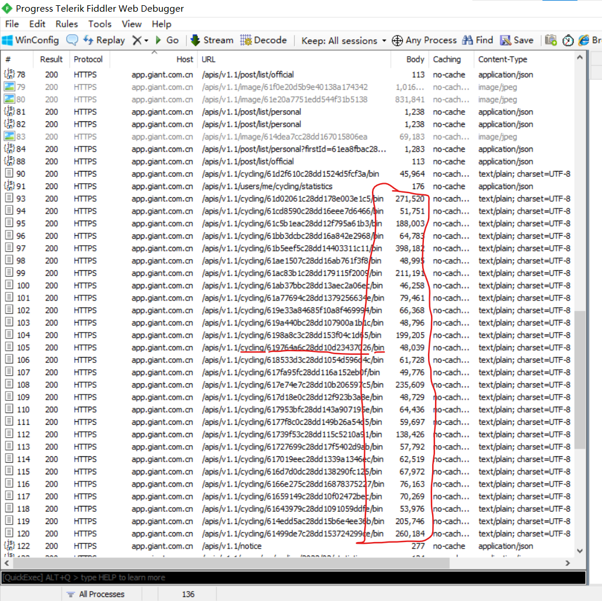

本篇文章旨在爬取捷某特骑行app 的骑行记录数据

## 工具

windows 工具:

- 夜神模拟器(安卓系统模拟器)
- Fiddler (抓包工具)

Android 工具

​	android 系统需要root

- Xposed (一个框架,配合模块可以做一些很神奇的事情,类似浏览器的油猴脚本)
- JustTrustMe (Xposed 所使用的一个模块,可以让app信任Fiddler所安装的证书)
- 捷某特骑行apk 2.04

## 1.配置Fiddler 

1.1 打开设置窗口	tools -> options

1.2 选中https标签 -> 选中几个选项 

1.3 点击actions 安装证书

1.4 配置安卓端下载证书的url端口号

## 2.配置Android

### 2.1打开夜神模拟器,安装一个5.X的安卓系统

### 2.2 配置代理

进入安卓系统,设置 -> WLAN -> 长按无线网络 -> 修改网络 -> 高级选项 -> 代理 -> 手动(配置) -> 配置主机(pc)地址和端口号

注: pc 的地址可以进入cmd后,输入 ipconfig 查看

### 2.3 安装证书

安卓内打开浏览器 -> 你的主机地址:8888(之前1.4配置的端口号) -> 点击网页底部 FiddlerRoot certificate 下载证书 -> 打开证书 -> 起一个名字,用途默认为VPN和应用

### 2.4 安装 xposed

阿里云:https://www.aliyundrive.com/s/9AKkshHojYe

将 xposed 安装包直接拖进夜神的界面里,就可以选择直接安装,或是安装夜神提供的xposed

### 2.5 安装 JustTrustMe 

阿里云:https://www.aliyundrive.com/s/F9EQ51L5P1F

将 JustTrustMe 安装包直接拖进夜神的界面里

### 2.6 激活 JustTrustMe 

打开 xposed  -> 点击左上角的 三条横线 符号 -> 选择模块 -> 在 JustTrustMe 模块上打勾

### 2.7 安装爬虫目标app

将捷某特骑行apk拖入夜神模拟器

## 4.分析抓包数据

### 4.1 整体数据

从app首页点开历史骑行记录

可以看见抓包信息

其中`apis/v1.1/cycling`信息如下:

可以看出有骑行记录的年份就会有数据

### 4.2 年份数据

其中`apis/v1.1/cycling/2022`信息如下:

我2月份没骑车,所以没有2月份的数据

### 4.3 月份数据

其中`apis/v1.1/cycling/2022/01`信息如下:

可以看到,在月份数据里,已经出现了 轨迹id 字段,

### 4.4 单条轨迹数据

我选择一条轨迹,点进去查看,却发现fiddler里面并没有抓到轨迹的数据包,又试了临近的几条轨迹记录,依旧抓不到类似GPS的数据包

直到我点开一条几年以前的数据,fiddler抓到了一条请求记录如下:

url: `/apis/v1.1/cycling/59dce0f7f8cdca606c586262/bin`

从它返回的数据大小,和url 结构来看,极有可能就是我需要的轨迹GPS数据

但是为什么之前都没有抓到这样类似的数据包呢?

我想到一种可能: 预加载

由于我在抓包之前打开过app,时间离得较近的数据,之前就已经下载好了,所以我在开始抓包后再去查看轨迹记录时,数据是从本地读取的,没有再去后端请求,也就抓不到数据包

为了验证这个猜想,我卸载了app,并重新安装,并且先打开fiddler 再打开app 登陆,发现了如下数据包:

猜想验证成功

由于捷某特骑行app本身的逻辑性质,只有在第一次登陆账号时,会有大量的骑行轨迹记录请求出现(预加载),如果你在抓包之前已经登陆了app,很可能就抓不到这个包了,那么还有两种方法可以看到轨迹数据包:

- 卸载app,重新安装登陆
- 选择时间比较久远的骑行记录打开,有可能会出现新的轨迹数据包请求

注: 这个具体数据请求返回的是二进制数据, 一开始猜测是类似于佳明的fit文件格式,但是用fitparse解析失败.后续对app反编译才发现这是flatbuffer格式的数据

后续:[捷安特骑行app逆向](./捷安特骑行app逆向.md)

