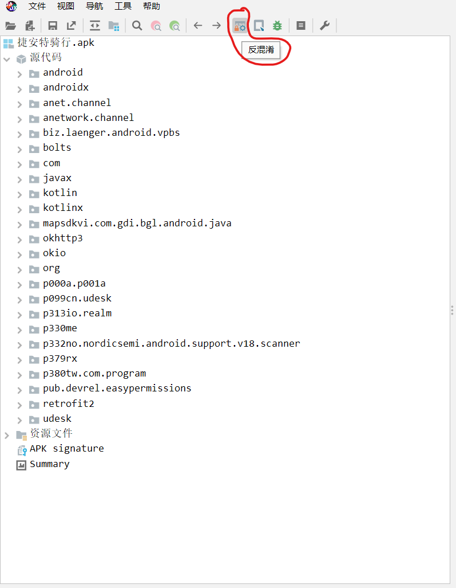
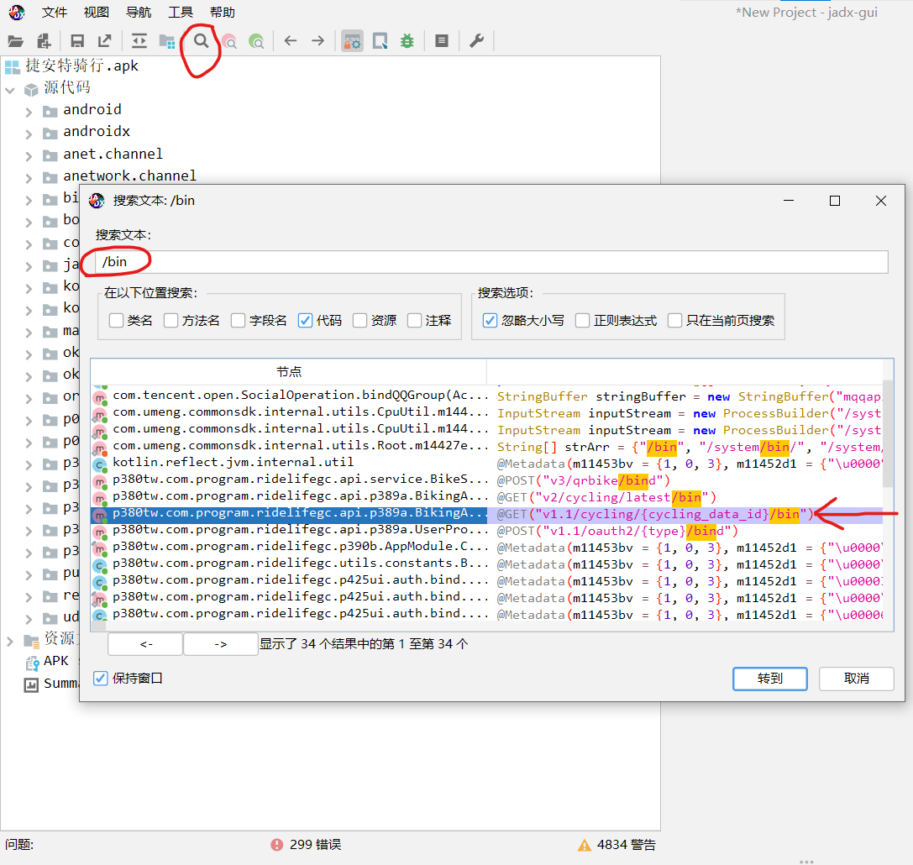
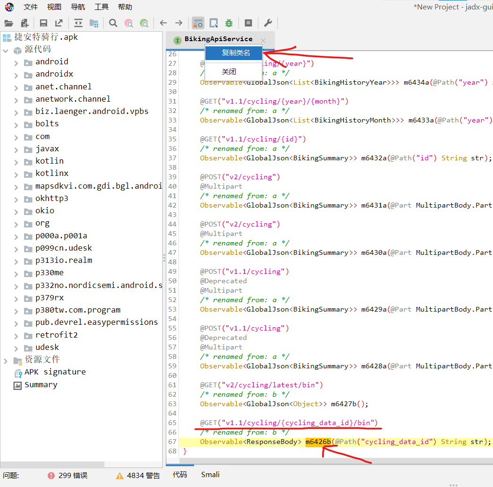
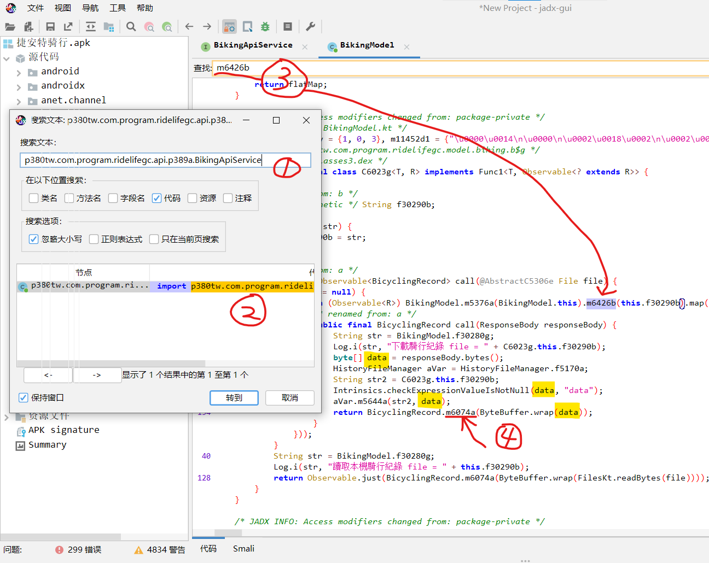
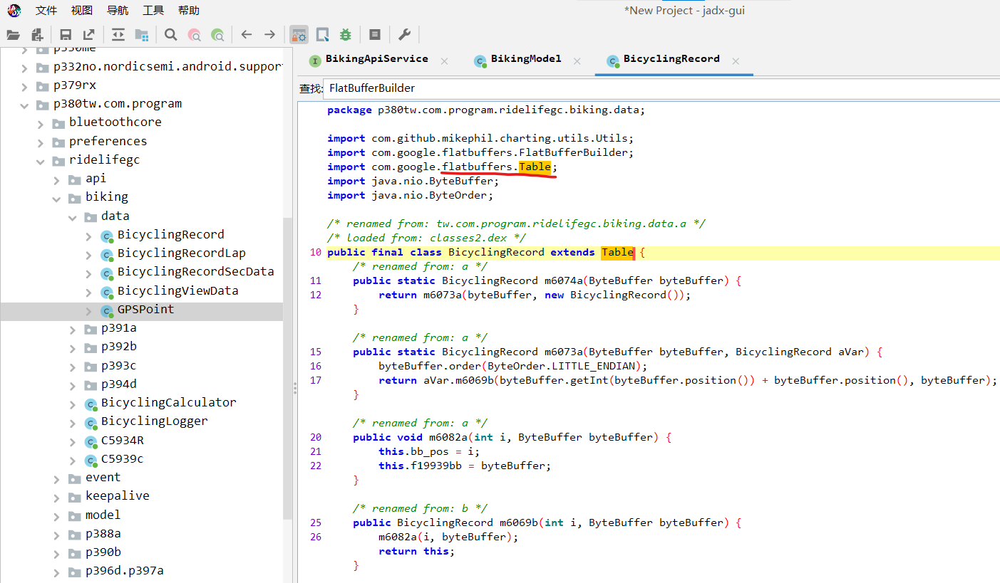
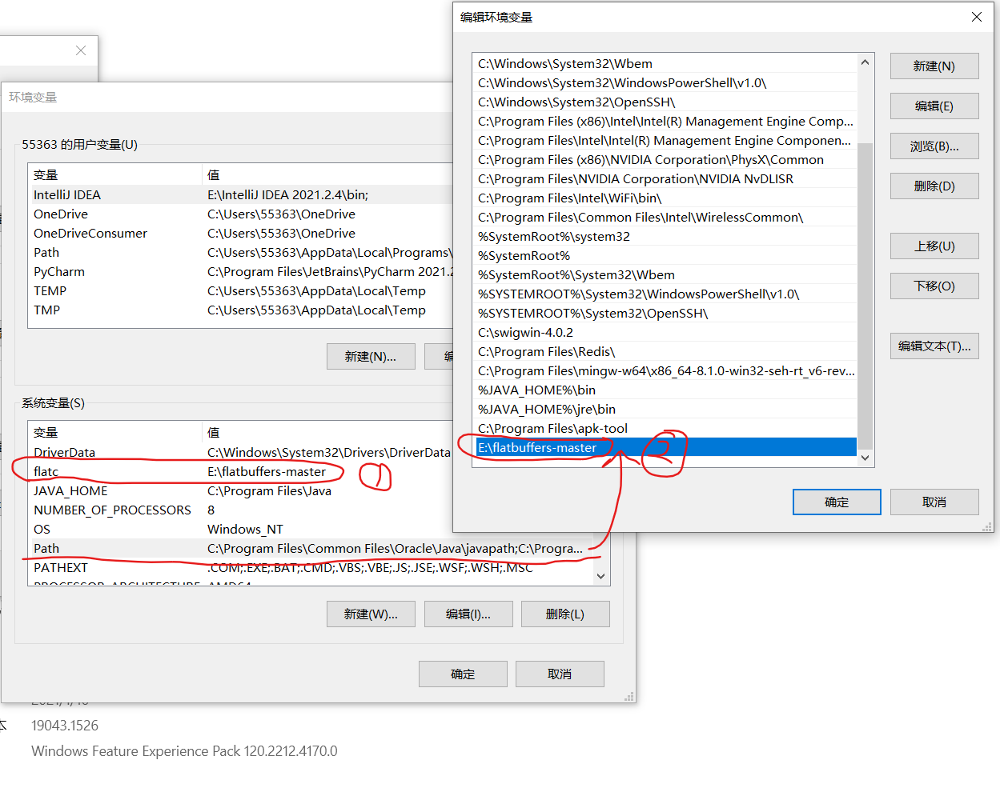

由于爬虫返回数据为无法常规解析的二进制数据,所以必须对捷安特骑行app做反编译,查看数据的具体解析方式

## 所需工具

通用

- jadx : apk反编译软件(windows) [下载地址: Releases · skylot/jadx (github.com)](https://github.com/skylot/jadx/releases)
- intellij idea : java代码IDE(可选)

仅针对捷安特骑行app

- flatbuffers : 数据序列化方案 [下载地址,直接安装,只需要手动配置环境变量](https://github.com/google/flatbuffers/releases)

环境:

- python 3.10
- java 17.0.2 2022-01-18 LTS
- flatbuffers 2.0.0
- 捷安特骑行apk 2.04

## 1.反编译捷安特骑行apk

使用jadx 打开apk:

把反混淆打开



## 2.定位需要的代码

### 2.1.搜索url 

已知爬虫的url : `xxxx/xxx/xxx/{id}/bin`

所以用`/bin`为关键词进行搜索.注:类似python的Path库在拼接url时可以隐藏掉斜杠`/`,所以如果`/bin`搜索不到想要的结果,就需要使用`bin`作为关键词搜索.



可以看到搜索结果中有一条记录看起来非常符合我们的预期

双击进入该文件

可以看到这是一个接口,接下来右键点击该文件标头,`复制类名`,然后记下该接口的'函数'名称`m6426b`



### 2.2.搜索使用url接口的具体位置

使用搜索框搜索上一步复制的类名,发现只有一个对应的文件,点进去

CTRL + F 打开文件内搜索,输入上一步记下的接口函数名,找到了一个调用该接口的地方

定位中的汉字"下载骑行记录"说明大概率是找对了地方

接着查看它的逻辑:

```java
...
Log.i(str, "下載騎行紀錄 file = " + C6023g.this.f30290b);
byte[] data = responseBody.bytes();	// 从后端获取bin数据,就是我们爬虫爬取的bin文件
HistoryFileManager aVar = HistoryFileManager.f5170a;
String str2 = C6023g.this.f30290b;
Intrinsics.checkExpressionValueIsNotNull(data, "data");	// 这里是在验证数据的有效性
aVar.m5644a(str2, data);
return BicyclingRecord.m6074a(ByteBuffer.wrap(data)); // 最终将data交给了m6074a,我们点进去看一下
...
```




### 2.3.查看处理逻辑



这里的逻辑显示,最终返回了 BicyclingRecord 的一个对象

这是一个什么对象呢? 我们看 class BicyclingRecord extends `Table`

这个 Table 是由 `import com.google.flatbuffers.Table;`导入的

由百度查询可知,`flatbuffers` 是一种序列化方式, 我们之前爬取的bin文件就是通过 flatbuffers 格式化后的数据,还不理解的可以想象一下如果爬取的是json文件,那就是json格式化后的数据.

### 2.4.提取 flatbuffers 的构造文件

在上一步打开的文件,所在的包路径下,可以看到三个以 BicyclingRecord...开头的文件,他们都拥有非常相似的文件结构,我们可以猜测这三个文件就是 flatbuffers  的自定义构造文件.

于是我们拷贝这三个文件,与其依赖的包,使用intellij idea新建一个java项目

其中有一些常量依赖需要导入包的,我们可以直接复制常量的值进行替换,而无需导入包

## 3.java环境下使用bin文件进行测试

由于原java文件是经过反编译的代码,所以充斥着类似 `m6074a`这种混乱名称的接口

我们想要找到正确的接口进行测试,就需要对 flatbuffers 的构造文件与调用方式,有一定的了解

这里给出一个非常简单的例子(比官方的例子简单很多,非常容易理解):

[python 使用 flatbuffers 序列化数据,然后java 使用 flatbuffers 对该数据进行反序列化](https://www.cnblogs.com/zhouyang209117/p/8087258.html?utm_source=tuicool)

文中所说生成一堆XXX代码,即是生成对应语种的构造文件,我们需要生成这些构造文件,并与拷贝的捷安特骑行app构造文件进行对比观察,就能找出正确的接口名称.

这里我们使用python的爬虫,爬取一份bin数据,并保存为 ceshi.bin 文件

下面直接贴出java的测试代码:(java 代码写的丑轻喷,我不会java 的语法...)

```java
import p380tw.com.program.ridelifegc.biking.data.BicyclingRecord;
import p380tw.com.program.ridelifegc.biking.data.BicyclingRecordLap;
import p380tw.com.program.ridelifegc.biking.data.BicyclingRecordSecData;

import java.io.IOException;
import java.nio.ByteBuffer;
import java.nio.file.Files;
import java.nio.file.Path;
import java.nio.file.Paths;

public class Main {
    private void process() {
        Path path = Paths.get("C:\\Users\\55363\\Desktop\\test2\\src\\ceshi.bin");
        try {
            byte[] data = Files.readAllBytes(path);
            ByteBuffer buf = java.nio.ByteBuffer.wrap(data);
            BicyclingRecord new_rcord = BicyclingRecord.m6074a(buf);

            get_total_data(new_rcord);
            get_lap_data(new_rcord);
            get_sec_data(new_rcord);
        } catch (IOException e) {
            System.out.println("IOException");
        }
    }

    private void get_total_data(BicyclingRecord new_rcord) {
        System.out.println(new_rcord.m6084a()); // 开始时间(时间戳/秒)
        System.out.println(new_rcord.m6071b()); // 结束时间(时间戳/秒)
        System.out.println(new_rcord.m6062c()); // 运动时间(秒)
        System.out.println(new_rcord.m6058d()); // 里程 m
        System.out.println(new_rcord.m6054e()); // 卡路里(kcal)
        System.out.println(new_rcord.m6051f()); // 最高速度(km*10/h)
        System.out.println(new_rcord.m6048g());	// 运动均速(单位同上)
        System.out.println(new_rcord.m6046h());	// 总体均速(单位同上)
        System.out.println(new_rcord.m6044i());	// 最高踏频
        System.out.println(new_rcord.m6042j());	// 平均踏频
        System.out.println(new_rcord.m6040k());	// 最高心率
        System.out.println(new_rcord.m6038l());	// 平均心率
        System.out.println(new_rcord.m6036m());	// 最大功率
        System.out.println(new_rcord.m6034n());	// 平均功率
        System.out.println(new_rcord.m6032o()); // 累计爬升(m)
        System.out.println(new_rcord.m6030p()); // 累计下降(m)
        System.out.println(new_rcord.m6028q()); // 最大海拔高度(m)
        System.out.println(new_rcord.m6027r()); // 最低海拔
        System.out.println(new_rcord.m6026s());
        System.out.println(new_rcord.m6025t());
        System.out.println(new_rcord.m6024u());
        System.out.println(new_rcord.m6023v());
        System.out.println("************************************************************");
    }

    private void get_lap_data(BicyclingRecord new_rcord) {
        for (int i = 0; true; i++) {
            try {
                BicyclingRecordLap new_lap = new_rcord.m6083a(i);
                // 获取每一段的数据(猜测使用手动暂停和接续骑行时会形成多段记录)

                System.out.println(new_lap.m6020a());
                System.out.println(new_lap.m6007b());	// 运动时间(秒)
                System.out.println(new_lap.m6001c());   // 里程
                System.out.println(new_lap.m5997d());   // 卡路里(kcal)
                System.out.println(new_lap.m5993e());   // 最高速度(km*10/h)
                System.out.println(new_lap.m5990f());   // 运动均速
                System.out.println(new_lap.m5987g());	// 总体均速
                System.out.println(new_lap.m5985h());	// 最高踏频
                System.out.println(new_lap.m5983i());	// 平均踏频
                System.out.println(new_lap.m5981j());	// 最高心率
                System.out.println(new_lap.m5979k());	// 平均心率
                System.out.println(new_lap.m5977l());	// 最大功率
                System.out.println(new_lap.m5975m());	// 平均功率
                System.out.println(new_lap.m5973n());   // 累计爬升(m)
                System.out.println(new_lap.m5972o());   // 累计下降(m)
                System.out.println(new_lap.m5971p());   // 最大海拔高度(m)
                System.out.println(new_lap.m5970q());   // 最低海拔
                System.out.println(new_lap.m5969r());
                System.out.println(new_lap.m5968s());
                System.out.println(new_lap.m5967t());
                System.out.println(new_lap.m5966u());
                System.out.println("--------------------------------------------------");
            } catch (Exception e) {
                System.out.println("lap: " + i);
                break;
            }
        }
    }

    private void get_sec_data(BicyclingRecord new_rcord) {
        for (int i = 0; true; i++) {
            try {
                BicyclingRecordLap new_lap = new_rcord.m6083a(i);
                new_lap.m6007b();
                for (int n = 0; true; n++) {
                    try {
                        BicyclingRecordSecData new_sec = new_lap.m6019a(n);

                        System.out.println(new_sec.getCurrentTime());	// 时间戳(s)
                        System.out.println(new_sec.getDataType());
                        System.out.println(new_sec.getCumulativeTotalSecond());	// 累计耗时
                        System.out.println(new_sec.getCumulativeTotalDistance());	// 累计里程(m)
                        System.out.println(new_sec.getCumulativeTotalCalories());	// 累计卡路里
                        System.out.println(new_sec.getSpeed());	// 速度(km*10/h)
                        System.out.println(new_sec.getCadence());	// 踏频
                        System.out.println(new_sec.getHr());	// 心率
                        System.out.println(new_sec.getPower());	// 功率
                        System.out.println(new_sec.getAltitude());	// 海拔
                        System.out.println(new_sec.getLatitude());	// 纬度
                        System.out.println(new_sec.getLongitude());	// 经度
                        System.out.println(new_sec.getHorizontalAccuracy());	// 水平精度
                        System.out.println(new_sec.getVerticalAccuracy());	// 垂直精度
                        System.out.println("#######################################");
                    } catch (Exception e) {
                        System.out.println("count: " + n);
                        break;
                    }
                }
            } catch (Exception e) {
                System.out.println("lap: " + i);
                break;
            }
        }
    }

    public static void main(String[] args) {
        Main m = new Main();
        m.process();
    }
}

```

运行后能够正确打印各项数据,说明测试成功.

## 4.使用python解析bin文件


两种思路:

### 4.1.python调用上面测试好的java 代码

奈何 jpype 包始终安装不上,放弃

### 4.2.根据 java 的构造文件,反推出 该项目所使用的数据格式的文件.fbs

这里需要将第3步中[python 使用 flatbuffers 序列化数据,然后java 使用 flatbuffers 对该数据进行反序列化](https://www.cnblogs.com/zhouyang209117/p/8087258.html?utm_source=tuicool)与该项目的代码反复对比观察,才能够手动反推.fbs 文件

下面贴出完整的.fbs文件代码:

注: 其中 类似于 m6026s 这样的未更名字段,暂时不知道代表什么意义,我解析过几份bin文件,这些字段都没有被赋值

```fbs
// Example IDL file for our record's schema.
namespace record;
table BicyclingRecord {
    start_timestamp:long;
    end_timestamp:long;
    total_timer_time:int;
    total_distance:float;
    total_calories:float;
    max_speed:int;
    avg_speed:int;
    total_avg_speed:int;
    max_cadence:int;
    avg_cadence:float;
    max_heart_rate:int;
    avg_heart_rate:float;
    max_power:float;
    avg_power:float;
    total_ascent:double;
    total_descent:double;
    max_altitude:double;
    min_altitude:double;
    m6026s:int;
    m6025t:int;
    m6024u:int;
    m6023v:int;
    bicycling_record_lap:[BicyclingRecordLap];
}

table BicyclingRecordLap {
    m6020a:short;
    lap_timer_time:int;
    lap_distance:float;
    lap_calories:float;
    max_speed:int;
    avg_speed:int;
    lap_avg_speed:int;
    max_cadence:int;
    avg_cadence:float;
    max_heart_rate:int;
    avg_heart_rate:float;
    max_power:float;
    avg_power:float;
    lap_ascent:double;
    lap_descent:double;
    max_altitude:double;
    min_altitude:double;
    m5969r:int;
    m5968s:int;
    m5967t:int;
    m5966u:int;
    bicycling_record_sec_data:[BicyclingRecordSecData];
}

table BicyclingRecordSecData {
    current_time:long;
    data_type:byte;
    cumulative_total_second:int;
    cumulative_total_distance:float;
    cumulative_total_calories:float;
    speed:int;
    cadence:int;
    hr:int;
    power:float;
    altitude:double;
    latitude:double;
    longitude:double;
    horizontal_accuracy:int;
    vertical_accuracy:int;
}
root_type BicyclingRecord;
```

### 4.3.根据.fbs文件生成java 使用的构造文件,对测试数据进行再次验证

```cmd
flatc --java record.fbs
```

我跳过了这一步

### 4.4.根据.fbs文件生成python使用的构造文件,进行测试

```cmd
flatc --python record.fbs
```

编写python 的测试文件

下面贴出完整的python解析bin文件代码

```python
from record import BicyclingRecord


def run():
    with open('ceshi.bin', 'rb') as f:
        buf = f.read()
    new_record = BicyclingRecord.BicyclingRecord.GetRootAs(buf)
    get_total_data(new_record)
    get_lap_data(new_record)
    get_sec_data(new_record)


def get_total_data(new_record):
    print(new_record.StartTimestamp())  # 开始时间戳
    print(new_record.EndTimestamp())  # 结束时间戳
    print(new_record.TotalTimerTime())  # 运动时间 秒
    print(new_record.TotalDistance())  # 里程 米
    print(new_record.TotalCalories())  # 卡路里 kcal
    print(new_record.MaxSpeed())  # 最高速度 km * 10 /h
    print(new_record.AvgSpeed())  # 运动均度
    print(new_record.TotalAvgSpeed())  # 总体均速
    print(new_record.MaxCadence())  # 最高踏频 转/分钟
    print(new_record.AvgCadence())  # 平均踏频
    print(new_record.MaxHeartRate())  # 最高心率 跳/分钟
    print(new_record.AvgHeartRate())  # 平均心率
    print(new_record.MaxPower())  # 最大功率 瓦
    print(new_record.AvgPower())  # 平均功率
    print(new_record.TotalAscent())  # 爬升高度 米
    print(new_record.TotalDescent())  # 下降高度 米
    print(new_record.MaxAltitude())  # 最大海拔 米
    print(new_record.MinAltitude())  # 最低海拔 米
    print(new_record.M6026s())
    print(new_record.M6025t())
    print(new_record.M6024u())
    print(new_record.M6023v())
    print('*' * 40)


def get_lap_data(new_record):
    lap_number = 0
    while True:
        try:
            new_lap = new_record.BicyclingRecordLap(lap_number)
            print(new_lap.M6020a())
            print(new_lap.LapTimerTime())  # 运动时间(秒)
            print(new_lap.LapDistance())  # 里程 米
            print(new_lap.LapCalories())  # 卡路里(kcal)
            print(new_lap.MaxSpeed())  # 最高速度 * 10(app显示34.2km / h, 解析数据为342)
            print(new_lap.AvgSpeed())  # 运动均速(单位同上)
            print(new_lap.LapAvgSpeed())  # 段落总体均速
            print(new_lap.MaxCadence())  # 最高踏频 转/分钟
            print(new_lap.AvgCadence())  # 平均踏频
            print(new_lap.MaxHeartRate())  # 最高心率 跳/分钟
            print(new_lap.AvgHeartRate())  # 平均心率
            print(new_lap.MaxPower())  # 最大功率 瓦
            print(new_lap.AvgPower())  # 平均功率
            print(new_lap.LapAscent())  # 累计爬升(m)
            print(new_lap.LapDescent())  # 累计下降(m)
            print(new_lap.MaxAltitude())  # 最大海拔高度(m)
            print(new_lap.MinAltitude())  # 最低海拔
            print(new_lap.M5969r())
            print(new_lap.M5968s())
            print(new_lap.M5967t())
            print(new_lap.M5966u())
            lap_number += 1
            print('-' * 40)
        except Exception as e:
            print(f'lap_number: {lap_number}')
            break


def get_sec_data(new_record):
    lap_number = 0
    while True:
        try:
            new_lap = new_record.BicyclingRecordLap(lap_number)
            print(new_lap.M6020a())
            lap_number += 1
            sec_number = 0
            while True:
                try:
                    new_sec = new_lap.BicyclingRecordSecData(sec_number)
                    print(new_sec.CurrentTime())  # 时间戳(s)
                    print(new_sec.DataType())
                    print(new_sec.CumulativeTotalSecond())  # 累计耗时
                    print(new_sec.CumulativeTotalDistance())  # 累计里程(m)
                    print(new_sec.CumulativeTotalCalories())  # 累计卡路里
                    print(new_sec.Speed())  # 速度(km * 10 / h)
                    print(new_sec.Cadence())  # 踏频
                    print(new_sec.Hr())  # 心率
                    print(new_sec.Power())  # 功率
                    print(new_sec.Altitude())  # 海拔
                    print(new_sec.Latitude())  # 纬度
                    print(new_sec.Longitude())  # 经度
                    print(new_sec.HorizontalAccuracy())  # 水平定位精度
                    print(new_sec.VerticalAccuracy())  # 垂直定位精度
                    sec_number += 1
                    print('#' * 40)
                except Exception as e:
                    print(f'sec_number: {sec_number}')
                    break
            print('-' * 40)
        except Exception as e:
            print(f'lap_number: {lap_number}')
            break


if __name__ == '__main__':
    run()

```

经运行,各项数据打印无误.轨迹点数据提取成功

end

## 附:flatbuffers 在win10下的使用步骤

[FlatBuffers: FlatBuffers (google.github.io)](https://google.github.io/flatbuffers/index.html)

### 1.下载 flatbuffers 主程序

[Releases · google/flatbuffers (github.com)](https://github.com/google/flatbuffers/releases)

### 2.解压,安装,添加环境变量



### 3.编写 Schema (.fbs) (数据格式文件)

[深入浅出 FlatBuffers 之 Schema_weixin_34015336的博客-CSDN博客](https://blog.csdn.net/weixin_34015336/article/details/87941406)

### 4.根据 Schema 生成对应语种的构造文件

```shell
flatc --[java/python/js/php/...] [test].fbs
```

### 5.调用生成的构造文件所暴露的接口

[使用flatbuffers - 荷楠仁 - 博客园 (cnblogs.com)](https://www.cnblogs.com/zhouyang209117/p/8087258.html?utm_source=tuicool)