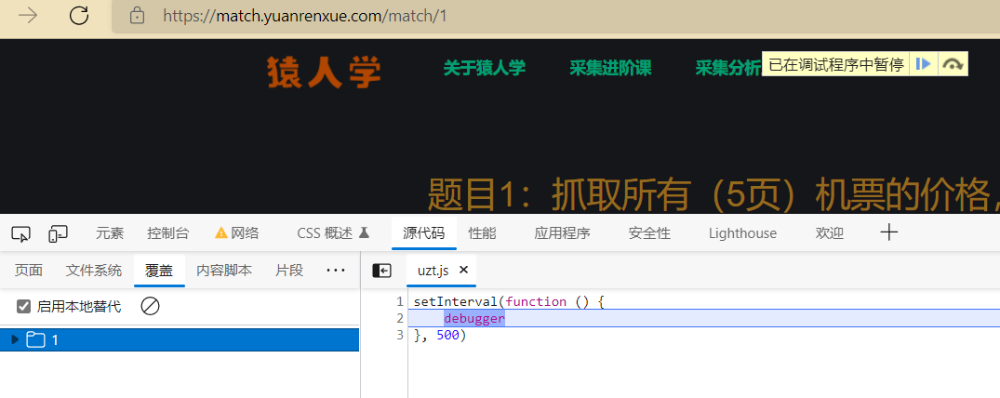

# 题目1：抓取所有（5页）机票的价格，并计算所有机票价格的平均值，填入答案。

浏览器: EDGE

IDE: pycharm

Sekiro: [virjar/sekiro: 基于长链接和代码注入的Android private API暴露框架 (github.com)](https://github.com/virjar/sekiro)


## 分析网页

### 1.F12查看数据来源





发现有个调试断点,影响了使用,我们启用本地文件替代,将这个文件里的3行代码直接删掉,就可以了,

具体启用本地替代方式:[方法: 在网页的JS中注入Hook](./python/在网页的JS中注入Hook.md)

然后查看网络数据,直接查看XHR数据,在网页上点第二页,找到数据来源,发现URL中有一个 m 的加密参数

### 2.查看调用栈

接着查看请求详情,点击发起程序,查看调用栈

调用栈中的 jquery.min.js 相关的可以先不看,除非其它两个都找不到

其中一个函数名叫request,点进去看一下


发现是被转义的代码,我们把它放进pycharm里打印一下就转回来了...

或者在猿人学的网站的采集分析工具里有一个 反混淆 工具,直接贴进去就行,

转码后的代码大概如下:

```js

window['url'] = '/api/' + 'match' + '/1', request = function () {
    var _0x2268f9 = Date['parse'](new Date()) + (16798545 + -72936737 + 156138192), _0x57feae = oo0O0(_0x2268f9['toStr' + 'ing']()) + window['f'];
    const _0x5d83a3 = {};
    _0x5d83a3['page'] = window['page'], _0x5d83a3['m'] = _0x57feae + '丨' + _0x2268f9 / (-1 * 3483 + -9059 + 13542);
    var _0xb89747 = _0x5d83a3;
    $['ajax']({
        'url': window['url'],
        'dataType': 'json',
        'async': ![],
        'data': _0xb89747,
        'type': 'GET',
        'beforeSend': function (_0x4c488e) {
        },
        'success': function (_0x131e59) {
            '...'
        },
        'complete': function () {
        },
        'error': function () {
            '...'
        }
    });
}, request();

```

第一行的window.url 与数据请求url相同,并且生成了一个 _0xb89747 的查询参数,

通过第5行,可以看见,这个参数就是url 中的  page 和 m,

## 编写JS Hook文件

至于它是如何加密的,不需要去查看,直接使用基于RPC技术的Sekiro,进行hook调用即可

[Sekiro Hook Web JS 的详细使用步骤示例](./pyton/行者web爬虫.md)

这里我要取得加密参数,需要自定义一个hook函数,将上面加密相关的代码拷贝进去,剔除掉 $.ajax 请求发送的代码

```js
// 在当前示例中以下的所有代码应该包裹在一个 <script> </script> 标签里,后面会说明原因

// 让该函数接收 page 参数,返回加密后的字符串
my_hook_xy = function (page) {
    var _0x2268f9 = Date['parse'](new Date()) + (16798545 + -72936737 + 156138192), _0x57feae = oo0O0(_0x2268f9['toStr' + 'ing']()) + window['f'];
    const _0x5d83a3 = {};
    _0x5d83a3['page'] = page, _0x5d83a3['m'] = _0x57feae + '丨' + _0x2268f9 / (-1 * 3483 + -9059 + 13542);
    var _0xb89747 = _0x5d83a3;
    return _0xb89747
};

// 然后编写完整的sekiro_web_client.js
(function (){
    // 这里拷贝 sekiro_web_client.js 上半部分(无需修改)
    // 官方下载: https://sekiro.virjar.com/sekiro-doc/assets/sekiro_web_client.js
	// 阿里云:https://www.aliyundrive.com/s/YpBvYrSSnNT
    
    // 这里是 sekiro_web_client.js 自行编写的下半部分
    
    function guid() {
        function S4() {
            return (((1 + Math.random()) * 0x10000) | 0).toString(16).substring(1);
        }
        return (S4() + S4() + "-" + S4() + "-" + S4() + "-" + S4() + "-" + S4() + S4() + S4());
    }

    const client_sekiro = new SekiroClient("ws://127.0.0.1:5620/business-demo/register?group=yuan_ren_xue_01&clientId=" + guid());

    client_sekiro.registerAction("my_hook_xy", function (request, resolve, reject) {
        resolve(my_hook_xy(request['page']));
    })
})();
```

接下来需要把这些代码添加到原JS 代码的最后去

我右键点击该文件头,发现没有 `保存以替代的选项`说明通过调用栈进来的这个位置,不是一个文件,

我需要再回到调用栈,找到该函数所在的文件,

在该调用栈的下方有一个匿名的调用,

点进去查看发现了这段转义的Js代码,是在一个html文件的`<script>标签里`,通过`eval`转义的

**所以我上面的代码也需要包裹在一个`<script>标签里`,添加在文件的最下方**

启动Sekiro 服务端,

保存刷新网页,看看添加的代码有没有报错... 之前少写个分号,IDE没报错,但是网页报错了,搞了我好久...

## 编写爬虫文件

```python
# spider01.py

from numpy import mean
import requests
import config


def get_m(page):
    """
        向 Sekiro的服务端 发送请求,获取hook接口返回的数据
    """
    params = {
        'group': 'yuan_ren_xue_01',
        'action': 'my_hook_xy',
    }
    url = 'http://127.0.0.1:5620/business-demo/invoke'

    res = requests.get(url=url, params=params, data={'page': page}).json()
    return res


def get_price_list(page):
    url = f'{config.host}/api/match/1'
    headers = config.headers
    parmas = {
        'page': page,
        'm': get_m(page)['m'],
    }
    res = requests.get(url=url, headers=headers, params=parmas).json()
    price_list = [item['value'] for item in res['data']]
    print(price_list)
    return price_list


if __name__ == '__main__':
    result_list = []
    for i in range(1, 6):
        result_list.extend(get_price_list(i))
    print(mean(result_list))
```

```python
# config.py

headers = {
    'user-agent': 'yuanrenxue.project',
    'cookie': 'sessionid=....'	# 自己填自己的
}

host = 'https://match.yuanrenxue.com'
```

结果:


