# 基于AST 手撕OB混淆

## 开端

### 猿人学题目2：

**提取全部5页发布日热度的值，计算所有值的加和,并提交答案 (感谢蔡老板为本题提供混淆方案)**


参考资料:

>  [OB 混淆官网 JavaScript Obfuscator Tool](https://obfuscator.io/) https://obfuscator.io/
>
>  [AST 节点属性详解 ](https://github.com/babel/babel/blob/main/packages/babel-parser/ast/spec.md#unaryexpression) https://github.com/babel/babel/blob/main/packages/babel-parser/ast/spec.md#unaryexpression
>
>  [AST 在线结构解析](https://astexplorer.net/) https://astexplorer.net/
>
>  特别鸣谢 为我提供思路的下面6篇文章的作者 [渔滒](https://blog.csdn.net/zjq592767809) https://blog.csdn.net/zjq592767809
>
>  [猿人学 web第二题混淆对抗 2021-10-18](https://blog.csdn.net/zjq592767809/article/details/120854404) https://blog.csdn.net/zjq592767809/article/details/120854404
>
>  [《JavaScript AST其实很简单》一、相关基础知识与环境配置](https://blog.csdn.net/zjq592767809/article/details/111404402) https://blog.csdn.net/zjq592767809/article/details/111404402
>
>  [《JavaScript AST其实很简单》二、Step1-函数调用还原](https://blog.csdn.net/zjq592767809/article/details/111562259) https://blog.csdn.net/zjq592767809/article/details/111562259
>
>  [《JavaScript AST其实很简单》三、Step2-对象调用还原](https://blog.csdn.net/zjq592767809/article/details/111711339) https://blog.csdn.net/zjq592767809/article/details/111711339
>
>  [《JavaScript AST其实很简单》四、Step3-分支流程判断](https://blog.csdn.net/zjq592767809/article/details/111936396) https://blog.csdn.net/zjq592767809/article/details/111936396
>
>  [《JavaScript AST其实很简单》五、Step4-平坦化控制流](https://blog.csdn.net/zjq592767809/article/details/112055713) https://blog.csdn.net/zjq592767809/article/details/112055713


猿人学第二题难点有二,一个是抓包,二个是反混淆. 

因为网页会自动刷新,在浏览器上看不到设置cookie的那个包,

需要使用fiddller之类的抓包软件,就能很清楚的看到页面被请求了两次,

第一次返回的是一个JS文件,

第二次在请求头的cookie中加入了 m 值,才返回了HTML页面

很显然,m值就是第一次请求返回的JS文件执行而来.

这个JS 是一个混淆之后的文件,而且在2021/10月份的时候对混淆方式进行了更新升级,

现有的工具([猿人学自己的解OB工具](http://tool.yuanrenxue.com/decode_obfuscator), [de4js 在线解混淆](https://lelinhtinh.github.io/de4js/))均无法直接解开这个JS文件

网上帖子几乎均已失效(因为他们都是用工具直接解的混淆)


### 环境配置

1. python：我是用的是3.10版本，并需要设置环境变量
2. PyCharm：集成环境的编辑器，2021.2版本
3. nodejs：16.14.0版本，并需要设置环境变量
4. node三方库：esprima 和 escodegen，分别是将js代码转换为AST和将AST转换为js代码
5. python三方库：execjs用于在python中调用js代码，需要使用pip3 install PyExecJS安装

### 已知问题及其解决方法

execjs模块可能会出现编码问题，如果报GBK编码错误,可以顺着报错信息点进去,

将构造函数里面的 `encoding=None 改为 encoding=“utf-8”` ,保存即可.

就猿人学第二题的JS而言,在触发其报错的地方可能会发现一个彩蛋!

### 文件准备

本例所有文件都在这里:https://www.aliyundrive.com/s/D2DViEUL8x7

#### 一. 编写两个工具文件

`JsToJson.js` 用来将JS文件转为json

```js
// JsToJson.js
// js 转 json 
const fs = require('fs');
const esprima = require('esprima')
const escodegen = require('escodegen')

const input_text = process.argv[2];
const output_text = process.argv[3];

const data = fs.readFileSync(input_text);
const ast = esprima.parseScript(data.toString());
const ast_to_json = JSON.stringify(ast);
fs.writeFileSync(output_text, ast_to_json);
```

`JsonToJs.js` 将json转为js

```js
// JsonToJs.js
// json 转 js
const fs = require('fs');
const esprima = require('esprima')
const escodegen = require('escodegen')

const input_text = process.argv[2];
const output_text = process.argv[3];

const data = fs.readFileSync(input_text);
const ast = JSON.parse(data.toString());
const code = escodegen.generate(ast, {
    format: {
        compact: true,
        escapeless: true
    }
});
fs.writeFileSync(output_text, code);

```


#### 二. 获取混淆JS文件,并拆分成两个部分

直接用python请求目标网址,不带请求头,就可以拿到混淆过后的JS文件

```python
# test.py
import copy
import json
import os
import sys

import requests
import config
import execjs


def get_02_ob_js():
    res = requests.get(f'{config.host}/match/2')
    with open('./02_ob.js', 'wb') as f:
        f.write(res.content[8:-9])
    os.system('node JsToJson 02_ob.js 02_ob.json')

    # 总文件分为6个部分,将前三个与后三个部分拆开,后面会分开使用这两部分文件
    with open('./02_ob.json', 'r', encoding='utf8') as f:
        node = json.loads(f.read())
    left_3_node = {
        'type': 'Program',
        'body': node['body'][:3],
        'sourceType': 'script'
    }
    right_3_node = {
        'type': 'Program',
        'body': node['body'][3:],
        'sourceType': 'script'
    }
    with open('02_ob_left_3.json', 'w', encoding='utf8') as f1, open('02_ob_right_3.json', 'w', encoding='utf8') as f2:
        f1.write(json.dumps(left_3_node))
        f2.write(json.dumps(right_3_node))

    os.system('node JsonToJs 02_ob_left_3.json 02_ob_left_3.js')
    os.system('node JsonToJs 02_ob_right_3.json 02_ob_right_3.js')

    
if __name__ == '__main__':
    # 生成基础文件
    get_02_ob_js()
    
```

将JS文件,放进 [AST 在线结构解析](https://astexplorer.net/)中可以发现,整个JS文件分为6个部分

| 序号 | 作用             |
| ---- | ---------------- |
| 1    | 大数组           |
| 2    | 自执行还原大数组 |
| 3    | 解密函数组       |
| 4    | 原函数体         |
| 5    | 检测函数         |
| 6    | 定时启动检测函数 |

大致上来看是一种ob混淆的变形，通过分析如下图

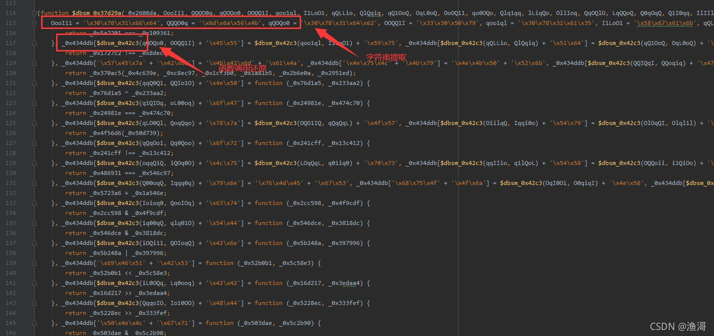


在函数调用还原前，字符串被提取了出来，所以相对于ob混淆多了一个步骤

1. 字符串与数字回填
2. 函数调用还原
3. 对象调用还原
4. 分支流程判断
5. 控制流平坦化

具体步骤详细过程,将在之后的文章中,因为篇幅很长,准备做成一个系列专题,每步一篇文章

将上面5步最后剩余的代码经过手动删减(剔除影响调试的代码,暴露接口)之后,

得到以下可使用python 直接调用的代码:

调用方式:

```python
# my_spider.py
def get_m():
    with open('02_ob_sort_reload.js', 'r', encoding='utf8') as f:
        data = f.read()
    value = execjs.eval(data)
    print(value)
    return value
```

### 附件:

最后的JS 文件内容

```js
// 02_ob_sort_reload.js
(function $dbsm_0x37d29a() {

    function _0x112208(_0x5b69d8, _0x3de4a1) {
        {
            _0x448c2f = (65535 & _0x5b69d8) + (65535 & _0x3de4a1);
            return (_0x5b69d8 >> 16) + (_0x3de4a1 >> 16) + (_0x448c2f >> 16) << 16 | 65535 & _0x448c2f;
        }
    }

    function _0x101700(_0x19c5f2, _0x40c04f) {
        {
            return _0x19c5f2 << _0x40c04f | _0x19c5f2 >>> 32 - _0x40c04f;
        }
    }

    function _0x4d9052(_0x2ad611, _0x12667c, _0x4e5444, _0x21c32c, _0x2ca7da, _0x44626f) {
        ;
        {
            return _0x112208(_0x101700(_0x112208(_0x112208(_0x12667c, _0x2ad611), _0x112208(_0x21c32c, _0x44626f)), _0x2ca7da), _0x4e5444);
        }
    }

    function _0x5624ba(_0x173d50, _0x1eb601, _0x3e80e6, _0x27ae79, _0x196272, _0x352dd6, _0x315a43) {
        {
            return _0x4d9052(_0x1eb601 & _0x3e80e6 | ~_0x1eb601 & _0x27ae79, _0x173d50, _0x1eb601, _0x196272, _0x352dd6, _0x315a43);
        }
    }

    function _0x2d8b1d(_0x32a9d0, _0x585bb5, _0x19b9f2, _0x53bbfb, _0x1cbfed, _0x34200c, _0x5135ca) {
        ;
        {
            return _0x4d9052(_0x585bb5 & _0x53bbfb | _0x19b9f2 & ~_0x53bbfb, _0x32a9d0, _0x585bb5, _0x1cbfed, _0x34200c, _0x5135ca);
        }
    }

    function _0x21cf21(_0x5f0db4, _0x560b61) {
        ;
        {
            _0x45ae5c = [99, 111, 110, 115, 111, 108, 101], _0x7cdad8 = '';
            for (_0x5d58e6 = 0; _0x5d58e6 < _0x45ae5c['length']; _0x5d58e6++) {
                {
                    _0x7cdad8 += String['fromCharCode'](_0x45ae5c[_0x5d58e6]);
                }
            }
            return _0x7cdad8;
        }
    }

    function _0x3316ae(_0x5c1f3b, _0xdee360, _0x251700, _0x2a047e, _0x4ea0af, _0x62d9e8, _0x1edd4c) {
        ;
        {
            return _0x4d9052(_0xdee360 ^ _0x251700 ^ _0x2a047e, _0x5c1f3b, _0xdee360, _0x4ea0af, _0x62d9e8, _0x1edd4c);
        }
    }

    function _0x160619(_0x2afda5, _0x4cf1da, _0x354d4e, _0x2c2702, _0x4b938d, _0x58d9fb, _0x5b82c0) {
        {
            return _0x4d9052(_0x354d4e ^ (_0x4cf1da | ~_0x2c2702), _0x2afda5, _0x4cf1da, _0x4b938d, _0x58d9fb, _0x5b82c0);
        }
    }

    function _0x1a8c0e(_0x4b49f3, _0x31923d, _0xbd3204, _0x693550, _0x540797, _0x5dacc8, _0x22f03d, _0x5b3e7f, _0x2ee10b, _0x30b068, _0x3a35a4) {
        ;
        {
            _0x4b49f3[_0x31923d >> 5] |= 128 << _0x31923d % 32, _0x4b49f3[14 + (_0x31923d + 64 >>> 9 << 4)] = _0x31923d;
            _0x5b3e7f = 1732584193, _0x2ee10b = -271733879, _0x30b068 = -1732584194, _0x3a35a4 = _0x5b3e7f - 1460850315;

            for (_0xbd3204 = 0; _0xbd3204 < _0x4b49f3['length']; _0xbd3204 += 16) _0x693550 = _0x5b3e7f, _0x540797 = _0x2ee10b, _0x5dacc8 = _0x30b068, _0x22f03d = _0x3a35a4, _0x5b3e7f = _0x5624ba(_0x5b3e7f, _0x2ee10b, _0x30b068, _0x3a35a4, _0x4b49f3[_0xbd3204], 7, -680876936), _0x3a35a4 = _0x5624ba(_0x3a35a4, _0x5b3e7f, _0x2ee10b, _0x30b068, _0x4b49f3[_0xbd3204 + 1], 12, -389564586), _0x30b068 = _0x5624ba(_0x30b068, _0x3a35a4, _0x5b3e7f, _0x2ee10b, _0x4b49f3[_0xbd3204 + 2], 17, 606105819), _0x2ee10b = _0x5624ba(_0x2ee10b, _0x30b068, _0x3a35a4, _0x5b3e7f, _0x4b49f3[_0xbd3204 + 3], 22, -1044525330), _0x5b3e7f = _0x5624ba(_0x5b3e7f, _0x2ee10b, _0x30b068, _0x3a35a4, _0x4b49f3[_0xbd3204 + 4], 7, -176418897), _0x3a35a4 = _0x5624ba(_0x3a35a4, _0x5b3e7f, _0x2ee10b, _0x30b068, _0x4b49f3[_0xbd3204 + 5], 12, 1200080426), _0x30b068 = _0x5624ba(_0x30b068, _0x3a35a4, _0x5b3e7f, _0x2ee10b, _0x4b49f3[_0xbd3204 + 6], 17, -1473231341), _0x2ee10b = _0x5624ba(_0x2ee10b, _0x30b068, _0x3a35a4, _0x5b3e7f, _0x4b49f3[_0xbd3204 + 7], 22, -45705983), _0x5b3e7f = _0x5624ba(_0x5b3e7f, _0x2ee10b, _0x30b068, _0x3a35a4, _0x4b49f3[_0xbd3204 + 8], 7, 1770010416), _0x3a35a4 = _0x5624ba(_0x3a35a4, _0x5b3e7f, _0x2ee10b, _0x30b068, _0x4b49f3[_0xbd3204 + 9], 12, -1958414417), _0x30b068 = _0x5624ba(_0x30b068, _0x3a35a4, _0x5b3e7f, _0x2ee10b, _0x4b49f3[_0xbd3204 + 10], 17, -42063), _0x2ee10b = _0x5624ba(_0x2ee10b, _0x30b068, _0x3a35a4, _0x5b3e7f, _0x4b49f3[_0xbd3204 + 11], 22, -1990404162), _0x5b3e7f = _0x5624ba(_0x5b3e7f, _0x2ee10b, _0x30b068, _0x3a35a4, _0x4b49f3[_0xbd3204 + 12], 7, 1804603682), _0x3a35a4 = _0x5624ba(_0x3a35a4, _0x5b3e7f, _0x2ee10b, _0x30b068, _0x4b49f3[_0xbd3204 + 13], 12, -40341101), _0x30b068 = _0x5624ba(_0x30b068, _0x3a35a4, _0x5b3e7f, _0x2ee10b, _0x4b49f3[_0xbd3204 + 14], 17, -1502882290), _0x2ee10b = _0x5624ba(_0x2ee10b, _0x30b068, _0x3a35a4, _0x5b3e7f, _0x4b49f3[_0xbd3204 + 15], 22, 1236535329), _0x5b3e7f = _0x2d8b1d(_0x5b3e7f, _0x2ee10b, _0x30b068, _0x3a35a4, _0x4b49f3[_0xbd3204 + 1], 5, -165796510), _0x3a35a4 = _0x2d8b1d(_0x3a35a4, _0x5b3e7f, _0x2ee10b, _0x30b068, _0x4b49f3[_0xbd3204 + 6], 9, -1069501632), _0x30b068 = _0x2d8b1d(_0x30b068, _0x3a35a4, _0x5b3e7f, _0x2ee10b, _0x4b49f3[_0xbd3204 + 11], 14, 643717713), _0x2ee10b = _0x2d8b1d(_0x2ee10b, _0x30b068, _0x3a35a4, _0x5b3e7f, _0x4b49f3[_0xbd3204], 20, -373897302), _0x5b3e7f = _0x2d8b1d(_0x5b3e7f, _0x2ee10b, _0x30b068, _0x3a35a4, _0x4b49f3[_0xbd3204 + 5], 5, -701558691), _0x3a35a4 = _0x2d8b1d(_0x3a35a4, _0x5b3e7f, _0x2ee10b, _0x30b068, _0x4b49f3[_0xbd3204 + 10], 9, 38016083), _0x30b068 = _0x2d8b1d(_0x30b068, _0x3a35a4, _0x5b3e7f, _0x2ee10b, _0x4b49f3[_0xbd3204 + 15], 14, -660478335), _0x2ee10b = _0x2d8b1d(_0x2ee10b, _0x30b068, _0x3a35a4, _0x5b3e7f, _0x4b49f3[_0xbd3204 + 4], 20, -405537848), _0x5b3e7f = _0x2d8b1d(_0x5b3e7f, _0x2ee10b, _0x30b068, _0x3a35a4, _0x4b49f3[_0xbd3204 + 9], 5, 568446438), _0x3a35a4 = _0x2d8b1d(_0x3a35a4, _0x5b3e7f, _0x2ee10b, _0x30b068, _0x4b49f3[_0xbd3204 + 14], 9, -1019803690), _0x30b068 = _0x2d8b1d(_0x30b068, _0x3a35a4, _0x5b3e7f, _0x2ee10b, _0x4b49f3[_0xbd3204 + 3], 14, -187363961), _0x2ee10b = _0x2d8b1d(_0x2ee10b, _0x30b068, _0x3a35a4, _0x5b3e7f, _0x4b49f3[_0xbd3204 + 8], 20, 1163531501), _0x5b3e7f = _0x2d8b1d(_0x5b3e7f, _0x2ee10b, _0x30b068, _0x3a35a4, _0x4b49f3[_0xbd3204 + 13], 5, -1444681467), _0x3a35a4 = _0x2d8b1d(_0x3a35a4, _0x5b3e7f, _0x2ee10b, _0x30b068, _0x4b49f3[_0xbd3204 + 2], 9, -51403784), _0x30b068 = _0x2d8b1d(_0x30b068, _0x3a35a4, _0x5b3e7f, _0x2ee10b, _0x4b49f3[_0xbd3204 + 7], 14, 1735328473), _0x2ee10b = _0x2d8b1d(_0x2ee10b, _0x30b068, _0x3a35a4, _0x5b3e7f, _0x4b49f3[_0xbd3204 + 12], 20, -1926607734), _0x5b3e7f = _0x3316ae(_0x5b3e7f, _0x2ee10b, _0x30b068, _0x3a35a4, _0x4b49f3[_0xbd3204 + 5], 4, -378558), _0x3a35a4 = _0x3316ae(_0x3a35a4, _0x5b3e7f, _0x2ee10b, _0x30b068, _0x4b49f3[_0xbd3204 + 8], 11, -2022574463), _0x30b068 = _0x3316ae(_0x30b068, _0x3a35a4, _0x5b3e7f, _0x2ee10b, _0x4b49f3[_0xbd3204 + 11], 16, 1839030562), _0x2ee10b = _0x3316ae(_0x2ee10b, _0x30b068, _0x3a35a4, _0x5b3e7f, _0x4b49f3[_0xbd3204 + 14], 23, -35309556), _0x5b3e7f = _0x3316ae(_0x5b3e7f, _0x2ee10b, _0x30b068, _0x3a35a4, _0x4b49f3[_0xbd3204 + 1], 4, -1530992060), _0x3a35a4 = _0x3316ae(_0x3a35a4, _0x5b3e7f, _0x2ee10b, _0x30b068, _0x4b49f3[_0xbd3204 + 4], 11, 1272893353), _0x30b068 = _0x3316ae(_0x30b068, _0x3a35a4, _0x5b3e7f, _0x2ee10b, _0x4b49f3[_0xbd3204 + 7], 16, -155497632), _0x2ee10b = _0x3316ae(_0x2ee10b, _0x30b068, _0x3a35a4, _0x5b3e7f, _0x4b49f3[_0xbd3204 + 10], 23, -1094730640), _0x5b3e7f = _0x3316ae(_0x5b3e7f, _0x2ee10b, _0x30b068, _0x3a35a4, _0x4b49f3[_0xbd3204 + 13], 4, 681279174), _0x3a35a4 = _0x3316ae(_0x3a35a4, _0x5b3e7f, _0x2ee10b, _0x30b068, _0x4b49f3[_0xbd3204], 11, -358537222), _0x30b068 = _0x3316ae(_0x30b068, _0x3a35a4, _0x5b3e7f, _0x2ee10b, _0x4b49f3[_0xbd3204 + 3], 16, -722521979), _0x2ee10b = _0x3316ae(_0x2ee10b, _0x30b068, _0x3a35a4, _0x5b3e7f, _0x4b49f3[_0xbd3204 + 6], 23, 76029189), _0x5b3e7f = _0x3316ae(_0x5b3e7f, _0x2ee10b, _0x30b068, _0x3a35a4, _0x4b49f3[_0xbd3204 + 9], 4, -640364487), _0x3a35a4 = _0x3316ae(_0x3a35a4, _0x5b3e7f, _0x2ee10b, _0x30b068, _0x4b49f3[_0xbd3204 + 12], 11, -421815835), _0x30b068 = _0x3316ae(_0x30b068, _0x3a35a4, _0x5b3e7f, _0x2ee10b, _0x4b49f3[_0xbd3204 + 15], 16, 530742520), _0x2ee10b = _0x3316ae(_0x2ee10b, _0x30b068, _0x3a35a4, _0x5b3e7f, _0x4b49f3[_0xbd3204 + 2], 23, -995338651), _0x5b3e7f = _0x160619(_0x5b3e7f, _0x2ee10b, _0x30b068, _0x3a35a4, _0x4b49f3[_0xbd3204], 6, -198630844), _0x3a35a4 = _0x160619(_0x3a35a4, _0x5b3e7f, _0x2ee10b, _0x30b068, _0x4b49f3[_0xbd3204 + 7], 10, 1126891415), _0x30b068 = _0x160619(_0x30b068, _0x3a35a4, _0x5b3e7f, _0x2ee10b, _0x4b49f3[_0xbd3204 + 14], 15, -1416354905), _0x2ee10b = _0x160619(_0x2ee10b, _0x30b068, _0x3a35a4, _0x5b3e7f, _0x4b49f3[_0xbd3204 + 5], 21, -57434055), _0x5b3e7f = _0x160619(_0x5b3e7f, _0x2ee10b, _0x30b068, _0x3a35a4, _0x4b49f3[_0xbd3204 + 12], 6, 1700485571), _0x3a35a4 = _0x160619(_0x3a35a4, _0x5b3e7f, _0x2ee10b, _0x30b068, _0x4b49f3[_0xbd3204 + 3], 10, -1894986606), _0x30b068 = _0x160619(_0x30b068, _0x3a35a4, _0x5b3e7f, _0x2ee10b, _0x4b49f3[_0xbd3204 + 10], 15, -1051523), _0x2ee10b = _0x160619(_0x2ee10b, _0x30b068, _0x3a35a4, _0x5b3e7f, _0x4b49f3[_0xbd3204 + 1], 21, -2054922799), _0x5b3e7f = _0x160619(_0x5b3e7f, _0x2ee10b, _0x30b068, _0x3a35a4, _0x4b49f3[_0xbd3204 + 8], 6, 1873313359), _0x3a35a4 = _0x160619(_0x3a35a4, _0x5b3e7f, _0x2ee10b, _0x30b068, _0x4b49f3[_0xbd3204 + 15], 10, -30611744), _0x30b068 = _0x160619(_0x30b068, _0x3a35a4, _0x5b3e7f, _0x2ee10b, _0x4b49f3[_0xbd3204 + 6], 15, -1560198380), _0x2ee10b = _0x160619(_0x2ee10b, _0x30b068, _0x3a35a4, _0x5b3e7f, _0x4b49f3[_0xbd3204 + 13], 21, 1309151649), _0x5b3e7f = _0x160619(_0x5b3e7f, _0x2ee10b, _0x30b068, _0x3a35a4, _0x4b49f3[_0xbd3204 + 4], 6, -145523070), _0x3a35a4 = _0x160619(_0x3a35a4, _0x5b3e7f, _0x2ee10b, _0x30b068, _0x4b49f3[_0xbd3204 + 11], 10, -1120210379), _0x30b068 = _0x160619(_0x30b068, _0x3a35a4, _0x5b3e7f, _0x2ee10b, _0x4b49f3[_0xbd3204 + 2], 15, 718787259), _0x2ee10b = _0x160619(_0x2ee10b, _0x30b068, _0x3a35a4, _0x5b3e7f, _0x4b49f3[_0xbd3204 + 9], 21, -343485441), _0x5b3e7f = _0x112208(_0x5b3e7f, _0x693550), _0x2ee10b = _0x112208(_0x2ee10b, _0x540797), _0x30b068 = _0x112208(_0x30b068, _0x5dacc8), _0x3a35a4 = _0x112208(_0x3a35a4, _0x22f03d);
            return [_0x5b3e7f, _0x2ee10b, _0x30b068, _0x3a35a4];
        }
    }

    function _0xb8fd83(_0x28b0d4) {
        ;
        {
            _0x18d4aa = '', _0x630f0 = 32 * _0x28b0d4['length'];
            for (_0x24362f = 0; _0x24362f < _0x630f0; _0x24362f += 8) _0x18d4aa += String['fromCharCode'](_0x28b0d4[_0x24362f >> 5] >>> _0x24362f % 32 & 255);
            return _0x18d4aa;
        }
    }

    function _0x44ecf2(_0x12f7d8) {
        ;
        {
            var _0x4a27a3 = [];
            for (_0x4a27a3[(_0x12f7d8['length'] >> 2) - 1] = void 0, _0x4d24a7 = 0; _0x4d24a7 < _0x4a27a3['length']; _0x4d24a7 += 1) _0x4a27a3[_0x4d24a7] = 0;
            var _0x4fa8f0 = 8 * _0x12f7d8['length'];
            for (_0x4d24a7 = 0; _0x4d24a7 < _0x4fa8f0; _0x4d24a7 += 8) _0x4a27a3[_0x4d24a7 >> 5] |= (255 & _0x12f7d8['charCodeAt'](_0x4d24a7 / 8)) << _0x4d24a7 % 32;
            return _0x4a27a3;
        }
    }

    function _0x57fdd5(_0x2ace3b) {
        {
            return _0xb8fd83(_0x1a8c0e(_0x44ecf2(_0x2ace3b), 8 * _0x2ace3b['length']));
        }
    }

    function _0x3781b2(_0x5802aa, _0x324521, _0x33c9ff, _0x5d4f74, _0x344078, _0x385415, _0x160dd3, _0x61f2ad, _0x5a2d55, _0x47bfff) {
        {
            _0x1548fd = '0123456789abcdef', _0x54f778 = '';
            for (_0x5da9b5 = 0; _0x5da9b5 < _0x5802aa['length']; _0x5da9b5 += 1) _0xd26743 = _0x5802aa['charCodeAt'](_0x5da9b5), _0x54f778 += _0x1548fd['charAt'](_0xd26743 >>> 4 & 15) + _0x1548fd['charAt'](15 & _0xd26743);
            return _0x54f778;
        }
    }

    function _0x45dccd(_0x5b4c95) {
        {
            return unescape(encodeURIComponent(_0x5b4c95));
        }
    }

    function _0x443ca7(_0x48561e) {
        ;
        {
            return _0x57fdd5(_0x45dccd(_0x48561e));
        }
    }

    function _0x184fb0(_0x49a1f3) {
        ;
        {
            return _0x3781b2(_0x443ca7(_0x49a1f3));
        }
    }

    function _0x313b78(_0x575158, _0x1fa91a, _0x1cf5de) {
        {
            return _0x1fa91a ? _0x1cf5de ? _0x21cf21(_0x1fa91a, _0x575158) : y(_0x1fa91a, _0x575158) : _0x1cf5de ? _0x443ca7(_0x575158) : _0x184fb0(_0x575158);
        }
    }

    function _0xdad69f(_0x160e3a, _0x3818c5) {
        {
            return 'm' + '=' + _0x313b78(_0x160e3a) + '|' + _0x160e3a;
        }
    }

    function _0x3e5ed0(_0x133a8b, _0x27a18b) {
        {
            return Date['parse'](new Date());
        }
    }

    return _0xdad69f(_0x3e5ed0());
}())

```


## 1.字符串数字回填

这一步会使用上一步生成的 `02_ob_right_3.json`文件

最终生成一份 `02_ob_string_number.js`文件和一份 `02_ob_string_number.json` 文件


之前已经下载了源JS文件,并将其分割成了两部分,

`02_ob_left_3.js` : 执行第二步函数调用还原时需要执行的JS文件

`02_ob_right_3.js` : 需要被还原的混淆文件,之后的所有分析,观察,改动,都是针对这个文件.

源JS文件的所有字符串都是16进制编码的,

在对其分割重新写入文件后,字符串都还原了(暂时不知道这样的方式,会不会对代码的运行产生影响)

强烈建议: 在观察分析JS文件之前,请先拷贝一份,不要对原JS(或者程序运行中产生临时的JS文件)进行格式化/美化,

否则可能产生未知错误(因为JS有一种抗格式化的语句,可以让格式化之后的代码无法运行)


现在测试一下,前三部分的JS代码有没有问题:

```python
# 在python中测试
with open('02_ob_left_3.js', 'r', encoding='utf-8') as f:
    ctx = execjs.compile(f.read())
resul = ctx.call('$dbsm_0x42c3', '0x1db', '30Py')
print(resul)

#===============
>>> Swi
```

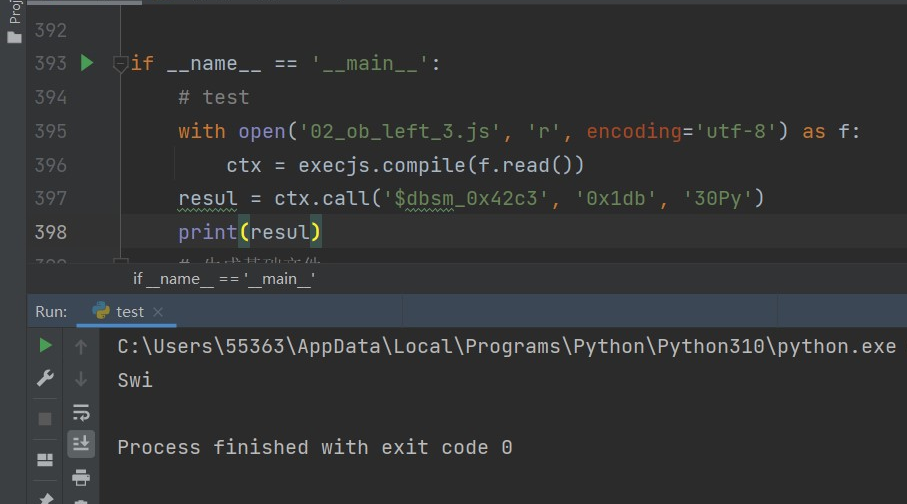

### 语法分析

要反混淆第一步就是对现有的代码做分析，找到其加密的规律，然后按照这个规律进行还原

我们先把源JS文件在pycharm 里格式化一下`Ctrl + Alt + L`, 

然后复制到[AST explorer](https://astexplorer.net/)，其中使用的解析器是esprima，我用的node的模块也是这个.

可以看到很快就可以将源代码转换成抽象语法树，然后随便点击一个`$dbsm_0x42c3`函数调用的地方看看

为什么点这个函数呢?因为它是整个JS的第三部分所申明的一个函数,又叫做解密函数,而且在整个JS中,它被调用了1000多次

我们第一步字符串与数字回填所要做的工作就是把调用这个函数的参数全部还原

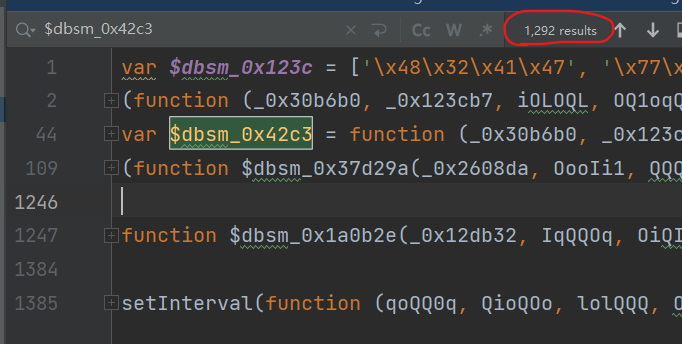

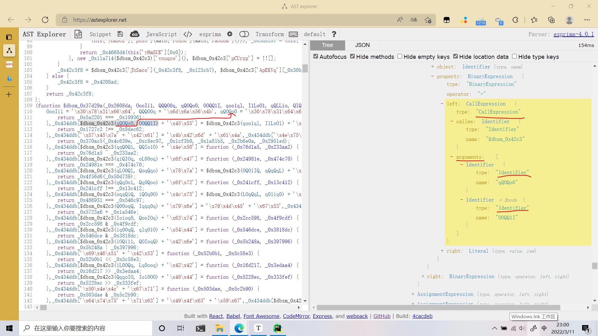


在简单一些的ob混淆中, `$dbsm_0x42c3`函数调用的地方,参数直接就是字符串,

但是这里我们看到,参数是在这一部分开头所申明的变量,

所以在执行函数还原之前,需要先有一步字符串与数字的回填

接下来我们随便点击一个这样的变量申明查看:

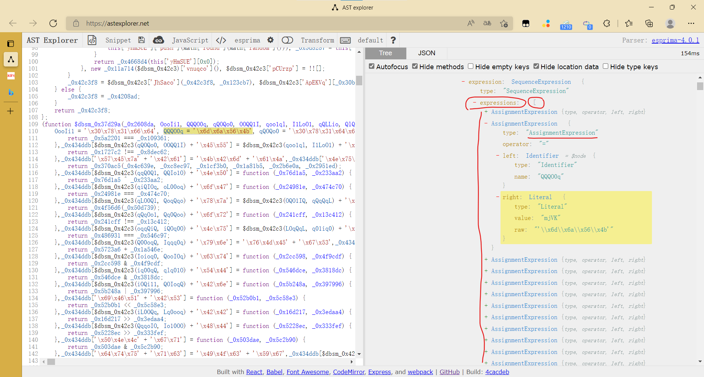


可以发现, 这本身是一个 AssignmentExpression(赋值) 的节点.(赋值操作符表达式。如果操作符是“||=”、“&&=”和“??= ") 

[AST 节点类型详解 ](https://github.com/babel/babel/blob/main/packages/babel-parser/ast/spec.md#assignmentexpression)https://github.com/babel/babel/blob/main/packages/babel-parser/ast/spec.md#assignmentexpression

被包含在一个列表里,拥有左右两个子节点,

左子节点类型 = Identifier (引用/变量)

右子节点类型 = Literal (常量/基本类型)

所以我们可以用递归的方式,找到所有这样的节点,将他们的映射保存在字典中, 以便在调用他们的地方做替换,

当然,也可以选择使用正则表达式做替换,但是非常不推荐,

因为正则是在字符串的层面做替换,并不关心节点本身的属性,遇到特殊情形时,发生的错误是无法察觉的.

就像这个例子里面, 右子节点的类型,并非全部是Literal ,在后面还混有 BinaryExpression(运算表达式) 类型,

这是怎么发现的呢?一开始我按照右子节点的类型,全部是Literal来写的代码,直到运行时报错,捕捉错误,输出节点全貌之后才发现的,

所以,如果是用正则直接做替换,这个错误无法被及时的发现,等到再之后的步骤中报错时,根本就找不到原因...别问我怎么知道的...

### 定位节点容器的路径

本来想用递归去查找这些申明节点,但是我发现,这些节点,全都在每个部分的开头处(4,5,6三个部分都有),意味着路径不深,

于是我觉得,可以直接定位包裹这些节点的列表容器,然后遍历就OK了.

```python
# 变量申明节点所在的列表的路径示意代码
# 说的路径不深,其实也不短
try:
    # 第四部分路径
    expressions_list = node['expression']['callee']['body']['body'][0]['expression']['expressions']
except TypeError:
    # 第五部分路径
    expressions_list = node['body']['body'][0]['expression']['expressions']
except KeyError:
    # 第六部分路径
    expressions_list = node['expression']['arguments'][0]['body']['body'][0]['expression']['expressions']
```

接着我将后三部分,分别传入,分别获取每一部分的变量与字符串映射的字典

为什么要分别提取呢? 因为这个示例里面变量名有重复,重复,复...

### 提取变量与字符串节点的映射关系

找到了容器,提取映射就变得非常简单

```python
# 提取字符串与数字的映射示例代码
# 定义一个存储映射的字典
string_number_dict = {}


def get_string_number_dict(node):
    # 后三部分,每一部分都有这样的结构,而且变量名称有重复,必须分开做
    # 先清空 string_number_dict
    string_number_dict.clear()
    try:
        expressions_list = node['expression']['callee']['body']['body'][0]['expression']['expressions']
    except TypeError:
        expressions_list = node['body']['body'][0]['expression']['expressions']
    except KeyError:
        expressions_list = node['expression']['arguments'][0]['body']['body'][0]['expression']['expressions']

    for item in expressions_list:
        if item['type'] != 'AssignmentExpression':
            continue
        if item['left']['type'] == 'Identifier':
            if item['right']['type'] == 'Literal': # 左右子节点属性都符合,直接存入
                string_number_dict[item['left']['name']] = item['right']
            elif item['right']['type'] == 'BinaryExpression':	# 右子节点是一个运算表达式
                left = string_number_dict[item['right']['left']['name']]
                right = item['right']['right']
                try:
                    new_node = copy.deepcopy(right)
                    # 将运算后的结果存入
                    new_node['value'] = eval(f'{left["value"]} {item["right"]["operator"]} {right["value"]}')
                    string_number_dict[item['left']['name']] = new_node
                except TypeError:
                    print(item['right'])
                    sys.exit()
```

### 字符串回填

映射提取好了,接着就是在调用这些变量的地方进行替换,

可以看到,这些变量被调用时,都包裹在一个名为 arguments 的 列表里

所以我递归访问每一个节点的 arguments 属性,以此找到所有变量调用的地方

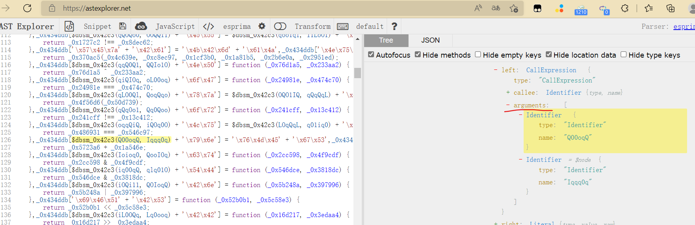


替换时和提取映射时一样,一次只能传入JS的一个部分去做,因为变量名有重复

需要替换的位置是不确定的,只能使用递归来完成

```python
# 映射替换示例代码
# 将调用这些变量的地方进行还原
def string_number_reload(node):
    # 一次只能还原一个部分
    if type(node) == list:
        # 虽然arguments 自身就是一个列表,但是他会在下方被捕捉,不会进入这个递归分支
        for item in node:
            string_number_reload(item)
        return
    elif type(node) != dict:  # 不是容器类型,就停止递归
        return
    
    # 捕捉一个包含 arguments 属性的节点
    try:
        for i in range(len(node['arguments'])):  # 遍历所有参数
            if node['arguments'][i]['type'] == 'Identifier':  # 匹配,则进入替换分支
                try:
                    # 捕获前面参数不匹配,而后面参数匹配的情况,确保每个参数都进行匹配
                    node['arguments'][i] = string_number_dict[node['arguments'][i]['name']]
                except KeyError:
                    pass
        else:
            raise KeyError
    except KeyError:  # 无论结局如何,将该节点所有属性,再次加入递归,防止漏网之鱼
        for key in node.keys():
            string_number_reload(node[key])
        return
    
```

### 删除映射节点

在回填结束后,所有的之前找到的变量申明节点都没有用了,

需要进行删除,我们使用之前的方式重新查找映射,之前是找到就存入,现在是找到就删除

```python
# 删除变量与字符串映射的节点
def del_string_number_node(node):
    string_number_dict.clear()
    try:
        expressions_list = node['expression']['callee']['body']['body'][0]['expression']['expressions']
    except TypeError:
        expressions_list = node['body']['body'][0]['expression']['expressions']
    except KeyError:
        expressions_list = node['expression']['arguments'][0]['body']['body'][0]['expression']['expressions']

    for i in range(len(expressions_list) - 1, -1, -1):
        if expressions_list[i]['type'] != 'AssignmentExpression':
            continue
        if expressions_list[i]['left']['type'] == 'Identifier' and expressions_list[i]['right']['type'] in (
                'Literal', 'BinaryExpression'):
            del expressions_list[i]
            
```

至此,第一步(字符串与数字回填)已完成,查看生成的 `02_ob_string_number.js`文件

最终效果如图:

可以看到所有函数调用的地方,参数已经还原成了字符串,申明变量的地方也已经被删除

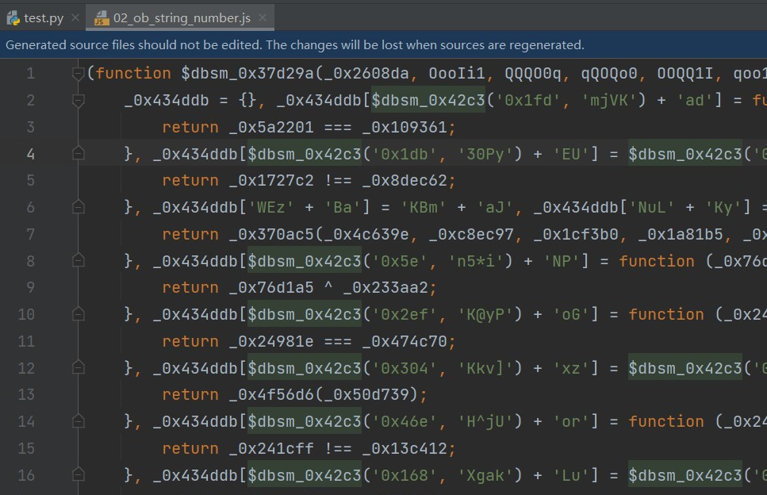


至此我们已经把

```python
_0x434ddb[$dbsm_0x42c3(qQOQo0, OOQQ1I) + 'EU'] = $dbsm_0x42c3(qoo1ql, I1LoO1) + 'Yu',
```

还原成了

```python
_0x434ddb[$dbsm_0x42c3('0x1db', '30Py') + 'EU'] = $dbsm_0x42c3('0x1a5', 'Xgak') + 'Yu',
```


### 附件: 第一步完整代码

字符串与数字回填,完整代码:

```python
# test.py
import copy
import json
import os
import sys

import requests
import config
import execjs


""" 字符串与数字回填 """
string_number_dict = {}


# 提取变量与字符串的映射
def get_string_number_dict(node):
    # 后三部分,每一部分都有这样的结构,而且变量名称有重复,必须分开做
    # 先清空 string_number_dict
    string_number_dict.clear()
    try:
        # 第四部分路径
        expressions_list = node['expression']['callee']['body']['body'][0]['expression']['expressions']
    except TypeError:
        # 第五部分路径
        expressions_list = node['body']['body'][0]['expression']['expressions']
    except KeyError:
        # 第六部分路径
        expressions_list = node['expression']['arguments'][0]['body']['body'][0]['expression']['expressions']

    for item in expressions_list:
        if item['type'] != 'AssignmentExpression':
            continue
        if item['left']['type'] == 'Identifier':
            if item['right']['type'] == 'Literal':
                string_number_dict[item['left']['name']] = item['right']
            elif item['right']['type'] == 'BinaryExpression':
                left = string_number_dict[item['right']['left']['name']]
                right = item['right']['right']
                try:
                    new_node = copy.deepcopy(right)
                    new_node['value'] = eval(f'{left["value"]} {item["right"]["operator"]} {right["value"]}')
                    string_number_dict[item['left']['name']] = new_node
                except TypeError:
                    print(item['right'])
                    sys.exit()


# 将调用这些变量的地方进行还原
def string_number_reload(node):
    # 一次只能还原一个部分
    if type(node) == list:
        for item in node:
            string_number_reload(item)
        return
    elif type(node) != dict:
        return
    # 调用这些变量的地方都是实参
    try:
        for i in range(len(node['arguments'])):
            if node['arguments'][i]['type'] == 'Identifier':
                try:
                    # 捕获前面参数不匹配,而后面参数匹配的情况
                    node['arguments'][i] = string_number_dict[node['arguments'][i]['name']]
                except KeyError:
                    pass
        else:
            raise KeyError
    except KeyError:
        for key in node.keys():
            string_number_reload(node[key])
        return


# 删除变量与字符串映射的节点
def del_string_number_node(node):
    string_number_dict.clear()
    try:
        expressions_list = node['expression']['callee']['body']['body'][0]['expression']['expressions']
    except TypeError:
        expressions_list = node['body']['body'][0]['expression']['expressions']
    except KeyError:
        # 第五部分路径
        expressions_list = node['expression']['arguments'][0]['body']['body'][0]['expression']['expressions']

    for i in range(len(expressions_list) - 1, -1, -1):
        if expressions_list[i]['type'] != 'AssignmentExpression':
            continue
        if expressions_list[i]['left']['type'] == 'Identifier' and expressions_list[i]['right']['type'] in (
                'Literal', 'BinaryExpression'):
            del expressions_list[i]


""" ********************************************************* """


if __name__ == '__main__':
    # 生成基础文件
    # get_02_ob_js()

    """ 字符串与数字回填[ok] """
    with open('02_ob_right_3.json', 'r', encoding='utf8') as f:
        data = json.loads(f.read())
    for item in data['body']:	# 将每一部分,分别做回填
        get_string_number_dict(item)
        string_number_reload(item)
        del_string_number_node(item)
    with open('02_ob_string_number.json', 'w', encoding='utf8') as f:
        f.write(json.dumps(data))	# 将结果写入json给下一步读取继续更改,写入js供下一步观察分析
    os.system('node JsonToJs 02_ob_string_number.json 02_ob_string_number.js')
```


## 2.函数调用还原

这一步会使用上一步生成的 `02_ob_string_number.json`文件和开端生成的`02_ob_left_3.js` 文件

最终生成一份`02_ob_call_function_reload.js`文件和一份 `02_ob_call_function_reload.json` 文件


上一章已经将函数调用时的参数都还原出来了,

把

```js
_0x434ddb[$dbsm_0x42c3(qQOQo0, OOQQ1I) + 'EU'] = $dbsm_0x42c3(qoo1ql, I1LoO1) + 'Yu',
```

还原成了

```js
_0x434ddb[$dbsm_0x42c3('0x1db', '30Py') + 'EU'] = $dbsm_0x42c3('0x1a5', 'Xgak') + 'Yu',
```

### 结构分析

这一章需要将所有调用`$dbsm_0x42c3`函数的地方进行还原

还原的方式就是找到函数调用的节点,获取其参数后,

接着调用nodejs 运行 `02_ob_left_3.js`文件里的`$dbsm_0x42c3`函数,

将得到的返回值,替换所找到的函数调用节点.

我们先观察一下,函数调用节点的模样

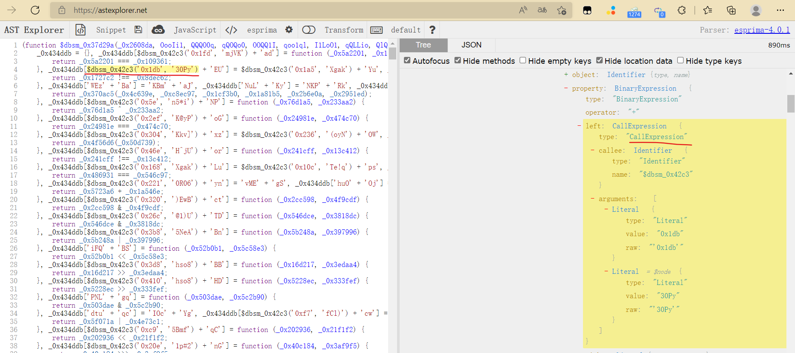


整个节点类型是  CallExpression 函数调用节点,  callee 子节点的name属性为 $dbsm_0x42c3,

并且所有的参数都是 Literal 类型

接下来就可以编写代码

### 代码

```python
# test.py

""" 函数调用还原 """


def call_function_reload(node, ctx):
    if type(node) == list:
        for item in node:
            call_function_reload(item, ctx)
        return
    elif type(node) != dict:
        return
	
    # 捕获一个 CallExpression 节点
    if node['type'] == 'CallExpression':
        try:
            if node['callee']['name'] == '$dbsm_0x42c3':  # 确认函数名
                arg_list = []
                for item in node['arguments']:  # 提取所有参数
                    if item['type'] != 'Literal':
                        break
                    arg_list.append(item['value'])
                else:
                    # 这里有一个隐藏的彩蛋,如果是用GBK去解码会触发报错,就会引起关注,就有可能发现这个彩蛋
                    value = ctx.call('$dbsm_0x42c3', *arg_list)
                    print(value)  # 这里加入一个print() 省的以为程序卡死了
                    new_node = {'type': 'Literal', 'value': value}
                    node.clear()
                    node.update(new_node)
                    return
        except KeyError:
            pass
    for key in node.keys():
        call_function_reload(node[key], ctx)


""" ********************************************************* """
if __name__ == '__main__':
    # 生成基础文件
    ...
    """ 字符串与数字回填[ok] """
    ...
    """ 函数调用还原[ok](此步骤及其耗时,估计是需要用python 频繁调用nodejs的原因) """
    with open('02_ob_string_number.json', 'r', encoding='utf8') as f:
        data = json.loads(f.read())
    with open('02_ob_left_3.js', 'r', encoding='utf-8') as f:
        ctx = execjs.compile(f.read())
        
    call_function_reload(data, ctx)
    
    with open('02_ob_call_function_reload.json', 'w', encoding='utf8') as f:
        f.write(json.dumps(data))
    os.system('node JsonToJs 02_ob_call_function_reload.json 02_ob_call_function_reload.js')
    
```

程序运行结束后,我们打开新生成的`02_ob_call_function_reload.js`文件观察一下,

所有调用 `$dbsm_0x42c3` 函数的地方都已经被字符串替换

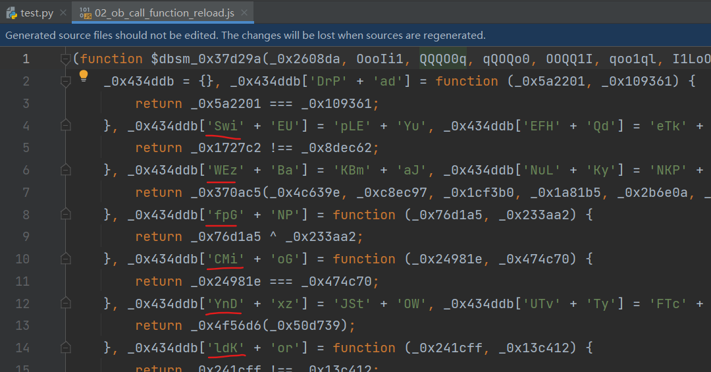


至此,函数调用还原已完成,我们把

```js
_0x434ddb[$dbsm_0x42c3('0x1db', '30Py') + 'EU'] = $dbsm_0x42c3('0x1a5', 'Xgak') + 'Yu',
```

还原成了

```js
_0x434ddb['Swi' + 'EU'] = 'pLE' + 'Yu',
```


## 3.对象调用还原

这一章会使用上一章生成的 `02_ob_call_function_reload.json`文件

最终生成一份`02_ob_obj_property_reload.js`文件和一份 `02_ob_obj_property_reload.json` 文件


上一章,我们已经把

```js
_0x434ddb[$dbsm_0x42c3('0x1db', '30Py') + 'EU'] = $dbsm_0x42c3('0x1a5', 'Xgak') + 'Yu',
```

还原成了

```js
_0x434ddb['Swi' + 'EU'] = 'pLE' + 'Yu',
```

我们发现现在有很多的字符串拼接处于待完成状态,

在进行对象调用还原之前,需要将这些字符串都拼接好.

### 拼接字符串

随便找一个字符串拼接的地方,观察一下结构

可以发现,他们分别是 一个类型为 BinaryExpression 的节点的 左右子节点,

且 类型都是 Literal

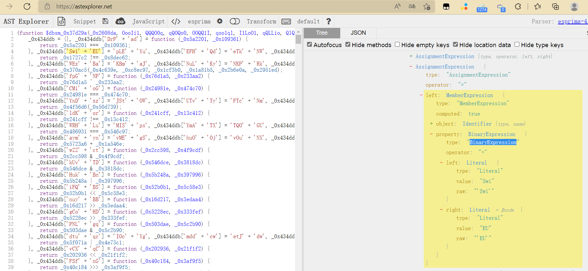


于是可以编写代码:

```python
# test.py
# 将拆分开的对象属性名称合并
def concat_obj_property_name(node):
    if type(node) == list:
        for item in node:
            concat_obj_property_name(item)
        return
    elif type(node) != dict:
        return

    # 捕获一个二元运算节点
    if node['type'] == 'BinaryExpression':
        if not (node['left']['type'] == 'Literal' and node['right']['type'] == 'Literal'):
            # 如果 其中有参数不是 字符 类型,则将两个参数都继续递归
            concat_obj_property_name(node['left'])
            concat_obj_property_name(node['right'])
        # 当两个参数分别的递归都完成, 参数类型最终都变为了 字符 类型,则可以合并,这样就实现了一连串的字符相加
        if node['left']['type'] == 'Literal' and node['right']['type'] == 'Literal':
            new_node = {'type': 'Literal', 'value': node['left']['value'] + node['right']['value']}
            node.clear()
            node.update(new_node)
            return

    for key in node.keys():
        concat_obj_property_name(node[key])

        
if __name__ == '__main__':
    # 生成基础文件
    ...
    """ 字符串与数字回填[ok] """
    ...
    """ 函数调用还原[ok] """
    ...
    """ 对象调用还原[ok] """
    with open('02_ob_call_function_reload.json', 'r', encoding='utf8') as f:
        data = json.loads(f.read())
    concat_obj_property_name(data)
    with open('02_ob_concat_str.json', 'w', encoding='utf8') as f:
        f.write(json.dumps(data))
    os.system('node JsonToJs 02_ob_concat_str.json 02_ob_concat_str.js')
    # 会生成一份用于观察分析下一步的临时文件 02_ob_concat_str.js/json
    
```

这样,就将

```js
_0x434ddb['Swi' + 'EU'] = 'pLE' + 'Yu',
```

还原成了

```python
_0x434ddb['SwiEU'] = 'pLEYu',
```


### 获取对象的属性字典

我们用刚生成的 `02_ob_concat_str.js`来分析,

可以看到,先是声明了一个对象,然后不断的向这个对象添加新的属性,

(这些属性值的类型很杂,有字符串,有函数定义,有其它对象的属性调用...)

然后又在其它地方,调用了这个对象的大量属性

这一章要完成的事情就是将调用这些属性的地方,替换成这些属性的值

下图是定义属性的地方:

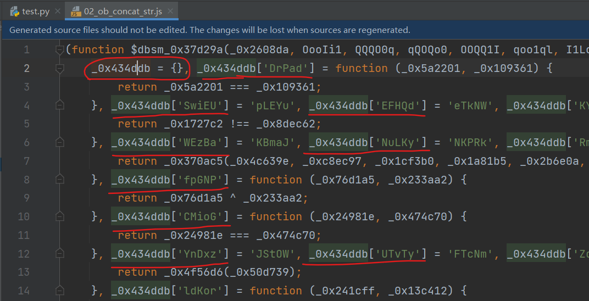


下图是调用属性的地方:

可以发现,它先将属性定义全部完成的对象(_0x434ddb),赋值给了另一个对象(_0x5500bb),画圈的地方,

然后大量调用新的对象

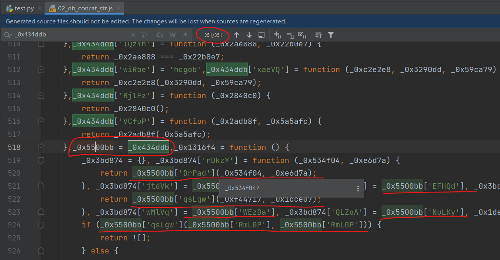


我们需要构造一个这样的字典,来保存 对象->属性->值 的映射关系,以便在还原时使用

```python
# 对象属性字典结构示例

obj_property_dict = {
    '对象名称1':{
        '属性名称1': '属性值节点',
        '属性名称2': '属性值节点',
        ...
    },
    '对象名称2':{
        '属性名称1': '属性值节点',
        '属性名称2': '属性值节点',
        ...
    },
    ...
}
```

找到了他们之间的关系,接下来就需要分析他们的结构:

先分析属性赋值的部分

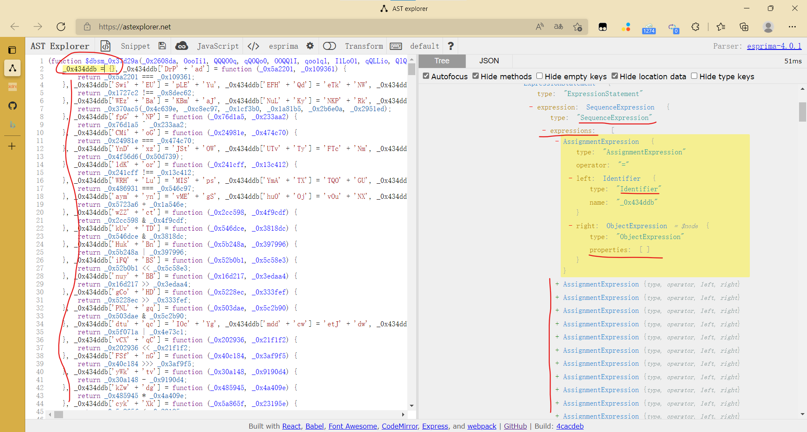


可以看到,对象声明,和属性添加所有的节点,都包含在一个类型为 SequenceExpression (表达式序列)节点的 expressions属性列表里面,

于是我们可以遍历这个列表,获取 对象->属性->值 的映射

```python
# test.py
# 构造对象属性字典
obj_property_dict = {}


def get_property_dicet(node):
    # 所有对象申明时都是: XXXX = {}, 然后使用 XXXX['xxxx'] = XXXXXXX 来添加属性
    if type(node) == list:
        for item in node:
            get_property_dicet(item)
        return
    elif type(node) != dict:
        return

    # 捕获一个表达式序列
    if node['type'] == 'SequenceExpression':
        for i in range(- len(node['expressions']), 0, 1):  # 这是一边正向遍历列表,并且可以一边删除元素的方式
            item = node['expressions'][i]
            # 捕获一个(变量/属性)声明节点
            if item['type'] == 'AssignmentExpression':
                # 是一个变量申明
                if item['left']['type'] == 'Identifier':
                    # 声明的是一个空对象
                    if item['right']['type'] == 'ObjectExpression' and item['right']['properties'] == []:
                        obj_property_dict[item['left']['name']] = {}
                        obj_name_list.append(item['left']['name'])
                        del node['expressions'][i]
                        continue
                    # 声明 一个变量指向另一个变量 例: _0x5500bb = _0x434ddb,
                    elif item['right']['type'] == 'Identifier':
                        if item['right']['name'] in obj_property_dict:
                            obj_property_dict[item['left']['name']] = obj_property_dict[item['right']['name']]
                            obj_name_list.append(item['left']['name'])
                            del node['expressions'][i]
                            continue
                # 是一个属性声明
                elif item['left']['type'] == 'MemberExpression':
                    obj_name = item['left']['object']['name']
                    try:
                        obj_property_name = item['left']['property']['value']
                        obj_property_dict[obj_name][obj_property_name] = item['right']
                        del node['expressions'][i]
                        continue
                    except KeyError:
                        pass
			# 处理完一个子节点后,将子节点的所有属性加入递归,以免漏网之鱼
            for key in item.keys():
                get_property_dicet(item[key])

    for key in node.keys():
        get_property_dicet(node[key])
        
        
if __name__ == '__main__':
    # 生成基础文件
    ...
    """ 字符串与数字回填[ok] """
    ...
    """ 函数调用还原[ok] """
    ...
    """ 对象调用还原[ok] """
    # 拼接字符串
    ...
    # 获取对象属性字典
    get_property_dicet(data)
    with open('02_ob_del_obj_property.json', 'w', encoding='utf8') as f:
        f.write(json.dumps(data))
    os.system('node JsonToJs 02_ob_del_obj_property.json 02_ob_del_obj_property.js')
        
```

代码中可以看到,我在找到这些节点,将其存入字典中后,顺带就将其删除了,

因为这些节点在该章结束之后就不再有意义,现在留着,之后也会再次查找这些节点来删除.

此步骤会生成一个临时文件`02_ob_del_obj_property.js`,用于下一步的观察分析


### 对象调用还原

在获取了 对象->属性->值 的映射字典后,就可以查找调用这些属性的地方,将其还原

现在分析一下 `02_ob_del_obj_property.js`文件,对象调用的地方

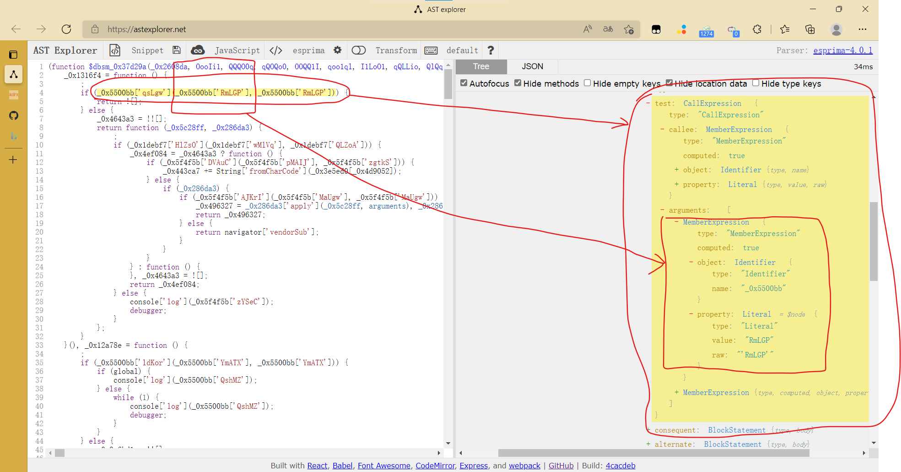


对象调用有两种方式: 

函数式调用 CallExpression 类型的节点

直接调用属性 MemberExpression 类型的节点

MemberExpression 节点比较简单,直接就是返回字符串.

但是函数是调用的返回值有多种类型,需要做不同的应对

查看返回值类型要去上上一步生成的`02_ob_concat_str.js`文件,在上一个文件里,这些节点都被我删掉了,哈哈

具体有(这里我懒得截图,直接上大佬的图):

#### 1.返回字符串（类型：Literal）

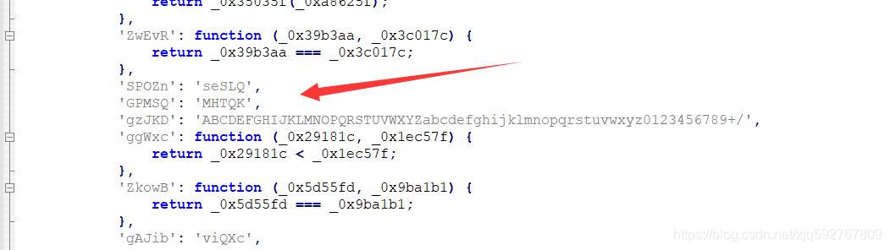

#### 2.返回对象调用（类型：MemberExpression）

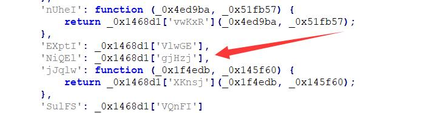

#### 3.返回二元表达式（类型：BinaryExpression）

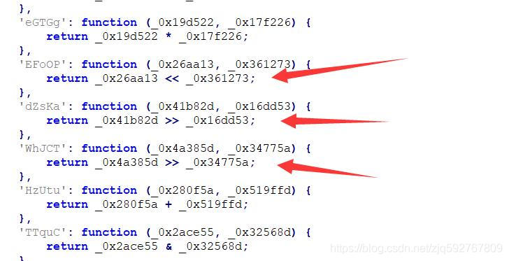

#### 4.返回逻辑计算（类型：LogicalExpression）

因为这个文件没有，我就从其他地方截图

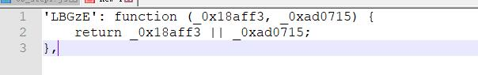

#### 5.返回函数调用（类型：CallExpression）

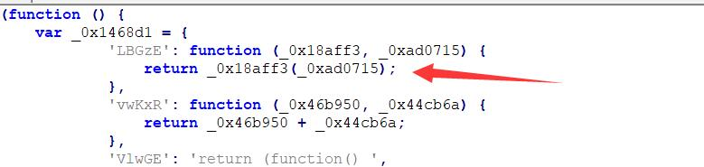


对于1和2，比较简单，调用什么就直接将节点替换为调用的内容即可。

就1,2的图示来看, 这并非是CallExpression 节点返回值的样式,而属于上一种 MemberExpression 型节点,

但是如果将图示的区域,包裹在一个函数定义节点里,就会形成1,2的实际情形,所以下面的代码,依然考虑到了这样的情形.

对于3和4是类似的，都是由中间的符号和左右的标识组成，只要将调用时的第一个参数替换到符号的左边，第二个参数替换到符号的右边，然后将整个节点替换掉就可以。

对于5，我这里的做法是 同时提取形参名和实参节点,以调用对象时传参的顺序为标准,构建临时字典`dict = {'形参名': 实参节点, ... }`,

在替换return语句中的形参时,以此字典为标准,进行替换,这样不必在意return语句中的参数,与形参是否位置上对应.

这一步代码:

```python
# 对象调用还原
def obj_property_reload(node):
    if type(node) == list:
        for item in node:
            obj_property_reload(item)
        return
    elif type(node) != dict:
        return

    # 捕获一个属性调用节点
    if node['type'] == 'MemberExpression':
        try:
            obj_name = node['object']['name']
            obj_property = node['property']['value']
            new_node = obj_property_dict[obj_name][obj_property]
            if new_node['type'] != 'FunctionExpression':
                # 属性值不是一个函数定义节点,就直接替换
                node.clear()
                node.update(new_node)
                obj_property_reload(node)
        except KeyError:
            pass
    try:
        # 捕获一个函数调用节点,且子节点callee的类型是一个MemberExpression
        if node['type'] != 'CallExpression' or node['callee']['type'] != 'MemberExpression':
            raise KeyError
        obj_name = node['callee']['object']['name']  # 获取对象名称
        obj_property_name = node['callee']['property']['value']  # 获取需要调用的对象属性名称
        function_node = obj_property_dict[obj_name][obj_property_name]  # 获取函数定义节点,即对象的属性值(该属性值是一个函数定义)
    except KeyError:
        for key in node.keys():
            obj_property_reload(node[key])
        return

    # 获取形参
    param_list = [item['name'] for item in function_node['params']]
    # 获取实参
    argument_list = node['arguments']
    # 形成 形参与实参的对应关系,如此,可以适应形参位置发生变化
    param_argument_dict = dict(zip(param_list, argument_list))

    # 拷贝一份函数节点的返回值子节点
    return_node = copy.deepcopy(function_node['body']['body'][0])
    if return_node['type'] != 'ReturnStatement':
        print(f'意料之外的函数节点,拥有超过一行的函数体: {function_node}')
        sys.exit()

    # 使用实参替换返回值节点中的形参,然后用返回值节点,替换掉整个函数调用node节点
    if return_node['argument']['type'] == 'Literal' or return_node['argument']['type'] == 'MemberExpression':
        # 这里所对应的其实也不是1,2点情况,而是把1,2点的区域包裹在一个函数中的情形
        # 直接替换
        node.clear()
        node.update(return_node['argument'])
    elif return_node['argument']['type'] == 'BinaryExpression' or return_node['argument'][
        'type'] == 'LogicalExpression':
        # 对应3,4点情况
        if return_node['argument']['left']['type'] == 'Identifier':
            return_node['argument']['left'] = param_argument_dict[return_node['argument']['left']['name']]
        if return_node['argument']['right']['type'] == 'Identifier':
            return_node['argument']['right'] = param_argument_dict[return_node['argument']['right']['name']]
        node.clear()
        node.update(return_node['argument'])
    elif return_node['argument']['type'] == 'CallExpression':
        # 对应第5点情况
        if return_node['argument']['callee']['type'] != 'MemberExpression':
            function_name = return_node['argument']['callee']['name']
            if function_name in param_argument_dict:
                return_node['argument']['callee'] = param_argument_dict[function_name]
        for i in range(len(return_node['argument']['arguments'])):
            if return_node['argument']['arguments'][i]['type'] == 'Identifier':
                argument_name = return_node['argument']['arguments'][i]['name']
                return_node['argument']['arguments'][i] = param_argument_dict[argument_name]
        node.clear()
        node.update(return_node['argument'])
    else:
        print(f'意料之外的函数返回值类型: {return_node}')
        sys.exit()
    # 替换完成后,将自身继续递归以免漏网之鱼
    obj_property_reload(node)
    return


if __name__ == '__main__':
    # 生成基础文件
    ...
    """ 字符串与数字回填[ok] """
    ...
    """ 函数调用还原[ok] """
    ...
    """ 对象调用还原[ok] """
    # 拼接字符串
    ...
    # 获取对象属性字典
    ...
    # 对象调用还原
    obj_property_reload(data)
    with open('02_ob_obj_property_reload.json', 'w', encoding='utf8') as f:
        f.write(json.dumps(data))
    os.system('node JsonToJs 02_ob_obj_property_reload.json 02_ob_obj_property_reload.js')

```

最后生成了 `02_ob_obj_property_reload.js`

至此,`对象调用还原`步骤完成

我们将

```python
if (_0x5500bb['qsLgw'](_0x5500bb['RmLGP'], _0x5500bb['RmLGP']))
```

还原成了

```python
if ('QcUHF' !== 'QcUHF')
```


### 附件: 第三步整体代码

```python
# test.py
""" 对象调用还原 """


# 将拆分开的对象属性名称合并
def concat_obj_property_name(node):
    if type(node) == list:
        for item in node:
            concat_obj_property_name(item)
        return
    elif type(node) != dict:
        return

    # 捕获一个二元运算节点
    if node['type'] == 'BinaryExpression':
        if not (node['left']['type'] == 'Literal' and node['right']['type'] == 'Literal'):
            # 如果 其中有参数不是 字符 类型,则将两个参数都继续递归
            concat_obj_property_name(node['left'])
            concat_obj_property_name(node['right'])
        # 当两个参数的递归都完成, 参数类型最终都变为了 字符 类型,则可以合并,这样就实现了一连串的字符相加
        if node['left']['type'] == 'Literal' and node['right']['type'] == 'Literal':
            new_node = {'type': 'Literal', 'value': node['left']['value'] + node['right']['value']}
            node.clear()
            node.update(new_node)
            return

    for key in node.keys():
        concat_obj_property_name(node[key])


# 构造对象属性字典
obj_property_dict = {}
obj_name_list = []


def get_property_dicet(node):
    # 所有对象申明时都是: XXXX = {}, 然后使用 XXXX['xxxx'] = XXXXXXX 来添加属性
    if type(node) == list:
        for item in node:
            get_property_dicet(item)
        return
    elif type(node) != dict:
        return

    # 捕获一个表达式序列
    if node['type'] == 'SequenceExpression':
        for i in range(- len(node['expressions']), 0, 1):  # 正向遍历列表,并且可以删除元素的方式
            item = node['expressions'][i]
            # 捕获一个(变量/属性)申明节点
            if item['type'] == 'AssignmentExpression':
                # 是一个变量申明
                if item['left']['type'] == 'Identifier':
                    # 申明的是一个空对象
                    if item['right']['type'] == 'ObjectExpression' and item['right']['properties'] == []:
                        obj_property_dict[item['left']['name']] = {}
                        obj_name_list.append(item['left']['name'])
                        del node['expressions'][i]
                        continue
                    # 申明 一个变量指向另一个变量 例: _0x5500bb = _0x434ddb,
                    elif item['right']['type'] == 'Identifier':
                        if item['right']['name'] in obj_property_dict:
                            obj_property_dict[item['left']['name']] = obj_property_dict[item['right']['name']]
                            obj_name_list.append(item['left']['name'])
                            del node['expressions'][i]
                            continue
                # 是一个属性申明
                elif item['left']['type'] == 'MemberExpression':
                    obj_name = item['left']['object']['name']
                    try:
                        obj_property_name = item['left']['property']['value']
                        obj_property_dict[obj_name][obj_property_name] = item['right']
                        del node['expressions'][i]
                        continue
                    except KeyError:
                        pass

            for key in item.keys():
                get_property_dicet(item[key])

    for key in node.keys():
        get_property_dicet(node[key])


# 对象调用还原
def obj_property_reload(node):
    if type(node) == list:
        for item in node:
            obj_property_reload(item)
        return
    elif type(node) != dict:
        return

    # 捕获一个属性调用节点
    if node['type'] == 'MemberExpression':
        try:
            obj_name = node['object']['name']
            obj_property = node['property']['value']
            new_node = obj_property_dict[obj_name][obj_property]
            if new_node['type'] != 'FunctionExpression':
                node.clear()
                node.update(new_node)
                obj_property_reload(node)
        except KeyError:
            pass
    try:
        # 捕获一个函数调用节点,且子节点callee的类型是一个MemberExpression
        if node['type'] != 'CallExpression' or node['callee']['type'] != 'MemberExpression':
            raise KeyError
        obj_name = node['callee']['object']['name']  # 获取对象名称
        obj_property_name = node['callee']['property']['value']  # 获取需要调用的对象属性名称
        function_node = obj_property_dict[obj_name][obj_property_name]  # 获取函数定义节点,即对象的属性值(该属性值是一个函数定义)
    except KeyError:
        for key in node.keys():
            obj_property_reload(node[key])
        return

    # 获取形参
    param_list = [item['name'] for item in function_node['params']]
    # 获取实参
    argument_list = node['arguments']
    # 形成形参与实参的对比关系,如此,可以适应形参位置发生变化
    param_argument_dict = dict(zip(param_list, argument_list))

    # 拷贝一份函数节点的返回值子节点
    return_node = copy.deepcopy(function_node['body']['body'][0])
    if return_node['type'] != 'ReturnStatement':
        print(f'意料之外的函数节点,拥有超过一行的函数体: {function_node}')
        sys.exit()

    # 使用实参替换返回值节点中的形参,然后用返回值节点,替换掉整个函数调用node节点
    if return_node['argument']['type'] == 'Literal' or return_node['argument']['type'] == 'MemberExpression':
        # 直接替换
        node.clear()
        node.update(return_node['argument'])
    elif return_node['argument']['type'] == 'BinaryExpression' or return_node['argument'][
        'type'] == 'LogicalExpression':
        if return_node['argument']['left']['type'] == 'Identifier':
            return_node['argument']['left'] = param_argument_dict[return_node['argument']['left']['name']]
        if return_node['argument']['right']['type'] == 'Identifier':
            return_node['argument']['right'] = param_argument_dict[return_node['argument']['right']['name']]
        node.clear()
        node.update(return_node['argument'])
    elif return_node['argument']['type'] == 'CallExpression':
        if return_node['argument']['callee']['type'] != 'MemberExpression':
            function_name = return_node['argument']['callee']['name']
            if function_name in param_argument_dict:
                return_node['argument']['callee'] = param_argument_dict[function_name]
        for i in range(len(return_node['argument']['arguments'])):
            if return_node['argument']['arguments'][i]['type'] == 'Identifier':
                argument_name = return_node['argument']['arguments'][i]['name']
                return_node['argument']['arguments'][i] = param_argument_dict[argument_name]
        node.clear()
        node.update(return_node['argument'])
    else:
        print(f'意料之外的函数返回值类型: {return_node}')
        sys.exit()
    # 替换完成后,将自身继续递归
    obj_property_reload(node)
    return


""" ********************************************************* """


if __name__ == '__main__':
    # 生成基础文件
    ...
    """ 字符串与数字回填[ok] """
    ...
    """ 函数调用还原[ok] """
    ...
    """ 对象调用还原[ok] """
    with open('02_ob_call_function_reload.json', 'r', encoding='utf8') as f:
        data = json.loads(f.read())
    concat_obj_property_name(data)
    with open('02_ob_concat_str.json', 'w', encoding='utf8') as f:
        f.write(json.dumps(data))
    os.system('node JsonToJs 02_ob_concat_str.json 02_ob_concat_str.js')

    get_property_dicet(data)
    with open('02_ob_del_obj_property.json', 'w', encoding='utf8') as f:
        f.write(json.dumps(data))
    os.system('node JsonToJs 02_ob_del_obj_property.json 02_ob_del_obj_property.js')
    # 验证对象名称是否有重复,如果有,就只能将JS分成单个部分传入还原
    # print(len(obj_property_dict))
    # print(len(obj_name_list))

    obj_property_reload(data)
    with open('02_ob_obj_property_reload.json', 'w', encoding='utf8') as f:
        f.write(json.dumps(data))
    os.system('node JsonToJs 02_ob_obj_property_reload.json 02_ob_obj_property_reload.js')
    
```


## 4.分支流程判断

这一章会使用上一章生成的 `02_ob_obj_property_reload.json`文件

最终生成一份`02_ob_if_reload.js`文件和一份 `02_ob_if_reload.json` 文件

上一章我们已经把

```python
if (_0x5500bb['qsLgw'](_0x5500bb['RmLGP'], _0x5500bb['RmLGP']))
```

还原成了

```python
if ('QcUHF' !== 'QcUHF')
```

### 结构分析

我们继续观察`02_ob_obj_property_reload.js`文件可以发现,里面有很多 `if 分支语句`

它们的条件bool值已经可以确定,那么其中一条分支就已经是多余的,

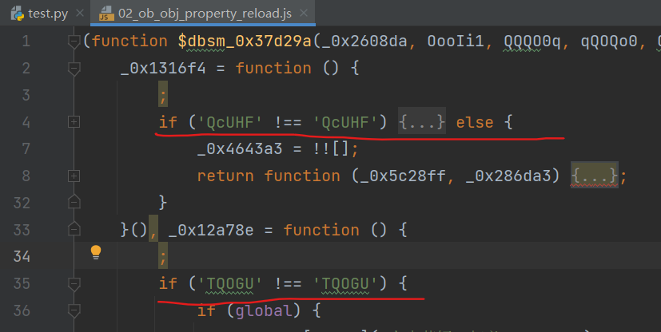


接下来我们分析一下结构信息

节点类型是 IfStatement (分支语句节点),其属性 consequent 和 alternate 分别代表了Ture 和 Flase 的分支,

我们只要递归找到这样的节点,判断其条件的bool值,只保留其相应的分支即可

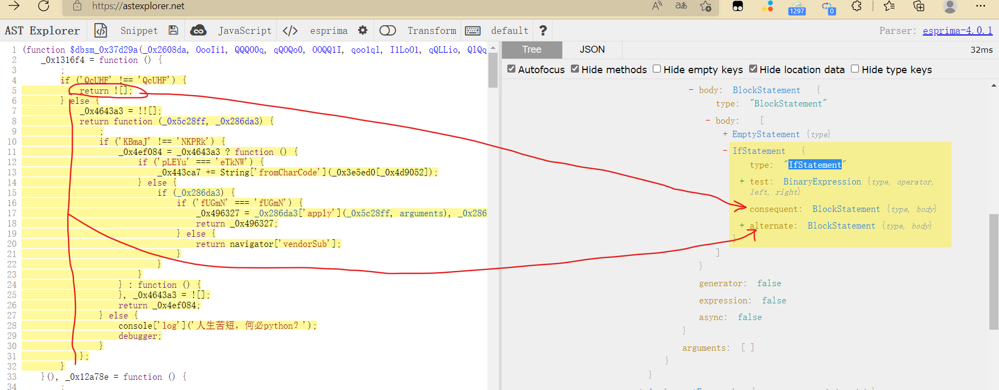


### 代码

```python
""" 分支流程判断 """
operator_dict = {'===': '==', '!==': '!='}


def if_reload(node):
    if type(node) == list:
        for item in node:
            if_reload(item)
        return
    elif type(node) != dict:
        return

    # 捕获一个分支语句节点
    if node['type'] == 'IfStatement':
        if node['test']['type'] == 'BinaryExpression':
            # 判断分支条件是否可执行
            if node['test']['left']['type'] == 'Literal' and node['test']['right']['type'] == 'Literal':
                # 获取分支节点
                consequent = node['consequent']
                alternate = node['alternate']
                try:
                    if eval(f"'{node['test']['left']['value']}' {operator_dict[node['test']['operator']]} '{node['test']['right']['value']}'"):
                        node.clear()
                        node.update(consequent)
                    else:
                        node.clear()
                        node.update(alternate)
                except KeyError:
                    print(f'意料之外的分支运算符号: {node}')
                    sys.exit()
                else:
                    if_reload(node)

    for key in node.keys():
        if_reload(node[key])


""" ********************************************************* """
if __name__ == '__main__':
    # 生成基础文件
    ...
    """ 字符串与数字回填[ok] """
    ...
    """ 函数调用还原[ok] """
    ...
    """ 对象调用还原[ok] """
    ...
    """ 分支流程判断[ok] """
    with open('02_ob_obj_property_reload.json', 'r', encoding='utf8') as f:
        data = json.loads(f.read())
    if_reload(data)
    
    with open('02_ob_if_reload.json', 'w', encoding='utf8') as f:
        f.write(json.dumps(data))
    os.system('node JsonToJs 02_ob_if_reload.json 02_ob_if_reload.js')
    
```

代码运行后可以看到,if 语句已经被剔除,只留下了需要被执行的分支

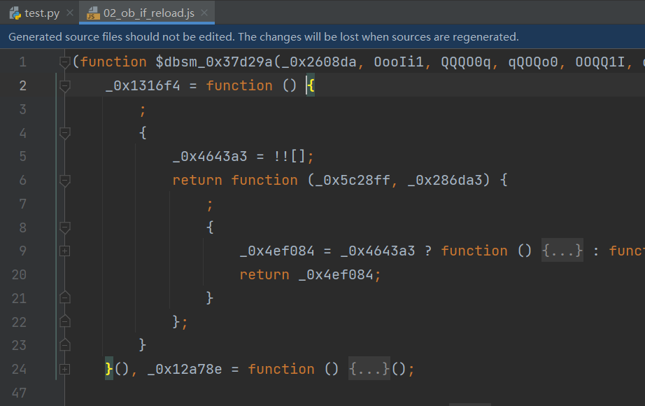

这一章,我们把

```js
function () {
    if ('QcUHF' !== 'QcUHF') {
        return ![];
    } else {
        _0x4643a3 = !![];
        return ...
    }
}
```

还原成了

```js
function () {
    {
        _0x4643a3 = !![];
    	return ...
    }
}
```


## 5.控制流平坦化

这一章会使用上一章生成的 `02_ob_if_reload.json`文件

最终生成一份`02_ob_sort_reload.js`文件和一份 `02_ob_sort_reload.json` 文件

上一章,我们剔除了if 语句里面的无用代码,将

```js
function () {
    if ('QcUHF' !== 'QcUHF') {
        return ![];
    } else {
        _0x4643a3 = !![];
        return ...
    }
}
```

还原成了

```js
function () {
    {
        _0x4643a3 = !![];
    	return ...
    }
}
```

### 结构分析

在`02_ob_sort_reload.js`文件中搜索 while 关键字,找到类似于下图的代码

这一章平坦化控制流,看下面这张图就能明白意思:

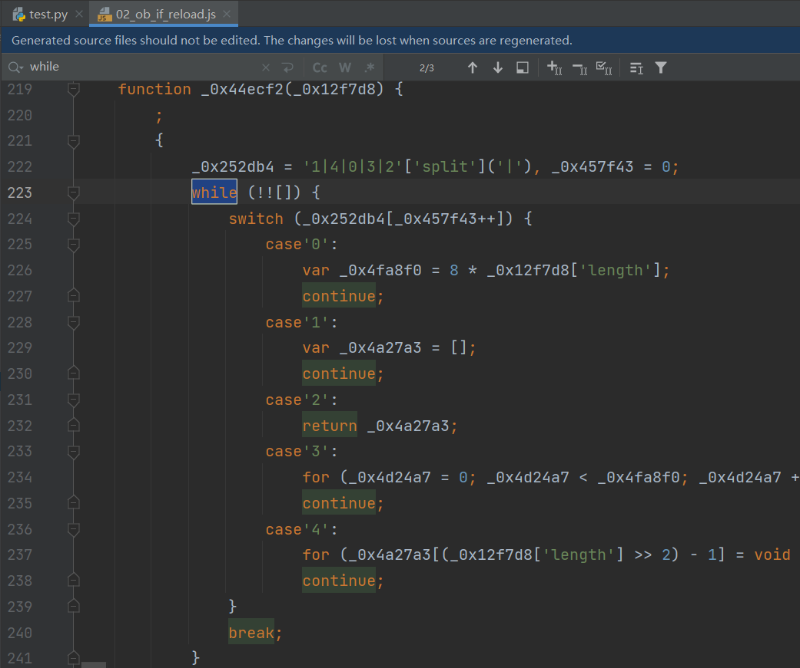


程序的执行顺序并非从上至下,而是以切割出的字符串列表为标准来顺序执行的,

这样会给我们代码阅读带来很大的困扰,所以需要还原出真实的执行顺序,

这就是控制流平坦化

接下来分析代码段的结构树,可以看到

整个结构包含在一个列表中,while 节点是该列表的第二个元素,执行顺序在第一个元素中.

所以,我们只要按照执行顺序,提取出执行语句块,将其加入一个列表中,

然后用新的列表,替换掉整个node节点即可


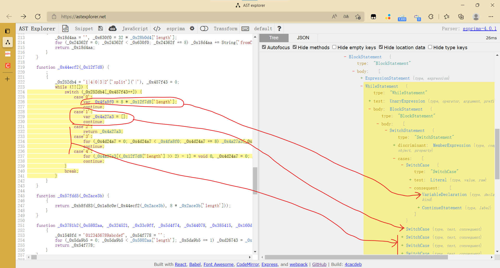


### 代码

```python
# test.py
""" 控制流平坦化 """


def sort_code(node):
    if type(node) == list:
        active = False
        try:
            # 捕获一个控制流节点(这是一个包含执行顺序和while节点的列表节点)
            if len(node) == 2:
                if node[1]['type'] == 'WhileStatement':
                    var1 = node[0]['expression']['expressions'][0]
                    var2 = node[0]['expression']['expressions'][1]
                    if var1['right']['type'] == 'CallExpression' and var2['right']['type'] == 'Literal':
                        active = True
            if not active:
                raise KeyError
        except (KeyError, TypeError):
            for item in node:
                sort_code(item)
            return
    elif type(node) == dict:
        for key in node.keys():
            sort_code(node[key])
        return
    else:
        return

    sort_list = var1['right']['callee']['object']['value'].split('|')  # 控制流程顺序列表
    cases_list = node[1]['body']['body'][0]['cases']  # 原控制流列表
    result_list = [cases_list[int(i)]['consequent'][0] for i in sort_list]  # 新的控制流列表

    node.clear()
    node.extend(result_list)
    for item in node:
        sort_code(item)


""" ********************************************************* """
if __name__ == '__main__':
    # 生成基础文件
    ...
    """ 字符串与数字回填[ok] """
    ...
    """ 函数调用还原[ok] """
    ...
    """ 对象调用还原[ok] """
    ...
    """ 分支流程判断[ok] """
    ...
    """ 控制流平坦化[ok] """
    with open('02_ob_if_reload.json', 'r', encoding='utf8') as f:
        data = json.loads(f.read())
    sort_code(data)
    with open('02_ob_sort_reload.json', 'w', encoding='utf8') as f:
        f.write(json.dumps(data))
    os.system('node JsonToJs 02_ob_sort_reload.json 02_ob_sort_reload.js')
    
```

运行代码后, 可以看到,顺序已经被重构

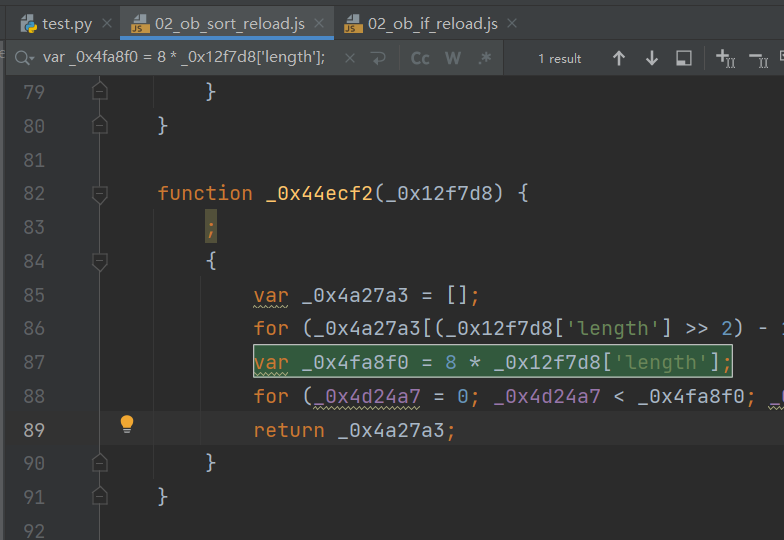


至此,OB反混淆所有步骤完成, 得到 `02_ob_sort_reload.js`文件

该文件内的代码已不再难以阅读,我们可以轻易的找到,其设置cookie 的接口,

但是现在的代码还是不能正常运行的,因为其中相关反调试,检测部分的代码还在,

我们需要手动删除这些干扰运行的代码,直至获取到正确的M值.

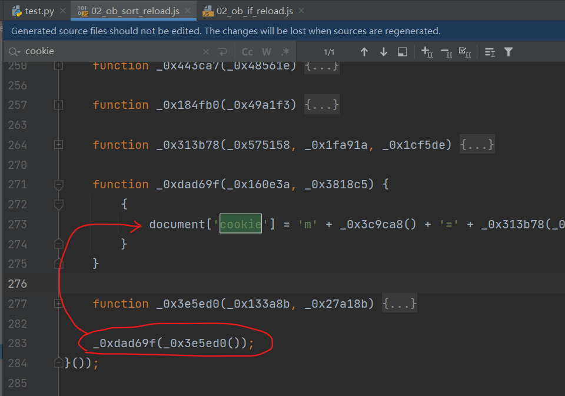


最后可运行的JS代码在第一章开端的最后已经给出,这里不再重复

end

## 附件

整体反混淆代码:

```python
import copy
import json
import os
import sys

import requests
import config
import execjs

""" 获取混淆的JS文件 并生成对应的json文件 """


def get_02_ob_js():
    res = requests.get(f'{config.host}/match/2')
    with open('./02_ob.js', 'wb') as f:
        f.write(res.content[8:-9])
    os.system('node JsToJson 02_ob.js 02_ob.json')

    # 总文件分为6个部分,将前三个与后三个部分拆开
    with open('./02_ob.json', 'r', encoding='utf8') as f:
        node = json.loads(f.read())
    left_3_node = {
        'type': 'Program',
        'body': node['body'][:3],
        'sourceType': 'script'
    }
    right_3_node = {
        'type': 'Program',
        'body': node['body'][3:],
        'sourceType': 'script'
    }
    with open('02_ob_left_3.json', 'w', encoding='utf8') as f1, open('02_ob_right_3.json', 'w', encoding='utf8') as f2:
        f1.write(json.dumps(left_3_node))
        f2.write(json.dumps(right_3_node))

    os.system('node JsonToJs 02_ob_left_3.json 02_ob_left_3.js')
    os.system('node JsonToJs 02_ob_right_3.json 02_ob_right_3.js')


""" ********************************************************* """

""" 字符串与数字回填 """
string_number_dict = {}


# 提取变量与字符串的映射
def get_string_number_dict(node):
    # 后三部分,每一部分都有这样的结构,而且变量名称有重复,必须分开做
    # 先清空 string_number_dict
    string_number_dict.clear()
    try:
        # 第四部分路径
        expressions_list = node['expression']['callee']['body']['body'][0]['expression']['expressions']
    except TypeError:
        # 第五部分路径
        expressions_list = node['body']['body'][0]['expression']['expressions']
    except KeyError:
        # 第六部分路径
        expressions_list = node['expression']['arguments'][0]['body']['body'][0]['expression']['expressions']

    for item in expressions_list:
        if item['type'] != 'AssignmentExpression':
            continue
        if item['left']['type'] == 'Identifier':
            if item['right']['type'] == 'Literal':
                string_number_dict[item['left']['name']] = item['right']
            elif item['right']['type'] == 'BinaryExpression':
                left = string_number_dict[item['right']['left']['name']]
                right = item['right']['right']
                try:
                    new_node = copy.deepcopy(right)
                    new_node['value'] = eval(f'{left["value"]} {item["right"]["operator"]} {right["value"]}')
                    string_number_dict[item['left']['name']] = new_node
                except TypeError:
                    print(item['right'])
                    sys.exit()


# 将调用这些变量的地方进行还原
def string_number_reload(node):
    # 一次只能还原一个部分
    if type(node) == list:
        for item in node:
            string_number_reload(item)
        return
    elif type(node) != dict:
        return
    # 调用这些变量的地方都是实参
    try:
        for i in range(len(node['arguments'])):
            if node['arguments'][i]['type'] == 'Identifier':
                try:
                    # 捕获前面参数不匹配,而后面参数匹配的情况
                    node['arguments'][i] = string_number_dict[node['arguments'][i]['name']]
                except KeyError:
                    pass
        else:
            raise KeyError
    except KeyError:
        for key in node.keys():
            string_number_reload(node[key])
        return


# 删除变量与字符串映射的节点
def del_string_number_node(node):
    string_number_dict.clear()
    try:
        expressions_list = node['expression']['callee']['body']['body'][0]['expression']['expressions']
    except TypeError:
        expressions_list = node['body']['body'][0]['expression']['expressions']
    except KeyError:
        # 第五部分路径
        expressions_list = node['expression']['arguments'][0]['body']['body'][0]['expression']['expressions']

    for i in range(len(expressions_list) - 1, -1, -1):
        if expressions_list[i]['type'] != 'AssignmentExpression':
            continue
        if expressions_list[i]['left']['type'] == 'Identifier' and expressions_list[i]['right']['type'] in (
                'Literal', 'BinaryExpression'):
            del expressions_list[i]


""" ********************************************************* """

""" 函数调用还原 """


def call_function_reload(node, ctx):
    if type(node) == list:
        for item in node:
            call_function_reload(item, ctx)
        return
    elif type(node) != dict:
        return

    if node['type'] == 'CallExpression':
        try:
            if node['callee']['name'] == '$dbsm_0x42c3':
                arg_list = []
                for item in node['arguments']:
                    if item['type'] != 'Literal':
                        break
                    arg_list.append(item['value'])
                else:
                    # 这里有一个隐藏的彩蛋,如果是用GBK去解码会触发报错,就会引起关注,就有可能发现这个彩蛋
                    value = ctx.call('$dbsm_0x42c3', *arg_list)
                    print(value)
                    new_node = {'type': 'Literal', 'value': value}
                    node.clear()
                    node.update(new_node)
                    return
        except KeyError:
            pass
    for key in node.keys():
        call_function_reload(node[key], ctx)


""" ********************************************************* """

""" 对象调用还原 """


# 将拆分开的对象属性名称合并
def concat_obj_property_name(node):
    if type(node) == list:
        for item in node:
            concat_obj_property_name(item)
        return
    elif type(node) != dict:
        return

    # 捕获一个二元运算节点
    if node['type'] == 'BinaryExpression':
        if not (node['left']['type'] == 'Literal' and node['right']['type'] == 'Literal'):
            # 如果 其中有参数不是 字符 类型,则将两个参数都继续递归
            concat_obj_property_name(node['left'])
            concat_obj_property_name(node['right'])
        # 当两个参数的递归都完成, 参数类型最终都变为了 字符 类型,则可以合并,这样就实现了一连串的字符相加
        if node['left']['type'] == 'Literal' and node['right']['type'] == 'Literal':
            new_node = {'type': 'Literal', 'value': node['left']['value'] + node['right']['value']}
            node.clear()
            node.update(new_node)
            return

    for key in node.keys():
        concat_obj_property_name(node[key])


# 构造对象属性字典
obj_property_dict = {}
obj_name_list = []


def get_property_dicet(node):
    # 所有对象申明时都是: XXXX = {}, 然后使用 XXXX['xxxx'] = XXXXXXX 来添加属性
    if type(node) == list:
        for item in node:
            get_property_dicet(item)
        return
    elif type(node) != dict:
        return

    # 捕获一个表达式序列
    if node['type'] == 'SequenceExpression':
        for i in range(- len(node['expressions']), 0, 1):  # 正向遍历列表,并且可以删除元素的方式
            item = node['expressions'][i]
            # 捕获一个(变量/属性)申明节点
            if item['type'] == 'AssignmentExpression':
                # 是一个变量申明
                if item['left']['type'] == 'Identifier':
                    # 申明的是一个空对象
                    if item['right']['type'] == 'ObjectExpression' and item['right']['properties'] == []:
                        obj_property_dict[item['left']['name']] = {}
                        obj_name_list.append(item['left']['name'])
                        del node['expressions'][i]
                        continue
                    # 申明 一个变量指向另一个变量 例: _0x5500bb = _0x434ddb,
                    elif item['right']['type'] == 'Identifier':
                        if item['right']['name'] in obj_property_dict:
                            obj_property_dict[item['left']['name']] = obj_property_dict[item['right']['name']]
                            obj_name_list.append(item['left']['name'])
                            del node['expressions'][i]
                            continue
                # 是一个属性申明
                elif item['left']['type'] == 'MemberExpression':
                    obj_name = item['left']['object']['name']
                    try:
                        obj_property_name = item['left']['property']['value']
                        obj_property_dict[obj_name][obj_property_name] = item['right']
                        del node['expressions'][i]
                        continue
                    except KeyError:
                        pass

            for key in item.keys():
                get_property_dicet(item[key])

    for key in node.keys():
        get_property_dicet(node[key])


# 对象调用还原
def obj_property_reload(node):
    if type(node) == list:
        for item in node:
            obj_property_reload(item)
        return
    elif type(node) != dict:
        return

    # 捕获一个属性调用节点
    if node['type'] == 'MemberExpression':
        try:
            obj_name = node['object']['name']
            obj_property = node['property']['value']
            new_node = obj_property_dict[obj_name][obj_property]
            if new_node['type'] != 'FunctionExpression':
                node.clear()
                node.update(new_node)
                obj_property_reload(node)
        except KeyError:
            pass
    try:
        # 捕获一个函数调用节点,且子节点callee的类型是一个MemberExpression
        if node['type'] != 'CallExpression' or node['callee']['type'] != 'MemberExpression':
            raise KeyError
        obj_name = node['callee']['object']['name']  # 获取对象名称
        obj_property_name = node['callee']['property']['value']  # 获取需要调用的对象属性名称
        function_node = obj_property_dict[obj_name][obj_property_name]  # 获取函数定义节点,即对象的属性值(该属性值是一个函数定义)
    except KeyError:
        for key in node.keys():
            obj_property_reload(node[key])
        return

    # 获取形参
    param_list = [item['name'] for item in function_node['params']]
    # 获取实参
    argument_list = node['arguments']
    # 形成形参与实参的对比关系,如此,可以适应形参位置发生变化
    param_argument_dict = dict(zip(param_list, argument_list))

    # 拷贝一份函数节点的返回值子节点
    return_node = copy.deepcopy(function_node['body']['body'][0])
    if return_node['type'] != 'ReturnStatement':
        print(f'意料之外的函数节点,拥有超过一行的函数体: {function_node}')
        sys.exit()

    # 使用实参替换返回值节点中的形参,然后用返回值节点,替换掉整个函数调用node节点
    if return_node['argument']['type'] == 'Literal' or return_node['argument']['type'] == 'MemberExpression':
        # 直接替换
        node.clear()
        node.update(return_node['argument'])
    elif return_node['argument']['type'] == 'BinaryExpression' or return_node['argument'][
        'type'] == 'LogicalExpression':
        if return_node['argument']['left']['type'] == 'Identifier':
            return_node['argument']['left'] = param_argument_dict[return_node['argument']['left']['name']]
        if return_node['argument']['right']['type'] == 'Identifier':
            return_node['argument']['right'] = param_argument_dict[return_node['argument']['right']['name']]
        node.clear()
        node.update(return_node['argument'])
    elif return_node['argument']['type'] == 'CallExpression':
        if return_node['argument']['callee']['type'] != 'MemberExpression':
            function_name = return_node['argument']['callee']['name']
            if function_name in param_argument_dict:
                return_node['argument']['callee'] = param_argument_dict[function_name]
        for i in range(len(return_node['argument']['arguments'])):
            if return_node['argument']['arguments'][i]['type'] == 'Identifier':
                argument_name = return_node['argument']['arguments'][i]['name']
                return_node['argument']['arguments'][i] = param_argument_dict[argument_name]
        node.clear()
        node.update(return_node['argument'])
    else:
        print(f'意料之外的函数返回值类型: {return_node}')
        sys.exit()
    # 替换完成后,将自身继续递归
    obj_property_reload(node)
    return


""" ********************************************************* """

""" 分支流程判断 """
operator_dict = {'===': '==', '!==': '!='}


def if_reload(node):
    if type(node) == list:
        for item in node:
            if_reload(item)
        return
    elif type(node) != dict:
        return

    # 捕获一个分支语句节点
    if node['type'] == 'IfStatement':
        if node['test']['type'] == 'BinaryExpression':
            if node['test']['left']['type'] == 'Literal' and node['test']['right']['type'] == 'Literal':
                consequent = node['consequent']
                alternate = node['alternate']
                try:
                    if eval(f"'{node['test']['left']['value']}' {operator_dict[node['test']['operator']]} '{node['test']['right']['value']}'"):
                        node.clear()
                        node.update(consequent)
                    else:
                        node.clear()
                        node.update(alternate)
                except KeyError:
                    print(f'意料之外的分支运算符号: {node}')
                    sys.exit()
                else:
                    if_reload(node)

    for key in node.keys():
        if_reload(node[key])


""" ********************************************************* """

""" 控制流平坦化 """


def sort_code(node):
    if type(node) == list:
        active = False
        try:
            # 捕获一个控制流节点
            if len(node) == 2:
                if node[1]['type'] == 'WhileStatement':
                    var1 = node[0]['expression']['expressions'][0]
                    var2 = node[0]['expression']['expressions'][1]
                    if var1['right']['type'] == 'CallExpression' and var2['right']['type'] == 'Literal':
                        active = True
            if not active:
                raise KeyError
        except (KeyError, TypeError):
            for item in node:
                sort_code(item)
            return
    elif type(node) == dict:
        for key in node.keys():
            sort_code(node[key])
        return
    else:
        return

    sort_list = var1['right']['callee']['object']['value'].split('|')  # 控制流程顺序列表
    cases_list = node[1]['body']['body'][0]['cases']  # 原控制流列表
    result_list = [cases_list[int(i)]['consequent'][0] for i in sort_list]  # 新的控制流列表

    node.clear()
    node.extend(result_list)
    for item in node:
        sort_code(item)


""" ********************************************************* """
if __name__ == '__main__':
    # 测试
    with open('02_ob_left_3.js', 'r', encoding='utf-8') as f:
        ctx = execjs.compile(f.read())
    resul = ctx.call('$dbsm_0x42c3', '0x1db', '30Py')
    print(resul)

    # 生成基础文件
    get_02_ob_js()

    """ 字符串与数字回填[ok] """
    with open('02_ob_right_3.json', 'r', encoding='utf8') as f:
        data = json.loads(f.read())
    for item in data['body']:
        get_string_number_dict(item)
        string_number_reload(item)
        del_string_number_node(item)
    with open('02_ob_string_number.json', 'w', encoding='utf8') as f:
        f.write(json.dumps(data))
    os.system('node JsonToJs 02_ob_string_number.json 02_ob_string_number.js')

    """ 函数调用还原[ok](此步骤及其耗时,估计是需要用python 频繁调用nodejs的原因) """
    with open('02_ob_string_number.json', 'r', encoding='utf8') as f:
        data = json.loads(f.read())
    with open('02_ob_left_3.js', 'r', encoding='utf-8') as f:
        ctx = execjs.compile(f.read())
    call_function_reload(data, ctx)
    with open('02_ob_call_function_reload.json', 'w', encoding='utf8') as f:
        f.write(json.dumps(data))
    os.system('node JsonToJs 02_ob_call_function_reload.json 02_ob_call_function_reload.js')

    """ 对象调用还原[ok] """
    with open('02_ob_call_function_reload.json', 'r', encoding='utf8') as f:
        data = json.loads(f.read())
    concat_obj_property_name(data)
    with open('02_ob_concat_str.json', 'w', encoding='utf8') as f:
        f.write(json.dumps(data))
    os.system('node JsonToJs 02_ob_concat_str.json 02_ob_concat_str.js')

    get_property_dicet(data)
    with open('02_ob_del_obj_property.json', 'w', encoding='utf8') as f:
        f.write(json.dumps(data))
    os.system('node JsonToJs 02_ob_del_obj_property.json 02_ob_del_obj_property.js')
    # 验证对象名称是否有重复,如果有,就只能将JS分成单个部分传入还原
    # print(len(obj_property_dict))
    # print(len(obj_name_list))

    obj_property_reload(data)
    with open('02_ob_obj_property_reload.json', 'w', encoding='utf8') as f:
        f.write(json.dumps(data))
    os.system('node JsonToJs 02_ob_obj_property_reload.json 02_ob_obj_property_reload.js')

    """ 分支流程判断[ok] """
    with open('02_ob_obj_property_reload.json', 'r', encoding='utf8') as f:
        data = json.loads(f.read())
    if_reload(data)
    with open('02_ob_if_reload.json', 'w', encoding='utf8') as f:
        f.write(json.dumps(data))
    os.system('node JsonToJs 02_ob_if_reload.json 02_ob_if_reload.js')

    """ 控制流平坦化 """
    with open('02_ob_if_reload.json', 'r', encoding='utf8') as f:
        data = json.loads(f.read())
    sort_code(data)
    with open('02_ob_sort_reload.json', 'w', encoding='utf8') as f:
        f.write(json.dumps(data))
    os.system('node JsonToJs 02_ob_sort_reload.json 02_ob_sort_reload.js')

```


