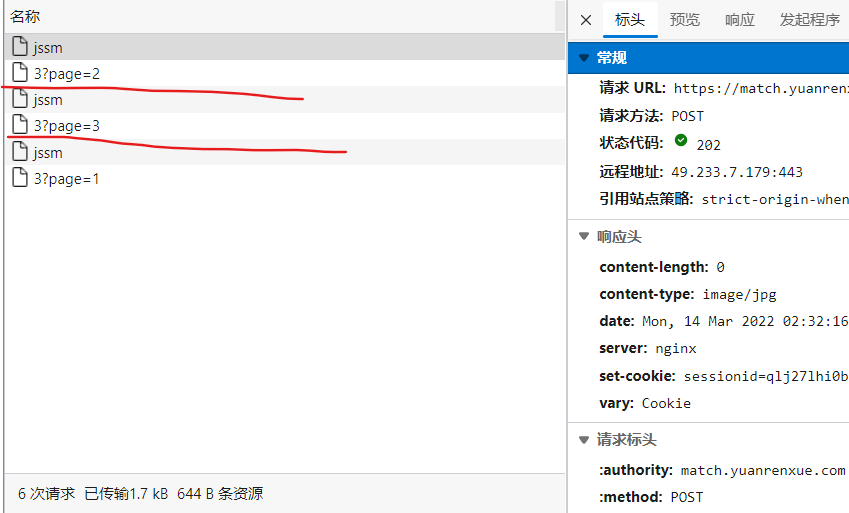
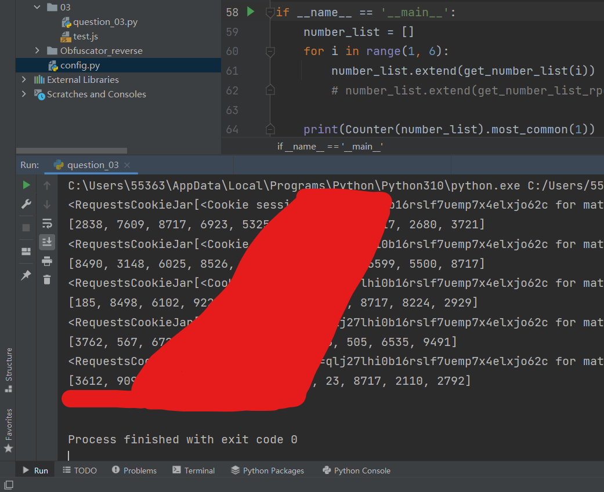
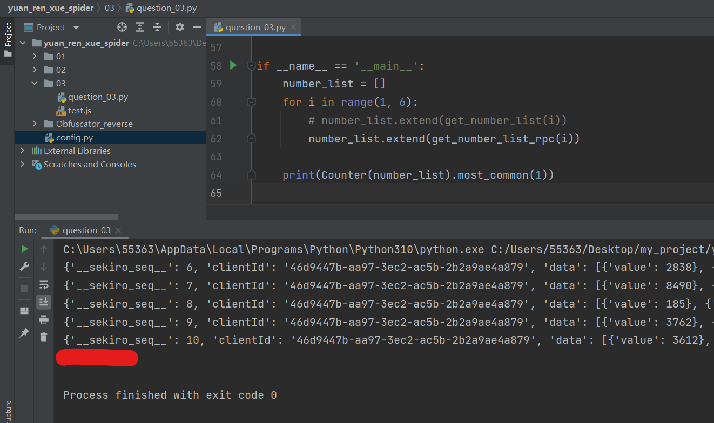

# 任务3：抓取下列5页商标的数据，并将出现 频率最高 的申请号填入答案中


## 分析

此题标记为骚操作, 发现果然够骚,因为前一个请求是否成功直接关系到后一个请求的效果

在浏览器中打开F12,可以很容易的观察到,每次切换数据页的时候,都会产生两个请求:



此时可以猜测,前面这个`jssm`的请求是数据请求的先决条件

于是我使用浏览器单独重放数据请求,结果失败,

发现必须先重放`jssm`请求,再重放数据请求,方能获取到数据

这就说明`jssm`请求确实是数据请求的先决条件


接下来,我们观察一下`jssm`请求

发现它只是在响应时重设了cookie 中的 sessionid 字段,其返回体中并没有内容,

但是经过仔细对比发现,这个 sessionid 本来就是登陆之后就带着的那个,并没有因为这次重设发生任何改变,除非我们重新登陆,

由此可以判断,`jssm`仅仅只是作为数据请求的先决条件而存在,其返回的内容没有任何的意义,

但是真的没有意义吗?

对于程序运行而言是没有意义,但他是作者留给我们的一个提示,如果没有这个提示,这题可能就是中等难度的级别了.

在发送`jssm`这个请求时,如果条件不达标,是不会在响应中设置cookie 的,由此,我们就可以判断 该请求是否真正的成功,

只有在`jssm` 请求真正成功时,我们才会继续进行数据请求.


因为在浏览器中重放请求,每次都是成功的,于是问题到这里就有了两个解决方向:

1.常规解法,依然使用python编写全部的爬虫代码

2.使用RPC技术注入原生的JS中,捕获其请求接口,直接返回数据


## 1.常规解法

这种解法需要我们知道后端采用了什么样的方式来验证请求,

而这一题采用了一种我之前没听说过的方式:验证headers的顺序

知道了这一点后,就比较简单了,无非就是模拟一下headers在浏览器中的顺序

因为我使用的是edge浏览器,不知道怎么查看原始headers顺序,只能使用fiddller之类的抓包工具来查看

拿到有序的headers后,就可以直接请求`jssm`,看见正确响应了cookie后,使用相同的headers就可以访问到数据了,

访问时记得把UA改了,否则后两页数据访问不到.

```python
import config
import requests
from collections import Counter

headers = {
    'Host': 'match.yuanrenxue.com',
    'Connection': 'keep-alive',
    'Content-Length': '0',
    'Pragma': 'no-cache',
    'Cache-Control': 'no-cache',
    'sec-ch-ua': '" Not A;Brand";v="99", "Chromium";v="99", "Microsoft Edge";v="99"',
    'sec-ch-ua-mobile': '?0',
    'User-Agent': 'yuanrenxue.project',
    'sec-ch-ua-platform': '"Windows"',
    'Accept': '*/*',
    'Origin': 'https://match.yuanrenxue.com',
    'Sec-Fetch-Site': 'same-origin',
    'Sec-Fetch-Mode': 'cors',
    'Sec-Fetch-Dest': 'empty',
    'Referer': 'https://match.yuanrenxue.com/match/3',
    'Accept-Encoding': 'gzip, deflate, br',
    'Accept-Language': 'zh-CN,zh;q=0.9,en;q=0.8,en-GB;q=0.7,en-US;q=0.6',
    'Cookie': 'Hm_lvt_c99546cf032aaa5a679230de9a95c7db=1646581381,1646795985; Hm_lvt_9bcbda9cbf86757998a2339a0437208e=1646990903; no-alert3=true; tk=7975764505969804934; Hm_lpvt_9bcbda9cbf86757998a2339a0437208e=1647174508; sessionid=qlj27lhi0b16rslf7uemp7x4elxjo62c; Hm_lpvt_c99546cf032aaa5a679230de9a95c7db=1647221269',
}


def get_number_list(page):
    session = requests.session()
    session.headers = headers
    url = f'{config.host}/api/match/3'
    params = {
        'page': page,
    }
    res_cookie = session.post(url=f'{config.host}/jssm')
    print(res_cookie.cookies)

    res = session.get(url=url, params=params).json()
    price_list = [item['value'] for item in res['data']]
    print(price_list)
    return price_list


if __name__ == '__main__':
    number_list = []
    for i in range(1, 6):
        number_list.extend(get_number_list(i))

    print(Counter(number_list).most_common(1))

```




## 2.借用RPC技术来解

RPC使用详情请查看: [Sekiro Hook Web JS 的详细使用步骤示例](./pyton/行者web爬虫.md)

我们找到请求发送堆栈,点进去就看到了请求发送接口,并没有任何加密混淆,

所以我们直接拷贝一部分进行修改

因为要更改UA,但是直接在ajax中修改UA是被浏览器禁止的,这里有一篇chrome 内核的浏览器修改UA的方法可以查看:

[Chrome 浏览器如何修改 User-Agent](https://blog.csdn.net/qq_41767116/article/details/119881523) https://blog.csdn.net/qq_41767116/article/details/119881523


接下来直接写注入的js代码:

```js
<script>
	my_hook = function(page) {	// 手动传入page 参数
		console.log(1111111);
    	// 声明一个变量,接收ajax返回的数据
		var data;
		$.ajax({
			url: '/api/match/3',
			dataType: "json",
			async: false,
			data: {'page':page},
			type: "GET",
			beforeSend: function(request) {
				(function() {
					var httpRequest = new XMLHttpRequest();
					var url = '/jssm';
					httpRequest.open('POST', url, false);
					httpRequest.send()
				}
				)()
			},
			success: function(res) {
                // 将返回的数据赋值给上面声明的变量
				data = res
			}
		});
    	// 返回数据
		return data;
	};

	(function (){
        // 这里拷贝 sekiro_web_client.js 上半部分
        
        // 这里是 sekiro_web_client.js 修改好的下半部分
        function guid() {
        	function S4() {
            	return (((1 + Math.random()) * 0x10000) | 0).toString(16).substring(1);
        	}
        	return (S4() + S4() + "-" + S4() + "-" + S4() + "-" + S4() + "-" + S4() + S4() + S4());
    	}

    	const client_sekiro = new SekiroClient("ws://127.0.0.1:5620/business-demo/register?group=yuan_ren_xue_03&clientId=" + guid());

    	client_sekiro.registerAction("yuan_ren_xue_03", function (request, resolve, reject) {
        	resolve(my_hook(request['page']));
    	})
    })();
</script>

```


接下来是python调用接口的代码

```python

import requests
from collections import Counter


def get_number_list_rpc(page):
    params = {
        'group': 'yuan_ren_xue_03',
        'action': 'yuan_ren_xue_03',
    }
    data = {
        'page': page
    }
    res = requests.post('http://127.0.0.1:5620/business-demo/invoke', params=params, data=data).json()
    print(res)
    price_list = [item['value'] for item in res['data']]
    return price_list


if __name__ == '__main__':
    number_list = []
    for i in range(1, 6):
        number_list.extend(get_number_list_rpc(i))

    print(Counter(number_list).most_common(1))

```




## 验证headers 里属性的顺序,是否真的影响结果

我们将 `'Content-Length': '0',` 和 `'Accept': '*/*',` 交换顺序,再次请求`jssm`

发现果然没有成功,由此确认后端对headers 的顺序做了检查, 

```python
# 
headers = {
    # 'Host': 'match.yuanrenxue.com',
    # 'Connection': 'keep-alive',
    # 'Content-Length': '0',
'Accept': '*/*',
    # 'Pragma': 'no-cache',
    # 'Cache-Control': 'no-cache',
    # 'sec-ch-ua': '" Not A;Brand";v="99", "Chromium";v="99", "Microsoft Edge";v="99"',
    # 'sec-ch-ua-mobile': '?0',
    # 'User-Agent': 'yuanrenxue.project',
    # 'sec-ch-ua-platform': '"Windows"',
    # 'Accept': '*/*',
'Content-Length': '0',
    # 'Origin': 'https://match.yuanrenxue.com',
    # 'Sec-Fetch-Site': 'same-origin',
    # 'Sec-Fetch-Mode': 'cors',
    # 'Sec-Fetch-Dest': 'empty',
    'Referer': 'https://match.yuanrenxue.com/match/3',
    'Accept-Encoding': 'gzip, deflate, br',
    'Accept-Language': 'zh-CN,zh;q=0.9,en;q=0.8,en-GB;q=0.7,en-US;q=0.6',
    'Cookie': 'sessionid=m87y200h41h3qz52y0y0gxx6zaex8xud',

}
```


但是还是有一个大问题没有解决:

后端既然要验证这个顺序,那么就要提前知道这个顺序,

问题来了,这个顺序是由浏览器写死的?还是可以通过JS更改的?

