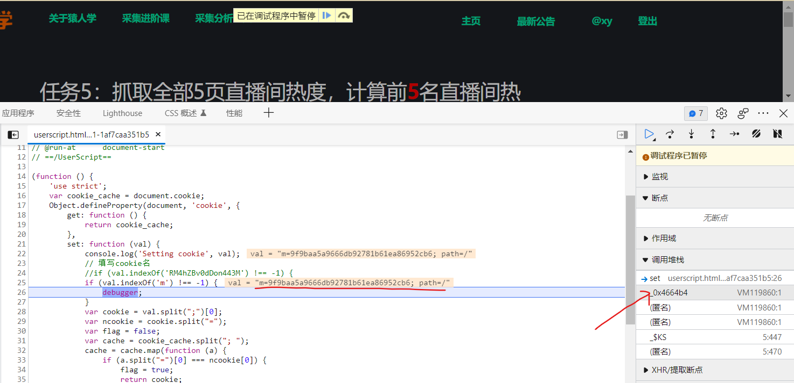
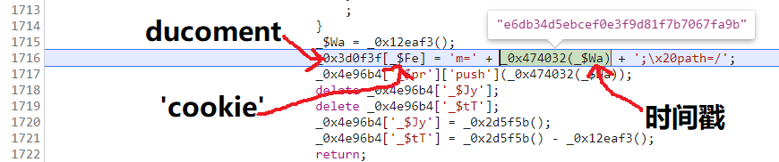
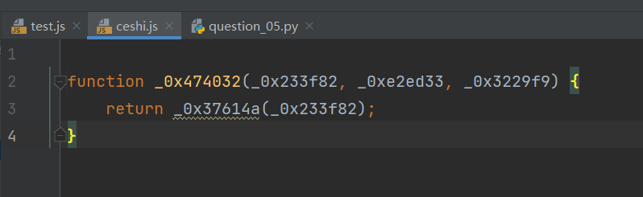
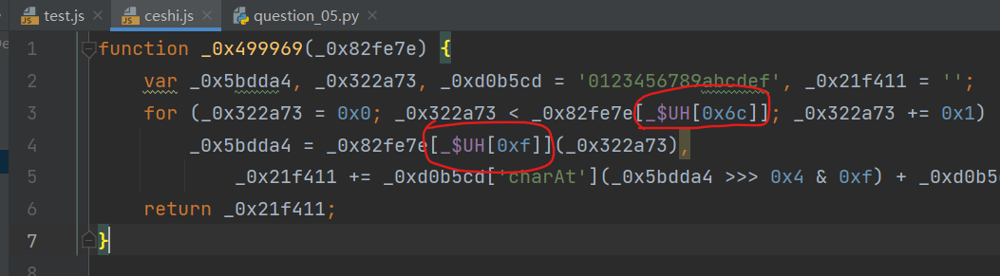
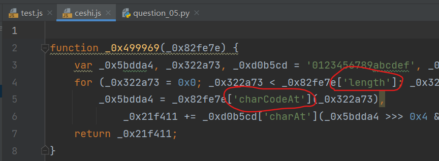
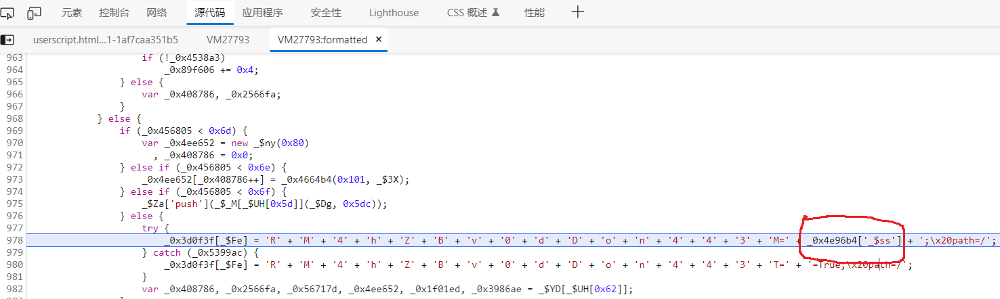
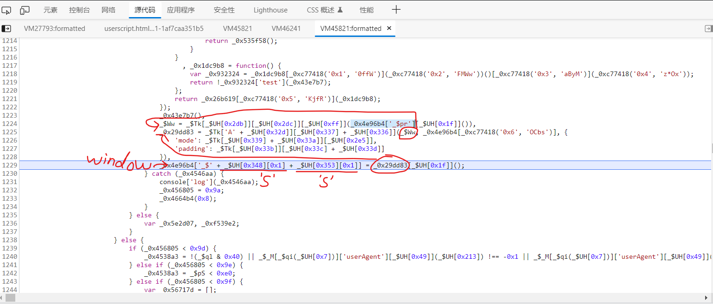
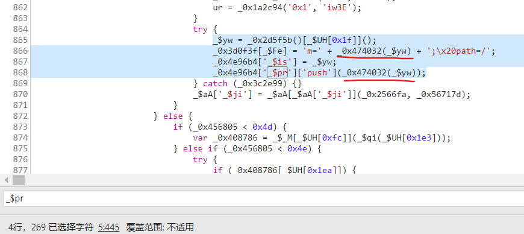
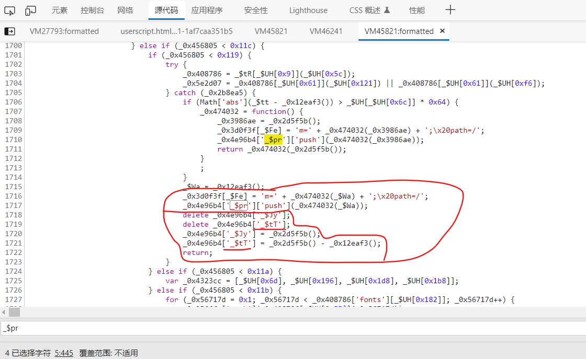
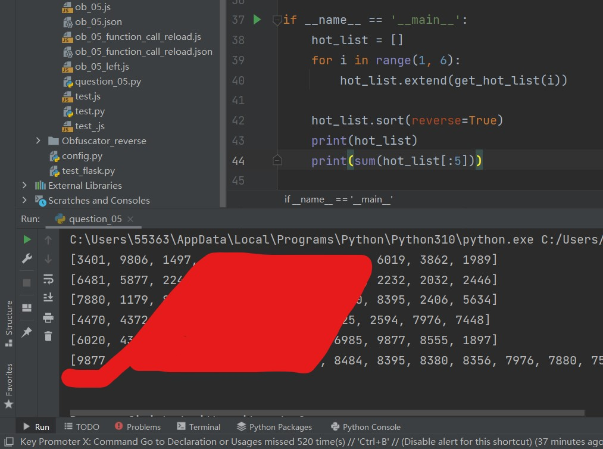

# 直接hook任意cookie被设置的瞬间, 定位到cookie设置的接口


新的hook方式,捕获任意一个cookie被设置的瞬间

其实经过修改,可以捕获任意对象的指定属性执行指定方法时的瞬间

直接在搜索引擎搜索(hook cookie)也可以查到以下代码

(这是一个油猴的脚本)

```js

// ==UserScript==
// @name        Hook Cookie
// @namespace   http://tampermonkey.net/
// @version     0.1
// @description try to take over the world!
// @author      You
// @include     *
// @grant       none
// @run-at      document-start
// ==/UserScript==

(function () {
    'use strict';
    var cookie_cache = document.cookie;
    Object.defineProperty(document, 'cookie', {
        get: function () {
            return cookie_cache;
        },
        set: function (val) {
            console.log('Setting cookie', val);
            // 填写cookie名
            if (val.indexOf('RM4hZBv0dDon443M') !== -1) {
            // if (val.indexOf('m') !== -1) {
                debugger;
            }
            var cookie = val.split(";")[0];
            var ncookie = cookie.split("=");
            var flag = false;
            var cache = cookie_cache.split("; ");
            cache = cache.map(function (a) {
                if (a.split("=")[0] === ncookie[0]) {
                    flag = true;
                    return cookie;
                }
                return a;
            })
            cookie_cache = cache.join("; ");
            if (!flag) {
                cookie_cache += cookie + "; ";
            }
            return cookie_cache;
        }
    });
})();
```


# 猿人学第5题: 抓取全部5页直播间热度，计算前5名直播间热度的加和

2022/03/20

对网络请求的观察可知,该题有4个参数,其中:

两个参数在URL的查询字符串里: `m 和 f`,是两个时间戳

两个参数在cookie里: `m 和 RM4hZBv0dDon443M` ,是两个加密字符串


我们从任意一个cookie里的参数入手都可以,这里直接选择m,

为什么选m,因为其它攻略都是选的另一个.

## 还原cookie参数 m

### 捕获m 设置的接口

我们直接启用上面的油猴脚本,稍作修改,让其捕获名为m的cookie被设置时的状态.

然后刷新网页,可以观察到m在被设置时的debugger,

接着我们点击上一个调用栈,跳转到设置m的那行代码:




需要注意,断点处必须是 `m=___`才行,不能是 `___m___=___`,

因为所有cookie名中带有m的都会被捕获.

如果没有捕获到m,就点击继续运行,直到捕获到m为止.

(细心的朋友在这里会发现,m会被捕获好几次, 3次? 5次? 在这里,我们只分析m`第一次`被捕获时的状态,后面的被捕获都是另一个参数生成时造成的)




### 还原生成 m 有关的所有函数

可以看到m的值是由 `_0x474032(时间戳)`函数生成的,

于是在控制台打印这个函数名,双击结果,跳转到定义它的地方,

将这个函数拷贝进一个新创建的js文件里,

可以发现,其返回值是一个连续的三目运算表达式,其接受三个参数,调用时只传入了一个参数,

那么就可以很轻易的简化为:



在编译器里(pycharm)可以很明显的看到未定义的函数,呈现为白色,并且下方有波浪线,

接下来要做的就是不断去找到这些函数,将其整体拷贝进来,

并将能简化的地方尽量简化,比如下图两个地方是某个对象的属性,

我们不必将整个对象拷贝进来,可以在浏览器的控制台上获取这两个属性的值,进行替换即可






因为源JS中不少地方调用了window对象,所以,我们要在创建的JS文件中,声明一个window 的空对象,

或者将所有window 的属性,更改为普通变量.

当所有的函数都被拷贝之后(不到200行代码),得到下面的文件:

```js
// ceshi.js

var window = {};
var _0x1171c8 = 0x67452301;
var _0x4dae05 = -0x10325477;
var _0x183a1d = -0x67452302;
var _0xcfa373 = 0x10325476;
window._$tT = -0xa40bd9c;
window._$Jy = 0x1b821d58;

function _0x12b47d(_0x149183) {
    var _0xabbcb3, _0x1145c3 = '', _0x4fce58 = 0x20 * _0x149183['length'];
    for (_0xabbcb3 = 0x0; _0xabbcb3 < _0x4fce58; _0xabbcb3 += 0x8)
        _0x1145c3 += String['fromCharCode'](_0x149183[_0xabbcb3 >> 0x5] >>> _0xabbcb3 % 0x20 & 0xff);
    return _0x1145c3;
}

function _0x4b459d(_0x8d8f2a, _0x406d34, _0x53e7d7, _0x26c827, _0xec41ea, _0x52dead, _0x3f66e7) {
    return _0xaaef84(_0x53e7d7 ^ (_0x406d34 | ~_0x26c827), _0x8d8f2a, _0x406d34, _0xec41ea, _0x52dead, _0x3f66e7);
}

function _0x32032f(_0x520fdf, _0x13921d, _0x1af9d5, _0x4a2311, _0xb6d40a, _0x1d58da, _0x361df0) {
    return _0xaaef84(_0x13921d ^ _0x1af9d5 ^ _0x4a2311, _0x520fdf, _0x13921d, _0xb6d40a, _0x1d58da, _0x361df0);
}

function _0x3180ec(_0x401705, _0x240e6a, _0x56b131, _0x5a5c20, _0x1f2a72, _0x2bfc1, _0x19741a) {
    return _0xaaef84(_0x240e6a & _0x5a5c20 | _0x56b131 & ~_0x5a5c20, _0x401705, _0x240e6a, _0x1f2a72, _0x2bfc1, _0x19741a);
}

function _0x3634fc(_0x5803ba, _0x1ce5b2) {
    return _0x5803ba << _0x1ce5b2 | _0x5803ba >>> 0x20 - _0x1ce5b2;
}

function _0x12e4a8(_0x7542c8, _0x5eada0) {
    var _0x41f81f = (0xffff & _0x7542c8) + (0xffff & _0x5eada0);
    return (_0x7542c8 >> 0x10) + (_0x5eada0 >> 0x10) + (_0x41f81f >> 0x10) << 0x10 | 0xffff & _0x41f81f;
}

function _0xaaef84(_0xaf3112, _0x2a165a, _0x532fb4, _0x10aa40, _0x41c4e7, _0x1cb4da) {
    return _0x12e4a8(_0x3634fc(_0x12e4a8(_0x12e4a8(_0x2a165a, _0xaf3112), _0x12e4a8(_0x10aa40, _0x1cb4da)), _0x41c4e7), _0x532fb4);
}

function _0x48d200(_0x4b706e, _0x3c3a85, _0x111154, _0x311f9f, _0x5439cf, _0x38cac7, _0x26bd2e) {
    return _0xaaef84(_0x3c3a85 & _0x111154 | ~_0x3c3a85 & _0x311f9f, _0x4b706e, _0x3c3a85, _0x5439cf, _0x38cac7, _0x26bd2e);
}

function _0x11a7a2(_0x193f00, _0x1cfe89) {
    _0x193f00[_0x1cfe89 >> 0x5] |= 0x80 << _0x1cfe89 % 0x20,
        _0x193f00[0xe + (_0x1cfe89 + 0x40 >>> 0x9 << 0x4)] = _0x1cfe89;
    try {
        var _0x42fb36 = 16;
    } catch (_0x1b1b35) {
        var _0x42fb36 = 0x1;
    }

    op = 26;

    b64pad = 1;

    var _0x1badc3, _0x38ca59, _0x431764, _0x43f1b4, _0x5722c0, _0x3e0c38 = _0x1171c8, _0xdb4d2c = _0x4dae05,
        _0x1724c5 = _0x183a1d, _0x257ec6 = _0xcfa373;

    if (window['_$6_']) {
    } else {
        window['_$6_'] = 0x20dc5d57f;
    }

    for (_0x1badc3 = 0x0; _0x1badc3 < _0x193f00['length']; _0x1badc3 += _0x42fb36)
        _0x38ca59 = _0x3e0c38,
            _0x431764 = _0xdb4d2c,
            _0x43f1b4 = _0x1724c5,
            _0x5722c0 = _0x257ec6,
            _0x3e0c38 = _0x48d200(_0x3e0c38, _0xdb4d2c, _0x1724c5, _0x257ec6, _0x193f00[_0x1badc3], 0x7, 0x7d60c),
            _0x257ec6 = _0x48d200(_0x257ec6, _0x3e0c38, _0xdb4d2c, _0x1724c5, _0x193f00[_0x1badc3 + 0x1], 0xc, window['_$6_']),
            _0x1724c5 = _0x48d200(_0x1724c5, _0x257ec6, _0x3e0c38, _0xdb4d2c, _0x193f00[_0x1badc3 + 0x2], 0x11, 0x242070db),
            _0xdb4d2c = _0x48d200(_0xdb4d2c, _0x1724c5, _0x257ec6, _0x3e0c38, _0x193f00[_0x1badc3 + 0x3], 0x16, -0x3e423112),
            _0x3e0c38 = _0x48d200(_0x3e0c38, _0xdb4d2c, _0x1724c5, _0x257ec6, _0x193f00[_0x1badc3 + 0x4], 0x7, -0xa83f051),
            _0x257ec6 = _0x48d200(_0x257ec6, _0x3e0c38, _0xdb4d2c, _0x1724c5, _0x193f00[_0x1badc3 + 0x5], 0xc, 0x4787c62a),
            _0x1724c5 = _0x48d200(_0x1724c5, _0x257ec6, _0x3e0c38, _0xdb4d2c, _0x193f00[_0x1badc3 + 0x6], 0x11, -0x57cfb9ed),
            _0xdb4d2c = _0x48d200(_0xdb4d2c, _0x1724c5, _0x257ec6, _0x3e0c38, _0x193f00[_0x1badc3 + 0x7], 0x16, -0x2b96aff),
            _0x3e0c38 = _0x48d200(_0x3e0c38, _0xdb4d2c, _0x1724c5, _0x257ec6, _0x193f00[_0x1badc3 + 0x8], 0x7, 0x698098d8),
            _0x257ec6 = _0x48d200(_0x257ec6, _0x3e0c38, _0xdb4d2c, _0x1724c5, _0x193f00[_0x1badc3 + 0x9], 0xc, -0x74bb0851),
            _0x1724c5 = _0x48d200(_0x1724c5, _0x257ec6, _0x3e0c38, _0xdb4d2c, _0x193f00[_0x1badc3 + 0xa], 0x11, -0xa44f),
            _0xdb4d2c = _0x48d200(_0xdb4d2c, _0x1724c5, _0x257ec6, _0x3e0c38, _0x193f00[_0x1badc3 + 0xb], 0x16, -0x76a32842),
            _0x3e0c38 = _0x48d200(_0x3e0c38, _0xdb4d2c, _0x1724c5, _0x257ec6, _0x193f00[_0x1badc3 + 0xc], 0x7, 0x6b901122),
            _0x257ec6 = _0x48d200(_0x257ec6, _0x3e0c38, _0xdb4d2c, _0x1724c5, _0x193f00[_0x1badc3 + 0xd], 0xc, -0x2678e6d),
            _0x1724c5 = _0x48d200(_0x1724c5, _0x257ec6, _0x3e0c38, _0xdb4d2c, _0x193f00[_0x1badc3 + 0xe], 0x11, -0x5986bc72),
            _0xdb4d2c = _0x48d200(_0xdb4d2c, _0x1724c5, _0x257ec6, _0x3e0c38, _0x193f00[_0x1badc3 + 0xf], 0x16, 0x49b40821),
            _0x3e0c38 = _0x3180ec(_0x3e0c38, _0xdb4d2c, _0x1724c5, _0x257ec6, _0x193f00[_0x1badc3 + 0x1], 0x5, -0x9e1da9e),
            _0x257ec6 = _0x3180ec(_0x257ec6, _0x3e0c38, _0xdb4d2c, _0x1724c5, _0x193f00[_0x1badc3 + 0x6], 0x9, -0x3fbf4cc0),
            _0x1724c5 = _0x3180ec(_0x1724c5, _0x257ec6, _0x3e0c38, _0xdb4d2c, _0x193f00[_0x1badc3 + 0xb], 0xe, 0x265e5a51),
            _0xdb4d2c = _0x3180ec(_0xdb4d2c, _0x1724c5, _0x257ec6, _0x3e0c38, _0x193f00[_0x1badc3], 0x14, -0x16493856),
            _0x3e0c38 = _0x3180ec(_0x3e0c38, _0xdb4d2c, _0x1724c5, _0x257ec6, _0x193f00[_0x1badc3 + 0x5], 0x5, -0x29d0efa3),
            _0x257ec6 = _0x3180ec(_0x257ec6, _0x3e0c38, _0xdb4d2c, _0x1724c5, _0x193f00[_0x1badc3 + 0xa], 0x9, 0x2441453),
            _0x1724c5 = _0x3180ec(_0x1724c5, _0x257ec6, _0x3e0c38, _0xdb4d2c, _0x193f00[_0x1badc3 + 0xf], 0xe, window['_$tT']),
            _0xdb4d2c = _0x3180ec(_0xdb4d2c, _0x1724c5, _0x257ec6, _0x3e0c38, _0x193f00[_0x1badc3 + 0x4], 0x14, window['_$Jy']),
            _0x3e0c38 = _0x3180ec(_0x3e0c38, _0xdb4d2c, _0x1724c5, _0x257ec6, _0x193f00[_0x1badc3 + 0x9], 0x5, 0x21e1cde6),
            _0x257ec6 = _0x3180ec(_0x257ec6, _0x3e0c38, _0xdb4d2c, _0x1724c5, _0x193f00[_0x1badc3 + 0xe], 0x9, -0x3cc8aa0a),
            _0x1724c5 = _0x3180ec(_0x1724c5, _0x257ec6, _0x3e0c38, _0xdb4d2c, _0x193f00[_0x1badc3 + 0x3], 0xe, -0xb2af279),
            _0xdb4d2c = _0x3180ec(_0xdb4d2c, _0x1724c5, _0x257ec6, _0x3e0c38, _0x193f00[_0x1badc3 + 0x8], 0x14, 0x455a14ed),
            _0x3e0c38 = _0x3180ec(_0x3e0c38, _0xdb4d2c, _0x1724c5, _0x257ec6, _0x193f00[_0x1badc3 + 0xd], 0x5, -0x5caa8e7b),
            _0x257ec6 = _0x3180ec(_0x257ec6, _0x3e0c38, _0xdb4d2c, _0x1724c5, _0x193f00[_0x1badc3 + 0x2], 0x9, -0x3105c08),
            _0x1724c5 = _0x3180ec(_0x1724c5, _0x257ec6, _0x3e0c38, _0xdb4d2c, _0x193f00[_0x1badc3 + 0x7], 0xe, 0x676f02d9),
            _0xdb4d2c = _0x3180ec(_0xdb4d2c, _0x1724c5, _0x257ec6, _0x3e0c38, _0x193f00[_0x1badc3 + 0xc], 0x14, -0x72d5b376),
            _0x3e0c38 = _0x32032f(_0x3e0c38, _0xdb4d2c, _0x1724c5, _0x257ec6, _0x193f00[_0x1badc3 + 0x5], 0x4, -0x241282e),
            _0x257ec6 = _0x32032f(_0x257ec6, _0x3e0c38, _0xdb4d2c, _0x1724c5, _0x193f00[_0x1badc3 + 0x8], 0xb, -0x788e097f),
            _0x1724c5 = _0x32032f(_0x1724c5, _0x257ec6, _0x3e0c38, _0xdb4d2c, _0x193f00[_0x1badc3 + 0xb], 0x10, 0x6d9d6122),
            _0xdb4d2c = _0x32032f(_0xdb4d2c, _0x1724c5, _0x257ec6, _0x3e0c38, _0x193f00[_0x1badc3 + 0xe], 0x17, -0x21ac7f4),
            _0x3e0c38 = _0x32032f(_0x3e0c38, _0xdb4d2c, _0x1724c5, _0x257ec6, _0x193f00[_0x1badc3 + 0x1], 0x4, -0x5b4115bc * b64pad),
            _0x257ec6 = _0x32032f(_0x257ec6, _0x3e0c38, _0xdb4d2c, _0x1724c5, _0x193f00[_0x1badc3 + 0x4], 0xb, 0x4bdecfa9),
            _0x1724c5 = _0x32032f(_0x1724c5, _0x257ec6, _0x3e0c38, _0xdb4d2c, _0x193f00[_0x1badc3 + 0x7], 0x10, -0x944b4a0),
            _0xdb4d2c = _0x32032f(_0xdb4d2c, _0x1724c5, _0x257ec6, _0x3e0c38, _0x193f00[_0x1badc3 + 0xa], 0x17, -0x41404390),
            _0x3e0c38 = _0x32032f(_0x3e0c38, _0xdb4d2c, _0x1724c5, _0x257ec6, _0x193f00[_0x1badc3 + 0xd], 0x4, 0x289b7ec6),
            _0x257ec6 = _0x32032f(_0x257ec6, _0x3e0c38, _0xdb4d2c, _0x1724c5, _0x193f00[_0x1badc3], 0xb, -0x155ed806),
            _0x1724c5 = _0x32032f(_0x1724c5, _0x257ec6, _0x3e0c38, _0xdb4d2c, _0x193f00[_0x1badc3 + 0x3], 0x10, -0x2b10cf7b),
            _0xdb4d2c = _0x32032f(_0xdb4d2c, _0x1724c5, _0x257ec6, _0x3e0c38, _0x193f00[_0x1badc3 + 0x6], 0x17, 0x2d511fd9),
            _0x3e0c38 = _0x32032f(_0x3e0c38, _0xdb4d2c, _0x1724c5, _0x257ec6, _0x193f00[_0x1badc3 + 0x9], 0x4, -0x3d12017),
            _0x257ec6 = _0x32032f(_0x257ec6, _0x3e0c38, _0xdb4d2c, _0x1724c5, _0x193f00[_0x1badc3 + 0xc], 0xb, -0x1924661b),
            _0x1724c5 = _0x32032f(_0x1724c5, _0x257ec6, _0x3e0c38, _0xdb4d2c, _0x193f00[_0x1badc3 + 0xf], 0x10, 0x1fa27cf8),
            _0xdb4d2c = _0x32032f(_0xdb4d2c, _0x1724c5, _0x257ec6, _0x3e0c38, _0x193f00[_0x1badc3 + 0x2], 0x17, -0x3b53a99b),
            _0x3e0c38 = _0x4b459d(_0x3e0c38, _0xdb4d2c, _0x1724c5, _0x257ec6, _0x193f00[_0x1badc3], 0x6, -0xbd6ddbc),
            _0x257ec6 = _0x4b459d(_0x257ec6, _0x3e0c38, _0xdb4d2c, _0x1724c5, _0x193f00[_0x1badc3 + 0x7], 0xa, 0x432aff97),
            _0x1724c5 = _0x4b459d(_0x1724c5, _0x257ec6, _0x3e0c38, _0xdb4d2c, _0x193f00[_0x1badc3 + 0xe], 0xf, -0x546bdc59),
            _0xdb4d2c = _0x4b459d(_0xdb4d2c, _0x1724c5, _0x257ec6, _0x3e0c38, _0x193f00[_0x1badc3 + 0x5], 0x15, -0x36c5fc7),
            _0x3e0c38 = _0x4b459d(_0x3e0c38, _0xdb4d2c, _0x1724c5, _0x257ec6, _0x193f00[_0x1badc3 + 0xc], 0x6, 0x655b59c3),
            _0x257ec6 = _0x4b459d(_0x257ec6, _0x3e0c38, _0xdb4d2c, _0x1724c5, _0x193f00[_0x1badc3 + 0x3], 0xa, -0x70ef89ee),
            _0x1724c5 = _0x4b459d(_0x1724c5, _0x257ec6, _0x3e0c38, _0xdb4d2c, _0x193f00[_0x1badc3 + 0xa], 0xf, -0x644f153),
            _0xdb4d2c = _0x4b459d(_0xdb4d2c, _0x1724c5, _0x257ec6, _0x3e0c38, _0x193f00[_0x1badc3 + 0x1], 0x15, -0x7a7ba22f),
            _0x3e0c38 = _0x4b459d(_0x3e0c38, _0xdb4d2c, _0x1724c5, _0x257ec6, _0x193f00[_0x1badc3 + 0x8], 0x6, 0x6fa87e4f),
            _0x257ec6 = _0x4b459d(_0x257ec6, _0x3e0c38, _0xdb4d2c, _0x1724c5, _0x193f00[_0x1badc3 + 0xf], 0xa, -0x1d31920),
            _0x1724c5 = _0x4b459d(_0x1724c5, _0x257ec6, _0x3e0c38, _0xdb4d2c, _0x193f00[_0x1badc3 + 0x6], 0xf, -0x5cfebcec),
            _0xdb4d2c = _0x4b459d(_0xdb4d2c, _0x1724c5, _0x257ec6, _0x3e0c38, _0x193f00[_0x1badc3 + 0xd], 0x15, 0x4e0811a1),
            _0x3e0c38 = _0x4b459d(_0x3e0c38, _0xdb4d2c, _0x1724c5, _0x257ec6, _0x193f00[_0x1badc3 + 0x4], 0x6, -0x8ac817e),
            _0x257ec6 = _0x4b459d(_0x257ec6, _0x3e0c38, _0xdb4d2c, _0x1724c5, _0x193f00[_0x1badc3 + 0xb], 0xa, -1120211379),
            _0x1724c5 = _0x4b459d(_0x1724c5, _0x257ec6, _0x3e0c38, _0xdb4d2c, _0x193f00[_0x1badc3 + 0x2], 0xf, 0x2ad7d2bb),
            _0xdb4d2c = _0x4b459d(_0xdb4d2c, _0x1724c5, _0x257ec6, _0x3e0c38, _0x193f00[_0x1badc3 + 0x9], 0x15, -0x14792c01),
            _0x3e0c38 = _0x12e4a8(_0x3e0c38, _0x38ca59),
            _0xdb4d2c = _0x12e4a8(_0xdb4d2c, _0x431764),
            _0x1724c5 = _0x12e4a8(_0x1724c5, _0x43f1b4),
            _0x257ec6 = _0x12e4a8(_0x257ec6, _0x5722c0);
    return [_0x3e0c38, _0xdb4d2c, _0x1724c5, _0x257ec6];
}

function _0x35f5f2(_0x243853) {
    var _0x139b8b, _0xa791a1 = [];
    for (_0xa791a1[(_0x243853['length'] >> 0x2) - 0x1] = void 0x0,
             _0x139b8b = 0x0; _0x139b8b < _0xa791a1['length']; _0x139b8b += 0x1)
        _0xa791a1[_0x139b8b] = 0x0;
    var _0x41a533 = 0x8 * _0x243853['length'];
    for (_0x139b8b = 0x0; _0x139b8b < _0x41a533; _0x139b8b += 0x8)
        _0xa791a1[_0x139b8b >> 0x5] |= (0xff & _0x243853['charCodeAt'](_0x139b8b / 0x8)) << _0x139b8b % 0x20;
    return _0xa791a1;
}

function _0x1ee7ec(_0x206333) {
    return _0x12b47d(_0x11a7a2(_0x35f5f2(_0x206333), 0x8 * _0x206333['length']));
}

function _0x499969(_0x82fe7e) {
    var _0x5bdda4, _0x322a73, _0xd0b5cd = '0123456789abcdef', _0x21f411 = '';
    for (_0x322a73 = 0x0; _0x322a73 < _0x82fe7e['length']; _0x322a73 += 0x1)
        _0x5bdda4 = _0x82fe7e['charCodeAt'](_0x322a73),
            _0x21f411 += _0xd0b5cd['charAt'](_0x5bdda4 >>> 0x4 & 0xf) + _0xd0b5cd['charAt'](0xf & _0x5bdda4);
    return _0x21f411;
}

function _0x2b8a17(_0x36f847) {
    return unescape(encodeURIComponent(_0x36f847));
}

function _0x41873d(_0x5a6962) {
    return _0x1ee7ec(_0x2b8a17(_0x5a6962));
}

function _0x37614a(_0x32e7c1) {
    return _0x499969(_0x41873d(_0x32e7c1));
}

function _0x474032(_0x233f82, _0xe2ed33, _0x3229f9) {
    return _0x37614a(_0x233f82);
}

```

接下来就是测试这个 m 的接口文件

我们刷新网页, 重新捕获m被设置的地方,拷贝传入的时间戳值,

接着在python中调用上面的js文件,传入这个时间戳,

对比python返回的结果,和网页显示的m值,是否相同(一定要相同,不同就是JS文件还有问题,或者刷新网页试一下)

```python
with open('ceshi.js', 'r', encoding='utf8') as f:
    ctx = execjs.compile(f.read())

print(ctx.call('_0x474032', 复制的时间戳))
```

对比相同之后, m 的值就搞定了,接下来就是另一个cookie 参数`RM4hZBv0dDon443M`的接口还原

(当然,这里有个坑,属于是搞定了,却又没完全搞定,因为以上所有运行环境,都是基于m第一次被断停的状态来的,这个坑后面会讲到)

## 还原 cookie参数 RM4hZBv0dDon443M

### 捕获rm生成接口

以下简称为 rm 

与m一样,将油猴脚本稍作修改,使其捕获 rm被设置的时候,

可以发现,rm 会被设置3次,前两次都是空值, 我们需要针对第三次有值的状态进行分析



可以看到 这个cookie'名称被拆分开了,所以直接搜索是搜不到的

### 捕获_$ss生成接口

其中 `window['_$ss']` 就是rm的值

接着在这个文件内搜索 `_$ss`名称,发现没有结果,

由于他是window对象的一个属性,那么可以将油猴脚本稍作修改,

用以捕获 `window['_$ss']` 被设置时的接口.

1. 在该文件的靠上方(比如第二行)打一个断点,

2. 复制以下代码,

```js

(function () {
    Object.defineProperty(window, '_$ss', {
        set: function (val) {
            debugger;
            return val;
        }
    });
})();
```

3. 刷新网页,在任意地方断住后,将上面的代码,拷贝到控制台中执行.

4. F8 恢复js运行,直至在上面代码的debugger处断停,(由于油猴脚本还在捕捉rm,所以会在多个地方断停,要确认断停的位置,就是上面代码的位置)

5. 点击调用栈的上一步

定位到的地方如图:



### 还原rm接口

将上图中的代码,简化之后:

```js
var _$Ww = CryptoJS['enc']['Utf8']['parse'](_$pr['toString']());
var _0x29dd83 = CryptoJS['AES']['encrypt'](_$Ww, _$qF, {
    'mode': CryptoJS['mode']['ECB'],
    'padding': CryptoJS['pad']['Pkcs7']
});

var _$ss = _0x29dd83['toString']();
```

接着搜索 `_$qF`,很容易就能找到:

```js
var _$qF = CryptoJS['enc']['Utf8']['parse'](btoa(_$is)['slice'](0x0, 0x10));
// _$is 是一个时间戳字符串
```

然后查看`_$pr`,发现是一个包含5个元素的数组,搜索`_$pr` 发现:

第一次定义时只定义了一个空数组,

然后有几个地方都对其进行了push 操作,而且发现,push进去的东西,就是`m`参数的值:




到这里,是不是就明白一点点了,之前捕获`m`时,会捕获到5次,

`_$pr` 正好也是5元素的数组,就是说,每生成一次`m`,就会将`m`的值放入`_$pr`数组中,

`m`的最终值,等于最后一次生成的`m`,

而`rm`的值,正好是这5个m值一并运算而来的.

如此一来,最关键的两个参数的生成方式就明了了,

此时可以在浏览器中拷贝整个`_$pr`数组,传入自己的脚本中,看返回的rm结果与浏览器中返回的rm结果是否相同.

## 联合m 与 rm

虽然 m 和 rm 的单独测试都成功了,但是这两个参数之间有因果关系,所以,必须将这两个参数的生成,放在一起,

这里我们可以按照上面的逻辑,编写类似于下面的代码,

来获取这两个参数,至于URL里的两个查询字符串的值,逻辑非常简单,这里不再详述:

```js
// 获取cookie中的m 和rm
pr = [];
for (i=0;i<5;i++) {
    m = get_m();
    pr.push(m);
}
m = pr[4];
rm = get_rm(pr);

```

但是这样的参数去发起请求,结果依然是400

这一度让我以为整体逻辑产生了错误,一度怀疑人生.

后来,我只能将油猴脚本的目标重新指向`m`,并且对`m`的每一次值进行对比观察,以确认每一步都正确无误,

结果还真发现了错误的原因,那就是之前`m`的逻辑全是按照m第一次生成时来编写的,

但是在m每一次的生成之后,都修改了其中两个参数,这是在之前的观察中被遗漏的地方.

而且第4次生成m之后,对这两个参数修改的方式与前3次又还有不同,

如此原因加在一起,才导致了,参数错误,请求失败.




## 思考

其实这个混淆文件是一个OB混淆,为什么我没有像第二题一样将整个文件反混淆呢?

其实我一开始就是直接整体反混淆的,只是做失败了,

1. 文件中充斥了大量的window对象,而window属性的调用可以在前面加window也可以不加.
2. (主因)这个文件有一种我暂时没有办法解开的控制流混淆方式
    1. 有一个层层if,else分支语句构建的模块,大概有近百层那么深.
    2. 然后通过一个for 循环,不断向这个分支模块传入参数
    3. 根据传入参数的变化,最后组合出代码正确的执行顺序

行不通之后,我在B站找到了这样的hook cookie 设置,然后直接逆推的解法,好在此题将逻辑全部拷贝完,也就200行代码出头.


在解开此题之后,我又尝试使用这样的解法去解第二题,发现,几乎不可能,其依赖的函数,层层嵌套,

还没有将依赖拷贝完全,代码已破千行...行不通


**同样是OB混淆,怎么去解,可能并无定法.**

## 附件:

知道了原因,代码的修改就比较简单了,下面给出整体代码:

```js
// test.js

// crypto-js 模块需要自行安装
var CryptoJS = require("crypto-js");
var _0x1171c8 = 0x67452301;
var _0x4dae05 = -0x10325477;
var _0x183a1d = -0x67452302;
var _0xcfa373 = 0x10325476;
_$6_ = 0x20dc5d57f;
_$tT = -0xa40bd9c;
_$Jy = 0x1b821d58;

function _0x4b459d(_0x8d8f2a, _0x406d34, _0x53e7d7, _0x26c827, _0xec41ea, _0x52dead, _0x3f66e7) {
    return _0xaaef84(_0x53e7d7 ^ (_0x406d34 | ~_0x26c827), _0x8d8f2a, _0x406d34, _0xec41ea, _0x52dead, _0x3f66e7);
}

function _0x32032f(_0x520fdf, _0x13921d, _0x1af9d5, _0x4a2311, _0xb6d40a, _0x1d58da, _0x361df0) {
    return _0xaaef84(_0x13921d ^ _0x1af9d5 ^ _0x4a2311, _0x520fdf, _0x13921d, _0xb6d40a, _0x1d58da, _0x361df0);
}

function _0x3180ec(_0x401705, _0x240e6a, _0x56b131, _0x5a5c20, _0x1f2a72, _0x2bfc1, _0x19741a) {
    return _0xaaef84(_0x240e6a & _0x5a5c20 | _0x56b131 & ~_0x5a5c20, _0x401705, _0x240e6a, _0x1f2a72, _0x2bfc1, _0x19741a);
}

function _0x3634fc(_0x5803ba, _0x1ce5b2) {
    return _0x5803ba << _0x1ce5b2 | _0x5803ba >>> 0x20 - _0x1ce5b2;
}

function _0x12e4a8(_0x7542c8, _0x5eada0) {
    var _0x41f81f = (0xffff & _0x7542c8) + (0xffff & _0x5eada0);
    return (_0x7542c8 >> 0x10) + (_0x5eada0 >> 0x10) + (_0x41f81f >> 0x10) << 0x10 | 0xffff & _0x41f81f;
}

function _0xaaef84(_0xaf3112, _0x2a165a, _0x532fb4, _0x10aa40, _0x41c4e7, _0x1cb4da) {
    return _0x12e4a8(_0x3634fc(_0x12e4a8(_0x12e4a8(_0x2a165a, _0xaf3112), _0x12e4a8(_0x10aa40, _0x1cb4da)), _0x41c4e7), _0x532fb4);
}

function _0x48d200(_0x4b706e, _0x3c3a85, _0x111154, _0x311f9f, _0x5439cf, _0x38cac7, _0x26bd2e) {
    return _0xaaef84(_0x3c3a85 & _0x111154 | ~_0x3c3a85 & _0x311f9f, _0x4b706e, _0x3c3a85, _0x5439cf, _0x38cac7, _0x26bd2e);
}

function _0x12b47d(_0x149183) {
    var _0xabbcb3, _0x1145c3 = '', _0x4fce58 = 0x20 * _0x149183['length'];
    for (_0xabbcb3 = 0x0; _0xabbcb3 < _0x4fce58; _0xabbcb3 += 0x8)
        _0x1145c3 += String.fromCharCode(_0x149183[_0xabbcb3 >> 0x5] >>> _0xabbcb3 % 0x20 & 0xff);
    return _0x1145c3;
}

function _0x11a7a2(_0x193f00, _0x1cfe89) {
    _0x193f00[_0x1cfe89 >> 0x5] |= 0x80 << _0x1cfe89 % 0x20,
        _0x193f00[0xe + (_0x1cfe89 + 0x40 >>> 0x9 << 0x4)] = _0x1cfe89;
    var _0x42fb36 = 16;

    var b64pad = 1;

    var _0x1badc3, _0x38ca59, _0x431764, _0x43f1b4, _0x5722c0, _0x3e0c38 = _0x1171c8, _0xdb4d2c = _0x4dae05,
        _0x1724c5 = _0x183a1d, _0x257ec6 = _0xcfa373;

    // var _$6_ = 0x20dc5d57f;
    // var _$6_ = -389564586;

    for (_0x1badc3 = 0x0; _0x1badc3 < _0x193f00['length']; _0x1badc3 += _0x42fb36)
        _0x38ca59 = _0x3e0c38,
            _0x431764 = _0xdb4d2c,
            _0x43f1b4 = _0x1724c5,
            _0x5722c0 = _0x257ec6,
            _0x3e0c38 = _0x48d200(_0x3e0c38, _0xdb4d2c, _0x1724c5, _0x257ec6, _0x193f00[_0x1badc3], 0x7, 0x7d60c),
            _0x257ec6 = _0x48d200(_0x257ec6, _0x3e0c38, _0xdb4d2c, _0x1724c5, _0x193f00[_0x1badc3 + 0x1], 0xc, _$6_),
            _0x1724c5 = _0x48d200(_0x1724c5, _0x257ec6, _0x3e0c38, _0xdb4d2c, _0x193f00[_0x1badc3 + 0x2], 0x11, 0x242070db),
            _0xdb4d2c = _0x48d200(_0xdb4d2c, _0x1724c5, _0x257ec6, _0x3e0c38, _0x193f00[_0x1badc3 + 0x3], 0x16, -0x3e423112),
            _0x3e0c38 = _0x48d200(_0x3e0c38, _0xdb4d2c, _0x1724c5, _0x257ec6, _0x193f00[_0x1badc3 + 0x4], 0x7, -0xa83f051),
            _0x257ec6 = _0x48d200(_0x257ec6, _0x3e0c38, _0xdb4d2c, _0x1724c5, _0x193f00[_0x1badc3 + 0x5], 0xc, 0x4787c62a),
            _0x1724c5 = _0x48d200(_0x1724c5, _0x257ec6, _0x3e0c38, _0xdb4d2c, _0x193f00[_0x1badc3 + 0x6], 0x11, -0x57cfb9ed),
            _0xdb4d2c = _0x48d200(_0xdb4d2c, _0x1724c5, _0x257ec6, _0x3e0c38, _0x193f00[_0x1badc3 + 0x7], 0x16, -0x2b96aff),
            _0x3e0c38 = _0x48d200(_0x3e0c38, _0xdb4d2c, _0x1724c5, _0x257ec6, _0x193f00[_0x1badc3 + 0x8], 0x7, 0x698098d8),
            _0x257ec6 = _0x48d200(_0x257ec6, _0x3e0c38, _0xdb4d2c, _0x1724c5, _0x193f00[_0x1badc3 + 0x9], 0xc, -0x74bb0851),
            _0x1724c5 = _0x48d200(_0x1724c5, _0x257ec6, _0x3e0c38, _0xdb4d2c, _0x193f00[_0x1badc3 + 0xa], 0x11, -0xa44f),
            _0xdb4d2c = _0x48d200(_0xdb4d2c, _0x1724c5, _0x257ec6, _0x3e0c38, _0x193f00[_0x1badc3 + 0xb], 0x16, -0x76a32842),
            _0x3e0c38 = _0x48d200(_0x3e0c38, _0xdb4d2c, _0x1724c5, _0x257ec6, _0x193f00[_0x1badc3 + 0xc], 0x7, 0x6b901122),
            _0x257ec6 = _0x48d200(_0x257ec6, _0x3e0c38, _0xdb4d2c, _0x1724c5, _0x193f00[_0x1badc3 + 0xd], 0xc, -0x2678e6d),
            _0x1724c5 = _0x48d200(_0x1724c5, _0x257ec6, _0x3e0c38, _0xdb4d2c, _0x193f00[_0x1badc3 + 0xe], 0x11, -0x5986bc72),
            _0xdb4d2c = _0x48d200(_0xdb4d2c, _0x1724c5, _0x257ec6, _0x3e0c38, _0x193f00[_0x1badc3 + 0xf], 0x16, 0x49b40821),
            _0x3e0c38 = _0x3180ec(_0x3e0c38, _0xdb4d2c, _0x1724c5, _0x257ec6, _0x193f00[_0x1badc3 + 0x1], 0x5, -0x9e1da9e),
            _0x257ec6 = _0x3180ec(_0x257ec6, _0x3e0c38, _0xdb4d2c, _0x1724c5, _0x193f00[_0x1badc3 + 0x6], 0x9, -0x3fbf4cc0),
            _0x1724c5 = _0x3180ec(_0x1724c5, _0x257ec6, _0x3e0c38, _0xdb4d2c, _0x193f00[_0x1badc3 + 0xb], 0xe, 0x265e5a51),
            _0xdb4d2c = _0x3180ec(_0xdb4d2c, _0x1724c5, _0x257ec6, _0x3e0c38, _0x193f00[_0x1badc3], 0x14, -0x16493856),
            _0x3e0c38 = _0x3180ec(_0x3e0c38, _0xdb4d2c, _0x1724c5, _0x257ec6, _0x193f00[_0x1badc3 + 0x5], 0x5, -0x29d0efa3),
            _0x257ec6 = _0x3180ec(_0x257ec6, _0x3e0c38, _0xdb4d2c, _0x1724c5, _0x193f00[_0x1badc3 + 0xa], 0x9, 0x2441453),
            _0x1724c5 = _0x3180ec(_0x1724c5, _0x257ec6, _0x3e0c38, _0xdb4d2c, _0x193f00[_0x1badc3 + 0xf], 0xe, _$tT),
            _0xdb4d2c = _0x3180ec(_0xdb4d2c, _0x1724c5, _0x257ec6, _0x3e0c38, _0x193f00[_0x1badc3 + 0x4], 0x14, _$Jy),
            _0x3e0c38 = _0x3180ec(_0x3e0c38, _0xdb4d2c, _0x1724c5, _0x257ec6, _0x193f00[_0x1badc3 + 0x9], 0x5, 0x21e1cde6),
            _0x257ec6 = _0x3180ec(_0x257ec6, _0x3e0c38, _0xdb4d2c, _0x1724c5, _0x193f00[_0x1badc3 + 0xe], 0x9, -0x3cc8aa0a),
            _0x1724c5 = _0x3180ec(_0x1724c5, _0x257ec6, _0x3e0c38, _0xdb4d2c, _0x193f00[_0x1badc3 + 0x3], 0xe, -0xb2af279),
            _0xdb4d2c = _0x3180ec(_0xdb4d2c, _0x1724c5, _0x257ec6, _0x3e0c38, _0x193f00[_0x1badc3 + 0x8], 0x14, 0x455a14ed),
            _0x3e0c38 = _0x3180ec(_0x3e0c38, _0xdb4d2c, _0x1724c5, _0x257ec6, _0x193f00[_0x1badc3 + 0xd], 0x5, -0x5caa8e7b),
            _0x257ec6 = _0x3180ec(_0x257ec6, _0x3e0c38, _0xdb4d2c, _0x1724c5, _0x193f00[_0x1badc3 + 0x2], 0x9, -0x3105c08),
            _0x1724c5 = _0x3180ec(_0x1724c5, _0x257ec6, _0x3e0c38, _0xdb4d2c, _0x193f00[_0x1badc3 + 0x7], 0xe, 0x676f02d9),
            _0xdb4d2c = _0x3180ec(_0xdb4d2c, _0x1724c5, _0x257ec6, _0x3e0c38, _0x193f00[_0x1badc3 + 0xc], 0x14, -0x72d5b376),
            _0x3e0c38 = _0x32032f(_0x3e0c38, _0xdb4d2c, _0x1724c5, _0x257ec6, _0x193f00[_0x1badc3 + 0x5], 0x4, -0x241282e),
            _0x257ec6 = _0x32032f(_0x257ec6, _0x3e0c38, _0xdb4d2c, _0x1724c5, _0x193f00[_0x1badc3 + 0x8], 0xb, -0x788e097f),
            _0x1724c5 = _0x32032f(_0x1724c5, _0x257ec6, _0x3e0c38, _0xdb4d2c, _0x193f00[_0x1badc3 + 0xb], 0x10, 0x6d9d6122),
            _0xdb4d2c = _0x32032f(_0xdb4d2c, _0x1724c5, _0x257ec6, _0x3e0c38, _0x193f00[_0x1badc3 + 0xe], 0x17, -0x21ac7f4),
            _0x3e0c38 = _0x32032f(_0x3e0c38, _0xdb4d2c, _0x1724c5, _0x257ec6, _0x193f00[_0x1badc3 + 0x1], 0x4, -0x5b4115bc * b64pad),
            _0x257ec6 = _0x32032f(_0x257ec6, _0x3e0c38, _0xdb4d2c, _0x1724c5, _0x193f00[_0x1badc3 + 0x4], 0xb, 0x4bdecfa9),
            _0x1724c5 = _0x32032f(_0x1724c5, _0x257ec6, _0x3e0c38, _0xdb4d2c, _0x193f00[_0x1badc3 + 0x7], 0x10, -0x944b4a0),
            _0xdb4d2c = _0x32032f(_0xdb4d2c, _0x1724c5, _0x257ec6, _0x3e0c38, _0x193f00[_0x1badc3 + 0xa], 0x17, -0x41404390),
            _0x3e0c38 = _0x32032f(_0x3e0c38, _0xdb4d2c, _0x1724c5, _0x257ec6, _0x193f00[_0x1badc3 + 0xd], 0x4, 0x289b7ec6),
            _0x257ec6 = _0x32032f(_0x257ec6, _0x3e0c38, _0xdb4d2c, _0x1724c5, _0x193f00[_0x1badc3], 0xb, -0x155ed806),
            _0x1724c5 = _0x32032f(_0x1724c5, _0x257ec6, _0x3e0c38, _0xdb4d2c, _0x193f00[_0x1badc3 + 0x3], 0x10, -0x2b10cf7b),
            _0xdb4d2c = _0x32032f(_0xdb4d2c, _0x1724c5, _0x257ec6, _0x3e0c38, _0x193f00[_0x1badc3 + 0x6], 0x17, 0x2d511fd9),
            _0x3e0c38 = _0x32032f(_0x3e0c38, _0xdb4d2c, _0x1724c5, _0x257ec6, _0x193f00[_0x1badc3 + 0x9], 0x4, -0x3d12017),
            _0x257ec6 = _0x32032f(_0x257ec6, _0x3e0c38, _0xdb4d2c, _0x1724c5, _0x193f00[_0x1badc3 + 0xc], 0xb, -0x1924661b),
            _0x1724c5 = _0x32032f(_0x1724c5, _0x257ec6, _0x3e0c38, _0xdb4d2c, _0x193f00[_0x1badc3 + 0xf], 0x10, 0x1fa27cf8),
            _0xdb4d2c = _0x32032f(_0xdb4d2c, _0x1724c5, _0x257ec6, _0x3e0c38, _0x193f00[_0x1badc3 + 0x2], 0x17, -0x3b53a99b),
            _0x3e0c38 = _0x4b459d(_0x3e0c38, _0xdb4d2c, _0x1724c5, _0x257ec6, _0x193f00[_0x1badc3], 0x6, -0xbd6ddbc),
            _0x257ec6 = _0x4b459d(_0x257ec6, _0x3e0c38, _0xdb4d2c, _0x1724c5, _0x193f00[_0x1badc3 + 0x7], 0xa, 0x432aff97),
            _0x1724c5 = _0x4b459d(_0x1724c5, _0x257ec6, _0x3e0c38, _0xdb4d2c, _0x193f00[_0x1badc3 + 0xe], 0xf, -0x546bdc59),
            _0xdb4d2c = _0x4b459d(_0xdb4d2c, _0x1724c5, _0x257ec6, _0x3e0c38, _0x193f00[_0x1badc3 + 0x5], 0x15, -0x36c5fc7),
            _0x3e0c38 = _0x4b459d(_0x3e0c38, _0xdb4d2c, _0x1724c5, _0x257ec6, _0x193f00[_0x1badc3 + 0xc], 0x6, 0x655b59c3),
            _0x257ec6 = _0x4b459d(_0x257ec6, _0x3e0c38, _0xdb4d2c, _0x1724c5, _0x193f00[_0x1badc3 + 0x3], 0xa, -0x70ef89ee),
            _0x1724c5 = _0x4b459d(_0x1724c5, _0x257ec6, _0x3e0c38, _0xdb4d2c, _0x193f00[_0x1badc3 + 0xa], 0xf, -0x644f153),
            _0xdb4d2c = _0x4b459d(_0xdb4d2c, _0x1724c5, _0x257ec6, _0x3e0c38, _0x193f00[_0x1badc3 + 0x1], 0x15, -0x7a7ba22f),
            _0x3e0c38 = _0x4b459d(_0x3e0c38, _0xdb4d2c, _0x1724c5, _0x257ec6, _0x193f00[_0x1badc3 + 0x8], 0x6, 0x6fa87e4f),
            _0x257ec6 = _0x4b459d(_0x257ec6, _0x3e0c38, _0xdb4d2c, _0x1724c5, _0x193f00[_0x1badc3 + 0xf], 0xa, -0x1d31920),
            _0x1724c5 = _0x4b459d(_0x1724c5, _0x257ec6, _0x3e0c38, _0xdb4d2c, _0x193f00[_0x1badc3 + 0x6], 0xf, -0x5cfebcec),
            _0xdb4d2c = _0x4b459d(_0xdb4d2c, _0x1724c5, _0x257ec6, _0x3e0c38, _0x193f00[_0x1badc3 + 0xd], 0x15, 0x4e0811a1),
            _0x3e0c38 = _0x4b459d(_0x3e0c38, _0xdb4d2c, _0x1724c5, _0x257ec6, _0x193f00[_0x1badc3 + 0x4], 0x6, -0x8ac817e),
            _0x257ec6 = _0x4b459d(_0x257ec6, _0x3e0c38, _0xdb4d2c, _0x1724c5, _0x193f00[_0x1badc3 + 0xb], 0xa, -1120211379),
            _0x1724c5 = _0x4b459d(_0x1724c5, _0x257ec6, _0x3e0c38, _0xdb4d2c, _0x193f00[_0x1badc3 + 0x2], 0xf, 0x2ad7d2bb),
            _0xdb4d2c = _0x4b459d(_0xdb4d2c, _0x1724c5, _0x257ec6, _0x3e0c38, _0x193f00[_0x1badc3 + 0x9], 0x15, -0x14792c01),
            _0x3e0c38 = _0x12e4a8(_0x3e0c38, _0x38ca59),
            _0xdb4d2c = _0x12e4a8(_0xdb4d2c, _0x431764),
            _0x1724c5 = _0x12e4a8(_0x1724c5, _0x43f1b4),
            _0x257ec6 = _0x12e4a8(_0x257ec6, _0x5722c0);
    return [_0x3e0c38, _0xdb4d2c, _0x1724c5, _0x257ec6];
}

function _0x35f5f2(_0x243853) {
    var _0x139b8b, _0xa791a1 = [];
    for (_0xa791a1[(_0x243853['length'] >> 0x2) - 0x1] = void 0x0,
             _0x139b8b = 0x0; _0x139b8b < _0xa791a1['length']; _0x139b8b += 0x1)
        _0xa791a1[_0x139b8b] = 0x0;
    var _0x41a533 = 0x8 * _0x243853['length'];
    for (_0x139b8b = 0x0; _0x139b8b < _0x41a533; _0x139b8b += 0x8)
        _0xa791a1[_0x139b8b >> 0x5] |= (0xff & _0x243853['charCodeAt'](_0x139b8b / 0x8)) << _0x139b8b % 0x20;
    return _0xa791a1;
}

function _0x1ee7ec(_0x206333) {
    return _0x12b47d(_0x11a7a2(_0x35f5f2(_0x206333), 0x8 * _0x206333['length']));
}

function _0x2b8a17(_0x36f847) {
    return unescape(encodeURIComponent(_0x36f847));
}

function _0x41873d(_0x5a6962) {
    return _0x1ee7ec(_0x2b8a17(_0x5a6962));
}

function _0x499969(_0x82fe7e) {
    var _0x5bdda4, _0x322a73, _0xd0b5cd = '0123456789abcdef', _0x21f411 = '';
    for (_0x322a73 = 0x0; _0x322a73 < _0x82fe7e['length']; _0x322a73 += 0x1)
        _0x5bdda4 = _0x82fe7e['charCodeAt'](_0x322a73),
            _0x21f411 += _0xd0b5cd['charAt'](_0x5bdda4 >>> 0x4 & 0xf) + _0xd0b5cd['charAt'](0xf & _0x5bdda4);
    return _0x21f411;
}

function _0x37614a(_0x32e7c1) {
    return _0x499969(_0x41873d(_0x32e7c1));
}

function _0x474032(_0x233f82, _0xe2ed33, _0x3229f9) {
    return _0x37614a(_0x233f82);
}

function get_RM4H(x) {
    var _$pr = [];
    var f_list = [];
    var m;
    for (var i = 0; i < 5; i++) {
        var _$is = new Date().valueOf().toString()
        f_list.push(_$is)
        m = _0x474032(_$is)
        _$pr.push(m);
        delete _$Jy;
        delete _$tT;
        if (i === 3) {
            _$Jy = -405537848;
            _$tT = -660478335;
            delete _$6_;
            _$6_ = -389564586;
        } else {
            _$Jy = new Date().valueOf();
            _$tT = -717253467;
        }
    }

    var _$Ww = CryptoJS['enc']['Utf8']['parse'](_$pr['toString']());
    var _$qF = CryptoJS['enc']['Utf8']['parse'](btoa(_$is)['slice'](0x0, 0x10));
    var _0x29dd83 = CryptoJS['AES']['encrypt'](_$Ww, _$qF, {
        'mode': CryptoJS['mode']['ECB'],
        'padding': CryptoJS['pad']['Pkcs7']
    });

    var _$ss = _0x29dd83['toString']();
    // 这里使用自定义的方式对各参数进行了拼接,方便python获取返回值之后进行分割取值.
    return _$ss + ':::' + m + ',,,' + f_list[0] + ';;;' + _$is;
}


```

python爬虫代码:

```python
import re

import execjs
import requests
import config


def get_hot_list(page):
    with open('test.js', 'r', encoding='utf8') as f:
        ctx = execjs.compile(f.read())
    result = ctx.call('get_RM4H', 123)
    for item in re.finditer(r'(?P<RM4H>.*?):::(?P<m>.*?),,,(?P<f_time>.*?);;;(?P<m_time>.*)', result):
        RM4H = item.group('RM4H')
        m = item.group('m')
        m_time = item.group('m_time')
        f_time = item.group('f_time')
        # print(RM4H)
        # print(m)
        # print(m_time)
        # print(f_time)

    url = f'{config.host}/api/match/5'

    params = {
        'page': page,
        'm': m_time,
        'f': f_time
    }
    config.headers['cookie'] = f'm={m};RM4hZBv0dDon443M={RM4H};sessionid=eacoby59u7ok0xbyezxtstocq0isomid'
    # print(config.headers)
    res = requests.get(url=url, headers=config.headers, params=params)
    data = [item['value'] for item in res.json()['data']]
    print(data)
    return data


if __name__ == '__main__':
    hot_list = []
    for i in range(1, 6):
        hot_list.extend(get_hot_list(i))

    hot_list.sort(reverse=True)
    print(hot_list)
    print(sum(hot_list[:5]))


```




