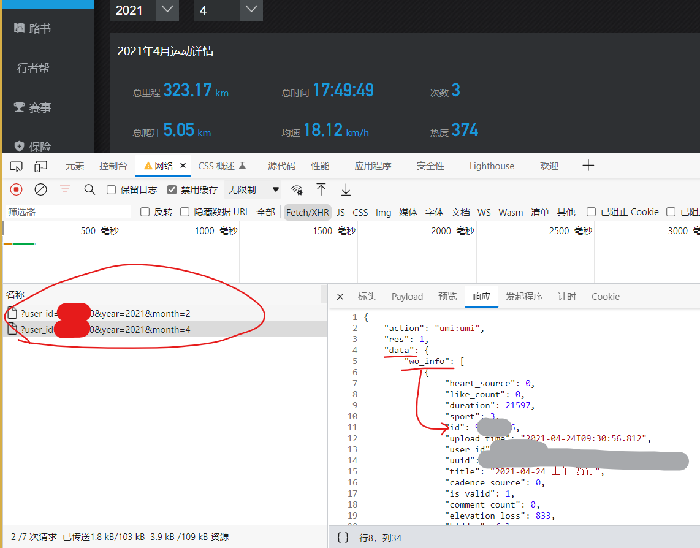
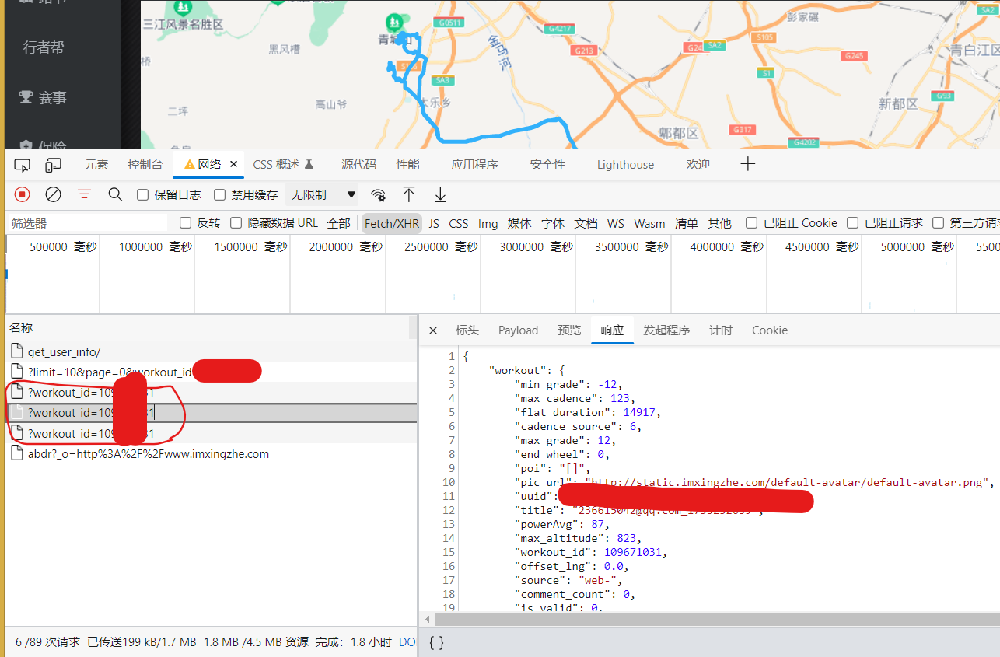
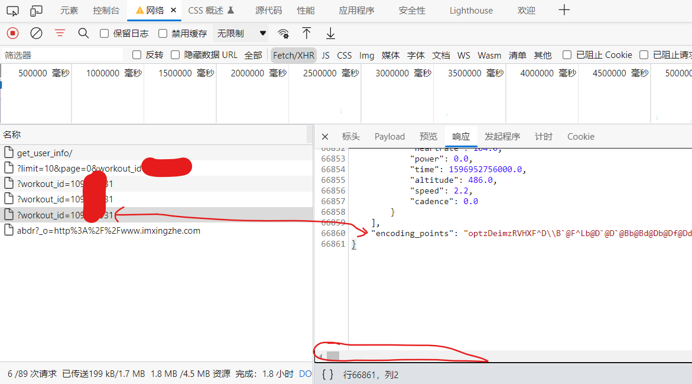
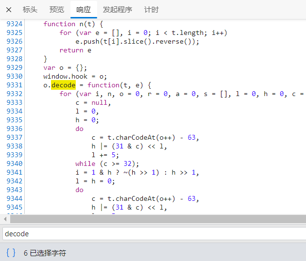
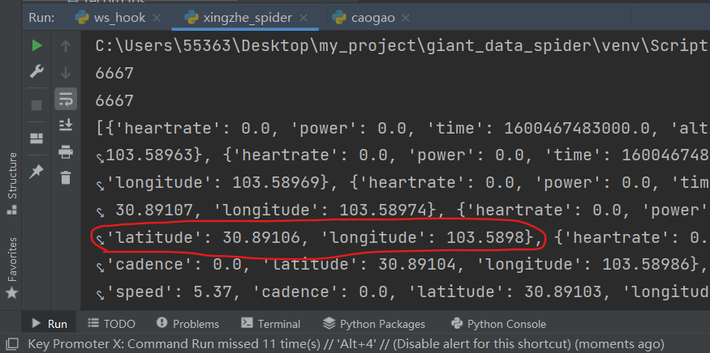

## 使用RPC技术hook web端JS

## 骑行app某者web端爬虫

2022.2

## 1.获取轨迹ID

通过更改年月,可以发现获取每个月轨迹ID 的方式,这个非常简单,只需要拷贝请求头headers就可以直接获取




## 2.获取轨迹详情

可以发现三个请求,其中,中间的那个获取的是轨迹的聚合信息,比如均速,总里程之类的




第三个请求获取的是轨迹点信息,但是我发现这个轨迹点信息没有包含经纬度?

最后在第三个请求的末尾,找到了一行未解码的字符串encoding_points,非常的长,看名字大概率是编码之后的经纬度信息,到这里,就必须要深入JS 查看是如何解码的了





## 3.逆向JS,查找解码方式

我查找`encoding_points` 只有一个JS 文件包含,点进去,定位到 encoding_points 处的代码,

发现是传值给了`decode()`的函数,于是定位到这个decode, 我是把整个JS文件拷进了IDEA去查找的

这个解码函数,并不复杂,都可以直接用python手写一遍,但是我这里采用了一种基于RPC思想的hook方式来解码

decode 函数上面的那行代码 `window.hook = o` 就是后面添加用来暴露 decode接口的

超详细教程(原理):	[RPC 技术及其框架 Sekiro 在爬虫逆向中的应用，加密数据一把梭！ ](https://mp.weixin.qq.com/s/9uKho4LY5fbrnHdJiPZ3KA)





## 4.准备 Sekiro

[virjar/sekiro: 基于长链接和代码注入的Android private API暴露框架 (github.com)](https://github.com/virjar/sekiro)

### windows 服务端

下载: [Go HTTP File Server (virjar.com)](https://oss.virjar.com/sekiro/sekiro-demo)

阿里云:https://www.aliyundrive.com/s/yybi9BWJ44K

运行: Windows：`bin/sekiro.bat`

### sekiro_web_client.js 上半部分

下载: [sekiro_web_client 上半部分(无需修改)](https://sekiro.virjar.com/sekiro-doc/assets/sekiro_web_client.js)

阿里云:https://www.aliyundrive.com/s/YpBvYrSSnNT

如果上面连接失效,文末附录收录有该上半部分代码:[sekiro_web_client 上半部分(无需修改)](#附: sekiro_web_client.js 上半部分)

### sekiro_web_client.js 下半部分

**需要按照实际情况修改**

#### 官方示例:

```js
function guid() {
    function S4() {
        return (((1+Math.random())*0x10000)|0).toString(16).substring(1);
    }
    return (S4()+S4()+"-"+S4()+"-"+S4()+"-"+S4()+"-"+S4()+S4()+S4());
}

var client = new SekiroClient("wss://sekiro.virjar.com/business/register?group=ws-group&clientId="+guid());

client.registerAction("clientTime",function(request, resolve, reject){
    resolve(""+new Date());
})
```

参数解释:

- wss 链接里，如果是免费版，要将 business 改成 `business-demo`，解释一下涉及到的名词：
- **group**：业务类型（接口组），每个业务一个 group，group 下面可以注册多个终端（SekiroClient），同时 group 可以挂载多个 Action；
- **clientId**：指代设备，多个设备使用多个机器提供 API 服务，提供群控能力和负载均衡能力；
- **SekiroClient**：服务提供者客户端，主要场景为手机/浏览器等。最终的 Sekiro 调用会转发到 SekiroClient。每个 client 需要有一个惟一的 clientId；
- **registerAction**：接口，同一个 group 下面可以有多个接口，分别做不同的功能；
- **resolve**：将内容传回给客户端的方法；
- **request**：客户端传过来的请求，如果请求里有多个参数，可以以键值对的方式从里面提取参数然后再做处理。

#### 实际示例

下面是该次示例的 sekiro_web_client.js 下半部分代码:

```js
function guid() {
        function S4() {
            return (((1 + Math.random()) * 0x10000) | 0).toString(16).substring(1);
        }

        return (S4() + S4() + "-" + S4() + "-" + S4() + "-" + S4() + "-" + S4() + S4() + S4());
    }

    const client_sekiro = new SekiroClient("ws://127.0.0.1:5620/business-demo/register?group=xing_zhe&clientId=" + guid());

    client_sekiro.registerAction("decode", function (request, resolve, reject) {
        resolve(window.hook.decode(request['encoding_points']));
    })
```

#### 各参数详解:

const client_sekiro = new SekiroClient(url: 

- 端口号5620是默认的,如需修改,需要修改服务端 Sekiro\conf\config.properties 文件.
- 免费版 是 business-demo
- group 是分组名称,需要自定义,后面python调用接口时需要传入这个名称

client_sekiro.registerAction( :

- 第一个参数 'decode' 是给注册的方法取一个名字,后面python调用接口时需要传入这个名字,需要自定义
- resolve() 这里的参数视情况而定:
    1. 想要调用的函数,在这里可以直接调用,那么就直接调用
    2. 不能直接调用,就需要去源JS代码中,将这个接口暴露出来,这里再去调用,暴露接口的方式我采用的是: window.hook = 调用函数的对象,[详情查看](#3.逆向JS,查找解码方式)
- request['encoding_points'] 这里的 encoding_points 是调用函数时传入的参数,无论python爬虫选择get 或 post 的方式传参,这里取得该参数的方式保持不变


## 5.向网站中添加hook

[如何在web的JS中注入Hook](./在网页的JS中注入Hook.md)

直接在 js源文件的最后 添加以下代码,然后`CTRL + S`保存

```js
(function (){
    // 这里拷贝 sekiro_web_client.js 上半部分
    
    // 这里拷贝 sekiro_web_client.js 修改好的下半部分
    // 考虑是否需要暴露接口 查看: 各参数详解 -> resolve() 
    
})();
```

## 6.测试数据

此时刷新一遍网页

然后编写python文件对该hook进行验证:

```python
import requests


host = ''
headers = {}

def parse_encoding_points(encoding_points):
    """
        向 Sekiro的服务端 发送请求,获取hook接口返回的数据
    :param encoding_points:
    :return:
    """
    params = {
        'group': 'xing_zhe',
        'action': 'decode',
    }
    url = 'http://127.0.0.1:5620/business-demo/invoke'

    res = requests.post(url=url, params=params, data={'encoding_points': encoding_points}).json()
    points = res['data']	# 获取前端hook返回的数据
    print(len(points))
    return points


def get_points(workout_id):
    """
        获取轨迹点数据
    :param workout_id: 轨迹ID
    :return:
    """
    url = f'{host}/api/v4/segment_points/?workout_id={workout_id}'
    res = requests.get(url=url, headers=headers).json()
    points = res['points']
    print(len(points))
    points_gps = parse_encoding_points(res['encoding_points'])
    for i, p in enumerate(points):
        p['latitude'], p['longitude'] = points_gps[i]

    return points


if __name__ == '__main__':
    print(get_points(XXXXXX))
```


可以看到,在经纬度已经被解析出来了





## 附: sekiro_web_client.js 上半部分

```js
/*
  Copyright (C) 2020 virjar <virjar@virjar.com> for https://github.com/virjar/sekiro

  Redistribution and use in source and binary forms, with or without
  modification, are permitted provided that the following conditions are met:

    * Redistributions of source code must retain the above copyright
      notice, this list of conditions and the following disclaimer.
    * Redistributions in binary form must reproduce the above copyright
      notice, this list of conditions and the following disclaimer in the
      documentation and/or other materials provided with the distribution.

  THIS SOFTWARE IS PROVIDED BY THE COPYRIGHT HOLDERS AND CONTRIBUTORS "AS IS"
  AND ANY EXPRESS OR IMPLIED WARRANTIES, INCLUDING, BUT NOT LIMITED TO, THE
  IMPLIED WARRANTIES OF MERCHANTABILITY AND FITNESS FOR A PARTICULAR PURPOSE
  ARE DISCLAIMED. IN NO EVENT SHALL <COPYRIGHT HOLDER> BE LIABLE FOR ANY
  DIRECT, INDIRECT, INCIDENTAL, SPECIAL, EXEMPLARY, OR CONSEQUENTIAL DAMAGES
  (INCLUDING, BUT NOT LIMITED TO, PROCUREMENT OF SUBSTITUTE GOODS OR SERVICES;
  LOSS OF USE, DATA, OR PROFITS; OR BUSINESS INTERRUPTION) HOWEVER CAUSED AND
  ON ANY THEORY OF LIABILITY, WHETHER IN CONTRACT, STRICT LIABILITY, OR TORT
  (INCLUDING NEGLIGENCE OR OTHERWISE) ARISING IN ANY WAY OUT OF THE USE OF
  THIS SOFTWARE, EVEN IF ADVISED OF THE POSSIBILITY OF SUCH DAMAGE.
*/


function SekiroClient(wsURL) {
    this.wsURL = wsURL;
    this.handlers = {};
    this.socket = {};
    // check
    if (!wsURL) {
        throw new Error('wsURL can not be empty!!')
    }
    this.webSocketFactory = this.resolveWebSocketFactory();
    this.connect()
}

SekiroClient.prototype.resolveWebSocketFactory = function () {
    if (typeof window === 'object') {
        var theWebSocket = window.WebSocket ? window.WebSocket : window.MozWebSocket;
        return function (wsURL) {

            function WindowWebSocketWrapper(wsURL) {
                this.mSocket = new theWebSocket(wsURL);
            }

            WindowWebSocketWrapper.prototype.close = function () {
                this.mSocket.close();
            };

            WindowWebSocketWrapper.prototype.onmessage = function (onMessageFunction) {
                this.mSocket.onmessage = onMessageFunction;
            };

            WindowWebSocketWrapper.prototype.onopen = function (onOpenFunction) {
                this.mSocket.onopen = onOpenFunction;
            };
            WindowWebSocketWrapper.prototype.onclose = function (onCloseFunction) {
                this.mSocket.onclose = onCloseFunction;
            };

            WindowWebSocketWrapper.prototype.send = function (message) {
                this.mSocket.send(message);
            };

            return new WindowWebSocketWrapper(wsURL);
        }
    }
    if (typeof weex === 'object') {
        // this is weex env : https://weex.apache.org/zh/docs/modules/websockets.html
        try {
            console.log("test webSocket for weex");
            var ws = weex.requireModule('webSocket');
            console.log("find webSocket for weex:" + ws);
            return function (wsURL) {
                try {
                    ws.close();
                } catch (e) {
                }
                ws.WebSocket(wsURL, '');
                return ws;
            }
        } catch (e) {
            console.log(e);
            //ignore
        }
    }
    //TODO support ReactNative
    if (typeof WebSocket === 'object') {
        return function (wsURL) {
            return new theWebSocket(wsURL);
        }
    }
    // weex 鍜� PC鐜鐨剋ebsocket API涓嶅畬鍏ㄤ竴鑷达紝鎵€浠ュ仛浜嗘娊璞″吋瀹�
    throw new Error("the js environment do not support websocket");
};

SekiroClient.prototype.connect = function () {
    console.log('sekiro: begin of connect to wsURL: ' + this.wsURL);
    var _this = this;
    // 涓峜heck close锛岃
    // if (this.socket && this.socket.readyState === 1) {
    //     this.socket.close();
    // }
    try {
        this.socket = this.webSocketFactory(this.wsURL);
    } catch (e) {
        console.log("sekiro: create connection failed,reconnect after 2s");
        setTimeout(function () {
            _this.connect()
        }, 2000)
    }

    this.socket.onmessage(function (event) {
        _this.handleSekiroRequest(event.data)
    });

    this.socket.onopen(function (event) {
        console.log('sekiro: open a sekiro client connection')
    });

    this.socket.onclose(function (event) {
        console.log('sekiro: disconnected ,reconnection after 2s');
        setTimeout(function () {
            _this.connect()
        }, 2000)
    });
};

SekiroClient.prototype.handleSekiroRequest = function (requestJson) {
    console.log("receive sekiro request: " + requestJson);
    var request = JSON.parse(requestJson);
    var seq = request['__sekiro_seq__'];

    if (!request['action']) {
        this.sendFailed(seq, 'need request param {action}');
        return
    }
    var action = request['action'];
    if (!this.handlers[action]) {
        this.sendFailed(seq, 'no action handler: ' + action + ' defined');
        return
    }

    var theHandler = this.handlers[action];
    var _this = this;
    try {
        theHandler(request, function (response) {
            try {
                _this.sendSuccess(seq, response)
            } catch (e) {
                _this.sendFailed(seq, "e:" + e);
            }
        }, function (errorMessage) {
            _this.sendFailed(seq, errorMessage)
        })
    } catch (e) {
        console.log("error: " + e);
        _this.sendFailed(seq, ":" + e);
    }
};

SekiroClient.prototype.sendSuccess = function (seq, response) {
    var responseJson;
    if (typeof response == 'string') {
        try {
            responseJson = JSON.parse(response);
        } catch (e) {
            responseJson = {};
            responseJson['data'] = response;
        }
    } else if (typeof response == 'object') {
        responseJson = response;
    } else {
        responseJson = {};
        responseJson['data'] = response;
    }


    if (Array.isArray(responseJson)) {
        responseJson = {
            data: responseJson,
            code: 0
        }
    }

    if (responseJson['code']) {
        responseJson['code'] = 0;
    } else if (responseJson['status']) {
        responseJson['status'] = 0;
    } else {
        responseJson['status'] = 0;
    }
    responseJson['__sekiro_seq__'] = seq;
    var responseText = JSON.stringify(responseJson);
    console.log("response :" + responseText);
    this.socket.send(responseText);
};

SekiroClient.prototype.sendFailed = function (seq, errorMessage) {
    if (typeof errorMessage != 'string') {
        errorMessage = JSON.stringify(errorMessage);
    }
    var responseJson = {};
    responseJson['message'] = errorMessage;
    responseJson['status'] = -1;
    responseJson['__sekiro_seq__'] = seq;
    var responseText = JSON.stringify(responseJson);
    console.log("sekiro: response :" + responseText);
    this.socket.send(responseText)
};

SekiroClient.prototype.registerAction = function (action, handler) {
    if (typeof action !== 'string') {
        throw new Error("an action must be string");
    }
    if (typeof handler !== 'function') {
        throw new Error("a handler must be function");
    }
    console.log("sekiro: register action: " + action);
    this.handlers[action] = handler;
    return this;
};

```

