# **面向对象 Object Oriented**

## **概述**

### **面向过程**

1. 分析出解决问题的步骤，然后逐步实现。

    例如：婚礼筹办

    -- 发请柬（选照片、措词、制作）

    -- 宴席（场地、找厨师、准备桌椅餐具、计划菜品、购买食材）

    -- 婚礼仪式（定婚礼仪式流程、请主持人）

2. 公式：程序 = 算法 + 数据结构

3. 优点：所有环节、细节自己掌控。

4. 缺点：考虑所有细节，工作量大。 

### **面向对象**

1. 找出解决问题的人，然后分配职责。

    例如：婚礼筹办

    -- 发请柬：找摄影公司（拍照片、制作请柬）

    -- 宴席：找酒店（告诉对方标准、数量、挑选菜品） 

    -- 婚礼仪式：找婚庆公司（对方提供司仪、制定流程、提供设备、帮助执行）

2. 公式：程序 = 对象 + 交互

3. 优点

    (1) 思想层面：

    -- 可模拟现实情景，更接近于人类思维。

    -- 有利于梳理归纳、分析解决问题。

    (2) 技术层面：

    -- 高复用：对重复的代码进行封装，提高开发效率。

    -- 高扩展：增加新的功能，不修改以前的代码。

    -- 高维护：代码可读性好，逻辑清晰，结构规整。

4. 缺点：学习曲线陡峭。

## **类和对象**

**类和对象**
  					现实事物 -抽象化-> *类* -实例化-> 对象

1. 类：一个抽象的概念，即生活中的”类别”。

2. 对象：类的具体实例，即归属于某个类别的”个体”。

3. 类是创建对象的”模板”。

    -- 数据成员：名词类型的状态。

    -- 方法成员：动词类型的行为。

4. 类与类行为不同，对象与对象数据不同。

    有行为需要承担，才创建类

### **语法**

#### **定义类**

1. 代码

    ```python
    class 类名:
        """文档说明"""
    	def _init_(self,参数列表):
            self.实例变量 = 参数
        方法成员
    ```

2. 说明

    -- 类名所有单词首字母大写 >>>	MyObject

    -- _init_ 也叫构造函数，创建对象时被调用，也可以省略。

    -- self 变量绑定的是被创建的对象，名称可以随意。

#### **创建对象(实例化)**

变量 = 构造函数 (参数列表)

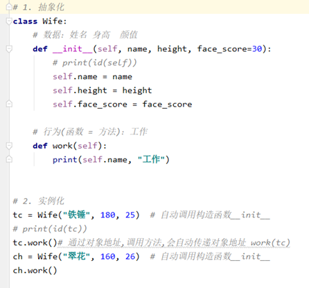

## **实例成员**

### **实例变量**

1. 语法

    (1) 定义：对象.变量名 = \***

    (2) 调用：对象.变量名 

2. 说明

    (1) 首次通过对象赋值为创建，再次赋值为修改.

    ```python
    w01 = Wife()
    
    w01.name = “丽丽”
    
    w01.name = “莉莉”
    ```

    (2) 通常在构造函数(_init_)中创建。

    ```python
    w01 = Wife(“丽丽”,24)
    
    print(w01.name)
    ```

    (3) 每个对象存储一份，通过对象地址访问。

 

3. 作用：描述某个对象的数据。

4. \__dict__：对象的属性，用于存储自身实例变量的字典。

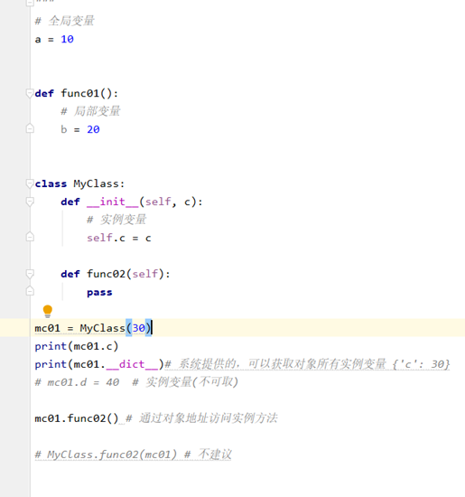

### **实例方法**

1. 语法

    (1) 定义： 

    ```python
    def 方法名称(self, 参数列表):
        方法体
    ```

    (2) 调用： 对象地址.实例方法名(参数列表)

    ​     不建议通过类名访问实例方法

2. 说明

    (1) 至少有一个形参，第一个参数绑定调用这个方法的对象,一般命名为"self"。

    (2) 无论创建多少对象，方法只有一份，并且被所有对象共享。

3. 作用：表示对象行为。

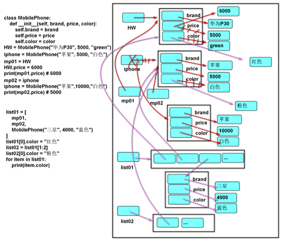

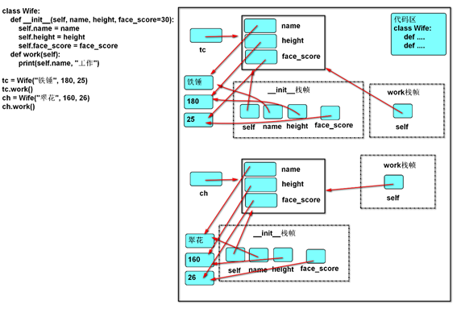

## **类成员**

### **类变量**

1. 语法

    (1) 定义：在类中，方法外定义变量。

    ```python
    class 类名:
        变量名 = 表达式
    ```

    (2) 调用：类名.变量名

       	不建议通过对象访问类变量

2. 说明

    (1) 存储在类中。实例化类之前，类变量就已经存在了

    (2) 只有一份，被所有对象共享。

    <font color='red'>类似于“全局变量”</font>

3. 作用：描述所有对象的共有数据。

### **类方法**

1. 语法

    (1) 定义：

    ```python
    class 类名:
    	@classmethod
    	def 方法名称(cls,参数列表):
    		方法体
    ```

    (2) 调用：类名.方法名(参数列表) 

       	不建议通过对象访问类方法

2. 说明

    (1) 至少有一个形参，第一个形参用于绑定类，一般命名为'cls'

    (2) 使用@classmethod修饰的目的是调用类方法时可以隐式传递类。

    (3) 类方法中不能访问实例成员，实例方法中可以访问类成员。

3. 作用：操作类变量。

示例：

```python
class ICBC:
   """
     工商银行
   """
   # 类变量：总行的钱
	total_money = 1000000
 
   # 类方法：对类变量的操作
   @classmethod
   def print_total_money(cls):
   		# print("工商银行的钱:", ICBC.total_money)
     	print("工商银行的钱:", cls.total_money)
 
   def __init__(self, name, money=0):
        # 实例变量：每个银行的信息
        self.name = name
     	self.money = money
     	ICBC.total_money -= money
 
 
 xd = ICBC("西单支行", 500000)
 trt = ICBC("陶然亭支行", 400000)
 # print("总行的钱,还有:", ICBC.total_money) # 建议通过类访问
ICBC.print_total_money()# print_total_money(ICBC)
 
# print("总行的钱,还有:",xd.total_money) # 不建议通过对象访问
# print("总行的钱,还有:",trt.total_money)
```

 

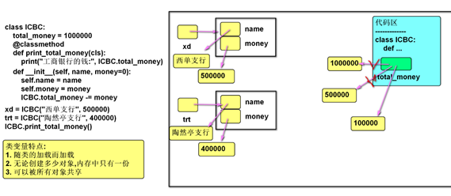

## **静态方法**

1. 语法

    (1) 定义：

    ```python
    class 类名:
    	@staticmethod
    	def 方法名称(参数列表):
        	方法体
    ```

    (2) 调用：类名.方法名(参数列表) 

       	不建议通过对象访问静态方法

2. 说明

    (1) 使用@ staticmethod修饰的目的是该方法不需要隐式传参数。

    (2) <font color='red'>静态方法不能访问实例成员和类成员</font>

3. 作用：<font color='red'>定义常用的工具函数。</font>

# **三大特征**

## **封装    >>>> 找到变化点创建类**

### **数据角度讲**

1. 定义：

    将一些基本数据类型复合成一个自定义类型。

2. 优势：

       将数据与对数据的操作相关联。
       
       代码可读性更高（类是对象的模板）。

### **行为角度讲**

1. 定义：

    类外提供必要的功能，隐藏实现的细节。

2. 优势：

    简化编程，使用者不必了解具体的实现细节，只需要调用对外提供的功能。

3. 私有成员：

    (1)  作用：无需向类外提供的成员，可以通过私有化进行屏蔽。

    (2)  做法：命名使用双下划线开头。

    (3)  本质：障眼法，实际也可以访问。

    <font color='red'>私有成员的名称被修改为：\_类名\_\_成员名，可以通过\_dict_属性或dir函数查看。</font>

    ```python
    class MyObject:
        def __init__(self):
            self.a = 5
            self.__b = 10
    
    
    x = MyObject()
    print(x.a)	# 5
    print(x.__b)	# AttributeError: 'MyObject' object has no attribute '__b'
    
    # 强行访问
    print(x._MyObject__b)	# 10
    ```

    注：尽量少使用双下划线开头的私有成员，可以将其替换为 单下划线 开头[protected]的属性

4. 属性@property：

    公开的实例变量，缺少逻辑验证。私有的实例变量与两个公开的方法相结合，又使调用者的操作略显复杂。而属性可以将两个方法的使用方式像操作变量一样方便。

      定义一个和实例变量同名的类变量，用以拦截所有指向该实例变量的操作（读取）（修改），再定义一个和该实例变量（__同名）的私有变量，以传递符合要求的数据

    原理步骤如下

    *# 1.* *创建类变量**(**与实例变量名称相同**)
     \# 2.* *创建属性**(property**对象**)
     \# 3.* *创建读取方法*
    *# 4.* *创建写入方法*

    (1) 定义：

    ```python
    @property
    def 属性名(self):
        return self.__属性名
    
    @属性名.setter
    def 属性名(self, value):
        self.__属性名= value
    ```

    (2) 调用：

    ​	对象.属性名 = 数据

    ​	变量 = 对象.属性名

    (3) 说明：

    ​	通常两个公开的属性，保护一个私有的变量。

     	@property 负责读取，@属性名.setter 负责写入
     	
     	只写：属性名= property(None, 写入方法名)

<font color='red'>创建属性快捷方法</font>

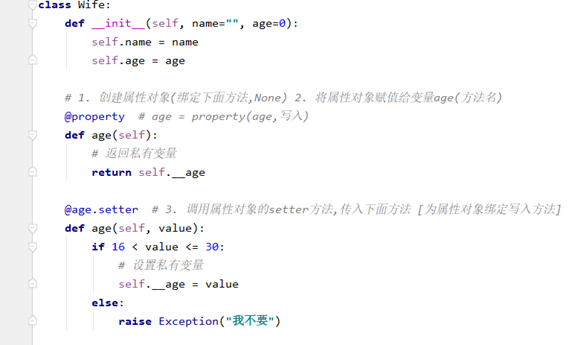

### **设计角度讲**

**类与类之间的关联程度小为好**

1. 定义：

    (1) 分而治之

    ​		将一个大的需求分解为许多类，每个类处理一个独立的功能。 

    (2) 变则疏之

    ​		变化的地方独立封装，避免影响其他类。

    ​		变化点——>创建类   类与类行为不同，但是数据的不同让对象去区分

     (3) 高 内 聚

    ​		类中各个方法都在完成一项任务(单一职责的类)。

    ​		比如核心算法类，只做计算，不管界面  分工之后才能专注

    (4) 低 耦 合 

    ​		类与类的关联性与依赖度要低(每个类独立)，让一个类的改变，尽少影响其他类。

2. 优势：

    便于分工，便于复用，可扩展性强。

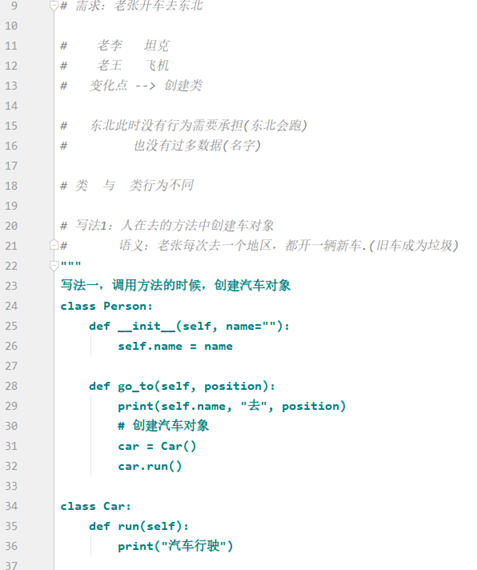

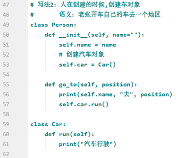

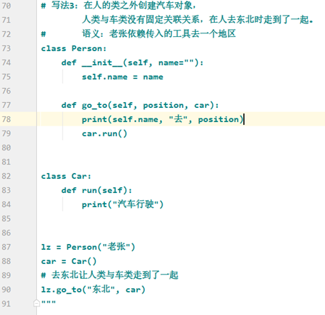

## **继承  >>>>统一概念，隔离变化**

### **继承方法**

1. 代码:

    ```python
    class 父类:
        def 父类方法(self):
            方法体
            
            
    class 子类(父类):
        def 子类方法(self):
            方法体
    
     
    
    儿子 = 子类()
    
    儿子.子类方法()
    
    儿子.父类方法()
    ```

 

2. 说明：

    子类直接拥有父类的方法.

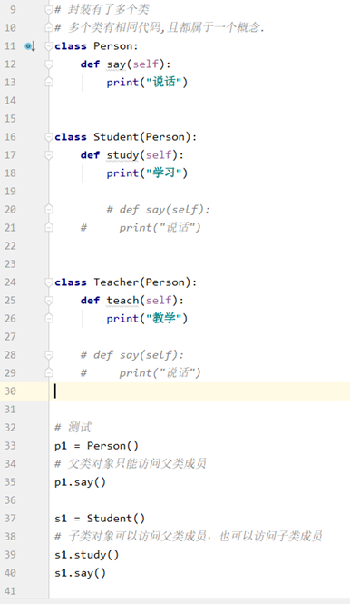

### **内置函数**

isinstance(对象, 类型) 

返回指定对象是否是某个类的对象。

issubclass(类型，类型)

返回指定类型是否属于某个类型。

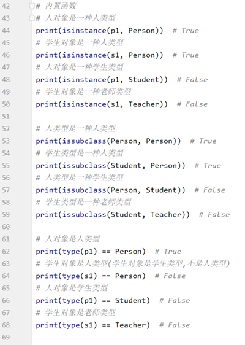

### **继承数据**

1. 代码

    ```python
    class 子类(父类):
        def __init__(self,参数列表):
            super().__init__(参数列表)
            self.自身实例变量 = 参数
    ```

2. 说明

    子类如果没有构造函数，创建对象时将自动执行父类的，但如果有构造函数将覆盖父类的。此时必须通过super()函数调用父类的构造函数，以确保父类实例变量被正常创建。

    ```python
    """
    如果子类没有构造函数,创建对象时使用父类的构造函数
     class Student(Person):
       pass
     
     s01 = Student("zs")
     print(s01.name)
    """
    
     
    
    # 如果子类有构造函数,创建对象时使用子类的构造函数（子类覆盖了父类函数,好像它不存在）
    # 子类必须通过 super() 调用父类构造函数(注意：给父类构造函数传递信息)
    # 子类构造函数的参数：父类需要的信息,子类需要的信息
    
     
    
    class Student(Person):
        def __init__(self, name="", score=0):
            # self.name = name
            super().__init__(name)
            self.score = score
            # 通过 super() 访问父类成员
     
     
    s01 = Student("王鹏鹏", 59)
     print(s01.name)
     print(s01.score)
    ```

 

### **定义**

重用现有类的功能，并在此基础上进行扩展。

说明：子类直接具有父类的成员（共性），还可以扩展新功能。

#### **优点**

一种代码复用的方式。

#### **缺点**

耦合度高：父类的变化，直接影响子类。

### **相关概念**

父类（基类、超类）、子类（派生类）。

父类相对于子类更抽象，范围更宽泛；子类相对于父类更具体，范围更狭小。

单继承：父类只有一个（例如 Java，C#）。

多继承：父类有多个（例如C++，Python）。

Object类：任何类都直接或间接继承自 object 类。

#### **多继承**

```python
"""
    多继承
        同名方法解析顺序
        继承在于隔离变化，多继承在于隔离多个变化
        (有多个客户端,需要在业务需求中通过继承统一一个类型的行为).
"""

一个子类继承两个或两个以上的基类，父类中的属性和方法同时被子类继承下来。
同名方法的解析顺序（MRO， Method Resolution Order）:
类自身 --> 父类继承列表（由左至右）--> 再上层父类
       A
      / \
     /   \
    B     C
     \   /
      \ /
       D 
类名.mro( )
返回同名方法解析顺序
class A:
    def func01(self):
        print("A -- func01")


class B(A):
    def func01(self):
        print("B -- func01")


class C(A):
    def func01(self):
        print("C -- func01")


class D(B, C):
    def func01(self):
        print("D -- func01")
        super().func01()  # B
        C.func01(self)  # 如果希望调用父类其他同名方法,需要通过类名调用(传递对象)

```

## **多态**

### **定义**

父类的同一种动作或者行为，在不同的子类上有不同的实现。

### **重写**

子类实现了父类中相同的方法（方法名、参数）。

在调用该方法时，实际执行的是子类的方法。

**快捷键**

​		Ctrl + O

**内置可重写函数**

​		Python中，以双下划线开头、双下划线结尾的是系统定义的成员。我们可以在自定义类中进行重写，从而改变其行为。

#### **转换字符串**

​		\__str__函数：将对象转换为字符串(对人友好的)

​		\__repr__函数：将对象转换为字符串(解释器可识别的)

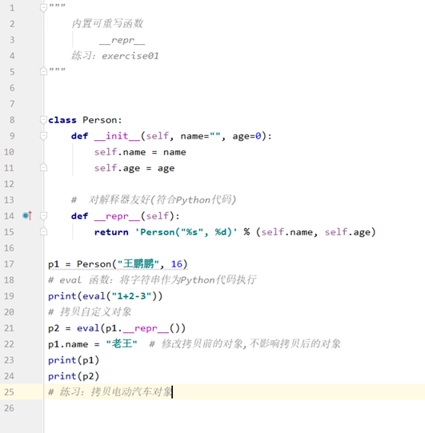

#### **运算符重载**

定义：让自定义的类生成的对象(实例)能够使用运算符进行操作。

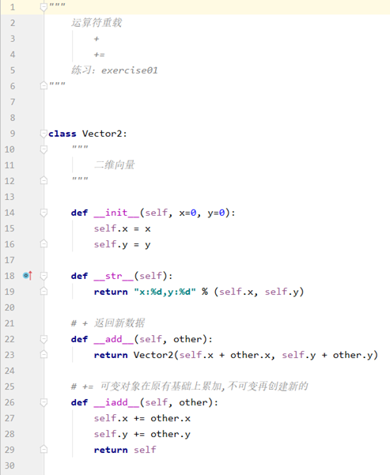

##### **算数运算符**

<font color='red'>**Add  本质是加完之后返回新的数据**</font>

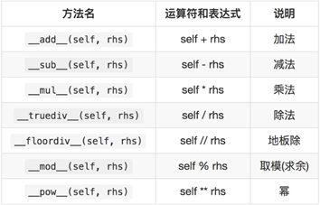

##### **复合运算符重载**

<font color='red'>**Iadd** **本质是在可变对象在原有的基础上累加，加完后id与原有的一样，不可变对象再创建新的**</font>

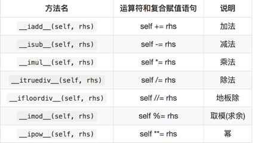

##### **比较运算重载**

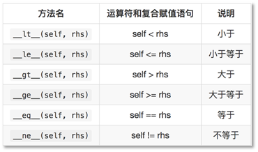

# **设计原则**

## **开-闭原则（目标、总的指导思想）**

<font color='red'>**O**</font>pen **<font color='red'>C</font>**losed **<font color='red'>P</font>**rinciple

对扩展开放，对修改关闭。

增加新功能，不改变原有代码。

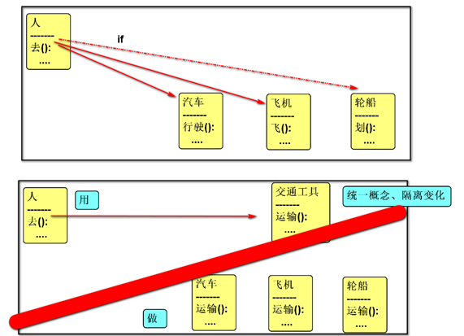

## **类的单一职责（一个类的定义）**

**<font color='red'>S</font>**ingle **<font color='red'>R</font>**esponsibility **<font color='red'>P</font>**rinciple 

一个类有且只有一个改变它的原因。

## **依赖倒置（依赖抽象）**

**<font color='red'>D</font>**ependency **<font color='red'>I</font>**nversion **<font color='red'>P</font>**rinciple

客户端代码(调用的类)尽量依赖(使用)抽象。

抽象不应该依赖细节，细节应该依赖抽象。

## **组合复用原则（复用的最佳实践）**

**<font color='red'>C</font>**omposite **<font color='red'>R</font>**euse **<font color='red'>P</font>**rinciple

如果仅仅为了代码复用优先选择组合复用，而非继承复用。

组合的耦合性相对继承低。

以变量来调用就是组合复用

关联变化点

## **里氏替换（继承后的重写，指导继承的设计）**

**<font color='red'>L</font>**iskov **<font color='red'>S</font>**ubstitution **<font color='red'>P</font>**rinciple

父类出现的地方可以被子类替换，在替换后依然保持原功能。

子类要拥有父类的所有功能。

子类在重写父类方法时，尽量选择扩展重写，防止改变了功能。

子类重写父类方法时，保留super()那一行

 

## **迪米特法则（类与类交互的原则）**

**<font color='red'>L</font>**aw **<font color='red'>O</font>**f **<font color='red'>D</font>**emeter

不要和陌生人说话。

类与类交互时，在满足功能要求的基础上，传递的数据量越少越好。因为这样可能降低耦合度。

 ```python
 """
     技能系统
         三大特征：
             封装(分)：创建了技能释放器SkillDeployer和具体影响效果(DamageEffect、DizzinessEffect、LowerDeffenseEffect)
             继承(隔)：创建了技能影响效果SkillImpactEffect,抽象(统一)具体影响效果
             多态(做)：技能释放器SkillDeployer调用技能影响效果SkillImpactEffect,具体影响效果进行重写,
                  根据配置文件,动态(运行时)创建具体影响效果对象.
         设计原则：
             开闭原则：当增加新影响效果算法,技能释放器SkillDeployer不变
             单一职责：
                 DamageEffect：负责处理伤害生命算法
                 DizzinessEffect：负责眩晕算法
                 SkillDeployer：负责技能释放(创建和执行影响效果对象)
             依赖倒置(用谁?)：技能释放器SkillDeployer调用技能影响效果SkillImpactEffect,没有调用具体影响效果.
             组合复用(用法?)：技能释放器SkillDeployer与影响效果算法是组合关系
             里氏替换：重写时通过super()调用了父类方法
             迪米特：技能释放器SkillDeployer与各种影响效果低耦合。
         优势：
             增加新技能,代码无需改变.  -->  体现正确分析了需求中行为的变化
             某个技能所需要的影响算法改变,代码无需改变. --> 体现了依赖注入(修改配置文件)
             某个影响算法改变,不影响其他代码 --> 体现迪米特
             增加影响算法,增加新类型,不影响其他代码 --> 体现开闭原则
 """
 
 ```

 