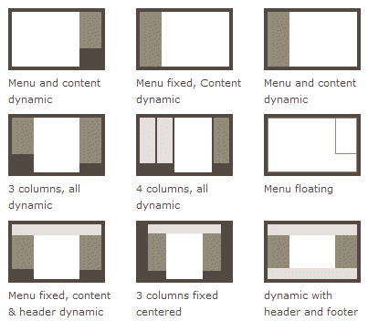
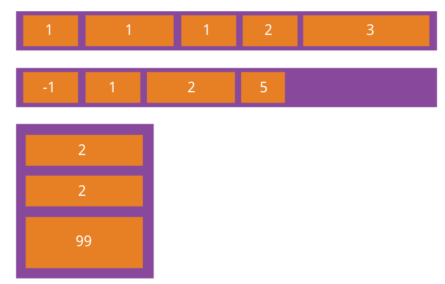

# Flex 布局教程：语法篇

作者： [阮一峰](https://www.ruanyifeng.com/)

日期： [2015年7月10日](https://www.ruanyifeng.com/blog/2015/07/)

网页布局（layout）是 CSS 的一个重点应用。



布局的传统解决方案，基于[盒状模型](https://developer.mozilla.org/en-US/docs/Web/CSS/box_model)，依赖 [`display`](https://developer.mozilla.org/en-US/docs/Web/CSS/display) 属性 + [`position`](https://developer.mozilla.org/en-US/docs/Web/CSS/position)属性 + [`float`](https://developer.mozilla.org/en-US/docs/Web/CSS/float)属性。它对于那些特殊布局非常不方便，比如，[垂直居中](https://css-tricks.com/centering-css-complete-guide/)就不容易实现。


2009年，W3C 提出了一种新的方案----Flex 布局，可以简便、完整、响应式地实现各种页面布局。目前，它已经得到了所有浏览器的支持，这意味着，现在就能很安全地使用这项功能。


Flex 布局将成为未来布局的首选方案。本文介绍它的语法，[下一篇文章](https://www.ruanyifeng.com/blog/2015/07/flex-examples.html)给出常见布局的 Flex 写法。网友 [JailBreak](http://vgee.cn/) 为本文的所有示例制作了 [Demo](http://static.vgee.cn/static/index.html)，也可以参考。

以下内容主要参考了下面两篇文章：[A Complete Guide to Flexbox](https://css-tricks.com/snippets/css/a-guide-to-flexbox/) 和 [A Visual Guide to CSS3 Flexbox Properties](https://scotch.io/tutorials/a-visual-guide-to-css3-flexbox-properties)。

## 一、Flex 布局是什么？

Flex 是 Flexible Box 的缩写，意为"弹性布局"，用来为盒状模型提供最大的灵活性。

任何一个容器都可以指定为 Flex 布局。

> ```css
> .box{
>   display: flex;
> }
> ```

行内元素也可以使用 Flex 布局。

> ```css
> .box{
>   display: inline-flex;
> }
> ```

Webkit 内核的浏览器，必须加上`-webkit`前缀。

> ```css
> .box{
>   display: -webkit-flex; /* Safari */
>   display: flex;
> }
> ```

注意，设为 Flex 布局以后，子元素的`float`、`clear`和`vertical-align`属性将失效。

## 二、基本概念

采用 Flex 布局的元素，称为 Flex 容器（flex container），简称"容器"。它的所有子元素自动成为容器成员，称为 Flex 项目（flex item），简称"项目"。


容器默认存在两根轴：水平的主轴（main axis）和垂直的交叉轴（cross axis）。主轴的开始位置（与边框的交叉点）叫做`main start`，结束位置叫做`main end`；交叉轴的开始位置叫做`cross start`，结束位置叫做`cross end`。

项目默认沿主轴排列。单个项目占据的主轴空间叫做`main size`，占据的交叉轴空间叫做`cross size`。

## 三、容器的属性

以下6个属性设置在容器上。

> - flex-direction
> - flex-wrap
> - flex-flow
> - justify-content
> - align-items
> - align-content

### 3.1 flex-direction属性

`flex-direction`属性决定主轴的方向（即项目的排列方向）。

> ```css
> .box {
>   flex-direction: row | row-reverse | column | column-reverse;
> }
> ```


它可能有4个值。

> - `row`（默认值）：主轴为水平方向，起点在左端。
> - `row-reverse`：主轴为水平方向，起点在右端。
> - `column`：主轴为垂直方向，起点在上沿。
> - `column-reverse`：主轴为垂直方向，起点在下沿。

### 3.2 flex-wrap属性

默认情况下，项目都排在一条线（又称"轴线"）上。`flex-wrap`属性定义，如果一条轴线排不下，如何换行。


> ```css
> .box{
>   flex-wrap: nowrap | wrap | wrap-reverse;
> }
> ```

它可能取三个值。

（1）`nowrap`（默认）：不换行。


（2）`wrap`：换行，第一行在上方。


（3）`wrap-reverse`：换行，第一行在下方。


### 3.3 flex-flow

`flex-flow`属性是`flex-direction`属性和`flex-wrap`属性的简写形式，默认值为`row nowrap`。

> ```css
> .box {
>   flex-flow: <flex-direction> || <flex-wrap>;
> }
> ```

### 3.4 justify-content属性

`justify-content`属性定义了项目在主轴上的对齐方式。

> ```css
> .box {
>   justify-content: flex-start | flex-end | center | space-between | space-around;
> }
> ```


它可能取5个值，具体对齐方式与轴的方向有关。下面假设主轴为从左到右。

> - `flex-start`（默认值）：左对齐
> - `flex-end`：右对齐
> - `center`： 居中
> - `space-between`：两端对齐，项目之间的间隔都相等。
> - `space-around`：每个项目两侧的间隔相等。所以，项目之间的间隔比项目与边框的间隔大一倍。

### 3.5 align-items属性

`align-items`属性定义项目在交叉轴上如何对齐。

> ```css
> .box {
>   align-items: flex-start | flex-end | center | baseline | stretch;
> }
> ```


它可能取5个值。具体的对齐方式与交叉轴的方向有关，下面假设交叉轴从上到下。

> - `flex-start`：交叉轴的起点对齐。
> - `flex-end`：交叉轴的终点对齐。
> - `center`：交叉轴的中点对齐。
> - `baseline`: 项目的第一行文字的基线对齐。
> - `stretch`（默认值）：如果项目未设置高度或设为auto，将占满整个容器的高度。

### 3.6 align-content属性

`align-content`属性定义了多根轴线的对齐方式。如果项目只有一根轴线，该属性不起作用。

> ```css
> .box {
>   align-content: flex-start | flex-end | center | space-between | space-around | stretch;
> }
> ```


该属性可能取6个值。

> - `flex-start`：与交叉轴的起点对齐。
> - `flex-end`：与交叉轴的终点对齐。
> - `center`：与交叉轴的中点对齐。
> - `space-between`：与交叉轴两端对齐，轴线之间的间隔平均分布。
> - `space-around`：每根轴线两侧的间隔都相等。所以，轴线之间的间隔比轴线与边框的间隔大一倍。
> - `stretch`（默认值）：轴线占满整个交叉轴。

### 四、项目的属性

以下6个属性设置在项目上。

> - `order`
> - `flex-grow`
> - `flex-shrink`
> - `flex-basis`
> - `flex`
> - `align-self`

### 4.1 order属性

`order`属性定义项目的排列顺序。数值越小，排列越靠前，默认为0。

> ```css
> .item {
>   order: <integer>;
> }
> ```



### 4.2 flex-grow属性

`flex-grow`属性定义项目的放大比例，默认为`0`，即如果存在剩余空间，也不放大。

> ```css
> .item {
>   flex-grow: <number>; /* default 0 */
> }
> ```


如果所有项目的`flex-grow`属性都为1，则它们将等分剩余空间（如果有的话）。如果一个项目的`flex-grow`属性为2，其他项目都为1，则前者占据的剩余空间将比其他项多一倍。

如果只设置一个项目的`flex-grow`属性为1,那么该项目将填满父元素的剩余空间

### 4.3 flex-shrink属性

`flex-shrink`属性定义了项目的缩小比例，默认为1，即如果空间不足，该项目将缩小。

> ```css
> .item {
>   flex-shrink: <number>; /* default 1 */
> }
> ```


如果所有项目的`flex-shrink`属性都为1，当空间不足时，都将等比例缩小。如果一个项目的`flex-shrink`属性为0，其他项目都为1，则空间不足时，前者不缩小。

负值对该属性无效。

### 4.4 flex-basis属性

`flex-basis`属性定义了在分配多余空间之前，项目占据的主轴空间（main size）。浏览器根据这个属性，计算主轴是否有多余空间。它的默认值为`auto`，即项目的本来大小。

> ```css
> .item {
>   flex-basis: <length> | auto; /* default auto */
> }
> ```

它可以设为跟`width`或`height`属性一样的值（比如350px），则项目将占据固定空间。

### 4.5 flex属性

`flex`属性是`flex-grow`, `flex-shrink` 和 `flex-basis`的简写，默认值为`0 1 auto`。后两个属性可选。

> ```css
> .item {
>   flex: none | [ <'flex-grow'> <'flex-shrink'>? || <'flex-basis'> ]
> }
> ```

该属性有两个快捷值：`auto` (`1 1 auto`) 和 none (`0 0 auto`)。

建议优先使用这个属性，而不是单独写三个分离的属性，因为浏览器会推算相关值。

### 4.6 align-self属性

`align-self`属性允许单个项目有与其他项目不一样的对齐方式，可覆盖`align-items`属性。默认值为`auto`，表示继承父元素的`align-items`属性，如果没有父元素，则等同于`stretch`。

> ```css
> .item {
>   align-self: auto | flex-start | flex-end | center | baseline | stretch;
> }
> ```


该属性可能取6个值，除了auto，其他都与align-items属性完全一致。

（完）


### 文档信息

- 版权声明：自由转载-非商用-非衍生-保持署名（[创意共享3.0许可证](https://creativecommons.org/licenses/by-nc-nd/3.0/deed.zh)）
- 发表日期： 2015年7月10日


[Weibo](https://weibo.com/ruanyf) | [Twitter](https://twitter.com/ruanyf) | [GitHub](https://github.com/ruanyf)

Email: [yifeng.ruan@gmail.com](mailto:yifeng.ruan@gmail.com)