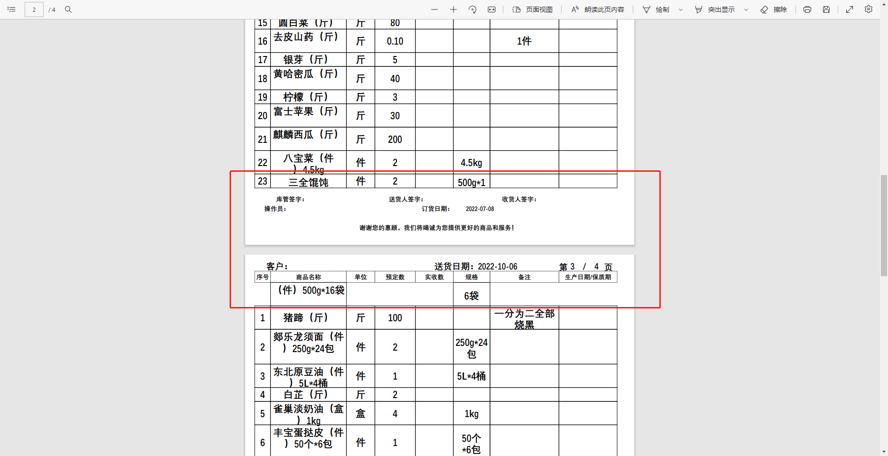
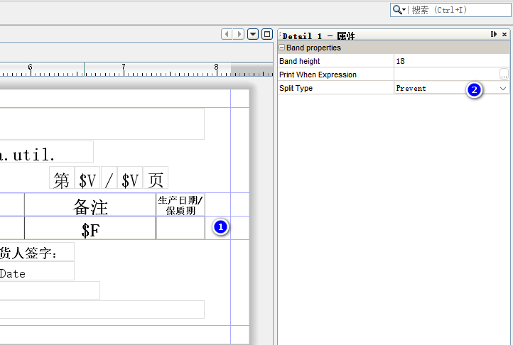
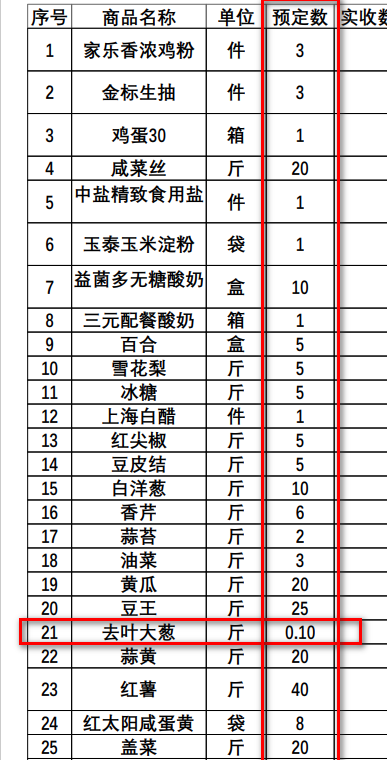
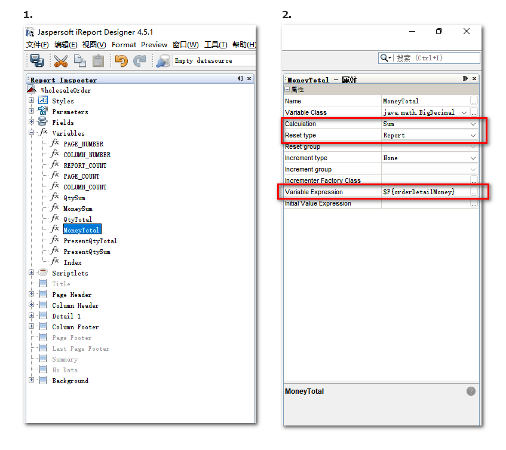

# Ireport 报表设计 基于Ireport 4.5.1

## Ireport 换行遇到分页时,一行会被拆分为两行(断行)




### 方式一：面板直接修改

**点击`detail`栏的空白处, 修改其 `Split Type`属性值为: `Prevent`**



> 如果方式一, 无法修改属性值,请使用方式二

### 方式二:  修改 XML 文件内容

进入xml 模式 -> 找到`Dtail 标签`下的 `band 标签` -> 为band 标签添加一个属性 `splitType="Prevent"`


## Ireport 数值列可以同时打印整数和小数

> 需求: 当原始数据的值都包含两位小数时, 需要将整数 以 整数的形式打印

### 方式一: 使用四舍五入判断是否为整数


```cmd
# 判断 bookDetailUseQty 是否等于其取整后的值, 如果相等,说明是整数, 就保留整数位.  如果不相等, 说明是小数, 则保留两位小数即可
$F{bookDetailUseQty}==$F{bookDetailUseQty}.intValue() ? $F{bookDetailUseQty}.setScale(0, BigDecimal.ROUND_HALF_UP):$F{bookDetailUseQty}.setScale(2, BigDecimal.ROUND_HALF_UP)
```



### 方式二: 面板直接设置

> 没找到设置方式


## Ireport Detail 序号分页之后连续

> 分页之后序号连续

1. 在 `Variables` 下新建一个变量,  更名叫 Index  (名字随意)
2. 调整该变量的属性:
   1. class: `java.lang.Integer`
   2. Calculation: `Count`
   3. Variable Expression: `$V{Index}.ValueOf(1)`  这里的 Index 对应第一步里取的名字
   4. initial Value Expression: `1`
3. 最后在面板中调用即可


## Ireport Last Page Footer 紧跟Detail

> Last Page Footer 和 Detail 之间的空隙, 是无法去掉的, 但是可以通过其他的方式来达到该效果的视觉目的

### 方案一:  使用Column Footer + 设置条件打印

1. 将 `Last Page Footer` 中的内容, 全部拷贝至 `Column Footer` 中
2. 全选这些只需要在最后一页打印的项
3. 修改其 `Print When Expression` 的值


`Print When Expression` 应返回一个布尔值, 当值为`True`时, 就会触发打印, 否则不打印

这里需要`Ireport 判断该页是否为最后一页`:

要达成这个判断, 需要一个非常取巧的方式:

页面中有一项是 `金额总合计: $V{MoneyTotal}.setScale(2, RoundingMode.HALF_UP)` 它的值是`变量 MoneyTotal`,

我们找到这个 MoneyTotal 观察它的属性:

可以发现, 这个变量是 整个报表对 `orderDtailMoney`的求和, 就是所有金额的总和,这个值是由报表自行计算的, 只有在最后一页末尾时,该值才会停止增长.




此时, 我们可以由后端传入一个参数`Parameters`, 其值为`金额总和`, 在我的示例模板中, 这个参数的名字是: `orderMoney`

然后当`orderMoney == MoneyTotal`时, 报表达到最后一页.

最后修改`Print When Expression`条件打印的值为:`$P{orderMoney}.setScale(2,BigDecimal.ROUND_HALF_UP) == $V{MoneyTotal}.setScale(2, BigDecimal.ROUND_HALF_UP)`


### 方案二: 浮动的 Last Page Footer

> 没找到设置方式

### 方案三: 使用 Summary 来达到效果

此方式要求不得启用 Column Footer 和 Page Footer ,

因为 Column Footer 和 Page Footer 在最后一页会出现在 Summary 的下方, 特别难看

## Ireport 字体大小动态缩放

> 当格子大小已经固定后, 需要动态缩放字体大小, 以免格子变形

1. 在Styles 下新建一个样式模板, `名字随意`, 我这里使用 item_name
1. 在新建的样式模板下, 新建多个`条件样式`, 我这里建了两个条件样式, 分别是字符长度 <11 和 >10 时的样式
1. 为这些条件样式分别设置`字体大小`(比如: size: 13/16), 和字体名称(比如:宋体)
1. 将需要动态缩放字体的格子的属性 Style: 选择第一步建立的样式模板


> 备注:  Ireport4.5.1 此时还不会生效,听说高版本的到这一步就ok了.

Ireport4.5.1 需要进入`xml`模板, 找到该格子的位置(建议,复制格子的内容函数, 在xml 中进行搜索)

找到之后, 删除该格子的 fontName 和 Size, 即可生效


